# 黑洞物理

> [!abstract] 概述
> 黑洞物理是==广义相对论==、==量子力学==和==热力学==的交汇点，代表了现代物理学最前沿的研究领域。从 1915 年爱因斯坦提出场方程，到 1916 年施瓦西得到精确解，再到 1970 年代霍金辐射的发现，黑洞物理经历了从纯经典理论到量子引力窗口的深刻转变。
> 
> 本笔记系统介绍黑洞热力学、霍金辐射、信息悖论、全息原理等核心概念，探讨黑洞如何成为检验量子引力理论的关键实验室。

## 专题地图

```mermaid
graph TD
    A[黑洞物理] --> B[黑洞热力学]
    A --> C[霍金辐射]
    A --> D[信息悖论]
    A --> E[黑洞互补性]
    A --> F[AdS/CFT对应]
    A --> G[火墙悖论]
    A --> H[前沿问题]
    
    B --> B1[经典力学定律]
    B --> B2[热力学四定律]
    B --> B3[贝肯斯坦-霍金熵]
    
    C --> C1[物理机制]
    C --> C2[推导思路]
    C --> C3[霍金温度]
    C --> C4[物理意义]
    
    D --> D1[问题提出]
    D --> D2[解决方案]
    D --> D3[全息原理]
    
    E --> E1[基本思想]
    E --> E2[Stretched Horizon]
    E --> E3[问题与挑战]
    
    F --> F1[基本概念]
    F --> F2[对黑洞的启示]
    F --> F3[熵的微观计算]
    
    G --> G1[AMPS论证]
    G --> G2[可能的解决]
    G --> G3[岛公式]
    
    H --> H1[黑洞内部]
    H --> H2[Fuzzball猜想]
    H --> H3[量子引力检验]
    
    class A,B,C,D,E,F,G,H,B1,B2,B3,C1,C2,C3,C4,D1,D2,D3,E1,E2,E3,F1,F2,F3,G1,G2,G3,H1,H2,H3 internal-link;
```

## 一、黑洞热力学

### 1.1 经典黑洞力学

> [!note] 历史背景
> 1960-70 年代，Bardeen、Carter、Hawking 和 Robinson 等人发现，黑洞的性质与热力学定律存在惊人的数学对应关系。这种对应在经典框架下是纯形式的，但霍金辐射的发现揭示了其深刻的物理意义。

#### 面积定理

1971 年，霍金证明了==面积定理==：在经典广义相对论中，假设能量条件成立，黑洞事件视界的总面积永远不会减少。

$$\delta A \geq 0$$

这一定理在形式上完全类比于热力学第二定律（熵增原理）。对于两个黑洞合并的过程，合并后的视界面积大于等于原来两个黑洞视界面积之和：

$$A_{\text{final}} \geq A_1 + A_2$$

> [!example] 黑洞合并的例子
> 考虑两个质量相等的施瓦西黑洞合并。每个黑洞的视界面积为 $A = 16\pi G^2 M^2/c^4$。合并后的黑洞质量 $M_f \leq 2M$（部分能量以引力波形式辐射），但面积定理要求：
> $$A_f = 16\pi G^2 M_f^2/c^4 \geq 2 \times 16\pi G^2 M^2/c^4$$
> 这意味着 $M_f \geq \sqrt{2}M$，即最多有 $(2-\sqrt{2})M \approx 0.59M$ 的质量可以转化为引力波能量。

#### 表面引力 $\kappa$ 的均匀性

对于稳态黑洞，==表面引力== $\kappa$ 在整个事件视界上是常数。这一定理类似于热力学第零定律（温度均匀性）。

对于施瓦西黑洞：
$$\kappa = \frac{c^4}{4GM}$$

对于克尔-纽曼黑洞（质量 $M$，角动量 $J$，电荷 $Q$）：
$$\kappa = \frac{c^4}{2GM} \frac{\sqrt{M^2 - a^2 - Q^2}}{M + \sqrt{M^2 - a^2 - Q^2}}$$

其中 $a = J/(Mc)$ 是单位质量的角动量。

> [!warning] 极端黑洞
> 当 $M^2 = a^2 + Q^2$ 时，$\kappa = 0$，对应极端黑洞。这种情况下黑洞的温度为零，但仍然具有非零的视界面积。

#### 不可约质量

Christodoulou (1970) 引入了==不可约质量== $M_{\text{irr}}$ 的概念：

$$M_{\text{irr}} = \sqrt{\frac{A c^4}{16\pi G^2}}$$

对于克尔黑洞，总质量可以分解为：
$$M^2 = M_{\text{irr}}^2 + \frac{J^2 c^2}{4G^2 M_{\text{irr}}^2}$$

不可约质量代表了黑洞中==无法通过经典过程提取的能量==。通过彭罗斯过程，可以从旋转黑洞中提取转动能量，但不可约质量永远不会减少。

### 1.2 黑洞热力学四定律

Bardeen、Carter 和 Hawking (1973) 提出了黑洞力学的四条定律，它们在数学形式上与热力学定律完全对应：

#### 第零定律

> [!tip] 第零定律
> 稳态黑洞的事件视界上，表面引力 $\kappa$ 是常数。
> 
> **对应**：热力学第零定律（温度均匀性）

这一定理由 Robinson 等人证明，表明 $\kappa$ 在视界上均匀，类似于热平衡系统中温度的均匀性。

#### 第一定律

> [!tip] 第一定律
> 对于稳态黑洞的微小扰动：
> $$dM = \frac{\kappa}{8\pi} dA + \Omega \, dJ + \Phi \, dQ$$
> 
> **对应**：热力学第一定律 $dE = T \, dS - P \, dV + \mu \, dN$

其中：
- $\Omega$ 是视界的角速度
- $\Phi$ 是视界的电势
- $J$ 是角动量
- $Q$ 是电荷

> [!note] 各项的物理意义
> - $\frac{\kappa}{8\pi} dA$：与视界面积变化相关的"热量"项
> - $\Omega \, dJ$：转动能量变化
> - $\Phi \, dQ$：电磁能量变化

#### 第二定律

> [!tip] 第二定律
> 在经典过程中，黑洞事件视界的总面积永远不会减少：
> $$\delta A \geq 0$$
> 
> **对应**：热力学第二定律 $\delta S \geq 0$

这一定理已在 1.1 节详细讨论。需要注意的是，这是==经典==的第二定律。考虑量子效应后（霍金辐射），需要推广为广义第二定律。

#### 第三定律

> [!tip] 第三定律
> 不可能通过有限次操作使黑洞的表面引力 $\kappa$ 降为零。
> 
> **对应**：热力学第三定律（绝对零度不可达）

这一定理排除了通过有限过程达到极端黑洞（$\kappa = 0$）的可能性。

### 1.3 贝肯斯坦-霍金熵

1972 年，贝肯斯坦提出黑洞的熵应该与视界面积成正比。1974 年，霍金通过发现霍金辐射确定了比例常数：

$$\boxed{S_{\text{BH}} = \frac{k_B c^3 A}{4 G \hbar} = \frac{k_B A}{4 l_P^2}}$$

其中：
- $k_B$ 是玻尔兹曼常数
- $A$ 是视界面积
- $l_P = \sqrt{\frac{\hbar G}{c^3}} \approx 1.616 \times 10^{-35} \text{ m}$ 是==普朗克长度==

> [!important] 关键洞察
> 黑洞熵与视界面积成正比，而不是与体积成正比！这与普通热力学系统的熵（与体积成正比）完全不同。这一反常性质最终导致了==全息原理==的提出。

#### 数值估计

对于太阳质量的黑洞（$M = M_\odot \approx 2 \times 10^{30} \text{ kg}$）：

$$r_s = \frac{2GM}{c^2} \approx 3 \text{ km}$$

$$A = 4\pi r_s^2 \approx 1.1 \times 10^8 \text{ m}^2$$

$$S_{\text{BH}} \approx 1.5 \times 10^{54} k_B$$

这是一个巨大的熵值，远超普通恒星的熵（约 $10^{35} k_B$）。

#### 全息原理的起源

> [!note] 从黑洞熵到全息原理
> 't Hooft (1993) 和 Susskind (1995) 基于黑洞熵的面积律提出了==全息原理==：
> 
> 一个空间区域内的信息量不是由该区域的体积决定，而是由其边界面积决定。
> 
> 更具体地说，一个区域内的物理系统可以用位于其边界上的自由度来完全描述，这些自由度的数量约为每普朗克面积一个比特。

全息原理是对传统物理直觉的根本性颠覆，它暗示我们生活的三维空间可能是某个二维边界的全息投影。这一思想在 AdS/CFT 对应中得到了最成功的实现。

## 二、霍金辐射

### 2.1 物理机制

> [!important] 核心突破
> 1974 年，霍金应用弯曲时空中的量子场论，发现黑洞会以热谱的形式辐射粒子。这一发现彻底改变了人们对黑洞的认识：==黑洞不是完全黑的==。

#### 弯曲时空中的量子场论

在平直时空中，所有惯性观测者对真空态的定义是一致的。但在弯曲时空中，不同观测者（特别是加速观测者）对真空态的定义可能不同。

对于黑洞时空：
- 在视界附近，强引力场导致真空涨落被放大
- 在远离黑洞的区域，观测者会看到粒子辐射

#### 真空涨落与粒子对产生

> [!note] 物理图像
> 在量子场论中，真空并非"空无一物"，而是充满了虚粒子对的涨落。在平直时空中，这些虚粒子对会迅速湮灭。但在强引力场中：
> 
> 1. 虚粒子对在视界附近产生
> 2. 其中一个粒子落入黑洞（负能量）
> 3. 另一个粒子逃逸到无穷远（正能量）
> 4. 从外部观测者的角度看，黑洞在辐射粒子

> [!warning] 常见误解
> 上述"粒子对产生"的图像虽然直观，但过于简化。严格的推导需要使用弯曲时空中的量子场论，特别是波戈留波夫变换。"粒子"的概念在弯曲时空中是观测者依赖的。

#### 事件视界的作用

事件视界在霍金辐射中起着关键作用：

1. **因果分离**：视界将时空分为因果不连通的区域
2. **模式混合**：视界附近的强引力场导致正频和负频模式混合
3. **热谱特征**：视界的表面引力决定了辐射的温度

### 2.2 推导思路

> [!note] 技术细节
> 霍金辐射的完整推导涉及弯曲时空量子场论的复杂数学。这里只概述主要步骤。

#### 波戈留波夫变换

在弯曲时空中，可以定义两组产生湮灭算符：
- "in"真空 $|0_{\text{in}}\rangle$：对应于过去类光无穷远的真空
- "out"真空 $|0_{\text{out}}\rangle$：对应于未来类光无穷远的真空

两组算符通过==波戈留波夫变换==联系：

$$\hat{a}_{\text{out},i} = \sum_j \left( \alpha_{ij} \hat{a}_{\text{in},j} + \beta_{ij} \hat{a}_{\text{in},j}^\dagger \right)$$

其中 $\alpha_{ij}$ 和 $\beta_{ij}$ 是波戈留波夫系数，满足：

$$\sum_k \left( \alpha_{ik} \alpha_{jk}^* - \beta_{ik} \beta_{jk}^* \right) = \delta_{ij}$$

#### 粒子数期望值

在"in"真空态中，"out"观测者测量到的粒子数期望值为：

$$\langle 0_{\text{in}} | \hat{N}_{\text{out},i} | 0_{\text{in}} \rangle = \sum_j |\beta_{ij}|^2$$

如果 $\beta_{ij} \neq 0$，则"in"真空对"out"观测者来说包含粒子。

#### 热谱的得出

霍金通过计算黑洞时空中的波戈留波夫系数，发现：

$$|\beta_{\omega}|^2 = \frac{1}{e^{2\pi\omega/\kappa} - 1}$$

这正是==普朗克热谱==，对应的温度为：

$$T_H = \frac{\hbar \kappa}{2\pi c k_B}$$

### 2.3 霍金温度

$$\boxed{T_H = \frac{\hbar \kappa}{2\pi c k_B}}$$

#### 施瓦西黑洞

对于施瓦西黑洞，表面引力 $\kappa = c^4/(4GM)$，因此：

$$T = \frac{\hbar c^3}{8\pi G M k_B}$$

代入常数：

$$T \approx 6.2 \times 10^{-8} \text{ K} \times \frac{M_\odot}{M}$$

> [!example] 数值计算
> 对于太阳质量的黑洞（$M = M_\odot$）：
> $$T \approx 6.2 \times 10^{-8} \text{ K}$$
> 
> 这个温度远低于宇宙微波背景辐射的温度（$T_{\text{CMB}} \approx 2.7 \text{ K}$），因此天文观测中的黑洞实际上在吸收辐射而不是辐射。
> 
> 只有质量小于 $\sim 10^{23} \text{ kg}$（约月球质量）的原初黑洞才会在当前宇宙时期净辐射。

#### 克尔黑洞

对于旋转黑洞，温度降低：

$$T = \frac{\hbar c^3}{4\pi G M k_B} \frac{\sqrt{M^2 - a^2}}{M + \sqrt{M^2 - a^2}}$$

当 $a \to M$（极端克尔黑洞）时，$T \to 0$。

### 2.4 物理意义

#### 黑洞不是完全黑的

> [!important] 革命性认识
> 霍金辐射表明，黑洞会发射热辐射，因此不是完全"黑"的。这一发现将广义相对论、量子力学和热力学统一在一起，是通向量子引力理论的重要一步。

#### 黑洞蒸发

由于霍金辐射，黑洞会逐渐失去质量。辐射功率为：

$$P = -\frac{dM}{dt} = \frac{\hbar c^6}{15360 \pi G^2 M^2}$$

积分得到黑洞的寿命：

$$\tau \approx \frac{5120 \pi G^2 M^3}{\hbar c^4} \approx 2.1 \times 10^{67} \text{ 年} \times \left(\frac{M}{M_\odot}\right)^3$$

> [!note] 蒸发的最后阶段
> 当黑洞质量减小时，温度升高，辐射加速。在最后阶段，黑洞会在剧烈的爆炸中完全消失。对于初始质量为 $10^{12} \text{ kg}$ 的原初黑洞，其寿命正好等于宇宙年龄（$\sim 1.4 \times 10^{10}$ 年），现在正在蒸发。

#### 信息悖论的起源

霍金辐射是严格的热谱，不包含任何关于形成黑洞的物质的信息。这导致了==黑洞信息悖论==：

1. 纯态物质坍缩形成黑洞
2. 黑洞通过霍金辐射蒸发
3. 霍金辐射是热谱（混合态）
4. 初始信息似乎丢失了

这与量子力学的幺正性原理相矛盾，是理论物理中最深刻的未解问题之一。

## 三、黑洞信息悖论

### 3.1 问题的提出

> [!abstract] 悖论的核心
> 量子力学的基本原理要求时间演化是幺正的：纯态演化为纯态，信息不会丢失。但霍金辐射的计算似乎表明，黑洞蒸发会将纯态转化为混合态，导致信息丢失。

#### 具体过程

考虑一个纯态 $|\psi\rangle$ 坍缩形成黑洞：

1. **初始态**：纯态 $|\psi\rangle$，熵 $S = 0$
2. **形成黑洞**：黑洞质量 $M$，熵 $S_{\text{BH}} = A/(4l_P^2)$
3. **霍金辐射**：辐射是热谱，密度矩阵 $\rho_{\text{rad}} \propto e^{-H/T_H}$
4. **最终态**：混合态，熵 $S_{\text{rad}} > 0$

> [!warning] 矛盾
> 如果黑洞完全蒸发，初始的纯态 $|\psi\rangle$ 演化成了混合态 $\rho_{\text{rad}}$。这违反了量子力学的幺正性：
> $$|\psi\rangle \langle\psi| \not\to \rho_{\text{rad}}$$

### 3.2 可能的解决方案

#### 方案一：信息确实丢失

> [!note] 霍金的原初观点（1976-2004）
> 霍金最初认为，信息确实在黑洞蒸发过程中丢失了。这意味着：
> - 量子力学需要修改
> - 时间演化不是幺正的
> - 需要引入密度矩阵的非幺正演化

霍金曾与普雷斯基尔打赌，信息会丢失。但在 2004 年，他改变了立场，承认信息是守恒的。

#### 方案二：信息保存在 remnants

> [!note] Remnant 假说
> 黑洞蒸发到普朗克尺度时停止，留下一个稳定的"残余"（remnant），其中储存了所有初始信息。
> 
> **问题**：
> - 需要无限多的内部态来储存信息
> - 与观测不符（没有发现这类粒子）
> - 可能导致真空不稳定

#### 方案三：信息通过霍金辐射逃逸

> [!important] 当前主流观点
> 信息通过霍金辐射的微妙关联逃逸。虽然辐射的局域性质是热的，但全局来看，辐射粒子之间存在量子关联，编码了初始信息。
> 
> 这种观点保持了量子力学的幺正性，但需要理解信息是如何从黑洞内部"逃出"的。

### 3.3 全息原理

#### 't Hooft 和 Susskind 的提议

> [!note] 全息原理（1993-1995）
> Gerard 't Hooft 和 Leonard Susskind 提出：
> 
> 一个空间区域内的所有物理信息都编码在该区域的边界上，每普朗克面积大约一个比特。
> 
> 这一原理直接来源于黑洞熵的面积律。

#### 边界理论编码体信息

全息原理的一个具体实现是：

- 体（bulk）中的引力理论等价于边界上的非引力理论
- 体中的信息完全由边界理论描述
- 黑洞的形成和蒸发对应于边界理论的幺正演化

#### AdS/CFT 对应

> [!important] AdS/CFT 对应（1997）
> Juan Maldacena 提出的 AdS/CFT 对应是全息原理最成功的实现：
> 
> $$\text{AdS}_{d+1} \text{ 中的量子引力} \longleftrightarrow \text{边界上的 } d \text{ 维 CFT}$$
> 
> 最著名的例子：
> $$\text{AdS}_5 \times S^5 \text{ 中的 IIB 型弦论} \longleftrightarrow \mathcal{N}=4 \text{ SU}(N) \text{ 超对称杨-米尔斯理论}$$

在 AdS/CFT 框架下：
- 黑洞对应于 CFT 的热态
- 霍金辐射对应于 CFT 的幺正演化
- 信息显然守恒（因为 CFT 是幺正的）

> [!note] 对信息悖论的意义
> AdS/CFT 对应强烈暗示信息是守恒的。但问题是如何在体（bulk）的引力描述中理解这一点。

### 3.4 火墙悖论（AMPS）

#### 2012 年 Almheiri 等人提出

> [!warning] 火墙悖论
> 2012 年，Almheiri、Marolf、Polchinski 和 Sully（简称 AMPS）提出了==火墙悖论==，指出以下三个看似合理的假设是相互矛盾的：

1. **幺正性**：黑洞蒸发是幺正过程，信息守恒
2. **有效场论**：在视界附近，低能有效场论成立
3. **互补性**：外部观测者和落入观测者的描述都正确

#### 互补性原理的危机

AMPS 论证表明，如果黑洞蒸发是幺正的，那么：

- 早期辐射必须与晚期辐射纠缠（为了保证幺正性）
- 但根据有效场论，晚期辐射应该与落入视界的粒子纠缠
- 这违反了量子力学的==纠缠单配性==（monogamy of entanglement）

#### 纠缠单配性

> [!note] 纠缠单配性
> 量子力学的一个基本性质：如果一个粒子 A 与粒子 B 最大纠缠，那么它不能同时与粒子 C 最大纠缠。
> 
> 数学表述：如果 $\rho_{AB} = |\Psi\rangle\langle\Psi|$ 是纯态，则 $\rho_{AC}$ 不可能是纯态。

火墙悖论的结论是：上述三个假设中至少有一个是错误的。最激进的解决方案是假设在视界处存在"火墙"，破坏有效场论。

## 四、黑洞互补性原理

### 4.1 基本思想

> [!note] 互补性原理（Susskind, Thorlacius, Uglum, 1993）
> 黑洞互补性原理认为：
> 
> - 外部观测者的描述：信息存储在 stretched horizon 上，霍金辐射从这里发出
> - 落入观测者的描述：自由穿过视界，没有遇到任何特殊结构
> 
> 这两种描述==都是正确的==，但由于因果分离，没有观测者能同时验证两者，因此不存在矛盾。

#### 没有克隆悖论

> [!warning] 潜在的矛盾
> 如果信息既在 stretched horizon 上，又在落入观测者携带的信息中，这是否违反了量子力学的不可克隆定理？
> 
> **解答**：由于没有观测者能同时测量两者，因此不存在实际的克隆。互补性原理认为，这种"表观克隆"是广义相对论因果结构的自然结果。

### 4.2 Stretched Horizon

#### 膜范式

> [!note] 膜范式（Thorne, Price, Macdonald, 1986）
> Stretched horizon 是一个位于事件视界外普朗克距离处的类时曲面：
> $$r_{\text{stretch}} = r_s + l_P$$
> 
> 在这个曲面上，可以定义一个有效的"膜"，具有：
> - 温度 $T = \kappa/(2\pi)$
> - 电阻率 $377 \, \Omega$（真空阻抗）
> - 粘滞系数
> - 熵密度

#### 信息存储在视界附近

在互补性图景中：

1. 落入黑洞的物质信息被"涂抹"在 stretched horizon 上
2. 信息通过霍金辐射逐渐释放
3. 外部观测者可以用 stretched horizon 上的自由度完全描述黑洞

> [!important] 关键洞察
> 对于外部观测者，黑洞的所有物理性质（质量、角动量、电荷、熵）都可以用 stretched horizon 上的有效理论描述。这是一个全息描述的具体实现。

### 4.3 问题与挑战

#### 火墙悖论的挑战

> [!warning] 互补性的危机
> 火墙悖论（AMPS, 2012）对互补性原理提出了严峻挑战：
> 
> 如果黑洞蒸发是幺正的（如 AdS/CFT 所暗示），那么：
> - 老黑洞的霍金辐射必须与早期辐射纠缠
> - 但根据互补性，辐射应该与落入粒子纠缠
> - 这违反了纠缠单配性
> 
> AMPS 的结论是：要么存在火墙（破坏互补性），要么需要新的物理。

#### 需要新的物理

火墙悖论表明，我们对黑洞物理的理解存在根本性的缺陷。可能的解决方向包括：

1. **ER=EPR**：爱因斯坦-罗森桥等价于量子纠缠
2. **软毛**：黑洞具有"软毛"，编码额外信息
3. **岛公式**：推广的熵公式改变了纠缠结构
4. **Fuzzball**：弦论中黑洞没有视界

## 五、AdS/CFT 对应

### 5.1 基本概念

#### Maldacena 猜想（1997）

> [!important] AdS/CFT 对应
> Juan Maldacena 在 1997 年提出了著名的 AdS/CFT 对应（也称为规范/引力对偶）：
> 
> $$\text{AdS}_{d+1} \text{ 中的量子引力} \longleftrightarrow \text{边界上的 } d \text{ 维共形场论（CFT）}$$
> 
> 这是一个强弱对偶：
> - 引力侧强耦合 $\longleftrightarrow$ CFT 侧弱耦合
> - 引力侧弱耦合 $\longleftrightarrow$ CFT 侧强耦合

#### 最著名的例子

$$\text{IIB 型弦论 on } \text{AdS}_5 \times S^5 \longleftrightarrow \mathcal{N}=4 \text{ SU}(N) \text{ SYM in 4D}$$

参数对应：
- $g_{\text{YM}}^2 = 4\pi g_s$（规范耦合与弦耦合）
- $\lambda = g_{\text{YM}}^2 N = R^4/\alpha'^2$（'t Hooft 参数与 AdS 半径）

> [!note] 全息对偶的意义
> AdS/CFT 对应是全息原理的具体实现。它表明：
> - 体（bulk）中的引力理论完全等价于边界上的非引力理论
> - 引力是"涌现"的，不是基本的
> - 时空本身可能是量子纠缠的产物

### 5.2 对黑洞物理的启示

#### 黑洞对应于热态

在 AdS/CFT 中：

- AdS 中的黑洞 $\longleftrightarrow$ CFT 中的热态
- 黑洞温度 $\longleftrightarrow$ CFT 温度
- 黑洞熵 $\longleftrightarrow$ CFT 热力学熵

> [!example] AdS-Schwarzschild 黑洞
> AdS 中的施瓦西黑洞对应于 CFT 在有限温度下的热态。黑洞的霍金-哈金相变对应于 CFT 中的 deconfinement 相变。

#### 霍金辐射对应于幺正演化

由于 CFT 是幺正理论：

- CFT 中的热态通过幺正演化辐射能量
- 这对应于 AdS 中黑洞的霍金辐射
- 信息显然守恒（因为 CFT 演化是幺正的）

> [!important] 信息守恒的证据
> AdS/CFT 对应为信息守恒提供了强有力的证据：
> - 黑洞形成和蒸发对应于 CFT 的幺正过程
> - 信息不会丢失
> - 但体（bulk）描述中信息如何守恒仍不清楚

#### 信息守恒

AdS/CFT 对应强烈暗示：

1. 量子引力是幺正理论
2. 黑洞蒸发不丢失信息
3. 信息通过某种机制从黑洞中逃逸

但问题是如何在引力侧理解这一点。这正是火墙悖论和岛公式试图解决的问题。

### 5.3 计算黑洞熵

#### Strominger-Vafa 计算（1996）

> [!note] 微观态计数
> Strominger 和 Vafa 在 1996 年首次从微观角度计算了黑洞熵：
> 
> 考虑五维极端黑洞（D1-D5-P 系统）：
> - D1 膜缠绕 $S^1$
> - D5 膜缠绕 $S^1 \times T^4$
> - 动量沿 $S^1$
> 
> 在弱耦合下计算微观态数目，然后外推到强耦合（黑洞区域）。

结果：
$$S_{\text{micro}} = 2\pi \sqrt{n_1 n_5 n_p}$$

这与贝肯斯坦-霍金熵完全一致！

$$S_{\text{BH}} = \frac{A}{4G_5} = 2\pi \sqrt{n_1 n_5 n_p}$$

> [!important] 里程碑意义
> Strominger-Vafa 计算是弦论和黑洞物理的重要里程碑：
> - 首次从微观角度推导出黑洞熵
> - 证实了贝肯斯坦-霍金公式
> - 为全息原理提供了具体支持

#### 推广到其他黑洞

Strominger-Vafa 方法已被推广到：
- 近极端黑洞
- 克尔黑洞（部分结果）
- AdS 黑洞

但一般情况下的微观态计数仍是开放问题。

## 六、火墙悖论

### 6.1 AMPS 论证

#### 老黑洞的纠缠结构

> [!warning] 设置
> 考虑一个"老"黑洞（已经蒸发了超过一半的初始熵）：
> - 初始纯态坍缩形成黑洞
> - 黑洞通过霍金辐射蒸发
> - 假设蒸发是幺正的

为了保证幺正性，早期辐射 $R_{\text{early}}$ 必须与晚期辐射 $R_{\text{late}}$ 纠缠。

#### 三个假设的矛盾

AMPS 指出以下三个假设是相互矛盾的：

1. **幺正性**：黑洞蒸发是幺正的，$R_{\text{late}}$ 与 $R_{\text{early}}$ 纠缠
2. **有效场论**：在视界附近，低能有效场论成立，辐射粒子 $R_{\text{late}}$ 与落入粒子 $P$ 纠缠
3. **互补性**：没有火墙，落入观测者自由穿过视界

> [!note] 矛盾的核心
> 根据纠缠单配性：
> - 如果 $R_{\text{late}}$ 与 $R_{\text{early}}$ 最大纠缠（幺正性）
> - 则 $R_{\text{late}}$ 不能与 $P$ 纠缠（有效场论）
> - 但有效场论要求 $R_{\text{late}}$ 与 $P$ 纠缠（为了视界处的真空）
> 
> 结论：至少有一个假设是错误的。

### 6.2 可能的解决

#### ER=EPR 猜想

> [!note] ER=EPR（Maldacena & Susskind, 2013）
> Einstein-Rosen 桥（虫洞）等价于 Einstein-Podolsky-Rosen 对（量子纠缠）：
> 
> $$\text{ER} = \text{EPR}$$
> 
> 这意味着：
> - 纠缠粒子之间通过微观虫洞连接
> - 时空几何是量子纠缠的宏观表现
> 
> 对火墙悖论的可能解决：
> - 早期辐射和晚期辐射通过虫洞连接
> - 信息可以通过虫洞传递，不需要火墙

#### 软毛

> [!note] 软毛假说（Hawking, Perry, Strominger, 2016）
> 黑洞具有"软毛"（soft hair）：
> - 软光子（零能量光子）存储在视界上
> - 软引力子（零能量引力子）存储在视界上
> - 这些软毛编码额外信息
> 
> 可能的作用：
> - 软毛可以储存更多信息
> - 改变霍金辐射的纠缠结构
> - 缓解火墙悖论

#### 岛公式

> [!important] 岛公式（2019-2020）
> 最近的发展表明，需要修改黑洞熵的定义：
> 
> $$S_{\text{gen}} = \frac{A(\partial I)}{4G} + S_{\text{matter}}(I \cup R)$$
> 
> 其中：
> - $I$ 是"岛"（island）：黑洞内部的区域
> - $R$ 是辐射区域
> - $A(\partial I)$ 是岛的边界面积
> - $S_{\text{matter}}$ 是物质场的纠缠熵
> 
> 广义熵 $S_{\text{gen}}$ 需要在所有可能的岛 $I$ 上取极值（量子极值曲面）。

### 6.3 岛公式

#### 广义熵

> [!note] 广义熵公式
> 岛公式推广了贝肯斯坦-霍金熵：
> 
> $$S_{\text{gen}} = \frac{A(\partial I)}{4G} + S_{\text{matter}}(I \cup R)$$
> 
> 这个公式的物理意义：
> - 第一项：岛的边界面积贡献（几何部分）
> - 第二项：岛和辐射区域的物质场纠缠熵（量子部分）

#### 量子极值曲面

为了找到正确的熵，需要对所有可能的岛 $I$ 变分：

$$\delta S_{\text{gen}} = 0$$

这给出了==量子极值曲面==方程。解这个方程可以找到最优的岛。

#### Page 曲线的重现

> [!important] Page 曲线
> Don Page (1993) 指出，如果黑洞蒸发是幺正的，辐射的纠缠熵应该遵循 Page 曲线：
> 
> 1. **早期**：熵随时间增加（辐射与黑洞纠缠）
> 2. **Page 时间**：熵达到最大值（约 $S_{\text{BH}}/2$）
> 3. **晚期**：熵随时间减少（辐射开始与早期辐射纠缠）
> 4. **最终**：熵降为零（黑洞完全蒸发，纯态）

使用岛公式：

- **早期**：最优岛为空，$S = S_{\text{matter}}(R)$，随时间增加
- **Page 时间后**：出现非平凡岛，$S = \frac{A(\partial I)}{4G} + S_{\text{matter}}(I \cup R)$
- **晚期**：岛扩大到几乎覆盖整个黑洞内部，熵降为零

> [!note] 重大突破
> 岛公式成功重现了 Page 曲线，这是理解黑洞信息悖论的重要进展。它表明：
> - 信息确实守恒
> - 黑洞内部区域对辐射熵有贡献
> - 需要重新理解时空和纠缠的关系

## 七、其他前沿问题

### 7.1 黑洞内部

#### 奇点的本质

> [!warning] 奇点问题
> 广义相对论预言，黑洞中心存在奇点，曲率发散。但这被认为是理论失效的标志，需要量子引力来正确描述。
> 
> 可能的解决：
> - 量子引力效应避免奇点形成
> - 奇点被"模糊"成量子区域
> - 奇点连接到其他宇宙（虫洞）

#### 量子引力效应

在黑洞内部，量子引力效应可能在以下尺度变得重要：

- **普朗克尺度**：$l_P \sim 10^{-35} \text{ m}$
- **曲率尺度**：$R \sim 1/l_P^2$
- **能量尺度**：$E \sim E_P = \sqrt{\hbar c^5/G} \sim 10^{19} \text{ GeV}$

> [!note] 内部结构的可能图景
> 不同的量子引力理论对黑洞内部有不同的预言：
> 
> - **圈量子引力**：奇点被量子反弹取代，连接到白洞
> - **弦论**：奇点被 fuzzball 取代
> - **因果集**：奇点被离散结构取代

### 7.2 Fuzzball 猜想

#### 弦论的观点

> [!note] Fuzzball 猜想（Mathur, 2005）
> 在弦论中，黑洞不是具有奇点和视界的经典对象，而是由弦和膜组成的"模糊球"（fuzzball）：
> 
> - 没有视界
> - 没有奇点
> - 弦和膜延伸到"would-be"视界尺度
> - 每个微观态对应一个不同的 fuzzball 几何

#### 没有视界

> [!important] 关键洞察
> Fuzzball 猜想认为：
> 
> - 经典黑洞视界是一个宏观近似
> - 微观上，视界处有复杂的弦论结构
> - 信息存储在这些结构中
> - 霍金辐射从 fuzzball 表面发出，携带信息
> 
> 这直接解决了信息悖论：
> - 没有视界，因此没有火墙问题
> - 信息存储在 fuzzball 中
> - 辐射携带信息，保持幺正性

### 7.3 量子引力检验

#### 引力波回声

> [!note] 引力波回声
> 如果黑洞有内部结构（如 fuzzball 或火墙），引力波信号可能有"回声"：
> 
> 1. 主信号：黑洞合并产生的引力波
> 2. 回声：引力波在视界和势垒之间反射产生的延迟信号
> 
> 搜寻状态：
> - LIGO/Virgo 数据中搜寻回声信号
> - 目前尚无确凿证据
> - 未来探测器（LISA, Einstein Telescope）可能更灵敏

#### 黑洞阴影

> [!note] 事件视界望远镜（EHT）
> 2019 年，EHT 合作组发布了 M87* 黑洞的阴影图像：
> 
> - 阴影大小与广义相对论预言一致
> - 限制了偏离经典黑洞的可能性
> - 未来更高精度的观测可能检验量子引力效应
> 
> 可能的量子引力效应：
> - 阴影形状的微小偏离
> - 阴影边缘的精细结构
> - 偏振模式的异常

## 延伸阅读

- [[场方程与施瓦西解]] - 黑洞的数学基础
- [[引力波与黑洞]] - 黑洞合并与引力波探测
- [[量子力学专题]] - 量子力学基础
- [[量子电动力学]] - 弯曲时空量子场论的技术基础

%%
黑洞物理是理论物理最前沿的领域
它可能指引我们走向量子引力理论
%%

%%
关键未解问题：
1. 信息如何从黑洞中逃逸？
2. 黑洞内部的真实结构是什么？
3. 量子引力的完整理论是什么？
%%

%%
重要公式总结：
- 贝肯斯坦-霍金熵：S = kA/(4l_P^2)
- 霍金温度：T = ħκ/(2πck_B)
- 岛公式：S_gen = A(∂I)/(4G) + S_matter(I ∪ R)
%%
