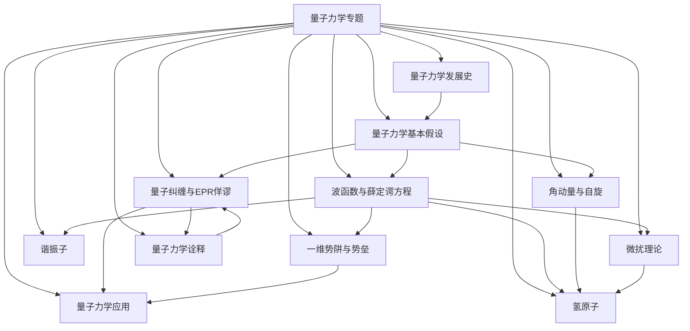
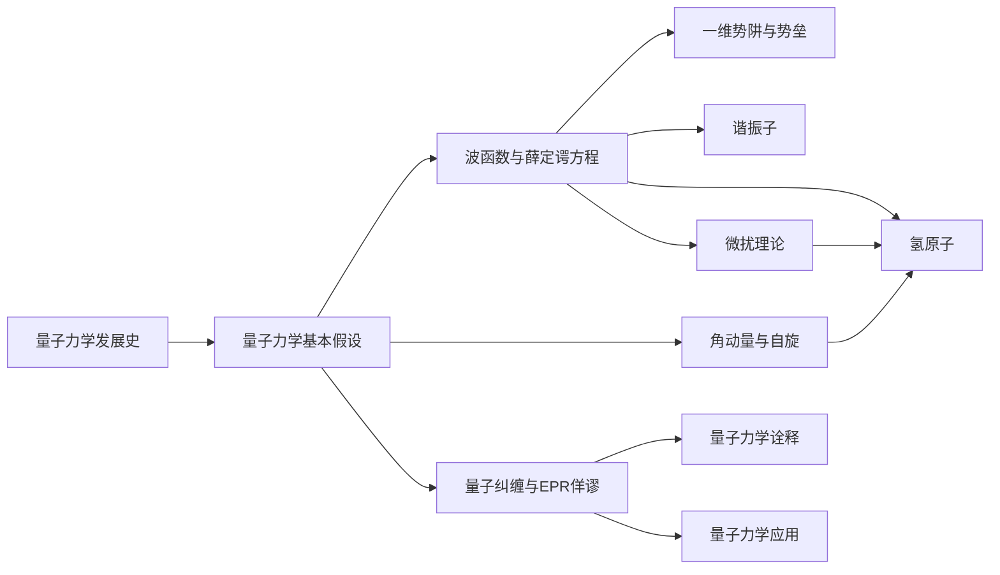

# 量子力学专题

> [!abstract] 专题概述
> 量子力学是==现代物理学的两大支柱之一==（另一为[[相对论专题]]），描述微观世界的基本规律。从1900年普朗克提出量子假说开始，经过爱因斯坦、玻尔、海森堡、薛定谔、狄拉克等人的发展，量子力学已成为==人类理解自然界最精确的理论框架==。

## 专题地图

## 核心概念速览

| 概念 | 核心公式 | 含义 | 详见 |
|------|----------|------|------|
| 普朗克常数 | $E = h\nu$ | 能量量子化的基本常数 | [[量子力学发展史]] |
| 波函数 | $\Psi(x,t)$ | 量子态的完备描述 | [[波函数与薛定谔方程]] |
| 薛定谔方程 | $i\hbar\frac{\partial\Psi}{\partial t} = \hat{H}\Psi$ | 量子态的时间演化 | [[波函数与薛定谔方程]] |
| 不确定性原理 | $\Delta x \cdot \Delta p \geq \frac{\hbar}{2}$ | 位置与动量不能同时精确确定 | [[量子力学基本假设]] |
| 对易关系 | $[\hat{x}, \hat{p}] = i\hbar$ | 量子力学的基本代数结构 | [[量子力学基本假设]] |
| 量子隧穿 | $T \approx e^{-2\kappa a}$ | 粒子穿越经典禁区的概率 | [[一维势阱与势垒]] |
| 零点能 | $E_0 = \frac{1}{2}\hbar\omega$ | 量子系统的最低能量不为零 | [[谐振子]] |
| 自旋 | $\hat{S} = \frac{\hbar}{2}\boldsymbol{\sigma}$ | 粒子的内禀角动量 | [[角动量与自旋]] |
| 氢原子能级 | $E_n = -\frac{13.6\text{ eV}}{n^2}$ | 最简单的原子能级结构 | [[氢原子]] |
| 费米黄金规则 | $W_{i\to f} = \frac{2\pi}{\hbar}\|\langle f\|\hat{H}'\|i\rangle\|^2\rho(E_f)$ | 量子跃迁率 | [[微扰理论]] |
| 贝尔态 | $\|\Phi^+\rangle = \frac{1}{\sqrt{2}}(\|00\rangle + \|11\rangle)$ | 最大纠缠态 | [[量子纠缠与EPR佯谬]] |
| 波函数坍缩 | — | 测量导致量子态突变 | [[量子力学诠释]] |

## 专题子笔记

### 1. [[量子力学发展史]]
- 从黑体辐射到量子概念的诞生
- 旧量子论（玻尔模型、德布罗意物质波）
- 量子力学的建立（海森堡、薛定谔、狄拉克）
- 现代发展（量子信息、量子计算）

### 2. [[量子力学基本假设]]
- 态矢量与希尔伯特空间
- 可观测量的算符表示
- 测量公设与波函数坍缩
- 全同性原理与自旋-统计定理

### 3. [[波函数与薛定谔方程]]
- 波函数的统计诠释（玻恩）
- 含时与定态薛定谔方程
- 一维定态问题
- 不确定性原理的推导

### 4. [[一维势阱与势垒]]
- 无限深与有限深势阱
- 量子隧穿效应
- 扫描隧道显微镜（STM）原理
- 共振散射

### 5. [[谐振子]]
- 解析解法（厄米多项式）
- 代数解法（升降算符）
- 零点能与相干态
- 压缩态

### 6. [[角动量与自旋]]
- 轨道角动量的量子化
- 电子自旋与泡利矩阵
- 角动量耦合
- 斯特恩-盖拉赫实验

### 7. [[氢原子]]
- 径向方程与角向方程
- 量子数与电子云
- 精细结构
- 塞曼效应

### 8. [[微扰理论]]
- 定态微扰论
- 含时微扰与费米黄金规则
- 变分法与WKB近似
- 绝热近似与Berry相

### 9. [[量子纠缠与EPR佯谬]]
- EPR论文与贝尔不等式
- 量子纠缠与量子非定域性
- 量子隐形传态
- 量子计算与量子密码

### 10. [[量子力学诠释]]
- 哥本哈根诠释
- 多世界诠释
- 隐变量理论（德布罗意-玻姆）
- 客观坍缩理论、QBism

### 11. [[量子力学应用]]
- 半导体与激光
- 量子点与STM
- 核磁共振与MRI
- 超导与量子计算

---

## 推荐阅读顺序

> [!tip] 学习建议
> 建议先阅读[[量子力学发展史]]建立历史直觉，再进入[[量子力学基本假设]]掌握==公理体系==，然后通过[[波函数与薛定谔方程]]和[[一维势阱与势垒]]掌握基本计算方法。[[谐振子]]和[[角动量与自旋]]是进阶必读，[[氢原子]]是==理论的高峰==。[[量子纠缠与EPR佯谬]]和[[量子力学诠释]]涉及==最深刻的物理哲学问题==。

---

## 关键公式汇总

### 薛定谔方程
$$
i\hbar\frac{\partial}{\partial t}\Psi(\mathbf{r},t) = \left[-\frac{\hbar^2}{2m}\nabla^2 + V(\mathbf{r})\right]\Psi(\mathbf{r},t)
$$

### 不确定性原理
$$
\Delta x \cdot \Delta p \geq \frac{\hbar}{2}
$$

### 谐振子能级
$$
E_n = \left(n + \frac{1}{2}\right)\hbar\omega, \quad n = 0, 1, 2, \ldots
$$

### 氢原子能级
$$
E_n = -\frac{me^4}{8\varepsilon_0^2 h^2}\frac{1}{n^2} = -\frac{13.6\ \text{eV}}{n^2}
$$

### 费米黄金规则
$$
W_{i\to f} = \frac{2\pi}{\hbar}|\langle f|\hat{H}'|i\rangle|^2 \rho(E_f)
$$

### 贝尔态
$$
|\Phi^+\rangle = \frac{1}{\sqrt{2}}(|00\rangle + |11\rangle)
$$

---

## 相关主题

- [[相对论专题]] — 现代物理另一支柱，与量子力学在量子场论中统一
- [[电磁学]] — 经典电磁理论，量子电动力学（QED）的前身
- [[黑体辐射]] — 量子概念的起源问题
- [[热力学]] — 统计力学是量子力学的重要应用领域

%%
量子力学专题持续更新中，欢迎补充更多数学推导与实验验证细节。
与相对论专题形成互补，共同构成现代物理学的完整图景。
%%