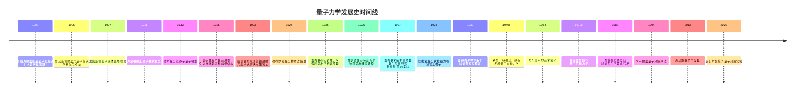

# 量子力学发展史

> [!quote] 费曼
> 我想我可以有把握地说，没有人真正理解量子力学。

量子力学是二十世纪物理学最伟大的革命，它彻底改变了人类对物质世界本质的认识。从经典物理的"两朵乌云"到量子信息时代的曙光，量子力学的发展史是一部充满智慧碰撞、思想突破与哲学思辨的壮丽史诗。本笔记梳理量子力学从萌芽到现代发展的完整脉络。

%% 本文档为量子力学系列笔记的总纲性文件，涵盖完整的量子力学发展史脉络 %%

---

## 一、量子概念的萌芽（1900年前）

### 1.1 经典物理的辉煌与危机

十九世纪末，经典物理学大厦已臻完美。==牛顿力学==精确描述了从苹果落地到行星运行的宏观运动；==麦克斯韦电磁理论==将电、磁、光统一为电磁波，预言了电磁波的存在并被赫兹实验证实；==热力学与统计力学==在玻尔兹曼、吉布斯等人的努力下，建立了微观与宏观的桥梁。

> [!note] 经典物理的三大支柱
> 1. **牛顿力学**（1687）：$\vec{F} = m\vec{a}$，确定性的因果律
> 2. **麦克斯韦电磁理论**（1865）：$\nabla \cdot \vec{E} = \rho/\varepsilon_0$ 等方程组，统一了电、磁、光
> 3. **热力学与统计力学**：$dS \geq 0$，熵增原理与微观态统计

然而，经典物理的天空并非晴空万里。开尔文勋爵（Lord Kelvin）在1900年的著名演讲中指出，==动力学理论在热和光的解释上，正面临着两朵"乌云"==：

1. **迈克尔逊-莫雷实验**（1887）：未能检测到"以太"漂移，最终催生了爱因斯坦的[[相对论专题]]
2. **黑体辐射问题**：能量均分定理在紫外区导致发散——即"紫外灾难"

> [!important] 开尔文"两朵乌云"
> 第一朵乌云（迈克尔逊-莫雷实验）引出了相对论；第二朵乌云（黑体辐射）引出了量子力学。这两朵乌云，最终都酿成了颠覆经典物理的暴风雨。

### 1.2 黑体辐射与普朗克量子假说（1900）

#### 黑体辐射的实验事实

黑体（black body）是能够完全吸收所有入射电磁辐射的理想物体。实验发现，黑体辐射的能量密度随频率和温度的分布具有普适性规律。

实验曲线显示：在低频区，辐射能量密度 $u(\nu, T)$ 随频率增大而增大；在高频区，能量密度则迅速下降，整个曲线呈现"钟形"分布。温度升高时，峰值向高频方向移动（维恩位移定律）。

#### 经典理论的失败

- **维恩公式**（1896）：$u(\nu, T) = \alpha \nu^3 e^{-\beta\nu/T}$，在高频区与实验符合较好，但在低频区偏离实验
- **瑞利-金斯公式**（1900）：$u(\nu, T) = \frac{8\pi\nu^2}{c^3} k_B T$，在低频区与实验一致，但在高频区发散（紫外灾难）

> [!warning] 紫外灾难
> 按瑞利-金斯公式，当 $\nu \to \infty$ 时，$u(\nu, T) \to \infty$，这意味着任何有限温度的黑体都会辐射无限大的能量——这显然与实验事实矛盾。紫外灾难是经典能量均分定理应用于电磁场时的必然结果。

#### 普朗克的突破

马克斯·普朗克（Max Planck）在1900年10月19日，通过内插法提出了一个经验公式：

$$u(\nu, T) = \frac{8\pi\nu^2}{c^3} \cdot \frac{h\nu}{e^{h\nu/k_BT} - 1}$$

这个公式在高低频极限下分别退化为维恩公式和瑞利-金斯公式，且与实验数据完美吻合。

> [!tip] 普朗克公式的极限行为
> - 高频极限（$h\nu \gg k_B T$）：$u(\nu, T) \approx \frac{8\pi h\nu^3}{c^3} e^{-h\nu/k_BT}$ → 维恩公式
> - 低频极限（$h\nu \ll k_B T$）：$u(\nu, T) \approx \frac{8\pi\nu^2}{c^3} k_B T$ → 瑞利-金斯公式

为了从理论上推导出这个公式，普朗克不得不做出一个==革命性的假设==：谐振子的能量不是连续的，而是以最小单元 $h\nu$ 的整数倍出现：

$$E = n h \nu, \quad n = 0, 1, 2, \ldots$$

其中 $h = 6.626 \times 10^{-34} \ \text{J·s}$ 是一个新的基本常数——==普朗克常数==。普朗克称"这是绝望中的不得已之举"（"an act of desperation"）。

#### 普朗克黑体辐射公式的详细推导

普朗克考虑了黑体辐射腔内壁上的谐振子与电磁场的能量交换。具体推导如下：

1. **谐振子的能量量子化**：假设频率为 $\nu$ 的谐振子能量只能取离散值 $E_n = n h\nu$

2. **玻尔兹曼分布**：在温度 $T$ 下，谐振子处于能量 $E_n$ 的概率为 $P_n \propto e^{-E_n/k_BT}$

3. **平均能量计算**：
   $$\langle E \rangle = \frac{\sum_{n=0}^{\infty} E_n e^{-E_n/k_BT}}{\sum_{n=0}^{\infty} e^{-E_n/k_BT}} = \frac{\sum_{n=0}^{\infty} nh\nu e^{-nh\nu/k_BT}}{\sum_{n=0}^{\infty} e^{-nh\nu/k_BT}}$$

   令 $x = h\nu/k_BT$，则：
   $$\langle E \rangle = h\nu \cdot \frac{\sum_{n=0}^{\infty} n e^{-nx}}{\sum_{n=0}^{\infty} e^{-nx}} = h\nu \cdot \frac{e^{-x}}{1-e^{-x}} = \frac{h\nu}{e^{h\nu/k_BT} - 1}$$

4. **注意**：经典能量均分定理给出 $\langle E \rangle = k_B T$，而量子化给出上述结果。当 $h\nu \ll k_BT$ 时，利用泰勒展开 $e^x \approx 1 + x$，有 $\langle E \rangle \approx k_B T$，回到经典结果。

5. **态密度**：电磁场在体积 $V$ 内、频率 $\nu$ 到 $\nu + d\nu$ 之间的模式数为：
   $$dN = \frac{8\pi\nu^2}{c^3} V d\nu$$

6. **最终辐射能量密度**：
   $$u(\nu, T) = \frac{1}{V} \cdot \langle E \rangle \cdot \frac{dN}{d\nu} = \frac{8\pi\nu^2}{c^3} \cdot \frac{h\nu}{e^{h\nu/k_BT} - 1}$$

这就是普朗克黑体辐射公式。通过积分可得斯特藩-玻尔兹曼定律和维恩位移定律：
- 总辐射能量密度：$U = \int_0^\infty u(\nu, T) d\nu = \frac{8\pi^5 k_B^4}{15 c^3 h^3} T^4 = a T^4$
- 斯特藩-玻尔兹曼常数：$\sigma = \frac{ac}{4} = 5.67 \times 10^{-8} \ \text{W·m}^{-2}\text{·K}^{-4}$

> [!note] 普朗克常数的物理意义
> $h$ 是自然界最基本的常数之一，它设定了==量子效应的尺度==。在 $h \to 0$ 的极限下，量子力学回到经典力学——这正是对应原理（Correspondence Principle）的体现。普朗克常数的量纲为 $[\text{能量}] \times [\text{时间}] = [\text{作用量}]$，因此它也被称为"作用量子"。

普朗克的量子假说标志着==量子时代的黎明==。然而，普朗克本人最初将能量量子化视为纯粹的计算技巧，并未真正接受其物理实在性。真正将量子概念推向物理革命中心的，是爱因斯坦。

---

## 二、旧量子论时期（1905-1924）

### 2.1 爱因斯坦的光量子假说（1905）

1905年是爱因斯坦的"奇迹年"。在发表狭义相对论的同时，爱因斯坦还提出了光量子假说，解释了光电效应。这一工作后来为他赢得了1921年诺贝尔物理学奖。

#### 光电效应的实验规律

当光照射到金属表面时，会有电子从金属中逸出，这就是光电效应。实验发现：

1. 对每种金属，存在一个==截止频率 $\nu_0$==，低于此频率的光无论多强都无法产生光电子
2. 光电子动能随光频率线性增加，与光强无关：$E_k = h\nu - W$
3. 光电子发射是瞬时的（无时间延迟）
4. 光电流与光强成正比

> [!important] 经典理论无法解释
> 按照麦克斯韦电磁理论，光是连续的电磁波，其能量由振幅（强度）决定。因此：
> - 只要光足够强，任何频率的光都应能打出电子（与事实1矛盾）
> - 电子动能应随光强增大而增大（与事实2矛盾）
> - 电子需要时间积累能量（与事实3矛盾）

#### 爱因斯坦光电方程

爱因斯坦大胆假设：光由==光量子（光子）==组成，每个光子携带能量 $E = h\nu$。当光子撞击金属表面时，其能量用于：

1. 克服金属的逸出功 $W$（功函数）
2. 剩余能量转化为电子的动能

$$E_k = h\nu - W$$

光电子最大动能：
$$\frac{1}{2}m_e v_{\text{max}}^2 = h\nu - W$$

> [!tip] 密立根的实验验证
> 罗伯特·密立根（Robert Millikan）最初不相信爱因斯坦的光量子理论，他花了十年时间（1916年发表）进行精密的光电效应实验，本想推翻爱因斯坦，结果却精确验证了爱因斯坦方程，并测得了 $h$ 的值，与普朗克的黑体辐射结果一致。密立根因此获得1923年诺贝尔奖。

#### 光的波粒二象性

爱因斯坦的光量子假说首次提出了==光的波粒二象性==：光在某些实验中表现为波动（干涉、衍射），在另一些实验中表现为粒子（光电效应、康普顿散射）。这一思想深刻影响了德布罗意，最终催生了物质波概念。

### 2.2 爱因斯坦的固体比热理论（1907）

爱因斯坦将能量量子化思想推广到固体中原子的振动，提出固体比热的量子理论。他假设固体中所有原子以相同频率 $\nu_E$ 振动，每个振动模式的能量是量子化的。

固体的摩尔热容为：
$$C_V = 3R \left(\frac{\Theta_E}{T}\right)^2 \frac{e^{\Theta_E/T}}{(e^{\Theta_E/T} - 1)^2}$$

其中 $\Theta_E = h\nu_E/k_B$ 为爱因斯坦温度。该理论成功解释了固体比热在低温下趋于零的实验事实，而经典杜隆-珀蒂定律（$C_V = 3R$）在低温下失效。

> [!note] 爱因斯坦模型的改进
> 爱因斯坦模型使用了单一频率，德拜（Peter Debye）在1912年将其推广为连续频谱分布，得到了在极低温下 $C_V \propto T^3$ 的德拜 $T^3$ 定律，与实验符合得更好。

### 2.3 卢瑟福原子模型（1911）

欧内斯特·卢瑟福（Ernest Rutherford）在1909年指导盖革和马斯登进行了==α粒子散射实验==，用α粒子轰击薄金箔。实验结果令人震惊：大多数α粒子几乎不受影响地穿过金箔，但极少数（约1/8000）被大角度反弹回来。

卢瑟福由此得出结论：原子内部大部分是空的，所有正电荷和几乎全部质量集中在中心一个极小的区域——==原子核==。电子在核外运动。

> [!quote] 卢瑟福
> "这是我一生中遇到的最不可思议的事情。就像你用15英寸的炮弹去轰击一张薄纸，炮弹却反弹回来打中了你一样不可思议。"

卢瑟福模型提出：电子绕原子核做圆周运动，库仑引力提供向心力：
$$\frac{Ze^2}{4\pi\varepsilon_0 r^2} = \frac{m_e v^2}{r}$$

然而，这一模型面临两个致命问题：
1. 按照经典电动力学，加速运动的电子会辐射电磁波，不断损失能量，最终在约 $10^{-11}$ 秒内坠入原子核——==原子应该是不稳定的==
2. 辐射的频率连续变化，应产生连续光谱——与实验观测到的==分立线状光谱==矛盾

### 2.4 玻尔原子模型（1913）

尼尔斯·玻尔（Niels Bohr）在1913年将量子概念引入原子结构，提出了革命性的玻尔原子模型。

#### 玻尔的三条基本假设

1. **定态假设**：电子只能在某些特定的、能量不连续的稳定轨道上运动，在这些轨道上电子不辐射电磁波。这些稳定态称为"定态"（stationary states）。

2. **频率条件（跃迁假设）**：电子从一个定态跃迁到另一个定态时，会吸收或发射一个光子，其频率为：
   $$h\nu = E_n - E_m$$

3. **角动量量子化条件**：电子的轨道角动量必须是 $\hbar = h/2\pi$ 的整数倍：
   $$L = m_e v r = n\hbar, \quad n = 1, 2, 3, \ldots$$

#### 氢原子光谱的推导

结合角动量量子化条件和牛顿第二定律，可得第 $n$ 个轨道的半径：
$$r_n = \frac{4\pi\varepsilon_0 \hbar^2}{m_e e^2} n^2 = a_0 n^2$$

其中 $a_0 = 0.529 \ \text{Å}$ 为==玻尔半径==，是氢原子基态的轨道半径。

能量为：
$$E_n = -\frac{m_e e^4}{8\varepsilon_0^2 h^2} \cdot \frac{1}{n^2} = -\frac{13.6 \ \text{eV}}{n^2}$$

氢原子光谱线系：
$$\frac{1}{\lambda} = \frac{E_n - E_m}{hc} = R_\infty \left(\frac{1}{m^2} - \frac{1}{n^2}\right)$$

其中 $R_\infty = 1.097 \times 10^7 \ \text{m}^{-1}$ 为里德伯常数，理论值与实验值精确吻合。

> [!note] 氢原子光谱线系
> - **莱曼系**（$m=1$）：紫外区，$n=2,3,4,\ldots$
> - **巴尔末系**（$m=2$）：可见光区，$n=3,4,5,\ldots$
> - **帕邢系**（$m=3$）：红外区，$n=4,5,6,\ldots$
> - **布拉开系**（$m=4$）、**芬德系**（$m=5$）：远红外区

#### 玻尔模型的局限

- 仅适用于单电子原子（氢原子和类氢离子），无法解释多电子原子光谱
- 无法解释谱线的==精细结构==和相对强度
- 不能处理非束缚态（散射）问题
- 角动量量子化条件是人为引入的，缺乏理论基础
- 是一种半经典半量子的混合物，不是自洽的理论

尽管如此，玻尔模型是通向真正量子力学道路上不可或缺的一步。

### 2.5 索末菲的推广（1916）

阿诺德·索末菲（Arnold Sommerfeld）在玻尔模型基础上进行了重要推广：

1. **椭圆轨道**：引入两个量子数——主量子数 $n$ 和角量子数 $k$（后来的 $l$），允许电子在椭圆轨道上运动
2. **空间量子化**：引入磁量子数 $m$，轨道角动量在外磁场方向上的投影也是量子化的
3. **相对论修正**：电子在椭圆轨道近日点处速度接近光速，索末菲引入狭义相对论修正，成功解释了氢原子光谱的==精细结构==

索末菲精细结构常数：
$$\alpha = \frac{e^2}{4\pi\varepsilon_0 \hbar c} \approx \frac{1}{137}$$

> [!tip] 精细结构常数
> $\alpha$ 是一个无量纲的纯数，约等于 $1/137$，它表征了电磁相互作用的强度。它是量子电动力学中最重要的参数之一，许多物理学家（如泡利、费曼）都曾对其物理本质进行过深入思考。

### 2.6 康普顿散射（1923）

阿瑟·康普顿（Arthur Compton）在1923年发现，X射线被自由电子散射后，波长会变长，且波长偏移与散射角有关。这一现象无法用经典波动理论解释（经典理论中散射波频率与入射波相同），但可以完美地用量子论解释。

#### 康普顿波长偏移公式的推导

将入射X射线视为光子流，光子与静止的自由电子发生弹性碰撞。由能量守恒和动量守恒：

能量守恒：
$$h\nu + m_e c^2 = h\nu' + \gamma m_e c^2$$

动量守恒（$x$ 方向）：$$\frac{h\nu}{c} = \frac{h\nu'}{c} \cos\theta + \gamma m_e v \cos\phi$$

动量守恒（$y$ 方向）：$$0 = \frac{h\nu'}{c} \sin\theta - \gamma m_e v \sin\phi$$

经过代数运算，得到康普顿波长偏移公式：
$$\Delta\lambda = \lambda' - \lambda = \frac{h}{m_e c} (1 - \cos\theta)$$

其中 $\lambda_C = h/(m_e c) = 2.426 \times 10^{-12} \ \text{m}$ 为==康普顿波长==。

> [!important] 康普顿散射的物理意义
> 康普顿散射是==光量子说的决定性验证==。它直接证明了：
> 1. 光子具有动量 $p = h/\lambda = h\nu/c$
> 2. 光子与电子的碰撞满足能量和动量守恒
> 3. 电磁辐射具有粒子性
>
> 康普顿因此获得1927年诺贝尔物理学奖。

### 2.7 德布罗意物质波（1924）

路易·德布罗意（Louis de Broglie）在1924年博士论文中提出了一个大胆的假说：==不仅光具有波粒二象性，所有物质粒子也具有波动性==。他将爱因斯坦的光量子关系 $E = h\nu$ 和 $p = h/\lambda$ 推广到所有粒子：

$$\lambda = \frac{h}{p} = \frac{h}{mv}$$

这就是==德布罗意波长==。

> [!quote] 德布罗意
> 在经历长期孤独的思考后，我突然想到，爱因斯坦在1905年发现的光量子二象性，应该推广到所有物质粒子，特别是电子。

德布罗意将玻尔角动量量子化条件 $L = n\hbar$ 重新解释为：电子轨道周长必须是电子波长的整数倍：

$$2\pi r = n\lambda = n\frac{h}{p} \quad \Rightarrow \quad pr = n\hbar$$

这为玻尔的人为假设提供了自然的波动解释。

#### 实验验证

- **戴维孙-革末实验**（1927）：用电子束轰击镍晶体，观察到电子衍射图案，与X射线衍射完全类似，证实了电子的波动性
- **G.P. 汤姆孙实验**（1927）：用高能电子穿过金属薄膜，获得类似德拜-谢乐环的衍射图案

> [!note] 一段有趣的轶事
> J.J. 汤姆孙因发现电子（粒子性）获得1906年诺贝尔奖；他的儿子G.P. 汤姆孙因证实电子波动性获得1937年诺贝尔奖。父亲证明电子是粒子，儿子证明电子是波——二人都是对的。

物质波假说为量子力学的发展奠定了概念基础，直接启发了薛定谔建立波动力学。

---

## 三、量子力学的建立（1925-1927）

### 3.1 海森堡矩阵力学（1925）

维尔纳·海森堡（Werner Heisenberg）在1925年创立了矩阵力学，这是量子力学的第一种完整形式。

> [!note] 海森堡的哲学出发点
> 海森堡认为，物理学理论应该只包含可观测的量。在原子的尺度上，电子的"轨道"是不可观测的，因此应该放弃这一经典概念。可观测的只有光谱线的频率和强度。

海森堡将每个物理量表示为一个无限维矩阵，其中矩阵元 $A_{mn}$ 对应于两个定态之间的跃迁。他发现了矩阵乘法的一个重要性质：==不满足交换律==。

#### 对易关系

海森堡与玻恩、约当合作，建立了矩阵力学的完整数学框架。最核心的发现是正则对易关系：

$$[x, p] = xp - px = i\hbar$$

更一般地，对于任意两个物理量，海森堡不确定性关系成立：
$$\Delta A \cdot \Delta B \geq \frac{1}{2} |\langle [A, B] \rangle|$$

> [!important] 对易关系的物理意义
> 对易关系 $[x, p] = i\hbar$ 是量子力学中最基本的方程之一。它直接导致：
> 1. 坐标和动量不能同时精确测定
> 2. 物理量可能不连续（量子化）
> 3. 经典力学中的泊松括号 $\{x, p\} = 1$ 被替换为量子对易子 $[x, p]/i\hbar = 1$

### 3.2 薛定谔波动力学（1926）

埃尔温·薛定谔（Erwin Schrödinger）受到德布罗意物质波思想的启发，在1926年建立了波动力学。更多细节请参见[[波函数与薛定谔方程]]。

#### 薛定谔方程的建立

薛定谔从经典波动方程出发，结合德布罗意关系，导出了不含时薛定谔方程：

$$-\frac{\hbar^2}{2m} \nabla^2 \psi(\vec{r}) + V(\vec{r}) \psi(\vec{r}) = E \psi(\vec{r})$$

含时薛定谔方程：
$$i\hbar \frac{\partial}{\partial t} \Psi(\vec{r}, t) = \hat{H} \Psi(\vec{r}, t)$$

其中 $\hat{H} = -\frac{\hbar^2}{2m} \nabla^2 + V(\vec{r})$ 为哈密顿算符。

#### 波函数与玻恩概率诠释

薛定谔最初将波函数 $\psi$ 解释为物质的实际分布密度，但马克斯·玻恩（Max Born）在1926年提出了正确的概率诠释：

$$|\psi(\vec{r}, t)|^2 dV = \text{在体积元 } dV \text{ 内找到粒子的概率}$$

> [!important] 概率诠释的革命性
> 玻恩的概率诠释意味着量子力学本质上是==非决定论==的。即使完全知道系统的波函数，也只能预言测量结果的概率分布，而不能确定性地预言单个测量结果。这彻底颠覆了经典物理的决定论世界观。

#### 矩阵力学与波动力学的等价性

薛定谔在1926年证明，矩阵力学和波动力学是数学上等价的——它们只是同一物理理论的不同表示。波动力学中的波函数可以展开为矩阵力学中哈密顿矩阵的本征矢：

$$\psi(\vec{r}) = \sum_n c_n \psi_n(\vec{r})$$

其中 $\psi_n$ 是能量本征态，$c_n$ 是概率幅。

### 3.3 狄拉克的贡献

保罗·狄拉克（Paul Dirac）是量子力学形式体系的集大成者。他做出了多项开创性贡献：

#### 狄拉克符号与变换理论

狄拉克引入了简洁优雅的 bra-ket 符号（狄拉克符号）：
- ket：$|\psi\rangle$ 表示量子态矢量
- bra：$\langle\psi|$ 表示对偶矢量
- 内积：$\langle\phi|\psi\rangle$ 表示概率幅

狄拉克将量子力学的各种表述统一在希尔伯特空间的框架下，详见[[量子力学基本假设]]。

#### 狄拉克方程（1928）

狄拉克将量子力学与狭义相对论结合，导出了狄拉克方程：
$$(i\gamma^\mu \partial_\mu - m)\psi = 0$$

该方程：
- 自然地给出了电子的自旋 $s = 1/2$ 和磁矩
- 预言了==反粒子==的存在（正电子，由安德森在1932年实验发现）
- 奠定了量子电动力学（QED）的基础

> [!tip] 狄拉克方程的预言
> 狄拉克方程预言了带负能量的电子态。狄拉克提出"狄拉克海"的假说：真空中所有负能态都被电子填满，当一个负能电子被激发到正能态时，留下的"空穴"表现为带正电的粒子——正电子。这是理论物理对反物质的最早预言。

### 3.4 玻恩概率诠释（1926）

马克斯·玻恩（Max Born）在1926年提出了对波函数的概率诠释，解决了薛定谔波动力学中波函数物理意义的难题。详见[[量子力学基本假设]]。

玻恩的概率诠释可表述为：
$$P(\vec{r}, t) d^3r = |\Psi(\vec{r}, t)|^2 d^3r$$

概率守恒由连续性方程保证：
$$\frac{\partial \rho}{\partial t} + \nabla \cdot \vec{j} = 0$$

其中 $\rho = |\Psi|^2$ 为概率密度，$\vec{j} = \frac{\hbar}{2mi}(\Psi^*\nabla\Psi - \Psi\nabla\Psi^*)$ 为概率流密度。

### 3.5 海森堡不确定性原理（1927）

海森堡在1927年提出了不确定性原理，这是量子力学的核心原理之一。

#### 详细推导

考虑两个厄米算符 $\hat{A}$ 和 $\hat{B}$，定义：
$$\Delta A = \sqrt{\langle (\hat{A} - \langle A \rangle)^2 \rangle}, \quad \Delta B = \sqrt{\langle (\hat{B} - \langle B \rangle)^2 \rangle}$$

利用施瓦茨不等式（Cauchy-Schwarz inequality）：
$$\langle \alpha|\alpha \rangle \langle \beta|\beta \rangle \geq |\langle \alpha|\beta \rangle|^2$$

令 $|\alpha\rangle = (\hat{A} - \langle A \rangle)|\psi\rangle$，$|\beta\rangle = (\hat{B} - \langle B \rangle)|\psi\rangle$，可得：
$$(\Delta A)^2 (\Delta B)^2 \geq |\langle (\hat{A} - \langle A \rangle)(\hat{B} - \langle B \rangle) \rangle|^2$$

将算符乘积分解为对易子与反对易子之和：
$$(\hat{A} - \langle A \rangle)(\hat{B} - \langle B \rangle) = \frac{1}{2}[\hat{A}, \hat{B}] + \frac{1}{2}\{\hat{A} - \langle A \rangle, \hat{B} - \langle B \rangle\}$$

对易子贡献虚部，反对易子贡献实部，取绝对值后得到==罗伯逊-薛定谔不等式==：
$$\Delta A \cdot \Delta B \geq \frac{1}{2} |\langle [\hat{A}, \hat{B}] \rangle|$$

对于坐标和动量，$[\hat{x}, \hat{p}] = i\hbar$，代入得到：
$$\Delta x \cdot \Delta p \geq \frac{\hbar}{2}$$

能量-时间不确定性关系：
$$\Delta E \cdot \Delta t \geq \frac{\hbar}{2}$$

> [!important] 不确定性原理的物理意义
> 不确定性原理不是测量误差造成的，不是技术限制，而是==自然界的本质属性==。它表明微观粒子不具有同时确定的坐标和动量——这不是因为我们"不知道"，而是"本来就不存在"。这一思想是哥本哈根诠释的核心支柱。

### 3.6 玻尔的互补原理（1927）

尼尔斯·玻尔在1927年科莫会议上提出了==互补原理==（Complementarity Principle），这是哥本哈根诠释的哲学基础。

互补原理指出：微观粒子的波动性和粒子性是两个互补的方面，不能同时被观测到。我们用哪种实验装置测量，就决定了粒子表现出哪种性质：

- 在干涉实验中，粒子表现出波动性
- 在粒子探测实验中，粒子表现出粒子性

> [!quote] 玻尔
> 互斥的两种描述方式不是矛盾的，而是互补的——它们共同构成了对量子现象的完整描述。

玻尔还将互补性推广到更广泛的哲学领域，认为互补性是普遍的认知原理。哥本哈根诠释的完整阐述见[[量子力学诠释]]。

---

## 四、量子力学的成熟与扩展（1928-1960s）

### 4.1 量子电动力学（QED）的发展

量子电动力学（Quantum Electrodynamics, QED）是描述带电粒子与电磁场相互作用的量子场论，是物理学史上最精确的理论。

#### 早期的困难

在1930-1940年代，QED面临严重的发散问题：
- 电子自能发散（电子质量无限大）
- 真空极化发散（电荷无限大）
- 高阶微扰计算中的无穷大

#### 重整化理论的突破

==朝永振一郎==（Tomonaga）、==朱利安·施温格==（Schwinger）和==理查德·费曼==（Feynman）在1940年代末独立发展了重整化理论，三人因此共享1965年诺贝尔物理学奖。

> [!note] 重整化的核心思想
> 发散项被吸收到物理质量和物理电荷的重新定义中。我们观测到的电子质量 $m_e$ 和电荷 $e$ 是"穿上了衣服"的物理量，包含了虚粒子云的修正，而"裸"质量和"裸"电荷本身是不可观测的。

#### 费曼图

费曼发明了直观的费曼图，将复杂的QED计算转化为图形规则的组合：
- 电子线：$\frac{i(\gamma^\mu p_\mu + m)}{p^2 - m^2 + i\varepsilon}$
- 光子线：$\frac{-i g_{\mu\nu}}{k^2 + i\varepsilon}$
- 顶点因子：$-ie\gamma^\mu$

#### QED的精确验证

QED给出的电子反常磁矩理论值：
$$a_e^{\text{theory}} = \frac{g-2}{2} = 0.001159652181643(25)$$

实验值（哈佛大学加布里埃尔斯小组，2008年）：
$$a_e^{\text{exp}} = 0.00115965218073(28)$$

两者在十亿分之一的精度上吻合，是物理学史上==理论与实验最精确的符合==。

### 4.2 量子场论与标准模型

量子场论将量子力学推广到场系统，实现了从单粒子量子力学到多粒子（甚至粒子数可变）系统的飞跃。

#### 场的量子化

将经典场（如电磁场 $\vec{A}$）提升为算符场，满足正则对易关系：
$$[\hat{\phi}(\vec{r}, t), \hat{\pi}(\vec{r}', t)] = i\hbar \delta^3(\vec{r} - \vec{r}')$$

场的激发态对应于粒子——这就是粒子的==场论解释==。

#### 标准模型的建立

经过格拉肖、温伯格、萨拉姆等人的努力，在1970年代建立了标准模型：

- 电磁相互作用 → QED（$U(1)$ 规范对称性）
- 弱相互作用 → 电弱统一理论（$SU(2) \times U(1)$，引入希格斯机制）
- 强相互作用 → 量子色动力学 QCD（$SU(3)$ 规范对称性，渐进自由）

> [!note] 标准模型
> $$SU(3)_C \times SU(2)_L \times U(1)_Y$$
> 标准模型描述了除引力外的所有基本相互作用，经过数十年的实验检验，特别是2012年希格斯玻色子的发现，标准模型取得了巨大成功。

### 4.3 贝尔不等式与量子纠缠（1964）

约翰·贝尔（John Bell）在1964年提出了贝尔不等式，将量子力学与局域隐变量理论之间的哲学争论转化为可实验检验的物理问题。详见[[量子纠缠与EPR佯谬]]。

贝尔不等式：
$$|P(\vec{a}, \vec{b}) - P(\vec{a}, \vec{c})| \leq 1 + P(\vec{b}, \vec{c})$$

量子力学预言在某些情况下贝尔不等式会被违反，而局域隐变量理论要求不等式成立。

> [!important] 阿斯佩克特实验（1982）
> 阿兰·阿斯佩克特（Alain Aspect）的实验明确证明了贝尔不等式的违反，确认了量子力学非局域性的正确性，否定了局域隐变量理论。2022年诺贝尔物理学奖授予了阿斯佩克特、克劳泽和塞林格，以表彰他们在量子纠缠实验验证方面的贡献。

### 4.4 量子色动力学（QCD）

量子色动力学是描述夸克和胶子之间强相互作用的理论。QCD有两个关键特性：

1. **渐进自由**（Gross, Politzer, Wilczek，1973）：在高能（短距离）时，强相互作用变弱，夸克表现得像自由粒子
2. **色禁闭**：在低能（长距离）时，强相互作用极强，夸克和胶子被永久束缚在强子内部

> [!tip] 渐进自由与2004年诺贝尔奖
> 格罗斯、波利策和维尔切克因发现强相互作用的渐进自由性质，共同获得2004年诺贝尔物理学奖。渐进自由是QCD被确立为强相互作用正确理论的关键证据。

---

## 五、现代发展（1970s至今）

### 5.1 量子信息科学

量子信息科学是量子力学与现代信息科学的交叉领域，将量子叠加、量子纠缠等基本原理应用于信息处理。

#### 量子计算

量子计算利用量子比特（qubit）的叠加态 $|\psi\rangle = \alpha|0\rangle + \beta|1\rangle$ 实现并行计算。

> [!note] 关键量子算法
> - **Shor算法**（1994）：大数质因数分解，可在多项式时间内完成，威胁RSA加密体系
> - **Grover算法**（1996）：无序数据库搜索，提供平方根加速
> - **量子纠错码**：Shor（1995）和Steane（1996）独立提出

#### 量子密码

基于量子不可克隆定理和海森堡不确定性原理，量子密钥分发（QKD）可以实现==无条件安全的通信==。

- **BB84协议**（Bennett & Brassard, 1984）：第一个量子密钥分发协议
- **E91协议**（Ekert, 1991）：基于纠缠的QKD协议

#### 量子隐形传态

利用量子纠缠实现未知量子态的远距离传输（注意：不是物质的传输，而是量子信息的传输）：

$$|\psi\rangle_A \otimes |\Phi^+\rangle_{AB} \rightarrow \text{经典通信} + \text{局域操作} \rightarrow |\psi\rangle_B$$

### 5.2 量子光学与冷原子

- **激光冷却与磁光阱**：朱棣文、科恩-塔诺季、菲利普斯（1997年诺贝尔奖）
- **玻色-爱因斯坦凝聚**（BEC）：康奈尔、维曼、克特勒（2001年诺贝尔奖）
- **光频梳技术**：亨施、霍尔（2005年诺贝尔奖）

### 5.3 量子引力探索

将广义相对论与量子力学统一是当代理论物理学的最大挑战。

- **弦理论**：将基本粒子视为一维"弦"的振动模式
- **圈量子引力**：直接对时空进行量子化
- **全息原理**：引力理论可以等价于低一维的量子场论（AdS/CFT对应）

> [!warning] 开放问题
> 量子引力理论至今缺乏实验检验。普朗克尺度 $l_P = \sqrt{\hbar G/c^3} \approx 1.6 \times 10^{-35} \ \text{m}$ 远超出当前实验能力，因此量子引力的探索仍主要停留在理论层面。

### 5.4 2022年诺贝尔物理学奖：量子纠缠实验验证

2022年诺贝尔物理学奖授予==阿兰·阿斯佩克特（Alain Aspect）、约翰·克劳泽（John Clauser）和安东·塞林格（Anton Zeilinger）==，表彰他们"用纠缠光子进行实验，验证了贝尔不等式的违反，开创了量子信息科学"。

他们的工作证实了量子纠缠的非局域性，否定了局域隐变量理论，为量子信息科学奠定了实验基础。详见[[量子纠缠与EPR佯谬]]。

---

## 关键人物简介

> [!note] 马克斯·普朗克（Max Planck, 1858-1947）
> 德国理论物理学家，量子力学的奠基人。1900年提出能量量子化假说，引入了普朗克常数 $h$。1918年获诺贝尔物理学奖。普朗克一生经历了德国两次世界大战的动荡，长子在一战中阵亡，次子因参与刺杀希特勒被处决，但他始终坚守科学精神。他有一句名言："一个新的科学真理取得胜利，不是通过让它的反对者信服，而是因为这些反对者最终死去，而熟悉它的新一代成长起来。"

> [!note] 阿尔伯特·爱因斯坦（Albert Einstein, 1879-1955）
> 1905年提出光量子假说，解释了光电效应（1921年诺贝尔奖）。创立了狭义和广义相对论。尽管爱因斯坦是量子理论的重要奠基人，但他晚年对量子力学的概率诠释持批判态度，留下了著名的"上帝不掷骰子"（"God does not play dice"）的论断。他与玻尔关于量子力学完备性的长期论战（玻尔-爱因斯坦论战），是物理学史上最精彩的学术对话之一。

> [!note] 尼尔斯·玻尔（Niels Bohr, 1885-1962）
> 丹麦物理学家，1913年提出玻尔原子模型，1927年提出互补原理，是哥本哈根学派的灵魂人物。1922年获诺贝尔物理学奖。玻尔在二战期间协助许多犹太科学家逃离纳粹德国，战后又积极倡导和平利用原子能。哥本哈根理论物理研究所（现尼尔斯·玻尔研究所）成为量子力学发展的圣地。

> [!note] 路易·德布罗意（Louis de Broglie, 1892-1987）
> 法国物理学家，1924年在其博士论文中提出物质波假说，将波粒二象性推广到所有物质。1929年获诺贝尔物理学奖。德布罗意出身法国贵族家庭，最初学习历史，后转向物理学，其博士论文篇幅极短（仅约70页），但内容革命性十足。

> [!note] 维尔纳·海森堡（Werner Heisenberg, 1901-1976）
> 德国理论物理学家，1925年创立矩阵力学，1927年提出不确定性原理。1932年获诺贝尔物理学奖。海森堡在二战期间留在德国，领导德国的铀俱乐部（核能研究项目），其战时行为至今仍有争议。他对量子力学哲学基础的思考深刻影响了物理学的发展。

> [!note] 埃尔温·薛定谔（Erwin Schrödinger, 1887-1961）
> 奥地利物理学家，1926年建立波动力学，提出薛定谔方程。1933年与狄拉克共享诺贝尔物理学奖。薛定谔对量子力学的概率解释持保留态度，提出了著名的"薛定谔的猫"思想实验来质疑哥本哈根诠释。他的著作《生命是什么？》对分子生物学的诞生有重要影响。

> [!note] 保罗·狄拉克（Paul Dirac, 1902-1984）
> 英国理论物理学家，量子力学的数学奠基人。提出狄拉克方程（1928），预言反粒子，奠定量子电动力学基础。1933年与薛定谔共享诺贝尔奖。狄拉克以沉默寡言和追求数学美而著称，他曾说："方程比人更聪明。" 他的著作《量子力学原理》至今仍是量子力学的经典教材。

> [!note] 沃尔夫冈·泡利（Wolfgang Pauli, 1900-1958）
> 奥地利理论物理学家，1925年提出泡利不相容原理，解释了原子中电子壳层结构的形成。1945年获诺贝尔物理学奖。泡利以犀利（有时近乎刻薄）的批评著称，被称为"物理学的良心"和"上帝的鞭子"。他关于β衰变中微子存在的预言在1956年被实验证实。

> [!note] 马克斯·玻恩（Max Born, 1882-1970）
> 德国-英国物理学家，1926年提出波函数的概率诠释，奠定了量子力学统计解释的基础。1954年获诺贝尔物理学奖（因对量子力学基础特别是波函数统计诠释的贡献）。玻恩是哥廷根物理学派的领袖，培养了大量杰出物理学家。

> [!note] 理查德·费曼（Richard Feynman, 1918-1988）
> 美国理论物理学家，量子电动力学的核心人物之一。发明费曼图、路径积分公式，参与曼哈顿计划。1965年与朝永振一郎、施温格共享诺贝尔物理学奖。费曼以卓越的教学能力和充满好奇心的性格著称，他的《费曼物理学讲义》影响了几代物理学家。

---

## 时间线总结

---

## 延伸阅读

量子力学的发展史与以下主题密切相关：

- [[量子力学专题]]：量子力学的整体框架和核心概念
- [[波函数与薛定谔方程]]：薛定谔波动力学的数学基础
- [[量子力学基本假设]]：量子力学的公理化体系
- [[量子纠缠与EPR佯谬]]：量子力学非局域性与贝尔不等式
- [[量子力学诠释]]：哥本哈根诠释、多世界诠释等哲学问题
- [[相对论专题]]：狭义和广义相对论，与量子力学共同构成现代物理两大支柱
- [[黑体辐射]]：量子概念的起源问题

---

%% 
=== 编辑备注 ===
- 本文档为量子力学系列笔记的总纲性文件
- 后续可补充：量子霍尔效应、拓扑量子计算、量子热力学等前沿主题
- 人物简介部分可进一步扩展
- 建议配合时间线图表阅读
%%

> [!quote] 海森堡
> 量子力学让我们学到了一个教训：我们不应该把自然现象描述为客观的、独立于观察者的存在。我们既是观众，也是演员。