# 物理竞赛总览

> [!abstract] 概览
> 物理竞赛笔记体系旨在为参加全国中学生物理竞赛（CPhO）或国际物理奥赛（IPhO/APhO）的学生提供系统的知识准备。目前包含五大版块：**预备知识**——即高中数学到大学数学的过渡工具，包括微积分、微分方程、矢量运算、泰勒展开、复数与欧拉公式、量纲分析、近似与估算方法等；**竞赛力学**——在高中力学基础上深化，覆盖非惯性系与惯性力、守恒律、刚体动力学、轨道力学、振动与流体基础；**竞赛热学**——从宏观状态方程到微观动理论，覆盖热力学两大定律、循环热机、物态变化、表面张力与热传递；**竞赛电学**——竞赛分值占比最高、区分度最大的版块，覆盖静电场（高斯定理与导体静电平衡）、电路分析（基尔霍夫定律与等效电阻）、磁场与复合场中的带电粒子运动、电磁感应与交流电；**竞赛光学**——几何光学（反射折射、透镜成像、光学仪器）与波动光学（干涉、衍射、偏振）两条主线并行，并以光电效应衔接量子物理。详细的其余版块笔记（近代物理等）将后续逐步补充。

## 知识脉络

```mermaid
graph TD
    ROOT[物理竞赛总览] --> A[预备知识]
    A --> A1[01-微积分基础]
    A --> A2[02-微分方程初步]
    A --> A3[03-矢量运算]
    A --> A4[04-泰勒展开与级数]
    A --> A5[05-复数与欧拉公式]
    A --> A6[06-量纲分析]
    A --> A7[07-近似与估算方法]

    ROOT --> M[竞赛力学]
    M --> M1[01-运动学]
    M --> M2[02-牛顿运动定律与非惯性系]
    M --> M3[03-静力学与刚体平衡]
    M --> M4[04-功与机械能]
    M --> M5[05-动量与角动量]
    M --> M6[06-刚体动力学]
    M --> M7[07-万有引力与天体运动]
    M --> M8[08-机械振动]
    M --> M9[09-流体力学基础]

    ROOT --> T[竞赛热学]
    T --> T1[01-温度与理想气体]
    T --> T2[02-气体动理论]
    T --> T3[03-热力学第一定律]
    T --> T4[04-循环与热机效率]
    T --> T5[05-热力学第二定律与熵]
    T --> T6[06-物态变化与相变]
    T --> T7[07-表面张力与毛细现象]
    T --> T8[08-热传递与热平衡]

    ROOT --> E[竞赛电学]
    E --> E1[01-库仑定律与电场强度]
    E --> E2[02-电势与电势能]
    E --> E3[03-高斯定理与导体静电平衡]
    E --> E4[04-电容器与电介质]
    E --> E5[05-稳恒电流与电路分析]
    E --> E6[06-磁场与安培力]
    E --> E7[07-带电粒子在磁场与复合场中]
    E --> E8[08-电磁感应与自感]
    E --> E9[09-交流电与变压器]

    ROOT --> O[竞赛光学]
    O --> O1[01-几何光学基础]
    O --> O2[02-球面镜与薄透镜成像]
    O --> O3[03-光具组与光学仪器]
    O --> O4[04-光的干涉]
    O --> O5[05-光的衍射]
    O --> O6[06-光的偏振与电磁本性]
    O --> O7[07-光电效应与光的量子性]
    O --> O8[08-等倾干涉与迈克耳孙干涉仪]
    O --> O9[09-光谱与色散]
    O --> O10[10-光的吸收散射与激光]

    class A1 internal-link;
    class A2 internal-link;
    class A3 internal-link;
    class A4 internal-link;
    class A5 internal-link;
    class A6 internal-link;
    class A7 internal-link;
    class M1 internal-link;
    class M2 internal-link;
    class M3 internal-link;
    class M4 internal-link;
    class M5 internal-link;
    class M6 internal-link;
    class M7 internal-link;
    class M8 internal-link;
    class M9 internal-link;
    class T1 internal-link;
    class T2 internal-link;
    class T3 internal-link;
    class T4 internal-link;
    class T5 internal-link;
    class T6 internal-link;
    class T7 internal-link;
    class T8 internal-link;
    class E1 internal-link;
    class E2 internal-link;
    class E3 internal-link;
    class E4 internal-link;
    class E5 internal-link;
    class E6 internal-link;
    class E7 internal-link;
    class E8 internal-link;
    class E9 internal-link;
    class O1 internal-link;
    class O2 internal-link;
    class O3 internal-link;
    class O4 internal-link;
    class O5 internal-link;
    class O6 internal-link;
    class O7 internal-link;
    class O8 internal-link;
    class O9 internal-link;
    class O10 internal-link;
```

## 一、预备知识（7 篇）

### 数学工具

| 笔记 | 简介 | 核心内容 |
| --- | --- | --- |
| [[01-微积分基础]] | 极限、导数与积分的核心概念与计算 | 极限、导数定义与求导法则、不定积分与定积分、微积分基本定理、物理应用（速度加速度、功与能） |
| [[02-微分方程初步]] | 物理中常见的微分方程与解法 | 可分离变量方程、一阶线性方程、二阶常系数线性方程、物理应用（阻尼振动、RC 电路） |
| [[03-矢量运算]] | 矢量的代数与微积分运算 | 矢量加减与数乘、点积与叉积、矢量微分（梯度/散度/旋度简介）、坐标系转换 |
| [[04-泰勒展开与级数]] | 函数的幂级数展开与近似 | 泰勒公式与麦克劳林级数、常见函数展开、收剑半径、物理应用（小角度近似） |
| [[05-复数与欧拉公式]] | 复数运算与交流电/振动的工具 | 复数表示（代数/极坐标/指数）、欧拉公式 $e^{i\theta}=\cos\theta+i\sin\theta$、复数在振动与交流电中的应用 |

### 物理方法

| 笔记 | 简介 | 核心内容 |
| --- | --- | --- |
| [[06-量纲分析]] | 用量纲推导物理关系 | 量纲与单位制、量纲齐次原理、Buckingham $\pi$ 定理、无量纲数、应用举例 |
| [[07-近似与估算方法]] | 费米问题与物理近似技巧 | 量级估算、小角度近似、量纲分析估算、费米问题、微扰思想简介 |

> [!tip] 学习路径
> **推荐顺序**：01-微积分基础 → 02-微分方程初步 → 03-矢量运算 → 04-泰勒展开与级数 → 05-复数与欧拉公式 → 06-量纲分析 → 07-近似与估算方法
>
> - **数学优先路径**：先学完 01-05 数学工具，再学 06-07 物理方法
> - **应用驱动路径**：每学一个数学工具，立即在对应物理章节中练习（如学完微积分后回顾运动学中的求导与积分）
> - **速成路径**：01 微积分 + 03 矢量 + 07 近似估算（最低限度必备）
> - **力学衔接**：学完预备知识后进入 [[00-竞赛力学总览|竞赛力学]]（9 篇），将数学工具落地为竞赛解题方法
> - **热学衔接**：力学之后进入 [[00-竞赛热学总览|竞赛热学]]（8 篇），熵变计算需先掌握微积分积分技巧
> - **电学衔接**：热学之后进入 [[00-竞赛电学总览|竞赛电学]]（9 篇，分值最高），场强积分与矢量叉积分别依赖微积分与矢量运算
> - **光学衔接**：电学之后进入 [[00-竞赛光学总览|竞赛光学]]（10 篇），干涉衍射的相位叠加依赖复数与欧拉公式，光电效应衔接近代物理

## 与其他知识关联

### 竞赛版块衔接
- [[00-竞赛力学总览]]：竞赛力学 9 篇笔记全部建立在预备知识的数学工具之上（微积分→运动学/功与能，微分方程→振动/火箭方程，矢量→角动量/力矩，量纲分析→天体与流体估算）
- [[00-竞赛热学总览]]：竞赛热学 8 篇笔记承接力学（动量定理→压强公式，流体压强→气体状态方程），并通向统计物理与热力学
- [[00-竞赛电学总览]]：竞赛电学 9 篇笔记承接力学（洛伦兹力圆周运动→动量与角动量，安培力做功→功与能）与热学（涡旋电场），并通向电磁学与电动力学
- [[00-竞赛光学总览]]：竞赛光学 10 篇笔记承接力学（机械振动→波的相位）、电学（电磁波→光的电磁本性）与热学（黑体辐射→量子化思想），并通向光学、物理光学与量子物理
- [[00-力学总览|高中力学总览]]：竞赛力学是高中力学总览的直接深化

### 高中物理衔接
- [[00-力学总览]]：高中运动学中的 $v=\frac{ds}{dt}$、$a=\frac{dv}{dt}$ 是导数的物理原型
- [[00-电学总览]]：交流电分析需要复数与欧拉公式
- [[00-热学总览]]：气体分子速率分布涉及积分
- [[00-光学总览]]：波动方程需要微分方程

### 大学层面衔接
- [[拉格朗日方程]]：变分法是微积分的延伸
- [[机械振动]]：二阶微分方程的直接应用
- [[运动学中的微分方程建模与求解]]：微分方程在物理中的应用
- [[牛顿力学]]：矢量力学的核心

## 常用数学公式速查

### 微积分
$$
\frac{d}{dx}x^n = nx^{n-1}, \quad \int x^n\,dx = \frac{x^{n+1}}{n+1}+C
$$

$$
\frac{d}{dx}\sin x = \cos x, \quad \frac{d}{dx}\cos x = -\sin x
$$

$$
\frac{d}{dx}e^x = e^x, \quad \frac{d}{dx}\ln x = \frac{1}{x}
$$

### 微积分基本定理
$$
\int_a^b f(x)\,dx = F(b) - F(a), \quad F'(x) = f(x)
$$

### 泰勒展开
$$
f(x) = \sum_{n=0}^{\infty} \frac{f^{(n)}(a)}{n!}(x-a)^n
$$

### 欧拉公式
$$
e^{i\theta} = \cos\theta + i\sin\theta
$$

### 矢量运算
$$
\vec{A} \cdot \vec{B} = AB\cos\theta, \quad |\vec{A} \times \vec{B}| = AB\sin\theta
$$

---

> [!quote] 作者寄语
> 物理竞赛的难度不在于物理本身，而在于数学工具的运用。很多高中物理中只能"定性理解"的概念，一旦掌握了微积分，就能"定量计算"。预备知识看似枯燥，但它是打通竞赛物理的钥匙。建议不要一次性学完所有数学工具，而是在遇到具体物理问题时回过头来查阅对应章节。返回 [[00-物理竞赛总览]]。
