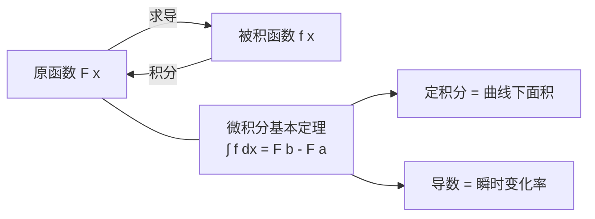

# 微积分基础

> [!abstract] 概览
> 微积分是物理竞赛最核心的数学工具。高中物理中许多只能"定性理解"的概念——瞬时速度、变力做功、连续体质量分布——一旦掌握了微积分，就能"定量计算"。本笔记从==极限==出发，建立==导数==（描述变化率）与==积分==（描述累积）两大概念，并通过==微积分基本定理==将二者统一为互逆运算。在此基础上介绍常用求导法则与积分技巧，最后落到物理应用：运动学中 $v=\dfrac{ds}{dt}$、功 $W=\int F\,dx$、转动惯量 $I=\int r^2\,dm$、质心 $x_c=\dfrac{\int x\,dm}{\int dm}$。本笔记是 [[02-微分方程初步]]、[[03-矢量运算]]、[[04-泰勒展开与级数]] 的直接前置，也是整个竞赛物理的数学基石。

## 核心概念

### 一、极限——微积分的基石

**极限的直观定义**：当自变量 $x$ 无限趋近于某值 $a$ 时，函数 $f(x)$ 无限趋近于确定值 $L$，则称 $x\to a$ 时 $f(x)$ 的极限为 $L$，记作
$$
\lim_{x\to a} f(x) = L
$$
其精髓是"无限接近但可以不到达"——$x$ 是否等于 $a$ 并不重要，重要的是 $f(x)$ 的趋势。

**极限的严格定义（$\varepsilon$-$\delta$ 语言）**：$\lim_{x\to a}f(x)=L$ 意味着——对任意 $\varepsilon>0$（无论多小），都存在 $\delta>0$，使得当 $0<|x-a|<\delta$ 时，恒有 $|f(x)-L|<\varepsilon$。

> [!note] $\varepsilon$-$\delta$ 语言的物理直觉
> 可以把 $\varepsilon$ 想象为"允许的误差"，$\delta$ 想象为"需要的精度"。定义说的是：==只要你对结果 $L$ 的精度要求（$\varepsilon$）提出来，我总能找到足够精细的输入范围（$\delta$）来满足它==。这种"任意精度都可达到"的刻画，比"无限接近"更严格。高中阶段理解直观定义即可，但了解 $\varepsilon$-$\delta$ 有助于区分"极限存在"与"函数值存在"。

**极限运算法则**：若 $\lim f(x)=A$，$\lim g(x)=B$，则
$$
\lim[f(x)\pm g(x)] = A\pm B, \quad \lim[f(x)\cdot g(x)] = AB, \quad \lim\frac{f(x)}{g(x)} = \frac{A}{B}\ (B\ne 0)
$$

**两个重要极限**：
$$
\boxed{\,\lim_{x\to 0}\frac{\sin x}{x}=1\,}, \qquad \boxed{\,\lim_{x\to\infty}\left(1+\frac{1}{x}\right)^x = e\,}
$$
前者是三角函数求导的根基（在 $x=0$ 附近 $\sin x\approx x$），后者定义了自然常数 $e\approx 2.718$，是指数函数与对数函数的"灵魂"。

**无穷小量与等价无穷小**：若 $\lim_{x\to a}\alpha(x)=0$，则称 $\alpha$ 是 $x\to a$ 时的无穷小。两个无穷小 $\alpha,\beta$ 若 $\lim\dfrac{\beta}{\alpha}=1$，称二者==等价==，记 $\beta\sim\alpha$。常用等价无穷小（$x\to 0$）：

| 无穷小 | 等价式 |
| --- | --- |
| $\sin x$ | $\sim x$ |
| $\tan x$ | $\sim x$ |
| $1-\cos x$ | $\sim \dfrac{x^2}{2}$ |
| $e^x-1$ | $\sim x$ |
| $\ln(1+x)$ | $\sim x$ |
| $(1+x)^n-1$ | $\sim nx$ |

> [!tip] 等价无穷小代换
> 在求极限时，==乘除因子==可替换为等价无穷小以简化计算；但加减项中替换需谨慎，可能丢失精度。这是 [[04-泰勒展开与级数]] 中小角度近似的理论基础。

**单侧极限**：自变量从左侧趋近 $a$（记 $x\to a^-$）与从右侧趋近 $a$（记 $x\to a^+$）时的极限分别称为==左极限==与==右极限==。极限存在的充要条件是左右极限存在且相等：
$$
\boxed{\,\lim_{x\to a}f(x)=L \iff \lim_{x\to a^-}f(x)=\lim_{x\to a^+}f(x)=L\,}
$$
物理中常用单侧极限描述"从一个方向逼近"的临界过程，例如用 $\lim_{x\to 0^+}$ 处理只在 $x>0$ 有定义的情形。

**无穷极限**：一类是 $x\to\infty$ 时 $f(x)$ 趋于确定值 $L$，记 $\lim_{x\to\infty}f(x)=L$，几何上对应==水平渐近线==；另一类是 $x\to a$ 时 $f(x)$ 趋于无穷大，记 $\lim_{x\to a}f(x)=\infty$，这表示极限==不存在==（发散），几何上对应==垂直渐近线==。在物理建模中，$x\to\infty$ 的极限常用于"远离源点后场趋于零"之类的边界条件，如 $E\sim \dfrac{1}{r^2}\to 0\ (r\to\infty)$。

**夹逼准则（Squeeze Theorem）**：若在 $x=a$ 的某个去心邻域内恒有
$$
g(x)\le f(x)\le h(x),\qquad \lim_{x\to a}g(x)=\lim_{x\to a}h(x)=L
$$
则 $\lim_{x\to a}f(x)=L$。夹逼准则的价值在于：当 $f$ 本身难以直接求极限时，可以用两个"夹住"它的简单函数来确定极限。

> [!note] 夹逼准则的经典应用
> 1. **证明 $\lim_{x\to 0}\dfrac{\sin x}{x}=1$**：在单位圆中，用扇形面积与三角形面积可建立 $\cos x\le \dfrac{\sin x}{x}\le 1$，两侧均趋于 $1$，由夹逼准则即得 $\dfrac{\sin x}{x}\to 1$。这比直观"$\sin x\approx x$"更严格，是整个三角求导体系的地基。
> 2. **$\lim_{x\to 0}x^2\sin\dfrac{1}{x}=0$**：因为 $-x^2\le x^2\sin\frac1x\le x^2$，而 $x^2\to 0$，故极限为 $0$。虽然 $\sin\frac1x$ 在原点附近剧烈震荡，但振幅 $x^2$ 被压到零——这体现了夹逼准则处理"震荡但有界"情形的威力。

### 二、导数——描述变化率

**导数的定义**：函数 $f(x)$ 在 $x$ 处的导数为
$$
\boxed{\,f'(x) = \lim_{\Delta x\to 0}\frac{f(x+\Delta x)-f(x)}{\Delta x}\,}
$$
它表示函数在 $x$ 处的==瞬时变化率==。该极限若存在，称 $f$ 在 $x$ 处可导。

**几何意义**：$f'(x)$ 是曲线 $y=f(x)$ 在点 $(x,f(x))$ 处==切线的斜率==。割线斜率 $\dfrac{\Delta y}{\Delta x}$ 取极限即得切线斜率。

**物理意义**：导数即==瞬时变化率==。这是微积分在物理中最重要的翻译：
- 位移 $s(t)$ 的导数是瞬时速度：$v=\dfrac{ds}{dt}$
- 速度 $v(t)$ 的导数是瞬时加速度：$a=\dfrac{dv}{dt}$
- 反过来，加速度是位移的二阶导数：$a=\dfrac{d^2s}{dt^2}$

> [!note] 从平均到瞬时
> 高中物理用 $\bar v=\dfrac{\Delta s}{\Delta t}$ 定义平均速度，当 $\Delta t\to 0$ 时即得瞬时速度——这正是导数定义的物理原型。可以说，==瞬时速度就是导数概念在物理上的第一次登场==。

**连续与可导的关系**：
- ==可导必连续==：若 $f$ 在 $x$ 处可导，则 $f$ 必在 $x$ 处连续。因为
$$
\lim_{\Delta x\to 0}\Delta y=\lim_{\Delta x\to 0}\frac{\Delta y}{\Delta x}\cdot\Delta x = f'(x)\cdot 0 = 0
$$
- ==连续不一定可导==：$f(x)=|x|$ 在 $x=0$ 处连续，但 $\lim\limits_{\Delta x\to 0^-}\dfrac{\Delta y}{\Delta x}=-1$、$\lim\limits_{\Delta x\to 0^+}\dfrac{\Delta y}{\Delta x}=+1$，左右导数不相等，故不可导。几何上看，$y=|x|$ 在原点是一个==尖点==（两侧切线斜率无法唯一确定）。

| 关系 | 说明 | 典型例子 |
| --- | --- | --- |
| 可导 $\Rightarrow$ 连续 | 可导必连续（上述乘积取极限） | 一切多项式、$\sin x$ 等 |
| 连续 $\nRightarrow$ 可导 | 连续不一定可导（尖点处） | $f(x)=|x|$ 在 $x=0$ |

> [!warning] 物理直觉：尖点与突变
> 位移 $s(t)$ 必须连续（物体不可能"瞬移"），但速度 $v(t)=\dfrac{ds}{dt}$ 可以是尖点——例如理想化碰撞中物体速率大小不变但方向瞬间反转，此时 $s(t)$ 在碰撞瞬间连续但不可导。竞赛中遇到这类"折线型"运动图像，就要意识到相应点处不可导、速度发生跳变。

### 三、积分——描述累积

**不定积分**：若 $F'(x)=f(x)$，则称 $F(x)$ 是 $f(x)$ 的一个==原函数==。$f(x)$ 的所有原函数构成不定积分：
$$
\int f(x)\,dx = F(x) + C
$$
其中 $C$ 为积分常数。不定积分是求导的==逆运算==。

**定积分**：函数 $f(x)$ 在 $[a,b]$ 上的定积分定义为黎曼和的极限：
$$
\int_a^b f(x)\,dx = \lim_{n\to\infty}\sum_{i=1}^n f(x_i)\,\Delta x
$$
即将区间无限细分，求所有小矩形面积之和的极限。

**几何意义**：定积分 $\int_a^b f(x)\,dx$ 等于曲线 $y=f(x)$ 与 $x$ 轴在 $[a,b]$ 间围成的==有向面积==（$x$ 轴上方为正，下方为负）。

**微积分基本定理（牛顿—莱布尼茨公式）**：若 $F'(x)=f(x)$，则
$$
\boxed{\,\int_a^b f(x)\,dx = F(b) - F(a)\,}
$$
这一定理将"求面积"（积分）与"求变化率"（导数）这两个看似无关的问题==统一为互逆运算==，是微积分最美妙的结果。

## 推导与原理

### 一、基本求导公式与法则

**基本初等函数求导**：

| 函数 | 导数 |
| --- | --- |
| $x^n$ | $nx^{n-1}$ |
| $\sin x$ | $\cos x$ |
| $\cos x$ | $-\sin x$ |
| $e^x$ | $e^x$ |
| $\ln x$ | $\dfrac{1}{x}$ |

**四则运算法则**：
$$
(u\pm v)' = u'\pm v', \quad (uv)' = u'v + uv', \quad \left(\frac{u}{v}\right)' = \frac{u'v - uv'}{v^2}
$$

**链式法则（复合函数求导）**：若 $y=f(g(x))$，则
$$
\frac{dy}{dx} = f'(g(x))\cdot g'(x)
$$
口诀："==由外向内，逐层求导，相乘==。"

**高阶导数**：导数的导数。二阶导数 $f''(x)=\dfrac{d}{dx}f'(x)$。物理中加速度是位移的二阶导数 $a=\dfrac{d^2s}{dt^2}$，这是最常见的高阶导数。

**偏导数（简介）**：对多元函数 $f(x,y)$，固定 $y$ 对 $x$ 求导即偏导数 $\dfrac{\partial f}{\partial x}$。物理中常见于热力学（$P,V,T$ 间偏导关系）与场论（梯度、散度、旋度，详见 [[03-矢量运算]]）。

**隐函数求导**：若 $y$ 由方程 $F(x,y)=0$ 隐式确定，两边对 $x$ 求导时，把 $y$ 视为 $x$ 的函数，凡是"含 $y$ 的项"求导后都要==乘以 $y'$==。例如 $x^2+y^2=1$，两边求导：
$$
2x+2y\cdot y'=0 \;\Rightarrow\; y'=-\frac{x}{y}
$$
这避免了显式解出 $y$（在圆方程中 $y=\pm\sqrt{1-x^2}$ 需分段讨论，用隐函数求导则一视同仁）。

**参数方程求导**：若 $y=y(t)$、$x=x(t)$，则
$$
\frac{dy}{dx}=\frac{dy/dt}{dx/dt}
$$
不必消去 $t$ 即可得到 $y$ 对 $x$ 的导数；二阶导数则
$$
\frac{d^2y}{dx^2}=\frac{\dfrac{d}{dt}\left(\dfrac{dy}{dx}\right)}{\dfrac{dx}{dt}}
$$
物理中质点的运动轨迹常用参数方程 $x(t),\,y(t)$ 描述，轨迹斜率即 $dy/dx$，与此处直接对应。

**对数求导法**：对形如 $y=x^x$、$y=(x^2+1)^{\sin x}$ 这类"幂指函数"或复杂乘除结构，先取对数再求导。以 $y=x^x$ 为例：
$$
\ln y=x\ln x \;\Rightarrow\; \frac{y'}{y}=\ln x+1 \;\Rightarrow\; y'=x^x(\ln x+1)
$$
技巧在于由链式法则 $\dfrac{d}{dx}\ln y=\dfrac{y'}{y}$，把"指数上的变量"拉下来化为乘积求导。物理中常处理 $T=T_0\,e^{kt}$ 形式的量，若已知 $\ln T$ 的线性关系便可反推增长率。

**微分与微分近似**：设 $y=f(x)$ 可导，记 $dy=f'(x)\,dx$ 为==微分==，它给出 $\Delta y$ 的线性主部：
$$
\boxed{\,\Delta y \approx dy = f'(x)\,dx\,}\qquad (|\Delta x|\ll 1)
$$
即当 $\Delta x$ 很小时，函数值的改变量可用切线增量近似。这是实验数据处理（误差传递）与近似计算的利器，也是 [[04-泰勒展开与级数]] 一阶截断的雏形。例：$\sqrt{1.02}\approx 1+\dfrac12\times0.02=1.01$。

### 二、基本积分公式

由求导公式逆推：

$$
\int x^n\,dx = \frac{x^{n+1}}{n+1}+C\ (n\ne -1), \quad \int \frac{1}{x}\,dx = \ln|x|+C
$$

$$
\int \sin x\,dx = -\cos x + C, \quad \int \cos x\,dx = \sin x + C, \quad \int e^x\,dx = e^x + C
$$

### 三、换元积分法

设 $u=g(x)$，则 $du=g'(x)\,dx$，于是
$$
\int f(g(x))\,g'(x)\,dx = \int f(u)\,du
$$
关键是==识别复合结构==，把"复杂部分"整体换元。例如 $\int 2x\,e^{x^2}\,dx$，令 $u=x^2$，$du=2x\,dx$，得 $\int e^u\,du=e^{x^2}+C$。

**三角换元（第二类换元）**：当被积函数含 $\sqrt{a^2-x^2}$、$\dfrac{1}{1+x^2}$ 等形式时，反向用三角恒等式简化。基本结论：
$$
\int \frac{dx}{1+x^2}=\arctan x+C,\qquad \int\frac{dx}{\sqrt{a^2-x^2}}=\arcsin\frac{x}{a}+C
$$
推导思路（以 $\dfrac{1}{1+x^2}$ 为例）：令 $x=\tan\theta$，则 $dx=\sec^2\theta\,d\theta$、$1+x^2=\sec^2\theta$，于是
$$
\int\frac{dx}{1+x^2}=\int\frac{\sec^2\theta\,d\theta}{\sec^2\theta}=\int d\theta=\theta+C=\arctan x+C
$$
物理中这类积分常见于均匀带电直线的电场、库仑势的叠加等计算。注意：做==定积分==的三角换元时，积分限必须随之改为 $\theta$ 的对应值，否则代回 $x$ 时会出错（见"易错提醒"第 8 条）。

### 四、分部积分法

由乘法求导法则 $(uv)'=u'v+uv'$ 积分得：
$$
\boxed{\,\int u\,dv = uv - \int v\,du\,}
$$
适用于被积函数是两类函数乘积的情形（如 $x e^x$、$x\sin x$、$x\ln x$），口诀："==反对幂指三=="——按反三角、对数、幂函数、指数、三角的顺序选 $u$。

### 五、部分分式积分

被积函数为有理函数 $R(x)=\dfrac{P(x)}{Q(x)}$ 时，先做==部分分式分解==，把复杂分式拆成可逐个积分的基本型。例如
$$
\frac{1}{x^2-1}=\frac{1}{2}\left(\frac{1}{x-1}-\frac{1}{x+1}\right),\qquad
\frac{1}{x(x+1)}=\frac{1}{x}-\frac{1}{x+1}
$$
分解后逐项积分：
$$
\int\frac{dx}{x^2-1}=\frac{1}{2}\ln\left|\frac{x-1}{x+1}\right|+C
$$

> [!tip] 竞赛小技巧
> 物理中许多一维运动的分离变量求解（如 $dt=\dfrac{m\,dx}{F(x)}$ 后对 $\dfrac{1}{F(x)}$ 积分）最终都归结为有理函数积分。遇到 $\dfrac{1}{x^2\pm a^2}$、$\dfrac{1}{x(a-x)}$ 这类标准型，应能熟练写出分解式——它们是"运输、扩散、反应速率"等模型的常客。

## 典型实例与物理应用

### 实例 1：运动学——导数与积分的互逆

已知位移 $s(t)=t^3-3t^2+2$，求速度与加速度。
$$
v = \frac{ds}{dt} = 3t^2 - 6t, \quad a = \frac{dv}{dt} = 6t - 6
$$
反之，已知 $a(t)=6t-6$，初始 $v(0)=2$、$s(0)=2$，求 $v(t)$、$s(t)$：
$$
v = \int a\,dt = 3t^2 - 6t + C_1, \quad v(0)=2 \Rightarrow C_1=2
$$
$$
s = \int v\,dt = t^3 - 3t^2 + 2t + C_2, \quad s(0)=2 \Rightarrow C_2=2
$$
这正是 [[00-力学总览]] 中匀变速公式 $v=v_0+at$、$x=x_0+v_0t+\tfrac12 at^2$ 的推广——当 $a$ 不再是常数时，必须用积分。

### 实例 2：变力做功

恒力做功 $W=Fx$ 是高中公式。若力随位置变化 $F=F(x)$，则元功 $dW=F(x)\,dx$，总功为
$$
\boxed{\,W = \int_{x_1}^{x_2} F(x)\,dx\,}
$$
这就是 $F$-$x$ 图像下的面积。例如弹簧从 $0$ 拉到 $x$，$F=kx$，则
$$
W = \int_0^x kx'\,dx' = \frac{1}{2}kx^2
$$
这正是弹性势能 $E_p=\tfrac12 kx^2$ 的来源。

### 实例 3：转动惯量与质心

连续体的转动惯量 $I=\int r^2\,dm$，质心 $x_c=\dfrac{\int x\,dm}{\int dm}$，都是定积分的物理应用。详见后续竞赛笔记。

### 实例 4：冲量——力对时间的累积

恒力冲量 $I=F\Delta t$ 是高中公式。若 $F=F(t)$ 随时间变化，则元冲量 $dI=F(t)\,dt$，总冲量为
$$
\boxed{\,I=\int_{t_1}^{t_2}F(t)\,dt\,}
$$
即 $F$-$t$ 图像下的面积。由动量定理 $\Delta p=I$，可由冲量直接求得动量变化。例如：变力 $F(t)=3t^2$（N）作用 $2$ s，冲量 $I=\int_0^2 3t^2\,dt=8$ N·s，动量变化 $\Delta p=8$ kg·m/s。注意：==做功是力对位移的累积，冲量是力对时间的累积==——两者共用一个"累积"思想，但积分变量不同，这正是"导数是变化率、积分是累积量"的具体体现。

### 实例 5：物理量的时间平均与空间平均

对随时间变化的量 $f(t)$，在 $[t_1,t_2]$ 上的==时间平均==为
$$
\bar f=\frac{1}{t_2-t_1}\int_{t_1}^{t_2}f(t)\,dt
$$
对随位置变化的量 $f(x)$，在 $[x_1,x_2]$ 上的==空间平均==为 $\bar f=\dfrac{1}{x_2-x_1}\int_{x_1}^{x_2}f(x)\,dx$。典型应用：简谐运动 $x=A\cos\omega t$ 在一个周期内 $\bar x=0$（正负对称相消），而==方均根速度== $v_{\text{rms}}=\sqrt{\overline{v^2}}=\dfrac{\omega A}{\sqrt2}$ 正是动能平均 $E_k=\tfrac12 m\overline{v^2}$ 的出发点；平均力 $\bar F=\dfrac{1}{\Delta x}\int F\,dx$ 则用于"等效恒力做功"问题。

### 实例 6：势能曲线与力的关系

一维势能 $U(x)$ 与其保守力满足
$$
\boxed{\,F(x)=-\frac{dU}{dx}\,}
$$
负号表示力指向势能下降的方向。由此可得竞赛中非常实用的三个结论：
1. ==力为零处是势能的极值点==（平衡位置）：$F=-\dfrac{dU}{dx}=0$ 处 $U$ 取极值；
2. ==$U$ 下凸（$\dfrac{d^2U}{dx^2}>0$）处为稳定平衡==，$U$ 上凸处为不稳定平衡——偏离后力是"拉回"还是"推开"由二阶导符号决定；
3. 小偏离附近的简谐运动：在稳定平衡点 $x_0$ 处展开 $U(x)\approx U(x_0)+\tfrac12 U''(x_0)(x-x_0)^2$，等效劲度系数 $k=U''(x_0)$，角频率 $\omega=\sqrt{\dfrac{U''(x_0)}{m}}$。

> [!note] 稳定平衡判据
> 以重力势能 $U=mgh$ 为例：$F=-\dfrac{dU}{dh}=-mg$ 恒指向下，与直觉一致。再看弹簧势能 $U=\tfrac12 kx^2$：$F=-\dfrac{dU}{dx}=-kx$，在 $x=0$ 处 $U''=k>0$，是稳定平衡——偏离后总被拉回。这类"势能曲线判平衡"的思想在分子间力、天体势能、静电势能的讨论中反复出现。

> [!tip] 记忆口诀
> ==导数是变化率，积分是累积量；求导降阶积分升，基本定理连两端。==
> 运动学翻译：$s\xrightarrow{\text{求导}}v\xrightarrow{\text{求导}}a$，反向即 $a\xrightarrow{\text{积分}}v\xrightarrow{\text{积分}}s$。

## 例题

### 例 1：求导与极限——基本计算

**题目**：求 $f(x)=x^2\sin x$ 的导数，并计算 $\lim_{x\to 0}\dfrac{\sin 3x}{x}$。

**分析**：$x^2\sin x$ 是乘积，用乘法法则；极限用等价无穷小 $\sin 3x\sim 3x$。

**解答**：
$$
f'(x) = (x^2)'\sin x + x^2(\sin x)' = 2x\sin x + x^2\cos x
$$
$$
\lim_{x\to 0}\frac{\sin 3x}{x} = \lim_{x\to 0}\frac{3x}{x} = 3
$$

**点评**：乘法法则 $(uv)'=u'v+uv'$ 是最常用的求导法则之一。等价无穷小代换简化极限计算，但注意仅限乘除因子。

### 例 2：定积分——变力做功（物理应用）

**题目**：一质点沿 $x$ 轴运动，受到沿 $x$ 方向的力 $F(x)=6x-2x^2$（单位 N），$x$ 单位 m。求质点从 $x=0$ 运动到 $x=3$ 的过程中力所做的功，并求 $x$ 为何值时力做功最大。

**分析**：变力做功 $W=\int F(x)\,dx$。先积分求 $W(x)$，再对 $W(x)$ 求导令其为零找极值（或直接令 $F(x)=0$ 找拐点）。

**解答**：
$$
W = \int_0^3 (6x - 2x^2)\,dx = \left[3x^2 - \frac{2}{3}x^3\right]_0^3 = 27 - 18 = 9\,\text{J}
$$
功随位置 $x$ 的累积函数 $W(x)=3x^2-\dfrac{2}{3}x^3$，其变化率 $\dfrac{dW}{dx}=F(x)=6x-2x^2$。令 $F(x)=0$ 得 $x=0$ 或 $x=3$，在 $(0,3)$ 内 $F>0$ 故 $W$ 单调增，==在 $x=3$ 处做功最大==（之后 $F$ 反向，功开始减少）。

**点评**：本题展示了 $\dfrac{dW}{dx}=F(x)$ 这一"导数—积分"互逆关系。力为零处是功的极值点——这与运动学中 $v=0$ 处位移极值类似。

### 例 3：分部积分——转动惯量（物理应用）

**题目**：长 $L$、质量 $M$ 的均匀细杆，求绕过一端点且垂直于杆的轴的转动惯量 $I$。

**分析**：线密度 $\lambda=M/L$，微元 $dm=\lambda\,dx$，距轴 $r=x$，故 $I=\int_0^L x^2\,dm=\dfrac{M}{L}\int_0^L x^2\,dx$。

**解答**：
$$
I = \frac{M}{L}\int_0^L x^2\,dx = \frac{M}{L}\cdot\frac{L^3}{3} = \frac{1}{3}ML^2
$$

**点评**：转动惯量 $I=\int r^2\,dm$ 是定积分在刚体力学中的经典应用。对比：绕中点垂直轴 $I=\tfrac{1}{12}ML^2$（用平行轴定理 $I_{\text{端}}=I_{\text{中}}+M(L/2)^2=\tfrac{1}{12}ML^2+\tfrac14 ML^2=\tfrac13 ML^2$ 一致）。积分把"离散求和"推广到"连续分布"，是处理连续体的必备工具。

### 例 4：微分近似——估算立方根

**题目**：不用计算器，估算 $\sqrt[3]{1.001}$ 的值，并估计误差量级。

**分析**：$\sqrt[3]{1.001}=(1+0.001)^{1/3}$，在 $x=1$ 附近对 $f(x)=x^{1/3}$ 用微分近似 $\Delta f\approx f'(1)\,\Delta x$。$f'(x)=\dfrac13 x^{-2/3}$，故 $f'(1)=\dfrac13$，$\Delta x=0.001$。

**解答**：
$$
\sqrt[3]{1.001}\approx 1+\frac13\times 0.001=1+\frac{1}{3000}\approx 1.0003333
$$
误差量级：二阶项 $\tfrac12 f''(1)(\Delta x)^2$ 中 $f''(1)=-\dfrac29$，修正量约为 $-\dfrac19\times 10^{-6}\approx -1.1\times 10^{-7}$，远小于一阶项，故结果精确到 $10^{-6}$ 量级。

**点评**：微分近似 $\Delta y\approx f'(x)\,dx$ 本质是泰勒展开的一阶截断（见 [[04-泰勒展开与级数]]），其思想在物理估算中无处不在——如小角度近似 $\sin\theta\approx\theta$、$g$ 随高度微小变化等。估算类问题还常配合 [[07-近似与估算方法]] 的量级分析。

### 例 5：定积分——非均匀杆的质心

**题目**：长 $L$、总质量 $M$ 的细杆，线密度沿杆长线性增大 $\lambda(x)=\lambda_0\left(1+\dfrac{x}{L}\right)$（$x$ 从 $0$ 到 $L$）。求杆的质心位置。

**分析**：质心 $x_c=\dfrac{\int x\,dm}{\int dm}$，其中 $dm=\lambda(x)\,dx$。总质量 $M=\int_0^L \lambda(x)\,dx$ 可先算出以定出 $\lambda_0$；若仅求质心位置，常数因子最终会约去。

**解答**：
$$
M=\int_0^L\lambda_0\left(1+\frac{x}{L}\right)dx=\lambda_0\left[x+\frac{x^2}{2L}\right]_0^L=\lambda_0\left(L+\frac{L}{2}\right)=\frac32\lambda_0 L
$$
分子
$$
\int_0^L x\,\lambda(x)\,dx=\lambda_0\int_0^L\left(x+\frac{x^2}{L}\right)dx=\lambda_0\left[\frac{x^2}{2}+\frac{x^3}{3L}\right]_0^L=\lambda_0\left(\frac{L^2}{2}+\frac{L^2}{3}\right)=\frac56\lambda_0 L^2
$$
故
$$
x_c=\frac{\frac56\lambda_0 L^2}{\frac32\lambda_0 L}=\frac59L
$$

**点评**：质心偏向密度大的一端（$\frac59L$ 大于均匀杆的 $\frac12L$），符合直觉。本题示范了"微元 $dm$ 假设 + 定积分求和"的完整套路：先写密度函数，再代入 $x_c=\dfrac{\int x\,dm}{\int dm}$。若密度更复杂（如指数分布），只需替换 $\lambda(x)$，积分方法完全一样——这正是微积分"以不变应万变"的威力。

## 易错提醒

> [!warning] 易错点
> 1. **不定积分忘加 $C$**：不定积分结果必须加积分常数 $C$；定积分（牛顿—莱布尼茨公式）则不加。
> 2. **链式法则漏乘内导**：$\dfrac{d}{dx}\sin(x^2)=2x\cos(x^2)$，不是 $\cos(x^2)$——漏了 $g'(x)=2x$。
> 3. **二阶导数符号**：$a=\dfrac{d^2s}{dt^2}$ 有两个上标 2，代表求两次导，不要写成 $\left(\dfrac{ds}{dt}\right)^2$。
> 4. **定积分面积的正负**：$x$ 轴下方面积为负，求总面积需取绝对值或分段。
> 5. **$\dfrac{\sin x}{x}$ 在 $x=0$ 无定义但极限存在**：极限为 1，不等于函数值——这正是极限"趋近但不到达"的含义。
> 6. **物理量积分需配初始条件**：由 $a(t)$ 积分求 $v(t)$、$s(t)$ 必须用初始条件定常数，否则只有"通解"。
> 7. **隐函数求导漏乘 $y'$**：对 $x^2+y^2=1$ 求导得 $2x+2y\,y'=0$，不能写成 $2x+2y=0$——凡对 $y$ 求导的项，必须补乘 $y'=\dfrac{dy}{dx}$。
> 8. **换元积分忘换积分限**：定积分换元后必须同步改变上下限（令 $u=g(x)$，则 $x=a\to u=g(a)$，$x=b\to u=g(b)$），或先求出原函数再代回 $x$。否则上下限仍是 $x$ 的值，代入 $u$ 的式子必然出错。
> 9. **分部积分出现循环**：$\int e^x\sin x\,dx$ 连续两次分部积分会回到自身，正确做法是把积分量视为未知数==移项求解==（循环法）：设 $I=\int e^x\sin x\,dx$，两次分部后得 $I=e^x\sin x-e^x\cos x-I$，解得 $I=\dfrac{e^x}{2}(\sin x-\cos x)+C$。

> [!note] 概念辨析
> **导数 vs 平均变化率**
> 
> | 比较项 | 平均变化率 | 导数（瞬时变化率） |
> | --- | --- | --- |
> | 定义 | $\dfrac{\Delta y}{\Delta x}$ | $\lim_{\Delta x\to 0}\dfrac{\Delta y}{\Delta x}$ |
> | 物理 | 平均速度 $\bar v$ | 瞬时速度 $v$ |
> | 几何 | 割线斜率 | 切线斜率 |
> 
> **不定积分 vs 定积分**
> 
> | 比较项 | 不定积分 | 定积分 |
> | --- | --- | --- |
> | 结果 | 函数族 $F(x)+C$ | 数值 |
> | 意义 | 求导的逆运算 | 黎曼和的极限（面积） |
> | 联系 | 牛顿—莱布尼茨公式：$\int_a^b f\,dx = F(b)-F(a)$ |

## 与其他知识关联

- 与 [[02-微分方程初步]] 的关系：微分方程的求解本质上是对导数方程做积分，本笔记的积分技巧是其基础。
- 与 [[03-矢量运算]] 的关系：矢量函数的导数与积分（如 $\vec v=\dfrac{d\vec r}{dt}$）是本笔记向矢量的推广。
- 与 [[04-泰勒展开与级数]] 的关系：泰勒展开用多项式逼近函数，其系数 $f^{(n)}(a)/n!$ 依赖高阶导数；小角度近似 $\sin x\approx x$ 源自等价无穷小。
- 与 [[05-复数与欧拉公式]] 的关系：$e^{i\theta}$ 的求导性质 $\dfrac{d}{d\theta}e^{i\theta}=ie^{i\theta}$ 是振动分析的利器。
- 与高中物理联系：[[00-力学总览]]（运动学 $v=\dfrac{ds}{dt}$、$a=\dfrac{dv}{dt}$ 是导数原型；匀变速公式是 $a=$ 常数时的积分结果）、[[00-电学总览]]（电容充放电、RC 电路涉及积分）。
- 与大学层面联系：[[机械振动]]（简谐运动方程的解依赖积分）、[[运动学中的微分方程建模与求解]]（由加速度积分求运动）、[[拉格朗日方程]]（变分法是微积分的延伸）。
- 返回 [[00-物理竞赛总览]]

## 作者的话

> [!quote] 个人理解
> 微积分之于物理，犹如代数之于初等数学——它不仅是计算工具，更是==思维方式==的升级。高中物理用代数公式处理"恒定"情形（恒力、匀速、匀加速），一旦物理量开始"变化"，代数便力不从心，而微积分恰好为"变化"而生。
>
> 学习微积分，我建议抓住一条主线：==导数是变化率，积分是累积量，基本定理把它们连起来==。运动学是最好的练兵场——从 $s(t)$ 求导得 $v$、$a$，再由 $a$ 积分回 $v$、$s$，正反走一遍，微积分基本定理就不再是抽象公式，而是活生生的物理过程。
>
> 对竞赛生而言，==求导比积分更常用==——竞赛中大量极值问题（临界角、最短时间、最稳平衡）都归结为"求导令零"。但积分不可忽视：变力做功、连续体质心与转动惯量、场强叠加（如 [[壳层定理]] 的积分推导）都依赖它。建议读者在学完本笔记后，立即回顾高中运动学与功能关系，用微积分重新推导一遍，体会"豁然开朗"之感。进阶的微分方程应用请进入 [[02-微分方程初步]]。

---
*返回 [[00-物理竞赛总览]]*
