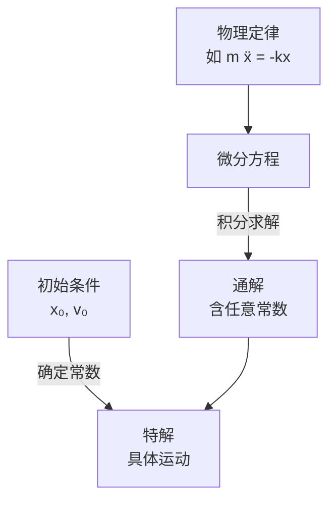

# 微分方程初步

> [!abstract] 概览
> 物理定律的本质往往是==微分方程==——牛顿第二定律 $m\ddot x=F$ 是二阶微分方程，放射性衰变 $\dfrac{dN}{dt}=-\lambda N$ 是一阶微分方程。本笔记在 [[01-微积分基础]] 之上，介绍物理竞赛中最常用的三类微分方程：==可分离变量方程==、==一阶线性方程==、==二阶常系数线性方程==，并以简谐运动、阻尼振动、RLC 电路、放射性衰变为物理应用主线。掌握微分方程，意味着能从"物理定律"直接推导出"运动规律"——这是从高中物理"套公式"迈向竞赛物理"建方程、解方程"的关键一步。

## 核心概念

### 一、什么是微分方程

**微分方程**：含有未知函数的导数（或微分）的方程。例如 $\dfrac{dy}{dx}=ky$、$m\dfrac{d^2x}{dt^2}=-kx$ 都是微分方程。未知函数 $y(x)$ 或 $x(t)$ 正是我们要求解的"运动规律"。

**阶与次**：
- **阶**：方程中出现的==最高阶导数==的阶数。$\dfrac{dy}{dx}=ky$ 是一阶，$m\ddot x=-kx$ 是二阶。
- **次**：方程中==最高阶导数的幂次==。$\dfrac{d^2y}{dx^2}+\left(\dfrac{dy}{dx}\right)^3=0$ 中二阶导数为一次方，故是二次方程（一阶导数三次方不影响"次"的定义，它只看最高阶导数的幂）。物理竞赛中遇到的几乎都是==线性==微分方程——未知函数及其各阶导数都是一次方。

**通解与特解**：
- **通解**：含有==任意常数==的解，常数个数等于方程阶数。一阶方程通解含 1 个常数，二阶含 2 个。
- **特解**：由通解确定常数后得到的==唯一解==，通常由初始条件（初值）确定。

**初始条件**：为确定特解所给的"起点信息"。一阶方程需要一个条件（如 $y(0)=y_0$），二阶方程需要两个（如 $x(0)=x_0$、$\dot x(0)=v_0$）。

> [!note] 通解、特解与初始条件的物理意义
> 通解描述"==所有可能==的运动"，特解描述"==实际发生==的运动"。例如简谐运动通解 $x=A\cos(\omega t+\varphi)$ 含两个常数 $A,\varphi$，代表一切可能的简谐运动；而初始位置 $x_0$ 与初速度 $v_0$ 选定了其中一个具体的运动。==初始条件是从"规律"到"实例"的桥梁==。

### 二、可分离变量方程

形如
$$
\frac{dy}{dx} = f(x)\,g(y)
$$
的方程称为==可分离变量方程==。解法是把 $y$ 与 $dy$ 移一边、$x$ 与 $dx$ 移另一边，再两边积分：
$$
\boxed{\,\int\frac{dy}{g(y)} = \int f(x)\,dx\,}
$$
这是最基本、最常用的微分方程类型。

### 三、一阶线性方程

**标准形式**：
$$
\frac{dy}{dx} + P(x)\,y = Q(x)
$$
当 $Q(x)\equiv 0$ 时称为==齐次==，否则为==非齐次==。

**积分因子法**：乘以积分因子 $\mu(x)=e^{\int P(x)\,dx}$，方程左边可凑成一个全微分：
$$
\frac{d}{dx}\left[\mu\, y\right] = \mu\, Q(x)
$$
两边积分即得通解：
$$
\boxed{\,y = e^{-\int P\,dx}\left[\int Q\,e^{\int P\,dx}\,dx + C\right]\,}
$$

### 四、二阶常系数线性方程

**齐次形式**：
$$
y'' + a\,y' + b\,y = 0 \quad (a,b\text{ 为常数})
$$
**特征方程**：设 $y=e^{rx}$ 代入，得
$$
\boxed{\,r^2 + ar + b = 0\,}
$$
解此二次方程得特征根 $r_{1,2}=\dfrac{-a\pm\sqrt{a^2-4b}}{2}$，根据判别式 $\Delta=a^2-4b$ 分三种情形：

| 判别式 | 特征根 | 通解形式 | 物理对应 |
| --- | --- | --- | --- |
| $\Delta>0$ | 两个不同实根 $r_1\ne r_2$ | $y=C_1 e^{r_1 x}+C_2 e^{r_2 x}$ | 过阻尼 |
| $\Delta=0$ | 重根 $r_1=r_2=r$ | $y=(C_1+C_2 x)e^{rx}$ | 临界阻尼 |
| $\Delta<0$ | 复根 $r=\alpha\pm i\beta$ | $y=e^{\alpha x}(C_1\cos\beta x+C_2\sin\beta x)$ | 欠阻尼振动 |

**非齐次方程** $y''+ay'+by=f(x)$：通解 = 齐次通解 + 非齐次特解。特解可用==待定系数法==——根据 $f(x)$ 形式（多项式、指数、三角）设同型特解代入确定系数。

## 推导与原理

### 一、可分离变量方程的求解流程

以 $\dfrac{dy}{dx}=f(x)g(y)$ 为例：
1. 分离：$\dfrac{dy}{g(y)}=f(x)\,dx$
2. 两边积分：$\displaystyle\int\dfrac{dy}{g(y)}=\int f(x)\,dx$
3. 整理得 $y$ 与 $x$ 的关系（可能隐式）
4. 用初始条件定常数

### 二、一阶线性方程积分因子法的推导

目标：解 $y'+Py=Q$。想法是找一个 $\mu(x)$ 使得左边变成某个函数的全微分。注意到
$$
\frac{d}{dx}(\mu\, y) = \mu\, y' + \mu'\, y
$$
与方程 $y'+Py=Q$ 乘 $\mu$ 后 $\mu y' + \mu P y = \mu Q$ 比较，只要 $\mu'=\mu P$ 即可。解 $\dfrac{\mu'}{\mu}=P$ 得 $\ln\mu=\int P\,dx$，故
$$
\mu = e^{\int P\,dx}
$$
于是 $\dfrac{d}{dx}(\mu y)=\mu Q$，积分得 $\mu y=\int \mu Q\,dx + C$。

### 三、二阶常系数齐次方程的特征方程法

设 $y=e^{rx}$，则 $y'=re^{rx}$，$y''=r^2 e^{rx}$，代入 $y''+ay'+by=0$ 得 $e^{rx}(r^2+ar+b)=0$。因 $e^{rx}\ne 0$，故 $r^2+ar+b=0$。这就是==特征方程==——把微分方程降为代数方程求解，是"微分"转"代数"的巧妙桥梁。

**复根情形的物理解读**：当 $r=\alpha\pm i\beta$，通解 $y=e^{\alpha x}(C_1\cos\beta x+C_2\sin\beta x)$。$\alpha$ 控制==振幅的指数衰减/增长==，$\beta$ 控制==振荡频率==。这正是阻尼振动的数学原型。

> [!tip] 复根与欧拉公式
> 复根情形的解涉及 $\cos$、$\sin$，其本质来自 [[05-复数与欧拉公式]] $e^{i\beta x}=\cos\beta x+i\sin\beta x$。物理取实部即得振动解。这是复数在物理中"化简实数运算"的经典体现。

## 典型实例与物理应用

### 实例 1：指数增长与衰减——可分离变量

方程 $\dfrac{dy}{dt}=ky$：分离得 $\dfrac{dy}{y}=k\,dt$，积分得 $\ln y=kt+C$，即
$$
y = y_0\, e^{kt}
$$
$k>0$ 为指数增长（人口、细菌），$k<0$ 为指数衰减（放射性衰变 $N=N_0 e^{-\lambda t}$）。

### 实例 2：简谐运动——二阶常系数齐次

弹簧振子 $m\ddot x=-kx$，即 $\ddot x+\omega^2 x=0$（$\omega^2=k/m$）。特征方程 $r^2+\omega^2=0$，复根 $r=\pm i\omega$，故
$$
x = C_1\cos\omega t + C_2\sin\omega t = A\cos(\omega t+\varphi)
$$
这正是 [[机械振动]] 的核心结论。注意此处 $\alpha=0$（无阻尼），振幅恒定。

### 实例 3：阻尼振动——三种阻尼

$m\ddot x+b\dot x+kx=0$，即 $\ddot x+2\gamma\dot x+\omega_0^2 x=0$（$\gamma=b/2m$，$\omega_0^2=k/m$）。特征方程 $r^2+2\gamma r+\omega_0^2=0$，判别式 $\Delta=4(\gamma^2-\omega_0^2)$：

- **欠阻尼**（$\gamma<\omega_0$）：复根，$x=Ae^{-\gamma t}\cos(\omega t+\varphi)$，==振荡衰减==，$\omega=\sqrt{\omega_0^2-\gamma^2}$。
- **临界阻尼**（$\gamma=\omega_0$）：重根，$x=(C_1+C_2 t)e^{-\gamma t}$，==最快回到平衡无振荡==（仪表指针设计目标）。
- **过阻尼**（$\gamma>\omega_0$）：两实根，$x=C_1 e^{r_1 t}+C_2 e^{r_2 t}$，==缓慢非振荡衰减==。

### 实例 4：RC 电路与 RLC 电路

- **RC 放电**：$RC\dfrac{dq}{dt}+q=0$，可分离变量，解 $q=q_0 e^{-t/RC}$。时间常数 $\tau=RC$。
- **RLC 电路**：$L\ddot q+R\dot q+\dfrac{1}{C}q=0$，与阻尼振动方程==完全同构==（$L\leftrightarrow m$，$R\leftrightarrow b$，$1/C\leftrightarrow k$）。力—电类比是物理竞赛的重要思想。

> [!tip] 记忆口诀
> ==可离变量两边分，一阶线性积分因子；二阶常系特征根，实重复根虚振荡。==
> 阻尼三型记判别：小则振、等则临、大则过。

## 例题

### 例 1：可分离变量——牛顿冷却定律

**题目**：牛顿冷却定律指出物体温度变化率与温差成正比：$\dfrac{dT}{dt}=-k(T-T_s)$，其中 $T_s$ 为环境温度。设 $T_s=20^\circ\text{C}$，物体初温 $T(0)=100^\circ\text{C}$，$30\,\text{min}$ 后测得 $T=60^\circ\text{C}$。求：（1）$T(t)$；（2）冷却到 $30^\circ\text{C}$ 所需时间。

**分析**：令 $\theta=T-T_s$，方程化为 $\dfrac{d\theta}{dt}=-k\theta$，可分离变量。

**解答**：
（1）分离变量：$\dfrac{d\theta}{\theta}=-k\,dt$，积分得 $\theta=\theta_0 e^{-kt}$，即
$$
T - 20 = (100-20)e^{-kt} = 80\,e^{-kt}
$$
由 $T(30)=60$：$60-20=80e^{-30k}$，$e^{-30k}=\dfrac12$，故 $k=\dfrac{\ln 2}{30}\approx 0.0231\,\text{min}^{-1}$。
$$
T(t) = 20 + 80\,e^{-kt}
$$

（2）$T=30$ 时：$30-20=80e^{-kt}$，$e^{-kt}=\dfrac18=\left(\dfrac12\right)^3$，故 $kt=3\ln 2$，$t=90\,\text{min}$。

**点评**：牛顿冷却是可分离变量方程的经典物理应用。技巧：令 $\theta=T-T_s$ 把非齐次化为齐次。注意到温度从 $100\to 60\to 30$，每次"温差减半"用时相同（$30\,\text{min}$）——这是指数衰减的==等倍时间不变性==。

### 例 2：一阶线性方程——RC 电路放电

**题目**：电容 $C$ 充电至 $q_0$ 后通过电阻 $R$ 放电，电路方程为 $R\dfrac{dq}{dt}+\dfrac{q}{C}=0$。若电源改为恒定电动势 $\mathcal{E}$ 串联充电（方程 $R\dfrac{dq}{dt}+\dfrac{q}{C}=\mathcal{E}$），初态 $q(0)=0$，求充电过程 $q(t)$。

**分析**：充电方程是一阶线性非齐次方程 $\dfrac{dq}{dt}+\dfrac{q}{RC}=\dfrac{\mathcal{E}}{R}$，用积分因子法。

**解答**：$P=\dfrac{1}{RC}$，$Q=\dfrac{\mathcal{E}}{R}$。积分因子 $\mu=e^{t/RC}$。
$$
\frac{d}{dt}\left(q\,e^{t/RC}\right) = \frac{\mathcal{E}}{R}\,e^{t/RC}
$$
积分：$q\,e^{t/RC}=\dfrac{\mathcal{E}}{R}\cdot RC\,e^{t/RC}+C_1=C\mathcal{E}\,e^{t/RC}+C_1$。由 $q(0)=0$ 得 $C_1=-C\mathcal{E}$，故
$$
\boxed{\,q(t) = C\mathcal{E}\left(1-e^{-t/RC}\right)\,}
$$
时间常数 $\tau=RC$：$t=\tau$ 时充电达 $1-e^{-1}\approx 63\%$。

**点评**：RC 充放电是 [[00-电学总览]] 的典型瞬态过程。放电 $q=q_0 e^{-t/\tau}$、充电 $q=C\mathcal{E}(1-e^{-t/\tau})$ 一降一升，时间常数相同——这是[[04-泰勒展开与级数]]中"指数函数的特征时间"思想的应用。一阶线性方程的积分因子法是处理 RC/RL 瞬态的通用工具。

### 例 3：二阶常系数——阻尼振动（物理应用）

**题目**：质量 $m=1\,\text{kg}$ 的物体连劲度系数 $k=25\,\text{N/m}$ 的弹簧，阻力 $f=-b\dot x$，$b=6\,\text{N·s/m}$。初始 $x(0)=0.1\,\text{m}$，$\dot x(0)=0$。求：（1）运动方程 $x(t)$；（2）判断阻尼类型；（3）写出振幅衰减规律。

**分析**：运动方程 $m\ddot x+b\dot x+kx=0$，即 $\ddot x+6\dot x+25x=0$。求特征根判断阻尼类型。

**解答**：
（1）特征方程 $r^2+6r+25=0$，$r=\dfrac{-6\pm\sqrt{36-100}}{2}=-3\pm 4i$。$\Delta<0$，==欠阻尼==。
$$
x(t) = e^{-3t}(C_1\cos 4t + C_2\sin 4t)
$$
由 $x(0)=0.1$：$C_1=0.1$。$\dot x(0)=0$：求导得 $\dot x=e^{-3t}[(-3C_1+4C_2)\cos 4t+(-4C_1-3C_2)\sin 4t]$，令 $t=0$：$-3C_1+4C_2=0$，$C_2=\dfrac{3C_1}{4}=0.075$。故
$$
x(t)=e^{-3t}(0.1\cos 4t+0.075\sin 4t)
$$

（2）$\gamma=\dfrac{b}{2m}=3$，$\omega_0=\sqrt{k/m}=5$，$\gamma<\omega_0$，确认为欠阻尼。振荡频率 $\omega=\sqrt{\omega_0^2-\gamma^2}=\sqrt{25-9}=4\,\text{rad/s}$。

（3）振幅 $A(t)=A_0 e^{-\gamma t}=A_0 e^{-3t}$，按 $e^{-3t}$ 指数衰减。振幅初值 $A_0=\sqrt{0.1^2+0.075^2}=0.125\,\text{m}$，故 $x(t)=0.125\,e^{-3t}\cos(4t-\varphi)$，$\tan\varphi=0.075/0.1=0.75$。

**点评**：本题是阻尼振动的标准流程——列方程→特征方程→判类型→定常数。关键对比：$\gamma$ 与 $\omega_0$ 的大小决定阻尼类型，这是 [[机械振动]] 的核心判据。力—电类比下，本例与 RLC 电路 $L\ddot q+R\dot q+\dfrac{q}{C}=0$ 完全同构。

## 易错提醒

> [!warning] 易错点
> 1. **通解常数个数 = 方程阶数**：一阶方程一个常数，二阶两个。初始条件个数也要对应——二阶方程只给 $x(0)$ 不够，还需 $\dot x(0)$。
> 2. **可分离变量忘验 $g(y)=0$ 的解**：分离时除以 $g(y)$ 可能丢失 $g(y)=0$ 对应的常数解（平衡解）。
> 3. **特征方程符号**：$y''+ay'+by=0$ 对应 $r^2+ar+b=0$，注意 $a,b$ 的==符号==要原样代入。$m\ddot x+b\dot x+kx=0$ 要先除以 $m$ 标准化。
> 4. **阻尼频率 $\omega\ne\omega_0$**：欠阻尼振荡频率 $\omega=\sqrt{\omega_0^2-\gamma^2}$，比固有频率 $\omega_0$ 小——阻尼"拖慢"了振动。
> 5. **复根通解写法**：$e^{\alpha x}(C_1\cos\beta x+C_2\sin\beta x)$ 不要漏掉指数因子 $e^{\alpha x}$，否则变成无阻尼振动。
> 6. **物理量方向**：$m\ddot x=-kx$ 的负号代表回复力指向平衡位置，列方程时切勿漏掉。

> [!note] 概念辨析
> **齐次 vs 非齐次**
> 
> | 比较项 | 齐次方程 | 非齐次方程 |
> | --- | --- | --- |
> | 形式 | $y''+ay'+by=0$ | $y''+ay'+by=f(x)$ |
> | 通解 | $C_1 y_1+C_2 y_2$ | 齐次通解 + 特解 |
> | 物理 | 自由振动（无外力） | 受迫振动（有驱动力） |
> 
> **三种阻尼对比**
> 
> | 类型 | 条件 | 运动 | 回到平衡 |
> | --- | --- | --- | --- |
> | 欠阻尼 | $\gamma<\omega_0$ | 振荡衰减 | 多次穿越平衡 |
> | 临界阻尼 | $\gamma=\omega_0$ | 单调最快 | 最快无振荡 |
> | 过阻尼 | $\gamma>\omega_0$ | 单调缓慢 | 缓慢爬回 |

## 与其他知识关联

- 与 [[01-微积分基础]] 的关系：微分方程的求解本质是对导数方程做积分，分离变量与积分因子法都依赖 [[01-微积分基础]] 中的积分技巧。
- 与 [[03-矢量运算]] 的关系：牛顿第二定律 $\vec F=m\vec a$ 是矢量微分方程，分量后即本笔记讨论的标量方程。
- 与 [[04-泰勒展开与级数]] 的关系：弱阻尼近似、小振动近似常借助泰勒展开线性化（如单摆 $\sin\theta\approx\theta$）。
- 与 [[05-复数与欧拉公式]] 的关系：二阶方程复根通解、受迫振动的稳态分析均借助复数简化，$e^{i\omega t}$ 是处理振动的标准工具。
- 与高中物理联系：[[00-力学总览]]（简谐运动、阻尼振动）、[[00-电学总览]]（RC 充放电、RLC 振荡电路，方程同构）。
- 与大学层面联系：[[机械振动]]（简谐运动、阻尼振动、受迫振动与共振的系统化研究）、[[运动学中的微分方程建模与求解]]（由加速度积分求运动规律）、[[拉格朗日方程]]（拉格朗日方程是二阶微分方程组，是牛顿力学的推广形式）。
- 返回 [[00-物理竞赛总览]]

## 作者的话

> [!quote] 个人理解
> 微分方程是==物理定律的数学语言==。牛顿的伟大不在于"发现"了 $F=ma$，而在于认识到这个看似简单的等式其实是一个==二阶微分方程==——它蕴含了一切力学运动的全部信息。从"定律"到"运动"，中间的桥梁就是"解方程"。
>
> 物理竞赛中，==列方程比解方程更重要==。看到一个物理情境，能否迅速写出对应的微分方程（如"弹簧+阻力"→$\ddot x+2\gamma\dot x+\omega_0^2 x=0$），是竞赛成熟度的标志。解方程的技巧是有限的——本笔记覆盖的三类方程已能处理竞赛中绝大多数情形。真正考验功底的是"建模"：把物理图像翻译成方程。
>
> 一个深刻的体会是==力—电类比==。弹簧振子与 RLC 电路、阻尼振动与电磁阻尼，背后是==同一个方程==。这种"不同现象、同一数学结构"的统一性，正是物理之美的体现。掌握微分方程后，你会发现 [[机械振动]] 中的共振、[[波函数与薛定谔方程]] 中的量子演化，乃至 [[场方程与施瓦西解]] 中的时空几何，都是微分方程的不同化身。从 $m\ddot x=-kx$ 出发，一路通向整个物理学。

---
*返回 [[00-物理竞赛总览]]*
