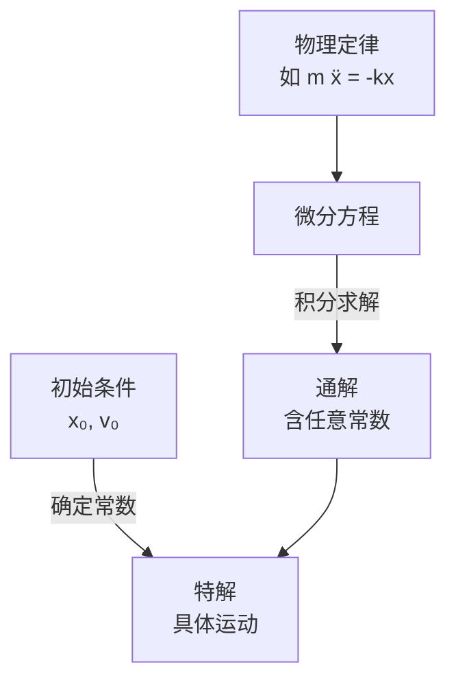

# 微分方程初步

> [!abstract] 概览
> 物理定律的本质往往是==微分方程==——牛顿第二定律 $m\ddot x=F$ 是二阶微分方程，放射性衰变 $\dfrac{dN}{dt}=-\lambda N$ 是一阶微分方程。本笔记在 [[01-微积分基础]] 之上，介绍物理竞赛中最常用的三类微分方程：==可分离变量方程==、==一阶线性方程==、==二阶常系数线性方程==，并以简谐运动、阻尼振动、RLC 电路、放射性衰变为物理应用主线。掌握微分方程，意味着能从"物理定律"直接推导出"运动规律"——这是从高中物理"套公式"迈向竞赛物理"建方程、解方程"的关键一步。

## 核心概念

### 一、什么是微分方程

**微分方程**：含有未知函数的导数（或微分）的方程。例如 $\dfrac{dy}{dx}=ky$、$m\dfrac{d^2x}{dt^2}=-kx$ 都是微分方程。未知函数 $y(x)$ 或 $x(t)$ 正是我们要求解的"运动规律"。

**阶与次**：
- **阶**：方程中出现的==最高阶导数==的阶数。$\dfrac{dy}{dx}=ky$ 是一阶，$m\ddot x=-kx$ 是二阶。
- **次**：方程中==最高阶导数的幂次==。$\dfrac{d^2y}{dx^2}+\left(\dfrac{dy}{dx}\right)^3=0$ 中二阶导数为一次方，故是二次方程（一阶导数三次方不影响"次"的定义，它只看最高阶导数的幂）。物理竞赛中遇到的几乎都是==线性==微分方程——未知函数及其各阶导数都是一次方。

**通解与特解**：
- **通解**：含有==任意常数==的解，常数个数等于方程阶数。一阶方程通解含 1 个常数，二阶含 2 个。
- **特解**：由通解确定常数后得到的==唯一解==，通常由初始条件（初值）确定。

**初始条件**：为确定特解所给的"起点信息"。一阶方程需要一个条件（如 $y(0)=y_0$），二阶方程需要两个（如 $x(0)=x_0$、$\dot x(0)=v_0$）。

> [!note] 通解、特解与初始条件的物理意义
> 通解描述"==所有可能==的运动"，特解描述"==实际发生==的运动"。例如简谐运动通解 $x=A\cos(\omega t+\varphi)$ 含两个常数 $A,\varphi$，代表一切可能的简谐运动；而初始位置 $x_0$ 与初速度 $v_0$ 选定了其中一个具体的运动。==初始条件是从"规律"到"实例"的桥梁==。

### 二、可分离变量方程

形如
$$
\frac{dy}{dx} = f(x)\,g(y)
$$
的方程称为==可分离变量方程==。解法是把 $y$ 与 $dy$ 移一边、$x$ 与 $dx$ 移另一边，再两边积分：
$$
\boxed{\,\int\frac{dy}{g(y)} = \int f(x)\,dx\,}
$$
这是最基本、最常用的微分方程类型。

### 三、一阶线性方程

**标准形式**：
$$
\frac{dy}{dx} + P(x)\,y = Q(x)
$$
当 $Q(x)\equiv 0$ 时称为==齐次==，否则为==非齐次==。

**积分因子法**：乘以积分因子 $\mu(x)=e^{\int P(x)\,dx}$，方程左边可凑成一个全微分：
$$
\frac{d}{dx}\left[\mu\, y\right] = \mu\, Q(x)
$$
两边积分即得通解：
$$
\boxed{\,y = e^{-\int P\,dx}\left[\int Q\,e^{\int P\,dx}\,dx + C\right]\,}
$$

### 四、二阶常系数线性方程

**齐次形式**：
$$
y'' + a\,y' + b\,y = 0 \quad (a,b\text{ 为常数})
$$
**特征方程**：设 $y=e^{rx}$ 代入，得
$$
\boxed{\,r^2 + ar + b = 0\,}
$$
解此二次方程得特征根 $r_{1,2}=\dfrac{-a\pm\sqrt{a^2-4b}}{2}$，根据判别式 $\Delta=a^2-4b$ 分三种情形：

| 判别式 | 特征根 | 通解形式 | 物理对应 |
| --- | --- | --- | --- |
| $\Delta>0$ | 两个不同实根 $r_1\ne r_2$ | $y=C_1 e^{r_1 x}+C_2 e^{r_2 x}$ | 过阻尼 |
| $\Delta=0$ | 重根 $r_1=r_2=r$ | $y=(C_1+C_2 x)e^{rx}$ | 临界阻尼 |
| $\Delta<0$ | 复根 $r=\alpha\pm i\beta$ | $y=e^{\alpha x}(C_1\cos\beta x+C_2\sin\beta x)$ | 欠阻尼振动 |

**非齐次方程** $y''+ay'+by=f(x)$：通解 = 齐次通解 + 非齐次特解。特解可用==待定系数法==——根据 $f(x)$ 形式（多项式、指数、三角）设同型特解代入确定系数。

### 五、微分方程的分类：线性/非线性与齐次/非齐次

对物理竞赛而言，拿到一个方程先==分类==——分类决定解法。主要看两条分类轴。

**轴一：按线性分类**

- **线性方程**：未知函数 $y$ 及其各阶导数都只以==一次方==出现，不出现 $y^2$、$yy'$、$\sin y$、$e^y$ 等项。一般形式
$$
a_n(x)\,y^{(n)}+a_{n-1}(x)\,y^{(n-1)}+\cdots+a_1(x)\,y'+a_0(x)\,y=f(x)
$$
- **非线性方程**：含 $y^2$、$(y')^2$、$\sin y$ 等项。例如单摆的精确方程 $\ddot\theta+\dfrac{g}{l}\sin\theta=0$ 就是非线性的。

> [!note] 为什么"线性"如此重要
> 线性方程满足==叠加原理==：两个解的线性组合仍是解。因此二阶线性方程的通解总能写成 $C_1y_1+C_2y_2$（两个线性无关解的线性组合）。非线性方程没有这个性质，通常无法解析求解——这正是 [[07-近似与估算方法]] 中用==小角度近似== $\sin\theta\approx\theta$ 把单摆线性化的根本动机。

**轴二：按齐次分类**（针对线性方程）

- **齐次**：$f(x)\equiv 0$，等式右边为零。自由振动 $m\ddot x+kx=0$ 是齐次的。
- **非齐次**：$f(x)\neq 0$。受迫振动 $m\ddot x+kx=F_0\cos\omega t$ 是非齐次的，$f(x)$ 称为==驱动项/源项==。

两张轴组合起来：本笔记重点覆盖"线性、常系数"方程——物理竞赛中绝大多数微分方程建模都落在此类。而"阶数"轴（一阶/二阶/高阶）在"核心概念·一"中已述。

### 六、解的存在唯一性：从直觉到判定

一个自然的问题：写下 $y'=f(x,y)$（或二阶方程），给定初始条件后，**解一定存在吗？一定唯一吗？** 竞赛不要求严格证明，但要有直觉。

> [!tip] 存在唯一性直觉（皮卡—林德洛夫定理的非形式表述）
> 只要 $f(x,y)$ 与它对 $y$ 的偏导数连续，给定初值 $y(x_0)=y_0$ 后，在初值附近==必有且仅有一个==解。
> - **存在**：物理过程真实发生，方程描述的"运动"必然存在——这是物理世界给出的保证。
> - **唯一**：同一初态下物理结果确定——给定位置与速度，质点之后的运动被完全决定（经典力学的决定性）。

这正是"初始条件的个数 = 方程阶数 = 通解中任意常数的个数"的原因：个数恰好能把所有任意常数定下来。初值给少了，常数定不完（解不唯一）；给多了，条件可能互相矛盾（无解）。

> [!warning] 唯一性失效的反例直觉
> 方程 $\dfrac{dy}{dx}=y^{1/2}$、$y(0)=0$ 有两个解：$y\equiv 0$ 与 $y=\dfrac{x^2}{4}$。原因是 $y^{1/2}$ 在 $y=0$ 处不光滑（导数发散），唯一性失效。竞赛中这类"多解分支"常对应物理上的平衡态，需结合物理判断取舍。

## 推导与原理

### 一、可分离变量方程的求解流程

以 $\dfrac{dy}{dx}=f(x)g(y)$ 为例：
1. 分离：$\dfrac{dy}{g(y)}=f(x)\,dx$
2. 两边积分：$\displaystyle\int\dfrac{dy}{g(y)}=\int f(x)\,dx$
3. 整理得 $y$ 与 $x$ 的关系（可能隐式）
4. 用初始条件定常数

### 二、一阶线性方程积分因子法的推导

目标：解 $y'+Py=Q$。想法是找一个 $\mu(x)$ 使得左边变成某个函数的全微分。注意到
$$
\frac{d}{dx}(\mu\, y) = \mu\, y' + \mu'\, y
$$
与方程 $y'+Py=Q$ 乘 $\mu$ 后 $\mu y' + \mu P y = \mu Q$ 比较，只要 $\mu'=\mu P$ 即可。解 $\dfrac{\mu'}{\mu}=P$ 得 $\ln\mu=\int P\,dx$，故
$$
\mu = e^{\int P\,dx}
$$
于是 $\dfrac{d}{dx}(\mu y)=\mu Q$，积分得 $\mu y=\int \mu Q\,dx + C$。

### 三、二阶常系数齐次方程的特征方程法

设 $y=e^{rx}$，则 $y'=re^{rx}$，$y''=r^2 e^{rx}$，代入 $y''+ay'+by=0$ 得 $e^{rx}(r^2+ar+b)=0$。因 $e^{rx}\ne 0$，故 $r^2+ar+b=0$。这就是==特征方程==——把微分方程降为代数方程求解，是"微分"转"代数"的巧妙桥梁。

**复根情形的物理解读**：当 $r=\alpha\pm i\beta$，通解 $y=e^{\alpha x}(C_1\cos\beta x+C_2\sin\beta x)$。$\alpha$ 控制==振幅的指数衰减/增长==，$\beta$ 控制==振荡频率==。这正是阻尼振动的数学原型。

> [!tip] 复根与欧拉公式
> 复根情形的解涉及 $\cos$、$\sin$，其本质来自 [[05-复数与欧拉公式]] $e^{i\beta x}=\cos\beta x+i\sin\beta x$。物理取实部即得振动解。这是复数在物理中"化简实数运算"的经典体现。

### 四、简谐运动方程的完整求解推导

"实例 2"给出了简谐运动的解，这里补全**从方程到解**的完整推导，重点是 $A,\varphi$ 如何由初位移、初速度确定。

**第一步：设指数试探解。** 对 $\ddot x+\omega^2 x=0$，设 $x=e^{\lambda t}$，则 $\ddot x=\lambda^2 e^{\lambda t}$，代入得
$$
(\lambda^2+\omega^2)e^{\lambda t}=0\;\Longrightarrow\;\lambda^2+\omega^2=0\;\Longrightarrow\;\lambda=\pm i\omega
$$
特征根为纯虚数 $\pm i\omega$。

**第二步：用欧拉公式化为三角函数。** 由 [[05-复数与欧拉公式]]，
$$
e^{i\omega t}=\cos\omega t+i\sin\omega t,\qquad e^{-i\omega t}=\cos\omega t-i\sin\omega t
$$
通解是二者的任意线性组合，取实部并重组任意常数，等价写为
$$
x(t)=C_1\cos\omega t+C_2\sin\omega t
$$

**第三步：化为振幅—相位形式。** 由恒等式 $A\cos(\omega t+\varphi)=A\cos\varphi\cos\omega t-A\sin\varphi\sin\omega t$ 对比得 $C_1=A\cos\varphi$、$C_2=-A\sin\varphi$，故
$$
\boxed{\,x(t)=A\cos(\omega t+\varphi),\qquad A=\sqrt{C_1^2+C_2^2},\qquad \tan\varphi=-\frac{C_2}{C_1}\,}
$$

**第四步：由初位移、初速度定 $A,\varphi$。** 设 $x(0)=x_0$、$\dot x(0)=v_0$。由 $\dot x=-A\omega\sin(\omega t+\varphi)$：
$$
x_0=A\cos\varphi,\qquad v_0=-A\omega\sin\varphi
$$
两式平方相加消去 $\varphi$ 得 $x_0^2+\dfrac{v_0^2}{\omega^2}=A^2$；两式相除得 $\tan\varphi=-\dfrac{v_0}{\omega x_0}$（注意按 $x_0,v_0$ 的符号定象限）。故
$$
\boxed{\,A=\sqrt{x_0^2+\dfrac{v_0^2}{\omega^2}},\qquad \varphi=\arctan\left(-\dfrac{v_0}{\omega x_0}\right)\ (\text{按象限取})\,}
$$

> [!note] 两个常用特例
> - 由静止释放（$v_0=0$）：$A=x_0$，$\varphi=0$，$x=x_0\cos\omega t$。
> - 从平衡位置以初速弹出（$x_0=0$）：$A=\dfrac{v_0}{\omega}$，$\varphi=-\dfrac{\pi}{2}$，$x=\dfrac{v_0}{\omega}\sin\omega t$。
> 这两组结果在 [[机械振动]] 中反复出现，建议亲手推导一遍，而不是只背公式。

### 五、受迫振动与共振

受迫振动（单位质量上作用外力 $F_0\cos\omega t$）方程
$$
\ddot x+\omega_0^2 x=f\cos\omega t
$$
是非齐次方程：通解 = 齐次通解（自由振动）+ 非齐次特解（==稳态解==）。实际系统总有微弱阻尼，自由振动部分会随时间衰减，长期保留的是稳态解。设 $x_p=A\cos\omega t$ 代入：
$$
(-\omega^2 A+\omega_0^2 A)\cos\omega t=f\cos\omega t\;\Longrightarrow\;A=\frac{f}{\omega_0^2-\omega^2}
$$
故稳态解
$$
\boxed{\,x_p(t)=\frac{f}{\omega_0^2-\omega^2}\cos\omega t\,}
$$

**共振**：当 $\omega\to\omega_0$ 时 $|\omega_0^2-\omega^2|\to0$，振幅 $|A|\to\infty$，这就是==共振==。物理图像：驱动频率恰等于固有频率时，外力每周期都在位移方向同向做功，能量持续注入、振幅不断增大。若计入阻尼（$\ddot x+2\gamma\dot x+\omega_0^2 x=f\cos\omega t$），稳态振幅峰值有限，弱阻尼时约为 $\dfrac{f}{2\gamma\omega_0}$，共振频率近似 $\omega_0$。[[机械振动]] 将系统研究共振。

> [!tip] 竞赛速记：无阻尼受迫振动的三频段
> 振幅 $A=\dfrac{f}{|\omega_0^2-\omega^2|}$：
> - $\omega\ll\omega_0$：$A\approx\dfrac{f}{\omega_0^2}$，准静态跟随；
> - $\omega\gg\omega_0$：$A\approx\dfrac{f}{\omega^2}$，来不及响应；
> - $\omega\approx\omega_0$：$A$ 发散，共振。
> 三频段的极限判断是竞赛选择题/说理题的常用手法。

### 六、欧拉折线法：解析失效时如何"走一步"

很多真实方程（单摆精确方程、非线性阻尼）无法解析求解。竞赛虽不要求精确数值，但**欧拉折线法**的思想对"无法解析解时估算下一步"极有价值，也是数值解微分方程的起点。

**思想**：已知 $(t_n,x_n)$ 处的斜率 $\dot x_n=f(t_n,x_n)$，用切线近似未来一小步：
$$
\boxed{\,x_{n+1}=x_n+f(t_n,x_n)\,\Delta t\,}
$$
相当于把连续曲线用折线代替。步长 $\Delta t$ 越小越精确（一阶精度，局部误差 $\propto(\Delta t)^2$，全局误差 $\propto\Delta t$）。

> [!example] 用欧拉折线法走几步
> 解 $\dfrac{dx}{dt}=-x$，$x(0)=1$，取 $\Delta t=0.1$：
> $$
> x_1=1+(-1)\times0.1=0.9,\quad x_2=0.9+(-0.9)\times0.1=0.81,\quad x_3=0.81-0.081=0.729
> $$
> 精确解 $x=e^{-t}$ 在 $t=0.3$ 处为 $e^{-0.3}\approx0.7408$，误差约 $1.6\%$。把步长减半，误差大致也减半——这是检验数值结果可信度的直觉。

## 典型实例与物理应用

### 实例 1：指数增长与衰减——可分离变量

方程 $\dfrac{dy}{dt}=ky$：分离得 $\dfrac{dy}{y}=k\,dt$，积分得 $\ln y=kt+C$，即
$$
y = y_0\, e^{kt}
$$
$k>0$ 为指数增长（人口、细菌），$k<0$ 为指数衰减（放射性衰变 $N=N_0 e^{-\lambda t}$）。

### 实例 2：简谐运动——二阶常系数齐次

弹簧振子 $m\ddot x=-kx$，即 $\ddot x+\omega^2 x=0$（$\omega^2=k/m$）。特征方程 $r^2+\omega^2=0$，复根 $r=\pm i\omega$，故
$$
x = C_1\cos\omega t + C_2\sin\omega t = A\cos(\omega t+\varphi)
$$
这正是 [[机械振动]] 的核心结论。注意此处 $\alpha=0$（无阻尼），振幅恒定。

### 实例 3：阻尼振动——三种阻尼

$m\ddot x+b\dot x+kx=0$，即 $\ddot x+2\gamma\dot x+\omega_0^2 x=0$（$\gamma=b/2m$，$\omega_0^2=k/m$）。特征方程 $r^2+2\gamma r+\omega_0^2=0$，判别式 $\Delta=4(\gamma^2-\omega_0^2)$：

- **欠阻尼**（$\gamma<\omega_0$）：复根，$x=Ae^{-\gamma t}\cos(\omega t+\varphi)$，==振荡衰减==，$\omega=\sqrt{\omega_0^2-\gamma^2}$。
- **临界阻尼**（$\gamma=\omega_0$）：重根，$x=(C_1+C_2 t)e^{-\gamma t}$，==最快回到平衡无振荡==（仪表指针设计目标）。
- **过阻尼**（$\gamma>\omega_0$）：两实根，$x=C_1 e^{r_1 t}+C_2 e^{r_2 t}$，==缓慢非振荡衰减==。

### 实例 4：RC 电路与 RLC 电路

- **RC 放电**：$RC\dfrac{dq}{dt}+q=0$，可分离变量，解 $q=q_0 e^{-t/RC}$。时间常数 $\tau=RC$。
- **RLC 电路**：$L\ddot q+R\dot q+\dfrac{1}{C}q=0$，与阻尼振动方程==完全同构==（$L\leftrightarrow m$，$R\leftrightarrow b$，$1/C\leftrightarrow k$）。力—电类比是物理竞赛的重要思想。

> [!tip] 记忆口诀
> ==可离变量两边分，一阶线性积分因子；二阶常系特征根，实重复根虚振荡。==
> 阻尼三型记判别：小则振、等则临、大则过。

### 实例 5：带线性阻力的抛体运动

低速物体在空气中运动，阻力常正比于速度一次方 $f=-k\vec v$（$k$ 为阻力系数），得到物理竞赛中经典的==一阶线性方程==建模。

**竖直下落**：质量 $m$ 的物体从静止下落，取向下为正，牛顿第二定律
$$
m\frac{dv}{dt}=mg-kv
$$
即 $\dfrac{dv}{dt}+\dfrac{k}{m}v=g$，一阶线性非齐次，积分因子 $\mu=e^{kt/m}$：
$$
\frac{d}{dt}\left(v e^{kt/m}\right)=g\,e^{kt/m}\;\Longrightarrow\; v e^{kt/m}=\frac{mg}{k}e^{kt/m}+C
$$
由 $v(0)=0$ 得 $C=-\dfrac{mg}{k}$，故
$$
\boxed{\,v(t)=v_T\left(1-e^{-t/\tau}\right),\qquad v_T=\frac{mg}{k},\ \tau=\frac{m}{k}\,}
$$

**终端速度**：$t\to\infty$ 时 $v\to v_T=\dfrac{mg}{k}$——此时 $mg=kv_T$，阻力与重力平衡，==匀速下落==。时间常数 $\tau=\dfrac{m}{k}$ 是速度达到终端速度的 $1-e^{-1}\approx63\%$ 所需时间。再积分一次得下落位移（$y(0)=0$）：
$$
y(t)=\int_0^t v_T\left(1-e^{-s/\tau}\right)ds=v_T t-v_T\tau\left(1-e^{-t/\tau}\right)
$$

> [!note] 与无阻力落体的对照
> 无阻力：$v=gt$、$y=\dfrac12gt^2$，速度无界增长。有阻力：速度被"封顶"在 $v_T$，长时间后位移趋于匀速直线 $y\approx v_T t$。短时间（$t\ll\tau$）用泰勒展开 $e^{-t/\tau}\approx1-\dfrac{t}{\tau}+\dfrac{t^2}{2\tau^2}$，可得 $v\approx gt$、$y\approx\dfrac12gt^2$——阻力尚未发挥作用，回到无阻力结果。这种"短时/长时极限检查法"在竞赛中极其实用。

### 实例 6：RL 电路——与 RC 充电平行的一阶瞬态

RC 充电已在"例 2"完整求解，这里补上它的"力—电镜像"RL 电路，体会一阶线性方程的统一性。RL 电路（电阻 $R$、电感 $L$ 串联接恒定电动势 $\mathcal{E}$），回路方程 $L\dfrac{di}{dt}+Ri=\mathcal{E}$，即
$$
\frac{di}{dt}+\frac{R}{L}i=\frac{\mathcal{E}}{L}
$$
初态 $i(0)=0$，积分因子 $\mu=e^{Rt/L}$，解得
$$
\boxed{\,i(t)=\frac{\mathcal{E}}{R}\left(1-e^{-t/\tau}\right),\qquad \tau=\frac{L}{R}\,}
$$

> [!note] 一阶线性瞬态的统一图景
> | 系统 | 方程 | 通解 | 时间常数 |
> | --- | --- | --- | --- |
> | RC 充电 | $R\dfrac{dq}{dt}+\dfrac{q}{C}=\mathcal{E}$ | $q=C\mathcal{E}(1-e^{-t/RC})$ | $\tau=RC$ |
> | RC 放电 | $R\dfrac{dq}{dt}+\dfrac{q}{C}=0$ | $q=q_0 e^{-t/RC}$ | $\tau=RC$ |
> | RL 充电 | $L\dfrac{di}{dt}+Ri=\mathcal{E}$ | $i=\dfrac{\mathcal{E}}{R}(1-e^{-t/\tau})$ | $\tau=\dfrac{L}{R}$ |
> | 阻力落体 | $m\dot v+kv=mg$ | $v=v_T(1-e^{-t/\tau})$ | $\tau=\dfrac{m}{k}$ |
> 一阶线性方程 $\dot y+\dfrac{1}{\tau}y=c$（$c$ 为常数）的"趋稳"型通解 $y=y_\infty(1-e^{-t/\tau})$ 贯穿整个物理；$\tau$ 的统一含义是==逼近稳态的特征时间==。这与 [[00-电学总览]] 的瞬态分析直接对应。

## 例题

### 例 1：可分离变量——牛顿冷却定律

**题目**：牛顿冷却定律指出物体温度变化率与温差成正比：$\dfrac{dT}{dt}=-k(T-T_s)$，其中 $T_s$ 为环境温度。设 $T_s=20^\circ\text{C}$，物体初温 $T(0)=100^\circ\text{C}$，$30\,\text{min}$ 后测得 $T=60^\circ\text{C}$。求：（1）$T(t)$；（2）冷却到 $30^\circ\text{C}$ 所需时间。

**分析**：令 $\theta=T-T_s$，方程化为 $\dfrac{d\theta}{dt}=-k\theta$，可分离变量。

**解答**：
（1）分离变量：$\dfrac{d\theta}{\theta}=-k\,dt$，积分得 $\theta=\theta_0 e^{-kt}$，即
$$
T - 20 = (100-20)e^{-kt} = 80\,e^{-kt}
$$
由 $T(30)=60$：$60-20=80e^{-30k}$，$e^{-30k}=\dfrac12$，故 $k=\dfrac{\ln 2}{30}\approx 0.0231\,\text{min}^{-1}$。
$$
T(t) = 20 + 80\,e^{-kt}
$$

（2）$T=30$ 时：$30-20=80e^{-kt}$，$e^{-kt}=\dfrac18=\left(\dfrac12\right)^3$，故 $kt=3\ln 2$，$t=90\,\text{min}$。

**点评**：牛顿冷却是可分离变量方程的经典物理应用。技巧：令 $\theta=T-T_s$ 把非齐次化为齐次。注意到温度从 $100\to 60\to 30$，每次"温差减半"用时相同（$30\,\text{min}$）——这是指数衰减的==等倍时间不变性==。

### 例 2：一阶线性方程——RC 电路放电

**题目**：电容 $C$ 充电至 $q_0$ 后通过电阻 $R$ 放电，电路方程为 $R\dfrac{dq}{dt}+\dfrac{q}{C}=0$。若电源改为恒定电动势 $\mathcal{E}$ 串联充电（方程 $R\dfrac{dq}{dt}+\dfrac{q}{C}=\mathcal{E}$），初态 $q(0)=0$，求充电过程 $q(t)$。

**分析**：充电方程是一阶线性非齐次方程 $\dfrac{dq}{dt}+\dfrac{q}{RC}=\dfrac{\mathcal{E}}{R}$，用积分因子法。

**解答**：$P=\dfrac{1}{RC}$，$Q=\dfrac{\mathcal{E}}{R}$。积分因子 $\mu=e^{t/RC}$。
$$
\frac{d}{dt}\left(q\,e^{t/RC}\right) = \frac{\mathcal{E}}{R}\,e^{t/RC}
$$
积分：$q\,e^{t/RC}=\dfrac{\mathcal{E}}{R}\cdot RC\,e^{t/RC}+C_1=C\mathcal{E}\,e^{t/RC}+C_1$。由 $q(0)=0$ 得 $C_1=-C\mathcal{E}$，故
$$
\boxed{\,q(t) = C\mathcal{E}\left(1-e^{-t/RC}\right)\,}
$$
时间常数 $\tau=RC$：$t=\tau$ 时充电达 $1-e^{-1}\approx 63\%$。

**点评**：RC 充放电是 [[00-电学总览]] 的典型瞬态过程。放电 $q=q_0 e^{-t/\tau}$、充电 $q=C\mathcal{E}(1-e^{-t/\tau})$ 一降一升，时间常数相同——这是[[04-泰勒展开与级数]]中"指数函数的特征时间"思想的应用。一阶线性方程的积分因子法是处理 RC/RL 瞬态的通用工具。

### 例 3：二阶常系数——阻尼振动（物理应用）

**题目**：质量 $m=1\,\text{kg}$ 的物体连劲度系数 $k=25\,\text{N/m}$ 的弹簧，阻力 $f=-b\dot x$，$b=6\,\text{N·s/m}$。初始 $x(0)=0.1\,\text{m}$，$\dot x(0)=0$。求：（1）运动方程 $x(t)$；（2）判断阻尼类型；（3）写出振幅衰减规律。

**分析**：运动方程 $m\ddot x+b\dot x+kx=0$，即 $\ddot x+6\dot x+25x=0$。求特征根判断阻尼类型。

**解答**：
（1）特征方程 $r^2+6r+25=0$，$r=\dfrac{-6\pm\sqrt{36-100}}{2}=-3\pm 4i$。$\Delta<0$，==欠阻尼==。
$$
x(t) = e^{-3t}(C_1\cos 4t + C_2\sin 4t)
$$
由 $x(0)=0.1$：$C_1=0.1$。$\dot x(0)=0$：求导得 $\dot x=e^{-3t}[(-3C_1+4C_2)\cos 4t+(-4C_1-3C_2)\sin 4t]$，令 $t=0$：$-3C_1+4C_2=0$，$C_2=\dfrac{3C_1}{4}=0.075$。故
$$
x(t)=e^{-3t}(0.1\cos 4t+0.075\sin 4t)
$$

（2）$\gamma=\dfrac{b}{2m}=3$，$\omega_0=\sqrt{k/m}=5$，$\gamma<\omega_0$，确认为欠阻尼。振荡频率 $\omega=\sqrt{\omega_0^2-\gamma^2}=\sqrt{25-9}=4\,\text{rad/s}$。

（3）振幅 $A(t)=A_0 e^{-\gamma t}=A_0 e^{-3t}$，按 $e^{-3t}$ 指数衰减。振幅初值 $A_0=\sqrt{0.1^2+0.075^2}=0.125\,\text{m}$，故 $x(t)=0.125\,e^{-3t}\cos(4t-\varphi)$，$\tan\varphi=0.075/0.1=0.75$。

**点评**：本题是阻尼振动的标准流程——列方程→特征方程→判类型→定常数。关键对比：$\gamma$ 与 $\omega_0$ 的大小决定阻尼类型，这是 [[机械振动]] 的核心判据。力—电类比下，本例与 RLC 电路 $L\ddot q+R\dot q+\dfrac{q}{C}=0$ 完全同构。

### 例 4：含阻力抛体的速度—时间关系

**题目**：质量为 $m$ 的小球在黏性液体中由静止开始下沉，阻力 $f=kv$（$k>0$ 为常数）。（1）求速度 $v(t)$ 与终端速度 $v_T$；（2）经多长时间速率达到 $0.99\,v_T$？（3）若改为竖直上抛、初速率为 $v_0$，求上升过程速率 $u(t)$ 与最大上升高度。

**分析**：取竖直向下为正。下沉时 $m\dot v=mg-kv$；上升时重力与阻力同向向下，对向上的速率 $u$ 有 $m\dot u=-mg-ku$。两段都是一阶线性方程，可分离变量或积分因子求解。

**解答**：
（1）分离变量 $\dfrac{dv}{mg-kv}=\dfrac{dt}{m}$，积分得 $\ln(mg-kv)=-\dfrac{kt}{m}+C$，由 $v(0)=0$：
$$
v(t)=v_T\left(1-e^{-kt/m}\right),\qquad v_T=\frac{mg}{k}
$$

（2）$v=0.99v_T$：$1-e^{-kt/m}=0.99$，$e^{-kt/m}=0.01$，故
$$
t=\frac{m}{k}\ln 100=\frac{2m}{k}\ln 10
$$

（3）上升段 $m\dot u=-mg-ku$，分离变量 $\dfrac{du}{mg+ku}=-\dfrac{dt}{m}$，由 $u(0)=v_0$：
$$
u(t)=\left(v_0+v_T\right)e^{-t/\tau}-v_T,\qquad \tau=\frac{m}{k}
$$
最高点 $u=0$：$t_{\text{up}}=\tau\ln\left(1+\dfrac{v_0}{v_T}\right)$。最大高度
$$
h_{\max}=\int_0^{t_{\text{up}}}u\,dt=\frac{v_T^2}{g}\left[\frac{v_0}{v_T}-\ln\left(1+\frac{v_0}{v_T}\right)\right]
$$

**点评**：阻力抛体是"可分离变量/一阶线性"的典型竞赛题。核心手法：把重力并入"目标速度"$v_T=\dfrac{mg}{k}$，方程总可写成 $\dot v+\dfrac{k}{m}v=g$。上升与下降的阻力方向相反、方程不同，提醒我们==列方程前先规定正方向==。极限自检：$k\to0$（$v_T\to\infty$）时利用 $\dfrac{v_0}{v_T}-\ln\left(1+\dfrac{v_0}{v_T}\right)\approx\dfrac12\left(\dfrac{v_0}{v_T}\right)^2$，得 $h_{\max}\to\dfrac{v_0^2}{2g}$、$t_{\text{up}}\to\dfrac{v_0}{g}$，正确退化为无阻力抛体——答案可信。

### 例 5：RLC 欠阻尼振荡

**题目**：串联 RLC 回路，$R=40\,\Omega$、$L=2\,\text{H}$、$C=8\times10^{-4}\,\text{F}$。$t=0$ 时电容带电量 $q_0=5\times10^{-3}\,\text{C}$、回路电流为零，随后闭合回路（无外接电源）。求：（1）衰减系数 $\gamma$ 与振荡角频率 $\omega$；（2）判断阻尼类型并写出 $q(t)$；（3）一个周期内能量损耗比例。

**分析**：无源 RLC 回路方程 $L\ddot q+R\dot q+\dfrac{q}{C}=0$，即 $\ddot q+\dfrac{R}{L}\dot q+\dfrac{1}{LC}q=0$，与阻尼振动同构。先算 $\gamma=\dfrac{R}{2L}$、$\omega_0=\dfrac{1}{\sqrt{LC}}$，比较大小判类型。

**解答**：
（1）$\gamma=\dfrac{R}{2L}=\dfrac{40}{4}=10\,\text{s}^{-1}$，$\omega_0=\dfrac{1}{\sqrt{LC}}=\dfrac{1}{\sqrt{2\times8\times10^{-4}}}=25\,\text{s}^{-1}$。
（2）$\gamma<\omega_0$，==欠阻尼==，振荡角频率
$$
\omega=\sqrt{\omega_0^2-\gamma^2}=\sqrt{625-100}=\sqrt{525}\approx22.9\,\text{rad/s}
$$
通解 $q=e^{-\gamma t}(C_1\cos\omega t+C_2\sin\omega t)$。由 $q(0)=q_0$ 得 $C_1=q_0$。电流 $i=\dot q$，$i(0)=0$：
$$
\dot q=e^{-\gamma t}\bigl[(-\gamma C_1+\omega C_2)\cos\omega t+(-\omega C_1-\gamma C_2)\sin\omega t\bigr]
$$
令 $t=0$：$-\gamma C_1+\omega C_2=0\Rightarrow C_2=\dfrac{\gamma}{\omega}C_1=\dfrac{10}{22.9}\times5\times10^{-3}\approx2.18\times10^{-3}$。故
$$
q(t)=e^{-10t}\left(5.0\cos22.9t+2.18\sin22.9t\right)\times10^{-3}\,\text{C}
$$
或写为振幅—相位形式 $q(t)=Q_0e^{-10t}\cos(\omega t-\varphi)$，其中 $Q_0=\sqrt{5.0^2+2.18^2}\times10^{-3}\approx5.45\times10^{-3}\,\text{C}$，$\tan\varphi=\dfrac{2.18}{5.0}\approx0.436$。

（3）能量 $E=\dfrac{q^2}{2C}+\dfrac{Li^2}{2}$，振幅按 $e^{-\gamma t}$ 衰减、能量正比振幅平方，故 $E(t)=E_0e^{-2\gamma t}$。一个周期 $T=\dfrac{2\pi}{\omega}$ 内损耗比例
$$
\frac{\Delta E}{E}=1-e^{-2\gamma T}=1-e^{-4\pi\gamma/\omega}\approx1-e^{-5.49}\approx99.6\%
$$
本例 $\gamma$ 与 $\omega$ 同量级、衰减很强；若弱阻尼（$\gamma\ll\omega$），可用近似 $\dfrac{\Delta E}{E}\approx\dfrac{4\pi\gamma}{\omega}$，工程上以品质因数 $Q=\dfrac{\omega}{2\gamma}$ 统一描述。

**点评**：RLC 欠阻尼是阻尼振动的电学镜像，解题流程与"例 3"完全平行：列方程→标准化→判类型→定常数。注意**不要盲目套弱阻尼近似**（$1-e^{-x}\approx x$ 只在 $x\ll1$ 成立）。临界电阻判据 $R_{\text{crit}}=2\sqrt{L/C}=2\sqrt{\dfrac{2}{8\times10^{-4}}}=100\,\Omega>40\,\Omega$，确认欠阻尼。这与 [[00-电学总览]] 的 RLC 振荡、[[机械振动]] 的阻尼振动互为镜像。

## 易错提醒

> [!warning] 易错点
> 1. **通解常数个数 = 方程阶数**：一阶方程一个常数，二阶两个。初始条件个数也要对应——二阶方程只给 $x(0)$ 不够，还需 $\dot x(0)$。
> 2. **可分离变量忘验 $g(y)=0$ 的解**：分离时除以 $g(y)$ 可能丢失 $g(y)=0$ 对应的常数解（平衡解）。
> 3. **特征方程符号**：$y''+ay'+by=0$ 对应 $r^2+ar+b=0$，注意 $a,b$ 的==符号==要原样代入。$m\ddot x+b\dot x+kx=0$ 要先除以 $m$ 标准化。
> 4. **阻尼频率 $\omega\ne\omega_0$**：欠阻尼振荡频率 $\omega=\sqrt{\omega_0^2-\gamma^2}$，比固有频率 $\omega_0$ 小——阻尼"拖慢"了振动。
> 5. **复根通解写法**：$e^{\alpha x}(C_1\cos\beta x+C_2\sin\beta x)$ 不要漏掉指数因子 $e^{\alpha x}$，否则变成无阻尼振动。
> 6. **物理量方向**：$m\ddot x=-kx$ 的负号代表回复力指向平衡位置，列方程时切勿漏掉。

> [!warning] 易错点补充：特征方程与初值
> 7. **特征方程重根时漏掉 $x$ 因子**：$\Delta=0$ 时只有一个特征根 $r$，通解是 $(C_1+C_2 x)e^{rx}$，不是 $Ce^{rx}$。少一个 $x$ 因子就少一个独立解，两个初始条件无法同时满足。物理对应临界阻尼——"最快回平衡、无振荡"。
> 8. **复根时 $\alpha,\beta$ 别弄反**：特征根 $r=\alpha\pm i\beta$，通解 $e^{\alpha x}(C_1\cos\beta x+C_2\sin\beta x)$：$\alpha$ 进指数、$\beta$ 是振荡角频率。对 $\ddot x+2\gamma\dot x+\omega_0^2x=0$，$\alpha=-\gamma$，指数必为 $e^{-\gamma t}$；若写成 $e^{+\gamma t}$ 则振幅发散，物理上不可能，据此可自查符号。
> 9. **积分因子法的符号**：$y'+Py=Q$ 的积分因子 $\mu=e^{\int P\,dx}$，指数上==不带负号==；若方程写成 $y'-Py=Q$（例如 $y'=ky$ 移项成 $y'-ky=0$），则 $\mu=e^{-\int P\,dx}$。可用 $\mu'=\mu P$ 反代验证，符号错则通解全错。
> 10. **求完通解忘用初始条件**：解到 $y=e^{-\int P dx}\left[\int Qe^{\int P dx}dx+C\right]$ 就停笔是最常见的丢分点。只要题目给了初值（$x_0$、$v_0$、$q_0$…），就必须代入定常数、写出不含 $C$ 的特解。特征根、积分因子都算对，却因忘定常数而被扣分，最可惜。

> [!note] 概念辨析
> **齐次 vs 非齐次**
> 
> | 比较项 | 齐次方程 | 非齐次方程 |
> | --- | --- | --- |
> | 形式 | $y''+ay'+by=0$ | $y''+ay'+by=f(x)$ |
> | 通解 | $C_1 y_1+C_2 y_2$ | 齐次通解 + 特解 |
> | 物理 | 自由振动（无外力） | 受迫振动（有驱动力） |
> 
> **三种阻尼对比**
> 
> | 类型 | 条件 | 运动 | 回到平衡 |
> | --- | --- | --- | --- |
> | 欠阻尼 | $\gamma<\omega_0$ | 振荡衰减 | 多次穿越平衡 |
> | 临界阻尼 | $\gamma=\omega_0$ | 单调最快 | 最快无振荡 |
> | 过阻尼 | $\gamma>\omega_0$ | 单调缓慢 | 缓慢爬回 |

## 与其他知识关联

- 与 [[01-微积分基础]] 的关系：微分方程的求解本质是对导数方程做积分，分离变量与积分因子法都依赖 [[01-微积分基础]] 中的积分技巧。
- 与 [[03-矢量运算]] 的关系：牛顿第二定律 $\vec F=m\vec a$ 是矢量微分方程，分量后即本笔记讨论的标量方程。
- 与 [[04-泰勒展开与级数]] 的关系：弱阻尼近似、小振动近似常借助泰勒展开线性化（如单摆 $\sin\theta\approx\theta$）。
- 与 [[05-复数与欧拉公式]] 的关系：二阶方程复根通解、受迫振动的稳态分析均借助复数简化，$e^{i\omega t}$ 是处理振动的标准工具。
- 与高中物理联系：[[00-力学总览]]（简谐运动、阻尼振动）、[[00-电学总览]]（RC 充放电、RLC 振荡电路，方程同构）。
- 与大学层面联系：[[机械振动]]（简谐运动、阻尼振动、受迫振动与共振的系统化研究）、[[运动学中的微分方程建模与求解]]（由加速度积分求运动规律）、[[拉格朗日方程]]（拉格朗日方程是二阶微分方程组，是牛顿力学的推广形式）。
- 返回 [[00-物理竞赛总览]]

## 作者的话

> [!quote] 个人理解
> 微分方程是==物理定律的数学语言==。牛顿的伟大不在于"发现"了 $F=ma$，而在于认识到这个看似简单的等式其实是一个==二阶微分方程==——它蕴含了一切力学运动的全部信息。从"定律"到"运动"，中间的桥梁就是"解方程"。
>
> 物理竞赛中，==列方程比解方程更重要==。看到一个物理情境，能否迅速写出对应的微分方程（如"弹簧+阻力"→$\ddot x+2\gamma\dot x+\omega_0^2 x=0$），是竞赛成熟度的标志。解方程的技巧是有限的——本笔记覆盖的三类方程已能处理竞赛中绝大多数情形。真正考验功底的是"建模"：把物理图像翻译成方程。
>
> 一个深刻的体会是==力—电类比==。弹簧振子与 RLC 电路、阻尼振动与电磁阻尼，背后是==同一个方程==。这种"不同现象、同一数学结构"的统一性，正是物理之美的体现。掌握微分方程后，你会发现 [[机械振动]] 中的共振、[[波函数与薛定谔方程]] 中的量子演化，乃至 [[场方程与施瓦西解]] 中的时空几何，都是微分方程的不同化身。从 $m\ddot x=-kx$ 出发，一路通向整个物理学。

---
*返回 [[00-物理竞赛总览]]*
