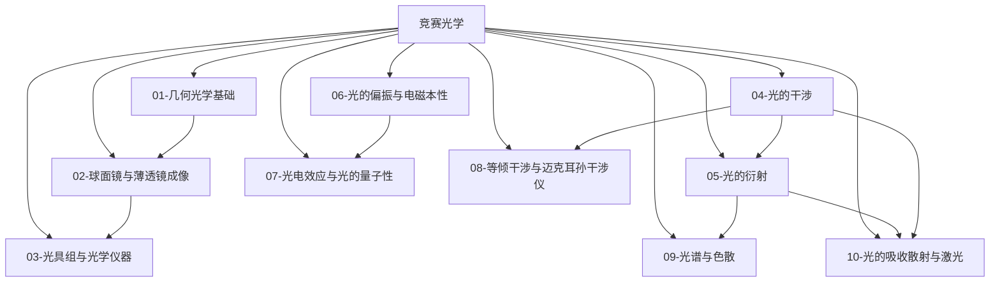

# 竞赛光学总览

> [!abstract] 概览
> 光学是物理竞赛（CPhO）中**按两条路线并行**的版块：**几何光学**（光线模型：反射、折射、全反射、透镜成像、光学仪器）与**波动光学**（波模型：干涉、衍射、偏振），加上作为"桥"的**光的量子性**（光电效应）。几何光学部分，竞赛在高中基础上引入成像公式的符号约定、逐次成像法（光具组）与光学仪器的定量计算；波动光学部分，高中只做定性介绍的干涉、衍射在竞赛中必须**定量计算**（条纹间距、光栅方程、缺级、牛顿环半径）；进阶部分进一步覆盖等倾干涉与迈克耳孙干涉仪、光谱与色散、光的吸收散射与激光。本模块共 11 篇笔记（含 MOC），数学前置为 [[01-微积分基础]]（光程积分、菲涅耳叠加）与 [[05-复数与欧拉公式]]（波的复数叠加表示），物理前置为竞赛力学 [[08-机械振动]]（波动概念）与竞赛电学 [[09-交流电与变压器]]（电磁波），并与 [[00-光学总览|高中光学总览]] 衔接、为 [[光学]]、[[物理光学]]、[[X射线衍射]] 等大学内容铺垫。本文件（MOC）作为光学版块总入口。

## 光学知识脉络图

## 一、几何光学（光线模型）

| 笔记 | 简介 | 核心内容 |
| --- | --- | --- |
| [[01-几何光学基础]] | 光的直线传播与折射全反射 | 光速与光疏光密介质、反射定律与平面镜成像、折射定律（斯涅耳定律）、全反射与临界角、光导纤维、棱镜与最小偏向角、色散、费马原理简介 |
| [[02-球面镜与薄透镜成像]] | 成像公式与作图法的系统化 | 球面镜成像（$f=R/2$）、薄透镜的高斯公式 $\dfrac1u+\dfrac1v=\dfrac1f$、符号约定、三条特殊光线作图、放大率、虚物、单球面折射、牛顿公式 $xx'=f^2$、像速、共轭法 |
| [[03-光具组与光学仪器]] | 多透镜系统的逐次成像法 | 透镜组合（逐次成像、虚物处理）、密接透镜等效焦距、放大镜、显微镜（$M=M_1M_2$）、望远镜（$M=f_1/f_2$）的定量计算 |

## 二、波动光学（波模型）

| 笔记 | 简介 | 核心内容 |
| --- | --- | --- |
| [[04-光的干涉]] | 相干叠加的定量规律 | 相干条件、杨氏双缝（明暗条纹位置与间距 $\Delta x=\dfrac{\lambda D}{d}$）、光程差与相位差、薄膜干涉（劈尖与牛顿环）、半波损失、增透膜与增反膜 |
| [[05-光的衍射]] | 波绕过障碍物的定量分析 | 惠更斯-菲涅耳原理简介、单缝衍射（半波带法、暗纹条件 $a\sin\theta=m\lambda$）、圆孔衍射与瑞利判据、光栅方程 $d\sin\theta=m\lambda$ 与缺级 |
| [[06-光的偏振与电磁本性]] | 光的横波性与电磁本质 | 光的电磁理论（麦克斯韦预言、赫兹验证）、电磁波谱、自然光与偏振光、马吕斯定律 $I=I_0\cos^2\theta$、布儒斯特角、偏振的应用 |
| [[08-等倾干涉与迈克耳孙干涉仪]] | 干涉的进阶：等倾条纹与精密测量 | 等倾干涉（$\Delta=2nd\cos i'$ 与干涉环）、迈克耳孙干涉仪原理、条纹移动测位移/波长/折射率（$2\Delta d=\Delta N\lambda$、$2(n-1)t=\Delta N\lambda$）、白光条纹 |
| [[09-光谱与色散]] | 色散规律与光谱分析 | 正常色散与柯西公式、连续/线状/吸收光谱、棱镜与光栅光谱对比、光谱重叠、光栅分辨本领 $R=mN$、巴耳末公式与原子光谱 |
| [[10-光的吸收散射与激光]] | 光与物质的相互作用 | 选择性吸收与颜色、瑞利散射（$I\propto\lambda^{-4}$，蓝天夕阳）、米氏散射、自发/受激辐射与粒子数反转、激光四特性、全息照相简介 |

## 三、光的量子性（桥接近代物理）

| 笔记 | 简介 | 核心内容 |
| --- | --- | --- |
| [[07-光电效应与光的量子性]] | 光既是波又是粒子 | 光电效应的实验规律（截止频率、遏止电压、瞬时性）、光子说与爱因斯坦方程 $h\nu=W+E_{k\max}$、光子动量 $p=h/\lambda$、康普顿效应简介、波粒二象性 |

## 学习路径

> [!tip] 推荐路径
> **两条主线并行**：几何光学（01 → 02 → 03）与波动光学（04 → 05 → 06 → 07），学完基础后进入进阶（08 → 09 → 10）。
>
> - **初赛重点**：01（全反射、临界角）、02（透镜公式）、04（双缝干涉、薄膜）是初赛光学主力；
> - **复赛分水岭**：03 光具组的逐次成像、04 牛顿环与劈尖的定量计算、05 光栅缺级与瑞利判据、07 光电效应的计算是复赛高频；
> - **决赛拓展**：08 迈克耳孙干涉仪（测折射率、测位移）、09 光栅分辨本领、10 激光与瑞利散射是决赛与创新实验的常见考点；
> - **方法串联**：04/05/08 的干涉衍射依赖 [[05-复数与欧拉公式]]（相位与叠加）；07 的光子能量与热学 [[08-热传递与热平衡]] 中的黑体辐射同源于量子化思想（进一步见大学 [[黑体辐射]]）；
> - **对照学习**：与 [[00-光学总览|高中光学总览]] 逐节对照——高中的"成像规律表"在竞赛中统一为符号约定下的高斯公式，高中的"干涉衍射定性"在竞赛中升级为条纹位置的定量计算。

## 与其他知识关联

### 与预备知识衔接
- [[01-微积分基础]]：费马原理的光程积分、菲涅耳叠加积分
- [[05-复数与欧拉公式]]：波的复数表示 $E=E_0e^{i(\omega t-kx)}$、干涉的相位叠加
- [[02-微分方程初步]]：电磁波方程（进阶）
- [[06-量纲分析]]：光学量的快速校验

### 与竞赛力学衔接
- [[08-机械振动]]：简谐振动是光波相位描述的力学原型
- [[09-交流电与变压器]]：LC 振荡与电磁波的产生、电磁波谱的衔接
- [[08-电磁感应与自感]]：变化的电磁场激发波动——光的电磁本性的电学根源

### 与高中物理衔接
- [[00-光学总览|高中光学总览]] 的 01-04 子模块是竞赛光学的全部高中基础

### 与大学层面衔接
- [[光学]]：几何光学与光学仪器的完整理论
- [[物理光学]]：干涉、衍射、偏振的严格波动分析
- [[X射线衍射]]：光栅衍射的推广（晶体衍射、布拉格条件）
- [[黑体辐射]]：热辐射与量子化的起源（衔接 07 的量子思想）

## 常用公式速查

### 几何光学
$$
n=\frac{c}{v},\qquad n_1\sin\theta_1=n_2\sin\theta_2,\qquad \sin C=\frac{1}{n}
$$

$$
\frac1u+\frac1v=\frac1f,\qquad m=\frac{v}{u},\qquad \delta_{\min}=2\arcsin\left(n\sin\frac{A}{2}\right)-A
$$

### 波动光学
$$
\Delta x=\frac{\lambda D}{d},\qquad a\sin\theta=m\lambda,\qquad d\sin\theta=m\lambda,\qquad I=I_0\cos^2\theta
$$

$$
\tan i_B=\frac{n_2}{n_1},\qquad r_m=\sqrt{mR\lambda}\ (\text{牛顿环明环})
$$

$$
2\Delta d=\Delta N\lambda\ (\text{迈克耳孙}),\qquad 2(n-1)t=\Delta N\lambda,\qquad R=\frac{\lambda}{\Delta\lambda}=mN\ (\text{光栅})
$$

$$
I_{\text{散}}\propto\frac{1}{\lambda^4}\ (\text{瑞利})
$$

### 光的量子性
$$
E=h\nu=\frac{hc}{\lambda},\qquad p=\frac{h}{\lambda},\qquad h\nu=W+E_{k\max},\qquad U_c=\frac{h\nu-W}{e}
$$

---

> [!quote] 作者寄语
> 光学是竞赛中"图像感"最强的版块：几何光学靠画图，波动光学靠画相位。建议把两条主线分开记忆——**几何光学是代数问题**（符号约定 + 公式），**波动光学是相位问题**（光程差决定一切）。
>
> 学习波动光学时始终抓住一句话：==干涉、衍射、偏振都是"光程差/相位差"的不同表现==。双缝的 $\Delta x=\lambda D/d$、单缝的 $a\sin\theta=m\lambda$、光栅的 $d\sin\theta=m\lambda$，三个公式长得极像但物理截然不同（双缝是两个缝、单缝是缝内无数点、光栅是 $N$ 个缝的干涉+单缝衍射调制）——记住"$\Delta x=\lambda D/d$ 是干涉，$\sin\theta=m\lambda/d$ 是光栅，$a\sin\theta=m\lambda$ 是衍射"就不会混。
>
> 最后，07 的光电效应是经典物理与量子物理的分界线：$\nu$ 是波的频率、$\varepsilon$ 却是粒子的能量——这一"波粒二象性"是近代物理的起点。学完本模块后，[[00-物理竞赛总览]] 的近代物理部分（原子物理、相对论）将有更好的入口。
>
> 返回 [[00-物理竞赛总览]]。

---

*返回 [[00-物理竞赛总览]]*
