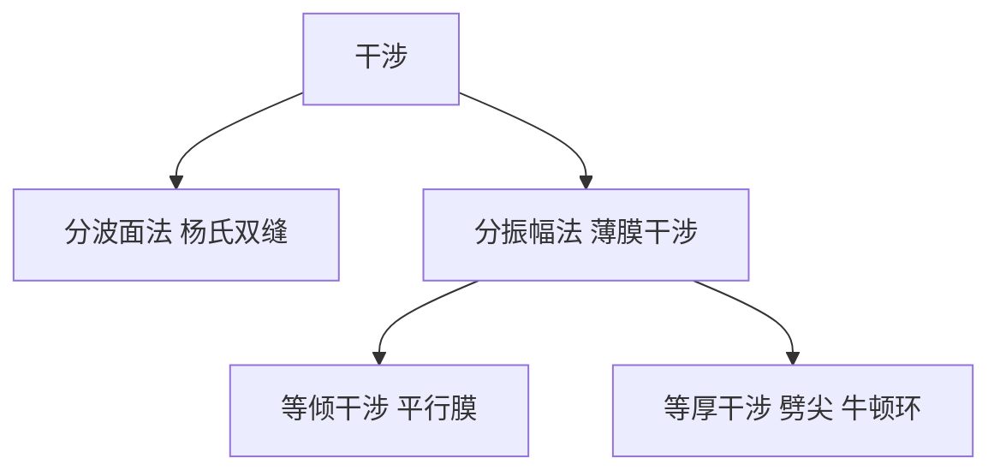

# 光的干涉（竞赛）

> [!abstract] 概览
> 干涉是波动光学的基础，也是 CPhO 复赛高频考点。本笔记从==相干条件==出发，建立==光程与光程差==的严格语言：叠加的强度由光程差 $\Delta$ 与相位差 $\delta=\dfrac{2\pi}{\lambda}\Delta$ 决定，==明纹 $\Delta=m\lambda$、暗纹 $\Delta=(m+\tfrac12)\lambda$==。在两条获取相干光的路径——==分波面法==（[[05-光的衍射|杨氏双缝，见衍射篇的推广]]）与==分振幅法==（薄膜）——下，完整推导杨氏双缝的条纹间距 $\Delta x=\dfrac{\lambda D}{d}$、劈尖等厚干涉与牛顿环的半径公式，并严格处理==半波损失==（光疏→光密反射相位突变 $\pi$）。半波损失的正确判断是薄膜类问题不出错的命门，本笔记将反复强调。数学上依赖 [[05-复数与欧拉公式]]（复振幅叠加）与 [[01-微积分基础]]（光程的积分化），力学上与 [[08-机械振动]] 的波叠加同源，高中基础见 [[00-光学总览|高中光学总览]]，大学严格理论见 [[物理光学]]。

## 核心概念

### 一、光的波动性回顾与相干条件

光作为电磁波，在空间某点的振动可用复数表示（[[05-复数与欧拉公式]]）：
$$
\tilde{E}=E_0e^{i(\omega t-kx+\varphi_0)}
$$
两列光波在空间某点相遇发生==叠加==。由于光强 $I\propto|\tilde E|^2$，设两列光复振幅分别为 $\tilde E_1=A_1e^{i\varphi_1}$、$\tilde E_2=A_2e^{i\varphi_2}$（已去掉公共时间因子），则合光强为
$$
\boxed{\,I=A_1^2+A_2^2+2A_1A_2\cos\Delta\varphi\,},\qquad \Delta\varphi=\varphi_1-\varphi_2
$$
其中交叉项 $2A_1A_2\cos\Delta\varphi$ 称为==干涉项==，它使强度随相位差 $\Delta\varphi$ 在极大与极小之间周期变化——这就是干涉现象的本质。

**相干条件**：要得到稳定、可观察的干涉图样，两列光必须满足
$$
\boxed{\,\text{频率相同},\quad \text{振动方向相同},\quad \text{相位差恒定}\,}
$$

> [!note] 普通光源为什么不相干？
> 普通光源（太阳、白炽灯、钠光灯）发光来自原子（分子）的==自发辐射==：每个原子独立地、随机地发光，每次发光的初相位毫无关联，且每次只持续极短的相干时间（约 $10^{-8}\,\text{s}$，对应一段有限长的波列）。两束来自同一光源不同部分的光，相位差随机跳变，$\cos\Delta\varphi$ 的时间平均为零，干涉项消失，只观察到强度的简单相加——==不相干==。因此用普通光源做干涉实验，必须把同一波列"一分为二"再合并，这就是获取相干光的两类方法。

**两类获取相干光的方法**：

| 方法 | 原理 | 典型装置 |
| --- | --- | --- |
| ==分波面法== | 把同一波列的==波面==在空间上分成两部分（波前上取两点/两缝） | 杨氏双缝、洛埃镜、菲涅耳双镜 |
| ==分振幅法== | 一束光在薄膜两表面反射/透射，振幅被分成两束 | 薄膜干涉、劈尖、牛顿环、增透膜 |

### 二、光程与光程差

光在介质中的速度 $v=\dfrac{c}{n}$，波长为 $\lambda_n=\dfrac{\lambda}{n}$（$\lambda$ 为真空中波长）。光在折射率 $n$ 的介质中走过几何路程 $l$ 时的相位积累为
$$
\frac{2\pi}{\lambda_n}l=\frac{2\pi}{\lambda}\cdot nl
$$
即相位积累只取决于乘积 $nl$，故定义

**光程**：$\;L=nl$——光在介质中走 $l$ 积累的相位，等于光在==真空中==走 $nl$ 积累的相位。引入光程后，相位比较可以统一到真空。

**光程差与相位差**：两束光在相遇点的光程之差记为 $\Delta$，则
$$
\boxed{\,\delta=\frac{2\pi}{\lambda}\Delta\,}\qquad(\lambda \text{ 取真空中波长})
$$

**干涉的明暗条件**（用光程差表述）：
$$
\boxed{\,\text{明纹（加强）：}\ \Delta=m\lambda\quad (m=0,\pm1,\pm2,\cdots)\,}
$$
$$
\boxed{\,\text{暗纹（减弱）：}\ \Delta=\left(m+\tfrac12\right)\lambda\quad (m=0,\pm1,\pm2,\cdots)\,}
$$
$m$ 称为==干涉级次==。注意：由于 $\Delta\varphi=2\pi m$ 时加强，条件中明纹是 $m\lambda$ 的整数倍、暗纹是半整数倍，==符号与级次起点（$m=0$）不能记错==。

> [!tip] 光程差的分段计算法
> 计算 $\Delta$ 时，把光路按"折射率分段"，每段贡献 $n_i l_i$，相加后再相减。最常犯的错误是把几何路程直接当作光程。

### 三、半波损失

**半波损失**：光从==光疏介质==（$n$ 小）射向==光密介质==（$n$ 大）的界面发生反射时，反射光的相位突变 $\pi$，相当于附加了 $\dfrac{\lambda}{2}$ 的光程差：
$$
\boxed{\,\text{疏→密反射：相位突变 }\pi,\ \text{相当于附加 }\frac{\lambda}{2}\ \text{光程差}\,}
$$
要点：
- 从光密介质射向光疏介质（密→疏）的反射，==无==半波损失；
- ==折射（透射）永远无半波损失==；
- 判断依据只有一条：==比较界面两侧的折射率==，与入射角无关。

> [!note] 判断口诀与实验证据
> "==疏到密，反射反相；密到疏，反射同相；透射恒同相。==" 半波损失不是数学约定，而是有实验证据的物理事实：洛埃镜实验中，直接来自镜面的光与经平面镜反射的光在屏上叠加，接触处（几何光程差为零处）出现的不是明纹而是==暗纹==，只能由反射光相位突变 $\pi$ 解释。半波损失是薄膜干涉明暗条件能否写对的关键，复赛中判断错误将导致全部明暗纹互换。

## 推导与原理

### 一、杨氏双缝干涉（分波面法）

**装置**：单缝 $S$ 用单色光照明，出射光再照射到相距 $d$ 的双缝 $S_1$、$S_2$ 上，缝后 $D$（$D\gg d$）处放置观察屏。$S_1$、$S_2$ 同相（来自同一波列），满足相干条件。

**光程差**：屏上距中央（$S_1S_2$ 中垂线与屏交点）为 $x$ 的 $P$ 点，两缝到 $P$ 的光程差近似为
$$
\Delta = r_2-r_1 \approx d\sin\theta \approx d\frac{x}{D}
$$
（远场条件 $D\gg d$ 下两缝到 $P$ 的连线近似平行；近轴条件 $x\ll D$ 下 $\sin\theta\approx\dfrac{x}{D}$。）

**明暗纹位置**：代入明暗条件即得
$$
\text{明纹：}\ x_m=m\frac{\lambda D}{d}\quad(m=0,\pm1,\pm2,\cdots),\qquad
\text{暗纹：}\ x_m=\left(m+\tfrac12\right)\frac{\lambda D}{d}
$$

**条纹间距**——双缝干涉最重要的特征：
$$
\boxed{\,\Delta x=\frac{\lambda D}{d}\,}
$$
与级次 $m$ 无关，因此条纹==等间距==；级次越高光强越小（受单缝衍射调制），相邻亮纹与相邻暗纹间距相同，均为 $\Delta x$。

**强度分布**：等振幅两缝时，由复振幅叠加
$$
I=4I_0\cos^2\frac{\delta}{2}=4I_0\cos^2\frac{\pi\Delta}{\lambda}
$$
亮纹处强度是单缝的 $4$ 倍（振幅加倍），暗纹处严格为零。

**白光照射**：各波长零级明纹位置相同（中央为白色明纹）；非零级处，$\Delta x\propto\lambda$，红光的条纹间距大、紫光小，故中央两侧为==紫内红外==的彩色条纹，级次越高彩色越淡（各色错开越多）。

**插入介质片**：在 $S_1$ 前插入厚度 $t$、折射率 $n$ 的玻璃片，则 $S_1$ 支路光程增加
$$
(n-1)t
$$
（玻璃片内光程 $nt$ 代替了原来的空气中光程 $t$，注意是 $n-1$ 而非 $n$！）。零级条纹（$\Delta=0$ 处）为补偿这多出的光程向 $S_1$ 一侧移动，移动的条纹数为
$$
\boxed{\,\Delta N=\frac{(n-1)t}{\lambda}\,}
$$
若 $(n-1)t$ 恰为 $\lambda$ 的整数倍，条纹整体回到原位（零级居中），干涉图样看似"没有变化"——这是常设的陷阱。

### 二、薄膜干涉的一般框架与等倾干涉

一束光入射到折射率为 $n$、厚度为 $d$ 的薄膜上，在==上表面反射一束、透射后经下表面反射再从上表面射出==，形成两束相干光（分振幅法）。对平行膜，两束反射光的光程差（精确公式，$\theta'$ 为膜内折射角）
$$
\Delta=2nd\cos\theta'+\Delta_{\text{半波}}
$$
其中 $\Delta_{\text{半波}}$ 为 $0$ 或 $\dfrac{\lambda}{2}$，由两界面处半波损失的发生情况决定；垂直入射时 $\cos\theta'\approx 1$，$\Delta=2nd+\Delta_{\text{半波}}$。

**等倾干涉**（平行薄膜，定性）：同一倾角 $\theta'$ 的光线光程差相同，故在透镜焦平面上形成以光轴为中心的==同心亮暗圆环==；环的干涉级次由中心向边缘减小。等倾干涉在竞赛中只需定性理解——"==倾角决定光程差=="，定量重点在等厚干涉。

### 三、劈尖（楔形薄膜）等厚干涉

两块玻璃板一端接触、另一端垫以薄片，其间形成楔角 $\alpha$ 的空气劈尖（也可推广为折射率 $n$ 的介质楔）。光垂直入射，上下两表面反射光的光程差为
$$
\Delta=2nt+\frac{\lambda}{2}
$$
（对空气劈尖：上表面玻璃→空气是密→疏反射，无半波损失；下表面空气→玻璃是疏→密反射，有半波损失——两反射恰好一有一无，故附加 $\dfrac{\lambda}{2}$。）

**明暗条件**：
$$
\text{明纹：}\ 2nt+\frac{\lambda}{2}=m\lambda\ \Rightarrow\ t_m=\left(m-\tfrac12\right)\frac{\lambda}{2n}
$$
$$
\text{暗纹：}\ 2nt+\frac{\lambda}{2}=\left(m+\tfrac12\right)\lambda\ \Rightarrow\ t_m=m\frac{\lambda}{2n}
$$

**相邻条纹对应的厚度差**：
$$
\boxed{\,\Delta t=\frac{\lambda}{2n}\,}
$$

**条纹间距与楔角**：膜厚差 $\Delta t$ 对应水平距离 $l$，几何关系 $\Delta t=l\sin\alpha$，故
$$
\boxed{\,l=\frac{\lambda}{2n\sin\alpha}\approx\frac{\lambda}{2n\alpha}\,}
$$
楔角 $\alpha$ 越大条纹越密；$\alpha=0$（等厚膜）条纹消失（整面同亮或同暗）。

**棱边处（$t=0$）**：$\Delta=\dfrac{\lambda}{2}$，故空气劈尖棱边为==暗纹==。条纹是一组与棱边平行的明暗相间的直条纹。

> [!warning] 半波损失项可能出现或消失
> 上述 $\dfrac{\lambda}{2}$ 附加项只适用于"两界面恰有一处发生半波损失"的情形。若劈尖材料使两界面反射均无（或均有）半波损失——如玻璃板间夹折射率介于两者之间的油膜、或两面都是疏介质的肥皂膜——则 $\Delta=2nt$，棱边变为亮纹，明暗公式整体互换。==动手前先判断两次反射的半波损失情况，再写光程差==。

### 四、牛顿环

平凸透镜（曲率半径 $R$）凸面朝下放在平板玻璃上，其间形成厚度 $t$ 的薄空气膜（等厚干涉，$t$ 随 $r$ 变化）。

**几何关系**：在凸面近似为球面时，由垂径定理
$$
r^2=2Rt-t^2\approx 2Rt\ \Rightarrow\ \boxed{\,t\approx\frac{r^2}{2R}\,}
$$
（$t\ll R$ 时略去 $t^2$。）

**明暗条件**：与空气劈尖相同，$\Delta=2t+\dfrac{\lambda}{2}$（透镜底面玻璃→空气密→疏无半波损失，空气→平板玻璃疏→密有半波损失）。代入 $t=\dfrac{r^2}{2R}$：
$$
\boxed{\,\text{明环：}\ r_m=\sqrt{\left(m-\tfrac12\right)R\lambda}\quad(m=1,2,3,\cdots)\,}
$$
$$
\boxed{\,\text{暗环：}\ r_m=\sqrt{mR\lambda}\quad(m=1,2,3,\cdots)\,}
$$

**中央（$r=0$，$t=0$）**：$\Delta=\dfrac{\lambda}{2}$，中央为==暗斑==（半波损失的直接体现）。注意明环级次从 $1$ 开始、公式中带 $-\tfrac12$，暗环级次从 $1$ 开始、公式中不带 $-\tfrac12$——两者恰好"错开半级"。

> [!tip] 反射与透射牛顿环亮暗互换
> 若观察透射光形成的牛顿环：两束透射光均无半波损失，$\Delta=2t$，中央变为亮斑，且透射环与反射环处处亮暗互补（能量守恒）。掌握这一对称性可以快速检验公式是否写对。

**应用**：已知 $\lambda$ 测 $R$（见"典型实例"）；检验透镜表面平整度——表面不规则处等厚线弯曲，条纹随之畸变。

### 五、增透膜与增反膜

在玻璃表面镀一层折射率 $n$（满足 $1<n<n_{\text{玻璃}}$）的透明薄膜（如 $MgF_2$，$n\approx1.38$）。两束反射光在界面 1（空气→膜，疏→密，有半波损失）与界面 2（膜→玻璃，疏→密，有半波损失）的反射==均有==半波损失，故两束反射光之间不再有附加 $\dfrac{\lambda}{2}$：
$$
\Delta=2nd
$$

**增透膜（反射相消）**：
$$
2nd=\left(m+\tfrac12\right)\lambda\ \Rightarrow\ \text{最小光学厚度}\ \boxed{\,nd=\frac{\lambda}{4}\,}
$$
反射相消、能量守恒地透射增强。对可见光中心 $\lambda=550\,\text{nm}$，$MgF_2$ 膜厚 $d\approx\dfrac{550}{4\times1.38}\approx100\,\text{nm}$。

**增反膜（反射加强）**：
$$
2nd=m\lambda\ \Rightarrow\ \text{最小光学厚度}\ nd=\frac{\lambda}{4}
$$
同样的 $\dfrac{\lambda}{4}$ 光学厚度，只要改变薄膜折射率使半波损失"一有一无"或"两有"，即可由相消变加强——==光学厚度相同，目的取决于半波损失布局==。

### 六、相干长度与时间相干性（定性）

光源每次发光的波列长度有限，只有光程差不超过波列长度时两分波列才能相遇干涉，定义==相干长度==
$$
\boxed{\,\Delta l=\frac{\lambda^2}{\Delta\lambda}\,}
$$
（$\Delta\lambda$ 为光源的谱线宽度，给出结论即可。）单色性越好（$\Delta\lambda$ 越小），相干长度越长：激光可达数百米，钠灯仅约数厘米，白光不足几个微米。因此白光干涉只能观察到中央附近的几条彩色条纹，而激光可以远距离干涉——这是"时间相干性"（波列有限长）而非"空间相干性"的限制。

## 典型实例与物理应用

### 实例 1：细丝直径的测量（劈尖法）

细丝夹在两玻璃板一端构成空气劈尖。垂直入射单色光，测得条纹间距 $l$，则楔角 $\alpha\approx\dfrac{d}{L}$（$L$ 为板长），由 $l=\dfrac{\lambda}{2n\alpha}$ 得
$$
\boxed{\,d=\frac{\lambda L}{2nl}\,}
$$
也可数从棱边到细丝处的条纹间隔数 $N$：$d=N\dfrac{\lambda}{2n}$。此法可测出几微米到几十微米的微小厚度，精度达波长量级，是"以波长为尺"的经典应用。

### 实例 2：表面平整度检验（条纹弯曲判凹凸）

用标准平玻璃与待检工件构成劈尖，若工件表面局部凸起（凹陷），该处空气膜变厚（变薄），等厚线绕行，条纹发生弯曲。判断法则：
- ==条纹向棱边（薄膜较薄一侧）弯曲——该处为凸起==（凸起使等厚厚度所在的位置向薄处移动）；
- 条纹向远离棱边方向弯曲——该处为凹陷。
定量地，凸起高度 $h=\dfrac{b}{l}\cdot\dfrac{\lambda}{2n}$，其中 $b$ 为条纹弯曲的宽度、$l$ 为条纹间距。光滑工件条纹是平行直线，任何弯曲都暴露了表面的不平整——现代精密检测（如光学车间检验）正是这一原理的工程化。

### 实例 3：牛顿环测曲率半径

暗环 $r_m=\sqrt{mR\lambda}$ 中若含未知级次 $m$，取两个相距 $k$ 级的暗环相减可消去 $m$：
$$
r_{m+k}^2-r_m^2=kR\lambda\ \Rightarrow\ \boxed{\,R=\frac{r_{m+k}^2-r_m^2}{k\lambda}\,}
$$
只需相对级次差 $k$，无需知道绝对级次，测量误差也因差分而减小。

### 实例 4：三种等厚/分波面装置的对比

| 对比项 | 杨氏双缝 | 劈尖 | 牛顿环 |
| --- | --- | --- | --- |
| 方法 | 分波面法 | 分振幅法（等厚） | 分振幅法（等厚） |
| 光程差 $\Delta$ | $d\dfrac{x}{D}$ | $2nt+\dfrac{\lambda}{2}$ | $2t+\dfrac{\lambda}{2}$，$t=\dfrac{r^2}{2R}$ |
| 明纹条件 | $\Delta=m\lambda$ | $2nt+\dfrac{\lambda}{2}=m\lambda$ | $2t+\dfrac{\lambda}{2}=m\lambda$ |
| 暗纹条件 | $\Delta=\left(m+\tfrac12\right)\lambda$ | $2nt+\dfrac{\lambda}{2}=\left(m+\tfrac12\right)\lambda$ | $2t+\dfrac{\lambda}{2}=\left(m+\tfrac12\right)\lambda$ |
| 条纹形态 | 等间距直条纹 | 等间距平行直条纹 | 同心圆环（内疏外密） |
| 特征量 | $\Delta x=\dfrac{\lambda D}{d}$ | $\Delta t=\dfrac{\lambda}{2n}$，$l=\dfrac{\lambda}{2n\alpha}$ | $r_{\text{明}}=\sqrt{(m-\frac12)R\lambda}$，$r_{\text{暗}}=\sqrt{mR\lambda}$ |
| 零级/中央 | 中央明纹 | 棱边暗纹 | 中央暗斑 |
| 主要应用 | 测波长 | 测微小厚度、检验平整度 | 测曲率半径、检验表面 |

## 例题

### 例 1：双缝干涉——条纹间距与介质片的插入

**题目**：杨氏双缝实验中，缝距 $d=1.0\,\text{mm}$，缝屏距 $D=2.0\,\text{m}$，用 $\lambda=600\,\text{nm}$ 单色光垂直照射。（1）求条纹间距及第 $3$ 级明纹位置；（2）在上缝 $S_1$ 前插入厚度 $t=2.4\,\mu\text{m}$、折射率 $n=1.5$ 的玻璃片，条纹整体移动多少条？向何方移动？此时中央明纹移到了哪里？

**分析**：条纹间距直接套 $\Delta x=\dfrac{\lambda D}{d}$；介质片使 $S_1$ 支路光程增加 $(n-1)t$，零级为补偿此光程差而移动。

**解答**：
（1）
$$
\Delta x=\frac{\lambda D}{d}=\frac{600\times10^{-9}\times2.0}{1.0\times10^{-3}}=1.2\times10^{-3}\,\text{m}=1.2\,\text{mm}
$$
第 $3$ 级明纹 $x_3=3\Delta x=3.6\,\text{mm}$（中央两侧对称分布）。

（2）插入玻璃片后 $S_1$ 支路光程增加
$$
(n-1)t=0.5\times2.4\times10^{-6}\,\text{m}=1.2\,\mu\text{m}=2\lambda
$$
故条纹整体移动 $\Delta N=\dfrac{(n-1)t}{\lambda}=2$ 条，向==插入玻璃片的 $S_1$ 一侧==移动；中央明纹（零级）移动到原来第 $2$ 级明纹的位置（屏上距中央 $2.4\,\text{mm}$ 处）。

**点评**：条纹移动数公式 $\Delta N=\dfrac{(n-1)t}{\lambda}$ 必须用 $n-1$（相对空气的光程增量）而非 $n$。若 $t$ 或 $n$ 使得 $(n-1)t$ 恰为 $\lambda$ 的整数倍，条纹图样与未插时完全重合——不能因此误判"没有介质片"。

### 例 2：劈尖干涉——细丝直径与充水后的条纹变化

**题目**：两平玻璃板一端接触、另一端夹一根细丝，板长 $L=10.0\,\text{cm}$，空气劈尖。用 $\lambda=600\,\text{nm}$ 单色光垂直照射，测得相邻条纹间距 $l=2.0\,\text{mm}$。（1）求细丝直径 $d$；（2）若把装置浸入水中（$n=\tfrac43$），条纹间距变为多少？

**分析**：空气劈尖 $n=1$，棱边为暗纹；$l=\dfrac{\lambda}{2n\alpha}$，楔角 $\alpha\approx\dfrac{d}{L}$。

**解答**：
（1）
$$
\alpha=\frac{\lambda}{2l}=\frac{600\times10^{-9}}{2\times2.0\times10^{-3}}=1.5\times10^{-4},\qquad
d=\alpha L=1.5\times10^{-4}\times0.100=1.5\times10^{-5}\,\text{m}=15\,\mu\text{m}
$$
（等价地：从棱边到细丝共 $\dfrac{L}{l}=50$ 个条纹间隔，$d=50\times\dfrac{\lambda}{2}=15\,\mu\text{m}$。）

（2）充水后 $n=\dfrac43$：
$$
l'=\frac{\lambda}{2n\alpha}=\frac{l}{n}=\frac{2.0}{4/3}=1.5\,\text{mm}
$$
条纹变密（水中的波长缩短为 $\lambda/n$）。

**点评**：劈尖问题两条路——量间距 $l$ 或数条纹数 $N$，殊途同归。介质充入劈尖等价于膜内波长缩小 $\dfrac{1}{n}$ 倍，所有长度量（$\Delta t$、$l$）都相应缩小。

### 例 3：牛顿环——暗环半径与曲率半径测量

**题目**：牛顿环装置用 $\lambda=600\,\text{nm}$ 单色光照明，平凸透镜曲率半径 $R=1.00\,\text{m}$。（1）求第 $5$ 暗环半径；（2）实际测量中测得某暗环半径 $r_m=3.00\,\text{mm}$，向外数第 $5$ 个暗环半径 $r_{m+5}=5.00\,\text{mm}$，求透镜曲率半径 $R$。

**分析**：反射牛顿环中央为暗斑，暗环 $r_m=\sqrt{mR\lambda}$；测 $R$ 时用差分消去未知级次 $m$。

**解答**：
（1）
$$
r_5=\sqrt{5R\lambda}=\sqrt{5\times1.00\times600\times10^{-9}}=\sqrt{3.0\times10^{-6}}\approx1.73\times10^{-3}\,\text{m}=1.73\,\text{mm}
$$

（2）差分消去 $m$：
$$
r_{m+5}^2-r_m^2=5R\lambda\ \Rightarrow\ R=\frac{(5.00^2-3.00^2)\times10^{-6}}{5\times600\times10^{-9}}
=\frac{16\times10^{-6}}{3.0\times10^{-6}}\approx5.33\,\text{m}
$$

**点评**：牛顿环暗环公式中级次 $m$ 从 $1$ 起且不带 $-\tfrac12$，明环才带 $-\tfrac12$——写反则半径全面错位。差分法测 $R$ 是实验标准做法，正因为它绕开了"第几级"的绝对标定。

## 易错提醒

> [!warning] 易错点
> 1. **相位差公式中 $\lambda$ 必须是真空波长**：$\delta=\dfrac{2\pi}{\lambda}\Delta$ 中 $\lambda$ 为真空中波长，介质中的波长 $\lambda_n=\dfrac{\lambda}{n}$ 只用于写介质内光程。
> 2. **明暗条件级次与符号**：明纹 $\Delta=m\lambda$，$m=0,\pm1,\cdots$；暗纹 $\Delta=\left(m+\tfrac12\right)\lambda$。中央明纹级次为 $0$，暗纹没有 $m=0$ 的"中央暗纹"。
> 3. **条纹间距与级次无关**：双缝条纹严格等间距，$\Delta x=\dfrac{\lambda D}{d}$ 中不含 $m$；不要与光栅公式 $d\sin\theta=m\lambda$ 混淆（那是 [[05-光的衍射]] 的内容）。
> 4. **半波损失只在疏→密反射发生**：密→疏反射和一切折射都没有半波损失。判断只看界面两侧折射率大小，与入射角无关。
> 5. **劈尖棱边是暗纹**：空气劈尖 $t=0$ 处 $\Delta=\dfrac{\lambda}{2}$，为暗纹。若两界面半波损失"同有"或"同无"，棱边才变亮纹——先判断反射情况再写 $\Delta$。
> 6. **相邻条纹厚度差是 $\dfrac{\lambda}{2n}$ 而非 $\dfrac{\lambda}{2}$**：只有在空气膜（$n=1$）中二者才相等；充入介质后必须除以 $n$。
> 7. **牛顿环明暗环公式不同**：明环 $r_m=\sqrt{(m-\tfrac12)R\lambda}$，暗环 $r_m=\sqrt{mR\lambda}$，且 $m=1,2,\cdots$；中央为暗斑（反射光观察时）。
> 8. **介质片光程增量是 $(n-1)t$ 而非 $nt$**：$nt$ 是膜内光程，要减去被替换掉的空气光程 $t$。条纹移动数 $\Delta N=\dfrac{(n-1)t}{\lambda}$。
> 9. **条纹移动方向**：插入介质片的一支路光程增大，零级条纹向==该支路一侧==移动（补偿光程差）；切勿写反。
> 10. **增透膜是反射相消**：$nd=\dfrac{\lambda}{4}$ 使两束反射光相位差为 $\pi$，透射光增强由能量守恒保证，不是"镀膜直接增强透射"。

> [!note] 概念辨析
> **等倾干涉 vs 等厚干涉**
>
> | 比较项 | 等倾（平行薄膜） | 等厚（劈尖、牛顿环） |
> | --- | --- | --- |
> | 变量 | 入射倾角 $\theta$ | 膜厚 $t$ |
> | 光程差 | $\Delta=2nd\cos\theta'$ | $\Delta=2nt$ |
> | 条纹 | 同心圆环（透镜焦面） | 平行条纹 / 同心圆环（膜表面） |
> | 典型装置 | 平行玻璃板 | 劈尖、牛顿环 |
>
> **半波损失布局与 $\Delta$ 的关系**（薄膜反射光两束）
>
> | 两界面反射情况 | 附加项 | 例题装置 |
> | --- | --- | --- |
> | 一有一无 | $+\dfrac{\lambda}{2}$ | 空气劈尖、牛顿环 |
> | 均有 / 均无 | $0$ | 增透膜、玻璃间油膜 |
>
> 写薄膜干涉的光程差，第一步永远是：==数一数两次反射各有没有半波损失==。

## 与其他知识关联

- 与 [[01-微积分基础]] 的关系：光程是折射率沿路径的积分 $L=\int n\,ds$，费马原理的光程极值表述是微积分在光学中的直接应用。
- 与 [[05-复数与欧拉公式]] 的关系：干涉强度 $I\propto|\tilde E_1+\tilde E_2|^2$ 的复振幅叠加、相位差 $\delta=\dfrac{2\pi}{\lambda}\Delta$ 的复数表达，是分析一切叠加问题的标准工具。
- 与 [[08-机械振动]] 的关系：两列波叠加的相位差分析、相长/相消条件与振动合成 $A^2=A_1^2+A_2^2+2A_1A_2\cos\Delta\varphi$ 完全同源；[[08-机械振动]] 中的驻波本质上是两列反向行波的干涉。
- 与 [[05-光的衍射]] 的关系：双缝干涉是两列相干光叠加，单缝衍射与光栅是多点（无限多）相干叠加——衍射是"干涉的连续化推广"，光栅方程 $d\sin\theta=m\lambda$ 与双缝公式同构但物理不同。
- 与 [[06-光的偏振与电磁本性]] 的关系：干涉要求振动方向相同，偏振方向正交的光不能干涉；光强 $I\propto E^2$ 的电磁学解释见偏振篇。
- 与高中物理衔接：[[00-光学总览|高中光学总览]] 中"波的叠加"与"光的干涉"定性知识是本篇的直观基础。
- 与大学层面联系：[[物理光学]]（相干光理论的严格化：相干度、干涉场的精确计算）、[[光学]]（干涉仪、等倾干涉的仪器应用）。
- 返回 [[00-竞赛光学总览]]

## 作者的话

> [!quote] 个人理解
> 干涉的全部内容，可以压缩成一句话：==光程差决定一切==。明纹、暗纹、条纹间距、条纹移动、牛顿环半径……所有公式都是"写出 $\Delta$、代入条件"这一流水线的产物。所以真正的功夫不在记公式，而在两点：一是==分段算光程==时细致（介质内乘 $n$、减去被替换的空气段、注意真空波长），二是==半波损失判断==（疏到密反射反相，折射恒同相）。
>
> 我特别提醒两点：第一，干涉的"物理图像"比公式重要——白光条纹为什么中央白而两侧彩色、牛顿环为什么内疏外密、劈尖为什么棱边是暗纹，想通了这些，公式即使一时忘记也能当场推出来；第二，竞赛中薄膜问题最常见的死法不是不会公式，而是==没有先判断半波损失就动笔==。养成"先数半波损失、再写 $\Delta$、最后套条件"的固定流程，薄膜类问题就能稳拿全分。下一站 [[05-光的衍射]]，那里单缝、光栅的本质是"把两束光的干涉推广到无数束光"，框架完全一样。

---
*返回 [[00-竞赛光学总览]]*
