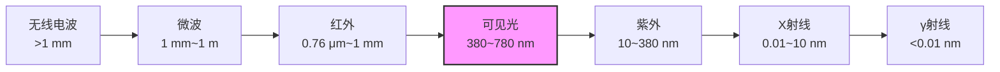

# 光的偏振与电磁本性（竞赛）

> [!abstract] 概览
> 本笔记回答波动光学最后一个问题：==光究竟是什么波==。麦克斯韦方程组（1865）预言了电磁波的存在，赫兹实验（1888）予以证实——光的本质是电磁波，而偏振现象证明光波是横波。在此基础上，本笔记系统建立三大定量工具：**马吕斯定律** $I=I_0\cos^2\theta$（偏振片透射强度的计算）、**布儒斯特角** $\tan i_B=\dfrac{n_2}{n_1}$（反射起偏的临界条件）以及**电磁波谱**的整体图景（$c=\lambda f$）。竞赛中这一章以==计算题为主、定性判断为辅==：多偏振片串接、混合光的偏振分析、布儒斯特角与折射/全反射的综合题是高频考点。本文衔接 [[04-光的干涉]]、[[05-光的衍射]] 的波动思想，为 [[07-光电效应与光的量子性]] 中"波粒二象性"埋下伏笔。

## 核心概念

### 一、光的电磁本性——光是电磁波

**历史脉络**：

- **1865 年**：麦克斯韦在总结电磁学规律的基础上提出方程组，并由此==预言==：变化的电场产生磁场、变化的磁场产生电场，二者相互激发，可以在真空中以波动形式传播——这就是电磁波。其传播速度
$$
\boxed{\,c=\dfrac{1}{\sqrt{\mu_0\varepsilon_0}}\approx 2.998\times 10^8\ \text{m/s}\,}
$$
与当时实验测得的光速惊人一致。麦克斯韦由此断言：**光是电磁波**。
- **1888 年**：赫兹用火花放电实验首次产生并检测到电磁波（波长约 1 m），实测其传播速度等于光速，并证明了电磁波具有反射、折射、干涉、衍射等与光完全相同的性质——麦克斯韦预言得到实验证实。

**电磁波的基本图像**：电磁波是横波，电场 $\vec E$ 与磁场 $\vec B$ 互相垂直、且都垂直于传播方向；$\vec E$、$\vec B$、传播方向三者满足右手螺旋关系，且 $\vec E$ 与 $\vec B$ 同相位（同时达峰值）。在光与物质相互作用中（吸收、发射、感光、作用于电子），**起主要作用的是电场 $\vec E$**，因此光学中提到的"光矢量"通常指电矢量 $\vec E$，偏振状态也以 $\vec E$ 的振动方向为准。

> [!note] 与竞赛电学的衔接
> "变化的磁场产生电场"正是 [[08-电磁感应与自感]] 中的==涡旋电场==（感生电场）：它由 $\nabla\times\vec E=-\dfrac{\partial\vec B}{\partial t}$ 描述，电场线闭合、不是由电荷产生。光波传播时 $\vec E$、$\vec B$ 在空间中互相激发、交替产生，一步一个脚印地把扰动传向远方——电磁波不需要介质，这与机械波形成鲜明对比。电磁波的产生机制（LC 振荡电路辐射）详见 [[09-交流电与变压器]]。

**为什么偏振证明光是横波**：机械波中，==纵波==（如声波）的振动方向与传播方向平行，无论振动从哪个方向传来，观察者只能看到"推拉"，不存在"方向"之分，因此==纵波没有偏振现象==；==横波==（如绳波）的振动方向垂直于传播方向，可以有多种不同取向，因此只有横波才可能偏振。实验中光通过偏振片后强度发生规律性变化——这一现象只有把光视为横波才能解释，故**光的偏振性是光为横波的决定性证据**。

### 二、电磁波谱

电磁波覆盖从 $\gamma$ 射线到无线电波的极宽频段，真空中所有频率满足
$$
\boxed{\,c=\lambda f\,}
$$
波长越长、频率越低；频率越高，光子能量 $E=h\nu$ 越大（衔接 [[07-光电效应与光的量子性]]）。

| 波段 | 波长范围（约） | 主要产生机制 | 典型应用 |
| --- | --- | --- | --- |
| 无线电波 | $>1$ mm | LC 振荡电路、天线辐射 | 广播、通信、雷达 |
| 微波 | 1 mm ~ 1 m | 微波器件、分子转动能级 | 微波炉、卫星通信 |
| 红外线 | 0.76 $\mu$m ~ 1 mm | 热辐射、分子振动 | 遥控、热成像（衔接 [[08-热传递与热平衡]] 的辐射传热） |
| 可见光 | 380 ~ 780 nm | 原子外层电子跃迁 | 人眼视觉 |
| 紫外线 | 10 ~ 380 nm | 原子外层电子跃迁 | 杀菌、验钞 |
| X 射线 | 0.01 ~ 10 nm | 原子内层电子跃迁、高速电子减速 | 医学影像、晶体结构分析 |
| $\gamma$ 射线 | $<0.01$ nm | 原子核反应、衰变 | 医疗放疗、天体物理 |

> [!tip] 波长顺序记忆
> 按波长从大到小：==无线电、微波、红外、可见、紫外、X、γ==（"无微红可紫外腺"谐音）。竞赛中常见"把电磁波按频率排序"的选择题，关键记住频率与波长反比：$f=\dfrac{c}{\lambda}$。注意可见光只占电磁波谱极窄的一小段（380~780 nm），且==不同波段的划分是渐变的、没有硬边界==。

### 三、自然光、偏振光与偏振片

**自然光**：普通光源（太阳、白炽灯、蜡烛）发光时，大量原子各自独立地做瞬态发光，每个原子发出的光矢量（电矢量 $\vec E$，光波中起主要作用的是电场）方向随机、相位彼此无关。宏观上看，光矢量==在所有垂直于传播方向的平面内振动、且各方向机会均等、无固定相位关系==。自然光可以等效地看作两个互相垂直、等振幅、不相干的分量：
$$
I = I_x + I_y, \qquad I_x = I_y = \frac{I}{2}
$$
**线偏振光（平面偏振光）**：光矢量只沿==一个固定方向==振动。振动方向与传播方向构成的平面称为振动面。

**部分偏振光**：某一方向振动的成分比其它方向占优（如水面反射光、天空散射光）。

**圆偏振光（定性）**：光矢量绕传播方向匀速旋转，端点的轨迹是圆，可看作两个互相垂直、振幅相等、相位差 $\pm\dfrac{\pi}{2}$ 的线偏振光的合成。竞赛中只要求定性了解。

**偏振片（起偏器/检偏器）**：只允许==振动方向平行于透振方向==的分量通过，与之垂直的分量被强烈吸收。偏振片"吃掉了"一个分量，所以自然光通过理想偏振片后强度减半。

| 光种类 | 光矢量振动方向 | 振动相位关系 | 通过旋转的检偏器观察 |
| --- | --- | --- | --- |
| 自然光 | 各方向均有、各向均匀 | 无固定相位关系 | 强度不变（恒为 $I/2$） |
| 线偏振光 | 单一固定方向 | 同相位 | 强度按 $\cos^2\theta$ 变化，最强 $I_0$、完全消光 |
| 部分偏振光 | 各方向均有、某一方向占优 | 无固定相位关系 | 强度变化但不会消光 |
| 圆偏振光 | 端点轨迹为圆 | 垂直分量相位差 $\pi/2$ | 强度不变（恒为 $I_0$） |

> [!warning] 易错点
> **圆偏振光通过旋转检偏器强度不变**——它和自然光在这一实验下无法区分！只有借助 $\lambda/4$ 波片或干涉方法才能鉴别（见 [[物理光学]]）。

## 推导与原理

### 一、马吕斯定律的推导

设线偏振光的光矢量振幅为 $A_0$，偏振片透振方向与振动方向夹角为 $\theta$。把振幅沿透振方向与垂直方向正交分解，只有透振方向的分量能通过：
$$
A = A_0\cos\theta
$$
光强正比于振幅平方（$I\propto A^2$），故透射强度
$$
\boxed{\,I = I_0\cos^2\theta\,}\qquad \text{（马吕斯定律）}
$$

> [!note] 为什么 $I\propto A^2$
> 电磁波的能量密度 $w=\dfrac12\varepsilon_0 E^2+\dfrac12\mu_0 B^2$，其中 $E$、$B$ 均为瞬时值、与振幅 $A$ 成正比。强度是能量密度的平均值（或单位时间流过单位面积的能量），故 $I\propto A^2$。这与机械波"能量正比振幅平方"（绳波能量 $\propto A^2$，衔接 [[08-机械振动]] 与 [[机械波]]）完全一致——波动论里"强度=振幅平方"是一条贯穿所有波的总规律。

由此得到几个==必须背熟的推论==：

1. **自然光通过偏振片**：自然光是两个等振幅、不相干正交分量的叠加，任意取向的偏振片都只保留其中一个分量，故
$$
I = \frac{I_0}{2}
$$
2. **正交偏振片（两偏振片透振方向垂直）**：$\theta=90°$，$I=I_0\cos^2 90°=0$，==完全消光==。
3. **平行偏振片**：$\theta=0°$，$I=I_0$，强度不减（理想情形）。
4. **三偏振片串接**：设第一、第三偏振片正交，中间偏振片与第一片夹角 $\theta$，则三次应用马吕斯定律：
$$
I = \frac{I_0}{2}\cos^2\theta\cdot\cos^2(90°-\theta)=\frac{I_0}{2}\cos^2\theta\sin^2\theta = \frac{I_0}{8}\sin^2 2\theta
$$
当 $\theta=45°$ 时取最大 $I=\dfrac{I_0}{8}$——这就是著名的"==不会消失的光=="：两片正交的偏振片之间插入 $45°$ 的第三片，光反而透了出来！中间偏振片的作用是==把光矢量的振动方向"拧转"一个角度==，打破了正交消光的局面。

> [!tip] 为什么"中间插一片光反而亮了"
> 第一片（起偏器）把自然光变成振动方向固定的线偏振光；中间片把透射光的振动方向"旋转"到自己透振方向的同时损失部分强度；第三片（检偏器）再投影一次。三片的作用是"方向逐步改变"，总效果是转偏而非消光。这在直觉上违反"两片挡住、三片透光"的常识——竞赛常借此出辨析题。

### 二、反射与折射时光的偏振——布儒斯特定律

**现象**：自然光斜射到介质界面时，反射光与折射光都变成==部分偏振光==。反射光中垂直于入射面（即平行于界面）振动的成分占优，折射光中平行于入射面的成分占优。

**布儒斯特定律**：当入射角 $i_B$ 满足
$$
\boxed{\,\tan i_B = \frac{n_2}{n_1}\,}
$$
时，==反射光为完全偏振光==，其振动方向垂直于入射面；此时反射光线与折射光线互相垂直：
$$
i_B + r = 90°
$$
$i_B$ 称为布儒斯特角（起偏角）。该式的等价表述：$i_B + r = 90°$ 时反射光完全偏振。

> [!note] 推导要点
> 由折射定律 $n_1\sin i_B = n_2\sin r$，代入 $\tan i_B = \dfrac{\sin i_B}{\cos i_B} = \dfrac{n_2}{n_1}=\dfrac{\sin i_B}{\sin r}$，得 $\cos i_B = \sin r=\cos(90°-r)$，故 $i_B+r=90°$。物理根源（费涅耳公式）是：反射光中平行于入射面振动的分量在 $i_B+r=90°$ 时恰为零——因为此时反射方向与折射方向垂直，平行于入射面的电矢量在折射介质中激发的振动方向恰与反射方向平行，无法产生反射波（进阶见 [[电动力学]]）。

**常用数值**：光从空气射向玻璃（$n\approx1.5$）：
$$
i_B = \arctan 1.5 \approx 56.6°
$$
从空气射向水（$n\approx1.33$）：$i_B=\arctan 1.33\approx 53°$。

> [!tip] 几个值得记住的推论
> 1. 光从光疏介质射向光密介质时 $\tan i_B=\dfrac{n_2}{n_1}>1$，故 $i_B>45°$（空气→玻璃 $56.6°$）；
> 2. 由 $\tan i_B$ 与 $\sin C=\dfrac1n$（全反射临界角，见 [[01-几何光学基础]]）可证：在 $n<2$ 时恒有 $i_B<C$，即==布儒斯特角处不会同时发生全反射==；
> 3. 入射角恰好为 $i_B$ 时，反射光强其实很弱（约只占入射光百分之几），但它==严格线偏振==——"弱而纯"是布儒斯特反射的特征。

> [!warning] 易错点
> 布儒斯特角处**反射光完全偏振**（是线偏振光），但**折射光只是部分偏振**——折射光中平行于入射面的分量多而垂直于入射面的分量少，并不会完全偏振。切勿说成"折射光也是完全偏振光"。

### 三、偏振的应用与晶体双折射（简介）

- **偏振眼镜**：水面、玻璃、柏油路面的反光大多是部分偏振光（平行于界面的振动占优），偏振眼镜片只允许某一方向的振动通过，可==滤除大部分反射眩光==；立体电影则让左右眼分别戴上透振方向互相垂直的偏振眼镜，屏幕同时投影两套偏振方向正交的画面，大脑合成立体感。
- **液晶显示（LCD，定性）**：液晶分子对偏振光的振动方向有"扭转"作用，外加电压改变扭转程度，从而调制透过检偏器的光强——每个像素就是一个可调的马吕斯环节。
- **布儒斯特窗**：激光器谐振腔中放置与腔轴成 $i_B$ 角的平板，使反射光（偏振光）偏离出腔外，只让沿布儒斯特角透射的偏振光在腔内振荡，从而获得线偏振激光。
- **双折射（定性）**：各向异性晶体（如方解石）中光沿不同方向传播速度不同，一束入射光折射后分裂为两束：遵守折射定律的称为==寻常光（o 光）==，不遵守的称为==非常光（e 光）==。双折射把自然光直接"劈"成两束偏振方向互相垂直的光（尼科耳棱镜即基于此制取偏振光）。竞赛只需定性了解，定量理论属 [[物理光学]]。

### 四、竞赛题型一览

偏振章在 CPhO 初赛、复赛中的考法高度套路化，归纳为三类：

| 题型 | 特征 | 核心工具 | 应对策略 |
| --- | --- | --- | --- |
| 马吕斯定律串接 | 多个偏振片依次排列，给夹角求强度 | $I=I_0\cos^2\theta$，自然光首片减半 | 逐片投影，注意相邻夹角；记住 $45°$ 三片 $=\dfrac{I_0}{8}$ |
| 混合光的偏振分析 | 检偏器旋转测 $I_{\max}$、$I_{\min}$ | $I_n$ 贡献常数、$I_p$ 贡献 $\cos^2\theta$ | 先定类型，再列方程组 |
| 布儒斯特角综合 | 与折射定律、全反射、折射率联立 | $\tan i_B=\dfrac{n_2}{n_1}$、$i_B+r=90°$、$\sin C=\dfrac1n$ | 画出入射面示意图，标全角度 |
| 判断光的性质 | 问"哪束光能发生什么现象" | 自然光/线偏振/圆偏振/部分偏振的判据表 | 对照旋转检偏器的四种表现 |

> [!note] 命题倾向
> 初赛以==单步计算==为主（一片或两片偏振片、单次布儒斯特角），复赛则偏爱==多知识点融合==（布儒斯特角+全反射+折射率测量，或偏振强度与光电效应的 $E=h\nu$ 组合）。只要把本节三个公式和四种光的判别烂熟于心，此类题就是送分题。

## 典型实例与物理应用

### 实例 1：多偏振片串接的一般公式

$N$ 片偏振片依次串接，相邻两片透振方向夹角均为 $\alpha$（第一片对自然光起偏），则最终透射强度
$$
I = \frac{I_0}{2}\cos^{2(N-1)}\alpha
$$
**验证**：$N=2$，$\alpha=45°$ 时 $I=\dfrac{I_0}{2}\cos^2 45°=\dfrac{I_0}{4}$；$N=3$，$\alpha=45°$ 时 $I=\dfrac{I_0}{2}\cos^2 45°\cdot\cos^2 45°=\dfrac{I_0}{8}$，与上文一致。$N$ 越大、$\alpha$ 越小，透射光越接近"自然光通过一片"的极限 $I_0/2$（每片只损失微小比例，但方向被逐步拧转）。

### 实例 2：用偏振光判断入射光性质（检偏器旋转法）

让光束先后通过检偏器，匀速旋转检偏器观察透射光强：

| 入射光 | 旋转检偏器时的强度变化 | 结论 |
| --- | --- | --- |
| 自然光 | 不变 | 无优势方向 |
| 线偏振光 | 周期性变化，出现完全消光 | 纯偏振光 |
| 部分偏振光 | 周期性变化，但不完全消光 | 偏振光 + 自然光的混合 |
| 圆偏振光 | 不变 | 与自然光"表面相似"（需波片鉴别） |

若已知入射光是线偏振光与自然光的混合且最小透射强度为 $I_{\min}$、最大为 $I_{\max}$，则线偏振光强度 $I_p = I_{\max}-I_{\min}$，自然光强度 $I_n=2I_{\min}$（因为自然光经任意方向的偏振片恒透出 $I_n/2$，叠加在线偏振的 $\cos^2\theta$ 变化之上）。

### 实例 3：布儒斯特角的实用估算

摄影偏振镜（PL 镜）安装在镜头前，转动滤镜使透振方向垂直于水面反射光的优势振动方向，即可==滤除水面反光、拍到水下的鱼==。估算：空气到水的 $i_B\approx 53°$，故正午阳光以接近 $53°$ 入射水面时反射光偏振度最高，此时偏振镜效果最明显；清晨或傍晚阳光掠射时反射光偏振度反而下降。

### 实例 4：立体电影的偏振原理

立体电影放映时，左右两个放映机分别输出偏振方向互相垂直的两幅画面（如 $P$ 方向与 $S$ 方向），投影到同一银幕；观众佩戴的偏振眼镜左、右镜片透振方向分别与两幅画面的偏振方向一致。于是每只眼睛只能看到对应的一路画面：
$$
I_{\text{左眼}}=\frac{I_{\text{左}}}{2},\quad I_{\text{右眼}}=0 \quad(\text{若头摆正})
$$
大脑将两眼视差合成为立体感。若观众==歪头 $45°$==，则左右眼各收到 $I\cos^2 45°=I/2$ 的两路混叠画面，立体效果被破坏——这就是为什么看 3D 电影时要保持头部端正。这个实例完美演示了马吕斯定律"正交完全隔离、斜交部分混叠"的本质。

## 例题

### 例 1：三偏振片的透射强度

**题目**：强度为 $I_0$ 的自然光依次通过三个偏振片 $P_1$、$P_2$、$P_3$，$P_1$ 与 $P_3$ 透振方向垂直，$P_2$ 与 $P_1$ 夹角 $30°$。求透射光强。若将 $P_2$ 取下，透射光强又是多少？

**分析**：逐片应用马吕斯定律。自然光经 $P_1$ 后强度减半且变为线偏振光；$P_2$ 与 $P_3$ 各投影一次。取下 $P_2$ 后 $P_1\perp P_3$，正交消光。

**解答**：经 $P_1$：$I_1=\dfrac{I_0}{2}$；经 $P_2$（夹角 $30°$）：$I_2=I_1\cos^2 30°=\dfrac{I_0}{2}\cdot\dfrac34=\dfrac{3I_0}{8}$；经 $P_3$（与 $P_2$ 夹角 $60°$）：$I_3=I_2\cos^2 60°=\dfrac{3I_0}{8}\cdot\dfrac14=\dfrac{3I_0}{32}$。

取下 $P_2$ 后，$P_1$ 与 $P_3$ 透振方向垂直：
$$
I = \frac{I_0}{2}\cos^2 90° = 0
$$

**点评**：三片时"中间片转角"使光"绝处逢生"，两片正交则完全消光——"多一片反而透光"是马吕斯定律最经典的考法。注意每次应用定律都要**重新明确夹角**：第二片与第三片的夹角是 $90°-30°=60°$。

### 例 2：布儒斯特角与折射定律综合

**题目**：自然光从空气射向折射率为 $n=\sqrt3$ 的玻璃表面，当反射光成为完全偏振光时，求：(1) 入射角 $i_B$；(2) 折射角 $r$；(3) 折射光线与反射光线的夹角。

**分析**：反射光完全偏振 $\Rightarrow$ 入射角为布儒斯特角，满足 $\tan i_B=n$；折射角由 $i_B+r=90°$ 直接得出，无需再用折射定律。

**解答**：(1) $\tan i_B=n=\sqrt3$，故 $i_B=60°$。
(2) $r=90°-i_B=30°$（也可用折射定律 $1\cdot\sin 60°=\sqrt3\sin r$ 验证：$\sin r=\dfrac{\sqrt3/2}{\sqrt3}=\dfrac12$）。
(3) 反射角等于入射角为 $60°$，反射线与折射线夹角 $=180°-(60°+30°)=90°$。

**点评**：本题核心是==记住 $i_B+r=90°$ 这一几何关系==，它把布儒斯特定律与折射定律天然联结。进阶题会再加"折射率可调使 $\tan i_B$ 大于 1 无解"的讨论，或与全反射临界角 $\sin C=\dfrac1n$ 综合（例如判断 $\sin C$ 与 $\sin i_B$ 的大小关系）。

### 例 3：判断入射光的偏振性质

**题目**：一束光通过旋转的检偏器，透射光强在 $I_{\max}$ 与 $I_{\min}=2\ \text{W/m}^2$ 之间周期性变化，最大透射强度 $I_{\max}=8\ \text{W/m}^2$。已知入射光是线偏振光与自然光的混合，求线偏振光强度与自然光强度。

**分析**：自然光通过偏振片恒透出 $I_n/2$（与偏振片取向无关），线偏振光贡献 $I_p\cos^2\theta$。故 $I_{\max}=I_n/2+I_p$，$I_{\min}=I_n/2$。

**解答**：由 $I_{\min}=I_n/2=2$ 得自然光强度 $I_n=4\ \text{W/m}^2$；再由 $I_{\max}=I_n/2+I_p=2+I_p=8$ 得线偏振光强度 $I_p=6\ \text{W/m}^2$。

**点评**：混合光的定量处理是竞赛高频题型。关键思想：==自然光对强度只贡献常数项 $I_n/2$，线偏振光贡献 $\cos^2\theta$ 变化的项==，因此"最弱值"代表自然光贡献，"强弱之差"代表线偏振光贡献。若最小值恰为零，则入射光是纯线偏振光。

## 易错提醒

> [!warning] 易错点
> 1. **自然光过偏振片强度减半，不是 $\cos^2\theta$**：马吕斯定律只适用于线偏振光。自然光本身没有确定的振动方向，"$I_0\cos^2\theta$"对它无意义。
> 2. **多片偏振片每次夹角要重新算**：第 $i$ 片与第 $i+1$ 片的夹角是**相邻两片透振方向之差**，不是与最初方向的角。例 1 中 $P_2$ 与 $P_3$ 夹角是 $60°$ 而非 $30°$。
> 3. **把 $i_B+r=90°$ 当成布儒斯特角的定义**：定义是 $\tan i_B=\dfrac{n_2}{n_1}$，$i_B+r=90°$ 是它的推论，二者等价（在 $n_2>n_1$ 时成立）。
> 4. **布儒斯特角处折射光不是完全偏振光**：反射光才是；折射光只是"部分偏振"（平行于入射面的成分占优）。
> 5. **圆偏振光与自然光的误判**：旋转检偏器二者透射强度都不变，不能用此法区分。
> 6. **电磁波谱的排序与记忆**：可见光居中偏短波长；无线电波波长最长（几百米级），$\gamma$ 射线最短（$10^{-12}$ m 量级），切勿把"无线电波频率最高"。
> 7. **把 $c=\lambda f$ 与 $v=\lambda f$ 混淆**：$c$ 是真空光速，光在介质中速度 $v=\dfrac{c}{n}<\lambda f$ 中 $f$ 不变、$\lambda$ 缩短——光进入介质后**频率不变、波长变小**，考试常问"光入水的颜色是否变化"（不变）。
> 8. **"$\cos^2\theta$"中的 $\theta$ 是振动方向与透振方向的夹角**：若题给的是两偏振片透振方向的夹角，在起偏后的线偏振光情形下二者一致；但自然光之后的"第一片"无夹角可言。

> [!note] 概念辨析
> **自然光 vs 线偏振光 vs 部分偏振光**
>
> | 比较项 | 自然光 | 线偏振光 | 部分偏振光 |
> | --- | --- | --- | --- |
> | 振动方向 | 各方向均匀 | 单一方向 | 某一方向占优 |
> | 相位关系 | 无固定相位 | 同一振动方向同相位 | 无固定相位 |
> | 旋转检偏器 | 强度不变 $I_0/2$ | $\cos^2\theta$，可消光 | 变化但不消光 |
> | 产生途径 | 普通光源 | 偏振片、布儒斯特反射 | 反射、散射、混合光 |
>
> **反射光的偏振 vs 折射光的偏振（斜射自然光时）**
>
> | 比较项 | 反射光 | 折射光 |
> | --- | --- | --- |
> | 一般情形 | 部分偏振（垂直入射面占优） | 部分偏振（平行入射面占优） |
> | $i=i_B$ 时 | 完全偏振（线偏振） | 仍为部分偏振 |
> | 振动方向 | 垂直于入射面 | 平行入射面占优 |

## 与其他知识关联

- 与 [[04-光的干涉]]、[[05-光的衍射]]：三者同为波动性的体现——干涉、衍射证明光具有波动性，偏振进一步证明光是==横波==；相位与叠加思想一脉相承。
- 与 [[07-光电效应与光的量子性]]：电磁波的频率决定光子能量 $E=h\nu$，电磁波谱的"高能端"（X、$\gamma$）正是量子现象显著的区域。
- 与电学 [[08-电磁感应与自感]]：涡旋电场（变化的磁场产生电场）是电磁波"自持传播"的物理根源。
- 与电学 [[09-交流电与变压器]]：LC 振荡电路产生电磁波，是电磁波谱"低能端"（无线电、微波）的来源。
- 与热学 [[08-热传递与热平衡]]：一切物体发出热辐射（红外），与电磁波谱衔接。
- 与预备知识 [[01-微积分基础]]：场的微分方程表述（麦克斯韦方程组）依赖矢量分析与微分（进阶见 [[02-微分方程初步]]）。
- 与高中衔接：[[00-光学总览|高中光学总览]] 的"光的波动性"子模块是本节定性基础（高中只要求"偏振说明光是横波"）。
- 与大学衔接：[[物理光学]]（偏振的严格琼斯矩阵分析、双折射定量理论）、[[电磁学]]（电磁波的能量与辐射）、[[电动力学]]（麦克斯韦方程组的完整推导与费涅耳公式）。
- 返回 [[00-竞赛光学总览]]

## 作者的话

> [!quote] 个人理解
> 光学四大板块——几何、干涉、衍射、偏振——中，偏振是最容易"凭直觉做题、凭直觉犯错"的一章。它的全部定量工具只有两个公式（马吕斯 $I=I_0\cos^2\theta$ 与布儒斯特 $\tan i_B=\dfrac{n_2}{n_1}$），但每个公式的适用前提都极其严格：马吕斯定律只对**线偏振光**成立，布儒斯特定律只保证**反射光**完全偏振。竞赛题的本质就是"诱骗你把公式用到不成立的场合"，所以我的建议是：==先判断光的类型，再决定用哪条公式==。
>
> 另一个值得品味的点：光的偏振是"光是横波"的直接证据，而横波意味着光矢量有"方向"——正是这个方向，让偏振片可以筛选、布儒斯特角可以起偏、液晶可以显示画面、偏振眼镜可以滤反光。==一个"方向"的差别，串起了从麦克斯韦方程组到日常眼镜的全部链条==。学这一章时不妨把 [[04-光的干涉]] 的"相位"、[[05-光的衍射]] 的"叠加"和这里的"方向"放回同一个电磁波图景中，你会发现波动光学其实只是一件事：光作为电磁横波，其振幅、相位、振动方向在不同实验下的不同表现。
>
> 最后提醒：电磁波谱的排序、$c=\lambda f$、可见光 380~780 nm 这些"死记硬背"的数据一定要滚瓜烂熟——它们在复赛中常以"综合题背景"的形式出现，一分都不能丢。

---

*返回 [[00-竞赛光学总览]]*
