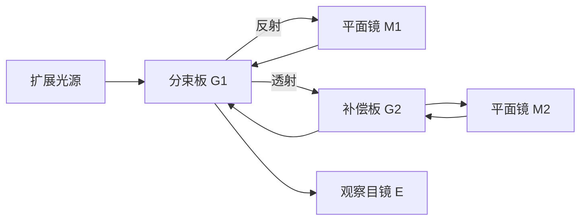

# 等倾干涉与迈克耳孙干涉仪（竞赛）

> [!abstract] 概览
> 本笔记是 [[04-光的干涉]] 的进阶篇。基础篇建立了光程差语言、分振幅法与半波损失，重点处理了等厚干涉（劈尖、牛顿环）；本篇补上分振幅法干涉的另一半——==等倾干涉==：厚度均匀的平行平面薄膜，光程差 $\Delta=2nd\cos i'$ 由==倾角==决定，条纹是透镜焦平面上的同心圆环，环心级次最高。在此基础上把用途最广的干涉仪——==迈克耳孙干涉仪==——完整展开：分束器、两平面镜与补偿板的结构，$M_2$ 虚像 $M_2'$ 与 $M_1$ 构成"等效空气薄膜"的视角，以及三大测量公式 $2\Delta d=\Delta N\lambda$（测波长/位移）与 $2(n-1)t=\Delta N\lambda$（测折射率）。等倾干涉与迈克耳孙干涉仪是 CPhO 复赛→决赛的高频考点，也直接通向 [[物理光学]] 中的法布里-珀罗高分辨光谱。数学上只需 [[05-复数与欧拉公式]] 的复振幅叠加（多光束等比级数求和）。

## 核心概念

### 一、等倾干涉：平行平面膜的干涉

厚度 $d$ 处处相同、折射率 $n$ 的平行平面薄膜（如平行玻璃板、肥皂膜的中段），浸在折射率为 $n_0$ 的均匀外部介质中。一束以入射角 $i$ 射来的光在==上表面反射==为一束（光线 1），另有一部分==折射进膜内、经下表面反射后穿出==（光线 2）——这是 [[04-光的干涉]] 中的分振幅法。两束反射光在无穷远处（或用透镜观察时在焦平面上）相遇叠加，其光程差为

$$
\boxed{\,\Delta=2nd\cos i'\,}\qquad(n_0\sin i=n\sin i')
$$

其中 $i'$ 为==膜内折射角==，由折射定律 $n_0\sin i=n\sin i'$ 与入射角 $i$ 联系。推导见"推导与原理"第一节。

**要点**：==$\Delta$ 只取决于倾角（$i$ 或 $i'$），与入射点在膜上的位置完全无关==——这正是"等倾"二字的含义。膜厚均匀，光程差被倾角"一人独占"。

**半波损失项的判断**：两束反射光分别在上下两界面反射，按基础篇规则逐界面判断。最常见的对称情形——膜折射率 $n$ ==介于==上下介质之间（如空气—玻璃—空气），或膜折射率最大（如空气中的肥皂膜）：
- 上界面：疏→密反射，==有==半波损失；
- 下界面：密→疏反射，==无==半波损失。

两次反射恰好"一有一无"，故光程差需附加 $\dfrac{\lambda}{2}$：

$$
\boxed{\,\Delta=2nd\cos i'+\frac{\lambda}{2}\,}
$$

> [!warning] 半波损失不能凭记忆
> "一有一无"只在上下介质对称（或 $n$ 最大、$n$ 最小）时成立。若 $n$ 介于上下介质之间且两界面均为疏→密（如空气—$MgF_2$—玻璃的增透膜），两束反射光==均有==半波损失，附加项为 $0$。==写 $\Delta$ 前先逐界面判断==，与基础篇的流程完全一致。

### 二、等倾条纹的特征

用==扩展光源==照明平行膜，经透镜观察，透镜焦平面（对应无穷远）上出现==一组同心圆环==——等倾环。原因：同一倾角的所有光线（来自膜面上不同位置）光程差相同，满足相同的明暗条件，会聚在焦平面上以光轴为中心的一个圆周上；不同倾角对应不同的圆环。

**级次分布**：$i'=0$（垂直入射，即环心）处 $\cos i'=1$，光程差==最大、干涉级次最高==；随 $i'$ 增大，$\cos i'$ 单调减小，光程差减小、级次逐环递减。即==环心级次最高，由内向外级次递减==。中央亮环的级次为

$$
m_{\max}=\left\lfloor\frac{2nd+\tfrac{\lambda}{2}}{\lambda}\right\rfloor
$$

（无半波损失时去掉 $\tfrac{\lambda}{2}$ 项。）环的角半径在中心附近正比于 $\sqrt{k}$（$k$ 为距中心环的环数），故等倾环==内疏外密==，与牛顿环的"$r\propto\sqrt m$"结构相似（见 [[04-光的干涉]]）。

**条纹的"冒出"与"缩入"**：若膜厚 $d$ 缓慢变化，等倾环随之整体演化：
- ==$d$ 增大 → 光程差增大 → 环心级次升高 → 新环从中心"冒出"==并向外扩张。理由：某固定级次 $m$ 的环要维持 $2nd\cos i'=m\lambda$ 不变，$d$ 增大则 $\cos i'$ 减小、$i'$ 增大，环半径增大；
- $d$ 减小 → 光程差减小 → 环心级次降低 → ==最内环向中心"缩入"==消失，整体收缩。

每变化 $\Delta d=\dfrac{\lambda}{2}$（光程差变化 $\lambda$），恰好冒出或缩入 **1 条**。这是等倾干涉最常考的定性判断。

**其他特征**：条纹细锐、对比度好；条纹位置与观察透镜的焦点有关（定域于焦平面，即无穷远）；单色性越好、膜面反射率越高，条纹越清晰。等厚条纹直接定域在薄膜表面附近，无需透镜即可看到——这是两者实验上的重要差别。

### 三、等倾与等厚的本质区别

| 比较项 | 等倾干涉 | 等厚干涉 |
| --- | --- | --- |
| 薄膜 | 厚度均匀的平行平面膜 | 厚度变化的楔形膜（劈尖、牛顿环） |
| 光程差的决定量 | 倾角 $i'$ | 膜厚 $t$ |
| 光程差 | $\Delta=2nd\cos i'$（$+\tfrac{\lambda}{2}$） | $\Delta=2nt$（$+\tfrac{\lambda}{2}$） |
| 条纹形态 | 同心圆环（等倾环） | 平行直条纹 / 同心环（牛顿环） |
| 条纹位置 | 透镜焦平面（定域于无穷远） | 膜表面附近 |
| 级次分布 | 环心最高，向外递减 | 沿厚度增加方向递增 |
| 光源要求 | 必须扩展光源（才覆盖各种倾角） | 扩展光源或平行光均可 |

一句话区分：==等倾是"厚度均匀、倾角分环"；等厚是"垂直入射、厚度分纹"==。

## 推导与原理

### 一、光程差公式的严格推导

设膜厚 $d$、折射率 $n$，外部介质折射率 $n_0$。入射光在上表面 $A$ 点分为两束：光线 1 直接反射；光线 2 折射进入膜内，到 $B$（下表面）反射，再从 $C$（上表面）穿出。两束出射光方向平行。取入射光线上一点 $D$（$C$ 在入射光线上的投影，$AD$ 沿入射光线方向），则从同一波前出发的两束光到同一出射波前的光程差为

$$
\Delta=n(AB+BC)-n_0\cdot AD
$$

几何关系：$AB=BC=\dfrac{d}{\cos i'}$，$AC=2d\tan i'$，$AD=AC\sin i=2d\tan i'\sin i$。由折射定律 $n_0\sin i=n\sin i'$：

$$
n_0\cdot AD=2d\tan i'\cdot n_0\sin i=2d\tan i'\cdot n\sin i'=2nd\,\frac{\sin^2 i'}{\cos i'}
$$

$$
\Delta=\frac{2nd}{\cos i'}-2nd\,\frac{\sin^2 i'}{\cos i'}=2nd\,\frac{1-\sin^2 i'}{\cos i'}=2nd\cos i'
$$

加上半波损失项即得 $\Delta=2nd\cos i'+\dfrac{\lambda}{2}$（是否需要附加，见核心概念第一节）。==推导的核心是把"膜内斜程 $2\times\dfrac{d}{\cos i'}$"与"旁移在入射方向的投影"相减：斜程随倾角增大而变长，同时投影也在增大，二者之差恰为 $\cos i'$ 因子==。

> [!tip] 记忆方式
> 垂直入射时 $i'=0$，$\Delta=2nd+\dfrac{\lambda}{2}$，退化为 [[04-光的干涉]] 中薄膜干涉的结果；斜入射时用 $\cos i'$ 修正。可以形象记作"==斜着看膜，有效厚度变成 $d\cos i'$=="。

### 二、等倾环的级次、角半径与"冒出/缩入"的定量

由明纹条件（以附加 $\tfrac{\lambda}{2}$ 的情形为例）

$$
2nd\cos i'+\frac{\lambda}{2}=m\lambda
$$

第 $m$ 级亮环满足 $\cos i'=\dfrac{m\lambda-\tfrac{\lambda}{2}}{2nd}$。设中央级次 $m_0=\dfrac{2nd+\tfrac{\lambda}{2}}{\lambda}$，则从中心向外第 $k$ 个亮环（级次 $m_0-k$）：

$$
\cos i'=1-\frac{k\lambda}{2nd}\;\Rightarrow\;i'\approx\sqrt{\frac{k\lambda}{nd}}
$$

（用了 $\cos i'\approx 1-\dfrac{i'^2}{2}$。）故环的角半径 $\propto\sqrt{k}$，==内疏外密==；膜越薄（$d$ 小），环越稀疏；$d$ 增大时各级 $\cos i'$ 减小、环向外扩张，同时中心级次升高冒出新环——这与核心概念第二节的定性结论互相印证。

**"冒出/缩入"与迈克耳孙的衔接**：在迈克耳孙干涉仪中，$M_1$ 平移 $\Delta d$ 等价于等效空气膜厚度变化 $\Delta d$。膜变厚（$M_1$ 远离 $M_2'$）→ 环"冒出"；膜变薄 → 环"缩入"。每变化 $\Delta d=\dfrac{\lambda}{2}$ 移动一条条纹。

### 三、多光束干涉：法布里-珀罗腔（定性）

平行平面膜的两表面若为==高反射面==（反射率 $R$ 接近 1），光在其中被多次反射、多次透出，透射光不再是两束而是==无穷多束==（振幅依次按 $R$ 等比衰减，相位差等差）。相邻两束透射光的相位差为

$$
\delta=\frac{2\pi}{\lambda}\cdot 2nd\cos i'
$$

多光束叠加（等比级数求和，见 [[05-复数与欧拉公式]]）得透射光强

$$
\boxed{\,I_t=\frac{I_0}{1+F\sin^2\dfrac{\delta}{2}}\,},\qquad F=\frac{4R}{(1-R)^2}
$$

**结论（记住即可）**：
1. 透射峰条件 $\delta=2\pi m$，即 $2nd\cos i'=m\lambda$——==与两光束干涉的明纹条件完全相同==，主极大位置不变；
2. 但峰形变窄：$R\to 1$ 时 $F\to\infty$，$\sin^2\dfrac{\delta}{2}$ 必须趋于 0 才能透过，透射峰变为极尖锐的谱线——==多光束使条纹锐化==；
3. 锐化的后果是极高的分辨本领：可以分辨波长差极小的两条谱线（钠双线、塞曼分裂），也可用作激光器选模。这就是法布里-珀罗（F-P）标准具成为高分辨光谱核心器件的原因。

> [!note] 与光栅类比
> 光栅是"$N$ 个缝的多光束干涉"，F-P 是"同一束光的多次往返"——两者同属==多光束干涉==，主极大条件同构（$d\sin\theta=m\lambda$ 与 $2nd\cos i'=m\lambda$），锐化机制相同：有效光束数越多，主极大越窄。详见 [[05-光的衍射]]。

### 四、迈克耳孙干涉仪（重点）

**结构**：$G_1$ 为分束板（后表面镀半透膜，与两镜成 $45°$），$M_1$、$M_2$ 为互相垂直的平面镜，$G_2$ 为补偿板（与 $G_1$ 同材料、等厚、平行），$E$ 为观察目镜（或透镜加光屏）。

**分光与等效空气膜**：光源光经 $G_1$ 镀银面分光——反射部分垂直射向 $M_1$ 并返回，透射部分穿过 $G_2$ 射向 $M_2$ 并返回。两束返回光在 $G_1$ 处汇合进入 $E$。关键视角：$M_2$ 经分束板镀银面成像为虚像 $M_2'$，位于 $M_1$ 附近。于是两束光等同于在 $M_1$ 与 $M_2'$ 之间的"空气薄膜"上反射产生的两束相干光：
- $M_1\perp M_2$（即 $M_1\parallel M_2'$）时，等效空气膜==厚度均匀== → ==等倾干涉==（同心环）；
- $M_1$ 与 $M_2$ 略不垂直时，$M_1$ 与 $M_2'$ 成微小夹角 → 等效==空气劈尖== → 等厚干涉（直条纹）。

**为什么不需要半波损失项**：两束光分别经历一次分束器镀银面反射和一次平面镜（金属面）反射，附加相位==两边相同==，相减时抵消。故迈克耳孙的明纹条件直接为

$$
2d\cos i'=m\lambda
$$

（$d$ 为等效空气膜厚度），无需加 $\tfrac{\lambda}{2}$——与普通薄膜反射干涉"一有一无"的情形不同，==不要混淆==。

**补偿板 $G_2$ 的用途**：不加 $G_2$ 时，走 $M_2$ 臂的光束两次穿过 $G_1$ 的玻璃，而走 $M_1$ 臂的光束穿过次数不同，玻璃引入的光程对两臂不相等。玻璃是色散介质，不同波长的光在其中的光程不同——这将导致白光干涉时各波长零程差位置错开，看不到白条纹。加上 $G_2$ 后，两臂穿越玻璃的次数与路径完全相同，玻璃贡献的光程从光程差中==完全消去==，干涉仪可以用于白光。==一句话：补偿板使两臂的玻璃光程相等、抵消色散，为白光干涉铺路==。

**三大测量公式**：

（1）**镜移与条纹移动**。$M_1$ 沿臂方向平移 $\Delta d$，光在臂内往返一次，光程差变化 $2\Delta d$；若明纹移动 $\Delta N$ 条，则

$$
\boxed{\,2\Delta d=\Delta N\cdot\lambda\,}
$$

即镜移动 $\dfrac{\lambda}{2}$ 条纹移动一条——系数 $2$ 来自往返。由此可测波长：$\lambda=\dfrac{2\Delta d}{\Delta N}$；已知波长则测微小位移：$\Delta d=\dfrac{\Delta N\lambda}{2}$（精度达波长量级，是"以波长为尺"的计量工具）。

（2）**插入介质片测折射率**。在某一臂插入厚度 $t$、折射率 $n$ 的介质片（垂直光束），光束去程、回程各穿过一次，每程光程增加 $(n-1)t$，总光程差增加 $2(n-1)t$。若条纹移动 $\Delta N$ 条：

$$
\boxed{\,2(n-1)t=\Delta N\lambda\,}\;\Rightarrow\;\boxed{\,n=1+\frac{\Delta N\lambda}{2t}\,}
$$

（3）**白光条纹**。白光的相干长度仅微米量级（见 [[04-光的干涉]] 的相干长度），故只有两臂光程差为零附近才出现可见条纹：零程差处各波长全部相长，为==白色中央亮纹==，两侧对称分布少数几条彩色条纹（紫内红外），再向外各色明暗混合、条纹消失。白光条纹的唯一作用是==精确定位零程差位置==——先粗调 $M_1$ 使彩色条纹出现，再细调使中央白纹居中，即完成定标。

## 典型实例与物理应用

### 实例 1：测单色光波长

调节 $M_1$、$M_2$ 严格垂直，用待测单色光照明，缓慢平移 $M_1$，数过视场中心移过的条纹数 $\Delta N$，同时读出 $M_1$ 的位移 $\Delta d$，则 $\lambda=\dfrac{2\Delta d}{\Delta N}$。条纹计数精度可达 $\pm\dfrac14$ 条，故波长测量精度极高（相对 $10^{-7}$ 量级），钠光灯、汞灯的波长常以此法定标。

### 实例 2：测微小位移与热膨胀

用已知单色光照明，将待测物与 $M_1$ 相连：物移动 $\Delta d$ → 条纹移动 $\Delta N=\dfrac{2\Delta d}{\lambda}$ 条。可测微米量级位移、热膨胀系数、压电陶瓷形变等——干涉仪是精密计量的鼻祖，现代的光刻机、引力波探测器仍是它的后裔。

### 实例 3：测折射率（气体）

在臂中放置充气管（长为 $t$），抽气、充气改变管内气体折射率，条纹移动 $\Delta N$ 条，由 $n-1=\dfrac{\Delta N\lambda}{2t}$ 可测气体折射率——气体 $n-1\sim10^{-4}$，需 $t$ 达厘米量级、$\Delta N$ 数十条，正好落在干涉仪的精度范围。历史上迈克耳孙-莫雷实验正是此装置的变体：转动整个仪器，两臂光程差预期变化导致的条纹移动为零，从而否定了"以太"的存在。

### 实例 4：转动镜面测微小角度

两镜略成小角 $\alpha$ 时出现等厚直条纹，间距（空气劈尖公式，见 [[04-光的干涉]]）

$$
l\approx\frac{\lambda}{2\alpha}
$$

由实测 $l$ 反解 $\alpha\approx\dfrac{\lambda}{2l}$。例：$\lambda=600\,\text{nm}$、$l=3.0\,\text{mm}$ 时 $\alpha=1.0\times10^{-4}\,\text{rad}\approx 20.6''$——条纹间距对微小角度极其敏感，这是测角、测平整度的常用手段。

### 实例 5：竞赛题型速查

| 题型 | 核心公式 | 套路要点 |
| --- | --- | --- |
| 数环测波长 | $\lambda=\dfrac{2\Delta d}{\Delta N}$ | 读位移、数环数，注意系数 $2$ |
| 数环测位移 | $\Delta d=\dfrac{\Delta N\lambda}{2}$ | 已知波长即得位移 |
| 插片测折射率 | $n=1+\dfrac{\Delta N\lambda}{2t}$ | 系数 $2$（往返）+ $n-1$（相对空气） |
| 转镜测小角 | $\alpha\approx\dfrac{\lambda}{2l}$ | 先转成等厚模式，量条纹间距 |
| 环级次判断 | $m_{\max}=\dfrac{2d}{\lambda}$ | 环心级次最高，向外递减 |
| "冒出/缩入" | 每 $\dfrac{\lambda}{2}$ 变化一条 | 膜厚增冒、减缩，级次升降随之 |

## 例题

### 例 1：迈克耳孙测波长与"缩入"判断

**题目**：迈克耳孙干涉仪以单色光照明，$M_1$ 与 $M_2$ 严格垂直。将 $M_1$ 沿臂方向匀速平移 $\Delta d=0.3000\,\text{mm}$，观察到视场中条纹恰好移动 $\Delta N=1000$ 条（始终向中心"缩入"）。（1）求入射光波长 $\lambda$；（2）说明 $M_1$ 向哪个方向移动，此时等效空气膜变厚还是变薄？

**分析**：条纹移动数 $\Delta N$ 与光程差变化 $2\Delta d$ 的关系是 $2\Delta d=\Delta N\lambda$；"缩入"意味着环心级次降低、等效膜变薄。

**解答**：（1）

$$
\lambda=\frac{2\Delta d}{\Delta N}=\frac{2\times0.3000\times10^{-3}}{1000}=6.00\times10^{-7}\,\text{m}=600\,\text{nm}
$$

（2）条纹"缩入" ⇔ 光程差减小 ⇔ 等效空气膜==变薄==，即 $M_1$ 向 $M_2'$（$M_2$）方向移动。若反过来向远离方向移动，则环不断从中心"冒出"。

**点评**：系数 $2$ 来自光的往返，是本题唯一的数值陷阱。"缩入 = 膜薄 = 级次降低"三者的等价关系必须牢固——"冒出/缩入"的方向判断在竞赛中常与正负号一起考。

### 例 2：插入介质片测折射率

**题目**：迈克耳孙干涉仪以 $\lambda=600\,\text{nm}$ 单色光照明，调好条纹。在 $M_2$ 臂上垂直插入一块厚度 $t=1.000\,\text{mm}$ 的透明玻璃片，观察到视场中心重新出现同样状态的明纹，期间条纹移动 $\Delta N=1700$ 条。求玻璃折射率 $n$。

**分析**：光束往返两次穿过玻璃片，光程差增加 $2(n-1)t$；$\Delta N$ 条条纹对应光程差变化 $\Delta N\lambda$。

**解答**：

$$
2(n-1)t=\Delta N\lambda\;\Rightarrow\;n=1+\frac{\Delta N\lambda}{2t}
$$

$$
n=1+\frac{1700\times600\times10^{-9}}{2\times1.000\times10^{-3}}=1+\frac{1.02\times10^{-3}}{2\times10^{-3}}=1.51
$$

**点评**：两个"系数"缺一不可——光两次穿过介质片（系数 $2$），以及相对被替换空气的光程增量 $n-1$ 而非 $n$。对照双缝干涉插入介质片的 $\Delta N=\dfrac{(n-1)t}{\lambda}$（见 [[04-光的干涉]] 例 1），迈克耳孙多一个往返系数 $2$。若玻璃片与光束不严格垂直，公式还要含倾角修正——竞赛默认垂直插入。

### 例 3：等倾环的级次与"冒出"判断

**题目**：迈克耳孙干涉仪调至 $M_1\perp M_2$，等效空气膜厚度 $d=0.2500\,\text{mm}$，以 $\lambda=500\,\text{nm}$ 的扩展单色光源照明，透镜焦平面上出现等倾圆环。（1）求环心亮纹的级次；（2）求与环心相邻的外侧亮环对应的入射角 $i$；（3）若 $M_1$ 向 $M_2'$ 移动 $\Delta d=250\,\text{nm}$，环心处发生什么变化？

**分析**：迈克耳孙明纹条件 $2d\cos i'=m\lambda$（无半波损失项）。环心 $i'=0$ 级次最高；相邻外环级次减一；$M_1$ 移动改变等效膜厚，据此判断"冒出/缩入"。

**解答**：（1）

$$
2d=2\times0.2500\times10^{-3}=5.00\times10^{-4}\,\text{m}=1000\lambda
$$

环心亮纹级次 $m=1000$。

（2）相邻外环级次 $m-1=999$：

$$
2d\cos i'=999\lambda\;\Rightarrow\;\cos i'=\frac{999}{1000}=0.999
$$

$$
i'\approx\sqrt{2(1-0.999)}=\sqrt{2\times10^{-3}}\approx4.47\times10^{-2}\,\text{rad}\approx2.56°
$$

空气膜中 $i'=i$，故入射角 $i\approx2.56°$。

（3）$M_1$ 向 $M_2'$ 移动 $250\,\text{nm}=\dfrac{\lambda}{2}$，光程差减小 $\lambda$，环心级次由 $1000$ 降为 $999$：原第 $1000$ 级亮环"缩入"中心消失，新环心由第 $999$ 级亮纹占据——宏观表现为条纹整体向中心收缩，每移动 $\dfrac{\lambda}{2}$ 缩入一条。

**点评**：本题串起等倾环的三大考点——环心级次最高、环角半径 $\propto\sqrt{k}$（此处取 $k=1$，$i'\approx\sqrt{2k\lambda/(2d)}$）、"冒出/缩入"与级次升降的对应。注意迈克耳孙的明纹条件不带 $\tfrac{\lambda}{2}$，若误加则环心级次全错。

## 易错提醒

> [!warning] 易错点
> 1. **漏掉系数 $2$（镜移）**：$M_1$ 移动 $\Delta d$，光程差变化 $2\Delta d$（往返一次），故 $\Delta N=\dfrac{2\Delta d}{\lambda}$，不是 $\dfrac{\Delta d}{\lambda}$。
> 2. **介质片光程增量写错**：迈克耳孙中是 $2(n-1)t$，不是 $(n-1)t$、更不是 $2nt$。系数 $2$ 来自往返两次穿过，$n-1$ 来自相对被替换空气的增量。与双缝的 $(n-1)t$ 对照记忆。
> 3. **等倾环环心级次最高而非最低**：$i'=0$ 处光程差最大、级次最高，由内向外级次递减。误记为"中央最小"会把"冒出/缩入"判断全部颠倒（膜增厚应冒出）。
> 4. **"冒出/缩入"方向**：膜（等效空气膜）变厚 → 环冒出向外扩张；变薄 → 环缩入消失。$M_1$ 远离 $M_2'$ 是变厚，靠近是变薄。
> 5. **迈克耳孙明纹条件不带 $\tfrac{\lambda}{2}$**：两束光各经历一次镀银反射、一次镜面反射，附加相位相消，$\Delta=2d\cos i'$。普通平行玻璃膜反射光"一有一无"加 $\tfrac{\lambda}{2}$——两种装置不要混用。
> 6. **等倾条纹必须用透镜观察**：条纹定域于无穷远（透镜焦平面），直接在膜表面看不到；等厚条纹定域于膜表面，用放大镜即可。观察方式也是二者的判据。
> 7. **等倾需要扩展光源**：平行光照明平行膜只给出均匀明暗（各倾角只取一个值），形不成环；等厚干涉则扩展光源、平行光均可。
> 8. **白光条纹只在零程差附近出现**：远离零程差各色明暗混合成均匀白光，看不到彩色条纹。白光的用途是定位零程差，不要误以为能数出很多彩色环。
> 9. **转镜测角的几何关系**：夹角 $\alpha$ 与条纹间距 $l$ 满足 $l\approx\dfrac{\lambda}{2\alpha}$（空气劈尖近似 $\sin\alpha\approx\alpha$），$\alpha$ 越大条纹越密；等倾模式下没有这条公式。

> [!note] 概念辨析
> **等倾干涉 vs 等厚干涉**（迈克耳孙的两种工作模式）
>
> | 比较项 | 等倾模式（$M_1\parallel M_2'$） | 等厚模式（$M_1$ 与 $M_2'$ 有小角） |
> | --- | --- | --- |
> | 等效薄膜 | 厚度均匀的平行空气膜 | 空气劈尖 |
> | 光程差 | $2d\cos i'$ | $2d$（垂直入射） |
> | 条纹 | 同心圆环 | 平行直条纹 |
> | 观察 | 透镜焦平面 | 膜表面附近 |
> | 应用 | 测波长、位移、折射率 | 测微小角度、平整度 |
> | 判据 | 镜完全垂直 | 镜略倾斜 |
>
> **条纹移动的"系数"对照**（同一思想在不同装置的体现）
>
> | 装置 | 光程差改变量 | 条纹移动数 |
> | --- | --- | --- |
> | 双缝前插介质片（单程） | $(n-1)t$ | $\Delta N=\dfrac{(n-1)t}{\lambda}$ |
> | 迈克耳孙插介质片（往返） | $2(n-1)t$ | $\Delta N=\dfrac{2(n-1)t}{\lambda}$ |
> | 迈克耳孙移动 $M_1$（往返） | $2\Delta d$ | $\Delta N=\dfrac{2\Delta d}{\lambda}$ |
>
> 记忆口诀：==凡是光束"往返"穿越的，一律乘 $2$；凡是介质片替换空气的，一律用 $n-1$==。

## 与其他知识关联

- 与 [[04-光的干涉]] 的关系：本篇是其直接进阶——分振幅法、半波损失、光程差语言全部继承；基础篇的等厚干涉（劈尖、牛顿环）与本文的等倾干涉并列互补，构成薄膜干涉的全貌。
- 与 [[05-光的衍射]] 的关系：法布里-珀罗腔与光栅同为多光束干涉，主极大条件同构、锐化机制相同；单缝、光栅的复振幅叠加技巧在此复用。
- 与 [[05-复数与欧拉公式]] 的关系：多光束叠加 $\sum_k R^{k/2}e^{ik\delta}$ 的等比级数求和与 $|z|^2$ 强度计算，是本篇唯一的数学工具。
- 与 [[06-光的偏振与电磁本性]] 的关系：干涉要求振动方向一致；分束板对不同偏振分量的反射率不同，会改变条纹对比度（干涉仪的偏振效应）。
- 与 [[01-微积分基础]] 的关系：等倾环角半径 $\sqrt{k}$ 规律的推导依赖小量展开 $1-\cos i'\approx\dfrac{i'^2}{2}$。
- 与高中物理衔接：[[00-光学总览|高中光学总览]] 中"薄膜干涉的定性介绍"是直观基础。
- 与大学层面联系：[[物理光学]]（法布里-珀罗的精细度与多光束干涉的严格理论、相干度理论）、[[光学]]（干涉计量与光谱学应用，LIGO 引力波探测器即巨型迈克耳孙干涉仪）。

## 作者的话

> [!quote] 个人理解
> 等倾干涉与迈克耳孙干涉仪，本质上是同一件事：==一个光程差公式撑起整台仪器==。平行平面膜的 $\Delta=2nd\cos i'$ 先是给了我们"倾角分环"的等倾图景，再经迈克耳孙的等效空气膜一转，就变成了一台能测波长、测位移、测折射率、测角度的万能尺——竞赛中几乎所有迈克耳孙题目，第一步都是把仪器"还原"成 $M_1$ 与 $M_2'$ 之间的空气薄膜，然后一切就回到了基础篇熟悉的 $\Delta$ 语言。
>
> 我的体会是，这一篇的"手感"比知识更重要：数环时要问自己"膜在变厚还是变薄"，插片时要问"光穿过了几次、替换了什么"——==每次问一句，系数就漏不掉==。至于等倾环的"冒出/缩入"，把它想象成放气球：膜变厚如同充气，新环从中心挤出来；膜变薄如同放气，环圈向中心缩回去。想通这个画面，级次升降、方向判断就再也不会错。下一站 [[05-光的衍射]]，那里多光束的思想将与光栅重逢。

---
*返回 [[00-竞赛光学总览]]*
