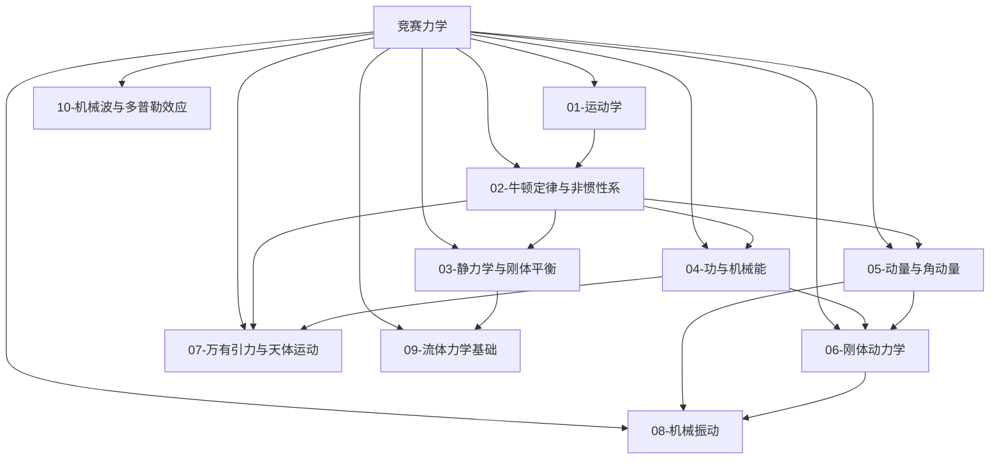

# 竞赛力学总览

> [!abstract] 概览
> 力学是物理竞赛（CPhO）中分值占比最高、思想方法最核心的版块。竞赛力学在高中力学的基础上大幅深化：**数学上**引入微积分与矢量运算（见 [[01-微积分基础]]、[[03-矢量运算]]），把"恒力、匀变速"推广到"变力、一般曲线运动"；**物理上**突破高中框架，新增非惯性系与惯性力、质心系、刚体转动、轨道力学、微元法（变质量）等工具。本模块共 10 篇笔记，按"描述运动 → 力与运动 → 平衡 → 能量 → 动量 → 刚体 → 天体 → 振动 → 波 → 流体"的脉络展开，全部建立在 [[01-预备知识]] 的数学工具之上，并与 [[00-力学总览|高中力学总览]] 衔接、为 [[理论力学]]、[[拉格朗日方程]] 等大学内容铺垫。本文件（MOC）作为力学版块总入口。

## 力学知识脉络图

## 一、运动学与动力学（基础版块）

| 笔记 | 简介 | 核心内容 |
| --- | --- | --- |
| [[01-运动学]] | 用微积分描述运动，推广到一般曲线运动 | 参考系与坐标描述、直线运动与图像、抛体运动、圆周运动、自然坐标系与曲率半径、相对运动与伽利略变换、追及相遇与极值问题 |
| [[02-牛顿运动定律与非惯性系]] | 力与运动的因果律，突破惯性系 | 牛顿三定律、受力分析与动力学问题、非惯性系与惯性力（平动/转动/科里奥利力）、微元法处理变质量、阿特伍德机与约化质量、临界问题 |
| [[03-静力学与刚体平衡]] | 平衡条件与竞赛求解技巧 | 力与力矩、共点力平衡、一般平衡条件、摩擦与摩擦角自锁、三力汇交与拉密定理、虚功原理、稳定性分析、悬链线与桁架简介 |

## 二、守恒律与刚体（核心工具）

| 笔记 | 简介 | 核心内容 |
| --- | --- | --- |
| [[04-功与机械能]] | 能量的观点：变力做功与机械能守恒 | 功与功率的微积分定义、动能定理、保守力与势能、机械能守恒、功能原理与非保守力、链条与变质量系统、能量法解运动学问题 |
| [[05-动量与角动量]] | 动量的观点：碰撞与质心运动 | 冲量与动量定理（流体冲击力）、动量守恒、碰撞与恢复系数、质心运动定理与质心系、两体问题、火箭与反冲、角动量定理与角动量守恒 |
| [[06-刚体动力学]] | 刚体的定轴转动与平面运动 | 转动惯量（定义/平行轴/垂直轴定理）、转动定律 $\tau=I\alpha$、转动动能、纯滚动、角动量守恒、刚体碰撞、复摆、进动简介 |

## 三、专题版块（综合应用）

| 笔记 | 简介 | 核心内容 |
| --- | --- | --- |
| [[07-万有引力与天体运动]] | 万有引力下的轨道运动 | 万有引力定律与引力场、开普勒三定律、圆轨道与椭圆轨道、轨道能量与机械能、三大宇宙速度、卫星与同步轨道、双星与多星系统、引力势能、束缚与逃逸 |
| [[08-机械振动]] | 最基础的周期运动及其推广 | 简谐运动的动力学方程、旋转矢量法、能量、等效摆（单摆/复摆/水银柱振动）、阻尼振动、受迫振动与共振、振动叠加与拍 |
| [[10-机械波与多普勒效应]] | 波动的传播、叠加与多普勒效应 | 波动方程与波形图/振动图、波的能量、惠更斯原理、波的干涉、驻波与简正模式、弦振动、多普勒效应公式与马赫锥 |
| [[09-流体力学基础]] | 静止与运动流体的基本规律 | 流体静力学（压强/帕斯卡/阿基米德）、连续性方程、伯努利方程及其竞赛应用（托里拆利/虹吸/文丘里管/水龙带反冲）、黏滞流体与斯托克斯定律简介 |

## 学习路径

> [!tip] 推荐路径
> **主线顺序**：01 → 02 → 04/05（守恒律）→ 06 → 07 → 08 → 10，03 与 09 可穿插。
>
> - **初赛速成**：01、02、04、05 四篇是初赛绝对主力（约 70% 分值），务必吃透；
> - **复赛进阶**：06 刚体、07 天体、03 静力学难题、08 受迫振动、10 多普勒效应是复赛分水岭；
> - **方法串联**：先学 [[01-微积分基础]] 与 [[03-矢量运算]] 再开始本模块；学完 05 后建议回顾 [[碰撞详解]]，并对照 [[05-动量与角动量]] 中的质心运动定理与质心系；08 振动是 10 波的直接前置；
> - **对照学习**：与 [[00-力学总览|高中力学总览]] 逐节对照——高中公式是竞赛公式的特例（如匀变速公式是 $a=$ 常数时 $a=\dfrac{dv}{dt}$ 的积分结果）。

## 与其他知识关联

### 与预备知识衔接
- [[01-微积分基础]]：运动学的 $v=\dfrac{ds}{dt}$、功 $W=\int F\,dx$、转动惯量 $I=\int r^2\,dm$ 全部依赖微积分
- [[02-微分方程初步]]：简谐运动 $\ddot{x}+\omega^2 x=0$、阻尼振动、火箭方程都归结为解微分方程
- [[03-矢量运算]]：速度合成、角动量 $\vec L=\vec r\times m\vec v$、力矩 $\vec\tau=\vec r\times\vec F$ 需要叉积
- [[06-量纲分析]]：天体运动周期、流体问题常用量纲分析先行

### 与高中物理衔接
- [[00-力学总览|高中力学总览]] 的 01-03 子模块是竞赛力学全部内容的高中基础
- [[00-物理竞赛总览]] 为本模块的上级目录

### 与大学层面衔接
- [[理论力学]]：本模块的非惯性系、刚体、拉格朗日思想是理论力学的入门
- [[拉格朗日方程]]：虚功原理与最小作用量思想的进阶
- [[机械振动]]、[[机械波]]：振动向波动的推广
- [[万有引力定律]]、[[壳层定理]]、[[球壳与质点间引力的推导]]：天体部分的微积分严格化
- [[流体力学]]：伯努利方程的完整推导与黏性流体

## 常用公式速查

### 运动学
$$
v=\frac{ds}{dt},\quad a=\frac{dv}{dt},\quad a_n=\frac{v^2}{R},\quad a_t=\frac{dv}{dt}
$$

### 动力学
$$
\vec F=m\vec a,\quad \vec F+\vec F_{\text{惯性}}=m\vec a'\ \text{(非惯性系)},\quad \tau=I\alpha
$$

### 守恒律
$$
W=\int F\,dx,\quad I=\int F\,dt=\Delta p,\quad \Delta E_k=W_{\text{合}},\quad \Delta E = W_{\text{非保守}}
$$

$$
I=\int r^2\,dm,\quad \vec L=\vec r\times m\vec v,\quad \vec\tau=\frac{d\vec L}{dt}
$$

### 天体与振动
$$
T^2\propto a^3,\quad v=\sqrt{\frac{GM}{r}},\quad E=-\frac{GMm}{2a}
$$

$$
x=A\cos(\omega t+\varphi),\quad \omega=\sqrt{\frac{k}{m}},\quad T=2\pi\sqrt{\frac{m}{k}}
$$

---

> [!quote] 作者寄语
> 竞赛力学与高中力学最大的区别在于**观点的升维**：高中解题靠"公式套用"，竞赛解题靠"方法选择"。同样一道题，用牛顿第二定律、动能定理、动量定理、能量守恒、质心系、刚体转动定律可以走出至少五条路——竞赛高手的选择标准是"哪条路最省力"。
>
> 建议把本模块的 9 篇笔记当作**工具箱**而非教材：先通读一遍建立全景，再在刷题时按"运动学 → 守恒律 → 刚体"的层次逐步调用工具。遇到难题先问三个问题：能用能量吗？能用动量吗？换参考系（质心系/非惯性系）会变简单吗？——这比硬算快得多。
>
> 返回 [[00-物理竞赛总览]]。

---

*返回 [[00-物理竞赛总览]]*
