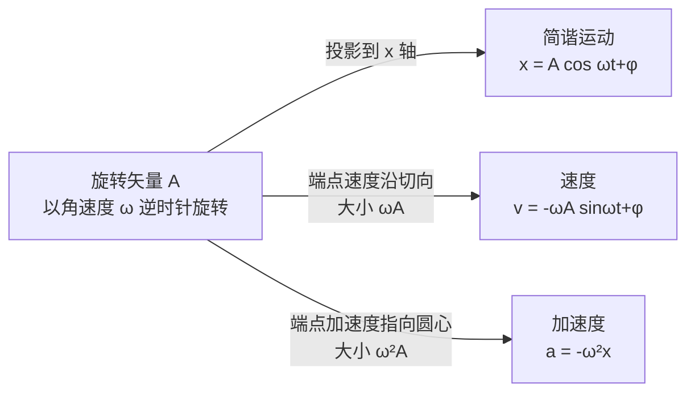

# 机械振动（竞赛）

> [!abstract] 概览
> 高中已经知道弹簧振子与单摆"来回运动"，但竞赛要求回答三个更深的问题：==凭什么说它是简谐运动、周期是多少、怎么快算相位==。本笔记在高中基础上引入四大竞赛工具：==动力学判据==（$\ddot x+\omega^2 x=0$，由 [[02-微分方程初步]] 求解）、==旋转矢量法==（把振动翻译成圆周运动的投影，快定相位与相位差）、==等效思想==（等效劲度系数与等效重力场，把陌生系统化为标准振子）与==能量视角==（$E=\tfrac12 m\omega^2A^2$）。随后推广到阻尼振动、受迫振动与共振，并讨论振动的合成（拍与李萨如图形）。本笔记承接 [[04-功与机械能]] 的能量观点与 [[06-刚体动力学]] 的复摆，是 [[机械波]] 与大学 [[机械振动]] 的前置内容。

## 核心概念

### 一、简谐运动的动力学判据

凡是合外力满足线性回复力（与偏离平衡位置的位移成正比且反向）的系统，其动力学方程必可化为

$$
\boxed{\,\ddot x+\omega^2 x=0\,}
$$

其中 $\omega$ 称为==角频率（圆频率）==，只由系统自身决定，与振幅、初始条件无关。这是一个==线性、齐次、二阶常系数==微分方程（见 [[02-微分方程初步]]）。两个基本实例：

**弹簧振子**：$m\ddot x=-kx$，故 $\omega=\sqrt{\dfrac{k}{m}}$。

**单摆（小角度）**：$ml\ddot\theta=-mg\theta$（用了 $\sin\theta\approx\theta$），故 $\omega=\sqrt{\dfrac{g}{l}}$。

> [!note] 判据的两种用法
> - **正用**：已知系统满足 $\ddot x+\omega^2 x=0$，直接读出 $\omega$，周期 $T=\dfrac{2\pi}{\omega}$；
> - **反用**：把合力写成"负常数乘偏离量"即判定简谐运动（若含常数项，先平移坐标到平衡位置）。

### 二、运动学方程与初始条件

方程 $\ddot x+\omega^2 x=0$ 的通解可写为振幅—相位形式

$$
\boxed{\,x(t)=A\cos(\omega t+\varphi)\,}
$$

$x=A\cos(\omega t+\varphi)$ 与 $x=A\sin(\omega t+\varphi')$ 完全等价（$\varphi'=\varphi+\dfrac{\pi}{2}$），只是相位参考点不同，竞赛中习惯用 $\cos$ 形式。速度与加速度：

$$
v=\dot x=-A\omega\sin(\omega t+\varphi), \qquad a=\ddot x=-A\omega^2\cos(\omega t+\varphi)=-\omega^2x
$$

$A$ 与 $\varphi$ 由 $t=0$ 时的初始位移 $x_0$、初始速度 $v_0$ 确定：

$$
\boxed{\,A=\sqrt{x_0^2+\left(\frac{v_0}{\omega}\right)^2},\qquad \tan\varphi=-\frac{v_0}{\omega x_0}\ \left(\text{按 }x_0,\,v_0\text{ 的符号定象限}\right)\,}
$$

**周期与频率**：$T=\dfrac{2\pi}{\omega}$，$f=\dfrac{1}{T}=\dfrac{\omega}{2\pi}$（单位 Hz）。周期是==固有性质==——只要判据成立，$T$ 与振幅、初相无关（等时性）。

### 三、旋转矢量法

简谐运动与匀速圆周运动存在精确对应：一个以角速度 $\omega$ 逆时针旋转、长度 $A$ 的矢量 $\vec A$，在 $x$ 轴上的投影 $x=A\cos(\omega t+\varphi)$ 恰是简谐运动。画图时横轴为 $x$，矢量与 $x$ 轴正方向的夹角即相位 $\omega t+\varphi$。

用旋转矢量图可直接读出：
- ==初相 $\varphi$==：$t=0$ 时刻矢量与 $x$ 轴正方向的夹角（由 $x_0$ 的正负与 $v_0$ 的方向确定夹角位于哪个半平面）；
- ==相位差==：两矢量之间的夹角即相位差，夹角 $0$ 为同相、$\pi$ 为反相、$\dfrac{\pi}{2}$ 为正交；
- ==时间间隔==：相位变化 $\Delta\varphi=\omega\,\Delta t$，矢量转过多少角度，就过去了 $\dfrac{\Delta t}{T}=\dfrac{\Delta\varphi}{2\pi}$ 的比例。

> [!tip] 快算相位差
> 质点从 $x=\dfrac{A}{2}$ 第一次运动到 $x=A$：相位差 $\dfrac{\pi}{3}$，用时 $\Delta t=\dfrac{\pi/3}{\omega}=\dfrac{T}{6}$。这类"位置→时间"问题用矢量图一眼看出角度，比解三角方程快得多，也避免了多解取舍。

**旋转矢量合成**：两个同频率、同方向简谐运动的合成，等于两个旋转矢量按平行四边形法则相加。设 $x_1=A_1\cos(\omega t+\varphi_1)$、$x_2=A_2\cos(\omega t+\varphi_2)$，合成后仍为同频率简谐运动：

$$
A=\sqrt{A_1^2+A_2^2+2A_1A_2\cos\Delta\varphi}, \qquad \Delta\varphi=\varphi_2-\varphi_1
$$

- 同相（$\Delta\varphi=2n\pi$）：$A=A_1+A_2$，==加强==；
- 反相（$\Delta\varphi=(2n+1)\pi$）：$A=|A_1-A_2|$，==减弱==。

### 四、简谐运动的能量

速度 $v=-A\omega\sin(\omega t+\varphi)$，故动能与（以弹簧振子为例的）势能分别为

$$
E_k=\frac12 mv^2=\frac12 m\omega^2A^2\sin^2(\omega t+\varphi), \qquad E_p=\frac12 kx^2=\frac12 m\omega^2A^2\cos^2(\omega t+\varphi)
$$

两者随时间此消彼长，总能量守恒：

$$
\boxed{\,E=E_k+E_p=\frac12 m\omega^2A^2=\frac12 kA^2\,}
$$

> [!note] 关于"各占一半"的三个结论
> 1. ==瞬时==：$E_k=E_p$ 出现在 $x=\pm\dfrac{A}{\sqrt2}$ 处，每周期 4 次；
> 2. ==时间比例==：$E_k>E_p$ 等价于 $|x|<\dfrac{A}{\sqrt2}$，每周期恰好一半时间；
> 3. ==平均==：$\langle E_k\rangle=\langle E_p\rangle=\dfrac{E}{2}$。
> 三者都正确但含义不同，审题时区分"瞬时""时间比例""平均"。

### 五、等效单摆与等效劲度系数

竞赛中大量周期问题归结为找==等效角频率== $\omega$：核心关系 $\omega=\sqrt{\dfrac{k_{\text{eff}}}{m_{\text{eff}}}}$。

**单摆**：$T=2\pi\sqrt{\dfrac{l}{g}}$；摆角较大（$\theta_0\gtrsim5^\circ$）时周期修正为

$$
\boxed{\,T\approx T_0\left(1+\frac{\theta_0^2}{16}\right)\,}\qquad (\theta_0\text{ 用弧度})
$$

大摆角使周期==变长==：$\theta_0=30^\circ\approx0.524\,\text{rad}$ 时修正约 $1.7\%$。竞赛中一般按小角度处理，但结论要记住，防选择题挖坑。

**复摆（物理摆）**：绕不过质心轴摆动的刚体

$$
\boxed{\,T=2\pi\sqrt{\frac{I}{mgd}}\,}
$$

$d$ 为转轴到质心的距离，$I$ 为对转轴的转动惯量（求法见 [[06-刚体动力学]]）。定义==等值摆长== $l'=\dfrac{I}{md}$，则复摆与摆长 $l'$ 的单摆完全等价。

**等效劲度系数**：

| 情形 | 公式 | 直觉 |
| --- | --- | --- |
| 串联 | $\dfrac{1}{k}=\dfrac{1}{k_1}+\dfrac{1}{k_2}$ | 更"软"，$k<\min(k_1,k_2)$，周期变长 |
| 并联 | $k=k_1+k_2$ | 更"硬"，周期变短 |
| 截成 $n$ 段 | $k'=nk$ | 每段更"硬"，$T'=\dfrac{T}{\sqrt{n}}$ |

**等效重力场**：在匀加速参考系（见 [[02-牛顿运动定律与非惯性系]]）中引入惯性力，与重力合成为等效重力 $\vec g_{\text{eff}}=\vec g-\vec a$：
- 电梯竖直加速：$g_{\text{eff}}=g\pm a$；
- 水平加速车厢：$g_{\text{eff}}=\sqrt{g^2+a^2}$，新平衡位置偏离竖直方向 $\tan\alpha=\dfrac{a}{g}$；
- 带电摆球在匀强电场中：$g_{\text{eff}}=g\mp\dfrac{qE}{m}$（取合力方向为正）。

**液柱振动**：U 形管内液柱整体振荡，$\omega=\sqrt{\dfrac{2g}{L}}$，见"推导与原理·三"。

### 六、阻尼振动

考虑正比于速度的阻力 $f=-b\dot x$，运动方程为

$$
m\ddot x+b\dot x+kx=0 \quad\Longrightarrow\quad \ddot x+2\gamma\dot x+\omega_0^2x=0
$$

其中 $\gamma=\dfrac{b}{2m}$ 为==衰减系数（阻尼系数）==，$\omega_0=\sqrt{\dfrac{k}{m}}$ 为==固有角频率==。按 $\gamma$ 与 $\omega_0$ 的相对大小分三种情形（解的来源见 [[02-微分方程初步]]）：

| 类型 | 条件 | 运动图像 | 回到平衡 |
| --- | --- | --- | --- |
| 欠阻尼 | $\gamma<\omega_0$ | 振荡衰减，$x=A_0e^{-\gamma t}\cos(\omega t+\varphi)$，$\omega=\sqrt{\omega_0^2-\gamma^2}$ | 多次穿越平衡 |
| 临界阻尼 | $\gamma=\omega_0$ | 单调返回，无振荡 | ==最快==回到平衡 |
| 过阻尼 | $\gamma>\omega_0$ | 单调缓慢返回 | 很慢 |

> [!warning] 常见误区
> 欠阻尼时 $\omega=\sqrt{\omega_0^2-\gamma^2}<\omega_0$，即==阻尼使振动变慢==（周期变长）；衰减因子 $e^{-\gamma t}$ 只裹在振幅上。公式 $T=2\pi\sqrt{\dfrac{m}{k}}$ 只对无阻尼振子成立。

**对数减缩**：相邻两个同向最大位移（振幅）之比的对数

$$
\Lambda=\ln\frac{A(t)}{A(t+T)}=\gamma T_d \qquad \left(\text{弱阻尼时 }\Lambda\approx\frac{\pi b}{\sqrt{km}}\right)
$$

它由系统参数决定、与初始条件无关，是实验上测阻尼的常用量。

### 七、受迫振动与共振

在阻尼振子上外加周期驱动力 $F=F_0\cos\omega_d t$（$\omega_d$ 为==驱动角频率==）：

$$
m\ddot x+b\dot x+kx=F_0\cos\omega_d t
$$

通解 = 自由振动的衰减解（暂态，随时间消失）+ 稳态解。==稳态时系统以驱动频率 $\omega_d$ 振动==（而非固有频率），稳态振幅与频率的关系为

$$
\boxed{\,A(\omega_d)=\dfrac{F_0/m}{\sqrt{\left(\omega_0^2-\omega_d^2\right)^2+4\gamma^2\omega_d^2}}\,}
$$

**共振**：当 $\omega_d$ 接近 $\omega_0$ 时振幅出现极大（弱阻尼下峰值 $\approx\dfrac{F_0}{2m\gamma\omega_0}$），这就是==共振==。共振条件 $\omega_d\approx\omega_0$；阻尼越小，共振峰越高越尖（$\gamma\to0$ 时振幅发散），阻尼越大，峰越矮越宽。位移与驱动力之间还有相位滞后：$\omega_d\ll\omega_0$ 时同相，$\omega_d=\omega_0$ 时滞后 $\dfrac{\pi}{2}$，$\omega_d\gg\omega_0$ 时滞后 $\pi$。

**利与弊**：利——收音机调台（LC 谐振选频）、微波炉加热（水分子共振）、乐器共鸣箱放大声音；弊——塔科马海峡大桥风中共振坍塌、军队过桥步调一致引发共振、机器转轴共振损坏。工程上以加大阻尼、错开固有频率来防共振。

### 八、振动的合成

**同方向、同频率**（见"核心概念·三"）合成后仍为简谐运动；**同方向、不同频率**：设 $x_1=A\cos\omega_1 t$、$x_2=A\cos\omega_2 t$（$|\omega_1-\omega_2|\ll\omega_1$），和差化积得

$$
x=x_1+x_2=2A\cos\!\left(\frac{\omega_1-\omega_2}{2}t\right)\cos\!\left(\frac{\omega_1+\omega_2}{2}t\right)
$$

高频因子以平均频率 $\dfrac{\omega_1+\omega_2}{2}$ 振动，低频因子调制振幅，振幅时大时小、周期性起伏，称为==拍==。==拍频==（单位时间内"响—轻"循环次数）

$$
\boxed{\,f_{\text{拍}}=|f_1-f_2|=\frac{|\omega_1-\omega_2|}{2\pi}\,}
$$

两个频率越接近，拍越慢——调音师正是利用"拍"来校准音叉。

**互相垂直、同频率**：$x=A\cos\omega t$，$y=B\cos(\omega t+\delta)$，轨迹一般为椭圆；相位差 $0$ 或 $\pi$ 时退化为直线，$\delta=\dfrac{\pi}{2}$ 时退化为正椭圆。频率比为简单整数比时形成闭合的==李萨如图形==，其水平与竖直方向切点数之比等于 $\dfrac{\omega_y}{\omega_x}$，竞赛了解结论即可。

## 推导与原理

### 一、动力学判据的建立（弹簧振子与单摆）

以弹簧振子（取平衡位置为原点，$F=-kx$）与单摆（小角度 $\sin\theta\approx\theta$）为例，由牛顿第二定律直接得

$$
m\ddot x=-kx \;\Longrightarrow\; \omega=\sqrt{\frac{k}{m}}, \qquad l\ddot\theta=-g\theta \;\Longrightarrow\; \omega=\sqrt{\frac{g}{l}}
$$

要点：判据方程中 $\omega^2$ 前的系数恰为"==回复力系数除以惯性质量=="。任何把回复力写成 $F=-k_{\text{eff}}\,x_{\text{偏}}$ 的系统都有 $\omega=\sqrt{\dfrac{k_{\text{eff}}}{m_{\text{eff}}}}$；而 $\sin\theta\approx\theta$ 是 [[04-泰勒展开与级数]] 的一阶截断，正是线性化的动机（见 [[02-微分方程初步]]）。

### 二、方程求解与初相确定

解 $\ddot x+\omega^2x=0$ 用特征方程 $r^2+\omega^2=0$，特征根 $r=\pm i\omega$，通解 $x=C_1\cos\omega t+C_2\sin\omega t$，再化为振幅—相位形式 $A=\sqrt{C_1^2+C_2^2}$、$\tan\varphi=-\dfrac{C_2}{C_1}$（细节见 [[02-微分方程初步]]）。由初始条件：

$$
x_0=A\cos\varphi,\qquad v_0=-A\omega\sin\varphi
$$

两式平方相加消去 $\varphi$：$A^2=x_0^2+\dfrac{v_0^2}{\omega^2}$；两式相除：$\tan\varphi=-\dfrac{v_0}{\omega x_0}$。

> [!note] 象限判定法
> 只知道 $\tan\varphi$ 无法唯一确定 $\varphi$（正切周期为 $\pi$）。==象限由 $x_0,v_0$ 的符号定==：$\cos\varphi$ 的符号与 $x_0$ 相同，$\sin\varphi$ 的符号与 $-v_0$ 相同；用旋转矢量图最直观：初位置矢量在 $x_0$ 一侧，由运动方向定转向。
>
> 两个常用特例：由静止释放（$v_0=0$）：$A=x_0$、$\varphi=0$；从平衡位置以初速弹出（$x_0=0$）：$A=\dfrac{v_0}{\omega}$、$\varphi=-\dfrac{\pi}{2}$。建议亲手推导而非死记。

### 三、等效系统的周期推导

**液柱振动（U 形管）**：截面积 $S$、总长 $L$ 的液柱（密度 $\rho$），平衡时两管液面等高。设某时刻左侧液面升高 $y$、右侧降低 $y$，两侧高度差 $2y$ 产生的压强差为 $2\rho gy$，作用于截面上的恢复力 $F=-2\rho gSy$。液柱总质量 $m=\rho SL$，故

$$
\rho SL\,\ddot y=-2\rho gSy \;\Longrightarrow\; \ddot y+\frac{2g}{L}y=0 \;\Longrightarrow\; \boxed{\,T=2\pi\sqrt{\frac{L}{2g}}\,}
$$

> [!note] 液柱振动的关键
> 回复力来自==液面高度差==（只与两液面相对位置有关），而惯性质量是==整个液柱== $m=\rho SL$（不是某一管中的液段）。因此周期与管径、液体密度都无关，只由液柱总长 $L$ 决定——这是竞赛常考点。若两管封闭接入气体弹簧，回复力为"液面差 + 气压差"之和，等效劲度相加，周期变短。

**气体弹簧**：截面积 $A$、体积 $V$ 的气缸内理想气体绝热压缩，活塞位移 $x$ 时体积变化 $\Delta V=-Ax$。由绝热方程 $pV^\gamma=\text{const}$ 微分：

$$
\frac{dp}{p}=-\gamma\frac{dV}{V} \;\Longrightarrow\; \Delta p=\frac{\gamma pAx}{V}
$$

回复力 $F=-A\,\Delta p=-\dfrac{\gamma pA^2}{V}x$，等效劲度 $k_{\text{eff}}=\dfrac{\gamma pA^2}{V}$，故

$$
\omega=\sqrt{\frac{\gamma pA^2}{mV}}
$$

等温缓慢过程取 $\gamma\to1$；==过程性质（绝热/等温）决定等效劲度==。

### 四、大角度单摆与复摆

精确单摆方程 $\ddot\theta+\dfrac{g}{l}\sin\theta=0$ 是非线性的，把 $\sin\theta=\theta-\dfrac{\theta^3}{6}+\cdots$ 展开逐级求解，得周期修正级数（本笔记只要求记住前两项结论）

$$
T=T_0\left(1+\frac{\theta_0^2}{16}+\frac{11\theta_0^4}{3072}+\cdots\right)
$$

复摆推导：对转轴列转动定律 $\tau=I\ddot\theta$，重力矩 $-mgd\sin\theta\approx-mgd\,\theta$，故

$$
I\ddot\theta=-mgd\,\theta \;\Longrightarrow\; \ddot\theta+\frac{mgd}{I}\theta=0 \;\Longrightarrow\; T=2\pi\sqrt{\frac{I}{mgd}}
$$

与单摆 $T=2\pi\sqrt{\dfrac{l}{g}}$ 形式完全一致：复摆等价于摆长 $l'=\dfrac{I}{md}$ 的单摆。

### 五、受迫振动稳态解

设稳态解 $x_p=A\cos(\omega_d t-\delta)$，代入受迫振动方程，用待定系数法（或用 [[05-复数与欧拉公式]] 的复数法，设 $x_p=\mathrm{Re}\left(\tilde A\,e^{i\omega_d t}\right)$ 更简洁），可解得振幅公式

$$
A=\dfrac{F_0/m}{\sqrt{(\omega_0^2-\omega_d^2)^2+4\gamma^2\omega_d^2}}
$$

对 $\omega_d$ 求极值，得共振（峰值）频率 $\omega_r=\sqrt{\omega_0^2-2\gamma^2}\approx\omega_0$（弱阻尼），峰值振幅 $A_{\max}\approx\dfrac{F_0}{2m\gamma\omega_0}$。定义==品质因数==

$$
Q=\frac{\omega_0}{2\gamma}
$$

$Q$ 刻画共振峰的尖锐程度：$Q$ 越大峰越高越窄；物理上 $Q$ 还等于共振放大倍数（共振振幅与低频极限振幅之比），也等于系统储能与每周期耗能之比的 $2\pi$ 倍。阻尼越小，峰越尖。

## 典型实例与物理应用

### 实例 1：电梯与车厢中的单摆——等效重力场

电梯以 $a$ 匀加速上升：视重变为 $m(g+a)$，等效 $g_{\text{eff}}=g+a$，$T=2\pi\sqrt{\dfrac{l}{g+a}}$；匀加速下降则 $g_{\text{eff}}=g-a$，$a\to g$ 时失重，$T\to\infty$（"摆不动"）。水平向右加速 $a$ 的车厢中，$\vec g_{\text{eff}}=\vec g-\vec a$，大小 $\sqrt{g^2+a^2}$，方向后仰 $\tan\alpha=\dfrac{a}{g}$——摆的新平衡位置沿 $\vec g_{\text{eff}}$ 方向，周期 $T=2\pi\sqrt{\dfrac{l}{\sqrt{g^2+a^2}}}$。

> [!tip] 惯性力视角
> 这类题用 [[02-牛顿运动定律与非惯性系]] 的惯性力处理最快：在车厢系中，摆受"重力 + 惯性力"的合力作用，直接当作普通单摆做。注意==平衡位置已经偏离竖直方向==，不要仍以竖直线为振动中心。该技巧同样适用于匀强电场中的带电摆球。

### 实例 2：弹簧的截断与串并联

把劲度系数 $k$ 的弹簧截成 $n$ 段：相同受力下每段形变量只有原来的 $\dfrac1n$，故 $k'=nk$，$T'=\dfrac{T}{\sqrt{n}}$（弹簧秤分度变"密"）；串联 $k_{\text{eff}}=\dfrac{k_1k_2}{k_1+k_2}$，并联 $k_{\text{eff}}=k_1+k_2$。口诀：==串软并硬，截断变硬==。

### 实例 3：共振的应用与防范

- 收音机调台：LC 回路固有频率与电台载频共振，实现选频；微波炉：微波频率 2.45 GHz 与水分子共振，分子动能增大即"加热"；
- 乐器共鸣箱：箱体固有频率与弦振动频率共振，放大声音；
- 塔科马海峡大桥坍塌：风的涡旋脱落频率与桥的扭振固有频率接近，振幅不断增大直至破坏——现代桥梁用阻尼器与错频设计防范；军队过桥"便步走"则是步频避开固有频率的同一原理。

## 例题

### 例 1：旋转矢量法定初相与时间间隔

**题目**：质点做简谐运动，振幅 $A=10\,\text{cm}$，周期 $T=4\,\text{s}$。$t=0$ 时 $x_0=5\,\text{cm}$ 且向 $x$ 负方向运动。求：（1）运动方程；（2）第一次到达 $x=-5\,\text{cm}$ 的时刻；（3）第一次到达负最大位移的时刻。

**分析**：已知 $A,T$ 与初状态，用旋转矢量定初相最快：$x_0=\dfrac{A}{2}$ 对应矢量与 $x$ 轴夹角 $\pm\dfrac{\pi}{3}$，向负方向运动说明矢量正向"相位增大"方向旋转，取 $\varphi=+\dfrac{\pi}{3}$。后续时刻由"相位差 $=\omega\,\Delta t$"直接算出。

**解答**：$\omega=\dfrac{2\pi}{T}=\dfrac{\pi}{2}\,\text{rad/s}$。（1）$x_0=\dfrac{A}{2}$ 且 $v_0<0$ 时 $\varphi=\dfrac{\pi}{3}$，故

$$
x=10\cos\!\left(\frac{\pi}{2}t+\frac{\pi}{3}\right)\ \text{cm}
$$

（2）$x=-5\,\text{cm}$ 即 $\cos\Phi=-\dfrac12$，第一次到达对应相位 $\Phi=\dfrac{2\pi}{3}$，相位差 $\Delta\varphi=\dfrac{\pi}{3}$，故

$$
\Delta t=\frac{\Delta\varphi}{\omega}=\frac{\pi/3}{\pi/2}=\frac23\,\text{s}
$$

（3）负最大位移 $x=-A$ 对应相位 $\Phi=\pi$，从 $\dfrac{\pi}{3}$ 转到 $\pi$ 转过 $\dfrac{2\pi}{3}$，故

$$
\Delta t=\frac{2\pi/3}{\pi/2}=\frac43\,\text{s}
$$

**点评**：旋转矢量法把三角方程化为"看角度"，先画图再算，天然避免多解。若用代数法 $5=10\cos\varphi$ 只能得 $\varphi=\pm\dfrac{\pi}{3}$，==必须靠 $v_0$ 的符号取舍==——这正是"由初始条件定初相"的标准陷阱。多画图是这类题的第一道保险。

### 例 2：等效重力场——水平加速车厢中的单摆

**题目**：一车厢以加速度 $a=\dfrac34g$ 水平向右行驶，车顶用长 $l$ 的细线悬挂小球。（1）求平衡位置与竖直方向的夹角；（2）求微扰后摆动的周期；（3）若同样的 $a$ 改为竖直向上的电梯，周期又是多少？

**分析**：在车厢系中引入惯性力 $-m\vec a$，小球受重力与惯性力合成为等效重力 $\vec g_{\text{eff}}=\vec g-\vec a$；平衡位置沿 $\vec g_{\text{eff}}$ 方向，周期公式中的 $g$ 换成 $g_{\text{eff}}$。

**解答**：

（1）水平加速时 $\tan\alpha=\dfrac{a}{g}=\dfrac34$，$\alpha\approx36.9^\circ$（摆向车厢后壁偏离）。

（2）（3）车厢中 $g_{\text{eff}}=\sqrt{g^2+a^2}=\dfrac54g$，电梯中 $g_{\text{eff}}=g+a=\dfrac74g$，分别代入 $T=2\pi\sqrt{\dfrac{l}{g_{\text{eff}}}}$：

$$
T_1=2\pi\sqrt{\frac{4l}{5g}}, \qquad T_2=2\pi\sqrt{\frac{4l}{7g}}
$$

**点评**：等效重力场是竞赛高频模型。要点有三：==惯性力方向与加速度相反==（$a$ 向右则等效重力向后仰）、==平衡位置随 $\vec g_{\text{eff}}$ 移动==（新平衡不再是竖直方向）、==周期公式中的 $g$ 一律换为 $g_{\text{eff}}$==。若车厢自由下落（$a=g$），$g_{\text{eff}}=0$，周期趋于无穷——"失重摆不动"。

### 例 3：阻尼与受迫振动的定性—半定量分析

**题目**：弹簧振子 $m=1\,\text{kg}$，$k=100\,\text{N/m}$，阻力系数 $b=1\,\text{N·s/m}$，受驱动力 $F=F_0\cos\omega_d t$。（1）判断自由振动属哪种阻尼，并求振动频率；（2）求品质因数 $Q$ 与对数减缩 $\Lambda$；（3）估算共振时稳态振幅与低频极限振幅之比；（4）若把 $b$ 增大到 $b=20\,\text{N·s/m}$，共振现象如何变化？

**分析**：比较 $\gamma=\dfrac{b}{2m}$ 与 $\omega_0=\sqrt{\dfrac{k}{m}}$ 判断类型；共振峰、$Q$、$\Lambda$ 用弱阻尼近似公式；第（4）问注意 $\gamma$ 增大后与 $\omega_0$ 的相对关系改变。

**解答**：

（1）$\omega_0=\sqrt{\dfrac{100}{1}}=10\,\text{rad/s}$，$\gamma=\dfrac{b}{2m}=0.5\,\text{s}^{-1}<\omega_0$，属==欠阻尼==，振动频率

$$
\omega=\sqrt{\omega_0^2-\gamma^2}=\sqrt{100-0.25}\approx9.99\,\text{rad/s}\approx\omega_0
$$

（2）$Q=\dfrac{\omega_0}{2\gamma}=\dfrac{10}{2\times0.5}=10$；$\Lambda\approx\dfrac{\pi}{Q}\approx0.31$，即每个周期振幅衰减到原来的 $e^{-\Lambda}\approx73\%$（衰减约 $27\%$）。

（3）低频极限（$\omega_d\to0$）振幅 $A_0=\dfrac{F_0}{m\omega_0^2}=\dfrac{F_0}{100}$；共振峰（$\omega_d\approx\omega_0$）$A_{\max}\approx\dfrac{F_0}{2m\gamma\omega_0}=\dfrac{F_0}{10}$，故

$$
\frac{A_{\max}}{A_0}=\frac{F_0/10}{F_0/100}=10=Q
$$

比值恰好等于品质因数——$Q$ 的物理意义就是==共振放大倍数==。

（4）$b=20$ 时 $\gamma=\dfrac{20}{2}=10=\omega_0$，恰为==临界阻尼==，自由振动不再振荡，受迫振动因 $\gamma$ 大增而共振峰被大幅压低。若要出现明显共振峰，需 $\gamma<\dfrac{\omega_0}{\sqrt2}$（此时 $\omega_r=\sqrt{\omega_0^2-2\gamma^2}$ 为实数）。

**点评**：半定量题的标准套路：先比较 $\gamma$ 与 $\omega_0$ 定阻尼类型，再套共振峰公式，最后用恒等式 $A_{\max}/A_0=Q$ 自检量级——防共振的工程思路在（4）中体现：==加大阻尼或避开固有频率==。若题目给出共振曲线（$A$-$\omega_d$ 图），峰越尖则 $Q$ 越大、阻尼越小。

## 易错提醒

> [!warning] 易错点
> 1. **判据方程漏负号**：回复力 $F=-kx$ 的负号不能丢，判据 $\ddot x+\omega^2x=0$ 中 $\omega^2$ 恒为正；写成 $+kx$ 是发散运动而非振动。
> 2. **$\omega$ 张冠李戴**：$\omega=\sqrt{\dfrac{k}{m}}$ 只对弹簧振子；单摆是 $\sqrt{\dfrac{g}{l}}$、U 形管液柱是 $\sqrt{\dfrac{2g}{L}}$、气体弹簧是 $\sqrt{\dfrac{\gamma pA^2}{mV}}$——==先列方程再读 $\omega$==，不要套错公式。
> 3. **初相象限错误**：$\tan\varphi=-\dfrac{v_0}{\omega x_0}$ 只能给出两个相差 $\pi$ 的候选角，必须结合 $x_0,v_0$ 的符号（或旋转矢量图）定象限，否则运动方向写反。
> 4. **$\sin$ 与 $\cos$ 形式混用**：$x=A\cos(\omega t+\varphi)$ 与 $x=A\sin(\omega t+\varphi')$ 相差相位 $\dfrac{\pi}{2}$，同一道题内不要混用两套公式比较相位。
> 5. **阻尼使频率变小**：$\omega=\sqrt{\omega_0^2-\gamma^2}<\omega_0$，周期变长；$T=2\pi\sqrt{\dfrac{m}{k}}$ 只对无阻尼振子成立。
> 6. **受迫振动频率是驱动频率**：稳态以 $\omega_d$ 振动而非 $\omega_0$，只有共振发生在 $\omega_d\approx\omega_0$ 附近；把"振动频率"与"共振频率"混为一谈是最常见的概念错误。
> 7. **拍频的单位与倍率**：$f_{\text{拍}}=|f_1-f_2|=\dfrac{|\omega_1-\omega_2|}{2\pi}$，不要写成 $|\omega_1-\omega_2|$（漏 $\dfrac{1}{2\pi}$）。
> 8. **弹簧截断方向感**：截成 $n$ 段每段 $k'=nk$（变硬、周期变短）；与"串联更软、并联更硬"对照记忆，别记反。
> 9. **大摆角修正的适用条件**：$\theta_0$ 取弧度，修正项 $\dfrac{\theta_0^2}{16}$ 使周期==变长==；$\theta_0\le5^\circ$ 时修正不足 $0.5\%$，可忽略。
> 10. **能量"时间比例"与"平均"混淆**：$E_k>E_p$ 的时间比例看 $|x|<\dfrac{A}{\sqrt2}$（一个周期内恰好一半时间）；而平均值 $\langle E_k\rangle=\langle E_p\rangle=\dfrac{E}{2}$ 是另一种说法，审题要分清问的是哪一个。

> [!note] 概念辨析
> **自由振动 vs 阻尼振动 vs 受迫振动**
>
> | 比较项 | 自由振动（无阻尼） | 阻尼振动 | 受迫振动（稳态） |
> | --- | --- | --- | --- |
> | 方程 | $\ddot x+\omega_0^2x=0$ | $\ddot x+2\gamma\dot x+\omega_0^2x=0$ | $\ddot x+2\gamma\dot x+\omega_0^2x=f\cos\omega_d t$ |
> | 频率 | 固有频率 $\omega_0$ | $\sqrt{\omega_0^2-\gamma^2}$ | 驱动频率 $\omega_d$ |
> | 振幅 | 恒定 $A$ | $A_0e^{-\gamma t}$ 衰减 | 由共振曲线 $A(\omega_d)$ 决定 |
> | 能量 | 守恒 | 耗散 | 驱动注入与耗散平衡 |
>
> **各等效摆系统的判据对比**
>
> | 系统 | 回复力来源 | 惯性角色 | $\omega^2$ |
> | --- | --- | --- | --- |
> | 弹簧振子 | 弹簧力 $kx$ | 质量 $m$ | $\dfrac{k}{m}$ |
> | 单摆 | 重力切向分量 | 质量 $m$ | $\dfrac{g}{l}$ |
> | 复摆 | 重力矩 | 转动惯量 $I$ | $\dfrac{mgd}{I}$ |
> | U 形管液柱 | 液面差压强 | 液柱总质量 $\rho SL$ | $\dfrac{2g}{L}$ |
> | 气体弹簧 | 气压差 | 活塞等运动质量 $m$ | $\dfrac{\gamma pA^2}{mV}$ |
>
> 方法统一：==列运动方程 → 化为 $\ddot x+\omega^2x=0$ → 读出 $\omega$==。

## 与其他知识关联

- 与 [[01-运动学]] 的关系：旋转矢量法本质是匀速圆周运动向直径的投影，角速度、相位差等概念直接复用圆周运动知识。
- 与 [[02-牛顿运动定律与非惯性系]] 的关系：等效重力场 $\vec g_{\text{eff}}=\vec g-\vec a$ 即惯性力的应用，电梯、车厢中的单摆是其直接例题。
- 与 [[04-功与机械能]] 的关系：$E=\tfrac12kA^2$ 是机械能守恒的实例；能量二次型方法可判定简谐运动并读出 $\omega$。
- 与 [[06-刚体动力学]] 的关系：复摆 $T=2\pi\sqrt{\dfrac{I}{mgd}}$ 是转动定律 $\tau=I\ddot\theta$ 的直接结果。
- 与 [[07-万有引力与天体运动]] 的关系：天体在稳定平衡点附近的小振动、椭圆轨道的微扰分析都化归为简谐运动。
- 与 [[02-微分方程初步]] 的关系：本笔记所有方程（自由、阻尼、受迫）的求解——特征方程、待定系数——都在其中；阻尼三型即特征根三型的物理化身。
- 与 [[05-复数与欧拉公式]] 的关系：$e^{i\omega t}$ 复数法是受迫振动稳态解的标准工具，旋转矢量与复平面表示同源。
- 与 [[04-泰勒展开与级数]]、[[07-近似与估算方法]] 的关系：小角度近似 $\sin\theta\approx\theta$、单摆大角度周期修正、弱阻尼近似与量级估计。
- 与高中物理联系：[[00-力学总览|高中力学总览]]（简谐运动、单摆周期公式是全部基础）、[[00-电学总览]]（LC 振荡与机械振动方程同构，力—电类比）。
- 与大学层面联系：[[机械振动]]（本笔记内容的系统化与严格化）、[[机械波]]（振动向空间的传播）、[[弹簧振子与阻尼振子的运动方程推导]]（方程的进一步处理）。
- 返回 [[00-竞赛力学总览]]

## 作者的话

> [!quote] 个人理解
> 振动是物理学中"==一个方程打天下=="的最佳例证：弹簧、单摆、液柱、气垫、电路、分子、星球，全都写着同一行字 $\ddot x+\omega^2x=0$。学完这一篇，我最大的体会是"==先建模、再求解=="：拿到一个会动的东西，先问它的回复力从哪来、惯性由谁承担，写成标准判据，然后 $\omega$ 就有了，周期、能量、相位全都顺流而下。旋转矢量法不只是技巧，更是理解：简谐运动与圆周运动是同一个运动的两副面孔，相位就是"角度"，一切"求时间"的问题都变成"求角度"。
>
> 竞赛与高中最大的分野在于==等效与推广==：高中背 $T=2\pi\sqrt{\dfrac{m}{k}}$，竞赛则要能从"稳定平衡点附近势能展开 $U\approx\tfrac12U''(x_0)x^2$"读出 $k=U''(x_0)$，从惯性力读出 $g_{\text{eff}}$，从液面差读出 $\omega^2=\dfrac{2g}{L}$——把陌生系统"翻译"成标准振子，是复赛高频题的命门。
>
> 至于阻尼与共振，我建议抓住两条线：==频率由谁决定==（自由振动取固有，受迫振动取驱动）与==能量如何进出==（共振是能量注入最大化，阻尼是耗散机制）。想清楚这两条，塔科马大桥的坍塌、微波炉的加热、调音师的拍就不再是零散知识，而是同一幅图景的不同角落。下一站 [[机械波]]：让这个"单点运动"沿着空间奔跑起来。

---

*返回 [[00-竞赛力学总览]]*
