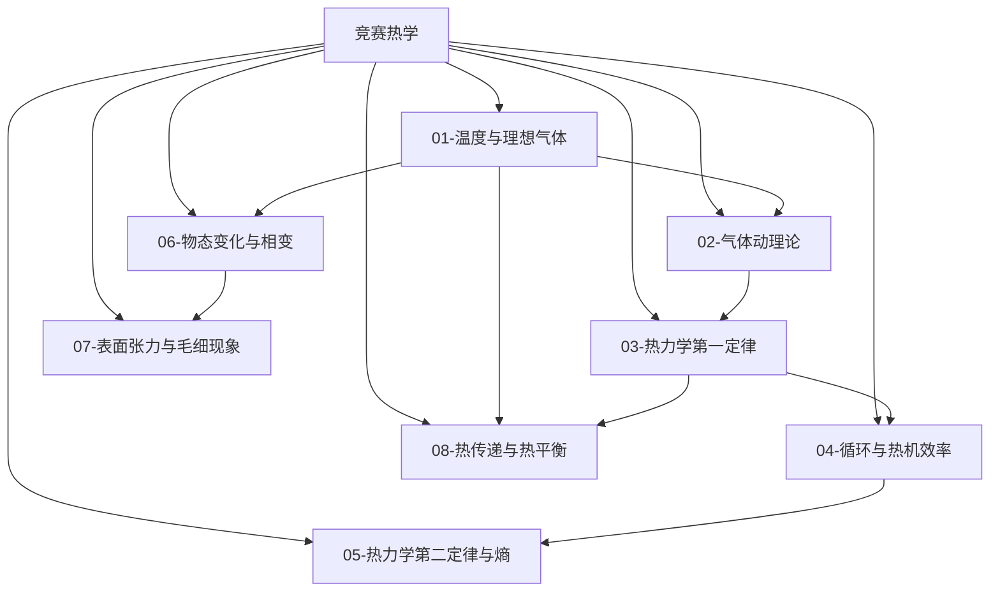

# 竞赛热学总览

> [!abstract] 概览
> 热学是物理竞赛（CPhO）中的独立版块，分值占比略低于力学但方法独特：它研究**大量微观粒子**的集体行为，因而天然依赖统计思想与微积分工具。竞赛热学在高中"三定律 + 理想气体状态方程"的基础上完成三次跃迁：**数学上**，用 $\int p\,dV$ 精确计算准静态过程的功、用微分方程处理绝热与传热过程、用 $\int \frac{\delta Q}{T}$ 计算熵变；**物理上**，建立分子动理论的微观模型（压强公式的推导、能量均分、速率分布），并引入热力学第二定律的严格表述（卡诺定理、熵增加原理）；**应用上**，覆盖热机循环效率、饱和蒸气压与相变、表面张力与毛细现象、热传导与辐射等竞赛高频模型。本模块共 9 篇笔记（含 MOC），全部建立在 [[01-预备知识]] 的数学工具与竞赛力学（[[02-牛顿运动定律与非惯性系]] 的动量定理、[[09-流体力学基础]] 的压强概念）之上，并与 [[00-热学总览|高中热学总览]] 衔接、为 [[热力学]]、[[统计物理]]、[[相变与流体]] 等大学内容铺垫。本文件（MOC）作为热学版块总入口。

## 热学知识脉络图

## 一、宏观状态与微观本质（基础版块）

| 笔记 | 简介 | 核心内容 |
| --- | --- | --- |
| [[01-温度与理想气体]] | 描述气体状态的宏观工具 | 温度与温标（摄氏/热力学）、热膨胀（线膨胀/体膨胀与密度）、理想气体模型与状态方程 $pV=nRT$、混合理想气体与道尔顿分压定律、气体图像与微积分处理 |
| [[02-气体动理论]] | 从微观分子运动解释宏观规律 | 理想气体微观模型与统计假设、压强公式 $p=\frac13 nm\overline{v^2}$ 的推导、温度的微观意义、方均根速率、内能与能量均分定理、麦克斯韦速率分布简介 |
| [[03-热力学第一定律]] | 能量守恒在热学中的形式 | 准静态过程的功 $W=\int p\,dV$、热量、内能 $U$、$Q=\Delta U+W$ 符号约定、四个等值过程与绝热方程 $pV^\gamma=\text{const}$、多方过程简介、$p$-$V$ 图像 |

## 二、热机与方向性（核心工具）

| 笔记 | 简介 | 核心内容 |
| --- | --- | --- |
| [[04-循环与热机效率]] | 把第一定律用于热机与制冷 | 循环过程与 $p$-$V$ 图、热机效率、卡诺循环完整推导、卡诺定理、制冷机与热泵的制冷系数、逆向循环、奥托/斯特林循环简介 |
| [[05-热力学第二定律与熵]] | 热现象的方向性与不可逆性 | 自发过程的方向、开尔文与克劳修斯表述及其等价性、热力学温标、熵的定义 $dS=\dfrac{\delta Q}{T}$、理想气体熵变计算、熵增加原理、克劳修斯不等式简介 |

## 三、物态与输运（专题版块）

| 笔记 | 简介 | 核心内容 |
| --- | --- | --- |
| [[06-物态变化与相变]] | 物质三种状态的转化规律 | 相变潜热（熔化/汽化/升华）、饱和蒸气压与温度的关系、沸点与外界压强、湿度与露点、克拉珀龙方程 $dP/dT=L/(T\Delta V)$ 简介、相图与临界点、动态平衡 |
| [[07-表面张力与毛细现象]] | 液体表面的特殊性质 | 表面张力与表面能、弯曲液面的附加压强（液滴 $\Delta p=\dfrac{2\sigma}{r}$、气泡 $\dfrac{4\sigma}{r}$）、接触角与浸润、毛细现象高度 $h=\dfrac{2\sigma\cos\theta}{\rho gr}$、竞赛典型题型 |
| [[08-热传递与热平衡]] | 热量的传导、对流与辐射 | 热传导与傅里叶定律、热阻的串并联、牛顿冷却定律、斯特藩-玻尔兹曼辐射定律、维恩位移定律定性、混合量热法与含微积分的温度变化问题 |

## 学习路径

> [!tip] 推荐路径
> **主线顺序**：01 → 02 → 03 → 04 → 05（宏观热学的完整逻辑链），06/07/08 三个专题可穿插或按考试重点排序。
>
> - **初赛重点**：01、03、06 是初赛热学的主力（状态方程计算、第一定律分析、物态变化），务必熟练；
> - **复赛分水岭**：02 气体动理论的推导、04 卡诺循环、05 熵变计算是复赛拉开差距的关键；
> - **方法串联**：先掌握 [[01-微积分基础]]（积分求功/求熵）再进入 03/05；[[09-流体力学基础]] 的压强与连通器知识是 01、06 的前置；02 的压强公式推导依赖 [[02-牛顿运动定律与非惯性系]] 的动量定理；
> - **对照学习**：与 [[00-热学总览|高中热学总览]] 逐节对照——高中公式是竞赛公式的特例（如玻意耳定律是 $pV=\text{const}$ 在等温条件下的退化）。

## 与其他知识关联

### 与预备知识衔接
- [[01-微积分基础]]：功 $W=\int p\,dV$、熵 $S=\int\frac{\delta Q}{T}$、热膨胀 $\Delta L=L\alpha\Delta T$ 的微分形式
- [[02-微分方程初步]]：绝热方程、牛顿冷却、渗漏与混合问题的微分方程求解
- [[06-量纲分析]]：输运系数、表面张力系数的量纲分析估计
- [[04-泰勒展开与级数]]：小温度变化下 $\rho(T)$、$V(T)$ 的线性近似

### 与竞赛力学衔接
- [[02-牛顿运动定律与非惯性系]]：气体分子与器壁碰撞的动量定理（压强公式的微观推导）
- [[09-流体力学基础]]：静压强的计算是气体状态方程与饱和蒸气压问题的基础
- [[05-动量与角动量]]：分子碰撞的能量传递与平均自由程的估算

### 与高中物理衔接
- [[00-热学总览|高中热学总览]] 的 01-04 子模块是竞赛热学的全部高中基础

### 与大学层面衔接
- [[热力学]]：本模块的四大定律是大学热力学的入门
- [[统计物理]]：麦克斯韦分布、能量均分定理的严格统计推导
- [[相变与流体]]：相图、临界现象与表面张力的深入
- [[熵与信息论]]：熵概念的推广与信息熵
- [[黑体辐射]]：辐射定律的量子起源

## 常用公式速查

### 状态方程与动理论
$$
pV=nRT,\qquad p=\frac13 nm\overline{v^2},\qquad \overline{v^2}^{\,1/2}=\sqrt{\frac{3RT}{M}},\qquad E_{\text{内}}=\frac{i}{2}nRT
$$

### 热力学第一定律与循环
$$
Q=\Delta U+W,\qquad dU=\frac{i}{2}nR\,dT,\qquad \eta=1-\frac{Q_2}{Q_1}\le 1-\frac{T_2}{T_1}
$$

$$
pV^\gamma=\text{const}\ (\text{绝热}),\qquad \gamma=\frac{C_p}{C_V}
$$

### 熵与相变
$$
dS=\frac{\delta Q}{T},\qquad \Delta S_{\text{孤立}}\ge 0,\qquad Q_{\text{潜热}}=mL
$$

### 表面张力与传热
$$
\Delta p=\frac{2\sigma}{r},\qquad h=\frac{2\sigma\cos\theta}{\rho gr},\qquad \Phi=\lambda A\frac{\Delta T}{d}
$$

---

> [!quote] 作者寄语
> 热学与力学最大的不同是**研究对象**：力学研究单个物体的确定性运动，热学研究大量粒子的统计规律。这意味着热学题往往"没有确定的细节，只有宏观的平均"——这正是它既难又美的原因。竞赛热学的核心训练是**符号与图像**：$p$-$V$ 图上一个循环的面积就是功，一条绝热线的陡峭程度由 $\gamma$ 决定，饱和蒸气压曲线上的每一点都对应一个沸点——学会"看图说话"，热学题就成功了一半。
>
> 建议把本模块当作**两大链条**来学：宏观链条（01 → 03 → 04 → 05）回答"系统如何变化、方向如何"，微观链条（02）回答"为什么会这样"。两条链条在"熵"处合拢——这正是统计物理将要做的事。刷题时若遇到过程分析，先画 $p$-$V$ 图再列方程；遇到方向判断，先想熵。
>
> 返回 [[00-物理竞赛总览]]。

---

*返回 [[00-物理竞赛总览]]*
