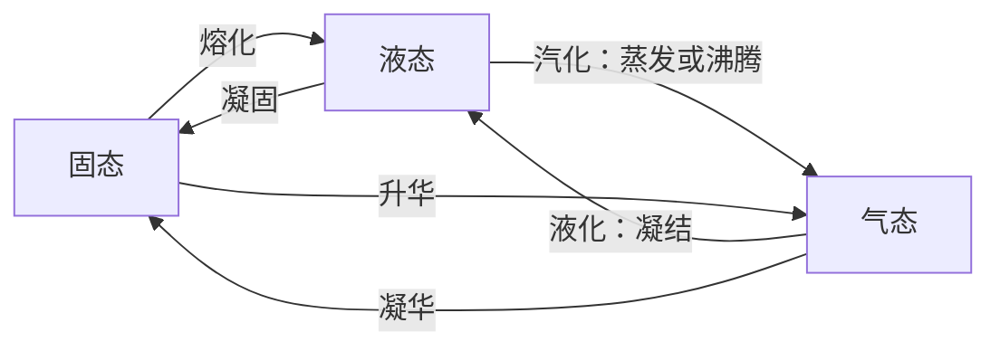

# 物态变化与相变（竞赛）

> [!abstract] 概览
> 高中热学对物态变化只要求定性知道"熔化吸热、汽化放热"，竞赛则提出三个定量要求：其一，用 ==饱和蒸气压== 定量描述蒸发与凝结的动态平衡，回答"给定温度下有多少水蒸气能在容器中稳定存在"；其二，用 ==克拉珀龙方程== $\dfrac{dP}{dT}=\dfrac{L}{T\Delta V}$ 把相变平衡曲线的斜率与潜热、体积变化联系起来，定量解释高压锅、真空沸腾、冰刀滑冰等压强—温度耦合现象；其三，用 ==相图== 与 ==三相点、临界点== 把握"什么条件下两相共存、什么条件下无法液化"。本笔记在高中 [[00-热学总览|高中热学总览]] 的物态变化基础上，将相变潜热 $Q=mL$ 与 [[03-热力学第一定律]] 的能量分析结合，用 [[01-温度与理想气体]] 的状态方程处理密闭容器中的汽化液化问题，借 [[01-微积分基础]] 完成克拉珀龙方程的卡诺循环推导，并为 [[07-表面张力与毛细现象]]、大学 [[相变与流体]] 与 [[统计物理]] 铺垫。

## 核心概念

### 一、相与相变

**相（phase）**：体系中物理性质完全均匀的部分。同一种物质可以有不同相，如冰（固态）、水（液态）、水蒸气（气态）；同一物质甚至可有多种固相（如碳的金刚石与石墨、冰的多种晶型）。==相变== 是物质从一相转变为另一相的过程，本质是分子（原子）间结合方式与排列方式的突变。

| 相变 | 名称 | 吸热/放热 | 能量去向 |
| --- | --- | --- | --- |
| 固 $\to$ 液 | 熔化（熔解） | 吸热 | 部分破坏晶格结构 |
| 液 $\to$ 固 | 凝固 | 放热 | 释放晶格结合能 |
| 液 $\to$ 气 | 汽化（蒸发/沸腾） | 吸热 | 克服分子间引力并对外做功 |
| 气 $\to$ 液 | 液化（凝结） | 放热 | 分子势能降低 |
| 固 $\to$ 气 | 升华 | 吸热 | 分子直接脱离晶格 |
| 气 $\to$ 固 | 凝华 | 放热 | 分子直接进入晶格 |

### 二、相变潜热

**相变潜热**：单位质量的物质在相变温度下由一相转变为另一相所吸收（或放出）的热量，记作 $L$，单位 J/kg。相变过程吸收的总热量为
$$
\boxed{\,Q=mL\,}
$$
与普通热传递不同，==相变过程中温度保持不变，吸收的热量却不为零==——这部分热量全部用于改变分子间势能以及对外做功，故==内能仍在变化==。这是"吸热升温"直觉最容易出错的地方。

水的三种潜热对比（1 atm）：

| 潜热 | 符号 | 数值 | 物理图像 |
| --- | --- | --- | --- |
| 熔化热 | $L_{\text{熔}}$ | $3.34\times10^5$ J/kg（334 kJ/kg） | 部分拆开晶格，体积变化小 |
| 汽化热 | $L_{\text{汽}}$ | $2.26\times10^6$ J/kg（2256 kJ/kg） | 彻底分离分子，体积膨胀约 1700 倍 |
| 升华热 | $L_{\text{升}}$ | $\approx2.83\times10^6$ J/kg（0°C 附近） | 约等于 $L_{\text{熔}}+L_{\text{汽}}$ |

> [!note] 为什么汽化热远大于熔化热
> 液体分子已紧挨着分子力作用范围，熔化只需"松动"晶格；汽化则要把分子彻底拉开到彼此几乎无相互作用，而且蒸气体积急剧膨胀还需克服外界压强做功 $p\Delta V$。对 1 mol 水在 100°C 汽化，$p\Delta V=RT\approx3.1$ kJ/mol，约占汽化热（约 40.6 kJ/mol）的 7%。升华热近似等于熔化热与汽化热之和，正是==能量守恒==的体现：固 $\to$ 气既可以"先熔后汽"，也可以直接升华，内能差相同。

**汽化的两种方式**：

| 蒸发 | 沸腾 |
| --- | --- |
| 任何温度下都能发生 | 仅在特定温度（沸点）发生 |
| 只在液体表面进行 | 液体内部与表面同时剧烈进行 |
| 缓慢、无气泡 | 快速、有大量气泡上浮 |
| 速率与温度、表面积、通风有关 | 取决于外界压强（$p_s=p_{\text{外}}$） |

**相变中的能量关系**：设单位质量相变时体积由 $V_1$ 变为 $V_2$（汽化时体积大增），由热力学第一定律（[[03-热力学第一定律]]）：
$$
mL=\Delta U+p(V_2-V_1)
$$
即==潜热 = 内能变化 + 体积功==。固—液相变体积变化小，常近似 $mL\approx\Delta U$；汽化必须计入体积功。

### 三、饱和蒸气压

密闭容器中盛液体，液面上方的蒸气分子密度逐渐增大，返回液面的凝结速率随之增大，最终达到==动态平衡==：单位时间逃出液面的分子数等于返回液面的分子数，宏观上"蒸发停止"。此时蒸气压强称为该温度下的==饱和蒸气压== $p_s$。

> [!note] 饱和蒸气压的两个关键性质
> 1. ==饱和蒸气压只与温度有关，与容器体积和空间内的液体量无关==；
> 2. 温度升高，分子平均动能增大、逃逸能力增强，动态平衡向蒸气侧移动，$p_s$ 增大。

水的饱和蒸气压 $p_s$ 随温度变化（关键数据）：

| $t$/°C | $p_s$/kPa | $t$/°C | $p_s$/kPa |
| --- | --- | --- | --- |
| 0 | 0.61 | 60 | 19.9 |
| 10 | 1.23 | 70 | 31.2 |
| 20 | 2.34 | 80 | 47.3 |
| 30 | 4.24 | 90 | 70.1 |
| 40 | 7.38 | 100 | 101.3 |
| 50 | 12.3 | 120 | 198.5 |

> [!tip] 粗略估算规则
> 在常温附近，==温度每升高约 10°C，水的饱和蒸气压近似翻倍==（20°C 的 2.34 kPa 到 30°C 的 4.24 kPa，接近一倍）。这条经验规则的严格理论形式，就是后文的克劳修斯-克拉佩龙方程。

**未饱和蒸气的等温压缩**：若容器内蒸气压强 $p<p_s(T)$，称==未饱和蒸气==，可近似看作理想气体。等温压缩分三个阶段：

1. **压缩阶段（未饱和）**：$pV=\text{const}$（质量不变、等温，即玻意耳定律）；
2. **压缩阶段（已达饱和）**：压强==保持 $p_s$ 不变==，继续压缩使部分蒸气液化为液体；
3. **压缩阶段（全部液化）**：继续压缩压强才重新急剧上升（液体近似不可压缩）。

在 $p$-$V$ 图上，等温压缩线呈"双曲线 $\to$ 水平液化平台 $\to$ 陡升"三段结构。与 [[01-温度与理想气体]] 中理想气体的区别在于：==理想气体怎么压缩都是双曲线，饱和蒸气的压强则被 $p_s$ "封顶"==。

### 四、沸点与外界压强

沸腾的微观条件：液体内部的气泡壁处的液体必须能向气泡内蒸发，气泡才能维持并上浮长大，这就要求 $p_s(T)=p_{\text{外}}$。于是沸点有了新的定义：

> [!note] 沸点的重新定义
> ==沸腾温度是使饱和蒸气压等于外界压强的那一温度==。沸点随外界压强增大而升高（高压锅原理），随外界压强减小而降低（真空沸腾、高原煮不熟饭）。

- **高压锅**：限压阀使锅内压强高于大气压，沸点升到 110~120°C，食物熟得快。限压阀平衡条件 $mg+p_0S=pS$；
- **真空沸腾**：抽气使外界压强降到 $p_s(\text{室温})$ 以下，室温的水即可沸腾；沸腾带走大量汽化热（2.26 MJ/kg），水温还会进一步下降；
- **高原**：青藏高原大气压约 0.6 atm，水的沸点约 85~90°C；
- **过热现象**：液体极纯净、缺少汽化核（气泡核心）时，可被加热到超过沸点而不沸腾，一旦受扰动便剧烈暴沸——实验室加热纯水要加沸石。

### 五、湿度与露点

空气中水蒸气的含量用两个量描述：

- **绝对湿度**：单位体积空气中水蒸气的质量；竞赛中更常用==水蒸气的分压== $p_{\text{水汽}}$ 表征；
- **相对湿度**：
$$
r=\frac{p_{\text{水汽}}}{p_s(T)}\times100\%
$$
即当前温度下实际水汽压占该温度饱和蒸气压的百分比。

**露点**：==等压降温使空气恰好达到饱和（相对湿度 100%）时的温度==。温度降到露点以下，多余的水汽便凝结为露珠。

> [!note] 露点测量的原理
> 露点湿度计：让光滑金属镜面缓慢降温，观察镜面开始出现雾状凝结（"出汗"）的瞬间，读出温度即露点 $t_{\text{露}}$。露点下水汽分压等于饱和蒸气压，查表得 $p_{\text{水汽}}=p_s(t_{\text{露}})$，代入当前温度 $t$ 得相对湿度 $r=\dfrac{p_s(t_{\text{露}})}{p_s(t)}\times100\%$。关键依据是：==等压降温过程中水汽分压不变，只有 $p_s$ 变小==。

**结露判断**：==气温降到露点以下必结露==。"气温与露点之差"称为==温度露点差==，差值越小空气越接近饱和——夏天闷热（温度露点差很小）晚上必然结露，就是这个道理。

### 六、相图、三相点与临界点

把各相变平衡曲线画在 $p$-$T$ 平面上，即得==相图==。水的相图由三条平衡曲线构成：

| 曲线 | 对应平衡 | 水的数据 |
| --- | --- | --- |
| 汽化曲线 | 液-气共存 | 从三相点延伸到临界点 |
| 熔化曲线 | 固-液共存 | 从三相点出发，斜率 $\dfrac{dP}{dT}<0$（水是反常的） |
| 升华曲线 | 固-气共存 | 从三相点出发向下延伸 |

- **三相点**：三条平衡曲线的交点，固液气三相互相共存。水的三相点为 $T=273.16$ K（0.01°C）、$p=611$ Pa（约 0.006 atm）。注意 ==三相点不是冰点==：冰点是 1 atm 下冰水共存温度 0°C，比三相点低 0.01 K；
- **临界点**：汽化曲线的终点。水的临界温度 $T_c=374$°C、临界压强 $p_c=22.1$ MPa。==温度高于临界温度时，无论加多大压强都不能使气体液化==——气液界限消失，物质处于超临界状态。原因：$p$-$V$ 图上的水平液化平台只存在于 $T<T_c$，温度越高平台越短，到临界温度缩为一点；
- **区域与线**：相图中每个面内只有一相稳定存在；线上两相共存（压强与温度一一对应）；三相点上三相共存；
- **升华的条件**：==外界压强低于三相点压强时，液态不能稳定存在，固体只能直接升华==。例如干冰（CO$_2$ 的三相点压强约 5.2 atm）在 1 atm 下直接升华；真空干燥就是低压升华除水。

## 推导与原理

### 一、为什么饱和蒸气压只与温度有关（动态平衡视角）

设单位时间逃离液面的分子数为 $N_{\text{逃}}$，它只取决于液体温度（温度越高逃逸能力越强）；单位时间返回液面的分子数 $N_{\text{回}}$ 正比于蒸气分子数密度，即正比于蒸气压 $p$。动态平衡要求 $N_{\text{逃}}=N_{\text{回}}$，故
$$
p_s=\frac{N_{\text{逃}}(T)}{k}\qquad\Rightarrow\qquad \boxed{\,p_s=p_s(T)\ \text{只与温度有关}\,}
$$
增大容器体积，蒸气密度瞬时减小、凝结减慢，蒸发暂时占优直到再次平衡——==平衡时蒸气压仍恢复为 $p_s$==（多蒸发的那部分取自液体，液量相应减少）；增加液量也不会提高平衡压强。注意："饱和蒸气压不变"不等于"饱和蒸气质量不变"：$p_s$ 固定时，体积增大则饱和蒸气质量 $m=\dfrac{p_sVM}{RT}$ 随之增大。

### 二、克拉珀龙方程

设两相在 $p$-$T$ 图上沿平衡曲线共存：温度由 $T$ 变为 $T+dT$ 时，平衡压强由 $p$ 变为 $p+dp$。取 1 mol 物质构造微卡诺循环：

1. 在 $(T,p)$ 等温等压相变 1$\to$2，吸热 $L$（==摩尔==潜热），体积变化 $\Delta V=V_2-V_1$；
2. 绝热降温 $dT$；
3. 在 $(T+dT,\,p+dp)$ 等温等压相变 2$\to$1，放热 $L+dL$；
4. 绝热升温回到起点。

这是工作在 $T$ 与 $T+dT$ 之间的可逆循环（$dT$ 无穷小），由卡诺效率 $\eta=\dfrac{dT}{T}$，循环净功为
$$
W=\eta Q_1=\frac{dT}{T}L
$$
另一方面，在 $p$-$V$ 图上该循环是两条等温线与两条绝热线围成的细长窄带，面积等于"高 $dp$、宽 $\Delta V$"：
$$
W=dp\,\Delta V
$$
两式联立即得克拉珀龙方程：
$$
\boxed{\,\frac{dP}{dT}=\frac{L}{T\,\Delta V}\,}
$$
其中 $L$ 为摩尔潜热（J/mol），$\Delta V=V_2-V_1$ 为相变前后摩尔体积差（带符号）。

**结论库**：

- **熔化**：冰的 $\Delta V=V_{\text{水}}-V_{\text{冰}}<0$（水结冰体积膨胀），$L>0$，故 $\dfrac{dP}{dT}<0$——==压强增大，冰的熔点降低==。定量：$\dfrac{dP}{dT}\approx-1.35\times10^7$ Pa/K，即压强每增加 1 atm，熔点降低约 $7.4\times10^{-3}$ K；
- **汽化**：$V_2\gg V_1$，$\Delta V>0$，沸点随压强升高——与第四节结论一致；
- **升华**：$\Delta V>0$，升华温度同样随压强升高而升高。

### 三、克劳修斯-克拉佩龙方程（饱和蒸气压的指数规律）

汽化时气相摩尔体积远大于液相（$\Delta V\approx V_g$），把蒸气近似为理想气体 $V_g=\dfrac{RT}{p}$（1 mol），代入克拉珀龙方程：
$$
\frac{dp}{dT}=\frac{L}{T}\cdot\frac{p}{RT}=\frac{Lp}{RT^2}
\;\Longrightarrow\;
\frac{d\ln p}{dT}=\frac{L}{RT^2}
$$
对 $T$ 积分（$L$ 近似视为常数）：
$$
\boxed{\,\ln p=-\frac{L}{RT}+\text{const}\;\Longleftrightarrow\; p=p_0\,e^{-L/RT}\,}
$$
**结论**：饱和蒸气压随温度按==指数规律==上升；$\ln p$ 对 $1/T$ 作图是一条斜率为 $-L/R$ 的直线。这从原理上解释了"每升高 10°C 蒸气压近似翻倍"的经验规则，也解释了 0°C 到 100°C 蒸气压暴增 166 倍（0.61 kPa $\to$ 101 kPa）而绝不是线性增长。

> [!tip] 竞赛使用要点
> 上式中 $L$ 必须是==摩尔汽化热==，$R=8.31$ J/(mol·K)。若题目给的是比潜热 $l$（J/kg），先换算 $L=lM$（$M$ 为摩尔质量）。该公式可用于"已知两个温度下的饱和蒸气压求汽化热"，是复赛常考的定量工具。

### 四、应用：冰刀滑冰与熔点随压强降低

熔化曲线 $\dfrac{dP}{dT}<0$ 意味着：冰刀与冰面接触面积极小，压强可达 $10^6\sim10^7$ Pa，接触处冰的熔点被压到 0°C 以下，冰就地熔化为水膜起润滑作用。以 $p=10^7$ Pa（约 100 atm）计，熔点下降 $\Delta T\approx0.0074\times100=0.74$ K——即零下 0.7°C 左右的冰面可完全归因于压强熔融；更低的温度主要靠摩擦生热融冰。竞赛中按"克拉珀龙方程 + 压强熔融"作答即可。

## 典型实例与物理应用

### 实例 1：高压锅的沸点

家用高压锅限压阀质量 $m=0.1$ kg，出气孔截面积 $S=8\times10^{-5}$ m²。由限压阀平衡：
$$
p=p_0+\frac{mg}{S}=1.013\times10^5+\frac{0.1\times9.8}{8\times10^{-5}}=1.136\times10^5\ \text{Pa}
$$
查 $p_s$ 表（100°C 为 101.3 kPa，110°C 为 143 kPa）内插得锅内沸点约 103°C。把锅内压强提到约 2 atm（200 kPa），沸点即可达 120°C——温度越高蒸煮越快，这就是高压锅缩短烹饪时间的原理。

### 实例 2：真空中的沸腾（低压低温沸腾）

用真空泵抽去盛有温水容器上方的空气，当上方总压强降到 $p_s(20°C)=2.34$ kPa 以下时，20°C 的水即剧烈沸腾。沸腾带走巨大的汽化热（2.26 MJ/kg），水温迅速降到与更低压强对应的沸点——这就是==减压蒸发制冷==的原理（医学低温喷雾、实验室旋转蒸发仪皆然）。

### 实例 3：高原煮饭

拉萨大气压约 0.65 atm，此时水的沸点约 88°C——温度达不到 100°C，饭不易煮熟，解决办法是高压锅。此类题型的本质是解 $p_s(T)=p_{\text{外}}$。

### 实例 4：露点湿度计测相对湿度

某日气温 $t=20°C$，露点湿度计测得镜面在 12°C 起雾。查表 $p_s(12°C)\approx1.40$ kPa，故 $p_{\text{水汽}}=1.40$ kPa，相对湿度
$$
r=\frac{p_{\text{水汽}}}{p_s(20°C)}=\frac{1.40}{2.34}\approx60\%
$$
若夜间气温降至 8°C（低于露点 12°C），则必然结露——这正是"昼夜温差大、夜间露水重"的定量解释。

### 实例 5：蒸发冷却

敞口杯中 30°C 的水不断蒸发，蒸发吸热使水温下降，直到蒸发带走的热量与周围环境传入的热量平衡，水温维持在略低于环境温度。人体出汗、湿毛巾降温、夏天洒水降温都是同一原理。==蒸发在任何温度都发生，速率随温度升高与通风加大而增加==。

### 实例 6：密闭容器中的水与饱和蒸气（核心题型）

容积 $V$ 的密闭真空容器中装有质量 $m$ 的水，温度 $T$。解题三步：

1. 假设全部汽化，由理想气体状态方程（[[01-温度与理想气体]]）算压强 $p=\dfrac{m}{M}\dfrac{RT}{V}$；
2. 与 $p_s(T)$ 比较：
   - $p<p_s$：全部汽化且未饱和，实际压强就是 $p$；
   - $p=p_s$：恰好全部汽化，恰为饱和（临界情形）；
   - $p>p_s$：不可能，必部分液化，实际压强==等于 $p_s$==；
3. 部分液化时剩余液体质量
$$
m_{\text{液}}=m-\frac{p_sVM}{RT}
$$

注意：==容器内一旦有液体存在，气相压强就被"钉"在 $p_s(T)$==，这是饱和蒸气对压强的硬约束。

## 例题

### 例 1：相对湿度与露点、结露判断

**题目**：某房间气温 25°C，相对湿度 60%。已知 $p_s(25°C)=3.17$ kPa，$p_s(18°C)=2.06$ kPa，$p_s(17°C)=1.94$ kPa，$p_s(16°C)=1.82$ kPa，$p_s(15°C)=1.71$ kPa。（1）求露点；（2）若夜间房间降温至 15°C，是否结露？

**分析**：露点是使水汽分压恰好等于饱和蒸气压的温度。先算 $p_{\text{水汽}}=r\cdot p_s(T)$，再在表中找满足 $p_s(t_{\text{露}})=p_{\text{水汽}}$ 的温度；降温是否结露，看 15°C 时的 $p_s$ 是否小于当前水汽分压。

**解答**：
$$
p_{\text{水汽}}=0.60\times3.17=1.90\ \text{kPa}
$$
查表：$p_s(17°C)=1.94$ kPa、$p_s(16°C)=1.82$ kPa，内插得
$$
t_{\text{露}}\approx16.8°C
$$
降温到 15°C 时 $p_s(15°C)=1.71$ kPa $<1.90$ kPa，水汽分压超过饱和值，多余水汽凝结——==必然结露==，器物表面先"出汗"。

**点评**：结露的判据是"气温与露点的关系"而非"湿度大小"：25°C、相对湿度 60% 不算特别潮湿，但夜间降温约 8°C 就会结露。竞赛常把露点题与冰箱外壁凝水、车窗起雾等情境结合。

### 例 2：密闭容器中水蒸气的液化

**题目**：容积 $V=3.0$ L 的真空密闭容器中放入 $m=1.5$ g 的水，加热到 100°C。（1）求容器内蒸气压强；（2）再向容器注入 1.0 g 水，求最终压强与容器内液态水的质量。已知 $M_{\text{水}}=18$ g/mol，$R=8.31$ J/(mol·K)，$p_s(100°C)=101$ kPa。

**分析**：先做"全部汽化"假设，用状态方程算压强并与 $p_s$ 比较。$p<p_s$ 则未饱和全汽化；$p>p_s$ 则部分液化、压强钉在 $p_s$。

**解答**：（1）全部汽化时
$$
p=\frac{m}{M}\frac{RT}{V}=\frac{1.5}{18}\times\frac{8.31\times373}{3.0\times10^{-3}}\approx86\ \text{kPa}<101\ \text{kPa}
$$
故 1.5 g 水全部汽化，容器内为未饱和蒸气，$p_1\approx86$ kPa。

（2）注入后共 2.5 g，若全部汽化则
$$
p=\frac{2.5}{18}\times\frac{8.31\times373}{3.0\times10^{-3}}\approx143\ \text{kPa}>p_s
$$
不可能，故部分液化，压强 $p_2=p_s=101$ kPa，气相中水汽质量
$$
m_{\text{汽}}=\frac{p_sVM}{RT}=\frac{101\times10^3\times3.0\times10^{-3}\times0.018}{8.31\times373}\approx1.76\ \text{g}
$$
剩余液体 $m_{\text{液}}=2.5-1.76=0.74$ g。

**点评**：本题完整演示"全汽化假设 $\to$ 与 $p_s$ 比较 $\to$ 修正"三步流程。易错在：不要认为"水多就一定有液体"，==必须用状态方程验证压强是否超过 $p_s$==；也不要认为压强随加水升高——只要存在液体，气相压强就是 $p_s$。若继续升温，$p_s$ 增大、气相水汽质量增多、剩余液体减少，直到完全汽化——"饱和蒸气压只与温度有关"在此体现得淋漓尽致。

### 例 3：冰水混合热平衡（附三相点背景）

**题目**：绝热容器中混合 $m_1=100$ g、0°C 的冰与 $m_2=200$ g、50°C 的热水（1 atm 下），求末态温度与组成。已知 $L_{\text{熔}}=3.34\times10^5$ J/kg，$c_{\text{水}}=4.2\times10^3$ J/(kg·K)。

**分析**：冰水共存正是相图熔化曲线上的一点；1 atm 下共存温度被钉在 0°C（对应熔点）。混合后先判断冰能否全部熔化：比较"冰全熔所需热"与"热水降到 0°C 放出的热"。前者小则冰全熔后剩余热量再加热全体；否则末态为 0°C 冰水混合物。

**解答**：冰全熔吸热
$$
Q_1=m_1L_{\text{熔}}=0.1\times3.34\times10^5=3.34\times10^4\ \text{J}
$$
热水降到 0°C 放热
$$
Q_2=m_2c_{\text{水}}\Delta T=0.2\times4.2\times10^3\times50=4.2\times10^4\ \text{J}
$$
$Q_2>Q_1$，冰全部熔化，剩余热量 $Q_3=Q_2-Q_1=8.6\times10^3$ J 使 $m_1+m_2=0.3$ kg 的水升温：
$$
t=\frac{Q_3}{(m_1+m_2)c_{\text{水}}}=\frac{8.6\times10^3}{0.3\times4.2\times10^3}\approx6.8°C
$$
末态：全部为水，温度约 6.8°C。

**点评**：混合热平衡的要点是==分阶段判相==：先判定相变是否发生、是否完全，再进入单一相态的升温计算，切不可把潜热项与 $cm\Delta T$ 项混在一次式子里。若冰改为 300 g（$Q_1=1.0\times10^5$ J $>Q_2$），则冰不能全熔，末态为 0°C 的冰水混合物——温度被"钉"在 0°C、吸收的热量全部化为熔化潜热，这与饱和蒸气把压强"钉"在 $p_s$ 是同一类==动态平衡（多相共存）==思想。三相点（273.16 K、611 Pa）则把这一思想推广到压强轴：冰水共存温度由压强唯一决定，1 atm 下是 0°C，增压则熔点降低（例：冰刀）。

## 易错提醒

> [!warning] 易错点
> 1. **相变吸热不等于温度升高**：相变中 $Q=mL$ 全部转化为分子势能与体积功，温度不变但内能变化；相变阶段的热量不能用 $Q=cm\Delta T$ 计算。
> 2. **饱和蒸气压与体积、液量无关**：密闭容器中液体多或少、空间大或小，都不影响 $p_s$；但影响==饱和蒸气的质量== $m=\dfrac{p_sVM}{RT}$——体积大则饱和蒸气多、剩余液体少。
> 3. **$pV=\text{const}$ 仅适用于未饱和等温压缩**：一旦达到饱和再压缩，压强不变、部分液化，玻意耳定律失效。
> 4. **沸腾不等于蒸发**：沸腾必须满足 $p_s(T)=p_{\text{外}}$，在液体内部形成气泡；蒸发任何温度都能发生。真空中的沸腾是"低压低温沸腾"，不是温度更高。
> 5. **相对湿度随温度变化**：水汽分压不变时，降温使 $p_s$ 减小、$r$ 增大——"湿度变大"可能只是降温的结果，判断结露必须用露点。
> 6. **密闭容器判断液化必须先算全汽化压强**：把状态方程算出的压强与 $p_s$ 比较，而不是凭感觉；有液体存在时气相压强==恒等于== $p_s$。
> 7. **克拉珀龙方程中各量的含义**：$L$ 是摩尔潜热、$\Delta V$ 是摩尔体积差，用比潜热时先乘摩尔质量；$\Delta V=V_2-V_1$ 带符号——冰的 $\Delta V<0$ 导致 $\dfrac{dP}{dT}<0$，熔点随压强降低，方向别写反。
> 8. **三相点不等于冰点**：三相点 273.16 K、611 Pa，是三条平衡曲线的交点；冰点是 1 atm 下的冰水共存点 273.15 K，两者相差 0.01 K。
> 9. **临界温度以上无法液化**：$T>T_c$ 时等温压缩没有液化平台，无论压强多大都只是压缩气体（超临界流体）。
> 10. **混合热平衡要分段**：先判相变是否发生、是否完全（比较潜热项与升温项），再列 $Q_{\text{吸}}=Q_{\text{放}}$，潜热项与 $cm\Delta T$ 项不可混为一谈。

> [!note] 概念辨析
> **蒸发 vs 沸腾**
>
> | 比较项 | 蒸发 | 沸腾 |
> | --- | --- | --- |
> | 温度条件 | 任何温度 | 须达沸点（$p_s=p_{\text{外}}$） |
> | 发生部位 | 液面 | 液体内部与表面 |
> | 剧烈程度 | 缓慢 | 剧烈（大量气泡） |
> | 沸点随压强 | — | 随 $p_{\text{外}}$ 升高而升高 |
>
> **绝对湿度 vs 相对湿度**
>
> | 比较项 | 绝对湿度 | 相对湿度 |
> | --- | --- | --- |
> | 定义 | 水汽分压 $p_{\text{水汽}}$ | $r=\dfrac{p_{\text{水汽}}}{p_s(T)}\times100\%$ |
> | 水汽量一定时随温度 | 不变 | 降温增大 |
> | 人的感受 | 不直接 | 直接（闷热 = 高 $r$） |
>
> **未饱和蒸气 vs 饱和蒸气**
>
> | 比较项 | 未饱和蒸气 | 饱和蒸气 |
> | --- | --- | --- |
> | 压强 | $p<p_s(T)$ | $p=p_s(T)$ |
> | 状态方程 | $pV=\dfrac{m}{M}RT$ 成立 | 不适用（有液相共存） |
> | 等温压缩 | $pV=\text{const}$ | 压强不变，部分液化 |
>
> **三相点 vs 冰点**
>
> | 比较项 | 三相点 | 冰点 |
> | --- | --- | --- |
> | 压强 | 611 Pa | 1 atm |
> | 温度 | 273.16 K（0.01°C） | 273.15 K（0°C） |
> | 意义 | 三相共存、自由度为零 | 1 atm 下固液平衡 |

## 与其他知识关联

- 与 [[01-温度与理想气体]] 的关系：密闭容器"全汽化压强"用状态方程 $pV=\dfrac{m}{M}RT$ 计算，是与 $p_s$ 比较的基准；水汽分压与道尔顿分压定律结合可处理"容器内有空气又有水"的问题。
- 与 [[02-气体动理论]] 的关系：饱和蒸气压的微观本质是分子逃逸与返回的动态平衡，与分子速率分布（麦克斯韦分布）直接相关。
- 与 [[03-热力学第一定律]] 的关系：相变中 $mL=\Delta U+p(V_2-V_1)$ 正是 $Q=\Delta U+W$ 的直接应用，汽化体积功 $p\Delta V$ 不可忽略。
- 与 [[05-热力学第二定律与熵]] 的关系：相变潜热对应熵变 $\Delta S=\dfrac{mL}{T}$（等温可逆相变），如冰熔化熵增 $\dfrac{3.34\times10^5}{273}\approx1.22\times10^3$ J/(kg·K)；动态平衡的方向性可归结为熵增原理。
- 与 [[01-微积分基础]] 的关系：克拉珀龙方程 $dP/dT$ 是平衡曲线的微分斜率，克劳修斯-克拉佩龙方程的积分依赖微积分工具。
- 与 [[02-微分方程初步]] 的关系：$\dfrac{d\ln p}{dT}=\dfrac{L}{RT^2}$ 是可分离变量的微分方程，分离积分即得指数规律。
- 与 [[09-流体力学基础]] 的关系：高压锅限压阀、真空沸腾、高原气压都依赖外界压强与大气压概念。
- 与高中物理联系：[[00-热学总览|高中热学总览]] 的物态变化模块是本节的全部高中基础（熔化热、汽化热、蒸发的定性认识）。
- 与大学层面联系：[[热力学]]（化学势与相平衡的严格理论）、[[相变与流体]]（临界现象、相图深入）、[[统计物理]]（两相共存的统计描述）。
- 返回 [[00-竞赛热学总览]]

## 作者的话

> [!quote] 个人理解
> 物态变化这一章最大的特点是：==一个"饱和蒸气压"概念把几乎所有现象串了起来==——沸腾是 $p_s$ 追上外界压强的时刻，露点是 $p_s$ 追上水汽分压的时刻，密闭容器的液化是 $p_s$"封顶"的结果，高压锅、真空沸腾、滑冰则全是压强—温度耦合的表演。做相变题永远先问三个问题：==体系里有没有液体？压强压不压得过 $p_s$？相变有没有发生完全？==
>
> 克拉珀龙方程 $\dfrac{dP}{dT}=\dfrac{L}{T\Delta V}$ 是本章唯一依赖微积分的公式，但它并不神秘——它就是"相变这一可逆过程也可以当作卡诺热机"的结果。用微循环一画，方程自己就跳出来了。至于 $\Delta V$ 的符号，记住水是反常的：别人的熔点随压强升高，水偏偏降低，所以冰刀才能滑行。
>
> 做题时我最看重==分阶段==思维：混合热平衡先判相变、再谈升温；密闭容器先算全汽化、再定液化量。把每个阶段拆开，相变题就没有含糊的余地。这块内容是初赛热学的高性价比考点——公式少、套路固定，值得一次性练透，再进入 [[07-表面张力与毛细现象]] 的液相专题。

---

*返回 [[00-竞赛热学总览]]*
