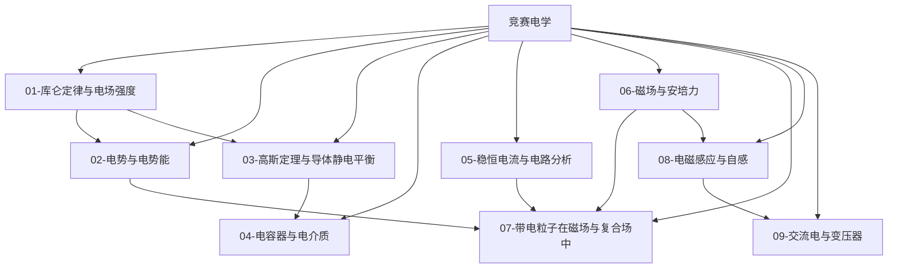

# 竞赛电学总览

> [!abstract] 概览
> 电学（电磁学）是物理竞赛（CPhO）中**分值占比最高、区分度最大**的版块：初赛与复赛中电学题约占四分之一到三分之一，且压轴题（带电粒子在复合场中的运动、电磁感应的综合计算、复杂电路）几乎全部出自电学。竞赛电学在高中"库仑定律→恒定电流→磁场→电磁感应→交流电"主线的基础上大幅深化：**数学上**，用场强的积分计算（$\vec E=\int\dfrac{k\,dq}{r^2}\hat r$）、高斯定理、电势梯度、微分方程（RL 暂态、含容导轨）取代高中"套公式"；**物理上**，建立场的观点（场强与电势、高斯定理、涡旋电场）、守恒与能量的综合视角（电场力做功、安培力做功与焦耳热）；**方法上**，掌握等效电阻（对称性/无穷网络/星三角）、基尔霍夫定律、带电粒子轨迹的几何解法、动生与感生电动势的区分等竞赛专属工具。本模块共 10 篇笔记（含 MOC），前置为 [[01-预备知识]]（[[01-微积分基础]]、[[03-矢量运算]] 是硬前提）与竞赛力学（[[04-功与机械能]]、[[05-动量与角动量]]、[[06-刚体动力学]] 的转动切割），并与 [[00-电学总览|高中电学总览]] 衔接、为 [[电磁学]]、[[电动力学]]、[[电路分析]] 等大学内容铺垫。本文件（MOC）作为电学版块总入口。

## 电学知识脉络图

## 一、静电场（基础版块）

| 笔记 | 简介 | 核心内容 |
| --- | --- | --- |
| [[01-库仑定律与电场强度]] | 静电力的定量描述与场的观点 | 电荷守恒、库仑定律与叠加、电场强度定义、点电荷场强、连续分布的积分求场（细杆/圆环/圆盘）、电场线、电偶极子、带电粒子在匀强电场中的运动 |
| [[02-电势与电势能]] | 场的能量描述与功能关系 | 电势能与电势、电势的积分计算、等势面、匀强电场 $U=Ed$、电势梯度 $E=-\dfrac{dV}{dr}$、电场力做功与功能关系、粒子加速与偏转（示波管） |
| [[03-高斯定理与导体静电平衡]] | 竞赛核心工具：对称场强与导体 | 电通量与高斯定理、均匀带电球/无限长线/无限大平面的场强、与引力壳层定理的类比、导体静电平衡（内部场强为零/电荷分布/等势体）、尖端放电与静电屏蔽 |
| [[04-电容器与电介质]] | 储存电能的元件及其竞赛题型 | 电容定义、平行板电容推导、球形与柱形电容器、串并联、储能 $\frac12 CV^2$、充放电的能量损失、电介质极化与介电常数、带电粒子与电容器综合 |

## 二、电路与磁场（核心工具）

| 笔记 | 简介 | 核心内容 |
| --- | --- | --- |
| [[05-稳恒电流与电路分析]] | 从欧姆定律到复杂电路 | 电流与电阻定律、闭合电路欧姆定律、电源功率与最大输出、**基尔霍夫定律**、惠斯通电桥、等效电阻（对称折叠/无穷网络/星三角变换）、电表改装与欧姆表、非理想电表 |
| [[06-磁场与安培力]] | 磁场的描述与对电流的作用 | 磁感应强度、常见电流磁场（直导线/圆环/螺线管）、安培力、磁力矩与电动机、磁通量、霍尔效应、安培环路定理简介 |
| [[07-带电粒子在磁场与复合场中]] | **复赛压轴核心**：轨迹与临界 | 洛伦兹力与圆周运动、圆心与半径的几何求法、有界磁场的临界极值、质谱仪与回旋加速器、速度选择器、复合场（$E$+$B$+$g$）中的直线/圆周/螺旋运动、多解问题 |

## 三、电磁感应与交流电（综合版块）

| 笔记 | 简介 | 核心内容 |
| --- | --- | --- |
| [[08-电磁感应与自感]] | 变化的磁场产生电场 | 法拉第定律、楞次定律与右手定则、动生电动势（平动 $E=BLv$、转动切割 $\frac12 BL^2\omega$）、感生电动势与涡旋电场、自感与 $L$、电磁感应中的能量转化、含电阻/电容/电感的导轨问题、双杆问题 |
| [[09-交流电与变压器]] | 正弦交流与电能输送 | 正弦交流电的产生与描述、峰值/有效值/平均值、纯 R/L/C 电路的阻抗简介、理想变压器、远距离输电、LC 振荡与电磁波简介 |

## 学习路径

> [!tip] 推荐路径
> **主线顺序**：01 → 02 → 03 → 04（静电场完整链条）→ 05 → 06 → 07（电路与磁场，07 是综合应用）→ 08 → 09。
>
> - **初赛必杀**：01、02、05、08 是初赛电学主力（场强电势计算、电路等效、法拉第定律），务必滚瓜烂熟；
> - **复赛分水岭**：03 高斯定理、05 基尔霍夫与等效电路、07 复合场临界问题、08 导轨综合是复赛拉开差距的核心，本模块为其投入最多篇幅；
> - **方法串联**：07 的圆周运动依赖 [[05-动量与角动量]] 与 [[04-功与机械能]]；08 的能量分析是力学能量守恒的延伸；09 的交流电需要 [[05-复数与欧拉公式]]（相量法可加速理解）；03 的高斯定理与 [[壳层定理]] 数学同构；
> - **对照学习**：与 [[00-电学总览|高中电学总览]] 逐节对照——高中"匀强电场套公式"的问题在竞赛中升级为"积分求场强 + 高斯定理"。

## 与其他知识关联

### 与预备知识衔接
- [[01-微积分基础]]：场强的积分计算、电势积分、能量积分，是本模块第一大数学依赖
- [[03-矢量运算]]：$\vec E$、$\vec B$、$\vec F=q\vec v\times\vec B$ 的叉积与矢量微积分
- [[02-微分方程初步]]：RL 暂态、含容导轨、LC 振荡的微分方程求解
- [[05-复数与欧拉公式]]：交流电路的相量法（进阶可选）
- [[06-量纲分析]]：电磁量纲的快速校验

### 与竞赛力学衔接
- [[04-功与机械能]]：电场力做功与电势能、粒子加速的能量法
- [[05-动量与角动量]]：洛伦兹力下的圆周运动、带电粒子偏转的动量分析
- [[06-刚体动力学]]：转动切割的动生电动势 $\frac12 BL^2\omega$
- [[09-流体力学基础]]：霍尔效应的载流子漂移模型、磁流体发电

### 与高中物理衔接
- [[00-电学总览|高中电学总览]] 的 01-06 子模块是竞赛电学的全部高中基础

### 与大学层面衔接
- [[电磁学]]：麦克斯韦方程组的定性入口（涡旋电场、位移电流）
- [[电动力学]]：高斯定理与场的完整数学表述
- [[电路分析]]：基尔霍夫定律与网络定理的系统化
- [[光学]]：电磁波谱与光的电磁本性（承接 09 的 LC 振荡）

## 常用公式速查

### 静电场
$$
\vec F=k\frac{q_1q_2}{r^2}\hat r,\qquad \vec E=\frac{\vec F}{q},\qquad E=k\frac{Q}{r^2},\qquad \oint\vec E\cdot d\vec A=\frac{Q_{\text{内}}}{\varepsilon_0}
$$

$$
U=-\int_a^b \vec E\cdot d\vec l,\qquad E=-\frac{dV}{dr}\ (\text{一维}),\qquad C=\frac{Q}{U},\qquad W=\frac12 CU^2=\frac{Q^2}{2C}
$$

### 电路与磁场
$$
I=\frac{\varepsilon}{R+r},\qquad \varepsilon=\sum IR\ (\text{回路}),\qquad B=\frac{\mu_0 I}{2\pi r},\qquad B=\mu_0 nI
$$

$$
F=BIL\sin\theta,\qquad M=NBIS\sin\theta,\qquad f=qvB,\qquad r=\frac{mv}{qB},\qquad T=\frac{2\pi m}{qB}
$$

### 电磁感应与交流电
$$
E=n\frac{\Delta\Phi}{\Delta t},\qquad E=BLv,\qquad E=\frac12 BL^2\omega,\qquad E=-L\frac{di}{dt}
$$

$$
U_{\text{有效}}=\frac{U_m}{\sqrt2},\qquad \frac{U_1}{U_2}=\frac{n_1}{n_2},\qquad \omega=\frac{1}{\sqrt{LC}}
$$

---

> [!quote] 作者寄语
> 电学是竞赛物理中"最像物理"的版块：它既有清晰的对称美（高斯定理、场的叠加），又有复杂的综合计算（复合场、电磁感应）。与力学、热学相比，电学有两条独特主线：**场的观点**——场强与电势从"力的语言"和"能量的语言"两套体系描述同一个场，学会在两者间自由切换（$E=-\dfrac{dV}{dr}$ 就是桥梁）是电学入门的关键；**回路与守恒**——基尔霍夫定律、法拉第定律、能量守恒三把钥匙配合使用，再复杂的感应题也能拆解。
>
> 建议刷题策略：静电场部分（01-04）以"积分 + 对称性"为训练重点；电路部分（05）训练"等效变换"的手感（对称、无穷、星三角）；磁场与复合场（06-07）重点练习**几何作图**——带电粒子的轨迹题三分靠物理、七分靠几何，先画圆再算数；电磁感应（08-09）则训练"能量视角"：问速度先想动能，问热量先想能量守恒，问时间先想动量定理。
>
> 返回 [[00-物理竞赛总览]]。

---

*返回 [[00-物理竞赛总览]]*
