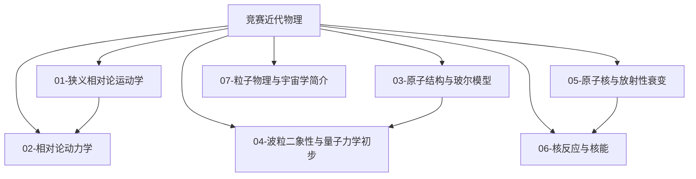

# 竞赛近代物理总览

> [!abstract] 概览
> 近代物理是物理竞赛（CPhO）的**收尾版块**，也是从经典物理通向现代物理的门户：它回答经典力学无法回答的问题——光速为何不变（狭义相对论）、原子为何稳定且发光分立（玻尔模型）、核能从哪来（质能方程与核反应）。竞赛中近代物理的考察分为三层：**初赛/复赛核心**——玻尔模型与氢原子能级计算、放射性衰变与半衰期、质量亏损与核能；**决赛/奥赛进阶**——狭义相对论的运动学与动力学（洛伦兹变换、时间膨胀、长度收缩、质能关系）；**了解级**——波粒二象性与不确定关系、粒子物理与宇宙学简介。本模块共 8 篇笔记（含 MOC），以竞赛光学 [[07-光电效应与光的量子性]]（量子思想的起点）为直接前置，衔接竞赛热学 [[08-热传递与热平衡]]（黑体辐射）与竞赛力学 [[07-万有引力与天体运动]]（恒星核聚变与宇宙），并为大学 [[相对论]]、[[量子力学]]、[[原子物理]] 等版块铺垫。本文件（MOC）作为近代物理版块总入口。

## 近代物理知识脉络图

## 一、相对论（决赛/奥赛核心）

| 笔记 | 简介 | 核心内容 |
| --- | --- | --- |
| [[01-狭义相对论运动学]] | 光速不变下的时空观革命 | 两个基本假设、洛伦兹变换、同时性的相对性、时间膨胀 $t=\gamma t_0$、长度收缩 $l=l_0/\gamma$、相对论速度合成、孪生子佯谬、闵可夫斯基时空简介 |
| [[02-相对论动力学]] | 相对论下的动量、能量与质能关系 | 相对论动量 $p=\gamma m_0v$、质能方程 $E=mc^2=\gamma m_0c^2$、能量-动量关系 $E^2=p^2c^2+m_0^2c^4$、静能与动能 $E_k=(\gamma-1)m_0c^2$、低速近似、光子能量动量（衔接光学） |

## 二、原子与量子（初赛/复赛核心）

| 笔记 | 简介 | 核心内容 |
| --- | --- | --- |
| [[03-原子结构与玻尔模型]] | 原子稳定性与氢原子能级的量子解释 | 原子模型发展（汤姆孙/卢瑟福散射）、玻尔三假设、氢原子能级 $E_n=-\dfrac{13.6}{n^2}$ eV、能级跃迁与光谱线系（莱曼/巴耳末/帕邢）、电离能、玻尔模型的成功与局限 |
| [[04-波粒二象性与量子力学初步]] | 物质波与不确定关系 | 德布罗意波 $\lambda=h/p$、电子衍射实验、不确定关系 $\Delta x\Delta p\ge\hbar/2$、波函数与概率诠释简介、对应原理、量子力学基本框架的建立（衔接大学量子力学） |

## 三、原子核（初赛/复赛核心）

| 笔记 | 简介 | 核心内容 |
| --- | --- | --- |
| [[05-原子核与放射性衰变]] | 核的结构与衰变规律 | 原子核组成（质子/中子/同位素）、三种衰变（α/β/γ）及其方程与性质、衰变规律 $N=N_0e^{-\lambda t}$ 与半衰期、衰变链、放射性的应用与防护 |
| [[06-核反应与核能]] | 质量亏损与核能的释放 | 质量亏损与结合能、平均结合能曲线、爱因斯坦质能方程 $\Delta E=\Delta mc^2$、核裂变与链式反应、核聚变、核电站原理、恒星的能量来源（衔接天体） |

## 四、了解级（决赛拓展）

| 笔记 | 简介 | 核心内容 |
| --- | --- | --- |
| [[07-粒子物理与宇宙学简介]] | 物质的最基本构成与宇宙演化 | 基本粒子分类（轻子/夸克/规范玻色子）、四种基本相互作用、标准模型定性、反物质、宇宙膨胀与哈勃定律、大爆炸宇宙学、暗物质与暗能量定性 |

## 学习路径

> [!tip] 推荐路径
> **主线顺序**：03 → 04 → 05 → 06（原子→量子→核，初赛复赛主力）→ 01 → 02（相对论，决赛进阶）→ 07（了解级，随时可读）。
>
> - **初赛必杀**：03 的能级跃迁计算、05 的半衰期计算、06 的质量亏损计算是初赛近代物理的全部主力题型，务必熟练；
> - **复赛分水岭**：03 的跃迁与光谱细节、05 的衰变链与复合计算、06 的结合能曲线应用；复赛偶尔涉及相对论速度合成与质能关系；
> - **决赛/奥赛进阶**：01、02 的洛伦兹变换与相对论动力学是决赛与 IPHO 的高频；
> - **方法串联**：相对论的低速近似依赖 [[04-泰勒展开与级数]]（$\gamma\approx1+\frac12\beta^2$）；衰变方程是 [[02-微分方程初步]] 的一阶线性方程；玻尔模型的圆轨道向心力来自竞赛力学 [[06-刚体动力学]] 的角动量量子化思想与 [[07-万有引力与天体运动]] 的类比（库仑力↔引力）；
> - **概念衔接**：量子思想从竞赛光学 [[07-光电效应与光的量子性]] 起步，经本模块 03/04 深化；黑体辐射（竞赛热学 [[08-热传递与热平衡]]）是量子化假设的另一入口。

## 与其他知识关联

### 与预备知识衔接
- [[01-微积分基础]]：能级跃迁的能量计算、衰变的积分表述
- [[02-微分方程初步]]：$\dfrac{dN}{dt}=-\lambda N$ 的求解即半衰期公式
- [[04-泰勒展开与级数]]：相对论因子的低速展开、黑体辐射与普朗克公式的近似
- [[07-近似与估算方法]]：核能数量级的估算（费米问题式）

### 与竞赛光学衔接
- [[07-光电效应与光的量子性]]：光子与波粒二象性的起点，本模块 04 的直接前置
- [[09-光谱与色散]]：巴耳末公式与氢原子光谱，本模块 03 的观测基础
- [[10-光的吸收散射与激光]]：受激辐射与能级布居（粒子数反转）

### 与竞赛力学/热学衔接
- [[07-万有引力与天体运动]]：恒星核聚变与宇宙学、双星与引力（广义相对论的观测基础）
- [[08-机械振动]]：量子化与驻波思想的类比（氢原子中的电子驻波）
- [[08-热传递与热平衡]]：黑体辐射与普朗克量子假设（量子力学起源之一）

### 与大学层面衔接
- [[相对论]]、[[钟慢尺缩与质增]]、[[闵氏几何]]：狭义相对论的严格化
- [[量子力学]]、[[原子物理]]、[[波函数与薛定谔方程]]、[[量子力学基本假设]]：玻尔模型之后的量子力学
- [[量子力学应用]]、[[氢原子]]：氢原子问题的量子力学严格解
- [[半导体物理]]、[[固体物理]]：量子力学在凝聚态的应用
- [[黑体辐射]]：普朗克公式与量子化假设

## 常用公式速查

### 相对论
$$
\gamma=\frac{1}{\sqrt{1-\beta^2}},\quad \beta=\frac{v}{c},\quad t=\gamma t_0,\quad l=\frac{l_0}{\gamma}
$$

$$
p=\gamma m_0v,\quad E=\gamma m_0c^2,\quad E^2=p^2c^2+m_0^2c^4,\quad E_k=(\gamma-1)m_0c^2
$$

### 原子与量子
$$
E_n=-\frac{13.6}{n^2}\ \text{eV},\qquad h\nu=E_m-E_n,\qquad \frac1\lambda=R_H\left(\frac1{n_f^2}-\frac1{n_i^2}\right)
$$

$$
\lambda=\frac{h}{p},\qquad \Delta x\Delta p\ge\frac{\hbar}{2}
$$

### 原子核
$$
N=N_0e^{-\lambda t},\qquad T_{1/2}=\frac{\ln2}{\lambda},\qquad \Delta E=\Delta mc^2
$$

---

> [!quote] 作者寄语
> 近代物理与前面所有版块最大的不同是：它**颠覆常识**。时间会膨胀、尺子会收缩、质量与能量等价、原子发射的光谱是"量子化"的——这些结论初看都违背直觉，但竞赛要求的是"会用"，不是"想通"。建议把近代物理当作**代数训练**：玻尔模型就是 $E_n=-13.6/n^2$ 加能量守恒；衰变就是 $N=N_0e^{-\lambda t}$ 加对数运算；核能就是 $\Delta E=\Delta mc^2$ 加单位换算（原子质量单位 $\mathrm{u}=931.5$ MeV）。公式少而精，反而比力学电学好拿分。
>
> 相对论部分则需要更谨慎：它考察的是**概念**——"谁的时间膨胀""谁的长度收缩"取决于观测者，必须分清固有时间 $t_0$ 与测量时间 $t$。记住一句口诀：=="固有"永远属于与事件相对静止的参考系==，其余交给 $\gamma$。
>
> 学完本模块，竞赛物理的五大版块（力、热、电、光、近代）就完整了。近代物理是终点，也是起点——[[00-物理竞赛总览]] 之后的大学物理之旅，将从这里真正开始。
>
> 返回 [[00-物理竞赛总览]]。

---

*返回 [[00-物理竞赛总览]]*
