# 高中物理光学总览

> [!abstract] 光学笔记体系总体说明
> 光学是高中物理继力学、电学、热学之后的第四大主干，与 [[00-力学总览]]、[[00-电学总览]]、[[00-热学总览]] 平行，覆盖人教版高中物理选择性必修第一册（机械波后接光的波动性）与选择性必修第三册（光的粒子性、波粒二象性）的核心内容。光学以"几何光学—波动光学—量子光学"三层视角递进展开：从几何光学角度看，光以光线模型描述其传播、反射、折射、成像规律，是经典光学的基石；从波动光学角度看，光是一种电磁波，干涉、衍射、偏振现象揭示了光的波动本性，电磁理论统一了光与电磁现象；从量子光学角度看，光电效应、康普顿效应揭示了光的粒子性，最终归结为波粒二象性这一现代物理的核心观念。整套笔记按知识逻辑分为四大版块——几何光学基础（光的传播、反射、折射、费马原理）、全反射与光学器件（全反射、棱镜、薄透镜成像）、光的波动性（干涉、衍射、偏振、颜色光谱、电磁本性）、光的粒子性与波粒二象性（光电效应、康普顿效应、德布罗意波、现代光学应用），由几何模型到波动模型再到量子模型，由成像规律到能量量子化，最终通向大学层面的 [[物理光学]]、[[量子力学]]、[[电动力学]] 与 [[光学]]。本文件（MOC）作为光学笔记体系的总入口，统一调度各子模块、提供学习路径与速查资源。

## 光学知识脉络图

```mermaid
graph TD
    ROOT[高中物理光学] --> A[几何光学基础]
    ROOT --> B[全反射与光学器件]
    ROOT --> C[光的波动性]
    ROOT --> D[光的粒子性]

    A --> A1[01-光的直线传播与反射]
    A --> A2[02-平面镜与球面镜成像]
    A --> A3[03-光的折射与折射率]
    A --> A4[04-费马原理与光程]

    B --> B1[01-全反射与临界角]
    B --> B2[02-棱镜与色散]
    B --> B3[03-薄透镜成像规律]
    B --> B4[04-透镜成像作图与公式]

    C --> C1[01-光的干涉]
    C --> C2[02-光的衍射]
    C --> C3[03-光的偏振]
    C --> C4[04-光的颜色与光谱]
    C --> C5[05-光的电磁本性]

    D --> D1[01-光电效应]
    D --> D2[02-康普顿效应与光子动量]
    D --> D3[03-波粒二象性与德布罗意波]
    D --> D4[04-现代光学应用]

    class A1 internal-link;
    class A2 internal-link;
    class A3 internal-link;
    class A4 internal-link;
    class B1 internal-link;
    class B2 internal-link;
    class B3 internal-link;
    class B4 internal-link;
    class C1 internal-link;
    class C2 internal-link;
    class C3 internal-link;
    class C4 internal-link;
    class C5 internal-link;
    class D1 internal-link;
    class D2 internal-link;
    class D3 internal-link;
    class D4 internal-link;
```

## 一、几何光学基础

几何光学基础是光学的"几何模型基石"——以光线为基本工具，忽略光的波动本性，研究光的传播路径与成像规律。本版块从光的直线传播与反射入手，建立光线模型与反射定律；进而讨论平面镜与球面镜成像，给出反射成像的几何规律；随后引入光的折射与折射率，建立斯涅尔定律 $n_1\sin\theta_1 = n_2\sin\theta_2$ 这一几何光学的核心方程；最终归纳到费马原理与光程，从变分原理的角度统一解释光的直线传播、反射、折射三大规律。本版块为后续全反射、透镜成像奠定几何基础，也是大学层面 [[光学]] 中几何光学的入门。

- [[01-光的直线传播与反射]]：光的直线传播条件、影（本影半影）、反射定律（三线共面、两线分居、两角相等）、镜面反射与漫反射。
- [[02-平面镜与球面镜成像]]：平面镜成像规律（等大、正立、虚像、对称）、球面镜成像作图（特殊光线法）、凹面镜与凸面镜的成像公式与特点。
- [[03-光的折射与折射率]]：折射定律（斯涅尔定律）、绝对折射率 $n=c/v$ 与相对折射率、折射现象的几何与动力学解释、光路可逆原理。
- [[04-费马原理与光程]]：光程 $L=nl$ 的概念、费马原理（光沿光程极值路径传播）、由费马原理推导反射定律与折射定律、最小时间原理。

## 二、全反射与光学器件

全反射与光学器件版块是几何光学的"应用延伸"，将光线模型应用于具体光学元件的设计与分析。本版块从全反射与临界角入手，给出全反射发生的条件（光由光密介质射向光疏介质、入射角≥临界角 $C$，$\sin C = 1/n$）及光纤通信的物理基础；进而讨论棱镜与色散，揭示光的色散现象（折射率随波长变化）与棱镜对白光的分光作用；随后讨论薄透镜成像规律，建立透镜成像公式 $\dfrac{1}{u}+\dfrac{1}{v}=\dfrac{1}{f}$ 与放大率 $m=v/u$；最后归纳透镜成像作图与公式，给出三条特殊光线作图法与逐级成像法。本版块为眼镜、相机、显微镜、望远镜等光学仪器的原理奠定基础。

- [[01-全反射与临界角]]：全反射现象与发生条件、临界角公式 $\sin C = 1/n$、光密介质与光疏介质、光纤通信原理（全反射传光）、海市蜃楼的几何解释。
- [[02-棱镜与色散]]：三棱镜的偏向角、最小偏向角公式、色散现象（牛顿三棱镜分光）、色散曲线 $n(\lambda)$、棱镜光谱仪原理。
- [[03-薄透镜成像规律]]：薄透镜模型、凸透镜与凹透镜的成像规律（物距—像距表）、特殊光线作图、成像公式 $\dfrac{1}{u}+\dfrac{1}{v}=\dfrac{1}{f}$ 与放大率 $m=\dfrac{v}{u}$。
- [[04-透镜成像作图与公式]]：三条特殊光线（平行于主轴、过光心、过焦点）作图法、逐级成像法、透镜组成像、像差与色差初步。

## 三、光的波动性

光的波动性版块是光学的"波动模型核心"，以惠更斯原理与波动方程为工具，揭示光的干涉、衍射、偏振等波动现象。本版块从光的干涉入手，讨论杨氏双缝干涉（条纹间距 $\Delta x = \dfrac{L\lambda}{d}$）、薄膜干涉（等厚与等倾干涉）及其应用（增透膜、牛顿环）；进而讨论光的衍射，区分单缝衍射、圆孔衍射与光栅衍射（光栅方程 $d\sin\theta = k\lambda$），并讨论瑞利判据与分辨率极限；随后引入光的偏振，给出马吕斯定律 $I=I_0\cos^2\theta$ 与布儒斯特角 $\tan i_B = n_2/n_1$，证明光是横波；接着讨论光的颜色与光谱，介绍可见光谱、原子光谱与吸收光谱；最终归纳到光的电磁本性，麦克斯韦方程组预言电磁波并以光速传播，赫兹实验证实光即电磁波。本版块与 [[00-力学总览]] 中机械波部分共享波动学基础，是大学 [[物理光学]] 的入门。

- [[01-光的干涉]]：相干光源条件（同频、同振动方向、恒定位相差）、杨氏双缝干涉条纹间距 $\Delta x = \dfrac{L\lambda}{d}$、薄膜干涉（等厚、等倾）、牛顿环、迈克尔逊干涉仪原理。
- [[02-光的衍射]]：惠更斯-菲涅耳原理、单缝夫琅禾费衍射（暗纹公式 $a\sin\theta = k\lambda$）、圆孔衍射与艾里斑、光栅衍射（光栅方程 $d\sin\theta = k\lambda$）、瑞利判据与光学仪器分辨率。
- [[03-光的偏振]]：自然光与偏振光、起偏与检偏、马吕斯定律 $I=I_0\cos^2\theta$、布儒斯特角 $\tan i_B = n_2/n_1$、偏振片与波片、光的横波性证据。
- [[04-光的颜色与光谱]]：可见光波长范围（约 380–760 nm）、颜色与波长对应、连续光谱、明线光谱（原子发射）、吸收光谱（夫琅禾费线）、光谱分析原理。
- [[05-光的电磁本性]]：麦克斯韦电磁理论预言电磁波、电磁波速 $v=1/\sqrt{\mu\varepsilon}$ 等于光速、赫兹实验证实、电磁波谱（无线电波→红外→可见光→紫外→X 射线→γ 射线）、光与电磁现象的统一。

## 四、光的粒子性

光的粒子性版块是光学的"量子模型核心"，从黑体辐射与光电效应出发，揭示光的能量量子化与粒子性，最终归结为波粒二象性这一现代物理的核心观念。本版块从光电效应入手，讨论光电效应的实验规律（瞬时性、极限频率、饱和电流、遏止电压）与爱因斯坦光量子解释（光电方程 $E_k = h\nu - W$），引出光子概念；进而讨论康普顿效应与光子动量，给出光子能量 $E=h\nu$ 与动量 $p=h/\lambda$，证实光子具有粒子性；随后引入波粒二象性与德布罗意波，给出德布罗意波长 $\lambda = h/p$，将波粒二象性推广到所有物质粒子；最后讨论现代光学应用，包括激光、玻色-爱因斯坦凝聚、量子光学与光通信等前沿领域。本版块为大学 [[量子力学]] 的入门，也是 [[00-热学总览]] 中黑体辐射的现代延伸。

- [[01-光电效应]]：光电效应实验装置与四大规律、经典波动理论的困难、爱因斯坦光量子假说、光电方程 $E_k = h\nu - W$、极限频率 $\nu_0 = W/h$、遏止电压 $U_c$ 与光电流—电压曲线。
- [[02-康普顿效应与光子动量]]：康普顿散射实验、X 射线被石墨散射后波长偏移、光子动量 $p = h/\lambda$、康普顿偏移公式 $\Delta\lambda = \dfrac{h}{m_0c}(1-\cos\theta)$、康普顿效应作为光子粒子性的直接证据。
- [[03-波粒二象性与德布罗意波]]：德布罗意假设 $\lambda = h/p$、物质波概念、戴维森-革末电子衍射实验、波粒二象性的统计解释（玻恩概率解释）、不确定性原理 $\Delta x\cdot\Delta p \geq \hbar/2$ 初步。
- [[04-现代光学应用]]：激光原理（受激辐射、粒子数反转）、激光器种类与应用、非线性光学初步、全息照相、光纤通信与量子光信息、原子钟与精密测量。

## 学习路径建议

> [!tip] 学习路径
> **基础路径（按教材顺序）**：几何光学基础（光的直线传播与反射→平面镜与球面镜成像→光的折射与折射率→费马原理与光程）→ 全反射与光学器件（全反射与临界角→棱镜与色散→薄透镜成像规律→透镜成像作图与公式）→ 光的波动性（干涉→衍射→偏振→颜色与光谱→电磁本性）→ 光的粒子性（光电效应→康普顿效应→波粒二象性与德布罗意波→现代光学应用）。适合首次系统学习，遵循"先几何后波动、先经典后量子、先现象后本质"的认知顺序，与教材章节完全对应。
>
> **应试路径（高考重点优先）**：几何光学（折射定律+全反射+光路计算）→ 光的波动性（双缝干涉条纹间距+单缝衍射+光栅方程）→ 光的粒子性（光电方程+遏止电压+极限频率+光子能量动量）。这三块是高考光学的主战场，题型相对固定、套路清晰，需优先突破。透镜成像与偏振多为选择题与简单计算，费马原理、康普顿效应、德布罗意波在高考中要求较低，可作为概念辨析熟悉即可。
>
> **扩展路径（衔接大学物理）**：在掌握高中光学基础上，对照 [[物理光学]]（路径 `物理/物理学大类/` 下）学习菲涅耳衍射与夫琅禾费衍射的严格理论、晶体光学与椭圆偏振、光的散射（瑞利散射、拉曼散射）；参阅 [[量子力学]]（同目录下）学习算符形式、薛定谔方程、测不准关系与量子测量理论，理解波粒二象性的现代表述；进一步参阅 [[电动力学]]（同目录下）学习麦克斯韦方程组的协变形式、电磁波的辐射与传播、介质中的电磁波；[[光学]]（同目录下）则提供从几何光学到近代光学的完整大学课程视角，包含傅里叶光学、量子光学与非线性光学等前沿主题。

## 与其他知识关联

光学笔记体系并非孤立存在，与笔记库中其他物理模块有紧密联系：

- **高中力学关联**：光的波动性与力学中机械波共享波动学基础——叠加原理、惠更斯原理、波速—波长—频率关系 $v=\lambda\nu$ 在两套笔记中完全对应。[[99-力学例题集]] 中"机械波"部分的振动方程与波动方程是理解 [[01-光的干涉]] 与 [[02-光的衍射]] 的数学基础；力学中的多普勒效应也是光的多普勒效应（红移、蓝移）的前置知识。参见 [[00-力学总览]] 的"机械波"版块。
- **高中电学关联**：光的电磁本性直接联系电学中的电磁波——[[00-电学总览]] 的"电磁波与传感器"版块详细讨论了电磁振荡、电磁波谱与电磁波传播，是 [[05-光的电磁本性]] 的前置内容。同时，光电效应是 [[00-电学总览]] 中"带电粒子在电场中的运动"的延伸——光电子在遏止电压作用下的运动分析直接运用带电粒子动力学。[[99-电学例题集]] 中的相关题目可与光学例题互相参照。
- **高中热学关联**：光的粒子性直接联系热学中的黑体辐射——普朗克为解释黑体辐射提出能量量子化假说 $E=h\nu$，正是这一假说启发了爱因斯坦的光量子理论。[[00-热学总览]] 的"热力学定律"版块讨论的瑞利-金斯公式与维恩位移定律，是 [[01-光电效应]] 的历史前奏。[[99-热学例题集]] 中黑体辐射相关题目可与光学例题互相参照。光子能量 $E=h\nu$ 与热学中分子动能 $\bar{E}_k=\dfrac{3}{2}kT$ 在能量量级与统计思想上存在深刻对应。
- **大学层面延伸**：高中光学的概念框架直接通向 [[物理光学]]（路径 `物理/物理学大类/` 下），后者以菲涅耳衍射理论、晶体光学、傅里叶光学为核心，建立现代波动光学的完整体系；[[量子力学]]（同目录下）以波函数、算符、薛定谔方程为核心，将波粒二象性上升为完整的力学体系；[[电动力学]]（同目录下）以麦克斯韦方程组与洛伦兹力为核心，将光的电磁本性与电磁现象统一于相对论协变框架；[[光学]]（同目录下）则提供从几何光学、波动光学到量子光学、非线性光学的完整大学课程视角，是高中光学的自然延伸。
- **数学工具**：三角函数（折射、全反射、干涉极大极小条件）、复数与相位（波动叠加、衍射积分）、微积分（光程变分、波函数归一化）、线性代数（偏振态的琼斯矢量表示）、概率统计（玻恩概率解释、光子计数统计）等数学工具贯穿全笔记。

## 光学常用物理量速查表

| 物理量 | 符号 | 单位 | 物理意义 |
| --- | --- | --- | --- |
| 真空光速 | $c$ | 米每秒 (m/s) | $c \approx 3.0\times10^8\,\text{m/s}$，自然界速度上限 |
| 介质中光速 | $v$ | 米每秒 (m/s) | 光在介质中的传播速度，$v = c/n$ |
| 折射率 | $n$ | 无量纲 | 介质对真空的相对光速比，$n = c/v$ |
| 入射角 | $\theta_1$ | 弧度 / 度 (rad/°) | 入射光线与法线的夹角 |
| 折射角 | $\theta_2$ | 弧度 / 度 (rad/°) | 折射光线与法线的夹角 |
| 临界角 | $C$ | 弧度 / 度 (rad/°) | 全反射临界入射角，$\sin C = 1/n$ |
| 焦距 | $f$ | 米 (m) | 透镜焦点到光心的距离，凸透镜 $f>0$，凹透镜 $f<0$ |
| 物距 | $u$ | 米 (m) | 物体到透镜光心的距离，恒取正值（实物） |
| 像距 | $v$ | 米 (m) | 像到透镜光心的距离，实像 $v>0$，虚像 $v<0$ |
| 横向放大率 | $m$ | 无量纲 | 像高与物高之比，$m = v/u$，正立 $m>0$，倒立 $m<0$ |
| 波长 | $\lambda$ | 纳米 / 米 (nm/m) | 波在一个周期内传播的距离，可见光约 380–760 nm |
| 频率 | $\nu$ | 赫兹 (Hz) | 单位时间振动的次数，$c = \lambda\nu$（真空中） |
| 光子能量 | $E$ | 焦耳 / 电子伏特 (J/eV) | 单个光子的能量，$E = h\nu = hc/\lambda$，$1\,\text{eV}\approx 1.6\times10^{-19}\,\text{J}$ |
| 光子动量 | $p$ | 千克米每秒 (kg·m/s) | 单个光子的动量，$p = h/\lambda = E/c$ |
| 普朗克常数 | $h$ | 焦耳秒 (J·s) | $h \approx 6.626\times10^{-34}\,\text{J·s}$，量子力学基本常数 |
| 遏止电压 | $U_c$ | 伏特 (V) | 使光电流为零的反向电压，$eU_c = E_k$ |
| 逸出功 | $W$ | 焦耳 / 电子伏特 (J/eV) | 电子从金属表面逸出所需的最小能量，$W = h\nu_0$ |
| 极限频率 | $\nu_0$ | 赫兹 (Hz) | 能产生光电效应的最小入射光频率，$\nu_0 = W/h$ |
| 条纹间距 | $\Delta x$ | 米 (m) | 双缝干涉相邻明（暗）纹中心间距，$\Delta x = L\lambda/d$ |
| 光程差 | $\delta$ | 米 (m) | 两相干光经过不同路径的光程之差，决定干涉极大极小 |
| 光栅常数 | $d$ | 米 (m) | 光栅相邻狭缝间距，$d = 1/N$（$N$ 为每米刻线数） |
| 布儒斯特角 | $i_B$ | 弧度 / 度 (rad/°) | 反射光完全偏振的入射角，$\tan i_B = n_2/n_1$ |

## 光学常用公式速查

### 折射定律（斯涅尔定律）

$$
n_1 \sin\theta_1 = n_2 \sin\theta_2, \quad n = \frac{c}{v}
$$

### 全反射临界角

$$
\sin C = \frac{1}{n} \quad (\text{光由光密介质射向光疏介质，} n > 1)
$$

### 透镜成像公式（薄透镜）

$$
\frac{1}{u} + \frac{1}{v} = \frac{1}{f}, \quad (\text{符号约定：实物 } u>0，\text{ 实像 } v>0，\text{ 凸透镜 } f>0)
$$

### 横向放大率

$$
m = \frac{v}{u} = \frac{\text{像高}}{\text{物高}}, \quad |m|>1 \text{ 放大}, \ |m|<1 \text{ 缩小}
$$

### 杨氏双缝干涉条纹间距

$$
\Delta x = \frac{L\lambda}{d}, \quad (L \text{ 为缝到屏的距离}, \ d \text{ 为双缝间距})
$$

### 光栅方程（主极大）

$$
d \sin\theta = k\lambda, \quad k = 0, \pm 1, \pm 2, \ldots
$$

### 单缝衍射暗纹公式

$$
a \sin\theta = k\lambda, \quad k = \pm 1, \pm 2, \ldots \quad (a \text{ 为缝宽})
$$

### 马吕斯定律（偏振光透过偏振片）

$$
I = I_0 \cos^2\theta, \quad (\theta \text{ 为偏振方向与透振方向夹角})
$$

### 布儒斯特角（反射起偏）

$$
\tan i_B = \frac{n_2}{n_1}, \quad (\text{反射光与折射光互相垂直})
$$

### 光子能量（普朗克-爱因斯坦关系）

$$
E = h\nu = \frac{hc}{\lambda}, \quad h \approx 6.626\times 10^{-34}\,\text{J·s}
$$

### 光子动量

$$
p = \frac{h}{\lambda} = \frac{E}{c}
$$

### 爱因斯坦光电方程

$$
E_k = h\nu - W = h\nu - h\nu_0, \quad eU_c = E_k
$$

### 德布罗意波（物质波波长）

$$
\lambda = \frac{h}{p} = \frac{h}{mv}, \quad (\text{对所有物质粒子成立})
$$

### 康普顿偏移公式

$$
\Delta\lambda = \lambda' - \lambda = \frac{h}{m_0 c}(1 - \cos\theta), \quad \frac{h}{m_0 c} \approx 2.43\times 10^{-12}\,\text{m}
$$

---

> [!quote] 结语
> 光学之美在于"几何模型—波动模型—量子模型"三层视角的递进与统一。本 MOC 仅作为入口，深入请进入各子笔记，必要时回到此处导航。学习过程中遇到难题可查阅 [[99-光学例题集]]，跨学科衔接（力学、电学、热学、近代物理）请回到上层物理总览。光学是物理学发展史中最具戏剧性的领域——从牛顿的微粒说到惠更斯的波动说，从麦克斯韦的电磁理论到爱因斯坦的光量子，每一次观念革命都伴随着光本性的重新认识。请同学们在学习时始终将"光究竟是什么"作为思考的主线——理解模型间的辩证统一，胜过死记零散公式。
