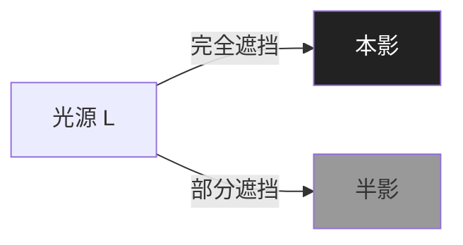
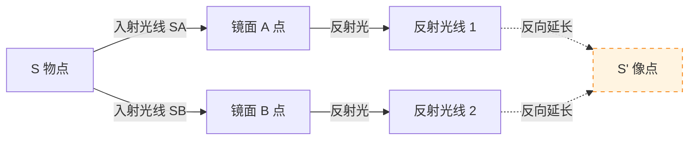

# 光的直线传播与反射

> [!abstract] 概览
> 本节是整个光学版块的基石，建立"光线模型"这一描述光传播的基本工具。核心内容包括：光源、光线、光束、光速四个基本概念；光的直线传播条件（同种均匀介质）及其三大典型现象（影、日食月食、小孔成像）；反射定律的三条要点（三线共面、法线居中、两角相等）；镜面反射与漫反射的区分；平面镜成像的四大特点（等大、等距、虚像、左右倒换）与成像作图法。本节既是 [[02-平面镜与球面镜成像]] 的逻辑前提，也为 [[03-光的折射与折射率]] 中折射定律的对照学习提供基础，并最终被 [[04-费马原理与光程]] 从变分原理的高度统一解释。光线模型忽略了光的波动本性，是几何光学层面的近似——这一点将在 [[03-光的波动性/02-光的衍射]] 中被重新审视。

## 核心概念

### 一、光源（发光体）

**光源**：能够自行发光的物体。从能量转化角度看，光源是将其他形式能量（电能、化学能、核能、热能等）转化为光能的物体。

按发光机制分类：

- **热辐射光源**：物体因高温而发光，如太阳、白炽灯、火焰。温度越高，辐射越强且颜色偏蓝；温度较低时偏红。这一现象的严格理论是黑体辐射（参见 [[00-热学总览]]）。
- **冷光源**：通过非热形式发光，如日光灯（气体放电）、萤火虫（生物化学发光）、LED（电致发光）、霓虹灯。冷光源发光效率高、温度低，是现代照明的主流。

> [!note] 光源 vs 被照体
> 月亮、镜子本身不发光，是被照体而非光源。但日常生活中常把"反射光的物体"误称为光源，需注意区分。严格意义上的光源必须==自行发光==。

### 二、光线与光束

**光线**：表示光传播方向的==几何抽象==——一条带箭头的直线，仅有方向意义，无粗细、无能量分布的物理实在。光线是几何光学的基本工具，类似于力学中"质点"的抽象——二者都是为了抓住主要矛盾而忽略次要因素。

**光束**：实际存在的是光束，即光能的定向传播区域，由无数条光线构成。按几何形态分为三类：

| 光束类型 | 几何特征 | 实际来源 | 举例 |
| --- | --- | --- | --- |
| 平行光束 | 光线互相平行 | 远处光源、准直激光 | 太阳光（近似）、激光束 |
| 会聚光束 | 光线汇聚于一点 | 凹面镜反射、凸透镜折射 | 凸透镜聚焦太阳光 |
| 发散光束 | 光线从一点向外发散 | 点光源、凸面镜反射 | 灯泡、恒星 |

> [!warning] 光线不存在物理实体
> "光线"是模型工具而非物理实在——真实光束总有宽度，且在衍射、干涉现象中不能简单用光线模型处理（参见 [[03-光的波动性/02-光的衍射]]）。光线模型的适用条件是：障碍物尺寸远大于光波长。

### 三、光速

**真空光速**：光在真空中的传播速度，记为 $c$：

$$
\boxed{\,c = 2.997\,924\,58\times 10^8\,\text{m/s} \approx 3.0\times 10^8\,\text{m/s}\,}
$$

$c$ 是自然界的基本常数，1983 年起被==精确化==——米的定义就是"光在真空中 $\dfrac{1}{299\,792\,458}$ 秒内走过的距离"。$c$ 同时是==信息传递速度的上限==，由狭义相对论给出（详见大学层面 [[电动力学]]）。

**介质中光速**：光在介质中传播速度小于 $c$：

$$
\boxed{\,v = \dfrac{c}{n}\,}
$$

其中 $n$ 为介质的==折射率==（详见 [[03-光的折射与折射率]]）。空气 $n\approx 1.0003$（近似取 $1$），水 $n\approx 1.33$，玻璃 $n\approx 1.5$。

### 四、光的直线传播

**直线传播条件**：光在==同种均匀介质==中沿直线传播。

关键词拆解：
- "**同种**"：介质种类不变（不能从空气进水后再讨论直线传播）。
- "**均匀**"：介质各处性质相同（不能在温度梯度大的空气中保持直线——这正是海市蜃楼的成因，详见 [[03-光的折射与折射率]]）。
- "**介质**"：包括真空——真空可视为最均匀的"介质"。

光线的直线传播用==带箭头的直线==表示，箭头指向光的传播方向。光线是有方向的，讨论光路可逆性时要注意方向。

### 五、影

**影**：光在传播过程中遇到不透明物体时，物体后方光照不到的区域。

- **本影**：完全无光照到的区域。光源完全被遮挡。
- **半影**：部分被遮挡、有部分光照到的区域。光源部分被遮挡。

影的形状与光源大小相关：
- **点光源**只成本影，无半影。
- **扩展光源**（面光源）同时成本影与半影。光源越大，半影区越大、本影区越小——这正是医院无影灯的原理：用大面光源使本影消失。

### 六、日食与月食

日食与月食是光的直线传播在天体尺度上的壮丽演示，是高考经典情境。

#### 1. 日食

**日食**：月球运行到太阳与地球之间，三体近似共线时，月球的影投射到地球表面，地面观察者看到太阳被遮挡。

地球处于月球影中：
- 处于月球**本影**区：看到==日全食==（太阳完全被遮）。
- 处于月球**半影**区：看到==日偏食==（太阳部分被遮）。
- 处于月球**伪本影**区（月球离地球较远，本影未及地表）：看到==日环食==（太阳中心被遮、边缘可见，呈光环）。

> [!note] 为什么日食不多见？
> 月球绕地轨道（白道面）与地球绕日轨道（黄道面）有约 $5^\circ$ 倾角，三体严格共线很少发生，故日食并非每个朔日都出现。全球每年最多 5 次日食。

#### 2. 月食

**月食**：地球运行到太阳与月球之间，地球的影投射到月球上，月球反射的太阳光被遮挡。

月球进入地球影中：
- 进入地球**本影**：==月全食==（月球完全进入地影，呈古铜红色——红光被地球大气折射照亮月面）。
- 部分进入本影：==月偏食==。
- 仅进入半影：==半影月食==（亮度略减，肉眼不易察觉）。

> [!tip] 日食 vs 月食辨析
> ==日食发生在朔（初一），月食发生在望（十五、十六）==。
> 日食时月球在中间；月食时地球在中间。
> 日全食持续时间短（几分钟，月球本影小）；月全食持续时间长（一小时以上，地球本影大）。
> 日食只在地球局部可见；月食在地球夜半球均可见。

### 七、小孔成像

**小孔成像**：物体发出的光经小孔后，在孔后屏上形成倒立实像。

原理：光的直线传播——物体上每一点发出的光，仅一条光线经小孔到达屏上对应点，整体形成倒立像。

特点：
- 像==倒立==（上下颠倒、左右对调）；
- 像==实像==（光实际会聚而成，可承接到屏上）；
- 像的形状与孔的形状==无关==（圆孔、方孔皆成像），但孔不能太大——孔太大则像模糊（无成像）；孔太小则衍射显著（参见 [[03-光的波动性/02-光的衍射]]）。

> [!example] 小孔成像的应用
> 古代墨子《墨经》记载小孔成像，是世界上最早的光学实验记录之一。针孔相机（无透镜相机）至今用于 X 射线成像、伽马射线成像等无法用透镜聚焦的场合。

### 八、反射定律

光射到两种介质界面上时，部分光返回原介质，称为==反射==。反射服从反射定律，有三条要点：

1. **三线共面**：反射光线、入射光线、法线在同一平面内。
2. **法线居中**：反射光线和入射光线分居法线两侧。
3. **两角相等**：反射角等于入射角，即 $\theta_r = \theta_i$。

$$
\boxed{\,\theta_{\text{反}} = \theta_{\text{入}}\,}
$$

其中角度均相对于==法线==（垂直于反射面）度量，而非相对于反射面。

> [!warning] 角度对法线不对界面
> 入射角、反射角是相对法线测量的，不是相对反射面。许多学生误把"相对界面"的角度当作入射角，导致错误。

### 九、镜面反射与漫反射

按反射面形态分为两类：

| 类型 | 反射面 | 反射光方向 | 现象 | 实例 |
| --- | --- | --- | --- | --- |
| 镜面反射 | 平滑（$\Delta \ll \lambda$） | 集中于反射角方向 | 成像、定向反光 | 平面镜、平静水面、抛光金属 |
| 漫反射 | 粗糙（$\Delta \sim \lambda$） | 各方向均有反射光 | 不能成像，但能被各方向看见 | 黑板、纸张、墙壁 |

> [!note] 漫反射仍遵守反射定律
> 漫反射中每一条光线仍遵守反射定律——只是反射面在不同位置法线方向不同，故整体反射光四散。==我们能从各方向看见物体，正是漫反射的贡献==。若所有物体只发生镜面反射，则侧面看不见任何东西。

### 十、平面镜成像

**平面镜成像特点**：四要点——等大、等距、虚像、左右倒换。

1. **像与物等大**：像的尺寸等于物的尺寸，与物距无关。
2. **像与物等距**：像到镜面距离等于物到镜面距离。
3. **像为虚像**：反射光线反向延长线会聚而成，不能用屏承接。
4. **左右倒换**：左右方向互换（关于镜面对称），上下不变。

数学描述：像与物关于镜面==对称==——镜面是物像连线的垂直平分面。

$$
\text{像距} = \text{物距},\quad h_{\text{像}} = h_{\text{物}}
$$

> [!tip] 关于"左右倒换"
> 严格地说，镜中像是==前后翻转==（沿镜面法线方向），而非"左右翻转"。我们感觉"左右翻转"是因为大脑以自身朝向解读镜中人——若以镜面方向为参考，实为前后对称。

## 推导与原理

### 一、平面镜成像作图法

平面镜成像作图有两种等价方法：

**方法一：对称法**（推荐）

1. 由物点 $S$ 作镜面 $MN$ 的垂线，垂足为 $P$。
2. 在垂线延长线上取 $S'$，使 $PS' = PS$，$S'$ 即像点。
3. 由 $S$ 任作两条入射光线 $SA$、$SB$，分别交镜面于 $A$、$B$。
4. 反射光线方向：连接 $S'A$、$S'B$ 并向远侧延长，即为反射光线方向。

**方法二：直接作图法**

1. 由物点 $S$ 作两条入射光线 $SA$、$SB$。
2. 在 $A$、$B$ 分别作法线（垂直镜面）。
3. 按"入射角等于反射角"作反射光线。
4. 反射光线反向延长交于 $S'$，即像点。

> [!tip] 作图小窍门
> 看见物点→作镜面对称点→找像点。任何复杂成像题都从这一步出发。

### 二、平面镜视场问题

**视场**：人眼或观察者位置确定后，能通过平面镜看到物体的范围；或物体确定后，能观察到像的范围。

视场问题的本质是光路可逆——人眼接收的光线方向反向延长即为可看见的物像区域。

解法：
1. 由物点对称求像点。
2. 由人眼位置 $E$ 经镜面边缘作两条入射光线（连接 $E$ 与镜面两端）。
3. 反向延长（向物方）即为可见物点范围。

### 三、光路可逆原理

**光路可逆原理**：在反射和折射中，若光沿原路径反向入射，则将沿原路径反向传播。

直观理解：把反射定律 $\theta_r = \theta_i$ 中的入射、反射对调，定律仍成立。

意义：光路可逆是几何光学的一条基本原理，使许多成像问题可"反向"分析——例如视场问题就是用光路可逆把"看像"转化为"像看物"。

## 典型实例与类比

### 实例 1：水中倒影

平静湖面映出岸边景物的对称倒影，这是平面镜成像——水面即镜面，水中"像"与岸上物关于水面对称。==倒影不是水下真有景物==，而是反射光反向延长所成虚像。

当水面起波纹时，反射面方向多变，倒影破碎——这正是从镜面反射过渡到漫反射的视觉表现。

### 实例 2：激光准直

激光束方向性好，近似平行光束。在隧道挖掘、桥梁施工中常用激光准直仪：以激光束为基准直线，引导机械沿设计方向作业。这是光的直线传播在工程上的直接应用。

### 实例 3：皮影戏与日晷

皮影戏利用光的直线传播——遮挡光源形成的影在幕上成像。日晷利用太阳光下晷针影的方位变化指示时辰。两者都是古代对光的直线传播的巧妙利用。

### 类比：光线 ↔ 直线运动轨迹

光线模型与力学中"质点直线运动"在数学上同构：
- 光线 ↔ 质点轨迹；
- 光线方向 ↔ 速度方向；
- 反射定律 ↔ 弹性碰撞中速度反向分量保持。

这一类比在 [[04-费马原理与光程]] 中将深化为"光程极值 ↔ 最小作用量原理"。

> [!tip] 记忆口诀
> ==同种均匀直线行，三线共面法居中，两角相等守定律；平面镜里像对称，等大等距虚像成。==
> ==日食朔月望，本影全半影偏；小孔成像倒立实，光路可逆是黄金。==

## 例题

### 例 1：基础——平面镜成像作图与视场

**题目**：如图，一物体 $AB$ 直立于平面镜 $MN$ 前，$A$ 距镜 $10\,\text{cm}$、$B$ 距镜 $15\,\text{cm}$。眼在镜前 $20\,\text{cm}$ 处观察。求：（1）像 $A'B'$ 距镜距离；（2）眼在镜前水平移动时，能完整看到 $AB$ 像的区域范围。

**分析**：（1）由平面镜成像对称性直接得像距；（2）视场问题用光路可逆——把眼视为物点，其像可"被" $AB$ 像看到的方向范围，再返回来即得。

**解答**：（1）由像物对称：$A'$ 距镜 $10\,\text{cm}$、$B'$ 距镜 $15\,\text{cm}$。像 $A'B'$ 在镜后，倒立对镜面对称。

（2）设镜面两端为 $M$、$N$，眼位置 $E$ 距镜 $20\,\text{cm}$。要看到 $A'$（即看到 $A$ 的反射像），眼接收的光线必经镜面反射来自 $A$——也即从 $A$ 发出经镜面反射到 $E$ 的光线方向。由光路可逆：从 $E$ 经镜面两端 $M$、$N$ 的入射光，反射光向物方延伸必经 $A$ 的可见边界。

由对称法：$E$ 的像 $E'$ 在镜后 $20\,\text{cm}$。从 $E'$ 看 $A$ 与 $B$，与镜面 $MN$ 的连线方向决定 $E$ 的可见范围。具体边界由 $\overline{E'M}\cap$ 物方延长线、$\overline{E'N}\cap$ 物方延长线决定。

**点评**：视场问题的标准方法：==眼→眼像→连接镜两端→与物像连线相交==。光路可逆是关键钥匙。

### 例 2：进阶——本影与半影

**题目**：半径 $R=5\,\text{cm}$ 的圆盘光源 $L$ 与半径 $r=2\,\text{cm}$ 的不透明圆盘 $D$ 平行放置，相距 $d=20\,\text{cm}$。在 $D$ 后方距 $D$ 为 $L_1=10\,\text{cm}$ 与 $L_2=30\,\text{cm}$ 处各放一屏，分别观察到本影半径多大？最大本影长度？

**分析**：本影是光源上==所有点==发出的光都被遮挡的区域。由相似三角形关系可求。

**解答**：设本影起始半径为 $r$（紧贴 $D$ 后），随距离增加，本影半径减小（光源边缘光线会聚）。本影完全消失的位置即"本影长度"。

由光源边缘到圆盘边缘的连线方向延伸：本影锥的半角满足

$$
\tan\alpha = \dfrac{R-r}{d} = \dfrac{5-2}{20} = 0.15
$$

紧贴 $D$ 后的本影半径即为 $r=2\,\text{cm}$（被 $D$ 完全遮挡的最小半径）。本影半径随距 $D$ 的距离 $x$ 变化：

$$
\rho(x) = r - x\tan\alpha = 2 - 0.15x
$$

本影消失时 $\rho=0$，得 $x_{\max} = \dfrac{2}{0.15}\approx 13.3\,\text{cm}$。

- $L_1=10\,\text{cm}<13.3\,\text{cm}$，本影存在：$\rho(10)=2-0.15\times 10=0.5\,\text{cm}$。
- $L_2=30\,\text{cm}>13.3\,\text{cm}$，本影已消失，只有半影，无本影。

**点评**：本影、半影问题本质是==几何遮挡==，用相似三角形或直线方程求解。无影灯原理即令 $x_{\max}\to 0$（大光源、小遮挡），使本影消失。

### 例 3：综合——日食分析

**题目**：太阳半径 $R_\odot\approx 7\times 10^8\,\text{m}$，地日距离 $D\approx 1.5\times 10^{11}\,\text{m}$；月球半径 $R_M\approx 1.7\times 10^6\,\text{m}$，地月距离 $d\approx 3.8\times 10^8\,\text{m}$。估算：（1）月球本影在地球表面处的半径；（2）日全食带的宽度量级。

**分析**：月球本影是一个锥形区域，锥尖距月球一定距离。先算本影锥长度 $L$，再判断是否到达地表；若到达，求地表处本影半径。

**解答**：本影锥的半角 $\alpha$ 满足（以太阳与月球边缘连线为界）：

$$
\tan\alpha = \dfrac{R_\odot - R_M}{D - d} \approx \dfrac{R_\odot}{D} \approx \dfrac{7\times 10^8}{1.5\times 10^{11}}\approx 4.7\times 10^{-3}
$$

本影锥长度（从月球背阳面算起）：

$$
L = \dfrac{R_M}{\tan\alpha}\approx \dfrac{1.7\times 10^6}{4.7\times 10^{-3}}\approx 3.6\times 10^8\,\text{m}
$$

而 $d\approx 3.8\times 10^8\,\text{m}$，可见==月球本影锥尖距地球表面很近==——稍短于地月距离，因此：

- 月球处于近地点时，本影能到达地表，发生==日全食==；
- 月球处于远地点时，本影未及地表，月球本影延伸到地表后形成==伪本影==，发生==日环食==。

日全食时月球本影在地表的半径约为：$R_\odot \cdot \dfrac{d}{D} - R_M \approx 7\times 10^8 \times \dfrac{3.8\times 10^8}{1.5\times 10^{11}} - 1.7\times 10^6 \approx 1.8\times 10^5 - 1.7\times 10^6 \approx -1.5\times 10^6\,\text{m}$（取负表示本影已收缩）。实际本影在地表的宽度量级为==数百公里==（典型约 $100\sim 200\,\text{km}$）。

**点评**：日全食之所以罕见且全食带狭窄，正源于月球本影锥恰好抵达地表、半径甚小。日全食持续时间短（最长约 7 分钟），也因本影范围小、月球公转较快。

## 易错提醒

> [!warning] 易错点
> 1. **角度对法线**：入射角、反射角、折射角均相对法线度量，不是相对界面。
> 2. **直线传播条件漏"均匀"**：只写"同种介质"不够——必须==均匀==。海市蜃楼就发生在不均匀大气中。
> 3. **影的形状判断**：本影区完全无光，半影区部分有光；点光源无半影。
> 4. **日食月食日时混淆**：日食在朔（初一），月食在望（十五、十六）。
> 5. **平面镜成像"近大远小"误判**：像与物==永远等大==，"近大远小"是视角变化造成的视觉错觉，不是像真的变大变小。
> 6. **虚像不能用屏承接**：虚像是反向延长线所成，无实际光线汇聚，不能用屏承接到。
> 7. **镜面反射与漫反射不二分**：漫反射中每条光线仍遵守反射定律，只是各点法线方向不同。

> [!note] 概念辨析
> **光线 vs 光束**：光线是几何抽象，无粗细；光束是物理实在，有宽度。
> **本影 vs 半影**：本影无光、半影有部分光；本影由"全遮挡"决定，半影由"部分遮挡"决定。
> **实像 vs 虚像**：实像由实际光线汇聚而成，可承接于屏；虚像由反向延长线汇聚而成，不能承接于屏。小孔成像是实像，平面镜成像是虚像。
> **镜面反射 vs 漫反射**：两者都遵守反射定律，区别在反射面是否平滑。漫反射使物体能被各方向看见。

## 与其他知识关联

- 与 [[01-光的直线传播与反射]] 的关系：本节为本条目本身，奠定光线模型基础。
- 与 [[02-平面镜与球面镜成像]] 的关系：平面镜成像规律是球面镜成像的简化特例（曲率半径 $\to\infty$）；反射定律是球面镜成像作图的依据。
- 与 [[03-光的折射与折射率]] 的关系：反射与折射同时发生于界面，反射定律与折射定律（斯涅尔定律）共同描述界面光行为。
- 与 [[04-费马原理与光程]] 的关系：反射定律可由费马原理（光程极值）严格推导，是费马原理的具体表现。
- 与 [[02-全反射与光学器件/01-全反射与临界角]] 的关系：全反射是反射的特殊情形——折射光消失、入射角大于临界角时光全部反射。
- 与 [[02-全反射与光学器件/03-薄透镜成像规律]] 的关系：透镜成像基于折射，但成像作图方法与平面镜作图一脉相承（特殊光线法）。
- 与 [[03-光的波动性/05-光的电磁本性]] 的关系：光速 $c=1/\sqrt{\varepsilon_0\mu_0}$ 由麦克斯韦方程组严格导出。
- 高中—大学衔接：[[物理光学]]、[[电动力学]]、[[光学]]
- 与力学联系：[[02-牛顿运动定律/06-牛顿第二定律]]（光的粒子性受力）、[[机械振动]]（光波与机械波类比）
- 与电学联系：[[01-静电场/05-带电粒子在电场中的运动]]（光电效应联系）
- 与热学联系：[[01-分子动理论/02-分子热运动与布朗运动]]（光散射的微观本质）
- 返回 [[00-光学总览]]

## 作者的话

> [!quote] 个人理解
> 本节看似简单——"光走直线、入射等于反射"是初中就接触过的内容——但其中暗藏两条深刻线索，建议读者细细品味。
>
> 第一条线索是==模型的层次性==。光线模型只是几何光学的近似，它忽略了光的波动本性。当障碍物尺寸接近光波长时（如单缝宽度 $\sim\lambda$），直线传播失效，衍射、干涉登上舞台（详见 [[03-光的波动性/02-光的衍射]]）。同样，当涉及能量量子化时（光电效应），又需引入光子模型。三种模型（光线、波动、光子）不是互相否定，而是==层层包容==——光线模型是波动模型在短波长极限下的近似，波动模型又是量子电动力学在低能极限下的近似。这种"模型嵌套"是物理学的方法论精髓。
>
> 第二条线索是==对称性==。平面镜成像本质是镜像对称，反射定律本身具有"光路可逆"的时间反演对称性。这种对称性在 [[04-费马原理与光程]] 中将上升为变分原理，并与力学的最小作用量原理形成深刻对应——这预示着费曼路径积分的诞生。从"光走直线"到"光走光程极值路径"，再到"粒子走作用量极值路径"，物理学在美学层面的统一性令人惊叹。
>
> 学习本节时，建议动手画几个成像作图——画图比死记规律更深刻。日食月食部分可结合天文软件（如 Stellarium）实际查看日食过程，建立直观感受。光学之美在"看得见摸不着"——光既是日常经验的对象，又是物理学最深邃命题的载体。

---
*返回 [[00-光学总览]]*
