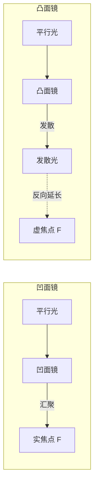
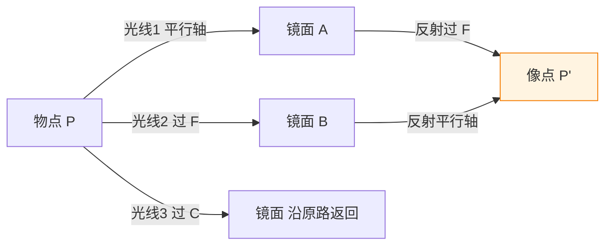

# 平面镜与球面镜成像

> [!abstract] 概览
> 本节在 [[01-光的直线传播与反射]] 的反射定律基础上，系统讨论反射型光学元件的成像规律。从平面镜成像特点（等大、等距、虚像、左右倒换）入手，深化实像与虚像的本质区别；进而引入球面镜——凹面镜（会聚）与凸面镜（发散），讨论其焦点（凹面镜实焦点、凸面镜虚焦点）、焦距、成像公式 $\dfrac{1}{u}+\dfrac{1}{v}=\dfrac{1}{f}$、三条特殊光线作图法、横向放大率 $m=v/u$；最后给出凸面镜（后视镜、广角镜）与凹面镜（太阳灶、探照灯、反射式望远镜）的典型应用。球面镜成像公式与符号法则是本节难点，[[02-全反射与光学器件/03-薄透镜成像规律]] 中透镜成像公式与之同构，本节为后续透镜学习奠定符号约定基础。

## 核心概念

### 一、平面镜成像规律再深化

平面镜成像的四大特点已在 [[01-光的直线传播与反射]] 中给出：==等大、等距、虚像、左右倒换==。本节从成像角度作进一步深化。

**成像的几何本质**：物点 $S$ 发出的发散光束经镜面反射后仍为发散光束，其反向延长线交于像点 $S'$——$S'$ 与 $S$ 关于镜面对称。==反射光束本身未真正汇聚==，故成虚像。

**像与物的对应关系**：

| 性质 | 物 | 像 |
| --- | --- | --- |
| 大小 | 高 $h$ | 高 $h$（等大） |
| 距离 | 距镜 $u$ | 距镜 $u$（等距） |
| 类型 | 实物 | 虚像 |
| 朝向 | 上下不变、左右倒换 | 上下不变、左右倒换 |
| 实/虚 | 实物（光实际发出） | 虚像（反向延长汇聚） |

**像的"近大远小"辨析**：平面镜中像大小==永不改变==，不论物距如何。"近大远小"是观察者视角变化造成的视觉错觉——像对人眼所张视角 $\alpha\approx h/(2u)$ 随 $u$ 减小而增大，但像本身高度始终为 $h$。

### 二、实像与虚像

**实像**：实际光线汇聚所成的像。特点：
- 实际光线在像点相交；
- ==可用屏承接==（光屏上有实际光能落点）；
- 通常倒立（相对物）；
- 例：小孔成像、凹面镜成实像、凸透镜成实像。

**虚像**：实际光线的反向延长线汇聚所成的像。特点：
- 实际光线在像点==不相交==，仅其反向延长线相交；
- ==不能用屏承接==（屏上无对应光点）；
- 通常正立（相对物）；
- 例：平面镜成像、凸面镜成像、凹透镜成像、眼睛看到的"水中鱼"。

> [!note] 实像 vs 虚像的本质
> 实像与虚像的根本区别在于==实际光线是否在像点相交==。能"用屏承接"是实像的检验方法而非定义——其物理本质是光线在像点的真实汇聚。眼睛能"看见"虚像，是因为人眼透镜将发散光束再次汇聚于视网膜形成实像。

### 三、球面镜的分类

**球面镜**：反射面为球面一部分的反射镜。按反射面形状分为：

| 类型 | 反射面 | 对光束作用 | 焦点性质 | 典型应用 |
| --- | --- | --- | --- | --- |
| 凹面镜（concave） | 球内表面（凹面） | ==会聚== | 实焦点 | 太阳灶、探照灯、反射式望远镜 |
| 凸面镜（convex） | 球外表面（凸面） | ==发散== | 虚焦点 | 后视镜、广角镜、防盗镜 |

球面镜的几何要素：
- **顶点 $O$**：球面与主光轴的交点（即镜面中心）。
- **主光轴**：过球心 $C$ 与顶点 $O$ 的直线。
- **球心 $C$**：球面的几何中心。
- **曲率半径 $R$**：球心到镜面任一点的距离。
- **焦点 $F$**：主光轴上特定点，满足 $OF = f = R/2$。
- **焦距 $f$**：顶点到焦点的距离，$f = R/2$。

> [!tip] 焦距与曲率半径的关系
> 球面镜焦距是曲率半径的一半：$f = R/2$。这一关系在近轴光线（傍轴光线）条件下成立——所谓近轴，指光线与主光轴夹角很小，$\sin\theta\approx\tan\theta\approx\theta$。

### 四、球面镜的焦点与焦距

#### 1. 凹面镜——实焦点

平行于主光轴的近轴光线经凹面镜反射后==实际汇聚==于主光轴上一点 $F$，$F$ 称为凹面镜的==实焦点==——因光线真实汇聚于此，可用屏承接。

焦距 $f = R/2 > 0$（凹面镜约定 $f$ 取正）。

#### 2. 凸面镜——虚焦点

平行于主光轴的近轴光线经凸面镜反射后==发散==，其反向延长线汇聚于主光轴上一点 $F$，$F$ 称为凸面镜的==虚焦点==——光线实际不经过此点。

焦距 $f = -R/2 < 0$（凸面镜约定 $f$ 取负）。

### 五、球面镜成像公式与符号法则

**球面镜成像公式**（近轴条件下）：

$$
\boxed{\,\dfrac{1}{u} + \dfrac{1}{v} = \dfrac{1}{f}\,}
$$

其中 $u$ 为物距、$v$ 为像距、$f$ 为焦距。

**符号法则**（"实正虚负"约定）：

| 量 | 实 | 虚 |
| --- | --- | --- |
| 物距 $u$ | 实物 $u>0$ | 虚物 $u<0$（少见） |
| 像距 $v$ | 实像 $v>0$ | 虚像 $v<0$ |
| 焦距 $f$ | 凹面镜（实焦点）$f>0$ | 凸面镜（虚焦点）$f<0$ |

> [!warning] 高中符号约定
> 高中物理中实物 $u$ 恒取正值（题目中物总是实物，不涉及虚物）。学生只需关注 $v$ 与 $f$ 的正负：凹面镜 $f>0$，凸面镜 $f<0$；实像 $v>0$，虚像 $v<0$。这与大学层面 [[光学]] 中"笛卡尔符号约定"略有不同，但思路一致。

### 六、横向放大率

**横向放大率** $m$：像高 $h'$ 与物高 $h$ 之比：

$$
\boxed{\,m = \dfrac{h'}{h} = -\dfrac{v}{u}\,}
$$

符号规定：
- $m>0$：像==正立==（与物同方向）；
- $m<0$：像==倒立==（与物反方向）；
- $|m|>1$：放大；$|m|<1$：缩小；$|m|=1$：等大。

> [!note] 公式中负号的意义
> 公式 $m=-v/u$ 中的负号是为了同时表达"倒立"。若 $u>0$（实物）、$v>0$（实像），则 $m<0$ 表示倒立；若 $u>0$、$v<0$（虚像），则 $m>0$ 表示正立。这与凸面镜恒成正立缩小虚像、凹面镜成实像时倒立的事实完全一致。

### 七、凹面镜成像规律表

设凹面镜 $f>0$，焦距为 $f$，球心半径 $R = 2f$。

| 物距 $u$ | 像距 $v$ | 像的性质 | 放大率 $m$ | 应用 |
| --- | --- | --- | --- | --- |
| $u\to\infty$ | $v=f$ | 实像点 | $0$ | 探照灯反光碗（反向用） |
| $u>2f$（$u>R$） | $f<v<2f$ | 倒立缩小实像 | $|m|<1$ | 反射式望远镜物镜 |
| $u=2f$（$u=R$） | $v=2f$ | 倒立等大实像 | $m=-1$ | — |
| $f<u<2f$ | $v>2f$ | 倒立放大实像 | $|m|>1$ | 反射式幻灯、放映 |
| $u=f$ | $v\to\infty$ | 平行光（不成像） | $\to\infty$ | 探照灯、手电筒反光碗 |
| $u<f$ | $v<0$ | 正立放大虚像 | $m>1$ | 化妆放大镜（凹面反射） |

### 八、凸面镜成像规律

凸面镜 $f<0$，恒成==正立、缩小、虚像==，像在镜后。

不论物距 $u$ 多大（只要 $u>0$），凸面镜都成正立缩小虚像，$v<0$、$|v|<u$、$|m|<1$。

应用价值：==扩大视野==——同样大小的镜面，凸面镜可成像更大范围的物体，故汽车后视镜、路口广角镜、防盗镜均用凸面镜。

> [!tip] 为什么凸面镜扩大视野？
> 凸面镜将大角度入射的光"压缩"到小角度反射方向，使观察者在小镜中看到大范围场景。代价是像缩小、距离感失真——司机看到的后车比实际远。

## 推导与原理

### 一、球面镜成像公式推导（近轴条件）

设凹面镜球心 $C$、顶点 $O$、焦点 $F$（$OF=f$）。物点 $P$ 在主光轴上距 $O$ 为 $u$，经反射成像于 $P'$，像距 $v$。考虑一条从 $P$ 发出、与主光轴夹角 $\alpha$ 的近轴光线，入射点 $A$ 距轴高 $h$，反射角与入射角均为 $\theta$（相对法线 $CA$）。

近轴近似下 $\sin\alpha\approx\tan\alpha\approx\alpha$，由几何关系：
- $\alpha \approx h/u$（物方张角）
- $\beta \approx h/v$（像方张角）
- $\gamma \approx h/R$（法线张角，$R$ 为球面半径）

由反射定律，入射角与反射角相等，几何上有 $\gamma = \alpha + \theta$、$\theta = \beta + \gamma$（外角关系），消去 $\theta$ 得 $2\gamma = \alpha + \beta$，即：

$$
\dfrac{2h}{R} = \dfrac{h}{u} + \dfrac{h}{v}
$$

整理得：

$$
\boxed{\,\dfrac{1}{u} + \dfrac{1}{v} = \dfrac{2}{R} = \dfrac{1}{f}\,}
$$

故 $f = R/2$，与之前结论一致。此公式在近轴条件下严格成立。

### 二、三条特殊光线作图法

球面镜成像作图依赖于三条特殊光线，由任意两条即可定像点。

#### 凹面镜的三条特殊光线

1. **平行于主光轴的光线**：经凹面镜反射后过焦点 $F$（实焦点）。
2. **过焦点 $F$ 的光线**：经凹面镜反射后平行于主光轴。
3. **过球心 $C$ 的光线**：沿原路返回（因 $CA$ 为法线，入射角为零）。
4. **过顶点 $O$ 的光线**：以主光轴为法线，入射角等于反射角（对称反射）。

> [!note] "过球心沿原路返回"的原因
> 过球心 $C$ 的光线沿球面半径方向，半径方向即为法线方向，故入射角为零、反射角为零，光沿原路返回。

#### 凸面镜的三条特殊光线

1. **平行于主光轴的光线**：经凸面镜反射后发散，其反向延长线过虚焦点 $F$（镜后）。
2. **指向焦点 $F$（镜后虚焦点）的光线**：经凸面镜反射后平行于主光轴。
3. **指向球心 $C$（镜后）的光线**：沿原路返回。

### 三、作图步骤示例（凹面镜成实像）

设物 $AB$ 直立于主光轴，$A$ 端在轴上、$B$ 端在轴上方，物距 $u$（$f<u<2f$）。

1. 由 $B$ 作平行于主光轴的光线，入射镜面于 $M$，反射光过焦点 $F$。
2. 由 $B$ 作过球心 $C$ 的光线，入射镜面于 $N$，反射光沿原路返回。
3. 两反射光交点 $B'$ 即 $B$ 的像点。
4. 由 $B'$ 作主光轴垂线，垂足 $A'$ 即 $A$ 的像点，$A'B'$ 即像。

判断：$u$ 在 $(f, 2f)$ 区间时，$B'$ 在 $B$ 的另一侧主光轴下方，像==倒立放大实像==，与成像表一致。

### 四、费马原理视角的成像

球面镜成像公式可从 [[04-费马原理与光程]] 角度理解：物像间所有光路的光程相等（等光程性），这是成像的几何光学条件。详细的费马原理推导见 [[04-费马原理与光程]]。

## 典型实例与类比

### 实例 1：汽车后视镜（凸面镜）

汽车左右后视镜多为凸面镜，原因：
1. ==扩大视野==——比同样大小的平面镜能看到更大范围的物体。
2. 成正立缩小虚像——便于司机快速判断方位。
3. 缺点：像缩小、距离感失真，" objects in mirror are closer than they appear "（镜中物体比看起来更近）。

### 实例 2：太阳灶（凹面镜）

太阳灶是一个大口径凹面镜，将太阳光（近似平行光）汇聚于焦点 $F$。焦点处温度可达数百至上千摄氏度，足以加热水壶、煮饭。理论聚光比正比于口径面积与焦斑面积之比，受衍射极限与镜面精度限制。

### 实例 3：探照灯与手电筒反光碗

探照灯将光源置于凹面镜焦点处——由焦点发出的光经凹面镜反射后==平行于主光轴射出==，形成强方向性光束。手电筒、汽车前灯、舞台聚光灯均用此原理。

> [!tip] 光源置于焦点 ↔ 平行光入射汇聚于焦点
> 这正是光路可逆的体现：平行光入射会汇聚于焦点；光源置于焦点则反射后出射平行光。

### 实例 4：反射式望远镜

牛顿反射式望远镜用一个大口径凹面镜作为物镜，将远处天体（视为无穷远物点）的平行光汇聚于焦点，形成实像点；再用目镜放大观察。反射式望远镜相对折射式有==无色差==的优点（反射无色散，参见 [[02-全反射与光学器件/02-棱镜与色散]]），且大口径制造更容易，是现代大型天文望远镜的主流。

### 类比：凹面镜 ↔ 凸透镜

凹面镜对光束的会聚作用类似凸透镜，二者都使平行光汇聚于焦点、都可成实像或虚像；凸面镜类似凹透镜，二者都使光束发散、恒成正立缩小虚像。区别在于：球面镜基于==反射==，透镜基于==折射==；透镜有色差，反射镜无色差。这种"反射—折射"对应在 [[03-光的折射与折射率]] 与 [[02-全反射与光学器件/03-薄透镜成像规律]] 中将不断重现。

> [!tip] 记忆口诀
> ==凹面会聚凸面散，实焦凹虚焦凸，焦距半曲率；实物正、实像正、虚像负，凹镜正焦凸镜负；一加一倒数等于一倒数。==
> ==平行光过焦点，过焦反射平行轴，过心沿原路返回。==

## 例题

### 例 1：基础——凹面镜成像计算

**题目**：一凹面镜曲率半径 $R=40\,\text{cm}$。物体高 $h=2\,\text{cm}$，置于镜前 $u=30\,\text{cm}$ 处。求像距、像高、像的性质。

**分析**：$f=R/2=20\,\text{cm}$。由 $\dfrac{1}{u}+\dfrac{1}{v}=\dfrac{1}{f}$ 求 $v$，再由 $m=-v/u$ 求放大率与像高。

**解答**：

$$
\dfrac{1}{30}+\dfrac{1}{v} = \dfrac{1}{20}\Rightarrow \dfrac{1}{v} = \dfrac{1}{20}-\dfrac{1}{30} = \dfrac{3-2}{60} = \dfrac{1}{60}
$$

得 $v=60\,\text{cm}>0$，==实像==，在镜前 $60\,\text{cm}$ 处。

放大率：$m=-\dfrac{v}{u}=-\dfrac{60}{30}=-2$，$|m|=2$。

像高：$h'=m\cdot h=-2\times 2=-4\,\text{cm}$，==倒立放大实像==，像高 $4\,\text{cm}$。

**点评**：$u$ 在 $(f, 2f)=(20,40)$ 区间，理论应成倒立放大实像，与计算一致。注意 $h'=-4$ 中负号表示倒立。

### 例 2：进阶——凸面镜成像

**题目**：一凸面镜曲率半径 $R=30\,\text{cm}$（$f=-15\,\text{cm}$）。物体高 $h=4\,\text{cm}$，置于镜前 $u=20\,\text{cm}$ 处。求像距、像高，并判断像的性质。

**分析**：$f<0$，用成像公式代入符号计算。

**解答**：

$$
\dfrac{1}{20}+\dfrac{1}{v} = \dfrac{1}{-15}\Rightarrow \dfrac{1}{v} = -\dfrac{1}{15}-\dfrac{1}{20} = -\dfrac{4+3}{60}=-\dfrac{7}{60}
$$

得 $v=-\dfrac{60}{7}\approx -8.57\,\text{cm}<0$，==虚像==，在镜后 $8.57\,\text{cm}$ 处。

放大率：$m=-\dfrac{v}{u}=-\dfrac{-8.57}{20}\approx 0.43$，$|m|<1$。

像高：$h'=m\cdot h=0.43\times 4\approx 1.71\,\text{cm}$，==正立缩小虚像==。

**点评**：凸面镜恒成正立缩小虚像，本题验证这一规律。注意符号代入是关键——$f$ 必须取负值。

### 例 3：综合——凹面镜虚像情形

**题目**：凹面镜焦距 $f=10\,\text{cm}$，物体置于镜前 $u=6\,\text{cm}$ 处。求像距与放大率，并分析成像特点。若改用凸面镜（$f=-10\,\text{cm}$），结果如何？

**分析**：$u<f$ 时凹面镜应成正立放大虚像；凸面镜恒成正立缩小虚像。用成像公式验证。

**解答**：

（1）凹面镜：

$$
\dfrac{1}{6}+\dfrac{1}{v}=\dfrac{1}{10}\Rightarrow \dfrac{1}{v}=\dfrac{1}{10}-\dfrac{1}{6}=\dfrac{3-5}{30}=-\dfrac{2}{30}=-\dfrac{1}{15}
$$

$v=-15\,\text{cm}<0$，虚像。$m=-\dfrac{-15}{6}=2.5$，正立放大虚像（$|m|>1$、$m>0$）。

（2）凸面镜（$f=-10$）：

$$
\dfrac{1}{6}+\dfrac{1}{v}=-\dfrac{1}{10}\Rightarrow \dfrac{1}{v}=-\dfrac{1}{10}-\dfrac{1}{6}=-\dfrac{3+5}{30}=-\dfrac{8}{30}=-\dfrac{4}{15}
$$

$v=-\dfrac{15}{4}=-3.75\,\text{cm}$，虚像。$m=-\dfrac{-3.75}{6}=0.625$，正立缩小虚像。

**点评**：凹面镜在 $u<f$ 时成正立放大虚像（化妆镜原理）；凸面镜恒成正立缩小虚像。同样 $|f|=10$、$u=6$ 下，凹凸面镜像性质截然不同，这是高考易混点。

## 易错提醒

> [!warning] 易错点
> 1. **符号代入错误**：凸面镜 $f$ 必须取负值，虚像 $v$ 取负值。常见错误是套公式时全用正值，导致 $v$ 算错。
> 2. **凹面镜 $u<f$ 情形误判**：物在焦点以内时凹面镜成==正立放大虚像==，而非实像。许多学生只记住"凹面镜成实像"的片面结论。
> 3. **放大率符号**：$m=-v/u$ 中的负号不可漏写。漏写后无法判断倒立/正立。
> 4. **焦距与曲率半径混淆**：$f=R/2$，不是 $f=R$。
> 5. **凸面镜"扩大视野"理解**：是因像缩小而看到更大范围，并非凸面镜本身"放大视野"。
> 6. **三条特殊光线"过焦点"的方向**：凹面镜的焦点在镜前，光线真实过焦点；凸面镜的焦点在镜后，光线"指向"焦点（不一定经过）。
> 7. **近轴条件**：成像公式仅对近轴光线成立，远轴光线有"球差"。

> [!note] 概念辨析
> **凹面镜 vs 凸面镜**：凹面会聚、凸面发散；凹面镜实焦点、凸面镜虚焦点；凹面镜可成实像或虚像、凸面镜恒成虚像。
> **球面镜 vs 透镜**：球面镜基于反射、透镜基于折射；球面镜无色差、透镜有色差；凹面镜对应凸透镜（会聚），凸面镜对应凹透镜（发散）。
> **实焦点 vs 虚焦点**：实焦点是光线真实汇聚点（凹面镜），虚焦点是反向延长汇聚点（凸面镜）。
> **平面镜 vs 球面镜**：平面镜是球面镜 $R\to\infty$ 的极限情形，焦距 $f\to\infty$，成像公式退化为 $v=-u$（虚像对称）。

## 与其他知识关联

- 与 [[01-光的直线传播与反射]] 的关系：平面镜成像规律是本节起点；反射定律是球面镜成像的几何基础。
- 与 [[02-平面镜与球面镜成像]] 的关系：本节本身。
- 与 [[03-光的折射与折射率]] 的关系：球面镜成像公式与薄透镜成像公式同构 $\dfrac{1}{u}+\dfrac{1}{v}=\dfrac{1}{f}$，源于折射球面近轴成像公式。
- 与 [[04-费马原理与光程]] 的关系：成像的等光程性可由费马原理推导；球面镜成像公式的几何推导也基于光程概念。
- 与 [[02-全反射与光学器件/01-全反射与临界角]] 的关系：全反射是反射的特殊情形；反射镜中的全反射棱镜是球面镜的应用变体。
- 与 [[02-全反射与光学器件/03-薄透镜成像规律]] 的关系：透镜成像公式、放大率、三条特殊光线作图法均与球面镜一一对应——本节是透镜学习的预演。
- 与 [[03-光的波动性/05-光的电磁本性]] 的关系：光速 $c=1/\sqrt{\varepsilon_0\mu_0}$，反射镜面材料的光学性质由电磁理论描述。
- 高中—大学衔接：[[物理光学]]、[[电动力学]]、[[光学]]
- 与力学联系：[[02-牛顿运动定律/06-牛顿第二定律]]（光的粒子性受力）、[[机械振动]]（光波与机械波类比）
- 与电学联系：[[01-静电场/05-带电粒子在电场中的运动]]（光电效应联系）
- 与热学联系：[[01-分子动理论/02-分子热运动与布朗运动]]（光散射的微观本质）
- 返回 [[00-光学总览]]

## 作者的话

> [!quote] 个人理解
> 球面镜成像的学习，最容易陷入"背公式套数字"的陷阱。建议读者换一种视角：把 $\dfrac{1}{u}+\dfrac{1}{v}=\dfrac{1}{f}$ 看作==物方与像方的"对称方程"==——物距与像距在公式中地位对等，仅由符号约定区分。这种对称性正是光路可逆的数学体现。
>
> 更深层地看，球面镜成像公式与薄透镜成像公式在数学形式上完全同构——这并非巧合。两者都源于"球面界面近轴成像"的几何关系，差别只在反射 vs 折射。这种"反射—折射"的对应是几何光学的深层结构，在 [[03-光的折射与折射率]] 中将以斯涅尔定律的形式再次出现。学会一个公式，等于学会了球面镜、透镜乃至显微镜、望远镜的成像基础——这是物理学的==经济性==。
>
> 另一个值得思考的问题：为什么球面镜不用抛物面镜？球面易于加工，但近轴成像存在球差（远轴光线不严格汇聚于焦点）。抛物面镜在理论上无球差——平行光严格汇聚于焦点，故反射式望远镜实际多用抛物面镜。这体现了"理想 vs 实用"的工程权衡。
>
> 最后提一个常被忽视的细节：球面镜成像公式的"近轴条件"并非可有可无。当光线远离主光轴时，像点会偏离公式预测的位置，形成==像差==——包括球差、彗差、像散、场曲、畸变五大类。这些像差的校正是现代光学设计的核心问题，涉及非球面镜、复合透镜组等复杂结构。高中阶段只需知道近轴条件即可，但建立"模型有适用范围"的意识是物理思维的精髓。

---
*返回 [[00-光学总览]]*
