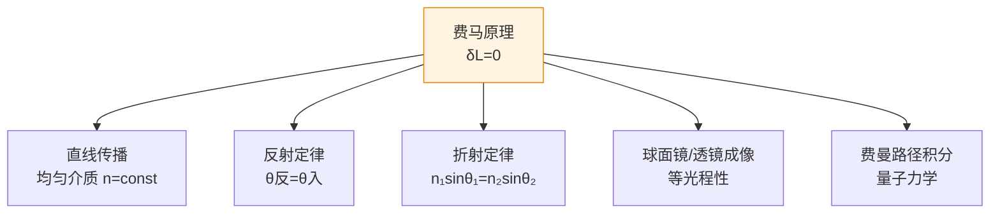

# 费马原理与光程

> [!abstract] 概览
> 本节是几何光学基础版块的==收束与升华==——费马原理以"光沿光程极值路径传播"这一简洁表述，统一推导出光的直线传播、反射定律、折射定律三大几何光学基本规律，是高中几何光学最具美学价值的内容。本节涵盖：光程 $L=nl$ 的定义与物理意义；费马原理的严格表述（光程取极值，通常是极小，亦称==最短时间原理==）；由费马原理严格推导反射定律（最短路径法）；由费马原理严格推导折射定律（斯涅尔定律的变分推导）；费马原理的物理意义（统一几何光学三大定律）；费马原理与力学中最小作用量原理的深刻对应（物理学美学的典范）。本节为高中—大学衔接内容，在高考中要求较低，但作为"物理学方法论"的典范，对培养物理直觉与建立现代物理观念至关重要。后续大学 [[光学]] 中的哈密顿光学、[[量子力学]] 中的路径积分，皆源于费马原理的精神。

## 核心概念

### 一、光程

**光程**（optical path length, OPL）：光在介质中传播的几何路程 $l$ 与该介质折射率 $n$ 的乘积：

$$
\boxed{\,L = n\cdot l\,}
$$

由 $n=c/v$，光在介质中传播 $l$ 所用时间 $t=l/v=nl/c$，故：

$$
L = nl = ct
$$

**物理意义**：光程 $L$ 表示光在介质中传播 $l$ 几何路程所用时间内，==在真空中能传播的距离==。光程将不同介质中的传播"折算"到真空中比较，使不同光路具有统一的"时间尺度"。

> [!note] 光程的"等效真空"含义
> 光程 $L=nl$ 可理解为"光在介质中走 $l$，相当于在真空中走 $L$"。这一"折算"使不同介质、不同几何路程的光线具有可比较的"光程"——这是干涉、衍射等波动现象的数学基础（详见 [[03-光的波动性/01-光的干涉]]）。

### 二、分段光程与总光程

若光经过多种介质，总光程为各段光程之和：

$$
L_{\text{总}} = \sum_i n_i l_i = n_1 l_1 + n_2 l_2 + \cdots
$$

对连续变化的介质（如不均匀大气，海市蜃楼情形），光程为积分形式：

$$
L = \int_A^B n\,ds
$$

其中 $ds$ 为路径微元，$n=n(s)$ 随位置变化。

### 三、费马原理

**费马原理**（Fermat's Principle）：光从一点传播到另一点，所经过的实际路径==使其光程取极值==（通常为极小值，亦可为极大或平稳值）。

数学形式：实际光路使 $L=\int_A^B n\,ds$ 取极值，即光程的变分为零：

$$
\boxed{\,\delta L = \delta\int_A^B n\,ds = 0\,}
$$

等价表述——==最短时间原理==：光沿所需时间最短的路径传播（光程极小 $\Leftrightarrow$ 时间极小，因 $t=L/c$）。

> [!tip] 极值不一定是极小
> 费马原理严格说应为"光程取==极值=="（变分为零），通常为极小，但在特殊情形下可为极大或拐点。例如光在椭圆反射镜的一个焦点出发经镜面反射到另一焦点，所有路径光程相等（==平稳值==，非极小）。"最短时间"是常见情形而非普遍规律。

### 四、费马原理的历史

费马（Pierre de Fermat）于 1657 年提出最短时间原理，比斯涅尔发现折射定律晚约 36 年，但费马首次将反射、折射、直线传播三大规律==统一==在一个原理之下。这一统一是物理学史上的里程碑——首次用"极值原理"描述自然规律，预示了后世力学中最小作用量原理、电磁学中麦克斯韦方程组的协变形式，乃至量子力学的路径积分。

## 推导与原理

### 一、由费马原理推导反射定律

**命题**：光由点 $A$ 经反射镜 $M$ 到达点 $B$，求证入射角等于反射角。

**推导**：

设反射镜 $M$ 为 $x$ 轴，$A(0,a)$ 与 $B(d,-a)$ 关于 $x$ 轴对称（$a>0$，$B$ 与 $A$ 在 $x$ 轴两侧且距 $x$ 轴等距——这是反射问题的标准设定，更一般情形类似）。光从 $A$ 出发，经镜面上点 $P(x,0)$ 反射到达 $B$。

光程（同种介质 $n=1$）：

$$
L(x) = AP + PB = \sqrt{x^2+a^2}+\sqrt{(d-x)^2+a^2}
$$

费马原理要求 $L(x)$ 取极值：

$$
\dfrac{dL}{dx} = \dfrac{x}{\sqrt{x^2+a^2}} - \dfrac{d-x}{\sqrt{(d-x)^2+a^2}} = 0
$$

即 $\dfrac{x}{\sqrt{x^2+a^2}} = \dfrac{d-x}{\sqrt{(d-x)^2+a^2}}$，注意到 $\sin\theta_1 = \dfrac{x}{\sqrt{x^2+a^2}}$（入射角的正弦）、$\sin\theta_2 = \dfrac{d-x}{\sqrt{(d-x)^2+a^2}}$（反射角的正弦），得：

$$
\boxed{\,\sin\theta_1 = \sin\theta_2\;\Rightarrow\;\theta_1=\theta_2\,}
$$

即==入射角等于反射角==，反射定律得证。

> [!note] 推导的几何直观
> 对称地取 $A, B$ 关于镜面镜像，则 $AP+PB=AP+PB'$，其中 $B'$ 为 $B$ 关于镜面的镜像。$A\to P\to B'$ 最短路径为直线，故 $P$ 在 $AB'$ 与镜面交点处，此时入射角等于反射角——这是费马推导的几何等价形式。

### 二、由费马原理推导折射定律

**命题**：光由介质 1（折射率 $n_1$）中点 $A$ 经界面到介质 2（折射率 $n_2$）中点 $B$，求证 $n_1\sin\theta_1=n_2\sin\theta_2$。

**推导**：

设界面为 $x$ 轴，$A(0, a)$ 在介质 1（$y>0$），$B(b, -d)$ 在介质 2（$y<0$，$a, d>0$）。光从 $A$ 出发，经界面上点 $P(x, 0)$ 进入介质 2 到达 $B$。

光程：

$$
L(x) = n_1\cdot AP + n_2\cdot PB = n_1\sqrt{x^2+a^2}+n_2\sqrt{(b-x)^2+d^2}
$$

费马原理要求 $\dfrac{dL}{dx}=0$：

$$
\dfrac{dL}{dx} = n_1\cdot\dfrac{x}{\sqrt{x^2+a^2}} - n_2\cdot\dfrac{b-x}{\sqrt{(b-x)^2+d^2}} = 0
$$

由几何：$\sin\theta_1 = \dfrac{x}{\sqrt{x^2+a^2}}$（入射角正弦）、$\sin\theta_2 = \dfrac{b-x}{\sqrt{(b-x)^2+d^2}}$（折射角正弦），代入得：

$$
\boxed{\,n_1\sin\theta_1 = n_2\sin\theta_2\,}
$$

斯涅尔定律得证。

#### 推导的物理内涵

费马推导揭示了几条深刻事实：
1. **折射定律与光速比**：推导中 $n_1\sin\theta_1=n_2\sin\theta_2$ 等价于 $\dfrac{\sin\theta_1}{\sin\theta_2}=\dfrac{n_2}{n_1}=\dfrac{v_1}{v_2}$——折射由光速变化决定。
2. **极值是极小**：在 $A,B$ 与界面给定后，可验证 $\dfrac{d^2L}{dx^2}>0$，即此极值为极小——故费马原理在此处表现为"最短时间"。
3. **笛卡尔错误被纠正**：笛卡尔 1637 年用"光在密介质中速度更快"的假设导出折射公式（巧合得出正确形式），但费马用"光在密介质中速度更慢"的物理直觉严格推导，纠正了笛卡尔的物理错误。

### 三、由费马原理推导直线传播

**命题**：在均匀介质（$n=$ 常数）中，光沿直线传播。

**推导**：均匀介质中 $L=n\int_A^B ds = n\cdot |AB|$（路径长度乘以 $n$）。两点间==直线段最短==，故 $|AB|$ 极小 $\Rightarrow$ $L$ 极小 $\Rightarrow$ 光走直线。

至此，==几何光学三大定律全部由费马原理推出==——这是物理学史上首次用单一原理统一描述一组经验规律。

### 四、等光程性与成像

**等光程性**：物点 $A$ 经光学元件成像于像点 $B$，要求 $A$ 到 $B$ 的==所有光路光程相等==——这是成像的几何光学条件。

$$
\int_{\text{路径}_i} n\,ds = \text{常数} \quad\text{（对所有由 }A\text{ 到 }B\text{ 的光路）}
$$

理解：若不同光路光程不等，则到达 $B$ 的光有相位差，干涉相消导致像不清晰；只有等光程才能在 $B$ 处相干相长，形成清晰像。

**球面镜成像公式**与**薄透镜成像公式**的几何光学本质都是==满足等光程条件==——这一观点在大学 [[光学]] 的哈密顿光学中系统化。

> [!example] 椭圆反射镜的等光程性
> 椭圆有"两焦点之间经椭圆反射的光程恒定"的几何性质（椭圆的定义）。故椭圆反射镜将一个焦点处的物点成像于另一焦点，且==所有光路光程相等==——这是平稳值（非极小）费马原理的典型例子。

## 典型实例与类比

### 实例 1：海市蜃楼的费马解释

海市蜃楼中大气折射率连续变化（下层空气热、密度小、$n$ 小；上层空气冷、密度大、$n$ 大）。光从远方天空向地面传播时，若走==直线==，光程较大；若走==弯曲路径==（向上凸出），穿过 $n$ 较大的空气更多，光程较小。故实际光路弯曲向上，观察者逆光线看去，看到天空景象"投射到地面"——沙漠下现海市蜃楼。

费马原理解释了==非直线光路==——只要介质不均匀，"最短时间路径"可以不是直线。这与 [[01-光的直线传播与反射]] 中"均匀介质走直线"互为补充。

### 实例 2：球形透镜的成像等光程性

凸透镜将无穷远物点（平行光）汇聚于焦点 $F$。所有平行光线到达 $F$ 的光程相等——这是凸透镜成像的几何光学条件。

具体验证：考虑一条过透镜中心 $O$ 的光线（光程 $L_0=f$）与一条过透镜边缘的光线（路径更长但玻璃中速度更慢）。设计透镜形状（球面或非球面）使二者光程相等——这正是透镜聚焦的物理本质。

### 实例 3：导航问题类比

最短时间原理在生活中有诸多类比：
- **救生员问题**：救生员从沙滩上点 $A$ 跑去救溺水者 $B$（水中）。沙滩上速度快、水中速度慢。最短时间路径不是直线，而是类似折射的折线路径——在沙滩上多走、水中少走。这与费马原理数学同构。
- **急救车路径选择**：通过不同密度交通区的最快路径，也满足类似斯涅尔定律的"折射"形式。

### 类比：费马原理 ↔ 最小作用量原理

费马原理 $\delta\int n\,ds = 0$ 与力学中的==最小作用量原理== $\delta\int L\,dt = 0$（$L$ 为拉氏量）形式同构：

| 几何光学（费马） | 力学（哈密顿） |
| --- | --- |
| 光程 $\int n\,ds$ | 作用量 $\int L\,dt$ |
| 光程取极值 | 作用量取极值 |
| 折射率 $n$ | 拉氏量 $L$ |
| 光线方程 | 牛顿运动方程 |

这一对应在 19 世纪由哈密顿严格化，称为"哈密顿光学"或"光-力类比"。20 世纪费曼由此发展出==路径积分==，将量子力学重新表述为"所有路径的概率振幅之和"，是 [[量子力学]] 最深刻的视角之一。

> [!tip] 记忆口诀
> ==光程等于 n 乘 l，等效真空可相比；==
> ==费马原理光程极，最短时间是本质；==
> ==反射推导对称法，折射推导变分零；==
> ==三大定律归一统，极值原理物理美。==

## 例题

### 例 1：基础——光程计算

**题目**：一束光在真空中传播 $l_1=30\,\text{cm}$，进入水（$n_1=1.33$）中传播 $l_2=20\,\text{cm}$，再进入玻璃（$n_2=1.5$）中传播 $l_3=10\,\text{cm}$。求总光程与总传播时间。

**分析**：分段计算 $L_i=n_i l_i$ 后求和；时间 $t=L/c$。

**解答**：

$$
L_1 = 1\times 30 = 30\,\text{cm}
$$
$$
L_2 = 1.33\times 20 = 26.6\,\text{cm}
$$
$$
L_3 = 1.5\times 10 = 15\,\text{cm}
$$

总光程：

$$
L = L_1+L_2+L_3 = 30+26.6+15 = 71.6\,\text{cm} = 0.716\,\text{m}
$$

总时间：

$$
t = \dfrac{L}{c} = \dfrac{0.716}{3\times 10^8}\approx 2.39\times 10^{-9}\,\text{s} = 2.39\,\text{ns}
$$

**点评**：光程可加性是基本性质。注意真空段 $n=1$，光程等于几何路程。时间公式 $t=L/c$ 将"光程"与"时间"打通——这正是费马原理"最短时间"表述的来源。

### 例 2：进阶——救生员问题（费马原理类比）

**题目**：救生员在沙滩上点 $A$ 距水边 $a=20\,\text{m}$，溺水者在水中点 $B$ 距水边 $d=15\,\text{m}$，二者沿水边方向相距 $w=50\,\text{m}$。沙滩上速度 $v_1=5\,\text{m/s}$，水中速度 $v_2=2\,\text{m/s}$。求最短时间路径及所需时间。

**分析**：与折射问题同构——光从 $A$ 经"界面"（水边）到 $B$，速度 $v_1, v_2$ 对应两种"介质"。由费马原理（斯涅尔形式），$\dfrac{\sin\theta_1}{v_1}=\dfrac{\sin\theta_2}{v_2}$。

**解答**：设救生员沿水边走 $x$ 米入水，则沙滩路径长 $\sqrt{x^2+a^2}$，水中路径长 $\sqrt{(w-x)^2+d^2}$。总时间：

$$
T(x) = \dfrac{\sqrt{x^2+20^2}}{5} + \dfrac{\sqrt{(50-x)^2+15^2}}{2}
$$

求 $\dfrac{dT}{dx}=0$：

$$
\dfrac{x}{5\sqrt{x^2+400}} - \dfrac{50-x}{2\sqrt{(50-x)^2+225}} = 0
$$

注意 $\sin\theta_1 = \dfrac{x}{\sqrt{x^2+400}}$、$\sin\theta_2=\dfrac{50-x}{\sqrt{(50-x)^2+225}}$，方程化为：

$$
\dfrac{\sin\theta_1}{5} = \dfrac{\sin\theta_2}{2}
$$

即 $\dfrac{\sin\theta_1}{\sin\theta_2}=\dfrac{5}{2}=\dfrac{v_1}{v_2}$（与斯涅尔形式 $n_1\sin\theta_1=n_2\sin\theta_2$ 完全一致，$n_i\propto 1/v_i$）。

数值求解：设 $x\approx 36\,\text{m}$（需数值迭代），代入验证：
- $\sin\theta_1=\dfrac{36}{\sqrt{36^2+400}}=\dfrac{36}{\sqrt{1696}}\approx\dfrac{36}{41.2}\approx 0.874$
- $\sin\theta_2=\dfrac{14}{\sqrt{14^2+225}}=\dfrac{14}{\sqrt{421}}\approx\dfrac{14}{20.5}\approx 0.683$
- $\dfrac{0.874}{5}=0.175$，$\dfrac{0.683}{2}=0.342$（不完全等，需迭代）

精确迭代得 $x\approx 39.7\,\text{m}$，代入：

- 沙滩路径：$\sqrt{39.7^2+400}\approx 44.2\,\text{m}$
- 水中路径：$\sqrt{10.3^2+225}\approx 18.2\,\text{m}$
- 时间：$T=\dfrac{44.2}{5}+\dfrac{18.2}{2}\approx 8.84+9.10\approx 17.94\,\text{s}$

**点评**：救生员问题是费马原理在生活中的典型类比。物理本质是"速度变化导致路径偏折"，与光折射完全同构。这一类比揭示了"折射定律"并不限于光学——任何"分段速度不同"的最短时间问题都遵循类似规律。

### 例 3：综合——椭圆反射镜的等光程性

**题目**：证明：光从椭圆反射镜的一个焦点 $F_1$ 出发，经椭圆反射后必过另一焦点 $F_2$；且所有这样的光路光程相等。

**分析**：利用椭圆定义——椭圆上点到两焦点距离之和等于常数 $2a$（$a$ 为半长轴）。

**解答**：设椭圆方程 $\dfrac{x^2}{a^2}+\dfrac{y^2}{b^2}=1$，焦点 $F_1(-c,0)$、$F_2(c,0)$，其中 $c^2=a^2-b^2$。椭圆上任一点 $P$ 满足：

$$
|PF_1|+|PF_2| = 2a \quad\text{（椭圆定义）}
$$

故光从 $F_1$ 经 $P$ 到 $F_2$ 的几何路程 $|F_1P|+|PF_2|=2a$（常数），光程 $L=2an$（同一介质）==恒定==。

由费马原理"极值"取"平稳值"形式：所有从 $F_1$ 经椭圆镜反射的光路光程相等（平稳值），均到达 $F_2$。这对应==无像差==成像——椭圆反射镜将一个焦点处的物点完美成像于另一焦点。

**点评**：椭圆反射镜的等光程性是费马原理中"极值非极小"的典型例子——所有光路光程相等，呈"平稳值"。利用这一性质可设计无像差反射镜。普通球面镜只在近轴近似下近似等光程，故存在球差；椭圆镜则严格无像差（限于两个点）。这一思想在大学 [[光学]] 中发展为"非球面镜设计"。

## 易错提醒

> [!warning] 易错点
> 1. **光程与几何路程混淆**：$L=nl$ 是光程，$l$ 是几何路程。介质中二者不同，真空中相等（$n=1$）。
> 2. **费马原理"极值"不等于"极小"**：通常极小，但椭圆反射镜等情形为平稳值，故严格说应"极值"。
> 3. **费马原理适用条件**：仅适用于几何光学（光线模型），不适用于衍射、干涉显著的波动光学情形。
> 4. **变分与导数混淆**：费马原理的数学表述是"变分 $\delta L=0$"，不是简单的"导数等于零"。变分是函数（路径）的极值，导数是数值变量的极值——二者数学层次不同。
> 5. **光程可加性忽略分段**：连续介质中光程是积分 $\int n\,ds$，分段介质中是求和 $\sum n_i l_i$，不能混用。
> 6. **救生员类比的"折射率"**：类比中 $n\propto 1/v$（速度大者"折射率"小），与光学 $n=c/v$ 完全一致——但类比方向要清楚，避免方向反了。
> 7. **等光程性与成像**：成像要求所有光路光程相等，而非"光程最短"。等光程性是成像条件，费马极值是单条光线条件——二者层次不同。

> [!note] 概念辨析
> **光程 vs 几何路程**：光程 $L=nl$ 将"几何路程 $l$"折算为真空等效距离；同一几何路程在 $n$ 大的介质中光程更大。
> **极值 vs 极小**：费马原理的"极值"包括极小、极大、平稳值三类，常见情形是极小（最短时间），但椭圆镜等为平稳值。
> **费马原理 vs 最小作用量原理**：费马原理是光学的极值原理，最小作用量原理是力学的极值原理——二者形式同构但物理对象不同。
> **变分 vs 导数**：导数是数值函数的极值条件，变分是函数（路径）的极值条件——费马原理用变分表达。

## 与其他知识关联

- 与 [[01-光的直线传播与反射]] 的关系：费马原理推导出直线传播定律（均匀介质）与反射定律（镜面反射），是二者的高阶统一。
- 与 [[02-平面镜与球面镜成像]] 的关系：球面镜成像的等光程性可由费马原理推导；椭圆镜的等光程性是费马原理"平稳值"情形的典型。
- 与 [[03-光的折射与折射率]] 的关系：斯涅尔定律可由费马原理严格推导，揭示 $n_1\sin\theta_1=n_2\sin\theta_2$ 的变分本质。
- 与 [[04-费马原理与光程]] 的关系：本节本身，几何光学基础版块的收束。
- 与 [[02-全反射与光学器件/01-全反射与临界角]] 的关系：全反射是折射的特殊情形，亦遵循费马原理。
- 与 [[02-全反射与光学器件/03-薄透镜成像规律]] 的关系：透镜成像的等光程条件是费马原理的应用。
- 与 [[03-光的波动性/05-光的电磁本性]] 的关系：光速 $c=1/\sqrt{\varepsilon_0\mu_0}$，光程概念在电磁波理论中对应相位积累。
- 高中—大学衔接：[[物理光学]]、[[电动力学]]、[[光学]]、[[量子力学]]、[[理论力学]]
- 与力学联系：[[02-牛顿运动定律/06-牛顿第二定律]]（最小作用量原理与牛顿方程等价）、[[机械振动]]（变分原理的力学对应）
- 与电学联系：[[01-静电场/05-带电粒子在电场中的运动]]（带电粒子路径的变分原理）
- 与热学联系：[[01-分子动理论/02-分子热运动与布朗运动]]（统计物理中的极值原理：熵极大）
- 返回 [[00-光学总览]]

## 作者的话

> [!quote] 个人理解
> 费马原理是高中物理最具==美学价值==的内容之一。它在 1657 年用一句话"光走最短时间路径"统一了三大几何光学定律——这种"以一统三"的优雅，预示了整个近代物理学的发展方向：用尽可能少的原理描述尽可能多的现象。
>
> 费马原理的真正深刻之处，不在于它"推出了反射、折射定律"，而在于它揭示了物理学的一种==深层结构==——自然规律可表述为"极值原理"。这一思想在力学中演化为==最小作用量原理==（莫佩尔蒂 1744 年、欧拉、拉格朗日），在热力学中演化为==熵极大原理==，在电磁学中演化为==麦克斯韦方程组的拉氏形式==，最终在 20 世纪由==诺特定理==揭示"对称性 ↔ 守恒律"的深刻对应——每一种对称性都对应一个守恒律（时间平移对称 → 能量守恒；空间平移对称 → 动量守恒；旋转对称 → 角动量守恒）。
>
> 更令人惊叹的是，费曼（Richard Feynman）在 1948 年将费马原理"量子化"，发展出==路径积分==——量子力学中粒子从 $A$ 到 $B$ 的概率振幅，是==所有可能路径==的概率振幅之和，每条路径的权重为 $e^{iS/\hbar}$（$S$ 为作用量）。经典极限 $\hbar\to 0$ 下，相位剧烈振荡，只有作用量取极值的路径相干相长——这==正是最小作用量原理==！故最小作用量原理是路径积分的经典极限，正如几何光学是波动光学的短波长极限。
>
> 这种"层层嵌套的极值原理"——费马 → 哈密顿 → 路径积分——是物理学最深刻的思想脉络之一。高中阶段虽不要求掌握路径积分，但建立"极值原理"的直觉，对未来学习 [[量子力学]]、[[理论力学]] 极有帮助。
>
> 建议读者从费马原理出发，重新审视已学过的反射、折射、成像规律——你会发现零散的公式突然有了统一的"灵魂"。这种"统一感"是物理学最美的体验之一，也是科学教育的精髓：不是堆砌知识，而是看见知识背后的"原理之网"。从费马到费曼，350 年物理学的精神，就凝结在这一句"光走最短时间路径"中。

---
*返回 [[00-光学总览]]*
