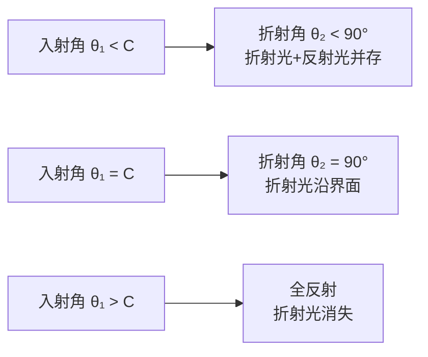

# 全反射与临界角

> [!abstract] 概览
> 全反射是几何光学中最具工程价值的现象——当光由光密介质射向光疏介质、且入射角达到某一临界值时，折射光完全消失，光能全部反射回光密介质。这一现象的临界条件由临界角 $C$ 描述，满足 $\sin C = 1/n$。全反射既不是普通反射（无须镀膜，反射率可达 100%），也不是普通折射（无能量透过界面），而是折射定律在入射角超过临界角时的"几何失效"导致的能量全反射。本节核心掌握三件事：① 全反射现象与发生条件（光密→光疏、入射角≥临界角）；② 临界角公式 $\sin C=1/n$ 的推导与应用；③ 全反射的两大工程应用——光导纤维（光纤通信的物理基础）与全反射棱镜（潜望镜、双筒望远镜中的倒置棱镜）。本节是 [[03-光的折射与折射率]] 中斯涅尔定律 $n_1\sin\theta_1=n_2\sin\theta_2$ 的极限情形，也是 [[02-棱镜与色散]] 中色散分析的前置基础。

## 核心概念

### 一、光密介质与光疏介质

**光密介质**：折射率较大（光速较小）的介质；
**光疏介质**：折射率较小（光速较大）的介质。

> [!note] "密"与"疏"是相对概念
> "光密""光疏"==仅由折射率大小比较决定==，与介质的"密度"无关。例如水的密度大于酒精，但水 ($n=1.33$) 是光密介质，酒精 ($n\approx 1.36$) 实际上是光密于水——请以 $n$ 为唯一判据。再如空气 ($n\approx1$) 与玻璃 ($n=1.5$)，玻璃是光密介质，空气是光疏介质。

类比：把"光在介质中行进"想象为"人在人群中行走"——人越挤（光密），行进越慢 ($v=c/n$ 越小)；人越稀（光疏），行进越快。

### 二、全反射现象

**全反射**：光从==光密介质==射向==光疏介质==时，入射角 $\theta_1$ 大于或等于某一临界角 $C$ 时，折射光消失，==入射光能量全部沿反射方向返回光密介质==的现象。

由斯涅尔定律 $n_1\sin\theta_1 = n_2\sin\theta_2$，当 $n_1>n_2$（光密→光疏）时，$\sin\theta_2 = \dfrac{n_1}{n_2}\sin\theta_1 > \sin\theta_1$，即==折射角大于入射角==。当 $\theta_1$ 增大至使 $\sin\theta_2 = 1$（即 $\theta_2 = 90°$）时，折射光沿界面传播；进一步增大 $\theta_1$，$\sin\theta_2$ 将大于 1，几何上无解——物理上对应折射光消失，能量全部反射。

### 三、全反射的发生条件

全反射必须==同时==满足两个条件：

1. **光从光密介质射向光疏介质**（$n_1>n_2$）；
2. **入射角大于或等于临界角**（$\theta_1 \geq C$）。

> [!warning] 光疏→光密不会发生全反射
> 若光从光疏介质射向光密介质（如空气→水），折射角恒小于入射角，无论入射角多大，折射光都不会消失，故==不可能发生全反射==。这是高考常见的"陷阱选项"。

### 四、临界角

**临界角** $C$：光从光密介质射向光疏介质时，使折射角等于 $90°$ 的入射角。

由斯涅尔定律（设光密介质折射率为 $n_1$，光疏介质折射率为 $n_2$，且 $n_1>n_2$）：
$$
n_1 \sin C = n_2 \sin 90° = n_2
$$
$$
\boxed{\,\sin C = \dfrac{n_2}{n_1}\,}
$$

**最常见情形**：光由介质（折射率 $n$）射向空气（$n\approx 1$）：
$$
\boxed{\,\sin C = \dfrac{1}{n}\,}
$$

| 介质 | 折射率 $n$ | 临界角 $C$（介质→空气） |
| --- | --- | --- |
| 水 | $1.33$ | $\approx 48.8°$ |
| 普通玻璃 | $1.50$ | $\approx 41.8°$ |
| 重火石玻璃 | $1.65$ | $\approx 37.2°$ |
| 钻石 | $2.42$ | $\approx 24.4°$ |

> [!tip] 钻石为何璀璨
> 钻石折射率 $n=2.42$，临界角仅 $24.4°$，意味着入射角大于 $24.4°$ 的光都会在内部全反射。工匠按特定角度切割钻石，使大部分入射光在内部多次全反射后从顶部射出，形成"火彩"闪烁的效果。这是物理学与珠宝工艺完美结合的范例。

## 推导与原理

### 一、临界角公式的严格推导

设光由折射率 $n_1$ 的光密介质射向折射率 $n_2$ 的光疏介质，$n_1>n_2$。由斯涅尔定律：
$$
n_1\sin\theta_1 = n_2\sin\theta_2
$$
随着 $\theta_1$ 从 $0°$ 增大到 $90°$，$\sin\theta_2 = \dfrac{n_1}{n_2}\sin\theta_1$ 从 $0$ 单调增大。

- 当 $\sin\theta_2 < 1$（即 $\theta_2 < 90°$）：有折射光，部分能量透射；
- 当 $\sin\theta_2 = 1$（即 $\theta_2 = 90°$）：折射光沿界面传播，定义此时的 $\theta_1 = C$；
- 当 $\sin\theta_2 > 1$：几何无解，物理上对应折射光消失，全反射发生。

临界条件：
$$
n_1\sin C = n_2 \cdot 1 \quad\Longrightarrow\quad \sin C = \dfrac{n_2}{n_1}
$$

若光疏介质为空气 ($n_2\approx 1$)，则 $\sin C = 1/n_1$，记 $n_1=n$：
$$
\boxed{\,\sin C = \dfrac{1}{n}\,}
$$

### 二、全反射的能量分析（定性）

由经典电磁理论（菲涅耳公式）可知，全反射发生时反射率 $R=1$，即==入射光能量 100% 反射==。但需注意，光疏介质中并非"完全没有电磁场"——存在一个沿界面方向快速衰减的"倏逝波"（evanescent wave），其振幅按 $e^{-z/\delta}$ 衰减，渗透深度 $\delta\sim\lambda$ 量级。这一现象在大学 [[物理光学]] 中讨论，是光纤耦合、近场显微镜等技术的物理基础。

> [!example] 全反射与普通反射的区别
> 普通镜面反射（如镀银镜面）反射率约 90%~98%，总有部分能量被吸收或透射；而全反射的反射率理论上达 100%，无能量损失。这就是为何高质量光学仪器（如双筒望远镜）使用全反射棱镜而非镀膜反射镜——光损失更少、成像更亮。

## 典型实例与类比

### 实例 1：光导纤维（光纤）

**光纤结构**：由==纤芯==（高折射率 $n_1$）与==包层==（低折射率 $n_2<n_1$）两层玻璃纤维构成，外加保护涂层。

**传光原理**：光从光纤一端以适当角度进入纤芯，在纤芯—包层界面发生==全反射==，光在纤芯内"之"字形传播，最终从另一端射出。只要入射角满足 $\theta\geq C_{12}$（其中 $\sin C_{12}=n_2/n_1$），光就能无损耗（理论上）传输极远距离。

**光纤通信的优势**：
- ==容量大==：一根光纤可同时传输数百万路电话或数十路高清电视；
- ==损耗低==：现代石英光纤损耗约 $0.2\,\text{dB/km}$，可传输数十公里不需中继；
- ==抗干扰==：光信号不受电磁干扰，特别适合高压、强电磁环境；
- ==重量轻、抗腐蚀==：玻璃纤维细如发丝，化学性质稳定；
- ==保密性强==：光信号在纤芯内全反射，几乎不外泄。

> [!note] 数值孔径（拓展）
> 光纤能接收光的最大入射角 $\theta_{\max}$ 由数值孔径 $NA$ 决定：$NA = \sin\theta_{\max} = \sqrt{n_1^2 - n_2^2}$。$NA$ 越大，光纤集光能力越强，但带宽会下降——这是大学 [[光学]] 与通信工程的重要内容。

### 实例 2：全反射棱镜

**全反射棱镜**：利用全反射改变光路的等腰直角棱镜（顶角 $90°$）。常见两种用法：

1. **倒置棱镜（转像）**：光线从一个直角面垂直射入，在斜面发生全反射（入射角 $45°$ > 玻璃—空气临界角 $41.8°$），从另一直角面垂直射出，==光路改变 90°==，像上下倒置；
2. **潜望镜**：两块全反射棱镜组合使用，使光路"Z"形折转，可在掩体、潜艇中观察外部景象。

> [!tip] 为何用全反射棱镜而非平面镜
> 平面镜镀层反射率约 90%~95%，且镀层易氧化脱落；全反射棱镜反射率接近 100%，且无需镀膜、寿命长、稳定性高。高档双筒望远镜、单反相机取景器均使用全反射棱镜。

### 实例 3：海市蜃楼

**海市蜃楼**：因大气层温度不均导致空气折射率梯度分布，远处物体经弯曲光路成像的视错觉现象。

- **下现蜃景**（常见于沙漠、炎热路面）：地表温度高，近地空气密度小、折射率小，高空空气密度大、折射率大。远处物体发出的光向地面弯曲，观察者看到物体==倒立的虚像==位于实际物体下方；
- **上现蜃景**（常见于海面、极地）：海面冷、上层暖，近海面空气折射率大、高空折射率小，光向上弯曲，观察者看到物体==正立的虚像==位于实际物体上方。

海市蜃楼本质是==连续折射==而非单一界面全反射，但在某些极端条件下，光路弯曲可视为"梯度折射率介质中的全反射"——这一思想在梯度折射率光纤（GRIN 光纤）中有重要应用。

### 实例 4：自行车尾灯

自行车尾灯由许多小直角锥体反射器组成，光从正面射入后，在锥体内==经两次全反射==沿原方向返回。这种"角反射器"结构使来自任何方向的前车灯光都能强烈反射回去，提醒司机注意——这是全反射在交通安全中的典型应用。

> [!tip] 记忆口诀
> ==光密射向光疏，入射大于临界；全反射无折射光，能量全部回程。光纤通信传万里，全靠纤芯包层比；棱镜倒像潜望镜，海市蜃楼因气层。==

## 例题

### 例 1：基础——临界角的计算

**题目**：已知某玻璃对空气的折射率 $n=1.5$，求光从玻璃射向空气时的临界角 $C$；若一束光以 $45°$ 入射角从玻璃射向空气，会发生什么现象？

**分析**：直接应用临界角公式 $\sin C = 1/n$。比较入射角与临界角大小判断是否发生全反射。

**解答**：
$$
\sin C = \dfrac{1}{n} = \dfrac{1}{1.5} \approx 0.667
$$
$$
C = \arcsin(0.667) \approx 41.8°
$$

入射角 $45° > 41.8°$，==满足全反射条件==，故发生全反射——折射光消失，光全部反射回玻璃。

**点评**：本题是全反射最基础的应用。要熟记"普通玻璃临界角约 $41.8°$"这一数据，可快速判断 $45°$ 棱镜中的全反射。

### 例 2：中难——光纤数值孔径的计算

**题目**：某光纤纤芯折射率 $n_1=1.50$，包层折射率 $n_2=1.40$。求：
（1）纤芯—包层界面的临界角 $C_{12}$；
（2）光从空气进入光纤端面后能在光纤中全反射传播的最大入射角 $\theta_{\max}$（即空气—端面入射角的最大值）。

**分析**：
（1）光由纤芯（光密 $n_1$）射向包层（光疏 $n_2$），临界角满足 $\sin C_{12}=n_2/n_1$；
（2）设光在端面折射后进入纤芯的折射角为 $\theta_r$，则 $n_{\text{空气}}\sin\theta_{\max} = n_1\sin\theta_r$。在纤芯—包层界面入射角 $\theta_i = 90°-\theta_r$，全反射条件 $\theta_i\geq C_{12}$ 即 $\theta_r \leq 90°-C_{12}$。故 $\theta_{\max}$ 对应 $\theta_r = 90°-C_{12}$。

**解答**：
（1）
$$
\sin C_{12} = \dfrac{n_2}{n_1} = \dfrac{1.40}{1.50} \approx 0.933,\quad C_{12}\approx 69.0°
$$

（2）当 $\theta_r = 90°-C_{12}$ 时：
$$
\sin\theta_r = \sin(90°-C_{12}) = \cos C_{12} = \sqrt{1-\sin^2 C_{12}} = \sqrt{1-(n_2/n_1)^2}
$$
$$
\sin\theta_{\max} = n_1\sin\theta_r = n_1\sqrt{1-(n_2/n_1)^2} = \sqrt{n_1^2-n_2^2}
$$
代入数据：
$$
\sin\theta_{\max} = \sqrt{1.50^2-1.40^2} = \sqrt{2.25-1.96} = \sqrt{0.29} \approx 0.539
$$
$$
\theta_{\max} \approx 32.6°
$$

**点评**：本题揭示了光纤数值孔径 $NA=\sqrt{n_1^2-n_2^2}$ 的来源。==$\theta_{\max}$ 越大，光纤集光能力越强==。注意全反射发生在纤芯—包层界面（侧面），而非端面——这是常见混淆点。

### 例 3：中难——全反射棱镜的角度判断

**题目**：一等腰直角玻璃棱镜（$n=1.5$），顶角 $90°$，两底角各 $45°$。一束光垂直于一直角面射入棱镜，射到斜面时是否会发生全反射？若该玻璃折射率变为 $n=1.30$，结果又如何？

**分析**：光垂直射入直角面时不发生折射，光在棱镜内沿原方向传播至斜面。在斜面处，入射角等于棱镜的底角 $45°$。比较 $45°$ 与临界角 $C=\arcsin(1/n)$ 大小。

**解答**：
（1）$n=1.5$ 时：
$$
\sin C = \dfrac{1}{1.5}\approx 0.667,\quad C\approx 41.8°
$$
入射角 $45° > 41.8°$，==发生全反射==。

（2）$n=1.30$ 时：
$$
\sin C = \dfrac{1}{1.30}\approx 0.769,\quad C\approx 50.3°
$$
入射角 $45° < 50.3°$，==不发生全反射==，光在斜面同时发生反射与折射，部分光从斜面射出棱镜。

**点评**：全反射棱镜的设计对材料折射率有要求——==$n$ 必须足够大==，才能使 $45°$ 入射角超过临界角。普通玻璃 ($n\approx1.5$) 满足条件；若用低折射率材料（如某些塑料 $n\approx1.3$）则不能用作全反射棱镜。这也是为何高质量光学仪器坚持使用高折射率光学玻璃。

## 易错提醒

> [!warning] 易错点
> 1. **方向判断错**：误以为"光疏→光密"也能全反射。==全反射只发生在光密→光疏方向==。
> 2. **临界角公式记混**：$\sin C=1/n$ 仅适用于"介质→空气"；一般情形应为 $\sin C=n_2/n_1$。
> 3. **折射角与入射角大小关系**：光密→光疏时，==折射角恒大于入射角==，这是全反射的前提。
> 4. **光纤端面入射与侧面全反射混淆**：光在端面是普通折射（空气→纤芯），全反射发生在纤芯—包层侧面。
> 5. **临界角对应"折射角 = 90°"**：而非入射角 = 90°。临界角是入射角的特殊值。
> 6. **海市蜃楼误认为单一界面全反射**：实际是==连续折射==，光路渐弯，非一个界面的全反射。

> [!note] 概念辨析
> **全反射 vs 镜面反射**
>
> | 项目 | 镜面反射 | 全反射 |
> | --- | --- | --- |
> | 发生条件 | 任何界面均可 | 仅光密→光疏、入射角≥临界角 |
> | 反射率 | 90%~98%（受镀膜限制） | 100%（理论值） |
> | 是否有折射光 | 一般有（除非吸收） | 无（折射光消失） |
> | 应用 | 平面镜、镀膜镜 | 光纤、全反射棱镜 |
>
> **临界角 vs 折射角**
> 临界角是==入射角==的特殊值（使折射角=90°），不是折射角本身。临界角只对"光密→光疏"方向有意义。

## 与其他知识关联

- 与 [[01-全反射与临界角]] 的关系：本节即全反射核心知识，奠定光纤、棱镜等器件原理。
- 与 [[02-棱镜与色散]] 的关系：全反射棱镜是棱镜的重要应用；色散棱镜的折射规律基于斯涅尔定律。
- 与 [[03-薄透镜成像规律]] 的关系：透镜成像基于折射，与全反射同为光在介质界面的行为。
- 与 [[04-透镜成像作图与公式]] 的关系：透镜成像公式与全反射临界角公式共同构成几何光学核心方程。
- 与 [[03-光的折射与折射率]] 的关系：斯涅尔定律是临界角公式的直接来源。
- 与 [[04-费马原理与光程]] 的关系：全反射可由费马原理导出，是光程取极值的特殊情形。
- 与 [[03-光的波动性/01-光的干涉]] 的关系：全反射时存在的倏逝波是干涉实验的重要工具。
- 高中—大学衔接：[[物理光学]]、[[光学]]（菲涅耳公式、倏逝波、GRIN 光纤）、[[电动力学]]（电磁波在介质界面的反射与折射）。
- 与力学联系：[[机械振动]]（光纤通信中光波即电磁波，与机械波共享波动方程）。
- 与电学联系：[[06-电磁波与传感器/02-电磁波谱]]（光是电磁波，光纤传输的是红外光信号）、[[05-交变电流/01-交流电的产生与描述]]（光波与交变电流都是波动）。
- 与热学联系：[[03-热力学定律/04-熵与热力学第三定律]]（黑体辐射是光纤通信光源的理论背景之一）。
- 返回 [[00-光学总览]]

## 作者的话

> [!quote] 个人理解
> 全反射是高中光学中"少有的工程化"概念——它不仅是试卷上的一个公式 $\sin C=1/n$，更是支撑现代通信产业的物理基石。==一条横跨太平洋的海底光缆，能让远在地球另一端的视频通话毫秒级到达==，靠的就是石英玻璃中无数次无声的全反射。学习全反射，建议把握三条线索：① ==理论线索==：由斯涅尔定律推导临界角公式，理解"折射角>1 时几何失效"的物理含义；② ==器件线索==：光纤、全反射棱镜、自行车尾灯三个典型应用，覆盖通信、成像、安全三个领域；③ ==误区线索==：方向（光密→光疏）、入射角（≥临界角）、折射角（=90°）三个关键角的关系，是高考选择题的"陷阱富集区"。
>
> 在更深的层面，全反射的"100% 反射"并非神秘——它是麦克斯韦方程组在介质界面的精确解。临界条件下，光疏介质一侧虽无传播波，却存在倏逝波，能量沿界面方向流动但在垂直方向衰减。利用倏逝波耦合，可制作"光纤耦合器""近场扫描显微镜"等精密仪器——这是大学 [[光学]] 的精彩内容。
>
> 光纤通信的扩展思考：现代互联网的"血管"是光纤，而光纤的"灵魂"是全反射。从 1970 年康宁公司制成第一根低损耗光纤（损耗 $20\,\text{dB/km}$）到今天 $0.2\,\text{dB/km}$ 的工程极限，每一分贝的下降都凝聚着材料科学、量子物理、精密制造的进步。==当我们刷短视频、与远方亲人视频通话时，不妨想想：那些数字比特正在地球深处某根细如发丝的玻璃纤维中以全反射的方式飞速穿行，这是物理学送给人类最浪漫的礼物之一==。

---
*返回 [[00-光学总览]]*
