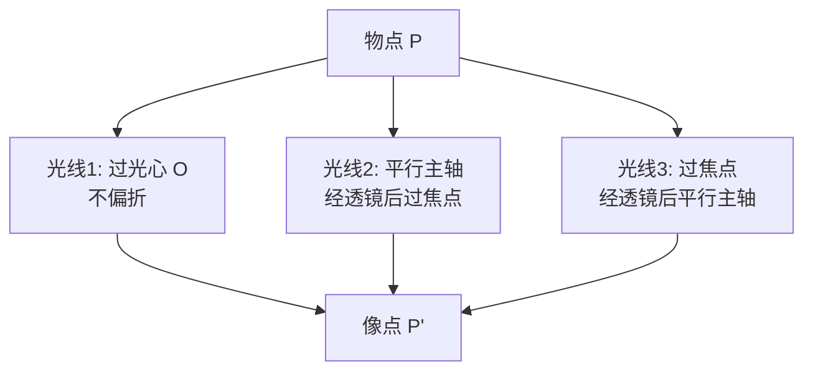

# 薄透镜成像规律

> [!abstract] 概览
> 透镜是几何光学中最重要的成像元件——从人眼到相机、从显微镜到望远镜，几乎所有成像系统都建立在透镜的折射成像原理上。本节研究==薄透镜==（厚度远小于焦距的透镜）的成像规律，核心内容包括：凸透镜（会聚透镜）与凹透镜（发散透镜）的结构与原理、焦点焦距概念、三条特殊光线作图法、成像规律表（物距—像距—像性质）、放大率公式 $m=v/u$。凸透镜成实像时的"两倍焦距分大小、一倍焦距分虚实"是高考必考的"分界点"规律；凹透镜恒成正立缩小虚像的特征使其成为近视眼镜的物理基础。本节是 [[03-光的折射与折射率]] 中折射定律在球面界面的综合应用，与 [[04-透镜成像作图与公式]] 中的成像公式 $\dfrac{1}{u}+\dfrac{1}{v}=\dfrac{1}{f}$ 共同构成透镜成像的完整理论，也是后续学习光学仪器（眼睛、放大镜、显微镜、望远镜）的基础。

## 核心概念

### 一、薄透镜的定义

**薄透镜**：透镜的==厚度远小于==其焦距（即两球面顶点间距可忽略）的透镜。在薄透镜近似下，光通过透镜的光程可视为在同一平面（透镜平面）内发生，简化了成像分析。

实际透镜若厚度不能忽略，称为厚透镜，需用更复杂的矩阵光学分析——这是大学 [[光学]] 的内容。

### 二、凸透镜与凹透镜

按几何形状与光学性质，透镜分为两大类：

| 类型 | 几何特征 | 光学性质 | 焦点性质 |
| --- | --- | --- | --- |
| **凸透镜**（会聚透镜） | 中央厚、边缘薄（双凸、平凸、弯凸） | 对光有==会聚作用== | 实焦点（$f>0$） |
| **凹透镜**（发散透镜） | 中央薄、边缘厚（双凹、平凹、弯凹） | 对光有==发散作用== | 虚焦点（$f<0$） |

> [!note] 透镜的"凸凹"是从几何形状命名
> 凸透镜中央比边缘厚，凹透镜中央比边缘薄。==判断透镜类型最直观的方法==：用手指轻触中央——比边缘厚的是凸透镜，比边缘薄的是凹透镜。

**透镜的会聚/发散原理**：透镜可视为许多小棱镜的组合。凸透镜中所有小棱镜都使光向==中心偏折==（棱镜使光向底面偏折，凸透镜的"底面"朝中心），故整体会聚；凹透镜则使光向==边缘偏折==，故整体发散。

### 三、焦点与焦距

**主光轴**：通过透镜两球面曲率中心的直线。

**光心** $O$：主光轴上一点，光通过该点时不发生偏折（薄透镜近似下，光心位于透镜中心）。

**焦点** $F$：平行于主光轴的光经透镜后会聚（凸透镜）或反向延长会聚（凹透镜）的点。
- **凸透镜**：实焦点，光线真正会聚的点，位于透镜两侧，各距光心 $f$；
- **凹透镜**：虚焦点，光线反向延长的会聚点，位于透镜两侧，各距光心 $|f|$。

**焦距** $f$：焦点到光心的距离。凸透镜 $f>0$，凹透镜 $f<0$。

> [!important] 焦距决定透镜的"本领"
> ==焦距越短，透镜的偏折能力越强==。这一定性关系在 [[04-透镜成像作图与公式]] 中由公式 $\dfrac{1}{f}=\dfrac{1}{u}+\dfrac{1}{v}$ 严格化——焦距的倒数 $1/f$ 称为"焦度"，单位屈光度（D），$1\,\text{D}=1\,\text{m}^{-1}$。眼镜度数即为焦度的 100 倍：$100\,\text{度}=1\,\text{D}$。

### 四、三条特殊光线

透镜成像作图依赖三条特殊光线，这是 [[04-透镜成像作图与公式]] 的核心工具：

1. **过光心的光线**：经过光心 $O$ 的光线==不偏折==，沿原方向继续传播（凸透镜、凹透镜均成立）；
2. **平行于主光轴的光线**：经透镜后过焦点（凸透镜过异侧焦点 $F'$，凹透镜反向延长过同侧焦点 $F$）；
3. **过焦点的光线**：经透镜后==平行于主光轴==射出（凸透镜过同侧焦点 $F$；凹透镜指延长线过异侧焦点 $F'$ 的光线，折射后平行于主光轴）。

> [!tip] 三条光线的选择
> 作图时只需任选==两条==特殊光线即可确定像点（第三条用于验证）。物点在主光轴上时，需用"副光轴+焦平面"辅助作图——这是 [[04-透镜成像作图与公式]] 的进阶内容。

### 五、透镜成像规律表

凸透镜成像规律随物距 $u$ 变化，可分五个区间讨论。设焦距为 $f$（$f>0$）。

| 物距 $u$ | 像距 $v$ | 像的虚实 | 像的正倒 | 像的大小 | 放大率 $m$ | 应用 |
| --- | --- | --- | --- | --- | --- | --- |
| $u>2f$ | $f<v<2f$ | 实像 | 倒立 | 缩小 | $|m|<1$ | 照相机、人眼 |
| $u=2f$ | $v=2f$ | 实像 | 倒立 | 等大 | $|m|=1$ | 焦距测量 |
| $f<u<2f$ | $v>2f$ | 实像 | 倒立 | 放大 | $|m|>1$ | 投影仪、幻灯机 |
| $u=f$ | $v\to\infty$ | 不成像（平行光射出） | — | — | — | 探照灯、准直 |
| $u<f$ | $v<0$（同侧虚像） | 虚像 | 正立 | 放大 | $m>1$ | 放大镜 |

凹透镜成像规律简单：==恒成正立缩小虚像==，像与物同侧，像距 $|v|<u$。

> [!important] 凸透镜成像的两个"分界点"
> - ==一倍焦距分虚实==：$u=f$ 是实像与虚像的分界点。$u>f$ 成实像，$u<f$ 成虚像，$u=f$ 不成像。
> - ==两倍焦距分大小==：$u=2f$ 是放大与缩小的分界点。$u>2f$ 像缩小，$u<2f$ 像放大（$u=2f$ 等大）。
>
> 这是高考必背的核心规律！

### 六、放大率

**横向放大率** $m$：像高与物高之比。

$$
\boxed{\,m = \dfrac{v}{u} = \dfrac{\text{像高}}{\text{物高}}\,}
$$

- $|m|>1$：像放大；
- $|m|<1$：像缩小；
- $|m|=1$：像等大；
- $m>0$：像正立（虚像）；
- $m<0$：像倒立（实像）。

> [!note] 放大率的符号
> 若采用"绝对值"约定，$m=|v|/u$（$u$ 恒正，$v$ 取绝对值），则 $m>0$ 恒成立，正倒由像的虚实判断。两种约定在高中均常见，==高考题中 $m$ 通常取绝对值==，但有些教材保留符号以同时表达正倒信息。

## 推导与原理

### 一、凸透镜成像公式的推导（特殊光线法）

设凸透镜焦距 $f$，物距 $u$，像距 $v$，物高 $h$，像高 $h'$。利用两条特殊光线：

1. 过光心的光线：从物点 $P$ 出发过光心 $O$ 直线传播；
2. 平行主轴的光线：从物点 $P$ 平行主轴入射，经透镜后过异侧焦点 $F'$。

两光线在像方交于像点 $P'$。由相似三角形（$\triangle POO_1 \sim \triangle P'OO_2$ 与 $\triangle F'OO_2 \sim \triangle F'PP_1$）：
$$
\dfrac{h'}{h} = \dfrac{v}{u},\quad \dfrac{h'}{h} = \dfrac{v-f}{f}
$$
两式联立：
$$
\dfrac{v}{u} = \dfrac{v-f}{f} \quad\Longrightarrow\quad vf = u(v-f) = uv - uf
$$
$$
uv = uf + vf \quad\Longrightarrow\quad \boxed{\,\dfrac{1}{u} + \dfrac{1}{v} = \dfrac{1}{f}\,}
$$

这就是==薄透镜成像公式==（高斯公式），适用于凸透镜与凹透镜，配合符号法则使用。

### 二、符号法则

为使公式 $\dfrac{1}{u}+\dfrac{1}{v}=\dfrac{1}{f}$ 普遍适用，约定：

| 量 | 正值含义 | 负值含义 |
| --- | --- | --- |
| 物距 $u$ | 实物（物在透镜左方） | 虚物（罕见，多透镜系统） |
| 像距 $v$ | 实像（像在透镜右方） | 虚像（像在透镜左方，与物同侧） |
| 焦距 $f$ | 凸透镜（实焦点） | 凹透镜（虚焦点） |
| 放大率 $m=v/u$ | $m>0$ 正立，$m<0$ 倒立 | — |

> [!warning] 符号法则是高考最大陷阱
> ==凹透镜 $f$ 取负值，虚像 $v$ 取负值==。许多学生在代入凹透镜问题时忘记取负，导致结果完全相反。强烈建议在计算前先列出"已知量符号表"，明确每个量的正负。

### 三、凸透镜成像的分段讨论

利用成像公式 $\dfrac{1}{u}+\dfrac{1}{v}=\dfrac{1}{f}$，可分析不同物距 $u$ 下的像：

**1. $u>2f$（远物成像）**：
$$
v = \dfrac{uf}{u-f},\quad u-f>f\Rightarrow v<2f;\quad u>2f\Rightarrow v>f
$$
故 $f<v<2f$，$|m|=v/u<1$，==倒立缩小实像==。应用：照相机。

**2. $u=2f$**：
$$
v = \dfrac{2f\cdot f}{2f-f} = 2f,\quad |m|=1
$$
==倒立等大实像==。应用：测焦距。

**3. $f<u<2f$（近物成像）**：
$$
v = \dfrac{uf}{u-f}>2f,\quad |m|>1
$$
==倒立放大实像==。应用：投影仪、幻灯机。

**4. $u=f$（焦点上）**：
$$
v = \dfrac{f\cdot f}{f-f}\to\infty
$$
==不成像==，平行光射出。应用：探照灯、准直镜。

**5. $u<f$（焦点内）**：
$$
v = \dfrac{uf}{u-f}<0\quad(\text{因 } u-f<0)
$$
==正立放大虚像==，像与物同侧。应用：放大镜。

### 四、凹透镜成像的统一规律

凹透镜 $f<0$，由 $\dfrac{1}{u}+\dfrac{1}{v}=\dfrac{1}{f}<0$，得：
$$
\dfrac{1}{v} = \dfrac{1}{f} - \dfrac{1}{u} < 0 \quad\Longrightarrow\quad v<0
$$
==像距 $v$ 恒为负==，即恒成虚像；且 $|v|<u$（因 $\dfrac{1}{|v|} = \dfrac{1}{|f|}+\dfrac{1}{u} > \dfrac{1}{u}$，故 $|v|<u$），故 $|m|=|v|/u<1$，==恒缩小==。综合：凹透镜==恒成正立缩小虚像==，与物同侧。

> [!tip] 凹透镜成像口诀
> ==凹透镜，恒虚像，正立缩小同侧放；不论物距远近，永远缩小不变样。==

## 典型实例与类比

### 实例 1：照相机——凸透镜 $u>2f$ 情形

照相机镜头相当于凸透镜，被摄物体在二倍焦距之外，==在底片（或 CMOS）上成倒立缩小实像==。改变物距时需调节镜头前后位置（对焦），使像清晰落在感光元件上。

### 实例 2：放大镜——凸透镜 $u<f$ 情形

放大镜是短焦距凸透镜，物体放在焦点之内（$u<f$），==透过透镜看到正立放大虚像==。虚像位于物体同侧，远于物体（即像距 $|v|>u$）。明视距离 $25\,\text{cm}$ 处成像时，放大率约 $M=1+25/f$（$f$ 以 cm 为单位）。

### 实例 3：投影仪——凸透镜 $f<u<2f$ 情形

投影仪将幻灯片（物）放在一倍焦距与二倍焦距之间，==在屏幕上成倒立放大实像==。为使屏幕上的图像正立，需将幻灯片倒置放置——这是"倒立实像"的直接应用。

### 实例 4：近视眼镜——凹透镜

近视眼晶状体折光过强，像成在视网膜前。矫正方法：戴凹透镜（发散透镜）使光线先发散，==经眼内折射后像后移至视网膜==。凹透镜的"恒正立缩小虚像"特性使其不影响物体方位，仅使光线发散。眼镜度数 $D=100/f$（$f$ 以 m 为单位，凹透镜 $f<0$，度数为负）。

### 实例 5：透镜类比"水桶放大镜"

将一个透明水杯装满水，水杯中央比边缘厚，等效于==柱面凸透镜==，可放大物体。这一现象可在家中简单实验验证。古代"冰透镜"——用冰磨制凸透镜取火，也是同一原理。

> [!tip] 记忆口诀
> ==凸透镜成实像倒立，虚像正立；凹透镜恒成虚像正立缩小。一倍焦距分虚实，两倍焦距分大小；实像异侧倒，虚像同侧正；远物成小像，近物成大像。==

## 例题

### 例 1：基础——凸透镜成像基础计算

**题目**：凸透镜焦距 $f=10\,\text{cm}$，物体高 $h=2\,\text{cm}$，置于透镜前 $u=30\,\text{cm}$ 处。求像距 $v$、像高 $h'$、像的性质。

**分析**：$u=30\,\text{cm}>2f=20\,\text{cm}$，应成倒立缩小实像。代入成像公式求 $v$，再由放大率求 $h'$。

**解答**：
$$
\dfrac{1}{v} = \dfrac{1}{f} - \dfrac{1}{u} = \dfrac{1}{10} - \dfrac{1}{30} = \dfrac{3-1}{30} = \dfrac{2}{30} = \dfrac{1}{15}
$$
$$
v = 15\,\text{cm}\quad(\text{满足 } f<v<2f)
$$
放大率：
$$
m = \dfrac{v}{u} = \dfrac{15}{30} = 0.5
$$
$$
h' = m\cdot h = 0.5 \times 2 = 1\,\text{cm}
$$

像的性质：==倒立、缩小、实像==，位于透镜另一侧 $15\,\text{cm}$ 处。

**点评**：本题验证"远物成小像"——$u>2f$ 时 $v<2f$ 且 $|m|<1$。照相机的成像正是这一原理。

### 例 2：中难——放大镜成像

**题目**：用焦距 $f=5\,\text{cm}$ 的凸透镜作放大镜观察一个高 $1\,\text{mm}$ 的小物体，物体放在透镜前 $u=3\,\text{cm}$ 处。求像距 $v$、像高 $h'$、放大率 $m$，并说明像的性质。

**分析**：$u=3\,\text{cm}<f=5\,\text{cm}$，应成正立放大虚像。代入成像公式（注意 $v<0$）。

**解答**：
$$
\dfrac{1}{v} = \dfrac{1}{f} - \dfrac{1}{u} = \dfrac{1}{5} - \dfrac{1}{3} = \dfrac{3-5}{15} = -\dfrac{2}{15}
$$
$$
v = -7.5\,\text{cm}
$$

像距为负，==虚像在物体同侧==，距透镜 $7.5\,\text{cm}$。

放大率：
$$
m = \dfrac{|v|}{u} = \dfrac{7.5}{3} = 2.5
$$
$$
h' = m\cdot h = 2.5 \times 1 = 2.5\,\text{mm}
$$

像的性质：==正立、放大、虚像==，位于物体同侧 $7.5\,\text{cm}$ 处。

**点评**：放大镜是 $u<f$ 情形的典型应用。注意==虚像 $v<0$==，但放大率取绝对值 $|m|=|v|/u$。$|m|=2.5$ 表示像比物大 2.5 倍。

### 例 3：中难——凹透镜成像

**题目**：凹透镜焦距 $f=-15\,\text{cm}$（虚焦点），物体高 $h=4\,\text{cm}$，置于透镜前 $u=20\,\text{cm}$ 处。求像距 $v$、像高 $h'$，并说明像的性质。

**分析**：凹透镜 $f<0$，应成正立缩小虚像。代入成像公式，注意 $f$ 取负值。

**解答**：
$$
\dfrac{1}{v} = \dfrac{1}{f} - \dfrac{1}{u} = \dfrac{1}{-15} - \dfrac{1}{20} = -\dfrac{4}{60} - \dfrac{3}{60} = -\dfrac{7}{60}
$$
$$
v = -\dfrac{60}{7} \approx -8.57\,\text{cm}
$$

像距为负，==虚像在物体同侧==，距透镜 $8.57\,\text{cm}$（$|v|<u$）。

放大率：
$$
m = \dfrac{|v|}{u} = \dfrac{8.57}{20} \approx 0.429
$$
$$
h' = m\cdot h = 0.429 \times 4 \approx 1.71\,\text{cm}
$$

像的性质：==正立、缩小、虚像==，位于物体同侧 $8.57\,\text{cm}$ 处。

**点评**：凹透镜成像的关键是==焦距取负值 $f<0$==，由此算得 $v<0$（虚像）。$|v|<u$ 是凹透镜的恒成立条件，对应 $|m|<1$，即恒缩小。本题即近视眼镜的成像原理。

## 易错提醒

> [!warning] 易错点
> 1. **凸凹透镜焦点性质混淆**：凸透镜是==实焦点==（$f>0$），凹透镜是==虚焦点==（$f<0$）。
> 2. **符号法则忘取负**：凹透镜 $f<0$、虚像 $v<0$，代入公式时务必带符号。常见错误是凹透镜问题中 $f$ 代正值，得到荒谬结果。
> 3. **像的虚实判断错**：实像==倒立异侧==，虚像==正立同侧==。$v>0$ 实像，$v<0$ 虚像。
> 4. **放大率符号混淆**：$m=v/u$ 可正可负（带符号）；$m=|v|/u$ 恒正（取绝对值）。两种约定别混用。
> 5. **"两倍焦距分大小"理解错**：是指==$u=2f$ 是放大与缩小的分界==，不是说 $v=2f$ 时像大小变化。
> 6. **凹透镜误以为能成实像**：凹透镜==恒成虚像==，不可能成实像。
> 7. **$u=f$ 误以为成像**：$u=f$ 时 $v\to\infty$，==不成像==，出射光为平行光。

> [!note] 概念辨析
> **凸透镜 vs 凹透镜**
>
> | 项目 | 凸透镜 | 凹透镜 |
> | --- | --- | --- |
> | 几何形状 | 中央厚 | 中央薄 |
> | 光学性质 | 会聚 | 发散 |
> | 焦点 | 实焦点 ($f>0$) | 虚焦点 ($f<0$) |
> | 实像 | 可成（$u>f$） | 不成 |
> | 虚像 | 可成（$u<f$，正立放大） | 恒成（正立缩小） |
> | 应用 | 照相机、放大镜、远视镜 | 近视镜 |
>
> **实像 vs 虚像**
> - 实像：由==实际光线会聚==而成，可呈于光屏上，倒立，与物异侧；
> - 虚像：由==光线反向延长==会聚而成，不可呈于光屏，正立，与物同侧（凸透镜放大、凹透镜缩小）。

## 与其他知识关联

- 与 [[01-全反射与临界角]] 的关系：透镜成像与全反射同为光在介质界面的行为，前者是折射成像，后者是折射失效。
- 与 [[02-棱镜与色散]] 的关系：透镜存在==色差==（不同色光焦距不同），根源是色散现象。
- 与 [[03-薄透镜成像规律]] 的关系：本节即透镜成像核心规律。
- 与 [[04-透镜成像作图与公式]] 的关系：本节的成像公式与作图法在下一节深入展开，并推广到透镜组合与光学仪器。
- 与 [[03-光的折射与折射率]] 的关系：透镜成像本质是球面折射的综合，斯涅尔定律是基础。
- 与 [[04-费马原理与光程]] 的关系：透镜成像满足等光程原理——物点到像点所有光程相等，这是费马原理的体现。
- 与 [[03-光的波动性/01-光的干涉]] 的关系：薄膜干涉中透镜常用于会聚或扩展光束。
- 高中—大学衔接：[[物理光学]]、[[光学]]（厚透镜矩阵光学、像差理论、傅里叶光学）、[[电动力学]]（介质中的电磁波）。
- 与力学联系：[[机械振动]]（光波波动性）、[[动能与动量]]（光子动量）。
- 与电学联系：[[05-交变电流/01-交流电的产生与描述]]（光波也是波）、[[06-电磁波与传感器/02-电磁波谱]]（可见光是电磁波）。
- 与热学联系：[[03-热力学定律/04-熵与热力学第三定律]]（黑体辐射的波长分布）。
- 返回 [[00-光学总览]]

## 作者的话

> [!quote] 个人理解
> 薄透镜成像规律是高中光学的"中枢"——它既综合了折射定律的应用，又是后续光学仪器分析的基础。学习本节，建议把握三条线索：① ==结构线索==：凸透镜（中央厚、会聚、实焦点）与凹透镜（中央薄、发散、虚焦点）的对应关系，所有成像规律都源于这一结构差异；② ==规律线索==：凸透镜"一倍焦距分虚实、两倍焦距分大小"的五个区间，加上凹透镜"恒成正立缩小虚像"的统一规律，构成完整的成像图景；③ ==符号线索==：$f$、$v$ 的正负号约定（凸正凹负、实正虚负）是公式正确应用的关键，==高考丢分最多的就是符号==。
>
> 在更深的层面，透镜成像并非"魔法"——它只是斯涅尔定律在球面界面的系统应用。每个透镜可视为无数微小棱镜的组合，每个小棱镜使光按斯涅尔定律偏折，整体效果就是会聚或发散。薄透镜公式 $\dfrac{1}{u}+\dfrac{1}{v}=\dfrac{1}{f}$ 的优雅之处在于：它将无数个局部折射"压缩"为一个简洁的代数方程，这是物理学"化繁为简"思维的典范。
>
> 学习透镜成像还需注意==像差==的存在：实际透镜并非理想薄透镜，存在球差（远轴光线偏折更厉害）、色差（不同色光焦距不同）、彗差、像散等像差。这些像差限制了光学仪器的成像质量，需要通过==组合透镜（透镜组）==来消除——这正是 [[04-透镜成像作图与公式]] 中"透镜组合"的物理动机，也是高档相机镜头为何复杂昂贵的原因。一颗优秀的摄影镜头可能包含十几片甚至二十几片透镜，每一片都精心设计以消除特定像差，这是工程光学最精密的领域之一。
>
> 最后，建议把透镜与眼睛作类比——眼睛的晶状体就是一个生物凸透镜，视网膜就是"光屏"，近视远视的矫正正是凹透镜与凸透镜的直接应用。这种"物理学解释生物学"的视角，会让光学学习变得更有温度。

---
*返回 [[00-光学总览]]*
