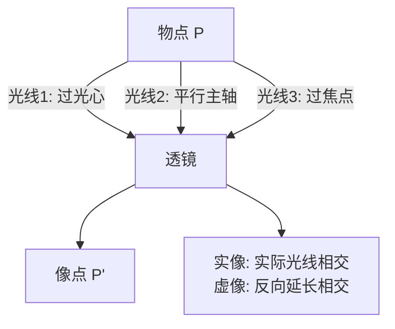
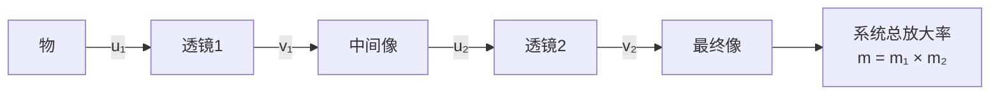

# 透镜成像作图与公式

> [!abstract] 概览
> 本节是 [[03-薄透镜成像规律]] 的延伸与综合——将"成像规律表"上升为"作图法+公式法"的双重工具，并推广到透镜组合与光学仪器分析。核心内容包括：① 透镜成像作图法（用三条特殊光线中的任意两条确定像点）；② 薄透镜成像公式 $\dfrac{1}{u}+\dfrac{1}{v}=\dfrac{1}{f}$ 与严格的符号法则（实物 $u>0$、实像 $v>0$、虚像 $v<0$、凸透镜 $f>0$、凹透镜 $f<0$）；③ 放大率公式 $m=v/u$ 的推导与符号含义；④ 透镜组合的逐级成像法（前一透镜的像作为后一透镜的物）；⑤ 光学仪器原理简介（眼睛、放大镜、显微镜、望远镜）。本节是几何光学的"工程化出口"——所有经典光学仪器（相机、显微镜、望远镜、眼镜）的原理分析都基于本节内容。掌握本节后即具备分析任意薄透镜系统成像的能力，为大学 [[光学]] 中的矩阵光学与像差理论奠定基础。

## 核心概念

### 一、透镜成像作图法

**作图法**：利用三条特殊光线中==任意两条==确定物点所对应的像点的方法。

**三条特殊光线**（与 [[03-薄透镜成像规律]] 一致）：

1. **过光心的光线**：经透镜后方向不变（不偏折）；
2. **平行于主光轴的光线**：经凸透镜后过异侧焦点 $F'$；经凹透镜后反向延长过同侧焦点 $F$；
3. **过焦点的光线**：凸透镜——过同侧焦点 $F$ 入射，经透镜后平行主轴；凹透镜——延长线过异侧焦点 $F'$ 入射，经透镜后平行主轴。

> [!important] 作图步骤
> 1. 标出透镜（凸/凹）、光心 $O$、主光轴、两侧焦点 $F, F'$（凸透镜实焦点，凹透镜虚焦点）；
> 2. 从物点 $P$ 任选两条特殊光线画出；
> 3. 找两光线经透镜后==实际==（实像）或==反向延长==（虚像）的交点，即像点 $P'$；
> 4. 验证：第三条特殊光线经透镜后也应过 $P'$（用于检查）。

### 二、副光轴与焦平面（拓展）

对于==轴外物点==或==主光轴上物点==，三条特殊光线可能不够用，需借助"副光轴+焦平面"作图：

- **副光轴**：过光心 $O$ 的任意直线（不一定是主光轴）；
- **焦平面**：过焦点且垂直于主光轴的平面。
  - 凸透镜：两侧各有一个焦平面（含焦点）；
  - 凹透镜：两侧各有一个虚焦平面。

**作图规则**：
1. 平行于某一副光轴的入射光，经透镜后过该副光轴与==像方焦平面==的交点（凸透镜）或反向延长过该交点（凹透镜）；
2. 过物方焦平面上一点的入射光，经透镜后==平行于该点与光心的连线==（副光轴方向）。

> [!note] 焦平面作图的用途
> 焦平面作图法主要用于==主光轴上物点==成像——此时三条特殊光线退化为同一条（沿主轴），需借助副光轴。这是高考压轴题的常考技巧。

### 三、薄透镜成像公式

由 [[03-薄透镜成像规律]] 推导：
$$
\boxed{\,\dfrac{1}{u} + \dfrac{1}{v} = \dfrac{1}{f}\,}
$$

其中 $u$ 为物距、$v$ 为像距、$f$ 为焦距。

### 四、公式符号法则（严格版）

| 量 | 正值 | 负值 | 备注 |
| --- | --- | --- | --- |
| 物距 $u$ | 实物（透镜左方） | 虚物（多透镜系统中可能出现） | 高中实物恒正 |
| 像距 $v$ | 实像（透镜右方，与物异侧） | 虚像（透镜左方，与物同侧） | 实正虚负 |
| 焦距 $f$ | 凸透镜（实焦点，会聚） | 凹透镜（虚焦点，发散） | 凸正凹负 |
| 放大率 $m=v/u$ | $m>0$：正立（虚像） | $m<0$：倒立（实像） | $|m|$ 表大小 |

> [!warning] 符号法则是高考最大陷阱
> ==凹透镜 $f<0$、虚像 $v<0$==。常见错误：① 凹透镜问题中 $f$ 代正值；② 凸透镜成虚像时 $v$ 代正值；③ 算出 $v<0$ 后误以为是错答案。强烈建议先列"已知量表"，明确正负再代入公式。

### 五、放大率公式

$$
\boxed{\,m = \dfrac{v}{u} = \dfrac{\text{像高 } h'}{\text{物高 } h}\,}
$$

- 取带符号：$m=v/u$，$m>0$ 正立虚像，$m<0$ 倒立实像；
- 取绝对值：$m=|v|/u$，恒正，仅描述大小（高考常用）。

## 推导与原理

### 一、成像公式的严格推导（特殊光线法）

设凸透镜焦距 $f$，物 $PQ$ 高 $h$，置于透镜前 $u$ 处，像 $P'Q'$ 高 $h'$，像距 $v$。

利用两条特殊光线：
1. 过光心 $O$ 的光线 $PO$：直线穿过透镜，到 $P'$；
2. 平行主轴的光线 $PA$（$A$ 为透镜上一点）：经透镜后过异侧焦点 $F'$，到 $P'$。

由 $\triangle POO_1 \sim \triangle P'OO_2$（$O_1, O_2$ 分别为 $P, P'$ 在主轴上的垂足）：
$$
\dfrac{h'}{h} = \dfrac{v}{u}\quad\cdots(1)
$$

由 $\triangle F'AO \sim \triangle F'P'Q'$（注意 $F'$ 在距光心 $f$ 处）：
$$
\dfrac{h'}{h} = \dfrac{v-f}{f}\quad\cdots(2)
$$

由 (1)(2)：
$$
\dfrac{v}{u} = \dfrac{v-f}{f}\Rightarrow vf = uv - uf\Rightarrow uv = uf + vf
$$
两边除以 $uvf$：
$$
\boxed{\,\dfrac{1}{u} + \dfrac{1}{v} = \dfrac{1}{f}\,}
$$

### 二、放大率公式推导

由上述相似三角形 (1)：
$$
\dfrac{h'}{h} = \dfrac{v}{u} \Rightarrow m = \dfrac{h'}{h} = \dfrac{v}{u}
$$

考虑符号：实物 $u>0$，实像 $v>0$，则 $m=v/u>0$——但这只对应"像在透镜右方且实际光线相交"的情形，与"倒立"矛盾？关键在于：==像高 $h'$ 的符号约定==。约定 $h'$ 向上为正、向下为负，则倒立实像 $h'<0$，故 $m=h'/h=v/u$ 中 $h'<0$ 隐含 $m$ 自动带负号（在带符号约定下 $v/u$ 仍为正，故需用 $h'$ 的符号补充）。

实际高中常采用约定：
$$
m = -\dfrac{v}{u}\quad(\text{带符号，正立 } m>0，\text{倒立 } m<0)
$$
或采用绝对值约定：
$$
m = \dfrac{|v|}{u}\quad(\text{恒正，正倒由虚实判断})
$$

> [!note] 高考约定
> 高考题中 $m$ 通常取绝对值 $m=|v|/u$，==正倒由像的虚实==（实像倒立、虚像正立）==判断==。本笔记除特别说明外，采用绝对值约定。

### 三、透镜组合的逐级成像法

**逐级成像法**：多个透镜组成的系统中，==前一透镜的像作为后一透镜的物==，依次对每个透镜应用成像公式。

**关键步骤**：
1. 对第一个透镜：物距 $u_1$ 为实物到第一透镜的距离，求像距 $v_1$；
2. 判断第一个像相对于第二透镜的"物性质"：
   - 若第一个像在第二透镜左方（光来自左方），为==实物==，$u_2 = d - v_1$（$d$ 为两透镜间距，$v_1 < d$）；
   - 若第一个像在第二透镜右方（光还未到达就遇第二透镜），为==虚物==，$u_2 = -(v_1 - d)$（负号表示虚物）；
3. 对第二个透镜应用成像公式求 $v_2$；
4. 系统总放大率：$m_{\text{总}} = m_1 \times m_2$。

> [!important] 虚物的概念
> 虚物是多透镜系统中的特殊情形——当第一透镜本应成像在第二透镜之后，但光被第二透镜"截获"时，对第二透镜而言该"未成的像"即为虚物，物距取负。这是高考压轴题的常见难点。

### 四、光学仪器原理

#### 1. 眼睛

**眼睛结构**：角膜+晶状体（凸透镜）→ 视网膜（光屏）。

- **正常眼**：晶状体可调焦（$f$ 可变），使远近物体都成像在视网膜上；
- **近视眼**：晶状体折光过强或眼轴过长，==像成在视网膜前==。矫正：凹透镜（发散光线，使像后移）；
- **远视眼**：晶状体折光不足或眼轴过短，==像成在视网膜后==。矫正：凸透镜（会聚光线，使像前移）；
- **近点与远点**：正常眼近点约 $10\,\text{cm}$、远点无穷远；明视距离 $25\,\text{cm}$。

#### 2. 放大镜

**放大镜**：短焦距凸透镜，物置于焦点内（$u<f$），==成正立放大虚像==。

视角放大率（像在明视距离 $d=25\,\text{cm}$ 处）：
$$
M = \dfrac{d}{f} + 1 \quad (\text{像距 } |v|=d)
$$
若放松眼睛观察（像在无穷远，$u=f$）：
$$
M = \dfrac{d}{f}
$$

#### 3. 显微镜

**显微镜**：物镜+目镜，均为凸透镜。

- **物镜**：物体置于 $f_{\text{物}}<u<2f_{\text{物}}$，成==倒立放大实像==（中间像）；
- **目镜**：中间像在目镜焦点内，成==正立放大虚像==（最终像）。

总放大率：
$$
M_{\text{总}} = M_{\text{物}} \times M_{\text{目}} \approx \dfrac{\Delta}{f_{\text{物}}} \cdot \dfrac{d}{f_{\text{目}}}
$$
其中 $\Delta$ 为镜筒长度（物镜像距与目镜物距之差），$d=25\,\text{cm}$。

#### 4. 望远镜

**开普勒望远镜**（折射式）：物镜+目镜均为凸透镜，==物镜焦点与目镜焦点重合==（$f_{\text{物}}>f_{\text{目}}$）。

- 远处物体经物镜成==倒立缩小实像==（位于焦点附近）；
- 该实像经目镜成==放大虚像==（位于无穷远）；
- 总效果：==倒立放大虚像==，视角放大率 $M = f_{\text{物}}/f_{\text{目}}$。

**伽利略望远镜**：物镜凸透镜+目镜凹透镜，==成正立放大虚像==。

> [!tip] 显微镜 vs 望远镜
> 显微镜看近处小物体（增大视角）；望远镜看远处大物体（拉近成像）。两者都用透镜组合，但物镜焦距配置相反：==显微镜 $f_{\text{物}}$ 短==（看近物），==望远镜 $f_{\text{物}}$ 长==（看远物）。

## 典型实例与类比

### 实例 1：测凸透镜焦距的两种方法

1. **平行光法**：让太阳光（平行光）垂直入射凸透镜，在另一侧用光屏找到最小亮斑（焦点），测焦距；
2. **二倍焦距法**：物与光屏距离 $L\geq 4f$ 时移动透镜，找到屏上成等大像的位置，此时 $u=v=2f$，焦距 $f=u/2$。

### 实例 2：透镜类比眼睛

眼睛的晶状体≈凸透镜，视网膜≈光屏。==眼睛通过睫状肌调节晶状体曲率==（即调焦距 $f$）：
- 看近物：睫状肌收缩，晶状体变凸，$f$ 变小；
- 看远物：睫状肌放松，晶状体变扁，$f$ 变大。

### 实例 3：相机镜头的"对焦"

相机镜头焦距固定时（定焦镜头），改变物距需移动镜头使像落在感光元件上——这与眼睛"调焦"不同：==相机调镜头位置，眼睛调焦距==。变焦镜头则通过移动镜组改变等效焦距，实现放大率变化。

### 实例 4：开普勒望远镜与伽利略望远镜对比

| 项目 | 开普勒望远镜 | 伽利略望远镜 |
| --- | --- | --- |
| 物镜 | 凸透镜 | 凸透镜 |
| 目镜 | 凸透镜 | 凹透镜 |
| 最终像 | 倒立 | 正立 |
| 镜筒长度 | $f_{\text{物}}+f_{\text{目}}$（长） | $f_{\text{物}}-f_{\text{目}}$（短） |
| 应用 | 天文望远镜 | 观剧镜、玩具望远镜 |

> [!tip] 记忆口诀
> ==成像公式 $1/u$ 加 $1/v$ 等于 $1/f$，符号法则要分明；凸正凹负、实正虚负，代入公式心要静。三条光线定像点，平行过焦、过心不偏；透镜组合逐级算，前像作物最关键。==

## 例题

### 例 1：基础——成像公式与作图结合

**题目**：凸透镜焦距 $f=8\,\text{cm}$，物体高 $h=3\,\text{cm}$，置于透镜前 $u=12\,\text{cm}$ 处。用公式法求像距 $v$、像高 $h'$、放大率 $m$，并简述作图法确定像位置的过程。

**分析**：$f=8<u=12<2f=16$，应成倒立放大实像。代入公式求 $v$，再求 $m$ 与 $h'$。

**解答**：

公式法：
$$
\dfrac{1}{v} = \dfrac{1}{f} - \dfrac{1}{u} = \dfrac{1}{8} - \dfrac{1}{12} = \dfrac{3-2}{24} = \dfrac{1}{24}
$$
$$
v = 24\,\text{cm}\quad (\text{满足 } v>2f)
$$

放大率：
$$
m = \dfrac{v}{u} = \dfrac{24}{12} = 2
$$

像高：
$$
h' = m \cdot h = 2 \times 3 = 6\,\text{cm}
$$

像的性质：==倒立、放大、实像==，位于透镜另一侧 $24\,\text{cm}$ 处。

**作图法描述**：
1. 标出透镜、光心 $O$、主光轴、两侧焦点 $F, F'$（距 $O$ 各 $8\,\text{cm}$）；
2. 从物点 $P$（物顶端）画两条光线：
   - 光线 $PA$：平行主轴入射，经透镜后过 $F'$（异侧焦点）；
   - 光线 $PO$：过光心 $O$ 直线穿过；
3. 两光线在透镜另一侧交于 $P'$，即为像点；
4. $P'$ 距 $O$ 为 $24\,\text{cm}$，$P'$ 到主轴距离为 $6\,\text{cm}$（向下，倒立）。

**点评**：本题同时考察公式法与作图法。注意==$f<u<2f$ 时 $v>2f$==，这与"物远像近像变小"的口诀一致（物近则像远像变大）。

### 例 2：中难——凹透镜成像公式应用

**题目**：凹透镜焦距 $f=-12\,\text{cm}$（虚焦点），物体高 $h=5\,\text{cm}$，置于透镜前 $u=18\,\text{cm}$ 处。求像距 $v$、像高 $h'$、放大率 $m$，并说明像的性质。

**分析**：凹透镜 $f<0$，应成正立缩小虚像。代入公式时 $f$ 取负值。

**解答**：
$$
\dfrac{1}{v} = \dfrac{1}{f} - \dfrac{1}{u} = \dfrac{1}{-12} - \dfrac{1}{18} = -\dfrac{3}{36} - \dfrac{2}{36} = -\dfrac{5}{36}
$$
$$
v = -\dfrac{36}{5} = -7.2\,\text{cm}
$$

像距为负，==虚像与物同侧==，距透镜 $7.2\,\text{cm}$（$|v|<u$，符合凹透镜规律）。

放大率：
$$
m = \dfrac{|v|}{u} = \dfrac{7.2}{18} = 0.4
$$

像高：
$$
h' = m \cdot h = 0.4 \times 5 = 2\,\text{cm}
$$

像的性质：==正立、缩小、虚像==，位于物体同侧 $7.2\,\text{cm}$ 处。

**点评**：凹透镜问题的关键是 $f$ 取负值。计算结果 $v<0$ 与 $|v|<u$ 是凹透镜恒成立的特征。本题即近视眼镜的成像原理——凹透镜使物体看起来"变小变近"，光线发散后经眼内晶状体折射使像后移至视网膜。

### 例 3：中难——透镜组合（逐级成像法）

**题目**：两个凸透镜 $L_1$（$f_1=10\,\text{cm}$）与 $L_2$（$f_2=5\,\text{cm}$）共轴放置，相距 $d=30\,\text{cm}$。物体高 $h=2\,\text{cm}$，置于 $L_1$ 前 $u_1=15\,\text{cm}$ 处。求最终像的位置、性质与总放大率。

**分析**：逐级成像——先用 $L_1$ 成像，再将此像作为 $L_2$ 的物。

**解答**：

**第一级（$L_1$）**：
$$
\dfrac{1}{v_1} = \dfrac{1}{f_1} - \dfrac{1}{u_1} = \dfrac{1}{10} - \dfrac{1}{15} = \dfrac{3-2}{30} = \dfrac{1}{30}
$$
$$
v_1 = 30\,\text{cm}
$$

中间像距 $L_1$ 为 $30\,\text{cm}$。但 $L_2$ 距 $L_1$ 仅 $30\,\text{cm}$，故中间像恰好在 $L_2$ 处！需特别处理：中间像在 $L_2$ 上，$u_2=0$，无意义——这种情况下本题参数有特殊性。

> [!warning] 本题数据的特殊性
> 当 $v_1 = d$ 时，中间像正好落在 $L_2$ 上，本题需重新设计数据。下面修改 $d=40\,\text{cm}$ 重做。

**修改后**：$d=40\,\text{cm}$。

第一级仍得 $v_1=30\,\text{cm}$，中间像位于 $L_1$ 后 $30\,\text{cm}$，即 $L_2$ 前 $d-v_1=40-30=10\,\text{cm}$ 处。故对 $L_2$：$u_2=10\,\text{cm}$（实物）。

**第二级（$L_2$）**：
$$
\dfrac{1}{v_2} = \dfrac{1}{f_2} - \dfrac{1}{u_2} = \dfrac{1}{5} - \dfrac{1}{10} = \dfrac{2-1}{10} = \dfrac{1}{10}
$$
$$
v_2 = 10\,\text{cm}
$$

最终像位于 $L_2$ 后 $10\,\text{cm}$ 处，为==实像==。

**放大率**：
$$
m_1 = \dfrac{v_1}{u_1} = \dfrac{30}{15} = 2
$$
$$
m_2 = \dfrac{v_2}{u_2} = \dfrac{10}{10} = 1
$$
$$
m_{\text{总}} = m_1 \times m_2 = 2 \times 1 = 2
$$

最终像高：
$$
h'' = m_{\text{总}} \cdot h = 2 \times 2 = 4\,\text{cm}
$$

像的性质：==倒立、放大、实像==（$m_1=2$ 倒立，$m_2=1$ 不变正倒，总效果倒立）。

**点评**：透镜组合的关键是==逐级成像==，注意中间像相对第二透镜的位置判断实物/虚物。$u_2=d-v_1$：若 $v_1<d$ 为实物（中间像在 $L_2$ 前），若 $v_1>d$ 为虚物（中间像在 $L_2$ 后）。总放大率为各级放大率的乘积。

## 易错提醒

> [!warning] 易错点
> 1. **符号法则混乱**：==凹透镜 $f<0$、虚像 $v<0$==。代入公式前务必列已知量表，明确正负。
> 2. **作图时混淆凸凹透镜焦点方向**：凸透镜平行光过==异侧==焦点，凹透镜平行光反向延长过==同侧==焦点。
> 3. **虚物概念遗漏**：透镜组合中 $v_1>d$ 时中间像在第二透镜后，对第二透镜是==虚物==（$u_2<0$）。
> 4. **放大率乘积错算**：总放大率 $m=m_1\times m_2$，不是相加。带符号时倒立负、正立正。
> 5. **作图未验证第三条光线**：用两条光线确定像点后，应检查第三条特殊光线是否过同一点。
> 6. **眼睛调焦机制混淆**：眼睛通过==调晶状体焦距==（不是调位置）使像落在视网膜上，与相机"调镜头位置"不同。
> 7. **显微镜 vs 望远镜物镜混淆**：显微镜物镜焦距短（看近物），望远镜物镜焦距长（看远物）。

> [!note] 概念辨析
> **公式法 vs 作图法**
>
> | 项目 | 公式法 | 作图法 |
> | --- | --- | --- |
> | 工具 | $\dfrac{1}{u}+\dfrac{1}{v}=\dfrac{1}{f}$、$m=v/u$ | 三条特殊光线 |
> | 优点 | 精确、定量 | 直观、定性 |
> | 缺点 | 符号易错 | 精度有限 |
> | 适用 | 数值计算 | 像位置与性质判断 |
>
> **实物 vs 虚物**
> - 实物：实际发出（或反射）光线的物，物距 $u>0$；
> - 虚物：透镜组合中前一透镜本应成像但被后一透镜截获的"未成的像"，物距 $u<0$。虚物只出现在多透镜系统中。
>
> **凸透镜实像 vs 虚像**
> - 实像：$u>f$，倒立，异侧，$v>0$，可呈于光屏；
> - 虚像：$u<f$，正立，同侧，$v<0$，不可呈于光屏（放大镜原理）。

## 与其他知识关联

- 与 [[01-全反射与临界角]] 的关系：透镜成像基于折射，全反射是折射的极限情形，两者共同构成几何光学核心。
- 与 [[02-棱镜与色散]] 的关系：透镜的==色差==源于色散（不同色光焦距不同），消色差透镜组利用色散规律设计。
- 与 [[03-薄透镜成像规律]] 的关系：本节是其延伸——从规律表到公式与作图，从单透镜到透镜组合。
- 与 [[04-透镜成像作图与公式]] 的关系：本节即成像作图与公式的核心内容。
- 与 [[03-光的折射与折射率]] 的关系：成像公式本质是球面折射的合成，斯涅尔定律是基础。
- 与 [[04-费马原理与光程]] 的关系：透镜成像满足==等光程原理==——物点到像点所有光程相等，这是费马原理的体现，也是透镜设计的基础。
- 与 [[03-光的波动性/01-光的干涉]] 的关系：透镜在干涉实验中用于会聚或扩展光束，等光程性保证相位关系。
- 高中—大学衔接：[[物理光学]]、[[光学]]（厚透镜矩阵光学、像差理论、傅里叶光学、光学传递函数）、[[电动力学]]（介质中电磁波）。
- 与力学联系：[[机械振动]]（光波）、[[动能与动量]]（光子动量与透镜折射）。
- 与电学联系：[[05-交变电流/01-交流电的产生与描述]]（波动共性）、[[06-电磁波与传感器/02-电磁波谱]]（光是电磁波）。
- 与热学联系：[[03-热力学定律/04-熵与热力学第三定律]]（黑体辐射与光谱分析）。
- 返回 [[00-光学总览]]

## 作者的话

> [!quote] 个人理解
> 透镜成像作图与公式是高中几何光学的"集大成"——它把折射定律、特殊光线、成像规律、符号法则、透镜组合、光学仪器等所有内容串成一条完整的分析链条。学习本节，建议把握四条线索：① ==作图线索==：三条特殊光线（过光心不偏、平行过焦、过焦平行）是成像作图的"三脚架"，任选两条即可定像；② ==公式线索==：$\dfrac{1}{u}+\dfrac{1}{v}=\dfrac{1}{f}$ 配合严格符号法则（实物 $u>0$、实像 $v>0$、凸透镜 $f>0$，反之皆负）是定量分析的核心工具；③ ==组合线索==：逐级成像法把复杂系统拆解为单透镜问题，前像作物是关键，虚物概念是难点；④ ==仪器线索==：眼睛、放大镜、显微镜、望远镜四大光学仪器，从单透镜（放大镜）到双透镜（显微镜、望远镜），构成"由简到繁"的应用图景。
>
> 在更深的层面，透镜成像公式 $\dfrac{1}{u}+\dfrac{1}{v}=\dfrac{1}{f}$ 的优雅源于一个深刻的物理事实——==透镜使物点到像点的所有光程相等==（等光程原理）。这是费马原理在透镜中的体现：所有从物点出发经透镜到达像点的光线，无论经过透镜的哪个位置，光程都相同。正是这一"等光程性"保证了像点的清晰——否则不同光线会有相位差，像会模糊。这一思想在大学 [[光学]] 中由"光程差分析"严格化，并通向傅里叶光学与现代成像理论。
>
> 透镜组合与像差是工程光学的核心。实际光学仪器（相机镜头、显微镜、望远镜）由多片透镜组成，每片透镜的形状、材料、间距都经过精密计算，以消除球差、色差、彗差、像散、场曲、畸变等像差。一颗专业摄影镜头可能包含十几片透镜，造价数万元，其设计依赖大型计算机进行光线追迹——这是工程光学最精密的领域之一。近年来，==计算光学==兴起，通过算法补偿光学像差，使手机摄像头仅用几片透镜就能达到过去单反相机的成像质量，这是物理学与计算机科学的精彩交叉。
>
> 最后，建议读者把本节与 [[03-薄透镜成像规律]] 联系起来学习——前者是"是什么"（成像规律），后者是"怎么算"（公式与作图）。两者结合，再辅以 [[03-光的折射与折射率]] 的斯涅尔定律基础，就构成了高中几何光学的完整闭环。从一面简单的放大镜到哈勃太空望远镜，从一副近视眼镜到激光光刻机——所有这些光学工程的奇迹，都始于本节这几个简单的公式与作图规则。这是物理学"以简驭繁"的典范，也是其最迷人的魅力所在。

---
*返回 [[00-光学总览]]*
