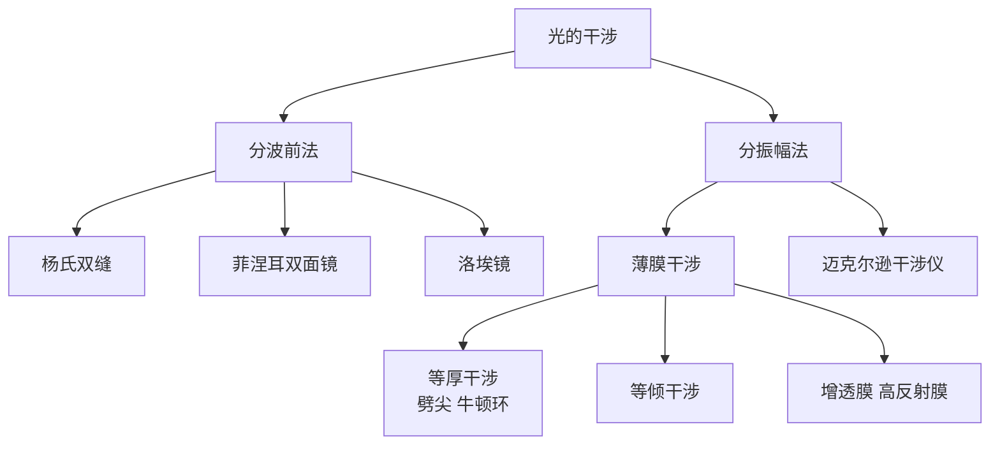

# 光的干涉

> [!abstract] 概览
> 光的干涉是波动光学的开篇之作，也是光具有波动性的最直接证据。1801 年，英国物理学家托马斯·杨（Thomas Young）用著名的双缝实验首次观察到光的干涉现象，让相干光束在屏上叠加形成明暗相间的条纹——这一发现打破了牛顿"微粒说"长达百年的统治。本节系统讨论干涉的相干条件、获得相干光的两种基本方法（分波前法与分振幅法）、杨氏双缝干涉的实验装置与条纹间距公式 $\Delta x = \dfrac{L\lambda}{d}$、薄膜干涉与等厚干涉（劈尖、牛顿环）的物理图景，以及迈克尔逊干涉仪、增透膜与高反射膜等工程应用。本节是 [[02-光的衍射]] 与 [[03-光的偏振]] 的姊妹章节，三者共同构成波动光学的三大支柱，也是大学 [[物理光学]] 与 [[光学]] 的入门基础。

## 核心概念

### 一、光的干涉现象

**定义**：两束或多束相干光波在相遇区域叠加，形成光强空间分布呈周期性明暗交替的现象，称为光的干涉。

**物理意义**：干涉现象是波动理论的核心预言之一——按照几何光学，两束光叠加应只是亮度相加；而按照波动光学，两束相干光叠加后光强可大于、等于甚至小于单束光强之和，出现明纹（ constructive interference ）与暗纹（ destructive interference ）。这种"光的叠加不等于亮度相加"正是波动性的直接体现。

**类比**：往平静水面投入两颗石子，两圈水波相遇处会出现"某些点振幅加强、某些点振幅相消"的图样——这就是水波干涉。光的干涉是同一物理规律在电磁波范畴的体现，只是可见光波长极短（约 $10^{-7}\,\text{m}$ 量级），需要特殊设计才能观察到。

### 二、相干光源条件

两束光要发生稳定干涉，必须满足==三个相干条件==：

1. **频率相同**：两束光的频率必须严格相等，否则相位差随时间快速变化，条纹无法稳定。
2. **振动方向相同**：两束光的电场振动方向应有平行分量，垂直振动完全不干涉。
3. **相位差恒定**：两束光的相位差在观测时间内保持不变，才能形成稳定的明暗分布。

> [!note] 为什么普通光源不相干？
> 普通光源（如灯泡、太阳）的发光是大量原子自发辐射的随机过程——每个原子独立发光，每次发光持续时间仅约 $10^{-8}\,\text{s}$，相位、振动方向均随机。两个独立灯泡的光叠加只是亮度相加，看不到干涉条纹。要观察干涉，必须从同一光源"分"出两束光，使其满足相干条件。

### 三、获得相干光的方法

| 方法 | 原理 | 典型实验 |
| :---: | :---: | :---: |
| 分波前法 | 把同一波前分为两部分，每部分作为新波源 | 杨氏双缝、菲涅耳双面镜、洛埃镜 |
| 分振幅法 | 把同一波列的振幅分为两部分（反射与透射） | 薄膜干涉、迈克尔逊干涉仪 |

**分波前法**适用于空间相干性较好的光源，通过波前的空间分割获得相干光束；**分振幅法**利用光在介质界面的反射与透射将一束光"分裂"为两束，应用更广泛。

### 四、杨氏双缝干涉实验

**实验装置**：单色光通过单缝 $S$（作为线光源）→ 照亮双缝 $S_1$、$S_2$（间距 $d$，约 0.1～1 mm）→ 双缝出射光在屏上（距离 $L$，约 1 m）叠加 → 屏上出现明暗相间等间距条纹。

**历史意义**：托马斯·杨在 1801 年的实验首次直接证明光的波动性，并首次测得光的波长——这是人类认识光本质的里程碑。

### 五、薄膜干涉

**定义**：光照射透明薄膜（如肥皂泡、油膜）时，薄膜前后两个表面反射的光相互叠加产生的干涉现象。

**物理图景**：一束光在薄膜前表面反射一部分（光 1），另一部分折射进入薄膜，在薄膜后表面再次反射并透射出前表面（光 2）。这两束反射光来自同一入射波列，满足相干条件；它们之间存在光程差，从而形成干涉。

### 六、劈尖干涉与牛顿环

**劈尖干涉**：两块玻璃板一端接触、另一端夹一细丝形成空气劈尖，光垂直入射时形成与劈尖棱边平行的等间距明暗条纹——属于==等厚干涉==。

**牛顿环**：将平凸透镜的凸面放在平玻璃板上，两者间形成空气薄层。光垂直入射时形成以接触点为中心的同心圆环——也是等厚干涉，条纹由中心向外间距变小（内疏外密）。

### 七、迈克尔逊干涉仪

**结构**：光源发出光 → 分束板（半透半反）将光分为两束 → 两束光分别经固定反射镜 $M_1$ 与可动反射镜 $M_2$ 反射回分束板 → 会合后形成干涉。

**应用**：通过测量 $M_2$ 移动距离与条纹移动数目，可精确测定光波波长或微小位移。迈克尔逊-莫雷实验正是用此仪器试图探测"以太风"，最终得到零结果，为相对论奠定实验基础。

### 八、增透膜与高反射膜

**增透膜**：在透镜表面镀一层厚度均匀的透明薄膜，使薄膜上下表面反射光的光程差为 $\lambda/2$（即相位差 $\pi$），反射相消，从而减少反射损失、增加透射。常见厚度 $d=\dfrac{\lambda}{4n}$（$n$ 为薄膜折射率），称"四分之一波长膜"。

**高反射膜**：相反设计——使反射光相长干涉，反射率大幅提升，广泛用于激光器谐振腔、反射镜等。

## 推导与原理

### 一、杨氏双缝干涉条纹间距公式推导

设双缝 $S_1$、$S_2$ 间距为 $d$，屏到双缝距离为 $L$（$L\gg d$）。考察屏上一点 $P$，距屏中心 $O$ 为 $x$。

**光程差**：两束光到 $P$ 的路程差为：

$$
\delta = r_2 - r_1 \approx d\sin\theta \approx d\cdot\dfrac{x}{L}
$$

其中 $\theta$ 为 $P$ 对双缝中心的张角，近似 $\sin\theta\approx\tan\theta=\dfrac{x}{L}$（远场近似）。

**明暗条件**：

- 明纹（相长干涉）：$\delta = \pm k\lambda$，$k=0,1,2,\ldots$
- 暗纹（相消干涉）：$\delta = \pm(2k+1)\dfrac{\lambda}{2}$，$k=0,1,2,\ldots$

**明纹位置**：

$$
x_k = \pm k\dfrac{L\lambda}{d}, \quad k=0,1,2,\ldots
$$

**相邻明纹间距**：

$$
\boxed{\Delta x = \dfrac{L\lambda}{d}}
$$

> [!tip] 公式理解
> - $L$ 越大、$\lambda$ 越大 → 条纹越宽（更稀疏）；
> - $d$ 越大 → 条纹越窄（更密集）；
> - 用白光做实验时，不同颜色（不同 $\lambda$）的明纹位置不同 → 出现彩色条纹，中央为白色。

### 二、薄膜干涉光程差推导

设薄膜厚度 $d$，折射率 $n$，光以入射角 $i$ 入射，折射角 $r$。

光 1（前表面反射）与光 2（前表面折射→后表面反射→前表面透射）的光程差为：

$$
\delta = 2n d\cos r \pm \dfrac{\lambda}{2}
$$

其中 $\dfrac{\lambda}{2}$ 项来自"半波损失"——光从光疏介质射向光密介质反射时相位突变 $\pi$，相当于附加光程 $\lambda/2$。

**垂直入射**（$i=0$，$r=0$）时简化为：

$$
\delta = 2nd \pm \dfrac{\lambda}{2}
$$

**明暗条件**（设前表面反射有半波损失，后表面无）：

- 明纹：$2nd = \left(k+\dfrac{1}{2}\right)\lambda$，$k=0,1,2,\ldots$
- 暗纹：$2nd = k\lambda$，$k=0,1,2,\ldots$

> [!note] 半波损失的判定
> 光从光疏介质（小 $n$）射向光密介质（大 $n$）反射时，发生相位突变 $\pi$；从光密射向光疏反射时不发生。在薄膜干涉中要仔细分析两次反射是否有半波损失，以决定附加 $\lambda/2$ 项的有无。

### 三、劈尖干涉条纹间距

设劈尖角 $\theta$（很小），相邻明（或暗）纹间距 $l$ 对应薄膜厚度差 $\Delta d=\dfrac{\lambda}{2n}$。由几何关系：

$$
l\sin\theta \approx l\theta = \dfrac{\lambda}{2n} \Rightarrow \boxed{l = \dfrac{\lambda}{2n\theta}}
$$

劈尖干涉常用于测量细丝直径、薄膜厚度、工件平整度等。

### 四、牛顿环半径公式

平凸透镜曲率半径 $R$，空气层厚度 $d$ 与到接触点距离 $r$ 的关系（小角度近似）：

$$
d \approx \dfrac{r^2}{2R}
$$

代入暗纹条件 $2d=k\lambda$：

$$
\boxed{r_k = \sqrt{kR\lambda}}, \quad k=0,1,2,\ldots
$$

可见牛顿环==内疏外密==——中心为暗斑（$k=0$），向外环半径按 $\sqrt{k}$ 增长，间距越来越小。

### 五、干涉知识脉络

## 典型实例与类比

> [!example] 生活实例
> 1. **肥皂泡的彩色**：阳光下肥皂泡呈现彩色花纹——薄膜干涉。不同处厚度不同，对应不同颜色相长干涉。
> 2. **水面油膜彩色**：水面浮油在阳光下呈现彩色——油膜厚度不均，各色光在不同位置相长干涉。
> 3. **相机镜头呈紫蓝色**：相机镜头镀有增透膜，反射剩余的蓝紫光较多，故呈蓝紫色——这是增透膜设计的副产物。
> 4. **蝴蝶翅膀彩色**：部分蝴蝶翅膀的颜色并非色素产生，而是鳞片微观结构形成的"结构色"——本质是薄膜干涉。
> 5. **牛顿环检查透镜质量**：光学车间用牛顿环检测透镜曲率是否合格——环规则表示曲率均匀。

**类比**：

- 双缝干涉 ↔ 水波双源干涉：两个同步振荡水源产生的水波图样与双缝干涉图样高度相似。
- 薄膜干涉 ↔ 水面浮油厚度计：薄膜厚度决定光程差，正如不同厚度水层呈现不同干涉色。
- 牛顿环 ↔ 树木年轮：从中心向外一圈圈，但牛顿环内疏外密，与年轮等间距不同。

## 例题

### 例 1：杨氏双缝条纹间距与波长测量

**题目**：在杨氏双缝实验中，双缝间距 $d=0.5\,\text{mm}$，缝到屏的距离 $L=1.0\,\text{m}$，用某单色光照射，测得相邻明纹间距 $\Delta x=1.2\,\text{mm}$。求该单色光的波长 $\lambda$，并判断它属于什么颜色。

**分析**：直接应用条纹间距公式 $\Delta x = \dfrac{L\lambda}{d}$，反解 $\lambda$。注意单位统一。

**解答**：

$$
\lambda = \dfrac{d\cdot\Delta x}{L} = \dfrac{0.5\times 10^{-3}\times 1.2\times 10^{-3}}{1.0} = 6.0\times 10^{-7}\,\text{m} = 600\,\text{nm}
$$

波长 600 nm 对应==橙色光==。

**点评**：杨氏双缝是历史上首次准确测量光波长的方法。条纹间距公式 $\Delta x=\dfrac{L\lambda}{d}$ 是高考高频公式，注意单位统一到米。

### 例 2：双缝实验中遮住一条缝后的现象

**题目**：在杨氏双缝实验中，若将其中一条缝遮住，屏上的图样会如何变化？为什么？请从亮度分布和条纹特征两方面说明。

**分析**：遮住一条缝后，不再有两束相干光叠加，干涉消失。但光通过单缝时仍会发生==衍射==，屏上出现单缝衍射图样。

**解答**：

1. **干涉条纹消失**：相干条件被破坏，稳定的明暗条纹不再出现。
2. **出现单缝衍射图样**：光通过剩余的狭缝发生衍射，屏中央出现较宽的亮纹，两侧出现明暗相间的衍射条纹。中央亮纹最宽最亮，两侧条纹亮度迅速衰减。
3. **整体亮度降低**：相比双缝干涉，单缝衍射中央亮纹的亮度约为原来的一半（光通量减半）。

**点评**：此题考查干涉与衍射的辩证关系——双缝实验中同时存在干涉与衍射，干涉条纹的包络实际由单缝衍射决定。这也是 [[02-光的衍射]] 与本节的桥梁。

### 例 3：增透膜厚度计算

**题目**：照相机镜头玻璃折射率 $n_2=1.50$，镀一层折射率 $n=1.38$ 的氟化镁薄膜作为增透膜，以减弱绿光（$\lambda=550\,\text{nm}$，真空中）的反射。求增透膜的最小厚度 $d$。

**分析**：增透膜要求反射光==相消干涉==。光从空气（$n_0=1$）射入薄膜（$n=1.38$）反射时有半波损失；光从薄膜（$n=1.38$）射入玻璃（$n_2=1.50$）反射时也有半波损失。==两次反射都有半波损失==，附加光程差相互抵消，总光程差为 $\delta=2nd$（无附加 $\lambda/2$ 项）。

**解答**：

相消干涉条件：

$$
2nd = \left(k+\dfrac{1}{2}\right)\lambda, \quad k=0,1,2,\ldots
$$

取 $k=0$（最小厚度）：

$$
d = \dfrac{\lambda}{4n} = \dfrac{550\,\text{nm}}{4\times 1.38} \approx 99.6\,\text{nm}
$$

**点评**：增透膜厚度公式 $d=\dfrac{\lambda}{4n}$ 是经典考点。关键在于判断半波损失次数：==奇数次==半波损失要加 $\lambda/2$，==偶数次==相互抵消。本题两次半波损失相互抵消，故条件为 $2nd=(k+\frac{1}{2})\lambda$。

## 易错提醒

> [!warning] 易错点
> 1. **条纹间距公式记混**：$\Delta x = \dfrac{L\lambda}{d}$，分子是 $L\lambda$，分母是 $d$。常见错误是写成 $\dfrac{d\lambda}{L}$ 或 $\dfrac{Ld}{\lambda}$。
> 2. **明暗条件判断错**：明纹 $\delta=k\lambda$（光程差为波长整数倍）；暗纹 $\delta=(2k+1)\dfrac{\lambda}{2}$（光程差为半波长奇数倍）。注意 $k$ 从 0 开始还是从 1 开始，依题意而定。
> 3. **半波损失遗漏**：薄膜干涉中判断光程差时，必须检查每次反射是否产生半波损失。漏加或错加 $\lambda/2$ 会导致明暗条件颠倒。
> 4. **白光干涉颜色判断**：白光双缝干涉中央 ($k=0$) 为白色（所有颜色都相长），两侧出现彩色条纹——==红光在外、紫光在内==（因红光波长长，$\Delta x$ 大）。
> 5. **薄膜干涉颜色判断**：薄膜不同厚度对应不同颜色相长干涉，故厚度变化处呈现彩色——这与白光双缝彩色条纹的成因不同，注意区分。
> 6. **牛顿环中心判断**：牛顿环中心为==暗斑==（接触点 $d=0$，但因有半波损失，光程差为 $\lambda/2$，相消干涉）。

> [!note] 概念辨析
> - **干涉 vs 衍射**：干涉是有限多束相干光的叠加；衍射是同一波前各子波源发出的无限多子波的叠加。两者本质都是波叠加，但干涉强调"分立波束"，衍射强调"连续波前"。
> - **分波前法 vs 分振幅法**：前者从同一波前不同位置取光（如双缝），后者从同一波列分裂出反射与透射两部分（如薄膜）。
> - **等厚干涉 vs 等倾干涉**：等厚干涉条纹对应薄膜厚度相同的点连成的线（如劈尖、牛顿环）；等倾干涉条纹对应入射角相同的点连成的线（如迈克尔逊干涉仪扩展光源情形）。
> - **增透膜 vs 高反射膜**：前者使反射光相消，后者使反射光相长；二者都基于薄膜干涉原理，但设计目标相反。

## 与其他知识关联

- 与 [[02-光的衍射]] 的关系：衍射是干涉的"连续版"，二者共同证明光的波动性。
- 与 [[03-光的偏振]] 的关系：偏振证明光是横波，与干涉、衍射共同构成波动光学三大支柱。
- 与 [[04-光的颜色与光谱]] 的关系：白光干涉的彩色条纹揭示不同波长对应不同颜色。
- 与 [[05-光的电磁本性]] 的关系：干涉现象是光具有波动性的实验证据，为电磁理论提供支撑。
- 与 [[01-几何光学基础/03-光的折射与折射率]] 的关系：薄膜干涉中光程差涉及折射率 $n$ 与折射定律。
- 与 [[04-光的粒子性/01-光电效应]] 的关系：波动性无法解释光电效应——这是波粒二象性的开端。
- 高中—大学衔接：[[物理光学]]（菲涅耳衍射、相干性理论）、[[光学]]（傅里叶光学、全息照相）、[[电动力学]]（电磁波叠加的严格理论）。
- 与力学联系：[[机械振动]]（叠加原理）、[[机械波]]（水波干涉类比、相干条件）。
- 与电学联系：[[06-电磁波与传感器/01-电磁振荡与电磁波]]（电磁波叠加产生干涉）。
- 返回 [[00-光学总览]]

## 作者的话

> [!quote] 个人理解
> 杨氏双缝实验被誉为"物理学最美实验"之一，其美在于"以最简装置揭示最深刻本质"。一束光、两条缝、一面屏——就足以颠覆百年微粒说，让人类首次"看见"光的波动性。托马斯·杨的设计哲学值得每位物理学子品味：当现象难以直接观测（光波长太短），就用相干条件创造可观测的图样。
>
> 学习建议：把握"光程差"这一核心概念——所有干涉问题归根结底都是光程差的计算。把"半波损失"作为"陷阱"重点训练：每次反射都要判断光疏光密、决定是否加 $\lambda/2$。把"相干三条件"作为"原始公理"——任何干涉问题都先问"是否满足相干条件"。
>
> 扩展思考：现代光学中"相干性"已发展为完整的统计光学理论——时间相干性（与光源单色性有关，用相干长度 $L_c\approx\dfrac{\lambda^2}{\Delta\lambda}$ 描述）与空间相干性（与光源大小有关）。激光诞生后，相干长度可达数公里，使大尺度干涉成为可能（如 LIGO 引力波探测器）。从杨氏双缝到 LIGO，相干性思想贯穿两个世纪，是物理学最迷人的主线之一。

---
*返回 [[00-光学总览]]*
