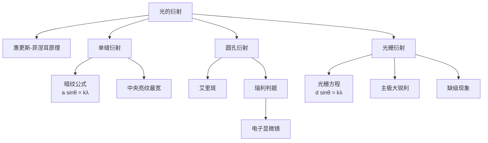

# 光的衍射

> [!abstract] 概览
> 光的衍射是波动光学的第二大支柱。当光遇到障碍物或狭缝时，会"绕过"障碍物进入几何阴影区——这一现象无法用直线传播解释，却是波动理论的自然推论。衍射与干涉本质相同（都是波叠加），但衍射强调"波前连续子波叠加"，干涉强调"分立相干波束叠加"。本节系统讨论衍射条件、单缝夫琅禾费衍射（暗纹公式 $a\sin\theta=k\lambda$、中央亮纹最宽最亮）、圆孔衍射（艾里斑、衍射角 $\theta\approx 1.22\dfrac{\lambda}{D}$）、光栅衍射（光栅方程 $d\sin\theta=k\lambda$、主极大明纹锐利）、光栅光谱与色散、瑞利判据与分辨本领、电子显微镜的分辨率原理等内容。本节与 [[01-光的干涉]] 互为姊妹，共同证明光的波动性，也是大学 [[物理光学]] 与 [[光学]] 的核心内容。

## 核心概念

### 一、光的衍射现象

**定义**：光绕过障碍物边缘进入几何阴影区，并在屏上形成光强不均匀分布（明暗相间或弥散）的现象，称为光的衍射。

**物理意义**：几何光学认为光沿直线传播，障碍物后应有清晰的"几何阴影"。但波动光学预言：当障碍物尺寸与光波长可比时，光会"绕射"进入阴影区，并在屏上形成衍射图样。这是==波动性的另一铁证==——若光是粒子流，则不可能绕过障碍物。

**衍射条件**：障碍物或狭缝尺寸 $a$ 与光波长 $\lambda$ 可比（$a\sim\lambda$ 或 $a$ 略大于 $\lambda$）。当 $a\gg\lambda$ 时衍射不明显，光近乎直线传播；当 $a\sim\lambda$ 时衍射显著。

> [!note] 为什么日常生活中难见光的衍射？
> 可见光波长约 380～760 nm，远小于日常物体尺寸（毫米到米），故光近似直线传播。要观察衍射，需使狭缝或障碍物尺寸接近光波长——这需要精密加工（如光栅）或特殊场景（如刀片边缘、眯眼看到的"光芒"）。

### 二、惠更斯-菲涅耳原理

**惠更斯原理**（1678）：波前上每一点都是发出球面子波的新波源，这些子波的包络面形成新的波前。

**菲涅耳补充**（1818）：波前上各点发出的子波是==相干==的，它们在空间任一点叠加产生干涉——这就是衍射图样的成因。

**意义**：惠更斯-菲涅耳原理将"衍射"统一为"连续波前的子波干涉"，使衍射与干涉在数学上同源。这一原理是大学 [[物理光学]] 的基础。

### 三、单缝夫琅禾费衍射

**装置**：单色点光源→单缝（缝宽 $a$）→透镜→屏。光源与屏都在"无穷远"（实际用透镜实现），称==夫琅禾费衍射==（远场衍射）。

**图样特征**：

1. **中央亮纹最宽最亮**：中央亮纹宽度是两侧次亮纹宽度的==两倍==，集中了 90% 以上光通量。
2. **两侧对称分布明暗相间条纹**：亮度迅速衰减。
3. **暗纹等间距，亮纹不等间距**：暗纹位置 $a\sin\theta=k\lambda$ 严格等间距；次亮纹中心位于相邻暗纹之间，略偏向中央。

### 四、圆孔衍射与艾里斑

**现象**：光通过小圆孔后，屏上不形成清晰几何光斑，而是形成中央亮斑（艾里斑）周围环绕明暗相间圆环的衍射图样。

**艾里斑**：中央亮斑，集中了约 84% 光通量。第一暗环对应的衍射角（角半径）：

$$
\boxed{\theta \approx 1.22\dfrac{\lambda}{D}}
$$

其中 $D$ 为圆孔直径。这就是==光学仪器分辨率极限==的来源。

### 五、光栅衍射

**光栅**：大量等宽等间距狭缝组成的光学元件。设缝宽 $a$、缝间不透光部分 $b$，则光栅常数 $d=a+b$（相邻狭缝间距）。

**光栅方程**（主极大明纹条件）：

$$
\boxed{d\sin\theta = k\lambda}, \quad k=0,\pm 1,\pm 2,\ldots
$$

**图样特征**：

1. 主极大明纹==锐利==（缝数 $N$ 越多越尖锐）。
2. 相邻主极大之间有 $N-1$ 条暗纹与 $N-2$ 条次极大（次极大光强很弱）。
3. 主极大位置由光栅方程决定，与 $N$ 无关；但 $N$ 越大主极大越窄越亮。
4. 主极大之间有"缺级"现象——当主极大位置恰好与单缝衍射暗纹位置重合时，该级主极大消失。缺级条件：$\dfrac{d}{a}=\dfrac{k}{k'}$（$k$ 为主极大级数，$k'$ 为单缝暗纹级数）。

### 六、光栅光谱与色散

**色散**：由光栅方程 $d\sin\theta=k\lambda$ 知，对同一级 $k$，不同波长 $\lambda$ 对应不同衍射角 $\theta$——除零级外，光栅将不同颜色光分开，形成光栅光谱。

**特点**：

- 零级光谱（$k=0$）：所有波长重合，无色散（白光）。
- 一级、二级光谱（$k=\pm1,\pm2$）：有色散，==红光在外、紫光在内==（红光波长大，衍射角大）。
- 高级次光谱可能重叠（如二级红光可能与三级紫光重叠）。

### 七、瑞利判据与分辨本领

**瑞利判据**（Rayleigh criterion）：一个物点的艾里斑中心恰好落在另一物点艾里斑第一暗环上时，两物点==恰好可分辨==。

**最小分辨角**：

$$
\boxed{\theta_{\min} \approx 1.22\dfrac{\lambda}{D}}
$$

**分辨本领**：$R=\dfrac{1}{\theta_{\min}}=\dfrac{D}{1.22\lambda}$。增大孔径 $D$ 或减小波长 $\lambda$ 可提高分辨率。

**应用**：

- 望远镜：增大物镜口径 $D$ → 提高分辨率（如哈勃望远镜口径 2.4 m）。
- 显微镜：减小波长 → 用紫外光或电子束（电子物质波波长短）→ 提高分辨率。

### 八、电子显微镜简介

**原理**：电子具有波粒二象性（参见 [[04-光的粒子性/03-波粒二象性与德布罗意波]]），其德布罗意波长 $\lambda=\dfrac{h}{p}$。加速电压 $U$ 下电子动能 $E_k=eU$，动量 $p=\sqrt{2meU}$，故：

$$
\lambda = \dfrac{h}{\sqrt{2meU}}
$$

加速电压 $U=100\,\text{kV}$ 时，电子波长约 $0.004\,\text{nm}$，远小于可见光波长——故电子显微镜分辨率远高于光学显微镜，可达原子尺度（约 0.1 nm）。

**类型**：透射电子显微镜（TEM）、扫描电子显微镜（SEM）、扫描隧道显微镜（STM）等。

## 推导与原理

### 一、单缝衍射暗纹公式推导

设单缝缝宽 $a$，单色光垂直入射。将缝分为 $N$ 等份（$N\to\infty$），每份作为子波源。

**暗纹条件——半波带法**：将缝宽 $a$ 沿缝方向分为偶数个等宽"半波带"，使相邻两带对应点发出的光到屏上某点 $P$ 的光程差恰为 $\lambda/2$（即相位差 $\pi$），相邻带两两相消，$P$ 处为暗纹。

设 $P$ 对应衍射角 $\theta$，缝两端到 $P$ 的最大光程差为 $a\sin\theta$。若 $a\sin\theta$ 恰为 $\lambda/2$ 的偶数倍，即：

$$
a\sin\theta = \pm k\lambda, \quad k=1,2,3,\ldots
$$

此时缝恰好分为 $2k$ 个半波带，两两相消 → ==暗纹==。

**注意**：$k\neq 0$。中央 ($k=0$) 为亮纹中心。

**次亮纹位置**：严格推导涉及积分，结果为 $a\sin\theta\approx\pm(k+\tfrac{1}{2})\lambda$（$k=1,2,\ldots$），即相邻暗纹中间略偏外。次亮纹光强远弱于中央亮纹。

**中央亮纹角宽度**：第一暗纹之间，$\Delta\theta\approx\dfrac{2\lambda}{a}$（小角度近似）。中央亮纹线宽度 $\Delta x_0=\dfrac{2L\lambda}{a}$，是两侧次亮纹宽度的==两倍==。

### 二、光栅衍射主极大推导

设光栅有 $N$ 条狭缝，光栅常数 $d$。考察衍射角 $\theta$ 方向，相邻狭缝对应光程差 $\delta=d\sin\theta$，相位差 $\Delta\varphi=\dfrac{2\pi d\sin\theta}{\lambda}$。

$N$ 个等幅相干光叠加，合振幅：

$$
A = A_0\cdot\left|\dfrac{\sin\left(N\dfrac{\Delta\varphi}{2}\right)}{\sin\left(\dfrac{\Delta\varphi}{2}\right)}\right|
$$

**主极大**：当 $\Delta\varphi=2k\pi$，即 $d\sin\theta=k\lambda$ 时，所有缝光同相叠加 → 主极大。$A_{\max}=NA_0$，光强 $I\propto N^2$。

**暗纹**：当 $N\dfrac{\Delta\varphi}{2}=m\pi$（$m$ 不为 $N$ 的整数倍）时，$A=0$，即暗纹。相邻主极大之间有 $N-1$ 条暗纹。

**次极大**：相邻暗纹之间有微弱次极大，光强约为主极大的 $\dfrac{1}{22}$（$N$ 大时）。故 $N$ 越大，主极大越尖锐、背景越暗——这是光栅用于精密光谱分析的原因。

### 三、瑞利判据推导

两相近物点经光学系统（孔径 $D$）成像，各自形成艾里斑。若两艾里斑中心角距离 $\alpha\geq\theta_{\min}=1.22\dfrac{\lambda}{D}$，可分辨；$\alpha<\theta_{\min}$ 则合并为一个斑，无法分辨。

**临界情形**（$\alpha=\theta_{\min}$）：一艾里斑中心恰落于另一艾里斑第一暗环——合成光强中央凹陷约 19%，仍可辨认为两个像。这就是==瑞利判据==的量化标准。

### 四、衍射知识脉络

## 典型实例与类比

> [!example] 生活实例
> 1. **眯眼看到的光芒**：眯眼看路灯时，眼皮形成狭缝，光发生单缝衍射，故看到"十字光芒"。
> 2. **CD 的彩色**：CD 表面有密集细槽（每毫米约 600 条），相当于反射光栅，白光照射形成彩色条纹。
> 3. **羽毛的彩色**：羽毛纤维排列规则，形成自然光栅，衍射产生彩色。
> 4. **雷达分辨率**：雷达波束宽度由天线孔径与波长决定，类似瑞利判据——天线越大、波长越短，方向性越好。
> 5. **哈勃 vs 詹姆斯·韦伯望远镜**：增大口径 $D$ 是提高角分辨率的核心途径。詹姆斯·韦伯主镜口径 6.5 m，分辨率远超哈勃的 2.4 m。
> 6. **电子显微镜观察病毒**：光学显微镜分辨率极限约 200 nm，无法观察病毒（约 20～300 nm）；电子显微镜分辨率 0.1 nm，可清晰观察病毒甚至大分子。

**类比**：

- 单缝衍射 ↔ 水波通过窄口：水波通过堤坝缺口时向两侧扩散——缺口越窄，扩散越明显。
- 光栅衍射 ↔ 多缝干涉"放大版"：单缝衍射决定包络，多缝干涉决定锐利主极大位置。
- 艾里斑 ↔ 模糊圆斑：即使理想点光源，经有限孔径透镜成像后也是有限大小的圆斑——这是衍射所致，无法消除。

## 例题

### 例 1：单缝衍射暗纹位置

**题目**：单色光 $\lambda=500\,\text{nm}$ 垂直照射缝宽 $a=0.25\,\text{mm}$ 的单缝，缝后凸透镜焦距 $f=50\,\text{cm}$。求屏上第一级暗纹到中央的距离 $x_1$，及中央亮纹的线宽度 $\Delta x_0$。

**分析**：单缝暗纹公式 $a\sin\theta=k\lambda$。小角度近似 $\sin\theta\approx\tan\theta=\dfrac{x}{f}$（透镜焦平面接收，$L=f$）。

**解答**：

第一级暗纹（$k=1$）：

$$
x_1 = \dfrac{f\lambda}{a} = \dfrac{0.50\times 500\times 10^{-9}}{0.25\times 10^{-3}} = 1.0\times 10^{-3}\,\text{m} = 1.0\,\text{mm}
$$

中央亮纹线宽度（两个第一级暗纹之间）：

$$
\Delta x_0 = 2x_1 = 2.0\,\text{mm}
$$

**点评**：单缝衍射暗纹公式 $a\sin\theta=k\lambda$ 是核心公式。注意==中央亮纹宽度是两侧次亮纹宽度的两倍==，这是单缝衍射的标志特征。透镜焦平面接收时 $L=f$。

### 例 2：光栅方程与缺级

**题目**：一光栅每厘米有 5000 条刻痕，单色光 $\lambda=600\,\text{nm}$ 垂直入射。求：(1) 光栅常数 $d$；(2) 屏上最多能看到几个主极大（不考虑缺级）？(3) 若缝宽 $a=\dfrac{d}{3}$，求哪些级数缺级。

**分析**：(1) 光栅常数 $d=\dfrac{1\,\text{cm}}{5000}$。(2) 主极大最多出现在 $\sin\theta\leq 1$ 范围内，由 $k\leq\dfrac{d}{\lambda}$ 估算。(3) 缺级条件：主极大级数 $k$ 满足 $k=\dfrac{d}{a}k'$（$k'$ 为单缝暗纹级数）时缺级。

**解答**：

(1)

$$
d = \dfrac{1\times 10^{-2}}{5000} = 2.0\times 10^{-6}\,\text{m} = 2.0\,\mu\text{m}
$$

(2) 由 $d\sin\theta=k\lambda$，最大 $k$ 满足 $k\leq\dfrac{d}{\lambda}$：

$$
k_{\max} = \left\lfloor\dfrac{d}{\lambda}\right\rfloor = \left\lfloor\dfrac{2.0\times 10^{-6}}{600\times 10^{-9}}\right\rfloor = \left\lfloor 3.33 \right\rfloor = 3
$$

考虑 $\pm k$，最多能看到 $2k_{\max}+1=7$ 个主极大（$k=0,\pm1,\pm2,\pm3$）。

(3) 缺级条件：$\dfrac{d}{a}=3$，故 $k=3k'$（$k'=1,2,3,\ldots$）的主极大缺级。在可见范围内：$k=3$（$k'=1$）缺级，$k=6$ 已超出 $k_{\max}=3$。

故实际可见主极大为 $k=0,\pm1,\pm2$ 共 5 个。

**点评**：光栅方程 + 缺级是高考难点。关键是==区分干涉主极大条件 $d\sin\theta=k\lambda$ 与单缝衍射暗纹条件 $a\sin\theta=k'\lambda$==——当两者同时满足时该级主极大被"包络"掉，即缺级。

### 例 3：人眼分辨率估算

**题目**：人眼瞳孔直径约 $D=3\,\text{mm}$，对最敏感的绿光 $\lambda=550\,\text{nm}$，求人眼的最小分辨角 $\theta_{\min}$。若两物点距人眼 $L=25\,\text{cm}$（明视距离），求人眼能分辨的最小线距离 $d_{\min}$。

**分析**：直接应用瑞利判据 $\theta_{\min}=1.22\dfrac{\lambda}{D}$。线距离 $d_{\min}=L\theta_{\min}$（小角度）。

**解答**：

$$
\theta_{\min} = 1.22\times\dfrac{550\times 10^{-9}}{3\times 10^{-3}} \approx 2.24\times 10^{-4}\,\text{rad}
$$

明视距离 $L=25\,\text{cm}$ 处对应最小线距离：

$$
d_{\min} = L\theta_{\min} = 0.25\times 2.24\times 10^{-4} \approx 5.6\times 10^{-5}\,\text{m} \approx 56\,\mu\text{m}
$$

**点评**：瑞利判据是衍射极限的标准表述。注意 $\theta_{\min}\propto\dfrac{\lambda}{D}$——增大孔径或减小波长是提高分辨率的根本途径。人眼极限约 0.1 mm，光学显微镜极限约 200 nm，电子显微镜可达 0.1 nm——三者差异源于波长差异。

## 易错提醒

> [!warning] 易错点
> 1. **衍射 vs 干涉混淆**：单缝衍射用==半波带法==，暗纹公式 $a\sin\theta=k\lambda$（$k\neq 0$）；双缝干涉用==光程差法==，明纹 $d\sin\theta=k\lambda$（$k=0,1,2,\ldots$）。两公式形式相似但含义不同：单缝 $a$ 是缝宽，$k$ 从 1 起；双缝 $d$ 是缝距，$k$ 从 0 起。
> 2. **单缝中央亮纹宽度**：是两侧次亮纹宽度的==两倍==，且中央最亮。常被误认为"等宽"。
> 3. **光栅方程中 $d$ 的含义**：$d=a+b$ 是相邻狭缝间距（含透光与不透光部分），不是缝宽 $a$。务必区分。
> 4. **缺级判断**：缺级发生在主极大与单缝暗纹同时满足时，$k=\dfrac{d}{a}k'$。常见情形 $d=3a$ 缺 3、6、9…级。
> 5. **零级光栅光谱无色散**：$k=0$ 时所有波长都集中在中央，无色散——这是光栅与棱镜光谱的区别之一。
> 6. **艾里斑公式记错系数**：圆孔衍射第一暗环角度 $\theta\approx 1.22\dfrac{\lambda}{D}$，系数 1.22 容易被遗漏或写成 1。

> [!note] 概念辨析
> - **菲涅耳衍射 vs 夫琅禾费衍射**：前者光源或屏在有限远（近场），后者光源与屏都在无穷远（远场，用透镜实现）。高中阶段主要讨论夫琅禾费衍射。
> - **单缝衍射 vs 双缝干涉条纹对比**：单缝中央亮纹最宽最亮，两侧迅速衰减；双缝干涉条纹等宽等亮（理想情形）。条纹形态是判断装置类型的重要线索。
> - **棱镜光谱 vs 光栅光谱**：棱镜色散源于折射率随波长变化，==红光偏折小、紫光偏折大==；光栅色散源于衍射，==红光偏折大、紫光偏折小==——两者顺序相反！
> - **分辨本领 vs 放大倍数**：放大不等于分辨。增大放大倍数若超出分辨率极限，只会放大模糊，不能看清细节。

## 与其他知识关联

- 与 [[01-光的干涉]] 的关系：衍射是"连续波前子波干涉"，与干涉同源。单缝衍射可用"半波带法"理解为多束相干光的叠加。
- 与 [[03-光的偏振]] 的关系：偏振证明光是横波，衍射与干涉证明光具有波动性——三者共同支撑波动光学。
- 与 [[04-光的颜色与光谱]] 的关系：光栅是光谱仪的核心元件，用于将光按波长分开进行光谱分析。
- 与 [[05-光的电磁本性]] 的关系：衍射现象是电磁波理论的必然推论，严密的菲涅耳衍射理论建立在麦克斯韦方程组之上。
- 与 [[01-几何光学基础/03-光的折射与折射率]] 的关系：棱镜色散与光栅色散的方向相反，对比记忆。
- 与 [[04-光的粒子性/01-光电效应]] 的关系：衍射无法用粒子说解释，是波动说的关键证据；但光电效应又否定纯波动说，最终走向波粒二象性。
- 与 [[04-光的粒子性/03-波粒二象性与德布罗意波]] 的关系：电子显微镜利用电子的物质波衍射，是波粒二象性的直接应用。
- 高中—大学衔接：[[物理光学]]（菲涅耳积分、基尔霍夫衍射理论）、[[光学]]（傅里叶光学、全息照相）、[[电动力学]]（电磁波衍射的严格解）。
- 与力学联系：[[机械波]]（水波衍射类比）、[[机械振动]]（叠加原理）。
- 返回 [[00-光学总览]]

## 作者的话

> [!quote] 个人理解
> 衍射是波动光学中最具"反直觉"美感的章节——光竟然能"绕过"障碍物！这正是几何光学失效之处。从教学角度，衍射的精髓在于"连续子波叠加"——单缝衍射的半波带法把这一思想体现得淋漓尽致：将缝宽分为偶数个半波带，相邻带两两相消，暗纹出。这一方法虽是近似，却以最少的数学揭示了衍射的物理本质。
>
> 学习建议：抓"两类公式"——单缝暗纹 $a\sin\theta=k\lambda$ 与光栅主极大 $d\sin\theta=k\lambda$。形式相同但含义迥异：单缝是缝宽 $a$，光栅是缝距 $d$；单缝是"暗纹"，光栅是"明纹"。将两者对比记忆，能避免混淆。再抓"一个判据"——瑞利判据 $1.22\dfrac{\lambda}{D}$，它是所有光学仪器分辨率的根源。
>
> 扩展思考：衍射极限曾被认为是不可逾越的"自然界限"。但 20 世纪后期发展的"超分辨荧光显微技术"（如 STED、PALM，2014 年诺贝尔化学奖）通过巧妙利用非线性效应与统计定位，突破了衍射极限，实现纳米尺度成像。这说明"极限"常常是某个理论框架内的极限——突破框架即可能突破极限。从 Abbe 衍射极限到超分辨显微，是一段"理论设限、技术破限"的精彩史诗。

---
*返回 [[00-光学总览]]*
