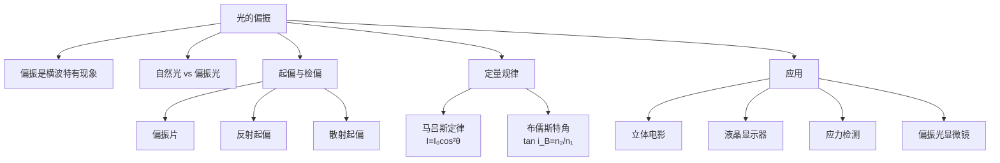

# 光的偏振

> [!abstract] 概览
> 光的偏振是波动光学的第三大支柱，也是光==横波性==的最直接证据。干涉与衍射只能证明"光具有波动性"，但无法区分横波与纵波；唯有偏振现象才能确证"光是横波"。本节系统讨论自然光与偏振光的区别、起偏与检偏的原理、偏振片的工作机制、马吕斯定律 $I=I_0\cos^2\theta$ 的推导与应用、反射光偏振与布儒斯特角 $\tan i_B=\dfrac{n_2}{n_1}$、散射光偏振、以及偏振在现代科技中的应用（立体电影、液晶显示器、应力检测、偏振光显微镜）。本节是 [[01-光的干涉]] 与 [[02-光的衍射]] 的姊妹章节，三者共同构成波动光学的完整图景，也是大学 [[物理光学]] 中晶体光学与[[电动力学]]中电磁波理论的入门。

## 核心概念

### 一、偏振——横波特有的现象

**定义**：波的振动方向相对传播方向不对称的现象，称为偏振。==只有横波才有偏振现象==，纵波的振动方向与传播方向一致，无所谓偏振。

**物理意义**：光波是电磁波，电场矢量 $\vec{E}$ 与磁场矢量 $\vec{B}$ 都垂直于传播方向 $\vec{k}$，且 $\vec{E}\perp\vec{B}$。通常用电场矢量 $\vec{E}$ 的方向代表光矢量的振动方向。若 $\vec{E}$ 在某方向上占优势，则光具有偏振性。

**类比**：绳子波动是横波——若让绳穿过竖直栅栏，则只有竖直振动的绳波能穿过，水平振动被阻挡。光的偏振片就类似这种"栅栏"——只允许某方向振动的光通过。声波是纵波，无偏振现象。

### 二、自然光与偏振光

**自然光**（如太阳光、灯光）：光源中大量原子独立发光，每个原子发出的光波振动方向随机。在垂直传播方向的平面内，光矢量==各方向均匀分布==，没有优势方向。可用两个互相垂直、振幅相等、无固定相位关系的线偏振光表示。

**线偏振光**（完全偏振光）：光矢量只沿==单一方向==振动。这是最简单也是最基本的偏振态。

**部分偏振光**：光矢量在某方向占优势，但其他方向也有分量。自然界中反射光、散射光多为部分偏振光。可用一个偏振片检验：旋转偏振片时透射光强有变化但不为零。

**圆偏振光与椭圆偏振光**：光矢量端点随时间描绘圆或椭圆——这是大学内容，高中仅了解即可。

> [!note] 自然光的"对称性"
> 自然光在垂直传播方向的平面内具有==旋转对称性==——任何方向都是等价的。这与"无偏振"的物理意义一致。当这种对称性被打破（某方向占优）时，光就具有偏振性。

### 三、起偏与检偏

**起偏**：将自然光变为偏振光的过程。常用器件为偏振片。

**检偏**：检验光是否为偏振光的过程。方法也是用偏振片——旋转偏振片观察透射光强变化：
- 透射光强==不变==：自然光（或圆偏振光）。
- 透射光强==有变化但不到零==：部分偏振光。
- 透射光强==有变化且可到零==：线偏振光。

**偏振片原理**：偏振片含大量定向排列的二向色性晶体（如碘硫酸奎宁微晶），能强烈吸收某一方向振动的光，让垂直方向振动的光通过。透光方向称为==透振方向==（或偏振化方向）。

### 四、马吕斯定律

**内容**：强度为 $I_0$ 的线偏振光，通过偏振片后透射光强为：

$$
\boxed{I = I_0\cos^2\theta}
$$

其中 $\theta$ 为入射偏振光振动方向与偏振片透振方向的夹角。

**意义**：定量描述偏振光通过偏振片后的强度变化。$\theta=0$ 时 $I=I_0$（完全透过），$\theta=90°$ 时 $I=0$（完全消光），$\theta=45°$ 时 $I=\dfrac{I_0}{2}$。

### 五、反射光偏振与布儒斯特角

**现象**：自然光在两种介质界面反射时，反射光与折射光都变为==部分偏振光==。反射光中垂直于入射面的振动占优，折射光中平行于入射面的振动占优。

**布儒斯特角**（起偏振角 $i_B$）：当入射角满足特定值时，==反射光变为完全偏振光==（垂直入射面振动），且反射光与折射光互相垂直。

**布儒斯特定律**：

$$
\boxed{\tan i_B = \dfrac{n_2}{n_1}}
$$

其中 $n_1$、$n_2$ 为入射介质与折射介质的折射率。例如光由空气射向玻璃（$n_2=1.5$），$i_B=\arctan 1.5\approx 56.3°$。

### 六、散射光偏振

**现象**：自然光被大气分子散射后变为部分偏振光。==与原始传播方向垂直的散射光==偏振程度最高。

**解释**：入射自然光的电场使大气分子感生偶极子振动，偶极子辐射方向有方向性——垂直偶极子振动方向最强，沿偶极子振动方向为零。故散射光在特定方向偏振。

**应用**：蓝天偏振、蜜蜂等昆虫利用偏振光导航、偏振滤光镜在摄影中压暗蓝天。

### 七、偏振的应用

| 应用 | 原理 |
| :---: | :---: |
| 立体电影 | 左右眼偏振方向不同，互不干扰 |
| 液晶显示器（LCD） | 液晶分子扭转控制偏振光透过 |
| 应力检测（光弹性效应） | 透明材料受力产生双折射，偏振光下出现彩色条纹 |
| 偏振光显微镜 | 检测矿物晶体的双折射特性 |
| 偏振滤光镜（摄影） | 消除反射眩光，压暗蓝天 |
| 汽车防眩目后视镜 | 利用偏振片滤除对面来车反射的强光 |

## 推导与原理

### 一、马吕斯定律推导

设入射线偏振光振幅为 $E_0$，振动方向与偏振片透振方向夹角为 $\theta$。将 $E_0$ 分解为：

- 沿透振方向分量：$E_{\parallel}=E_0\cos\theta$（透过偏振片）
- 垂直透振方向分量：$E_{\perp}=E_0\sin\theta$（被偏振片吸收）

透射光振幅：

$$
E = E_0\cos\theta
$$

光强正比于振幅平方：

$$
I = I_0\cos^2\theta
$$

**讨论**：

- $\theta=0$：$I=I_0$，偏振方向与透振方向一致，全部透过。
- $\theta=90°$：$I=0$，偏振方向与透振方向垂直，完全消光。
- $\theta=45°$：$I=\dfrac{I_0}{2}$，透射光强减半。

### 二、自然光通过偏振片的光强

自然光在垂直传播方向的平面内各方向振动均匀。设通过偏振片后只保留透振方向分量。

对任一方向振动 $E_i$，其在透振方向的分量为 $E_i\cos\theta_i$。对所有方向求平均：

$$
\langle E^2\rangle = \langle E_i^2\cos^2\theta_i\rangle = \dfrac{1}{2}\langle E_i^2\rangle
$$

故自然光通过偏振片后光强==减半==：

$$
I_1 = \dfrac{I_0}{2}
$$

且透射光变为线偏振光。

> [!tip] 两次偏振片
> 自然光 $I_0$ → 偏振片 1 → 偏振片 2（夹角 $\theta$）：
> 
> $$I_2 = \dfrac{I_0}{2}\cos^2\theta$$
> 
> 这是高考高频题型——两偏振片正交（$\theta=90°$）时输出为零。

### 三、布儒斯特角推导

设入射角 $i_B$ 时反射光与折射光垂直。由反射定律与折射定律：

$$
i_B + r = 90° \quad (\text{反射光线与折射光线垂直})
$$

$$
n_1\sin i_B = n_2\sin r = n_2\sin(90°-i_B) = n_2\cos i_B
$$

故：

$$
\tan i_B = \dfrac{n_2}{n_1}
$$

这就是==布儒斯特定律==。

**物理含义**：

- 此时反射光只含垂直入射面的振动 → 完全线偏振光。
- 折射光仍为部分偏振光（但平行入射面振动占优程度最高）。
- 应用一堆玻片堆叠可显著提高折射光的偏振程度。

### 四、偏振应用：液晶显示器原理

液晶显示器（LCD）结构：偏振片 1 → 玻璃基板 → 液晶层 → 玻璃基板 → 偏振片 2（与 1 正交）。

**未加电压**：液晶分子扭转 90°，使偏振光振动方向也旋转 90°，刚好通过偏振片 2 → ==亮态==。
**加电压**：液晶分子沿电场排列，不扭转偏振光，偏振光被偏振片 2 挡住 → ==暗态==。

通过控制每个像素的电压即可显示图像。这是液晶显示器功耗低、可精细控制的原因。

### 五、偏振知识脉络

## 典型实例与类比

> [!example] 生活实例
> 1. **偏振太阳镜**：能消除水面、路面反射眩光——反射光是部分偏振的，偏振镜片选择透过垂直方向振动，可阻挡水平方向的反射眩光。
> 2. **立体电影**：放映机投射左右眼不同偏振方向的画面，观众戴偏振眼镜，左右眼分别接收，形成立体感。
> 3. **液晶屏**：手机、电脑、电视屏都基于液晶偏振控制。透过偏振片看液晶屏，旋转偏振片可见屏变黑——证明液晶光是偏振的。
> 4. **蜜蜂导航**：蜜蜂复眼能感知天光的偏振模式，即使在阴天也能借此判断太阳方位，进行导航。
> 5. **应力检测**：在偏振光下观察受力的透明塑料（如尺子、眼镜架），可看到彩色条纹——应力越大双折射越强，条纹越密。这就是"光弹性效应"。
> 6. **蓝天偏振**：晴天蓝天散射光偏振明显，与太阳方向垂直处偏振度最高。

**类比**：

- 偏振片 ↔ 竖直栅栏：让绳波穿过栅栏，只有平行栅栏缝隙方向的振动能通过。
- 反射起偏 ↔ "弹球反弹"：球斜射入墙，垂直墙面分量反弹强，平行墙面分量保留——类似地，反射光中垂直入射面分量强。
- 液晶分子扭转 ↔ 螺旋楼梯：液晶分子如螺旋楼梯，让光的偏振方向沿楼梯"上升"90°。

## 例题

### 例 1：自然光通过两个偏振片

**题目**：自然光强度 $I_0$，依次通过两个偏振片，两偏振片透振方向夹角 $\theta=30°$。求透射光强 $I_2$。若再加第三个偏振片，透振方向与第二个偏振片夹角 $30°$，求最终透射光强 $I_3$。

**分析**：自然光通过第一个偏振片后光强减半，且变为线偏振光。之后每过一个偏振片，光强乘以 $\cos^2\theta$（$\theta$ 为该偏振片与前一偏振片透振方向夹角）。

**解答**：

通过第一个偏振片：

$$
I_1 = \dfrac{I_0}{2}
$$

通过第二个偏振片（夹角 $30°$）：

$$
I_2 = I_1\cos^2 30° = \dfrac{I_0}{2}\times\dfrac{3}{4} = \dfrac{3I_0}{8}
$$

通过第三个偏振片（与第二个夹角 $30°$）：

$$
I_3 = I_2\cos^2 30° = \dfrac{3I_0}{8}\times\dfrac{3}{4} = \dfrac{9I_0}{32}\approx 0.281 I_0
$$

**点评**：此题考查马吕斯定律的连续应用。注意：(1) 自然光过偏振片后光强==减半==；(2) 之后的偏振片才用 $I=I_0\cos^2\theta$ 公式。一个有趣的推论：在两个正交偏振片之间插入一系列夹角递减的偏振片，可使透射光强显著增大——这是"量子零拍效应"的经典类比。

### 例 2：布儒斯特角与反射起偏

**题目**：自然光由空气射入玻璃（$n=1.50$），求布儒斯特角 $i_B$。此时反射光与折射光的偏振状态如何？折射角 $r$ 多大？

**分析**：直接应用 $\tan i_B=\dfrac{n_2}{n_1}$；反射光与折射光垂直；折射角由 $i_B+r=90°$ 求出。

**解答**：

$$
i_B = \arctan\dfrac{n_2}{n_1} = \arctan 1.50 \approx 56.3°
$$

此时反射光为==完全线偏振光==（垂直入射面振动），折射光为==部分偏振光==（平行入射面振动占优）。

反射光与折射光垂直：

$$
r = 90° - i_B \approx 90° - 56.3° = 33.7°
$$

**点评**：布儒斯特角是反射起偏的"金钥匙"。==此时反射光与折射光垂直==——这是布儒斯特角的几何特征，也是推导布儒斯特定律的关键。注意反射光虽为完全偏振但强度较弱（约 15%），折射光强度较大但偏振程度较低——实用中常用"玻片堆"多次反射以提高折射光偏振度。

### 例 3：偏振片检验偏振光

**题目**：一束光通过偏振片，旋转偏振片一周观察到透射光强在最大值 $I_{\max}$ 与最小值 $I_{\min}=\dfrac{I_{\max}}{3}$ 之间变化。判断这束光的偏振状态，并求其中偏振成分所占比例。

**分析**：旋转偏振片光强有变化但不为零 → ==部分偏振光==。可将其视为自然光（强度 $I_n$）与线偏振光（强度 $I_p$）的非相干叠加。最大光强 $I_{\max}=I_n/2+I_p$（偏振方向与透振方向一致），最小光强 $I_{\min}=I_n/2$（偏振方向与透振方向垂直）。

**解答**：

由题意：

$$
I_{\min} = \dfrac{I_{\max}}{3}
$$

设自然光部分 $I_n$，偏振光部分 $I_p$：

$$
I_{\max} = \dfrac{I_n}{2} + I_p, \quad I_{\min} = \dfrac{I_n}{2}
$$

代入 $I_{\max}=3I_{\min}$：

$$
\dfrac{I_n}{2} + I_p = 3\cdot\dfrac{I_n}{2} \Rightarrow I_p = I_n
$$

偏振度：

$$
P = \dfrac{I_p}{I_n+I_p} = \dfrac{I_p}{I_n+I_p} = \dfrac{1}{2} = 50\%
$$

故这束光是部分偏振光，偏振成分占 50%。

**点评**：部分偏振光可分解为"自然光 + 线偏振光"——这是分析偏振题的标准方法。偏振度 $P=\dfrac{I_{\max}-I_{\min}}{I_{\max}+I_{\min}}$ 是描述部分偏振光偏振程度的物理量：$P=0$ 为自然光，$P=1$ 为线偏振光。本题 $P=\dfrac{3I_{\min}-I_{\min}}{3I_{\min}+I_{\min}}=\dfrac{1}{2}$，与上述结果一致。

## 易错提醒

> [!warning] 易错点
> 1. **自然光过偏振片光强减半**：第一片偏振片使光强变为 $\dfrac{I_0}{2}$，不是 $I_0\cos^2\theta$。==马吕斯定律只适用于偏振光==！
> 2. **偏振是横波特有现象**：纵波（如声波）==没有==偏振现象。这是判断横纵波的"金标准"。
> 3. **布儒斯特角公式记混**：$\tan i_B=\dfrac{n_2}{n_1}$，==不是== $\sin i_B$ 或 $\cos i_B$。$n_2$ 是折射介质，$n_1$ 是入射介质。
> 4. **布儒斯特角时反射光与折射光垂直**：这一几何关系是推导的关键，记住此特征可帮助记忆公式。
> 5. **偏振片 vs 滤光片**：偏振片是按振动方向选择性透过，与颜色无关；滤光片是按波长选择性透过，与振动方向无关。
> 6. **检偏时三个判据**：光强不变→自然光；光强有变化但不为零→部分偏振光；光强可到零→线偏振光。注意==可到零==是线偏振光的判据，仅"有变化"还不够。

> [!note] 概念辨析
> - **自然光 vs 部分偏振光**：自然光各方向振动均匀分布，旋转偏振片光强==不变==；部分偏振光各方向不均匀，旋转偏振片光强==有变化但不为零==。
> - **线偏振光 vs 自然光过偏振片**：自然光过偏振片后==变为==线偏振光（振动方向沿透振方向），且光强减半。
> - **反射光 vs 折射光偏振状态**：一般入射角下两者都是部分偏振光；仅当==布儒斯特角入射==时，反射光变为==完全==偏振光。
> - **布儒斯特角 vs 临界角**：布儒斯特角 $\tan i_B=\dfrac{n_2}{n_1}$（反射起偏）；临界角 $\sin C=\dfrac{1}{n}$（全反射）。两者含义完全不同，注意区分。

## 与其他知识关联

- 与 [[01-光的干涉]] 的关系：偏振与干涉共同证明光的波动性——干涉证明"波动"，偏振证明"横波"。
- 与 [[02-光的衍射]] 的关系：衍射是波动性的另一表现，与偏振共同构成波动光学三大支柱。
- 与 [[04-光的颜色与光谱]] 的关系：光谱分析中偏振可帮助判断光源性质（如散射光、反射光的偏振特性）。
- 与 [[05-光的电磁本性]] 的关系：偏振是电磁波==横波性==的直接体现，电场矢量方向即为偏振方向。
- 与 [[01-几何光学基础/03-光的折射与折射率]] 的关系：布儒斯特角公式涉及折射率 $n$，与折射定律密切相关。
- 与 [[04-光的粒子性/01-光电效应]] 的关系：偏振无法用粒子说解释——粒子无振动方向可言。
- 高中—大学衔接：[[物理光学]]（晶体光学、波片、椭圆偏振）、[[电动力学]]（电磁波偏振的严格理论、琼斯矢量）、[[光学]]（偏振光的琼斯矩阵与穆勒矩阵表示）。
- 与力学联系：[[机械波]]（绳波偏振类比、横波纵波的区别）。
- 与电学联系：[[06-电磁波与传感器/01-电磁振荡与电磁波]]（电磁波是横波，电场矢量方向即为偏振方向）。
- 返回 [[00-光学总览]]

## 作者的话

> [!quote] 个人理解
> 偏振是波动光学中最具"诊断价值"的章节——它是判断波是横波还是纵波的"金标准"。光有偏振 → 光是横波 → 光是电磁波——这条逻辑链是 19 世纪物理学最辉煌的成就之一。马吕斯定律的简洁形式 $I=I_0\cos^2\theta$ 蕴含着深刻的物理：振幅是矢量，光强是振幅平方——这是"光矢量"概念的最初萌芽。
>
> 学习建议：把"三类偏振器件"牢记——偏振片（吸收型）、反射起偏（布儒斯特角）、散射起偏（蓝天偏振）。把"三个判据"熟记——光强不变是自然光，光强变化但不为零是部分偏振光，光强可到零是线偏振光。把"两个公式"刻进大脑——马吕斯定律 $I=I_0\cos^2\theta$、布儒斯特角 $\tan i_B=\dfrac{n_2}{n_1}$。
>
> 扩展思考：偏振在现代科技中远超高中教材所及——光通信中的偏振复用（同一波长携带两路偏振正交信号，容量翻倍）、量子光学中的偏振纠缠光子对（量子隐形传态的核心资源）、引力波探测中的偏振模式（区分张量与标量引力波）。从马吕斯 1808 年的蜡烛实验到 LIGO 的偏振分析，偏振思想跨越两个世纪，仍是物理学前沿的活跃主题。==偏振之美，在于它把"方向"这一几何概念注入波动光学，让"光"有了"取向"==。

---
*返回 [[00-光学总览]]*
