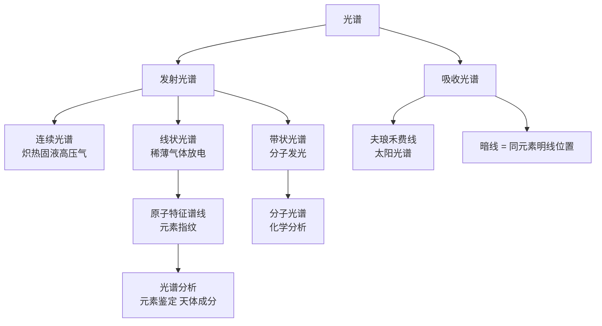

# 光的颜色与光谱

> [!abstract] 概览
> 光的颜色与光谱是波动光学与原子物理的桥梁。光的颜色由光的==频率==决定（与介质无关），可见光波长范围约 380～760 nm，对应频率约 4～8×10¹⁴ Hz。光谱按产生方式分为发射光谱（连续光谱、线状光谱）与吸收光谱（如太阳光谱中的夫琅禾费线），每种元素的原子光谱具有独特的特征谱线——这是光谱分析的物理基础。本节系统讨论光的颜色与频率的关系、可见光谱、光谱分类、原子光谱与分子光谱、光谱分析的应用（元素鉴定、天体成分、红移测距）、光谱仪简介等内容。本节是 [[05-光的电磁本性]] 的姊妹章节，也是大学 [[原子物理]] 与 [[光学]] 中光谱学的入门基础，同时为 [[04-光的粒子性/01-光电效应]] 中玻尔原子模型做铺垫。

## 核心概念

### 一、光的颜色由频率决定

**核心命题**：光的颜色由==频率==决定，==与介质无关==。同一束光从空气进入水中，波长改变（变短），频率不变，颜色不变。

**物理意义**：颜色是人眼视网膜上视锥细胞对光的频率响应的主观感受。视锥细胞有三种（红、绿、蓝），分别对不同频率光敏感，三者组合形成颜色感知。==频率是光的固有属性==，与介质无关；波长是介质中的物理量，随折射率变化。

**关键公式**：

$$
\nu = \dfrac{c}{\lambda_0} = \dfrac{v}{\lambda}
$$

其中 $\lambda_0$ 为真空波长，$\lambda$ 为介质中波长，$v$ 为介质中光速，$\nu$ 为频率（不变）。

> [!note] 颜色的主观性
> 颜色是==主观感觉==，不是光的客观属性。同一频率的光对不同物种（如蜜蜂能看到紫外光）可能呈现不同"颜色"。严格地说，物理上只描述频率或波长，"颜色"是生物学与心理学范畴。

### 二、可见光谱

**可见光波长范围**（真空中）：

| 颜色 | 波长范围 (nm) | 频率范围 (Hz) |
| :---: | :---: | :---: |
| 红 | 620–760 | 4.0–4.8×10¹⁴ |
| 橙 | 590–620 | 4.8–5.1×10¹⁴ |
| 黄 | 570–590 | 5.1–5.3×10¹⁴ |
| 绿 | 495–570 | 5.3–6.1×10¹⁴ |
| 蓝 | 450–495 | 6.1–6.7×10¹⁴ |
| 紫 | 380–450 | 6.7–7.9×10¹⁴ |

**频率与波长关系**（真空中）：

$$
c = \lambda\nu, \quad c\approx 3\times 10^8\,\text{m/s}
$$

**人眼最敏感波长**：约 555 nm（黄绿色），这是人类进化的结果——太阳辐射峰值在此附近。

### 三、光谱的分类

**光谱**：光按波长（或频率）展开形成的图案，称为光谱。按产生方式可分为两大类：

#### 1. 发射光谱

物体发光直接产生的光谱，分两种：

- **连续光谱**：包含一切波长的连续光谱。由==炽热的固体、液体、高压气体==发出。如白炽灯、太阳本体、铁水。
- **线状光谱（明线光谱）**：只含若干离散波长的亮线。由==稀薄气体==放电发光产生。每种元素的线状光谱都是独特的，称为该元素的==特征谱线==。

#### 2. 吸收光谱

连续光谱通过低温气体后，某些波长的光被吸收，在连续背景上形成暗线，称为吸收光谱（暗线光谱）。

- **夫琅禾费线**：太阳光谱中的暗线。1814 年夫琅禾费首次观察到，后由基尔霍夫解释为太阳大气中元素对特定波长光的吸收。
- **吸收与发射的对应**：同种元素的吸收光谱暗线位置与其发射光谱明线位置==完全对应==——这是基尔霍夫定律的核心。

> [!tip] 记忆口诀
> "炽热固液高压气，连续光谱是规律；稀薄气体放电亮，线状光谱各相异；连续穿过冷气体，吸收暗线对应齐。"

### 四、原子光谱

**特征谱线**：每种元素的原子发光都形成==独特==的线状光谱——这是该元素的"指纹"。氢的巴耳末系、钠的 D 双线（589.0、589.6 nm）、汞的多条特征线等都是经典例子。

**物理本质**：原子光谱源于原子外层电子在能级间跃迁时辐射的光子。每个光子的能量 $E=h\nu$ 等于两能级之差：

$$
h\nu = E_2 - E_1
$$

由于原子能级是离散的，故辐射光子的频率也是离散的，形成线状光谱。这是==量子化==的直接证据——玻尔氢原子模型正是为解释氢光谱而提出（参见 [[04-光的粒子性/01-光电效应]] 后续章节）。

**氢原子光谱系**：

- 莱曼系（紫外）：$n\to 1$
- 巴耳末系（可见光）：$n\to 2$
- 帕邢系（红外）：$n\to 3$
- 布拉开系、普丰德系（远红外）

### 五、分子光谱

**带状光谱**：分子发光形成的光谱不是离散的线，而是由密集的线组成的"带"——称为带状光谱。

**物理本质**：分子能量包括电子能、振动能、转动能三种，每种都量子化。三种能级跃迁组合产生密集的谱线，看上去像连续的带。

**应用**：分子光谱（红外光谱、拉曼光谱）是化学分析、有机物结构鉴定的核心工具。

### 六、光谱分析应用

#### 1. 元素鉴定

每种元素有独特特征谱线，故可通过光谱鉴定物体所含元素。

- **焰色反应**：钠黄（589 nm）、钾紫（404、766 nm）、钙橙红、铜绿、锶红、钡黄绿——本质是元素的特征发射光谱。日常烟花颜色即基于此。
- **定性分析**：将待测物光谱与已知元素谱线对照，发现某条特征线即可确认该元素存在。
- **定量分析**：特征线强度与元素含量成正比，可测定元素浓度。

#### 2. 天体成分

恒星遥远无法直接取样，但通过分析其光谱可知成分。

- **太阳大气成分**：太阳光谱中的夫琅禾费线对应钠、铁、氢、钙、镁等元素——这是天体物理的开端。
- **恒星成分**：恒星光谱分类（OBAFGKM 型）基于温度与谱线特征。

#### 3. 红移测距

**多普勒红移**：星系远离我们时，其光谱中所有谱线向长波（红）端移动——称为红移。红移量 $z=\dfrac{\lambda'-\lambda}{\lambda}$ 与星系退行速度 $v$ 成正比（$v\ll c$ 时）：

$$
z \approx \dfrac{v}{c}
$$

**哈勃定律**：星系退行速度与其距离 $d$ 成正比：

$$
v = H_0 d
$$

其中哈勃常数 $H_0\approx 70\,\text{km/s/Mpc}$。测得红移即可推算星系距离——这是宇宙学测距的基石。

### 七、光谱仪简介

**结构**：光源 → 入射狭缝 → 准直透镜 → 色散元件（棱镜或光栅）→ 聚焦透镜 → 出射狭缝（或探测器）。

**类型**：

- **棱镜光谱仪**：利用色散（折射率随波长变化），==红光偏折小、紫光偏折大==。
- **光栅光谱仪**：利用衍射（光栅方程 $d\sin\theta=k\lambda$），==红光偏折大、紫光偏折小==。
- **傅里叶变换光谱仪**：利用迈克尔逊干涉仪 + 傅里叶变换，灵敏度高。

## 推导与原理

### 一、颜色与频率关系的推导

光从真空进入折射率 $n$ 的介质，频率 $\nu$ 不变（由波源决定），光速变为 $v=\dfrac{c}{n}$，故波长变为：

$$
\lambda = \dfrac{v}{\nu} = \dfrac{c}{n\nu} = \dfrac{\lambda_0}{n}
$$

故==频率不变、波长变短==。颜色由频率决定，故颜色不变。

> [!warning] 易错
> 不要误以为"颜色由波长决定"——若如此，光进入水中后波长变短就应"颜色偏紫"，但实际颜色不变。正确理解是：==频率是光的固有属性，颜色对应频率==。

### 二、氢原子巴耳末公式

巴耳末（1885）发现氢可见光区谱线波长满足经验公式：

$$
\dfrac{1}{\lambda} = R\left(\dfrac{1}{2^2} - \dfrac{1}{n^2}\right), \quad n=3,4,5,\ldots
$$

其中 $R\approx 1.097\times 10^7\,\text{m}^{-1}$ 为里德伯常数。

玻尔（1913）从氢原子模型出发严格推导出此公式，并解释 $R$ 的物理意义。这是量子力学的开端之一。

### 三、夫琅禾费线成因

太阳核心高温发出连续光谱，经过较冷的太阳大气时，大气中各种元素的原子吸收其特征波长的光，形成暗线。每种暗线对应一种元素——由此可推断太阳大气成分。

> [!example] 经典发现
> 1868 年，詹森在太阳光谱中发现一条不明黄线（587.6 nm），无法对应任何已知元素，命名为"氦"（源自希腊语 helios，太阳）。直到 1895 年才在地球上找到氦——这是光谱分析"先发现太阳元素、后找到地球元素"的经典案例。

### 四、光谱分类知识脉络

## 典型实例与类比

> [!example] 生活实例
> 1. **彩虹**：雨后空气中水滴折射色散白光，形成红→橙→黄→绿→蓝→靛→紫的彩虹。
> 2. **焰色反应**：烟花含不同金属盐，燃烧时发出不同颜色——锶红、钡绿、铜蓝、钠黄。
> 3. **日光灯的光谱**：日光灯含汞蒸气放电，发出汞的特征线状光谱（紫、绿、黄等），通过荧光粉转换为接近日光的连续光谱。
> 4. **钠灯**：高压钠灯发出强烈的钠 D 双线（589 nm 附近），故呈橙黄色——这是城市路灯的常见颜色。
> 5. **激光单色性**：激光是几乎单一频率的光，谱线极窄，是良好的单色光源。
> 6. **红移发现宇宙膨胀**：哈勃 1929 年观测到远处星系普遍红移，推断宇宙正在膨胀——这是大爆炸宇宙学的关键证据。

**类比**：

- 光谱 ↔ 钢琴键盘：每个键对应一个频率（音高），光的频率分布就像钢琴键盘上的"音域"。
- 原子特征谱线 ↔ 人的指纹：每人指纹独特，每元素谱线独特——都是"身份认证"。
- 夫琅禾费线 ↔ 墨迹鉴定：太阳大气吸收特征光形成暗线，犹如白纸上的墨迹——可鉴定"成分"。
- 红移 ↔ 警笛声变低：警车远离时听到的声调变低（声波多普勒效应）；星系远离时光的频率变低（红移）——物理本质相同。

## 例题

### 例 1：光在介质中的波长与颜色

**题目**：频率为 $\nu=5.0\times 10^{14}\,\text{Hz}$ 的单色光，求其在真空中的波长 $\lambda_0$ 与在水（$n=1.33$）中的波长 $\lambda$。这束光在真空与水中各呈现什么颜色？

**分析**：真空中波长 $\lambda_0=\dfrac{c}{\nu}$；水中波长 $\lambda=\dfrac{\lambda_0}{n}$；颜色由频率决定，与介质无关。

**解答**：

真空中波长：

$$
\lambda_0 = \dfrac{c}{\nu} = \dfrac{3\times 10^8}{5.0\times 10^{14}} = 6.0\times 10^{-7}\,\text{m} = 600\,\text{nm}
$$

水中波长：

$$
\lambda = \dfrac{\lambda_0}{n} = \dfrac{600}{1.33}\approx 451\,\text{nm}
$$

颜色由频率决定，频率 $5.0\times 10^{14}\,\text{Hz}$ 对应真空波长 600 nm，呈==橙色==；在水中虽然波长变为约 451 nm（与真空紫光波长相近），但颜色==仍为橙色==——因为颜色由频率而非波长决定。

**点评**：此题是经典的"颜色由频率决定"考点。易错点是仅算出水中的波长后误判颜色为紫色——必须牢记==颜色对应频率==，介质改变波长但不变频率、不变颜色。

### 例 2：夫琅禾费线与元素鉴定

**题目**：观察某恒星光谱，在波长 589.0 nm 与 589.6 nm 处出现明显暗线。已知钠元素的特征发射谱线恰为 589.0 nm 与 589.6 nm（钠 D 双线）。

(1) 该恒星大气中是否含有钠？为什么？
(2) 若另一恒星光谱中这两条暗线移至 590.0 nm 与 590.6 nm，说明什么？

**分析**：(1) 吸收光谱的暗线位置与同元素发射光谱的明线位置对应——暗线说明该元素存在。(2) 暗线整体向长波方向移动，说明该恒星正在远离我们（红移）。

**解答**：

(1) 该恒星==含有钠==。理由：吸收光谱暗线与钠元素发射光谱明线位置完全对应，说明恒星大气中存在钠原子，吸收了对应波长的光，形成夫琅禾费暗线。

(2) 暗线由 589.0/589.6 nm 移至 590.0/590.6 nm，整体向长波方向移动（红移）。这说明该恒星==正在远离我们==。

红移量：

$$
z = \dfrac{\Delta\lambda}{\lambda} = \dfrac{590.0-589.0}{589.0}\approx 1.70\times 10^{-3}
$$

退行速度（$v\ll c$ 近似）：

$$
v = zc = 1.70\times 10^{-3}\times 3\times 10^8 \approx 5.1\times 10^5\,\text{m/s} = 510\,\text{km/s}
$$

**点评**：此题综合考查吸收光谱、元素鉴定、多普勒红移三大知识点。光谱分析是天体物理的核心方法——"远在亿万光年之外，仍能知晓其成分与运动状态"，这正是光谱分析的伟大力量。

## 易错提醒

> [!warning] 易错点
> 1. **颜色由波长还是频率决定？** 由==频率==决定。介质变化时波长变化但频率不变，颜色不变。
> 2. **连续光谱 vs 线状光谱的发光体**：炽热固液高压气→连续；稀薄气体放电→线状。注意"高压气体"也算连续。
> 3. **吸收线 vs 发射线对应关系**：同种元素的吸收暗线与发射明线位置==完全相同==——这是基尔霍夫定律的核心，也是光谱分析的依据。
> 4. **太阳光谱是连续还是吸收？** 是==吸收光谱==——太阳核心发连续光，太阳大气吸收形成暗线（夫琅禾费线）。
> 5. **红移 ≠ 颜色变红**：红移指==所有谱线==向长波方向移动，不是仅"红色部分增加"。这是宇宙学红移，与多普勒效应机理相同。
> 6. **棱镜光谱与光栅光谱顺序相反**：棱镜==红光偏折小、紫光偏折大==（红在内、紫在外）；光栅==红光偏折大、紫光偏折小==（红在外、紫在内）。

> [!note] 概念辨析
> - **发射光谱 vs 吸收光谱**：前者物体自身发光产生，后者连续光经低温气体吸收形成；同元素的发射与吸收谱线位置对应。
> - **连续光谱 vs 线状光谱**：前者所有波长都有光（"一片亮"），后者只有离散波长有光（"几条线"）。
> - **原子光谱 vs 分子光谱**：原子光谱为==线状==（电子能级跃迁），分子光谱为==带状==（电子+振动+转动能级跃迁组合）。
> - **色散（棱镜） vs 衍射（光栅）分光**：原理不同、光谱排列顺序相反——这是高考常考的对比点。
> - **多普勒红移 vs 引力红移**：前者源于运动（远离），后者源于引力（强引力场中光波频率降低）。两者机理不同但现象相似。

## 与其他知识关联

- 与 [[01-光的干涉]] 的关系：白光干涉的彩色条纹揭示不同波长对应不同颜色。
- 与 [[02-光的衍射]] 的关系：光栅衍射是光谱仪的核心原理，光栅光谱是光谱分析的重要工具。
- 与 [[03-光的偏振]] 的关系：偏振可帮助判断光源性质（散射光、反射光的偏振特性影响光谱测量）。
- 与 [[05-光的电磁本性]] 的关系：可见光是电磁波谱中极小的一段，颜色对应电磁波的频率。
- 与 [[01-几何光学基础/03-光的折射与折射率]] 的关系：棱镜色散源于折射率随波长变化（$n=n(\lambda)$），是几何光学与光谱学的桥梁。
- 与 [[04-光的粒子性/01-光电效应]] 的关系：原子光谱的离散性是量子化的证据，启发玻尔原子模型与量子力学。
- 与 [[06-电磁波与传感器/02-电磁波谱]] 的关系：可见光是电磁波谱的一部分，与红外、紫外等不可见光紧密关联。
- 高中—大学衔接：[[原子物理]]（玻尔模型、量子跃迁）、[[光学]]（光谱学、激光光谱）、[[天体物理]]（恒星光谱分类、宇宙学红移）。
- 与热学联系：[[03-热力学定律/04-熵与热力学第三定律]]（黑体辐射的普朗克公式与光谱联系）。
- 返回 [[00-光学总览]]

## 作者的话

> [!quote] 个人理解
> 光谱是物理学最浪漫的章节之一——通过一束光，我们能"看见"远在亿万光年之外的恒星成分、温度、运动状态，甚至宇宙的起源。19 世纪中叶，基尔霍夫与本生用棱镜与煤气灯，从矿泉水中发现了新元素铯与铷——这是"光谱分析"的开端。从此光谱成为物理、化学、天文的共同工具，被誉为"宇宙的密码本"。
>
> 学习建议：抓"两个对应"——发射明线与吸收暗线位置对应；光谱线与元素对应。抓"两个相反"——棱镜光谱（红内紫外）与光栅光谱（红外紫内）顺序相反；多普勒红移（远离）与蓝移（接近）方向相反。抓"一个核心"——颜色由频率决定，频率是光的固有属性。
>
> 扩展思考：光谱分析的力量在于"特征性"——每种元素谱线独特，犹如"宇宙指纹"。从夫琅禾费线发现太阳含钠、氦，到哈勃红移发现宇宙膨胀，再到类星体光谱研究早期宇宙——光谱始终是天文学的最强工具。21 世纪系外行星探测也是通过观察恒星光谱周期性微小变化实现的（行星遮掩使光谱亮度周期变化）。==每一条谱线都是宇宙写给我们的信==，学会读光谱，就是学会"听"宇宙说话。这是物理学最具诗意的章节之一。

---
*返回 [[00-光学总览]]*
