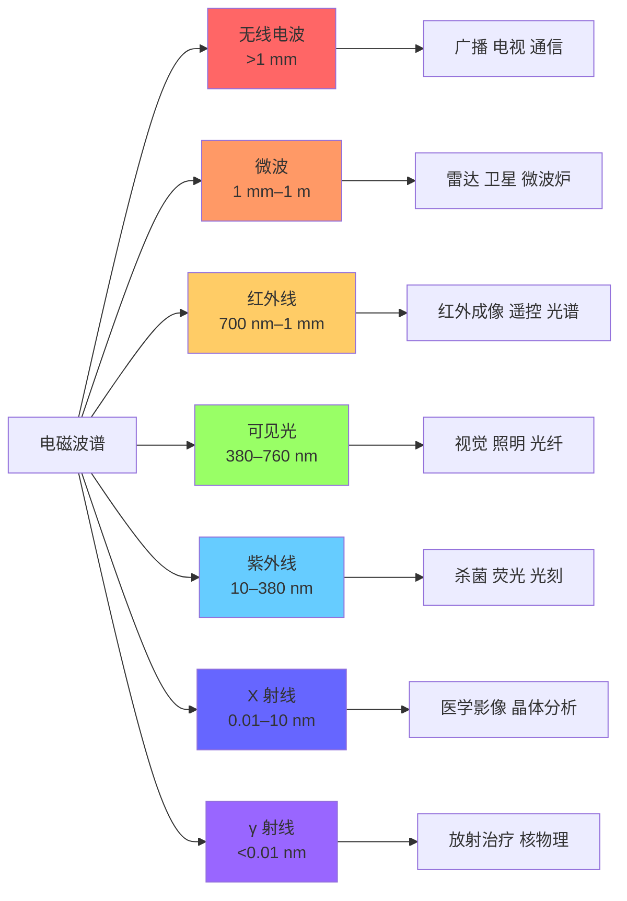
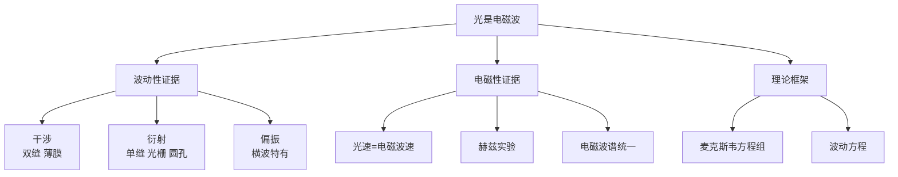

# 光的电磁本性

> [!abstract] 概览
> 光的电磁本性是波动光学的"最终归宿"——19 世纪中叶，麦克斯韦集前人之大成，提出变化的电场产生磁场、变化的磁场产生电场，预言电磁波以光速传播，并断言"光是一种电磁波"。1888 年赫兹用实验证实了这一预言，从此光学与电磁学统一为同一学科。本节系统讨论麦克斯韦电磁理论的核心思想、光速的理论推导 $c=\dfrac{1}{\sqrt{\varepsilon_0\mu_0}}\approx 3\times 10^8\,\text{m/s}$、电磁波谱（无线电波→微波→红外线→可见光→紫外线→X 射线→γ 射线）、赫兹实验、光的波动性总结（干涉、衍射、偏振三大证据）、惠更斯原理简介，以及不同波段电磁波的应用。本节是 [[01-光的干涉]]、[[02-光的衍射]]、[[03-光的偏振]] 的理论总结，也是大学 [[电动力学]] 与 [[物理光学]] 的入门基础，并为 [[04-光的粒子性/01-光电效应]] 中光本性的进一步讨论埋下伏笔。

## 核心概念

### 一、麦克斯韦电磁理论

**两大支柱**：

1. **变化的磁场产生电场**（法拉第电磁感应定律的本质）：磁场随时间变化时，在其周围空间激发==涡旋电场==——这是 [[04-电磁感应/02-法拉第电磁感应定律]] 的本质。
2. **变化的电场产生磁场**（麦克斯韦的独创）：电场随时间变化时，在其周围空间激发磁场——这是==位移电流==假说的物理基础。

**核心思想**：若变化磁场产生电场，且电场也变化，则该变化电场又产生磁场，新磁场若也变化，又产生新电场……如此相互激发，电磁场便以波的形式向远处传播，形成==电磁波==。这是一种无需介质、自持传播的波。

**"变化"的层次**（==重点==）：

| 场的变化情况 | 产生的另一场 |
| :---: | :---: |
| 恒定（不变化） | 不产生 |
| 均匀变化 | 产生稳恒的另一场 |
| 非均匀变化（如周期性变化） | 产生变化的另一场 |

只有"非均匀变化"才能产生相互激发、自持传播的电磁波。

> [!note] 对称之美
> 麦克斯韦的洞见源于对称性思考——既然变化的磁场能产生电场，变化的电场也应能产生磁场。这一对称性思考加上位移电流假说，使麦克斯韦方程组自洽，并自然导出电磁波以光速传播。这是物理学史上最伟大的"对称性预言"之一。

### 二、光速的理论推导

**电磁波在真空中的传播速度**：

$$
\boxed{c = \dfrac{1}{\sqrt{\varepsilon_0\mu_0}} \approx 2.998\times 10^8\,\text{m/s} \approx 3\times 10^8\,\text{m/s}}
$$

其中：

- $\varepsilon_0\approx 8.854\times 10^{-12}\,\text{F/m}$ 为真空介电常数（电容率）
- $\mu_0=4\pi\times 10^{-7}\,\text{H/m}$ 为真空磁导率

**意义**：这一速度==恰好等于光速==——麦克斯韦据此断言"光是一种电磁波"，把光与电磁现象统一于同一理论框架。这是 19 世纪物理学最辉煌的成就之一。

**介质中的光速**：

$$
v = \dfrac{1}{\sqrt{\varepsilon\mu}} = \dfrac{c}{n}
$$

其中 $\varepsilon=\varepsilon_r\varepsilon_0$、$\mu=\mu_r\mu_0$ 为介质的介电常数与磁导率；$n=\sqrt{\varepsilon_r\mu_r}$ 为介质折射率。

### 三、电磁波的基本性质

1. **横波**：电场 $\vec{E}$、磁场 $\vec{B}$、传播方向 $\vec{k}$ 两两垂直，构成右手螺旋关系。$\vec{E}$ 与 $\vec{B}$ 同相位、同频率。
2. **传播不需介质**：电磁波可在真空中传播，这与机械波必须依赖介质截然不同。
3. **光速传播**：真空中 $c=3\times 10^8\,\text{m/s}$，介质中 $v=c/n$。
4. **携带能量与动量**：电磁辐射具有能量（如阳光温暖大地）与动量（光压，参见康普顿效应）。
5. **满足 $c=\lambda\nu$**：频率与波长成反比。
6. **能发生反射、折射、干涉、衍射、偏振**等波的一切现象——这正说明光属于电磁波。

### 四、电磁波谱

按波长从长到短（频率从低到高）排列：

| 波段 | 波长范围 | 频率范围 | 主要应用 |
| :---: | :---: | :---: | :---: |
| 无线电波 | >1 mm | <300 GHz | 广播、电视、通信 |
| 微波 | 1 mm–1 m | 300 MHz–300 GHz | 雷达、卫星通信、微波炉 |
| 红外线 | 700 nm–1 mm | 3×10¹¹–4×10¹⁴ Hz | 红外成像、遥控、热治疗 |
| 可见光 | 380–760 nm | 4–8×10¹⁴ Hz | 视觉、照明、光纤通信 |
| 紫外线 | 10–380 nm | 8×10¹⁴–3×10¹⁶ Hz | 杀菌、荧光、光刻 |
| X 射线 | 0.01–10 nm | 3×10¹⁶–3×10¹⁹ Hz | 医学影像、晶体结构分析 |
| γ 射线 | <0.01 nm | >3×10¹⁹ Hz | 放射治疗、核物理研究 |

**谱段变化规律**（==核心==）：

- 波长：递减
- 频率：递增
- 光子能量 $E=h\nu$：递增
- 穿透本领：递增（一般而言）
- 视觉感知：仅可见光段能被人眼感知

### 五、赫兹实验（1888 年）

**装置**：感应圈给发射器（两个金属球间隙）供电，间隙产生火花放电，辐射电磁波；远处接收器（环形铜线留有间隙）调到合适长度时，间隙也产生火花。

**意义**：

1. 首次实验证实电磁波的真实存在。
2. 测得电磁波传播速度等于光速。
3. 证实电磁波能反射、折射、干涉、衍射、偏振——与光性质完全相同。
4. ==从此"光是一种电磁波"得到实验支撑==，光学与电磁学统一。

### 六、惠更斯原理简介

**内容**（1678）：波前上每一点都是发出球面子波的新波源，这些子波的包络面形成新的波前。

**应用**：可解释光的反射、折射、衍射等规律。惠更斯原理是波动光学的起点，后经菲涅耳补充（子波相干叠加）形成完整的惠更斯-菲涅耳原理。

### 七、不同波段电磁波的应用

#### 1. 无线电波

- **长波、中波**：地波传播，适合广播（AM 中波广播）
- **短波**：天波经电离层反射，可远距离通信
- **超短波、微波**：空间波直线传播，电视、手机、卫星通信

#### 2. 微波

- 雷达、卫星通信、移动通信（5G/6G 频段）
- 微波炉：2.45 GHz 微波使水分子共振发热
- 射电望远镜：接收宇宙天体发出的微波辐射

#### 3. 红外线

- 红外成像：夜视仪、热成像（医疗、军事、工业检测）
- 红外遥控：电视、空调遥控器
- 红外光谱：分子结构分析（化学）
- 红外加热：烤箱、理疗灯

#### 4. 可见光

- 人类视觉、照明
- 光纤通信：利用可见光或近红外光在光纤中全反射传输
- 摄影、显示技术

#### 5. 紫外线

- 杀菌消毒：破坏微生物 DNA
- 荧光效应：验钞、矿物鉴定、荧光灯
- 光刻：半导体制造（紫外光刻、EUV 极紫外光刻）
- 人体合成维生素 D（适量），过量会晒伤

#### 6. X 射线

- 医学影像：X 光片、CT（计算机断层扫描）
- 工业探伤：检测金属内部缺陷
- 晶体结构分析：X 射线衍射（XRD），测定晶体原子排列
- 安检：行李 X 光机

#### 7. γ 射线

- 放射治疗：杀死癌细胞（γ 刀）
- 工业探伤：检测金属内部缺陷
- 核物理研究：γ 谱学、核结构分析
- 食品辐照保鲜

## 推导与原理

### 一、光速 $c=\dfrac{1}{\sqrt{\varepsilon_0\mu_0}}$ 的推导

由麦克斯韦方程组在真空中的形式（无源情况）：

$$
\nabla\cdot\vec{E}=0, \quad \nabla\cdot\vec{B}=0
$$

$$
\nabla\times\vec{E}=-\dfrac{\partial\vec{B}}{\partial t}, \quad \nabla\times\vec{B}=\mu_0\varepsilon_0\dfrac{\partial\vec{E}}{\partial t}
$$

对第一个旋度方程再取旋度，并利用矢量恒等式 $\nabla\times(\nabla\times\vec{E})=\nabla(\nabla\cdot\vec{E})-\nabla^2\vec{E}$：

$$
\nabla^2\vec{E} = \mu_0\varepsilon_0\dfrac{\partial^2\vec{E}}{\partial t^2}
$$

同理：

$$
\nabla^2\vec{B} = \mu_0\varepsilon_0\dfrac{\partial^2\vec{B}}{\partial t^2}
$$

这是==波动方程== $\nabla^2 u = \dfrac{1}{v^2}\dfrac{\partial^2 u}{\partial t^2}$ 的形式，波速：

$$
\boxed{v = \dfrac{1}{\sqrt{\mu_0\varepsilon_0}} = c \approx 3\times 10^8\,\text{m/s}}
$$

代入数值：

$$
c = \dfrac{1}{\sqrt{4\pi\times 10^{-7}\times 8.854\times 10^{-12}}} \approx 2.998\times 10^8\,\text{m/s}
$$

这一理论值与当时测得的光速（约 3.15×10⁸ m/s，傅科 1862 年测得）==惊人地一致==——麦克斯韦据此断言"光是一种电磁波"。

> [!tip] 物理之美
> 这一推导是物理学史上最优雅的"理论预言"之一——$\varepsilon_0$ 来自电学，$\mu_0$ 来自磁学，二者结合恰好给出光速。麦克斯韦方程组以四个方程统一了电、磁、光三大领域，是 19 世纪物理学的最高成就。

### 二、电磁波是横波的证明

由麦克斯韦方程组的旋度形式可证：$\vec{E}\perp\vec{k}$，$\vec{B}\perp\vec{k}$，且 $\vec{E}\perp\vec{B}$。

平面电磁波解：

$$
\vec{E} = \vec{E}_0\cos(\vec{k}\cdot\vec{r}-\omega t), \quad \vec{B} = \vec{B}_0\cos(\vec{k}\cdot\vec{r}-\omega t)
$$

由 $\nabla\cdot\vec{E}=0$ 与 $\nabla\cdot\vec{B}=0$，得 $\vec{k}\cdot\vec{E}_0=0$、$\vec{k}\cdot\vec{B}_0=0$——即 $\vec{E}$、$\vec{B}$ 都垂直于传播方向 $\vec{k}$。

由 $\nabla\times\vec{E}=-\dfrac{\partial\vec{B}}{\partial t}$，可得 $\vec{B}_0=\dfrac{1}{\omega}\vec{k}\times\vec{E}_0$——即 $\vec{B}\perp\vec{E}$，且三者构成右手螺旋关系。

**结论**：电磁波是==横波==——这解释了光为何能发生偏振现象（参见 [[03-光的偏振]]）。

### 三、电磁波谱知识脉络

### 四、波动光学的三大证据统一

## 典型实例与类比

> [!example] 生活实例
> 1. **手机信号**：手机通信使用微波（约 900 MHz、1.8 GHz、2.4 GHz、5 GHz），通过空间波直线传播，基站负责中继转发——这是电磁波无需介质、可远距离传播的体现。
> 2. **微波炉**：2.45 GHz 微波使食物中水分子高频振动产生热量——电磁波携带能量的直接证据。
> 3. **医院 X 光片**：X 射线穿透软组织被骨骼吸收，形成骨骼影像——不同波段电磁波穿透能力不同的应用。
> 4. **红外夜视仪**：探测物体红外辐射形成"热像"——任何温度高于绝对零度的物体都辐射红外线。
> 5. **紫外验钞**：紫外光激发钞票荧光物质发光——紫外线荧光效应的应用。
> 6. **太阳光谱分析**：太阳不仅发可见光，还辐射无线电波、红外、紫外、X 射线等全波段电磁波——通过分析各波段可推断太阳活动、温度、成分。
> 7. **5G/6G 通信**：使用更高频段（毫米波、太赫兹），数据传输速率更高，但穿透能力下降、覆盖范围减小——频率越高，能量越大但传播"绕射"能力越弱。

**类比**：

- 麦克斯韦方程组 ↔ 物理学的"统一大业"：犹如牛顿统一天体与地面力学，麦克斯韦统一电、磁、光三大领域。
- 电磁波谱 ↔ 钢琴键盘延伸：可见光只是"几个八度"，整个电磁波谱是从最低音到最高音的"超巨型键盘"。
- 真空光速 ↔ 宇宙速度上限：光速是物质、能量、信息传播的极限速度——爱因斯坦相对论进一步确立了这一地位。

## 例题

### 例 1：光速的真空值与介质中速度

**题目**：已知真空介电常数 $\varepsilon_0=8.854\times 10^{-12}\,\text{F/m}$，真空磁导率 $\mu_0=4\pi\times 10^{-7}\,\text{H/m}$。求：(1) 真空中光速 $c$；(2) 玻璃（$n=1.5$）中的光速 $v$ 与光在玻璃中传播波长 $\lambda$（真空中波长 $\lambda_0=600\,\text{nm}$）。

**分析**：(1) 由 $c=\dfrac{1}{\sqrt{\varepsilon_0\mu_0}}$ 求真空光速；(2) 介质中 $v=\dfrac{c}{n}$，$\lambda=\dfrac{\lambda_0}{n}$。

**解答**：

(1)

$$
c = \dfrac{1}{\sqrt{\varepsilon_0\mu_0}} = \dfrac{1}{\sqrt{8.854\times 10^{-12}\times 4\pi\times 10^{-7}}}
$$

$$
c \approx \dfrac{1}{\sqrt{1.113\times 10^{-17}}} \approx 3.0\times 10^8\,\text{m/s}
$$

(2) 玻璃中光速：

$$
v = \dfrac{c}{n} = \dfrac{3.0\times 10^8}{1.5} = 2.0\times 10^8\,\text{m/s}
$$

玻璃中波长：

$$
\lambda = \dfrac{\lambda_0}{n} = \dfrac{600\,\text{nm}}{1.5} = 400\,\text{nm}
$$

**点评**：光速公式 $c=\dfrac{1}{\sqrt{\varepsilon_0\mu_0}}$ 是麦克斯韦理论的核心预言。注意光进入介质后==光速变慢、波长变短、频率不变==——这与 [[04-光的颜色与光谱]] 中"颜色由频率决定"完全一致。

### 例 2：电磁波谱排序与判断

**题目**：按波长从长到短排列以下电磁波：紫光、X 射线、无线电波、红外线、γ 射线、红光、紫外线、微波。并指出其中能量最大的与可见光两侧紧邻的两种电磁波。

**分析**：电磁波谱按波长从长到短为：无线电波→微波→红外线→可见光（红→紫）→紫外线→X 射线→γ 射线。

**解答**：

波长从长到短排列：

==无线电波 → 微波 → 红外线 → 红光 → 紫光 → 紫外线 → X 射线 → γ 射线==

- 能量最大：==γ 射线==（频率最高，$E=h\nu$ 最大）
- 可见光红光侧紧邻：==红外线==
- 可见光紫光侧紧邻：==紫外线==

**点评**：电磁波谱排序是高考高频考点。记忆口诀："无微红可紫 X γ"（无微红可紫、叉γ）。注意可见光内部==红光波长最长、紫光波长最短==，与电磁波谱整体顺序一致。

### 例 3：电磁波的能量与频率

**题目**：一束电磁波频率 $\nu=5.0\times 10^{14}\,\text{Hz}$。求：(1) 真空中波长 $\lambda$；(2) 单个光子能量 $E$（$h=6.63\times 10^{-34}\,\text{J·s}$）；(3) 这束电磁波属于哪个波段？人眼能否看见？

**分析**：(1) 真空中 $\lambda=\dfrac{c}{\nu}$；(2) 光子能量 $E=h\nu$；(3) 与可见光范围（380–760 nm）比较判断。

**解答**：

(1) 真空中波长：

$$
\lambda = \dfrac{c}{\nu} = \dfrac{3.0\times 10^8}{5.0\times 10^{14}} = 6.0\times 10^{-7}\,\text{m} = 600\,\text{nm}
$$

(2) 单个光子能量：

$$
E = h\nu = 6.63\times 10^{-34}\times 5.0\times 10^{14} = 3.315\times 10^{-19}\,\text{J}
$$

换算为电子伏特：

$$
E = \dfrac{3.315\times 10^{-19}}{1.6\times 10^{-19}} \approx 2.07\,\text{eV}
$$

(3) 波长 600 nm 在可见光范围（380–760 nm）内，==人眼可以看见==，呈==橙色==。

**点评**：此题综合考查 $c=\lambda\nu$、$E=h\nu$ 与电磁波谱判断。注意单个光子能量很小（约 10⁻¹⁹ J 量级），日常光感是大量光子的统计效应——这为 [[04-光的粒子性/01-光电效应]] 中光子概念的引入埋下伏笔。

## 易错提醒

> [!warning] 易错点
> 1. **电磁波 vs 机械波**：电磁波==不需介质==、真空可传；机械波必须介质、真空不能传。但两者都满足 $v=\lambda\nu$、都能干涉衍射偏振。
> 2. **稳恒电场 vs 静电场**：稳恒电场由均匀变化磁场产生，==有旋==（涡旋场）；静电场由静止电荷产生，==无旋==。两者本质不同。
> 3. **位移电流 vs 传导电流**：位移电流由变化电场产生，不涉及电荷移动；传导电流由电荷定向移动产生。两者都能产生磁场——这正是麦克斯韦的洞见。
> 4. **电磁波谱顺序记反**：从长波到短波为"无线电波→微波→红外→可见→紫外→X→γ"。常见错误是把微波与无线电波顺序颠倒，或把 X 与 γ 顺序颠倒。
> 5. **可见光两侧紧邻波段**：红光侧==红外线==、紫光侧==紫外线==。常被误记为"红光侧紫外、紫光侧红外"。
> 6. **光速公式记忆**：$c=\dfrac{1}{\sqrt{\varepsilon_0\mu_0}}$，==不是== $c=\sqrt{\varepsilon_0\mu_0}$（漏分母）。数值上 $\varepsilon_0\mu_0$ 乘积约为 $1.11\times 10^{-17}$，开方再取倒数即为 $c$。

> [!note] 概念辨析
> - **静电场 vs 涡旋电场**：前者由电荷产生，电场线起止于电荷，无旋；后者由变化磁场产生，电场线闭合，有旋。
> - **电磁波 vs 光波**：光波是电磁波谱中==可见波段==的电磁波，二者不是并列关系而是包含关系。
> - **真空光速 vs 介质光速**：真空光速 $c$ 是常数；介质光速 $v=c/n$，与介质折射率有关。
> - **频率 vs 波长**：频率是光的==固有属性==（不变），波长随介质变化。颜色、光子能量 $E=h\nu$ 都由频率决定。
> - **波动说 vs 电磁说**：惠更斯波动说仅断言"光是一种波"；麦克斯韦电磁说进一步指出"光是一种电磁波"——后者包含前者，是更具体的理论。

## 与其他知识关联

- 与 [[01-光的干涉]] 的关系：干涉是光波动性的实验证据，电磁理论给出波动方程的严格推导。
- 与 [[02-光的衍射]] 的关系：衍射现象是电磁波理论的必然推论，菲涅耳衍射理论建立在麦克斯韦方程组之上。
- 与 [[03-光的偏振]] 的关系：偏振是电磁波==横波性==的直接体现，电场矢量方向即为偏振方向。
- 与 [[04-光的颜色与光谱]] 的关系：可见光是电磁波谱中极小的一段，颜色对应电磁波频率。
- 与 [[01-几何光学基础/03-光的折射与折射率]] 的关系：折射率 $n=\sqrt{\varepsilon_r\mu_r}$，把光学与电磁学参量联系起来。
- 与 [[04-光的粒子性/01-光电效应]] 的关系：电磁理论虽能解释波动性，却==无法解释光电效应==——这导致爱因斯坦提出光量子假说，开启波粒二象性。
- 与 [[04-光的粒子性/03-波粒二象性与德布罗意波]] 的关系：光的电磁本性 + 光子粒子性 → 波粒二象性，进一步推广到所有物质粒子。
- 高中—大学衔接：[[电动力学]]（麦克斯韦方程组的协变形式、电磁波辐射理论）、[[物理光学]]（光的电磁理论的完整应用）、[[相对论]]（光速不变原理与相对论的诞生）。
- 与力学联系：[[机械振动]]（振动的电磁类比）、[[机械波]]（横波与纵波、波速公式类比）。
- 与电学联系：[[06-电磁波与传感器/01-电磁振荡与电磁波]]（麦克斯韦理论与电磁波的产生）、[[06-电磁波与传感器/02-电磁波谱]]（电磁波谱的详细分类与应用）。
- 与热学联系：[[03-热力学定律/04-熵与热力学第三定律]]（黑体辐射是电磁波辐射，引出量子假说）。
- 返回 [[00-光学总览]]

## 作者的话

> [!quote] 个人理解
> 麦克斯韦方程组被誉为"物理学最美的方程组"——四个方程以最简洁的形式统一了电、磁、光三大领域。从库仑定律、毕奥-萨伐尔定律、法拉第定律，到麦克斯韦的位移电流假说，再到光速 $c=\dfrac{1}{\sqrt{\varepsilon_0\mu_0}}$ 的理论预言——这是一段物理学的"史诗"。$\varepsilon_0$ 来自电学，$\mu_0$ 来自磁学，二者结合竟然给出光速——这一"巧合"震撼了麦克斯韦本人，也震撼了整个物理学界。
>
> 学习建议：把握"一个核心思想"——变化的电场与磁场相互激发、自持传播形成电磁波。把握"一个核心公式"——$c=\dfrac{1}{\sqrt{\varepsilon_0\mu_0}}$，它把电学常数、磁学常数与光速联系起来。把握"一张谱"——电磁波谱的波长、频率、能量、应用一览表，是高考必考内容。把"三大波动证据"——干涉、衍射、偏振——作为光波动性的"铁证"牢记。
>
> 扩展思考：麦克斯韦电磁理论虽然伟大，但并非终极真理。19 世纪末黑体辐射"紫外灾难"、光电效应等现象无法用经典电磁理论解释，催生了量子力学（参见 [[04-光的粒子性/01-光电效应]]）。20 世纪初爱因斯坦提出光量子假说，光从此既是波又是粒子——波粒二象性。进一步，量子电动力学（QED）将电磁场量子化，电磁波变成"光子气体"，麦克斯韦方程组成为 QED 的经典极限。从麦克斯韦到 QED，从经典电磁波到光子气体，光的本质认识不断深化——但麦克斯韦方程组始终是这一演化过程的"不动点"。==麦克斯韦的对称性思考、位移电流假说与光速预言，是物理学最优雅的"理论预言"典范==。学习光的电磁本性，不仅是学习一个理论，更是体会物理学"以对称求统一、以方程预言现象"的精神。

---
*返回 [[00-光学总览]]*
