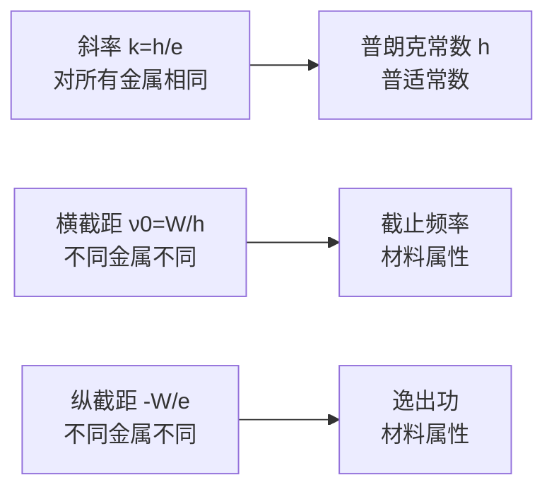

# 光电效应

> [!abstract] 概览
> 光电效应是光的粒子性最直接、最具说服力的实验证据，也是量子论诞生的"第二块基石"（第一块是普朗克的黑体辐射能量子假说）。1887 年赫兹在电磁波实验中偶然发现：紫外线照射锌板时火花放电变得更容易——这就是光电效应的最早观察。1905 年，爱因斯坦在普朗克能量量子化思想的启发下，提出"光量子"（光子）假说，将光视为一份份携带能量 $E=h\nu$ 的粒子流，完美解释了光电效应的四大实验规律（截止频率、瞬时性、饱和电流、遏止电压），并给出著名的光电方程 $E_k=h\nu-W$。这一工作使爱因斯坦获得 1921 年诺贝尔物理学奖（注意：获奖理由正是光电效应，而非相对论）。本节是高中光学的"量子转折点"——光不再仅是电磁波，而开始显露出"粒子"的面孔。本节内容与 [[03-波粒二象性与德布罗意波]] 共同构成高考光学压轴的概念核心，也是大学 [[量子力学]] 的入门钥匙。

## 核心概念

### 一、光电效应现象

**光电效应**：在光（包括可见光与不可见光）的照射下，金属表面发射出电子的现象。

**光电子**：光电效应中从金属表面逸出的电子。注意：光电子就是普通电子，冠以"光"字只是强调它"由光照产生"，并非一种新粒子。

**光电流**：光电子在电场作用下定向移动形成的电流。

> [!note] 历史脉络
> - **1887 赫兹**：电磁波实验中发现紫外光使锌板火花放电更易发生；
> - **1888 霍尔瓦克斯**：进一步证明紫外光使带负电的锌板失电；
> - **1899 勒纳德**：测定光电子的荷质比 $e/m$，确认光电子就是电子；
> - **1905 爱因斯坦**：发表《关于光的产生和转化的一个启发性观点》，提出光量子假说与光电方程；
> - **1916 密立根**：用精密实验验证光电方程，并测出普朗克常数 $h$，与黑体辐射结果一致——至此光电效应的量子解释被实验完全证实。

### 二、光电效应实验装置

典型的光电效应研究装置（==高考常考图==）由以下部分组成：

| 部件 | 作用 |
| --- | --- |
| 阴极 K（光电阴极） | 待研究的金属（如钾、钠、铯、锌），光照时发射光电子 |
| 阳极 A（收集极） | 吸收光电子，与阴极间形成电场 |
| 电压表 V | 测量 K、A 之间的电压 $U$ |
| 电流表 G（灵敏电流计） | 测量光电流 $I$ |
| 可调直流电源 $\mathcal{E}$ | 提供极板间的电压，可正可负 |
| 光源（含单色仪） | 提供不同频率、不同强度的单色光 |

**电路工作模式**：
- 当阳极 A 接电源正极、阴极 K 接负极时，K、A 间为**加速电场**，光电子被加速飞向阳极，电流增大；
- 当极性反向（A 接负、K 接正）时，K、A 间为**反向电场**，光电子被减速，电压足够大时光电流恰好减为零，此时电压称为**遏止电压**（截止电压）$U_c$。

> [!tip] 电极命名记忆
> "K" 来自德语 Kathode（阴极），"A" 来自 Anode（阳极）。在光电管中，==K 是发光面、A 是收集面==，这与电池正负极恰好相反——很多同学在这里接反，要特别留意。

### 三、光电效应的四大实验规律

这是本节的核心内容，必须准确理解每条规律的表述与含义：

#### 规律 1：存在截止频率（极限频率）

每种金属都存在一个**截止频率** $\nu_0$（也称极限频率、红限频率）。当入射光频率 $\nu<\nu_0$ 时，无论光强多大、照射时间多长，都不会发生光电效应；只有 $\nu\geq \nu_0$ 时才有光电子逸出。

不同金属的截止频率不同，逸出功越大的金属，$\nu_0$ 越高。碱金属（钾、钠、铷、铯）逸出功小，截止频率低，可见光即可触发；锌、铁等需紫外线。

#### 规律 2：瞬时性

只要 $\nu\geq\nu_0$，光照射金属后**几乎瞬间**就有光电子逸出，延迟时间不超过 $10^{-9}\,\text{s}$。即使光强极弱，瞬时性依然成立——这是经典波动理论无法解释的关键事实。

#### 规律 3：饱和电流与光强成正比

当 $\nu$ 固定、且加速电压足够大时，光电流达到**饱和值** $I_m$。$I_m$ 与入射光强 $P$ 成正比：光强加倍，单位时间内逸出的光电子数加倍，饱和电流加倍。

> [!note] 饱和电流的本质
> 当电压足够大时，K 发射的所有光电子都被 A 收集，再增大电压电流也不再增加——此时电流"饱和"。$I_m \propto P$ 反映的是==光强越大、单位时间内到达阳极的光电子数越多==，而非单个光电子的能量更大。

#### 规律 4：遏止电压与光强无关，只与频率有关

遏止电压 $U_c$ 是使光电流恰为零的反向电压。实验表明：
- ==$U_c$ 与光强 $P$ 无关==——光强增大时 $U_c$ 不变；
- $U_c$ 随入射光频率 $\nu$ 线性增大：$U_c = \dfrac{h}{e}\nu - \dfrac{W}{e}$。

由动能定理 $eU_c = E_{k,\max}$，所以 $U_c$ 直接量度光电子的最大初动能 $E_{k,\max}$。这条规律告诉我们：==光电子的最大初动能由光的频率决定，与光强无关==。

### 四、经典波动理论的困难

19 世纪末，麦克斯韦电磁理论已被广泛接受，"光是电磁波"成为共识。但用经典波动理论解释光电效应时，遇到三大无法克服的困难：

| 实验事实 | 经典波动理论预言 | 矛盾 |
| --- | --- | --- |
| 存在截止频率 $\nu_0$ | 任何频率的光只要足够强都能发射电子 | ==无法解释截止频率== |
| 瞬时性（$<10^{-9}\,\text{s}$） | 弱光需长时间累积能量，延迟可达数秒甚至数小时 | ==无法解释瞬时性== |
| $U_c$ 与光强无关 | 光强大→波的能量大→电子动能大→$U_c$ 应变大 | ==无法解释 $U_c$ 与光强无关== |
| 饱和电流 $I_m\propto P$ | 与实验相符 | 唯一吻合的一条 |

> [!example] 经典理论的"能量累积"图景
> 经典波动理论认为：光波连续地把能量传递给金属中的电子，电子像"吸收雨水的小桶"，慢慢蓄能直至挣脱束缚。按此估算，弱光下电子逸出需数小时——这与实验上 $10^{-9}\,\text{s}$ 的瞬时性完全矛盾。这一矛盾曾困扰物理学界近 20 年。

### 五、爱因斯坦光子说（1905）

**光子说内容**：光不是连续分布的波，而是由一份份离散的"光量子"（光子）组成的光子流。每个光子携带能量

$$\boxed{E = h\nu = \dfrac{hc}{\lambda}}$$

其中 $h\approx 6.626\times10^{-34}\,\text{J·s}$ 为普朗克常数，$\nu$ 为光的频率，$\lambda$ 为光的波长，$c$ 为真空光速。

**光子能量特征**：
- 光子能量与频率成正比、与波长成反比；
- 红光光子能量小（约 1.8 eV），紫光光子能量大（约 3.1 eV），X 射线光子能量可达数千 eV；
- ==单个光子的能量是离散的、不可分割的==——这是"量子"二字的真意。

> [!example] 类比：雨滴与水龙头
> 经典波动理论中的光像"水龙头持续流水"，能量连续；爱因斯坦的光子说则把光比作"下雨"——每一滴雨是一个光子，整体看似连续，实则由无数离散雨滴构成。光强增大相当于雨滴变密，而每个雨滴本身的大小（单个光子能量）由"雨的频率"决定。

### 六、爱因斯坦光电方程

光子说如何解释光电效应？爱因斯坦给出了一条简洁优美的方程——**光电方程**（1905）：

$$\boxed{E_{k,\max} = h\nu - W}$$

其中：
- $E_{k,\max}$ 为光电子的最大初动能（从金属表面逸出、未受其他作用时的最大动能）；
- $h\nu$ 为入射光子能量；
- $W$ 为金属的**逸出功**（也称功函数）：电子从金属表面逸出所需的最小能量。

**物理意义**：一个光子把全部能量 $h\nu$ 交给金属中的一个电子（==一对一==），电子用其中一部分克服逸出功 $W$，剩余部分转化为自身的最大初动能 $E_{k,\max}$。这正是能量守恒在单光子—单电子作用中的体现。

**逸出功 $W$**：是金属的固有属性，与材料有关。常见金属逸出功（单位 eV）：
- 铯 Cs：约 1.9 eV（最易发生光电效应）
- 钾 K：约 2.2 eV
- 钠 Na：约 2.3 eV
- 锌 Zn：约 4.3 eV
- 银 Ag：约 4.7 eV

> [!note] 为何 $E_{k,\max}$ 是最大初动能？
> 金属中电子所处的状态各不相同：表面电子受束缚最弱，逸出"代价"最小；内部电子需先运动到表面才能逸出，还要克服更多阻力。因此==刚好在表面的电子获得最大初动能==，其他电子的初动能小于此值。光电方程给出的是最大值 $E_{k,\max}$。

### 七、遏止电压与截止频率

**遏止电压**：由动能定理 $eU_c = E_{k,\max}$，将光电方程代入得

$$\boxed{eU_c = h\nu - W \quad\Rightarrow\quad U_c = \dfrac{h}{e}\nu - \dfrac{W}{e}}$$

这就是 $U_c$—$\nu$ 图像的方程：一条斜率为 $h/e$、截距为 $-W/e$ 的直线。==斜率只与普朗克常数和电子电量有关，与材料无关==；而截距由逸出功决定，不同金属不同。

**截止频率（红限频率）**：当 $E_{k,\max}=0$ 时对应的入射光频率

$$\boxed{\nu_0 = \dfrac{W}{h}}$$

当 $\nu<\nu_0$ 时，$h\nu<W$，光子能量不足以克服逸出功，无光电子逸出。相应的**截止波长**（红限波长）

$$\lambda_0 = \dfrac{c}{\nu_0} = \dfrac{hc}{W}$$

### 八、光电效应的应用

| 应用 | 原理 |
| --- | --- |
| **光电管** | 利用光电效应将光信号转为电信号，曾用于电影声轨、早期电视 |
| **光控继电器** | 光照时产生光电流驱动继电器，实现"有光/无光"开关 |
| **自动门、电梯感应** | 红外光电传感器检测人体遮挡光路 |
| **电视摄像管** | 早期摄像管将光学图像逐点转为电信号（已被 CCD/CMOS 取代） |
| **太阳能电池** | 光生载流子在 PN 结内建电场下分离，输出电能（==本质是内光电效应==） |
| **光电倍增管** | 极微弱光探测，光电子经多级倍增放大 $10^6$ 倍以上 |

> [!note] 内光电效应 vs 外光电效应
> - **外光电效应**：光电子逸出金属表面（本节内容），需克服逸出功 $W$；
> - **内光电效应**：光子激发载流子在材料内部跃迁，不逸出表面（如光电导效应、光伏效应），太阳能电池、CCD、光敏电阻均属此类。

## 推导与原理

### 一、从光电方程解释四大实验规律

爱因斯坦的光子说 + 光电方程能一举解释所有实验规律，这是它的强大之处：

**1. 截止频率**：$E_{k,\max}=h\nu-W\geq 0$ 要求 $h\nu\geq W$，即 $\nu\geq \nu_0=W/h$。频率低于 $\nu_0$ 时，单个光子能量不足以使电子克服逸出功，无论光强多大（即无论光子数多少），每个光子单独作用都无效——==截止频率的存在是光子"一对一"作用的必然结果==。

**2. 瞬时性**：电子一次性吸收单个光子的全部能量 $h\nu$，无需能量累积。当 $\nu\geq\nu_0$ 时，电子吸收光子瞬间即可逸出，延迟时间仅由电子运动到表面的时间决定（约 $10^{-9}\,\text{s}$ 量级），与光强无关。

**3. 饱和电流 $I_m\propto P$**：光强 $P$ 越大，单位时间内到达金属表面的光子数越多，单位时间内逸出的光电子数 $n$ 越多。$I_m = ne$，故 $I_m\propto P$。

**4. 遏止电压与光强无关**：$eU_c=h\nu-W$，公式中不含光强 $P$——因此 $U_c$ 只由 $\nu$ 和材料 $W$ 决定，与光强无关；而 $\nu$ 增大时 $U_c$ 线性增大——与实验完全吻合。

### 二、密立根实验验证

1916 年密立根设计了精密实验：对多种金属（钠、钾、锂等）测量 $U_c$ 与 $\nu$ 的关系，得到一系列直线。这些直线==斜率相同==（均为 $h/e$）、截距不同（对应不同 $W$）。由此：
- 验证了光电方程 $eU_c=h\nu-W$；
- 精确测定了普朗克常数 $h$，与黑体辐射中测得的值一致——量子假说获得决定性胜利。

### 三、$U_c$—$\nu$ 图像的解读

> [!tip] 图像题套路
> 高考常给 $U_c$—$\nu$ 图像，问"斜率""截距"的含义。==记住：斜率 $h/e$ 与材料无关；截距随材料变化==。两条不同金属的直线一定平行（斜率相同），但横截距、纵截距都不同。

## 典型实例与类比

### 类比一：能量包与硬币

把光子想象成一枚枚硬币：硬币面值（光子能量 $h\nu$）由"颜色"（频率）决定；红光是小面值硬币，紫光是大面值硬币。==光强就是单位时间内落下的硬币数量==，而单个硬币的面值不会因数量增多而增大。要买到"自由"（逸出功 $W$），一枚硬币必须够面值才行；不够面值时，再多硬币也无济于事——这就是截止频率的"硬币版"解释。

### 类比二：自动售货机

自动售货机只接受==特定面值以上==的硬币投币（截止频率），且==每枚硬币单独结算==（一对一作用），投多少枚硬币只决定能买多少商品（饱和电流），但商品本身的价值不变（遏止电压与光强无关）。这个类比直观地映射了光电效应的全部规律。

### 实例 1：用光电效应测普朗克常数

实验测得某金属在 $\nu_1=6.0\times10^{14}\,\text{Hz}$ 时遏止电压 $U_{c1}=0.30\,\text{V}$；$\nu_2=8.0\times10^{14}\,\text{Hz}$ 时 $U_{c2}=1.13\,\text{V}$。求 $h$ 与 $W$。

由 $eU_c=h\nu-W$ 列方程：
$$
0.30\,e = 6.0\times10^{14} h - W
$$
$$
1.13\,e = 8.0\times10^{14} h - W
$$
两式相减：
$$
h = \dfrac{0.83\,e}{2.0\times10^{14}} = \dfrac{0.83\times 1.6\times10^{-19}}{2.0\times10^{14}} \approx 6.64\times10^{-34}\,\text{J·s}
$$
代入回代：$W = 6.0\times10^{14}\times 6.64\times10^{-34} - 0.30\times 1.6\times10^{-19}\approx 3.98\times10^{-19}-0.48\times10^{-19}=3.50\times10^{-19}\,\text{J}$（约 2.2 eV，对应钾）。

### 实例 2：为什么用红光照射锌板无光电流？

锌的逸出功 $W\approx 4.3\,\text{eV}\approx 6.88\times10^{-19}\,\text{J}$，截止频率 $\nu_0=W/h\approx 1.04\times10^{15}\,\text{Hz}$，对应截止波长 $\lambda_0=c/\nu_0\approx 289\,\text{nm}$，位于紫外区。红光波长 $\lambda\approx 700\,\text{nm}$，频率 $\nu\approx 4.3\times10^{14}\,\text{Hz}<\nu_0$——==光子能量不足以克服锌的逸出功==，无论光强多大都不会发生光电效应。

### 实例 3：逸出功与金属活泼性

碱金属（Cs、K、Na）逸出功小、截止频率低，可见光即可触发；贵金属（Pt、Au）逸出功大、需远紫外。这与碱金属最外层电子受原子核束缚较弱、易于脱离金属表面是一致的——化学活泼性与光电效应"易触发性"在物理根源上同源。

> [!tip] 记忆口诀
> **光子能量 $h\nu$，动量 $h/\lambda$；光电 $E_k=h\nu-W$；遏止电压 $eU_c$，红限频率 $W/h$。**
>
> **截止频率看材料，瞬时性看光子；饱和电流正比光强，遏止电压只看频率。**

## 例题

### 例 1：基本光电方程计算

**题目**：用波长 $\lambda=200\,\text{nm}$ 的紫外线照射某金属，测得光电子的最大初动能为 $2.0\,\text{eV}$。求：
（1）该金属的逸出功 $W$（用 eV 表示）；
（2）该金属的截止波长 $\lambda_0$。

**分析**：用 $E=h\nu=hc/\lambda$ 算光子能量，再用 $W=h\nu-E_k$ 求逸出功，最后由 $\lambda_0=hc/W$ 求截止波长。

**解答**：

（1）光子能量：
$$
E = \dfrac{hc}{\lambda} = \dfrac{6.63\times10^{-34}\times 3.0\times10^8}{200\times10^{-9}}\,\text{J} \approx 9.95\times10^{-19}\,\text{J}
$$
化为 eV：$E\approx \dfrac{9.95\times10^{-19}}{1.6\times10^{-19}}\approx 6.22\,\text{eV}$。

逸出功：
$$
W = E - E_k = 6.22 - 2.0 = 4.22\,\text{eV}
$$

（2）截止波长：
$$
\lambda_0 = \dfrac{hc}{W} = \dfrac{1240\,\text{eV·nm}}{4.22\,\text{eV}} \approx 294\,\text{nm}
$$
（其中用到便捷公式 $hc\approx 1240\,\text{eV·nm}$。）

**点评**：掌握 $hc\approx 1240\,\text{eV·nm}$ 这一便捷换算可大大加速计算。注意 $E_k$ 是最大初动能，对应光电方程中的 $E_{k,\max}$。

### 例 2：$U_c$—$\nu$ 图像分析

**题目**：某光电效应实验中测得遏止电压 $U_c$ 与入射光频率 $\nu$ 的关系如下图（直线），直线与横轴交点为 $\nu_0=5.0\times10^{14}\,\text{Hz}$，与纵轴交点为 $-2.0\,\text{V}$。求：
（1）金属的逸出功 $W$；
（2）普朗克常数 $h$ 的测量值；
（3）当 $\nu=7.5\times10^{14}\,\text{Hz}$ 时的遏止电压 $U_c$。

**分析**：直线方程 $U_c=\dfrac{h}{e}\nu-\dfrac{W}{e}$。横截距即 $\nu_0=W/h$；纵截距为 $-W/e$；斜率为 $h/e$。

**解答**：

（1）纵截距 $-W/e=-2.0\,\text{V}$，故
$$
W = 2.0\,\text{eV} = 2.0\times 1.6\times10^{-19}\,\text{J} = 3.2\times10^{-19}\,\text{J}
$$

（2）由 $\nu_0 = W/h$：
$$
h = \dfrac{W}{\nu_0} = \dfrac{3.2\times10^{-19}}{5.0\times10^{14}} = 6.4\times10^{-34}\,\text{J·s}
$$

（3）当 $\nu=7.5\times10^{14}\,\text{Hz}$ 时：
$$
U_c = \dfrac{h}{e}(\nu-\nu_0) = \dfrac{6.4\times10^{-34}}{1.6\times10^{-19}}\times (7.5-5.0)\times10^{14} = 4.0\times 2.5 = 1.0\,\text{V}
$$

**点评**：$U_c$—$\nu$ 图像是高考高频考点。==斜率 $h/e$ 与材料无关、截距 $-W/e$ 因材料而异==——这是图像题的"破题之钥"。两个常数 $h$ 与 $e$ 的比值 $h/e\approx 4.14\times10^{-15}\,\text{J·s/C}$ 也是常用记忆量。

### 例 3：光强变化对光电流的影响

**题目**：用某单色光照射光电管阴极 K，测得饱和电流为 $I_m$、遏止电压为 $U_c$。现保持光的频率不变，将光强变为原来的 2 倍，求新的饱和电流 $I_m'$ 与遏止电压 $U_c'$。

**分析**：频率不变→光子能量不变→每个光电子最大初动能不变→遏止电压不变；光强加倍→单位时间到达阴极的光子数加倍→单位时间逸出的光电子数加倍→饱和电流加倍。

**解答**：

$$
I_m' = 2 I_m, \quad U_c' = U_c
$$

**点评**：本题考查"频率不变、光强变化"对光电效应的影响。==饱和电流反映光强（光子数），遏止电压反映频率（光子能量）==——这是光电效应的核心观念。高考常出类似"光强增大/频率增大→某量如何变"的辨析选择题。

## 易错提醒

> [!warning] 易错点
> 1. **光电子不是新粒子**：光电子就是普通电子，"光"字只是说明其来源。
> 2. **饱和电流 $I_m$ 不等于任意光电流**：只有电压足够大、所有光电子都被收集时电流才饱和；电压较小时光电流 $I<I_m$。
> 3. **$E_k=h\nu-W$ 给出的是最大初动能**：并非所有光电子都有这一动能，多数光电子初动能小于此值。
> 4. **截止频率与光强无关**：截止频率 $\nu_0$ 由材料逸出功决定，与光强、照射时间均无关。
> 5. **光子能量 $E=h\nu$ 与光强无关**：光强只决定光子数，不改变单个光子的能量。
> 6. **遏止电压的方向**：使光电流减为零的反向电压，符号上 $U_c>0$，但其接入是反向（A 负 K 正）。
> 7. **波长—能量换算**：常用 $hc\approx 1240\,\text{eV·nm}$、$1\,\text{eV}\approx 1.6\times10^{-19}\,\text{J}$，避免单位混淆。

> [!note] 概念辨析
> **光子 vs 经典粒子**：
> - 光子有能量 $h\nu$ 与动量 $h/\lambda$，但==无静止质量==（$m_0=0$），永远以光速 $c$ 运动；
> - 经典粒子（如电子）有静止质量，可加速、可减速、可静止。
>
> **光的波动性 vs 光的粒子性**：
> - 波动性：干涉、衍射、偏振——体现"光是什么形状"；
> - 粒子性：光电效应、康普顿效应——体现"光与物质如何交换能量"；
> - 二者不矛盾，是同一光在不同条件下的表现（详见 [[03-波粒二象性与德布罗意波]]）。
>
> **逸出功 $W$ vs 电离能**：
> - 逸出功：电子从==金属表面==逸出所需能量（针对金属中"自由电子气"）；
> - 电离能：使==孤立原子==失去电子所需能量（针对束缚电子）；
> - 两者物理对象不同，数值也不同。

## 与其他知识关联

- 与 [[01-光电效应]] 的关系：本节即光电效应，光的粒子性的核心证据。
- 与 [[02-康普顿效应与光子动量]] 的关系：康普顿效应进一步证实光子不仅有能量，还有动量。
- 与 [[03-波粒二象性与德布罗意波]] 的关系：光电效应引出"光是什么"的辩证思考，最终走向波粒二象性。
- 与 [[04-现代光学应用]] 的关系：光电效应是光电管、太阳能电池等现代技术的物理基础。
- 与 [[03-光的波动性/01-光的干涉]] 的关系：波动性的代表现象，与光电效应形成"波 vs 粒"对照。
- 与 [[03-光的波动性/05-光的电磁本性]] 的关系：经典电磁理论无法解释光电效应，正是其"困难"催生了量子论。
- 与 [[02-全反射与光学器件/01-全反射与临界角]] 的关系：全反射是光纤通信的物理基础，与光电效应共同支撑现代光通信技术。
- 高中—大学衔接：[[量子力学]]（薛定谔方程、波函数、光电效应的量子力学解释）、[[物理光学]]（光的量子理论）、[[电动力学]]（经典电磁理论的局限）、[[光学]]（量子光学初步）。
- 与力学联系：[[动能与动量]]（光子动量 $p=E/c$）、[[机械振动]]（光的波动—粒子对应）。
- 与电学联系：[[01-静电场/05-带电粒子在电场中的运动]]（光电子在遏止电压下的运动直接运用带电粒子动力学）、[[06-电磁波与传感器/01-电磁振荡与电磁波]]（光的电磁本性，经典电磁理论的局限）。
- 与热学联系：[[03-热力学定律/04-熵与热力学第三定律]]（黑体辐射——普朗克能量量子化是量子论开端，是爱因斯坦光子说的直接启发）、[[01-分子动理论/04-内能与分子动能]]（金属中电子气的能量分布——费米能级）。
- 返回 [[00-光学总览]]

## 作者的话

> [!quote] 个人理解
> 光电效应在物理学史上地位极高——它是"光的波动说"第一次遭遇根本性挑战的实验。1905 年是爱因斯坦的"奇迹年"：他在同一年发表了狭义相对论、布朗运动理论、质能方程和光电效应的量子解释——四篇论文中，==诺贝尔奖最终颁给了光电效应这一篇==。这本身就很说明问题：光电效应虽小，却撬动了"光本性"这块巨石。
>
> 学习本节的关键是建立"光子—电子一对一作用"的图景。经典波动理论之所以失败，根本原因在于它把光视为连续的波，能量分布在整个波前上；而爱因斯坦的天才之处在于——==回到普朗克"能量量子化"的思想，并把它从"辐射源"推广到"光本身"==。普朗克认为振子能量是量子化的，但仍认为光是连续波；爱因斯坦更进一步，主张光本身就是量子化的。这一步"看似微小"的推广，却打开了量子力学的大门。
>
> 学习建议：同学们第一次接触量子概念时，常感到"反直觉"——光怎么既是波又是粒子？请不必急躁。建议先记住三条事实：（1）光电效应的四大规律；（2）光电方程 $E_k=h\nu-W$；（3）$U_c$—$\nu$ 图像的含义。把这三件事用熟，再慢慢体会"量子"二字的深意——==量子的核心不是"粒子性"，而是"能量离散化"==。波粒二象性是"能量量子化"在传播层面的表现。
>
> 哲学层面的思考：光电效应告诉我们，==观察到的现象取决于我们如何观察==。用干涉仪看光，光是波；用光电管看光，光是粒子。这不是"光在不同仪器上表现出不同性质"这么简单，而是"光的本质超越了经典波与经典粒子的二分法"。这一思想后来被玻尔发展为"互补原理"，并由海森堡不确定性原理给出定量表述（见 [[03-波粒二象性与德布罗意波]]）。
>
> 量子力学之所以"反直觉"，是因为我们的直觉建立在宏观世界——那里粒子是粒子、波是波，泾渭分明。但宏观世界只是微观量子世界的"平均化近似"。==真正的世界是量子的，经典只是它的特殊情形==。光电效应是同学们第一次窥见这一"量子真相"的窗口，请珍惜这次窥见。

---
*返回 [[00-光学总览]]*
