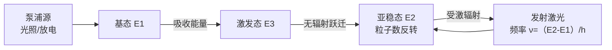
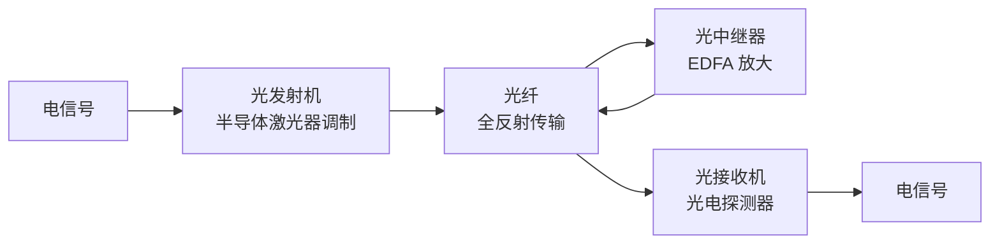

# 现代光学应用

> [!abstract] 概览
> 前 3 节展示了光的量子本质——光子、波粒二象性、德布罗意波——这些理论并非"纸上谈兵"，而是催生了 20 世纪后半叶至今的==整个现代光学技术==。本节作为光学版块的"应用篇"，将前述原理落地为四类核心技术：**激光**（受激辐射的光放大，1917 年爱因斯坦理论预言，1960 年梅曼首次实现）、**光纤通信**（全反射 + 光子能量传输，将全球信息连为一体）、**全息照相**（盖伯 1948 年提出，干涉记录 + 衍射再现三维信息）、**非线性光学**（激光出现后兴起的"强光与物质相互作用"新领域）。这四项技术分别代表了"光作为能量载体""光作为信息载体""光作为信息记录介质""光作为强场探针"的现代光学四个面向，是 [[01-光电效应]]、[[02-康普顿效应与光子动量]]、[[03-波粒二象性与德布罗意波]] 中量子思想的技术实现。本节虽为拓展内容，但激光原理与光纤通信在高考中作为应用题背景频频出现，建议重点关注。

## 核心概念

### 一、激光原理

**激光**（Light Amplification by Stimulated Emission of Radiation，LASER）：通过==受激辐射==实现光放大，产生具有==单色性、方向性、相干性、高亮度==四大特性的强光。

#### 1. 三种辐射过程

爱因斯坦在 1917 年从统计物理角度指出，原子与辐射场相互作用存在三种过程：

| 过程 | 描述 | 特征 |
| --- | --- | --- |
| **自发辐射** | 处于激发态的原子自发跃迁到低能态，发射光子 | 光子方向、相位、偏振随机——非相干光 |
| **受激吸收** | 处于低能态的原子吸收光子跃迁到高能态 | 光子能量等于能级差 |
| **受激辐射** | 处于激发态的原子在入射光子"诱导"下跃迁到低能态，==发射一个与入射光子完全相同==的光子 | 两光子同频率、同相位、同方向、同偏振——==相干光== |

> [!tip] 受激辐射的关键特征
> 受激辐射产生的光子与入射光子==完全相同==——这是激光"相干性"的根源。一个光子进入激发态原子，出来变两个；这两个再激发其他原子，变四个……==指数式放大==形成激光。这正是"Light Amplification by Stimulated Emission"的真意。

#### 2. 粒子数反转

通常情况下，处于低能态 $E_1$ 的原子数 $N_1$ 远多于激发态 $E_2$ 的原子数 $N_2$（玻尔兹曼分布 $N_2/N_1=e^{-(E_2-E_1)/kT}<1$）。此时光通过介质时==受激吸收 > 受激辐射==，光被吸收，无法放大。

**粒子数反转**：通过外部能量输入（光泵、放电、化学能等），使 $N_2>N_1$——此时光通过介质时==受激辐射 > 受激吸收==，光被放大。这是激光产生的==必要条件==。

**实现方式**：
- **三能级系统**（如红宝石激光器）：原子被泵浦到激发态 $E_3$，快速无辐射跃迁到亚稳态 $E_2$，在 $E_2$ 上"堆积"形成粒子数反转；
- **四能级系统**（如 Nd:YAG）：低能级 $E_1$ 上的原子被泵浦到 $E_4$，跃迁到亚稳态 $E_3$，与下能级 $E_2$ 之间形成反转——效率更高，因 $E_2$ 上几乎无原子。

#### 3. 光学谐振腔

仅粒子数反转还不够，还需要==光学谐振腔==——两面平行反射镜（一全反一部分反射）构成的腔体。光在腔内来回反射，反复激发受激辐射，==光强指数增长==；同时只有沿腔轴方向的光能反复放大，==保证方向性==；腔长等于半波长整数倍时形成驻波，==保证单色性==。

#### 4. 激光的四大特性

| 特性 | 物理本质 | 实际意义 |
| --- | --- | --- |
| **单色性** | 谐振腔选频，仅特定频率能稳定振荡 | 谱线极窄，$\Delta\lambda/\lambda\sim 10^{-8}$ |
| **方向性** | 谐振腔只放大沿轴光线 | 光束发散角极小，$\sim 10^{-3}\,\text{rad}$ |
| **相干性** | 受激辐射光子同相位、同频率 | 干涉长度可达数千米 |
| **高亮度** | 大量光子集中于细光束、窄谱线、短脉冲 | 单位面积单位立体角功率极高 |

> [!example] 激光"高亮度"的震撼
> 一台 $1\,\text{mW}$ 的氦氖激光器，其亮度可达 $10^5\,\text{W/(m^2·sr)}$——==比太阳表面还亮==！原因不是总功率大，而是光集中在一个极窄的光束、极小的频率范围、极短的脉冲内。激光切削、激光武器正是利用这一"亮度集中"的特性。

### 二、激光器的种类

| 激光器 | 工作物质 | 主要波长 | 典型应用 |
| --- | --- | --- | --- |
| **红宝石激光器**（1960 梅曼） | Cr³⁺:Al₂O₃ 晶体 | 694.3 nm（红光） | 第一台激光器，全息、测距 |
| **氦氖激光器** | He-Ne 混合气体 | 632.8 nm（红光） | 教学、干涉仪、条码扫描 |
| **二氧化碳激光器** | CO₂ 气体 | 10.6 μm（红外） | 工业切割、焊接、医疗 |
| **Nd:YAG 激光器** | Nd³⁺:YAG 晶体 | 1.064 μm（近红外） | 工业、医疗、激光加工 |
| **半导体激光器** | PN 结（GaAs、InGaAs 等） | 650 nm–1.55 μm | 光纤通信、光盘、激光笔 |
| **准分子激光器** | 稀有气体卤化物 | 紫外 | 半导体光刻、眼科手术 |
| **飞秒激光器** | 钛宝石晶体 | 800 nm，脉宽 fs | 精密加工、眼科、超快光谱 |

### 三、激光的应用

| 领域 | 应用 | 原理 |
| --- | --- | --- |
| **测距** | 激光雷达、月球测距 | 脉冲飞行时间 $d=ct/2$ |
| **加工** | 切割、焊接、打孔 | 高能量密度局部加热熔融 |
| **医疗** | 激光手术、眼科（LASIK）、碎石 | 选择性光热作用 |
| **全息** | 全息照相、全息防伪 | 干涉记录 + 衍射再现 |
| **通信** | 光纤通信、自由空间光通信 | 光作为信息载体 |
| **信息** | CD/DVD/蓝光、激光打印机 | 光反射读取、光敏打印 |
| **科研** | 激光冷却、光镊、光谱学 | 辐射压力、共振激发 |
| **军事** | 激光制导、激光武器 | 高能定向光束 |

### 四、光纤通信

**光纤通信**：以光波为载波、以光导纤维为传输介质的有线通信技术。它是==全反射现象==（[[02-全反射与光学器件/01-全反射与临界角]]）的最重要应用，也是现代互联网的物理基础。

#### 1. 光纤结构

光纤由两层不同折射率的玻璃构成：
- **纤芯**（core）：折射率 $n_1$，直径约 $5\sim 50\,\mu\text{m}$；
- **包层**（cladding）：折射率 $n_2<n_1$，外径约 $125\,\mu\text{m}$；
- **涂覆层**：保护光纤的塑料外层。

由于 $n_1>n_2$，光在纤芯中以大于临界角 $\sin C=n_2/n_1$ 的角度入射到芯—包界面时，发生==全反射==，光被约束在纤芯内传输。

> [!note] 全反射的临界角
> 光纤中全反射临界角由 $\sin C = n_2/n_1$ 决定。例：$n_1=1.50$、$n_2=1.48$ 时 $\sin C\approx 0.987$，$C\approx 80.6°$——只有近轴光线才能全反射传输。==光纤的"数值孔径"== $\text{NA}=\sqrt{n_1^2-n_2^2}$ 描述了光纤接收光的能力。

#### 2. 光纤损耗

光在光纤中传输会有损耗，主要来源：
- **吸收损耗**：玻璃中杂质（如 OH⁻ 离子）吸收光能；
- **散射损耗**：瑞利散射（玻璃密度涨落）；
- **弯曲损耗**：光纤弯曲时光泄漏。

==三个低损耗窗口==：
- $850\,\text{nm}$：早期窗口，损耗约 $2\,\text{dB/km}$；
- $1310\,\text{nm}$：色散为零，损耗约 $0.4\,\text{dB/km}$；
- $1550\,\text{nm}$：损耗最低，约 $0.2\,\text{dB/km}$——==现代长距离光纤通信的主战场==。

#### 3. 光纤通信的优势

| 优势 | 原理 |
| --- | --- |
| **容量大** | 光波频率高（约 $10^{14}\,\text{Hz}$），可用带宽远大于电信号 |
| **抗干扰** | 光信号不受电磁干扰（雷电、高压线等）影响 |
| **保密性好** | 光纤不向外辐射电磁波，难以窃听 |
| **中继距离长** | 损耗低，中继站间隔可达数十至数百公里 |
| **体积小、重量轻** | 一根光纤直径仅 $125\,\mu\text{m}$，比铜缆细得多 |
| **材料丰富** | 石英（SiO₂）原料丰富，比铜经济 |

> [!example] 光纤通信容量的"奇迹"
> 一根光纤在 $1550\,\text{nm}$ 窗口可用带宽约 $30\,\text{THz}$，==相当于同时传输数十亿路电话==。现代波分复用（WDM）技术可在单根光纤中传输 $100\,\text{Tbps}$ 以上——==一根光纤就能承载全球互联网的相当一部分流量==。这就是为何海底光缆成为现代"信息丝绸之路"。

#### 4. 光纤通信系统组成

完整光纤通信系统由==光发射机、光纤、光中继器、光接收机==四部分组成：

### 五、全息照相

**全息照相**（Holography）：英国物理学家丹尼斯·盖伯（Dennis Gabor）于 1948 年提出，1971 年获诺贝尔物理学奖。它利用==干涉记录==与==衍射再现==两步过程，记录并重建物体的完整三维光场——不仅记录振幅（亮度），还记录相位（深度）。

#### 1. 全息照相的两步过程

**第一步：干涉记录**
- 将激光分束：一束照射物体（物光），一束直接到达底片（参考光）；
- 物光与参考光在底片上==干涉==，形成复杂的干涉条纹；
- 底片记录干涉条纹——其中==同时包含了物光的振幅与相位信息==（普通照相只记录振幅，丢失相位）。

**第二步：衍射再现**
- 用与参考光相同的光照射全息底片；
- 全息图上的干涉条纹作为==复杂光栅==使光发生衍射；
- 衍射光重现原始物体的==完整光场==——观察者从特定方向看到的是一个==逼真的三维像==，从不同角度能看到物体的不同侧面。

> [!tip] 全息照相 vs 普通照相
>
> | 比较项 | 普通照相 | 全息照相 |
> | --- | --- | --- |
> | 记录原理 | 透镜成像，只记录振幅 | 干涉，记录振幅 + 相位 |
> | 信息量 | 二维强度分布 | 三维完整光场 |
> | 再现方式 | 直接观看 | 需用相干光衍射再现 |
> | 视差 | 无（从不同角度看似平面） | 有（从不同角度看到不同侧面） |
> | 一碎片能否成像 | 不能 | ==能==（全息图的每一小块都含完整信息） |
>
> 全息图的"碎片能成像"特性是其最神奇之处——这是因为干涉条纹记录的是==整个物光场==，而非局部图像。

#### 2. 全息照相的应用

- **全息防伪**：信用卡、钞票、护照上的全息标签；
- **全息显示**：3D 展示、艺术全息；
- **全息干涉计量**：测量微小形变、振动模式；
- **全息光学元件（HOE）**：替代透镜、光栅；
- **全息存储**：高密度三维光存储（理论容量数 TB/cm³）；
- **声全息、微波全息**：扩展到其他波动领域。

### 六、非线性光学简介

经典光学认为介质极化 $P$ 与光场 $E$ 成正比（$P=\chi E$），叠加原理成立——这是==线性光学==。但当激光这种==强光==作用于介质时，极化出现非线性项：

$$P = \chi^{(1)} E + \chi^{(2)} E^2 + \chi^{(3)} E^3 + \cdots$$

非线性项 $E^2$、$E^3$ 等导致一系列新现象，构成==非线性光学==（1961 年弗兰肯首次观察到倍频现象后兴起）。

#### 1. 倍频效应（二次谐波生成 SHG）

频率为 $\nu$ 的强光入射到非线性晶体（如 KDP、BBO），出射光中除原频率 $\nu$ 外，还出现 $2\nu$ 成分——==频率加倍、波长减半==。例如 $1064\,\text{nm}$ 的 Nd:YAG 激光经倍频后得到 $532\,\text{nm}$ 的绿光（绿色激光笔的常用原理）。

#### 2. 混频效应（和频、差频）

两束不同频率 $\nu_1$、$\nu_2$ 的光在非线性介质中相互作用，产生==和频 $\nu_1+\nu_2$== 与==差频 $|\nu_1-\nu_2|$== 成分。这是==光学参量振荡器==（OPO）的原理，可产生可调谐激光。

#### 3. 自聚焦

强光场改变介质折射率（光克尔效应），使介质类似"凸透镜"，光束==自我聚焦==——可能导致介质损伤。

#### 4. 光孤子

在色散与非线性效应恰好相互抵消时，光脉冲在光纤中==无畸变传输==——称为光孤子。它是长距离高速光纤通信的理想载体。

> [!note] 非线性光学的物理本质
> 非线性光学的根源是==光强足够大时介质极化的非线性响应==。普通光（如日光）强度太弱，非线性项 $\chi^{(2)} E^2$ 比 $\chi^{(1)} E$ 小十几个数量级，完全可忽略；激光出现后，光强可达 $10^{12}\,\text{W/m}^2$ 以上，非线性效应才显著——==非线性光学是激光的孩子==。

## 推导与原理

### 一、激光的受激辐射放大推导

设介质中上能级 $E_2$ 原子数为 $N_2$，下能级 $E_1$ 原子数为 $N_1$，辐射场能量密度 $\rho(\nu)$。爱因斯坦系数：
- 受激辐射率 $W_{21} = B_{21}\rho(\nu)$，对应 $N_2 B_{21}\rho$ 个光子被激发辐射；
- 受激吸收率 $W_{12} = B_{12}\rho(\nu)$，对应 $N_1 B_{12}\rho$ 个光子被吸收；
- 自发辐射率 $A_{21}$（与 $\rho$ 无关）。

由爱因斯坦关系 $B_{12}=B_{21}$，==净受激辐射率==为
$$
\Delta W = (N_2 - N_1) B_{21} \rho(\nu)
$$

- 当 $N_2<N_1$（正常分布）：$\Delta W<0$，光被吸收；
- 当 $N_2>N_1$（==粒子数反转==）：$\Delta W>0$，光被放大。

==粒子数反转是光放大的必要条件==，也是激光"放大"的物理基础。

### 二、光纤全反射的临界角推导

由斯涅尔定律 $n_1\sin\theta_1=n_2\sin\theta_2$，当 $\theta_2=90°$ 时入射角 $\theta_1$ 达到临界角 $C$：

$$
\sin C = \dfrac{n_2}{n_1}\quad (n_1>n_2)
$$

光从纤芯（$n_1$）入射到芯—包界面，若入射角 $\theta_1>C$，则发生全反射，光被约束在纤芯内。==这是光纤通信能低损耗传输光的根本原因==。

> [!tip] 光纤"数值孔径"NA
> 光纤能接收光的最大入射角 $\theta_{\max}$（在光纤端面，空气中）由数值孔径决定：
> $$\text{NA} = \sin\theta_{\max} = \sqrt{n_1^2 - n_2^2}$$
> NA 越大，光纤越容易"捕获"光，但同时色散也大——多模光纤 NA 大，单模光纤 NA 小。

### 三、全息照相的物光—参考光干涉

设物光 $O(x,y)=A_O(x,y)e^{i\varphi_O(x,y)}$，参考光 $R(x,y)=A_R e^{i\varphi_R(x,y)}$，底片记录总光强
$$
I = |O+R|^2 = |O|^2 + |R|^2 + O R^* + O^* R
$$
其中 $O R^* = A_O A_R e^{i(\varphi_O-\varphi_R)}$ 项==同时包含了物光振幅 $A_O$ 与相位 $\varphi_O$==——这就是全息照相能记录"完整光场"的数学原理。

再现时用参考光 $R$ 照射全息图，透射光中含 $R\cdot O R^* = |R|^2 O$ 项——==精确重现物光 $O$==，形成三维像。这一推导虽超出高考要求，但能帮助理解全息照相"为何能记录三维信息"。

## 典型实例与类比

### 类比一：激光与"合唱团"

普通光源（如灯泡）发出的光子像一群各自为政的歌唱者——频率不同、相位不同、方向不同（==自发辐射为主==），听起来是嘈杂的"白噪声"。激光则像一支==训练有素的合唱团==——所有光子频率相同、相位同步、方向一致（==受激辐射为主==），听起来是清亮纯粹的"纯音"。这一类比解释了激光的"单色性、相干性、方向性"。

### 类比二：光纤与"水管"

光纤像一根透明的"水管"——光在管内壁（芯—包界面）反复全反射，被"困"在管内沿轴向传输。==水管的水不会从管壁漏出==，光纤的光也不会从侧面漏出（理想情形）。这与铜线中电流"被导线约束"类似，但机制不同——电流靠电场驱动，光纤靠全反射约束。

### 实例 1：激光测距与月球测距

1969 年阿波罗 11 号宇航员在月球放置角反射器阵列，地面望远镜发射脉冲激光，接收反射光，测量飞行时间 $t$。光速 $c\approx 3\times10^8\,\text{m/s}$，地月距离 $d=ct/2\approx 3.84\times10^8\,\text{m}$，对应 $t\approx 2.56\,\text{s}$。现代测量精度达毫米级——==这是人类能做到的最远距离精密测量==。激光的方向性（发散角 $<10^{-4}\,\text{rad}$）和高亮度（即便往返后仍能探测）是关键。

### 实例 2：光纤通信中的损耗与中继

设光纤损耗 $\alpha=0.2\,\text{dB/km}$（$1550\,\text{nm}$ 窗口），光信号传输 $L=100\,\text{km}$ 后总损耗 $\alpha L=20\,\text{dB}$，即光功率降为原来的 $1/100$。==中继器（EDFA 掺铒光纤放大器）==每 $80\sim 100\,\text{km}$ 放大一次，使信号可横跨大陆甚至跨洋传输（太平洋海底光缆总长逾万公里，需要数十个中继器）。

> [!tip] 记忆口诀
> **激光受激辐射放大，单色方向相干亮度大；光纤全反射传光，三窗口 850/1310/1550；**
>
> **全息干涉记、衍射现，三维信息藏其间；非线性倍频 2ν，混频自聚焦孤子。**

## 例题

### 例 1：激光加速电子的能量估算

**题目**：用红宝石激光器发出的激光（波长 $\lambda=694.3\,\text{nm}$）照射金属钾（逸出功 $W=2.2\,\text{eV}$）。求光电子的最大初动能 $E_{k,\max}$ 与遏止电压 $U_c$。

**分析**：用 $E=h\nu=hc/\lambda$ 算光子能量，再代入光电方程 $E_k=h\nu-W$，由 $eU_c=E_k$ 求 $U_c$。

**解答**：

光子能量：
$$
E = \dfrac{hc}{\lambda} = \dfrac{1240\,\text{eV·nm}}{694.3\,\text{nm}}\approx 1.786\,\text{eV}
$$

光子能量 $1.786\,\text{eV}$ 小于钾的逸出功 $2.2\,\text{eV}$——==不会发生光电效应==！$E_{k,\max}=0$，$U_c=0$。

**点评**：这是一道"陷阱题"——红宝石激光波长 $694.3\,\text{nm}$ 在红光区，光子能量约 $1.79\,\text{eV}$，不足以使钾（$W=2.2\,\text{eV}$）发生光电效应。==激光"亮度高"不代表单个光子能量大==——光子能量由频率（波长）决定，与光强无关。这是光电效应的核心观念。若改用 $N_d:YAG$ 倍频激光（$532\,\text{nm}$，约 $2.33\,\text{eV}$），则可触发。

### 例 2：光纤全反射的临界角

**题目**：某光纤纤芯折射率 $n_1=1.50$，包层折射率 $n_2=1.46$。求：
（1）芯—包界面的全反射临界角 $C$；
（2）该光纤的数值孔径 NA 与最大接收角 $\theta_{\max}$（空气中）。

**分析**：临界角由 $\sin C=n_2/n_1$ 计算；数值孔径 $\text{NA}=\sqrt{n_1^2-n_2^2}$，最大接收角 $\sin\theta_{\max}=\text{NA}$。

**解答**：

（1）
$$
\sin C = \dfrac{n_2}{n_1} = \dfrac{1.46}{1.50}\approx 0.973
$$
$$
C = \arcsin 0.973 \approx 76.7°
$$

（2）
$$
\text{NA} = \sqrt{n_1^2 - n_2^2} = \sqrt{1.50^2 - 1.46^2} = \sqrt{2.25 - 2.1316} = \sqrt{0.1184}\approx 0.344
$$

$$
\theta_{\max} = \arcsin 0.344 \approx 20.1°
$$

**点评**：本题考查光纤全反射原理。==临界角 $C\approx 76.7°$ 意味着只有近轴光线才能在光纤中传输==。数值孔径 NA=0.344 表示光纤端面在空气中接收光的最大半角约 $20°$——NA 太小光难以耦合进光纤，太大则色散严重。单模光纤通常 NA 较小（$0.1\sim 0.15$），多模光纤较大。

## 易错提醒

> [!warning] 易错点
> 1. **激光"高亮度"≠"单个光子能量大"**：激光亮度高是因为光子==集中==在窄光束、窄谱线、短脉冲内，单个光子能量仍由频率决定（$E=h\nu$）。红光激光的光子能量比紫光小。
> 2. **受激辐射 ≠ 自发辐射**：受激辐射产生的光子与入射光子==完全相同==（同频同相），自发辐射光子随机——这是激光相干性的根源。
> 3. **粒子数反转 ≠ 激光**：粒子数反转是必要条件，但还需==谐振腔==选频、放大，才能形成激光输出。
> 4. **光纤中全反射发生在芯—包界面**：不是端面，而是光纤内部的芯—包界面。光从端面进入光纤时遵循斯涅尔定律。
> 5. **全息照相≠3D 电影**：全息图记录真实光场，==从不同角度能看到物体不同侧面==（真正的三维）；3D 电影只是双目视差，并非真正三维。
> 6. **非线性光学 ≠ 普通光学**：非线性效应只在==强光（激光）==下显著，普通光源下完全可忽略。
> 7. **光纤损耗不是无限小**：实际光纤有 $0.2\,\text{dB/km}$ 损耗，长距离传输需中继放大。

> [!note] 概念辨析
> **激光 vs 普通光**：
>
> | 比较项 | 普通光（如灯泡） | 激光 |
> | --- | --- | --- |
> | 发光机制 | 自发辐射为主 | 受激辐射为主 |
> | 单色性 | 频谱宽 | 极窄 |
> | 方向性 | 各方向均匀 | 极窄光束 |
> | 相干性 | 非相干 | 高度相干 |
> | 亮度 | 低 | 极高 |
>
> **光纤通信 vs 无线电通信**：
> - 光纤通信：用光（约 $10^{14}\,\text{Hz}$）作为载波，频率高、带宽大，但需物理线缆；
> - 无线电通信：用电磁波（约 $10^6\sim10^9\,\text{Hz}$）作为载波，可无线传输，但带宽小、易干扰；
> - 二者本质相同——都是电磁波通信，差别在载波频率。
>
> **线性光学 vs 非线性光学**：
> - 线性光学：极化 $P\propto E$，叠加原理成立，光频率不变；
> - 非线性光学：极化含 $E^2$、$E^3$ 等高阶项，==光频率可变==（倍频、和频等）；
> - 非线性效应强度 $\propto$ 光强，是激光的"专属"。

## 与其他知识关联

- 与 [[01-光电效应]] 的关系：激光的光子能量 $E=h\nu$ 与光电效应同一原理；激光触发光电效应需频率足够高。
- 与 [[02-康普顿效应与光子动量]] 的关系：激光光子动量 $p=h/\lambda$，是光镊、激光冷却的物理基础。
- 与 [[03-波粒二象性与德布罗意波]] 的关系：激光的相干性是波动性的极致体现；全息照相依赖光的干涉。
- 与 [[04-现代光学应用]] 的关系：本节即现代光学应用。
- 与 [[03-光的波动性/01-光的干涉]] 的关系：全息照相直接应用干涉原理。
- 与 [[03-光的波动性/02-光的衍射]] 的关系：全息再现、光栅选频均依赖衍射。
- 与 [[03-光的波动性/05-光的电磁本性]] 的关系：激光是电磁波，光纤传输的也是电磁波。
- 与 [[02-全反射与光学器件/01-全反射与临界角]] 的关系：==光纤通信的全反射原理直接源于此节==。
- 高中—大学衔接：[[量子力学]]（受激辐射的量子理论、激光的半经典理论）、[[物理光学]]（激光物理、全息学）、[[电动力学]]（非线性光学的电磁理论）、[[光学]]（激光原理、非线性光学、光纤光学）。
- 与力学联系：[[动能与动量]]（光子动量在光镊中的应用）、[[机械振动]]（激光谐振腔的振动模式类比）。
- 与电学联系：[[01-静电场/05-带电粒子在电场中的运动]]（激光加速带电粒子）、[[06-电磁波与传感器/01-电磁振荡与电磁波]]（光作为电磁波）、[[06-电磁波与传感器/02-电磁波谱]]（激光波长在电磁波谱中的位置）。
- 与热学联系：[[03-热力学定律/04-熵与热力学第三定律]]（激光的统计物理基础——爱因斯坦系数的推导）、[[01-分子动理论/04-内能与分子动能]]（粒子数反转的热力学含义）。
- 返回 [[00-光学总览]]

## 作者的话

> [!quote] 个人理解
> 本节是高中光学的"技术应用之窗"——它把前 3 节的量子理论落地为改变世界的四项技术：激光、光纤通信、全息照相、非线性光学。==这些技术不仅改变了科学，更改变了人类的日常生活==——互联网、激光手术、CD/DVD、3D 显示，无不是现代光学的产物。
>
> 学习本节，请关注两条主线：
> - ==理论→技术==：爱因斯坦 1917 年提出受激辐射，1960 年梅曼才造出第一台激光器——理论与实验之间相隔 43 年；盖伯 1948 年提出全息，1960 年激光出现后全息才真正实用——理论依赖技术，技术也催生新理论；
> - ==技术→社会==：光纤通信让互联网成为可能，激光让现代医学革命，全息让 3D 显示走出科幻——==物理学不只是"认识世界"，更是"改造世界"==。
>
> 激光的故事尤其精彩。爱因斯坦 1917 年的论文只是在统计物理中论证三种辐射过程的存在，他本人未预见激光的诞生。1954 年汤斯（Townes）造出微波激射器（maser），1958 年汤斯与肖洛提出"光频激射器"（即激光）方案，1960 年梅曼（Maiman）用红宝石晶体首次实现激光——==理论与工程，跨越大半个世纪==。汤斯、巴索夫、普罗霍罗夫因微波激射器获 1964 年诺贝尔物理学奖。激光的故事告诉我们：==基础研究看似"无用"，实则是技术的最终源泉==。
>
> 光纤通信的故事同样动人。1966 年高锟（Charles Kao）发表论文指出：只要把光纤损耗降到 $20\,\text{dB/km}$ 以下，光纤通信就能实用——当时最好的光纤损耗高达 $1000\,\text{dB/km}$，被同行讥为"痴人说梦"。但 1970 年康宁公司真的造出了 $17\,\text{dB/km}$ 的低损耗光纤，今天更是降到 $0.2\,\text{dB/km}$——==高锟因此获 2009 年诺贝尔物理学奖==。这是"理论预言 + 工程突破"的典范。
>
> 哲学层面的思考：本节展示了==物理学"理论与实践统一"==的美。前 3 节的量子理论看似抽象——光子、波粒二象性、不确定性原理——但正是这些"抽象"理论，催生了互联网、激光手术、3D 显示等改变世界的技术。==没有量子力学就没有现代信息社会==，这是对"基础科学无用论"最有力的反驳。物理学之美，正在于这种"由抽象到具体、由理论到应用"的辩证统一。
>
> 学习建议：本节虽为拓展，但激光原理与光纤通信在高考中作为应用题背景出现频繁，建议重点掌握：
> - 激光四大特性的物理本质（受激辐射 + 谐振腔）；
> - 粒子数反转的概念与必要性；
> - 光纤全反射临界角 $\sin C=n_2/n_1$ 与数值孔径 NA；
> - 全息照相两步过程（干涉记录 + 衍射再现）。
>
> 同学们完成本节后，光学版块的全部内容（[[00-光学总览]]）就系统学完了。建议回顾整个光学体系：从[[03-光的波动性/01-光的干涉|光的干涉]]到波粒二象性，从几何光学到量子光学——==光学的"三层视角"（几何—波动—量子）至此完整==。这是高中物理中最具思想深度、也最接近现代物理学前沿的版块。希望同学们不仅记住公式，更能体会==物理学家如何用"模型"逐步逼近"光的本质"==——这条思想之路，正是物理学最动人的精神遗产。

---
*返回 [[00-光学总览]]*
