# 高中物理力学总览

> [!abstract] 力学笔记体系总体说明
> 力学是高中物理的根基与起点，也是整个物理学大厦的基石。本笔记体系与 [[00-电学总览]] 平行，覆盖人教版高中物理必修第一册全册及必修第二册前两章的核心内容。力学按知识逻辑分为两大主线：**运动学**（描述"怎么运动"——用位移、速度、加速度等物理量刻画运动状态与规律）与**动力学**（解释"为什么这样运动"——以牛顿三大定律为核心，建立力与运动变化的因果联系）。在此基础上进一步扩展到**万有引力与航天**，将地球上的力学规律推广到天体运动，揭示力学的宇宙普适性。整套笔记按知识脉络分为三大版块——运动学、牛顿运动定律、综合应用与拓展，由简到繁、由直线到曲线、由地面到天空，最终通向大学层面的 [[牛顿力学]]、[[拉格朗日方程]] 与 [[钟慢尺缩与质增]]。本文件（MOC）作为力学笔记体系的总入口，统一调度各子模块、提供学习路径与速查资源。

## 力学知识脉络图

```mermaid
graph TD
    ROOT[高中物理力学] --> A[运动学]
    ROOT --> B[牛顿运动定律]
    ROOT --> C[综合应用与拓展]

    A --> A1[描述运动的基本物理量]
    A --> A2[匀变速直线运动]
    A --> A3[自由落体与竖直上抛]
    A --> A4[运动图像]
    A --> A5[追及与相遇]
    A --> A6[平抛运动]
    A --> A7[圆周运动]

    B --> B1[重力与弹力]
    B --> B2[摩擦力]
    B --> B3[力的合成与分解]
    B --> B4[共点力平衡]
    B --> B5[牛顿第一定律]
    B --> B6[牛顿第二定律]
    B --> B7[牛顿第三定律]
    B --> B8[牛顿定律的应用]
    B --> B9[超重与失重]

    C --> C1[运动的合成与分解]
    C --> C2[抛体运动综合]
    C --> C3[圆周运动动力学]
    C --> C4[万有引力与航天]
    C --> C5[宇宙航行与拓展]

    class A1 internal-link;
    class A2 internal-link;
    class A3 internal-link;
    class A4 internal-link;
    class A5 internal-link;
    class A6 internal-link;
    class A7 internal-link;
    class B1 internal-link;
    class B2 internal-link;
    class B3 internal-link;
    class B4 internal-link;
    class B5 internal-link;
    class B6 internal-link;
    class B7 internal-link;
    class B8 internal-link;
    class B9 internal-link;
    class C1 internal-link;
    class C2 internal-link;
    class C3 internal-link;
    class C4 internal-link;
    class C5 internal-link;
```

## 一、运动学

运动学是力学的"描述"层——在不追究运动原因的前提下，用位移、速度、加速度等物理量刻画物体的运动规律。本版块从基本物理量的定义出发，建立匀变速直线运动的核心公式体系，进而讨论自由落体、竖直上抛等典型模型，并通过运动图像（$x-t$、$v-t$、$a-t$）提供直观的几何视角。追及相遇问题是运动学的综合应用，平抛运动与圆周运动则将研究范围从直线推广到曲线，为后续动力学的曲线运动分析奠基。

- [[01-描述运动的基本物理量]]：质点、参考系、时间间隔与时刻、位移与路程、速度与速率、加速度的概念辨析。
- [[02-匀变速直线运动]]：匀变速直线运动五大基本公式（速度、位移、速度位移、平均速度、中间时刻速度）及其应用。
- [[03-自由落体与竖直上抛]]：自由落体运动规律、竖直上抛运动的对称性与多解性处理。
- [[04-运动图像]]：$x-t$、$v-t$、$a-t$ 图像的物理意义，斜率、面积、截距的几何含义与图像转换。
- [[05-追及与相遇]]：追及、相遇、避碰问题的临界条件分析，速度相等往往是关键状态。
- [[06-平抛运动]]：平抛运动的分解方法（水平匀速+自由落体），类平抛运动的推广。
- [[07-圆周运动]]：描述圆周运动的物理量（线速度、角速度、周期、频率、转速），同轴与同带传动关系。

## 二、牛顿运动定律

牛顿运动定律是动力学的核心，建立"力"与"运动变化"的定量关系。本版块从常见的三种力（重力、弹力、摩擦力）入手，掌握力的合成与分解的平行四边形定则，进而分析共点力平衡条件。随后系统学习牛顿三大定律：第一定律定义惯性参考系、第二定律 $F=ma$ 是动力学的核心方程、第三定律揭示力的相互作用性。最终将三大定律综合应用于连接体、传送带、斜面、板块等典型模型，并讨论超重与失重现象。

- [[01-重力与弹力]]：重力的方向与重心概念，弹力的产生条件、方向判断与胡克定律 $F=kx$。
- [[02-摩擦力]]：静摩擦力与滑动摩擦力的区别，滑动摩擦力公式 $f=\mu N$ 与方向判定。
- [[03-力的合成与分解]]：平行四边形定则、三角形定则、正交分解法与按效果分解。
- [[04-共点力平衡]]：三力平衡的拉密定理、多力平衡的正交分解法、动态平衡的图解法。
- [[05-牛顿第一定律]]：伽利略斜面实验与惯性定律，惯性参考系的概念。
- [[06-牛顿第二定律]]：$F=ma$ 的矢量性、瞬时性与独立性，整体法与隔离法的应用。
- [[07-牛顿第三定律]]：作用力与反作用力的"同时、同性质、不同对象"特征，与平衡力的区别。
- [[08-牛顿定律的应用]]：连接体、传送带、斜面、板块模型等综合题型与临界分析。
- [[09-超重与失重]]：超重（加速度向上）与失重（加速度向下）的本质，完全失重状态。

## 三、综合应用与拓展

本版块是力学的"高级应用"层，将运动学规律与牛顿定律综合运用到曲线运动、天体运动等领域。从运动的合成与分解出发，处理小船渡河、绳子末端速度等典型问题；抛体运动综合将平抛推广到斜抛与一般抛体；圆周运动动力学讨论向心力来源与临界状态；万有引力定律将力学推广到宇宙尺度，理解卫星、行星运动规律；宇宙航行进一步讨论三种宇宙速度与航天轨道。

- [[01-运动的合成与分解]]：运动的独立性原理，小船渡河、绳子末端速度分解问题。
- [[02-抛体运动综合]]：斜抛运动的规律、抛体运动一般方程与最高点、射程、飞行时间公式。
- [[03-圆周运动动力学]]：向心力来源分析、圆锥摆、汽车转弯、铁路弯道、竖直平面圆周运动的临界问题。
- [[04-万有引力与航天]]：开普勒三定律、万有引力定律 $F=G\dfrac{m_1 m_2}{r^2}$ 与天体质量、密度的计算。
- [[05-宇宙航行与拓展]]：三种宇宙速度（第一、第二、第三）、卫星轨道变换、同步卫星与近地卫星的比较。

## 学习路径建议

> [!tip] 学习路径
> **基础路径（按教材顺序）**：运动学（基本物理量→匀变速→自由落体→运动图像）→ 牛顿运动定律（重力弹力→摩擦力→合成分解→平衡→三定律→应用→超重失重）→ 综合应用（运动合成分解→抛体综合→圆周动力学→万有引力→宇宙航行）。适合首次系统学习，遵循"先描述后解释、先直线后曲线、先地面后天空"的认知顺序。
>
> **应试路径（高考重点优先）**：匀变速直线运动公式与图像 → 牛顿第二定律综合应用（连接体、板块模型） → 圆周运动动力学（临界问题） → 万有引力与卫星运动。这四块是高考力学的"四大金刚"，题型相对固定、套路清晰，需优先突破。追及相遇与平抛运动作为选择题常考考点也要熟练。
>
> **扩展路径（衔接大学物理）**：在掌握高中力学基础上，对照 [[牛顿力学]] 学习质点系动力学与分析力学初步，了解 [[拉格朗日方程]] 中广义坐标与拉格朗日量的思想，并参阅 [[钟慢尺缩与质增]] 理解牛顿力学在高速下的修正与相对论力学边界。高中阶段对 [[机械振动]] 的初步认识也是简谐运动模型的重要延伸。

## 与其他知识关联

力学笔记体系并非孤立存在，与笔记库中其他物理模块有紧密联系：

- **高中电学关联**：力学是电学受力分析的基础。带电粒子在匀强电场中的偏转类比 [[06-平抛运动]]，是"类平抛模型"的典型应用；带电粒子在匀强磁场中的圆周运动类比 [[07-圆周运动]] 与 [[03-圆周运动动力学]]；电场力、安培力、洛伦兹力都是力学中"力"的延伸，[[06-牛顿第二定律]] 在电学综合题中无处不在。详见 [[00-电学总览]] 与 [[99-电学例题集]]。
- **大学层面延伸**：高中力学直接通向 [[牛顿力学]]（路径 `物理/物理学大类/力学运动学/` 下），后者在更严格的数学框架下重新表述质点、质点系与刚体力学；进一步可参阅 [[拉格朗日方程]] 了解分析力学视角下的统一表述（拉格朗日量与最小作用量原理），这是经典力学的高级形式。[[机械振动]]（同目录下）则将力学推广到周期性运动，是简谐运动、阻尼振动、受迫振动与共振的系统化研究。
- **碰撞与动量**：高中力学中牛顿第三定律的延伸是动量守恒，详见 [[碰撞详解]]（路径 `物理/物理学大类/力学运动学/` 下），涵盖弹性碰撞、非弹性碰撞、完全非弹性碰撞与对心、非对心碰撞的分类与处理。[[动能与动量]] 系统讨论动量定理、动量守恒定律、动能定理与机械能守恒定律，是高中力学的两大"定理"主线。
- **相对论关联**：牛顿力学的适用范围是低速（$v \ll c$）、宏观、弱引力。在高速运动下需考虑 [[钟慢尺缩与质增]]（路径 `物理/物理学大类/相对论/` 下）的相对论修正——时间膨胀、长度收缩、质量随速度增加 $m = \dfrac{m_0}{\sqrt{1 - v^2/c^2}}$。理解牛顿力学与相对论力学的边界是物理世界观建立的重要环节。
- **数学工具**：矢量合成（力的合成与分解）、三角函数（斜面分解、圆周运动投影）、微元法（变力做功、圆周运动加速度推导）、极限思想（瞬时速度与瞬时加速度的定义）等数学工具贯穿全笔记。

## 力学常用物理量速查表

| 物理量 | 符号 | 单位 | 物理意义 |
| --- | --- | --- | --- |
| 位移 | $s$ | 米 (m) | 描述位置变化，矢量，从初位置指向末位置 |
| 速度 | $v$ | 米每秒 (m/s) | 描述运动快慢与方向，矢量，$v=\Delta s/\Delta t$ |
| 加速度 | $a$ | 米每二次方秒 (m/s²) | 描述速度变化快慢，矢量，$a=\Delta v/\Delta t$ |
| 力 | $F$ | 牛顿 (N) | 物体间的相互作用，矢量，$1\,\text{N}=1\,\text{kg}\cdot\text{m/s}^2$ |
| 质量 | $m$ | 千克 (kg) | 物体惯性大小的量度，标量 |
| 重力加速度 | $g$ | 米每二次方秒 (m/s²) | 地球表面重力产生的加速度，常取 $9.8\,\text{m/s}^2$ |
| 动摩擦因数 | $\mu$ | 无量纲 | 滑动摩擦力与正压力的比值，$f=\mu N$ |
| 劲度系数 | $k$ | 牛每米 (N/m) | 弹簧的刚度，胡克定律 $F=kx$ 中的比例常数 |
| 向心加速度 | $a_n$ | 米每二次方秒 (m/s²) | 圆周运动指向圆心的加速度，$a_n=v^2/r=\omega^2 r$ |
| 向心力 | $F_n$ | 牛顿 (N) | 提供向心加速度的合外力，$F_n=mv^2/r=m\omega^2 r$ |
| 引力常量 | $G$ | 牛·米²/千克² (N·m²/kg²) | $G=6.67\times 10^{-11}\,\text{N}\cdot\text{m}^2/\text{kg}^2$ |
| 第一宇宙速度 | $v_1$ | 千米每秒 (km/s) | 环绕地球表面做圆周运动的最小发射速度，$v_1\approx 7.9\,\text{km/s}$ |
| 角速度 | $\omega$ | 弧度每秒 (rad/s) | 圆周运动单位时间转过的角度，$\omega = \Delta\varphi/\Delta t = 2\pi/T$ |
| 周期 | $T$ | 秒 (s) | 圆周运动一周所需时间 |
| 频率 | $f$ | 赫兹 (Hz) | 单位时间完成的圆数，$f=1/T$ |

## 力学常用公式速查

### 匀变速直线运动公式

$$
v = v_0 + at, \quad x = v_0 t + \frac{1}{2} a t^2, \quad v^2 - v_0^2 = 2 a x
$$

$$
\bar{v} = \frac{v_0 + v}{2} = v_{t/2}, \quad \Delta x = a T^2 \ (\text{逐差法})
$$

### 自由落体与竖直上抛

$$
v = gt, \quad h = \frac{1}{2} g t^2, \quad v^2 = 2 g h
$$

$$
v_上 = v_0 - gt, \quad h = v_0 t - \frac{1}{2} g t^2, \quad v_上^2 = v_0^2 - 2 g h
$$

### 平抛运动

$$
x = v_0 t, \quad y = \frac{1}{2} g t^2, \quad v_y = gt, \quad \tan\theta = \frac{v_y}{v_0} = \frac{gt}{v_0}
$$

### 圆周运动

$$
v = \omega r, \quad a_n = \frac{v^2}{r} = \omega^2 r, \quad F_n = \frac{mv^2}{r} = m\omega^2 r, \quad T = \frac{2\pi}{\omega} = \frac{2\pi r}{v}
$$

### 牛顿第二定律

$$
F_{合} = ma, \quad \vec{F}_{合} = m\vec{a}
$$

### 摩擦力与弹力

$$
f_{滑} = \mu N, \quad F_{弹} = kx
$$

### 万有引力定律

$$
F = G\frac{m_1 m_2}{r^2}, \quad g = \frac{GM}{r^2}, \quad v_1 = \sqrt{\frac{GM}{r}} = \sqrt{gR}
$$

$$
T^2 = \frac{4\pi^2}{GM} r^3 \ (\text{开普勒第三定律})
$$

### 动能定理与动量定理

$$
W_{合} = \Delta E_k = \frac{1}{2} m v_2^2 - \frac{1}{2} m v_1^2, \quad I = F t = \Delta p = m v_2 - m v_1
$$

> 提示：动量守恒定律、机械能守恒定律与功能关系的详细讨论详见 [[动能与动量]] 与 [[碰撞详解]]，本总览仅列出核心公式以便速查。

---

> [!quote] 结语
> 力学之美在于"从描述到解释、从地面到天空"的统一。本 MOC 仅作为入口，深入请进入各子笔记，必要时回到此处导航。学习过程中遇到难题可查阅 [[99-力学例题集]]，跨学科衔接（电学、热学、近代物理）请回到上层物理总览。力学的每一个公式背后都有一段物理图景，请同学们在学习时始终将"为什么"放在"是什么"之前——理解物理本质，胜过死记硬背公式。
