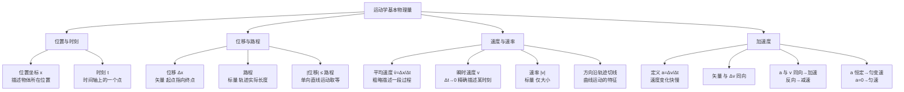

# 描述运动的基本物理量

> [!abstract] 概览
> 本节是整个运动学版块的起点，也是高中力学的第一课。围绕"如何描述一个物体的运动"这一核心问题，建立五大基础概念：==参考系==（描述运动的参照基准）、==质点==（理想化模型）、==位移==（位置变化的矢量）、==速度==（运动快慢与方向的矢量）、==加速度==（速度变化快慢的矢量）。强调几个关键辨析：时刻与时间间隔、位移与路程、速度与速率、平均速度与瞬时速度。最重要的物理观念是——加速度方向与速度变化方向一致，==不一定==与速度方向一致；速度大加速度不一定大，加速度大速度也不一定大。这些概念是后续 [[02-匀变速直线运动]]、[[06-平抛运动]]、[[07-圆周运动]] 的共同语言，也是整个力学大厦的"字母表"。

## 核心概念

### 一、参考系

**参考系**：为描述物体的运动而选作标准的另外的物体。

- **运动是绝对的，对运动的描述是相对的**：任何物体都在运动，但要描述"它怎么动"必须先选定参考系。同一物体相对不同参考系的运动状态可以完全不同。
- **参考系的选择是任意的**：通常以使问题简化为原则。研究地面上物体的运动常以地面为参考系；研究地球绕太阳公转则以太阳为参考系。
- **参考系可静止可运动**：在 [[05-追及与相遇]] 中，取追逐者为参考系（动参考系）往往能极大简化问题，这就是"相对运动法"。

> [!note] 伽利略相对性原理的萌芽
> 1632 年伽利略在《关于两大世界体系的对话》中描述：在匀速行驶的船舱内，一切力学现象（滴水、跳跃、抛物）与船静止时无异。这说明**所有惯性系都是等价的**，不存在"绝对静止"的参考系。这一思想后来被爱因斯坦发展为狭义相对性原理。

### 二、质点（理想化模型）

**质点**：忽略物体的形状和大小，把它看作有质量而无体积的"点"。

> [!important] 质点是理想化模型
> 质点不是"很小的物体"，而是"形状大小对所研究问题的影响可忽略不计"的物体。地球很大（半径约 $6400\,\text{km}$），但研究地球绕太阳公转时仍可视为质点——因为日地距离远大于地球半径；而研究地球自转时则不可视为质点。

**质点化条件**：
1. 物体的大小与所研究的距离相比可忽略（如研究火车从北京到上海的运动）；
2. 物体只做平动（不转动），各点运动状态相同，任一点均可代表整体。

> [!tip] 类比
> 质点之于力学，正如点电荷之于电学、点光源之于光学——都是==忽略次要因素、突出主要矛盾==的理想化模型。物理学之美正在于"用最简的模型抓住最本质的规律"。

### 三、时刻与时间间隔

| 概念 | 符号 | 物理意义 | 类比 |
| --- | --- | --- | --- |
| 时刻 | $t$ | 时间轴上的一个"点"，对应某一瞬时 | 照相机的快门瞬间 |
| 时间间隔 | $\Delta t$ | 时间轴上的一段"线段"，两时刻之差 $\Delta t=t_2-t_1$ | 录像机的录制时段 |

> [!warning] 易混点
> - "第 $3\,\text{s}$ 末"是==时刻==，对应 $t=3\,\text{s}$；
> - "前 $3\,\text{s}$ 内"是==时间间隔==，对应 $0\sim 3\,\text{s}$；
> - "第 $3\,\text{s}$ 内"是==时间间隔==，对应 $2\sim 3\,\text{s}$，时长仅 $1\,\text{s}$。

### 四、位置与坐标

为定量描述质点位置，需在参考系上建立**坐标系**：
- 直线运动：一维坐标轴 $x$；
- 平面运动：二维直角坐标系 $(x,y)$ 或极坐标 $(r,\theta)$；
- 空间运动：三维直角坐标系 $(x,y,z)$。

位置坐标随时间变化的函数 $x=x(t)$ 称为**运动方程**，消去时间 $t$ 可得**轨迹方程**。

### 五、位移与路程（矢量 vs 标量）

**位移** $\vec{x}$：描述物体位置变化的矢量，大小等于从初位置到末位置的直线距离，方向由初位置指向末位置。
$$
\vec{x} = \vec{r}_{末} - \vec{r}_{初}
$$

**路程** $s$：物体运动轨迹的实际长度，是标量（只有大小无方向）。

> [!note] 概念辨析
> | 比较项 | 位移 | 路程 |
> | --- | --- | --- |
> | 性质 | 矢量 | 标量 |
> | 与路径 | 无关 | 有关 |
> | 大小关系 | $\|x\| \le s$（单向直线运动取等） | $s \ge \|x\|$ |
>
> 物体绕操场跑一圈回到起点：位移为 $0$，路程为 $400\,\text{m}$。这是最经典的辨析题。

### 六、速度（平均速度与瞬时速度）

**平均速度** $\bar{v}$：位移与所用时间之比，矢量。
$$
\bar{v} = \dfrac{\vec{x}}{\Delta t}
$$

**瞬时速度** $v$：当 $\Delta t\to 0$ 时平均速度的极限，矢量，方向沿轨迹切线方向。
$$
\vec{v} = \lim_{\Delta t\to 0}\dfrac{\Delta\vec{x}}{\Delta t} = \dfrac{d\vec{x}}{dt}
$$

> [!important] 瞬时速度的"极限思想"
> 瞬时速度的定义用了"无限小时间间隔内的平均速度"——这是==极限思想==在高中物理的首次正式登场。后续瞬时加速度、瞬时功率、感应电动势 $E=-d\Phi/dt$ 都沿用这一思想，是微积分在物理中的核心应用范式。

### 七、速率

**速率** $v_{\text{率}}$：瞬时速度的大小，标量。
$$
v_{\text{率}} = |\vec{v}|
$$

**平均速率**：路程与时间之比，标量。注意：==平均速率 ≠ 平均速度的大小==。

> [!warning] 平均速度大小 vs 平均速率
> - 平均速度大小 $=|\vec{x}|/\Delta t$（按位移算）；
> - 平均速率 $=s/\Delta t$（按路程算）。
>
> 物体绕操场跑一圈用时 $80\,\text{s}$：平均速度 $=0$（位移为 $0$）；平均速率 $=400/80=5\,\text{m/s}$。两者完全不同！

### 八、加速度（本节核心）

**加速度** $\vec{a}$：速度变化量与所用时间之比，矢量。
$$
\boxed{\,\vec{a} = \dfrac{\Delta\vec{v}}{\Delta t} = \dfrac{\vec{v}_t-\vec{v}_0}{\Delta t}\,}
$$

单位：$\text{m/s}^2$（米每二次方秒）。

**物理意义**：描述==速度变化快慢==的物理量。加速度大表示速度变化得快，加速度小表示速度变化得慢。

> [!important] 加速度方向 ≠ 速度方向
> ==加速度方向与速度变化方向一致，但不一定与速度方向一致==。这是本节最关键的观念。
>
> - 加速直线运动：$\vec{a}$ 与 $\vec{v}$ ==同向==，速度增大；
> - 减速直线运动：$\vec{a}$ 与 $\vec{v}$ ==反向==，速度减小；
> - 平抛运动：$\vec{a}=g$ 向下，$\vec{v}$ 时刻在变，二者不在同一直线（详见 [[06-平抛运动]]）；
> - 匀速圆周运动：$\vec{a}$ 指向圆心，$\vec{v}$ 沿切线，二者始终垂直（详见 [[07-圆周运动]]）。

### 九、矢量运算初步

**矢量**：既有大小又有方向，相加遵循**平行四边形定则**（或三角形定则）的物理量。位移、速度、加速度、力都是矢量。

**标量**：只有大小无方向，相加遵循普通算术加法的物理量。路程、时间、质量、温度都是标量。

**矢量加法**：$\vec{C}=\vec{A}+\vec{B}$，遵循平行四边形定则，$|\vec{C}|$ 的范围 $||\vec{A}|-|\vec{B}||\le |\vec{C}|\le |\vec{A}|+|\vec{B}|$。

> [!tip] 正交分解法
> 求多矢量合成时，常用==正交分解法==：把每个矢量沿两个互相垂直的方向分解，分别求代数和，再合成。这是 [[03-力的合成与分解]] 的核心方法，也是平抛运动分析的基础。

## 推导与原理

### 一、瞬时速度的极限定义

设质点在 $t$ 时刻位于 $x(t)$，$t+\Delta t$ 时刻位于 $x(t+\Delta t)$。则 $\Delta t$ 内平均速度：
$$
\bar{v} = \dfrac{x(t+\Delta t)-x(t)}{\Delta t} = \dfrac{\Delta x}{\Delta t}
$$
当 $\Delta t\to 0$，$\Delta x/\Delta t$ 的极限即为瞬时速度：
$$
v = \lim_{\Delta t\to 0}\dfrac{\Delta x}{\Delta t} = \dfrac{dx}{dt}
$$
这就是微积分中"导数"的定义——==瞬时速度是位置对时间的导数==。

### 二、加速度的导数定义

类似地，加速度是速度对时间的变化率：
$$
a = \lim_{\Delta t\to 0}\dfrac{\Delta v}{\Delta t} = \dfrac{dv}{dt} = \dfrac{d^2x}{dt^2}
$$
即加速度是速度对时间的一阶导数，也是位置对时间的二阶导数。这一关系在 [[02-匀变速直线运动]] 中将以积分形式反向使用。

### 三、伽利略落体思想实验

伽利略在《两门新科学》（1638）中用逻辑推理驳斥了"重物下落快"的亚里士多德观点：若重物下落快、轻物下落慢，把二者绑在一起，轻物应"拖慢"重物，则整体下落速度应介于两者之间；但整体更重，按原假设应下落更快——矛盾！故重物下落不一定快。这为 [[03-自由落体与竖直上抛]] 中"轻重物体下落一样快"的实验结论奠定了逻辑基础。

## 典型实例与类比

### 类比 1：加速度 ↔ 人口增长率

理解加速度最贴切的类比是==人口增长率==：
- 速度 $v$ ↔ 人口总数；
- 加速度 $a$ ↔ 人口增长率。

**速度大加速度不一定大**：人口大国（如中国 $14$ 亿）可能增长率很低；人口小国（如某非洲国家）可能增长率很高。同理，速度很大的匀速运动（如飞机巡航），加速度为零；速度很小但加速度很大的运动（如刚启动的火箭），加速度可达几个 $g$。

**加速度大速度不一定大**：增长率高不代表现在人口多。同理，刚启动的列车加速度大但速度还小。

> [!example] 误区辨析三连
> 1. "速度大则加速度大"——错。匀速飞行飞机 $v$ 大 $a=0$。
> 2. "加速度大则速度大"——错。刚启动列车 $a$ 大 $v$ 小。
> 3. "加速度为零则速度为零"——错。匀速运动 $a=0$ 但 $v\ne 0$。

### 类比 2：位移 vs 路程——"出租车计费 vs 直线距离"

从家到学校：出租车按==路程==计费（绕了多少路），GPS 导航按==位移==给方向（家到学校的直线方向）。同一目的地，不同路径路程不同，但位移始终相同。

### 实例：汽车启动与刹车

- 汽车从静止启动：$\vec{v}$ 与 $\vec{a}$ ==同向==，速度增大；
- 汽车刹车减速：$\vec{v}$ 与 $\vec{a}$ ==反向==，速度减小；
- 汽车匀速行驶：$\vec{a}=0$，速度大小方向均不变。

> [!tip] 记忆口诀
> ==加速度看变化，方向同变化；速度大不大，与它无干系；同向加反向减，垂直只改向。==

## 例题

### 例 1：基础——加速度方向辨析

**题目**：关于速度与加速度的关系，下列说法正确的是（　）。
A. 速度方向变化时，加速度方向一定变化
B. 加速度方向与速度方向一定相同
C. 速度增大时，加速度方向一定与速度方向相同
D. 加速度减小时，速度可能增大

**分析**：逐项分析。
- A 错：平抛运动中速度方向时刻变化，但加速度始终为 $g$ 向下，方向不变；
- B 错：减速时加速度与速度反向；匀速圆周运动中加速度与速度垂直；
- C 对：直线运动中速度增大意味着加速，$\vec{a}$ 与 $\vec{v}$ 同向；
- D 对：只要加速度与速度同向，即使加速度在减小，速度仍在增大（只是增大得越来越慢）。

**解答**：选 **CD**。

**点评**：本题考查加速度与速度的==方向关系==与==变化关系==。关键点：加速度与速度同向则速度增大，反向则减小——与加速度本身变大变小无关。

### 例 2：中难——平均速度与瞬时速度

**题目**：一物体沿直线运动，其位置—时间关系为 $x=4t-2t^2$（$x$ 单位 $\text{m}$，$t$ 单位 $\text{s}$）。求：
（1）$t=1\,\text{s}$ 时的瞬时速度；
（2）前 $2\,\text{s}$ 内的平均速度；
（3）前 $2\,\text{s}$ 内的平均速率。

**分析**：瞬时速度用 $v=dx/dt$；平均速度用 $\bar{v}=\Delta x/\Delta t$；平均速率需先算路程，要判断物体是否反向。

**解答**：
（1）$v=\dfrac{dx}{dt}=4-4t$。代入 $t=1\,\text{s}$：$v=0\,\text{m/s}$。

（2）$t=0$：$x_0=0$；$t=2$：$x_2=4\times 2-2\times 4=0$。故 $\bar{v}=\dfrac{0-0}{2}=0\,\text{m/s}$。

（3）先找反向点：$v=4-4t=0\Rightarrow t=1\,\text{s}$。$t=1$ 时 $x_1=4-2=2\,\text{m}$。
- $0\to 1\,\text{s}$：路程 $s_1=|2-0|=2\,\text{m}$；
- $1\to 2\,\text{s}$：路程 $s_2=|0-2|=2\,\text{m}$；
- 总路程 $s=4\,\text{m}$。平均速率 $=4/2=2\,\text{m/s}$。

**点评**：本题经典揭示==平均速度大小 ≠ 平均速率==。物体先正向运动再反向回到原点，位移为零但路程不为零。判断反向点（$v=0$ 的时刻）是求路程的关键。

### 例 3：进阶——加速度的矢量性

**题目**：一小球以 $v_0=6\,\text{m/s}$ 向东运动，与墙碰撞后以 $v=4\,\text{m/s}$ 反向弹回，碰撞时间 $\Delta t=0.1\,\text{s}$。求小球碰撞过程中的平均加速度。

**分析**：加速度是矢量，必须先规定正方向。取向东为正方向，则 $v_0=+6\,\text{m/s}$，$v=-4\,\text{m/s}$（向西）。

**解答**：
$$
a=\dfrac{\Delta v}{\Delta t}=\dfrac{v-v_0}{\Delta t}=\dfrac{(-4)-6}{0.1}=\dfrac{-10}{0.1}=-100\,\text{m/s}^2
$$
即加速度大小为 $100\,\text{m/s}^2$，方向==向西==（与反弹方向相同，与初速度方向相反）。

**点评**：本题极易出错——直接用 $(4-6)/0.1=-20$ 错误地丢掉了方向。==矢量运算必须先定正方向，再带符号代入==。结果为负说明加速度与规定正方向相反。

## 易错提醒

> [!warning] 易错点
> 1. **速度大≠加速度大**：飞机巡航速度大但 $a=0$；火箭刚启动速度小但 $a$ 很大。
> 2. **加速度方向≠速度方向**：减速时反向，圆周运动时垂直，平抛时夹角随时间变。
> 3. **平均速度大小≠平均速率**：前者按位移，后者按路程；只有在单向直线运动时二者相等。
> 4. **位移≠路程**：位移是矢量，与路径无关；路程是标量，与路径有关。
> 5. **时刻≠时间间隔**："第 $3\,\text{s}$ 末"是时刻，"第 $3\,\text{s}$ 内"是 $1\,\text{s}$ 的时间间隔。
> 6. **质点≠小物体**：质点取决于"大小是否可忽略"，与物体本身绝对大小无关。

> [!note] 概念辨析
> **速度 vs 加速度**
> 
> | 比较项 | 速度 $v$ | 加速度 $a$ |
> | --- | --- | --- |
> | 描述 | 运动快慢与方向 | 速度变化快慢与方向 |
> | 定义 | $v=dx/dt$ | $a=dv/dt$ |
> | 方向 | 沿轨迹切线 | 与 $\Delta v$ 同向 |
> | 单位 | $\text{m/s}$ | $\text{m/s}^2$ |
> | 与对方关系 | 速度大 $a$ 可大可小可为零 | $a$ 大 $v$ 可大可小可为零 |
>
> **位移 vs 路程**
> 
> | 比较项 | 位移 $x$ | 路程 $s$ |
> | --- | --- | --- |
> | 性质 | 矢量 | 标量 |
> | 与路径 | 无关 | 有关 |
> | 起点→终点 | 直线距离 | 轨迹总长 |

## 与其他知识关联

- 与 [[02-匀变速直线运动]] 的关系：本节的位移、速度、加速度概念是匀变速直线运动公式 $v=v_0+at$、$x=v_0t+\frac{1}{2}at^2$ 的基石。
- 与 [[03-自由落体与竖直上抛]] 的关系：自由落体是"初速度为零、加速度为 $g$"的匀加速直线运动，是本节加速度概念的具体化。
- 与 [[04-运动图像]] 的关系：$x$-$t$ 图斜率即速度，$v$-$t$ 图斜率即加速度——本节定义在图像中得到几何呈现。
- 与 [[06-平抛运动]] 的关系：平抛运动中加速度 $g$ 恒定但与速度方向不在同一直线，是"加速度方向≠速度方向"的最佳例证。
- 与 [[07-圆周运动]] 的关系：匀速圆周运动速度大小不变方向变，加速度始终指向圆心——"速度变方向必有加速度"的典型。
- 与 [[03-综合应用与拓展/01-运动的合成与分解]] 的关系：矢量运算的平行四边形定则是运动合成的基础。
- 与电学 [[01-静电场/05-带电粒子在电场中的运动]] 的关系：带电粒子在电场中加速度 $a=qE/m$，本节加速度概念直接迁移到电场。
- 高中—大学衔接：[[牛顿力学]] 中瞬时速度与加速度严格用导数定义；[[机械振动]] 中简谐运动 $a=-\omega^2 x$ 是加速度与位移关系的深化。

## 作者的话

> [!quote] 个人理解
> 学完本节，最大的认知突破应是从"日常的速度观念"切换到"矢量的速度与加速度观念"。日常生活中"速度"几乎总指速率（标量），"加速"几乎总指速度增大；但物理中"速度"是矢量，"加速度"是描述速度==变化==（包括大小和方向）的矢量。这一观念切换，是从"朴素物理直觉"走向"科学物理思维"的第一道关卡。
>
> 我特别想强调的是==加速度与速度变化方向一致==这一条。它看似简单，却能解释一切曲线运动的本质：只要速度方向变了（哪怕大小没变），就一定有加速度；只要速度大小变了（哪怕方向没变），也一定有加速度。圆周运动有加速度（向心）、平抛运动有加速度（重力）、简谐振动有加速度（回复力）——它们本质上都是"速度在变化"。
>
> 学习建议：把本节的"概念辨析表"反复看几遍，特别是"速度 vs 加速度"与"位移 vs 路程"两表。这些辨析贯穿整个高中力学，错一道就丢分。后续学 [[02-匀变速直线运动]] 时，要不断回到本节确认"加速度方向"——这是公式正确使用的前提。

---
*返回 [[00-力学总览]]*
