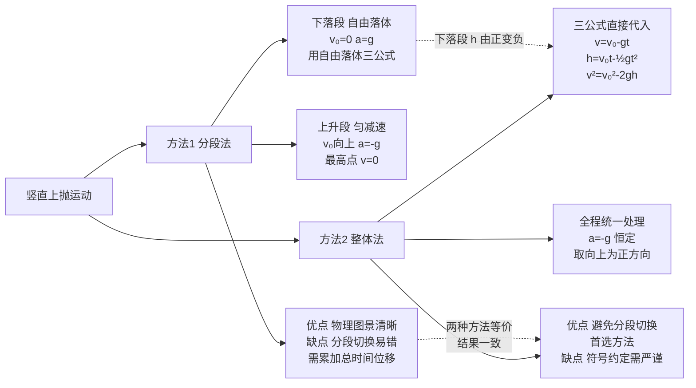

# 自由落体与竖直上抛

> [!abstract] 概览
> 本节是 [[02-匀变速直线运动]] 的特例与延伸。==自由落体运动==是初速度为零、加速度为 $g$ 的匀加速直线运动——把 $v_0=0,a=g$ 代入四公式即得自由落体三公式。==竖直上抛运动==是初速度 $v_0$ 向上、加速度 $-g$ 的匀减速直线运动，到达最高点后做自由落体回到出发点。竖直上抛运动具有美妙的对称性：上升时间等于下落时间、回到出发点时速度大小相等方向相反。本节还涉及伽利略落体实验的历史意义——它不仅是物理规律的发端，更是"实验科学方法"的奠基。两种处理方法（分段法、整体法）的对比是高考重点，空气阻力修正是大学层面的拓展。

## 核心概念

### 一、自由落体运动

**自由落体运动**：物体只在重力作用下从==静止==开始下落的运动。

**三个核心特征**：
1. 初速度 $v_0=0$（"自由"二字的含义）；
2. 加速度 $a=g$（仅受重力，无空气阻力）；
3. 轨迹竖直向下。

> [!important] 自由落体是匀加速直线运动
> 自由落体就是==特殊的匀加速直线运动==——把 $v_0=0,a=g$ 代入 [[02-匀变速直线运动]] 的四公式即可。理解了匀变速，自由落体只是"代值"。

### 二、自由落体三公式

由匀变速四公式取 $v_0=0,a=g,x=h$（下落高度）：

$$
\boxed{\,v = gt\,}
$$

$$
\boxed{\,h = \dfrac{1}{2}g t^2\,}
$$

$$
\boxed{\,v^2 = 2gh\,}
$$

> [!note] 重力加速度 $g$ 的取值
> - 高中阶段通常取 $g=9.8\,\text{m/s}^2$，估算题取 $g=10\,\text{m/s}^2$；
> - $g$ 随纬度增大而略微增大（赤道 $9.78$，两极 $9.83$），随海拔增大而略微减小；
> - $g$ 的本质是万有引力（详见 [[03-综合应用与拓展/04-万有引力与航天]]）：$g=\dfrac{GM}{R^2}$，$G$ 为引力常量，$M$ 为地球质量，$R$ 为地球半径。

### 三、竖直上抛运动

**竖直上抛运动**：物体以初速度 $v_0$ 竖直向上抛出，仅在重力作用下的运动。

**特征**：
1. 初速度 $v_0$ 竖直向上；
2. 加速度 $a=-g$（取向上为正方向时），大小恒为 $g$，方向始终向下；
3. 整个过程是==匀变速直线运动==（$a$ 恒定），上升阶段做匀减速，下降阶段做匀加速。

### 四、竖直上抛三公式

取向上为正方向，则 $v_0>0$，$a=-g$：

$$
\boxed{\,v = v_0 - gt\,}
$$

$$
\boxed{\,h = v_0 t - \dfrac{1}{2}g t^2\,}
$$

$$
\boxed{\,v^2 = v_0^2 - 2gh\,}
$$

其中 $h$ 是相对抛出点的位移（向上为正，下落经过抛出点后 $h$ 变为负）。

### 五、竖直上抛的对称性（核心）

> [!important] 竖直上抛运动的对称性
> 竖直上抛运动关于最高点具有==完美的时间对称与速度对称==：
>
> 1. **上升时间 = 下落时间**：从抛出到最高点的时间 $t_上=v_0/g$，从最高点落回抛出点的时间 $t_下=v_0/g$，二者相等。总时间 $T=2v_0/g$。
> 2. **回到出发点速度大小相等方向相反**：抛出时速度 $v_0$（向上），回到抛出点时速度 $-v_0$（向下）。
> 3. **同一高度速度大小相等**：上升阶段经过某高度 $h$ 的速度大小，等于下落阶段经过同一高度的速度大小，方向相反。

**对称性的数学证明**：由 $v^2=v_0^2-2gh$，速度大小只取决于高度 $h$，与运动方向无关——这正是"同一高度速度大小相等"的根源。

### 六、空气阻力修正简介

实际落体受空气阻力 $f$ 影响，加速度不再等于 $g$：
- 下落时：$mg-f=ma\Rightarrow a<g$，物体先加速后达==收尾速度==（$f=mg$ 时 $a=0$）；
- 上抛时：$mg+f=ma\Rightarrow a>g$，物体减速得更快。

雨滴、跳伞员、降落伞等都是空气阻力不可忽略的典型情境。大学 [[流体力学]] 中由斯托克斯定律 $f=6\pi\eta r v$（小球在粘滞流体中）描述。

## 推导与原理

### 一、伽利略落体实验——历史与方法论

**传统故事**：1589 年伽利略在比萨斜塔上同时释放重球与轻球，二者几乎同时落地，驳斥了亚里士多德"重物下落快"的观点。

**真实历史**：伽利略更重要的贡献是==斜面实验==——通过减缓下落速度便于测量。他用光滑斜面让小球滚下，测量不同倾角下位移与时间关系，发现 $h\propto t^2$，并外推到竖直方向（倾角 $90^\circ$）即得自由落体规律。

> [!important] 伽利略的方法论革命
> 伽利略的开创性在于把"==实验+数学推理=="引入物理学，开创了近代物理学的范式。他不再满足于"亚里士多德说"，而是用==定量实验==检验假设。这种"假设—实验—理论"的循环，是物理学最根本的方法论。爱因斯坦称伽利略为"近代科学之父"。

### 二、竖直上抛两种处理方法对比

**方法 1：分段法**

把运动分为两段处理：
- **上升段**：匀减速直线运动，$v_0$ 向上，$a=-g$，到最高点速度为零。用 $v_0^2=2gh_{max}$ 求最大高度，$t_上=v_0/g$ 求上升时间。
- **下落段**：从最高点开始的自由落体，$v_0=0$，$a=g$。用自由落体三公式处理。

> [!tip] 分段法的优劣
> 优点：物理图景清晰，每段都是熟悉的"自由落体"或"匀减速"；缺点：分段切换易出错，求总位移/总时间需分段累加。

**方法 2：整体法**

把整个上抛过程视为一个==匀变速直线运动==（$a=-g$ 恒定），不分段。所有公式直接用 $v_0,a=-g$ 代入：
- $v=v_0-gt$（速度公式）；
- $h=v_0 t-\frac{1}{2}gt^2$（位移公式，$h$ 是相对抛出点的位移）；
- $v^2=v_0^2-2gh$（速度位移关系）。

> [!important] 整体法的优势
> 整体法==避免分段切换==，把"上升+下落"统一处理。例如求"抛出后多长时间回到抛出点"：直接令 $h=0$，$0=v_0 t-\frac{1}{2}gt^2\Rightarrow t=2v_0/g$（舍去 $t=0$）。比分段法求 $t_上+t_下=v_0/g+v_0/g=2v_0/g$ 简洁得多。
>
> ==整体法是处理竖直上抛的首选方法==，分段法仅在物理图景不清晰时作为辅助。

> [!warning] 整体法的符号约定
> 整体法务必==先定正方向==（通常取向上为正、抛出点为原点）。$h>0$ 表示在抛出点上方，$h<0$ 表示在抛出点下方；$v>0$ 表示向上运动，$v<0$ 表示向下运动。

### 三、最大高度与总时间的推导

**最大高度** $h_{max}$：最高点 $v=0$，由 $v^2=v_0^2-2gh$：
$$
0 = v_0^2 - 2g\,h_{max}\;\Rightarrow\;\boxed{\,h_{max} = \dfrac{v_0^2}{2g}\,}
$$

**上升时间** $t_上$：最高点 $v=0$，由 $v=v_0-gt$：
$$
t_上 = \dfrac{v_0}{g}
$$

**总时间** $T$：回到抛出点 $h=0$，由 $h=v_0 t-\frac{1}{2}gt^2$：
$$
0=v_0 T-\dfrac{1}{2}gT^2\;\Rightarrow\;T=\dfrac{2v_0}{g}
$$
（舍去 $T=0$）。==总时间 = 2 倍上升时间==，体现对称性。

## 典型实例与类比

### 实例 1：跳楼求生——自由落体的危险

人从 $5$ 楼（约 $15\,\text{m}$）坠落，落地时间 $t=\sqrt{2h/g}=\sqrt{3}\approx 1.7\,\text{s}$，落地速度 $v=\sqrt{2gh}\approx 17\,\text{m/s}\approx 61\,\text{km/h}$——相当于被时速 $60$ 公里的汽车撞击，致命危险。安全气囊、消防气垫的作用正是延长碰撞时间，减小冲击力（动量定理，详见 [[动能与动量]]）。

### 类比 1：竖直上抛 ↔ 弹簧振子

竖直上抛运动的对称性与弹簧振子的对称性高度相似：
- 上抛到最高点 ↔ 弹簧拉伸到最大位移；
- 落回抛出点 ↔ 弹簧回到平衡位置；
- 同一高度速度大小相等方向相反 ↔ 弹簧同一位置速度大小相等方向相反。

这种"时间反演对称性"在 [[机械振动]] 中将进一步深化。

### 类比 2：整体法 ↔ "统一坐标系"

分段法像"把两幅地图分别画"——上抛一段、下落一段；整体法像"用一幅地图全程绘制"——全程用同一坐标系、同一公式。整体法的本质是==把运动的"过程描述"简化为"状态描述"==，只要初末状态清楚，过程自然包含在公式里。

> [!tip] 记忆口诀
> ==自由落体三公式，代值 $v_0=0,a=g$；上抛整体 $a=-g$，对称时间与速度；最高点 $v=0$ 求高度，回到原点 $h=0$ 求时间。==

## 例题

### 例 1：基础——自由落体

**题目**：一个物体从 $45\,\text{m}$ 高处自由下落（$g=10\,\text{m/s}^2$）。求：
（1）落地时间 $t$；
（2）落地速度 $v$；
（3）下落最后 $1\,\text{s}$ 内的位移。

**分析**：自由落体，直接套用三公式。最后 $1\,\text{s}$ 内位移 = 总位移 - 前 $(t-1)\,\text{s}$ 位移。

**解答**：
（1）$h=\frac{1}{2}gt^2\Rightarrow 45=5t^2\Rightarrow t=3\,\text{s}$。

（2）$v=gt=10\times 3=30\,\text{m/s}$（或 $v=\sqrt{2gh}=\sqrt{900}=30\,\text{m/s}$）。

（3）前 $2\,\text{s}$ 内位移 $h_2=\frac{1}{2}g(2)^2=20\,\text{m}$；最后 $1\,\text{s}$ 内位移 $\Delta h=45-20=25\,\text{m}$。

**点评**：自由落体题常规操作——三公式灵活运用。"最后 $1\,\text{s}$"用==差值法==（总位移减去前段位移）比直接列方程简洁。

### 例 2：中难——竖直上抛整体法

**题目**：气球以 $v_0=20\,\text{m/s}$ 匀速上升，当气球离地 $h_0=60\,\text{m}$ 处时掉下一物体（$g=10\,\text{m/s}^2$）。求：
（1）物体离开气球后还能上升的最大高度（相对脱离点）；
（2）物体从脱离气球到落地的时间；
（3）物体落地时的速度。

**分析**：物体脱离瞬间具有与气球相同的初速度 $v_0=20\,\text{m/s}$（向上），之后做竖直上抛运动（$a=-g$）。取脱离点为原点，向上为正方向，地面坐标 $h=-60\,\text{m}$。

**解答**：
（1）最高点 $v=0$，由 $v^2=v_0^2-2gh$：$h_{max}=\dfrac{v_0^2}{2g}=\dfrac{400}{20}=20\,\text{m}$（相对脱离点）。

（2）取脱离点为原点，地面 $h=-60\,\text{m}$。代入 $h=v_0 t-\frac{1}{2}gt^2$：
$$
-60 = 20t - 5t^2\;\Rightarrow\;5t^2-20t-60=0\;\Rightarrow\;t^2-4t-12=0
$$
解得 $t=6\,\text{s}$（舍去 $t=-2$）。

（3）由 $v=v_0-gt=20-10\times 6=-40\,\text{m/s}$，负号表示方向向下，即落地速度大小 $40\,\text{m/s}$，方向竖直向下。

**点评**：本题三个要点——（1）==物体脱离瞬间继承气球的速度==（不是从静止开始下落！）；（2）整体法把上抛+下落统一处理，地面在原点下方 $h=-60$；（3）速度为负说明方向向下，体现整体法的符号约定。

### 例 3：进阶——上抛对称性

**题目**：一物体以 $v_0=30\,\text{m/s}$ 竖直上抛（$g=10\,\text{m/s}^2$）。求：
（1）物体在抛出点上方 $h=40\,\text{m}$ 处的速度；
（2）物体两次经过 $h=40\,\text{m}$ 处的时间间隔；
（3）物体在空中运动的总时间。

**分析**：先判断 $h=40\,\text{m}$ 是否可达——最大高度 $h_{max}=v_0^2/(2g)=900/20=45\,\text{m}>40$，可达。同一高度对应两个时刻（上升一次、下落一次），由对称性速度大小相等方向相反。

**解答**：
（1）由 $v^2=v_0^2-2gh=900-800=100$，$v=\pm 10\,\text{m/s}$。即上升时经过 $h=40\,\text{m}$ 速度 $+10\,\text{m/s}$（向上），下落时 $-10\,\text{m/s}$（向下）。

（2）由 $h=v_0 t-\frac{1}{2}gt^2$：$40=30t-5t^2\Rightarrow t^2-6t+8=0\Rightarrow t_1=2\,\text{s},t_2=4\,\text{s}$。两次经过的时间间隔 $\Delta t=t_2-t_1=2\,\text{s}$。

（3）总时间 $T=2v_0/g=2\times 30/10=6\,\text{s}$。

**点评**：本题完美展示==竖直上抛的对称性==——同一高度对应两个时刻、两个速度（大小相等方向相反）。$h$ 关于最高点对称的两个时刻之和等于总时间 $T$：$t_1+t_2=6=T$，这是对称性的体现。

## 易错提醒

> [!warning] 易错点
> 1. **自由落体不是"垂直下落"**：必须==初速度为零==。从手中释放的物体做自由落体；从飞行飞机掉下的物体不是自由落体（有水平初速度，做平抛，详见 [[06-平抛运动]]）。
> 2. **脱离问题初速度**：物体从气球/电梯掉下时，==继承载体当时速度==，不是从静止开始。
> 3. **整体法符号**：必须先定正方向，所有量带符号。$h$ 在抛出点下方取负值，下落速度 $v<0$。
> 4. **同一高度双解**：上抛运动同一高度对应两个时刻，方程 $h=v_0 t-\frac{1}{2}gt^2$ 是 $t$ 的二次方程，通常有两解。
> 5. **空气阻力**：自由落体与上抛公式==仅适用无空气阻力==（或阻力可忽略）。雨滴、跳伞等问题不能用。
> 6. **$g$ 的取值**：审清题目取 $9.8$ 还是 $10$——结果会不同。

> [!note] 概念辨析
> **自由落体 vs 竖直上抛**
> 
> | 比较项 | 自由落体 | 竖直上抛 |
> | --- | --- | --- |
> | 初速度 | $v_0=0$ | $v_0\ne 0$，向上 |
> | 加速度 | $g$（向下） | $-g$（取上为正） |
> | 公式 | $v=gt,h=\frac{1}{2}gt^2$ | $v=v_0-gt,h=v_0t-\frac{1}{2}gt^2$ |
> | 对称性 | 无（单向） | 时间、速度对称 |
>
> **分段法 vs 整体法**
> 
> | 比较项 | 分段法 | 整体法 |
> | --- | --- | --- |
> | 思路 | 上升段+下落段分别处理 | 全程统一匀变速 |
> | 公式 | 各段用对应公式 | $a=-g$ 一套公式 |
> | 优势 | 图景清晰 | 计算简洁 |
> | 风险 | 切换易错 | 符号易错 |
> | 建议 | 辅助理解 | ==首选== |

## 与其他知识关联

- 与 [[01-描述运动的基本物理量]] 的关系：自由落体定义了重力加速度 $g$，是 [[07-圆周运动]]、[[03-综合应用与拓展/04-万有引力与航天]] 的核心常量。
- 与 [[02-匀变速直线运动]] 的关系：自由落体即 $v_0=0,a=g$ 的特例，竖直上抛即 $v_0\ne 0,a=-g$ 的特例——四公式直接代值。
- 与 [[04-运动图像]] 的关系：自由落体的 $v$-$t$ 图是过原点的直线（斜率 $g$），上抛运动 $v$-$t$ 图是斜率为 $-g$ 的直线，与 $t$ 轴交点即最高点时刻。
- 与 [[06-平抛运动]] 的关系：平抛运动的竖直分运动就是自由落体——这是运动分解的关键。
- 与 [[03-综合应用与拓展/04-万有引力与航天]] 的关系：$g=GM/R^2$ 揭示 $g$ 的本质是引力加速度，把地面力学与天体力学统一。
- 与电学 [[01-静电场/05-带电粒子在电场中的运动]] 的关系：密立根油滴实验通过平衡重力 $mg$ 与电场力 $qE$ 测定元电荷——自由落体重力与电场力的平衡。
- 高中—大学衔接：[[牛顿力学]] 中自由落体由 $mg=ma$ 即得；[[流体力学]] 中考虑空气阻力后下落物体达到收尾速度，是斯托克斯定律的应用。

## 作者的话

> [!quote] 个人理解
> 自由落体看似简单（一个公式 $h=\frac{1}{2}gt^2$），但它承载着物理学==方法论革命的里程碑==。伽利略用斜面实验"放大"重力效应，让快速的下落变为可测的滚动；用数学规律 $h\propto t^2$ 揭示自然界的简洁之美——这种"实验+数学"的范式定义了什么是"近代物理学"。学到这里，我总建议读者去读伽利略《两门新科学》的原文片段，感受四百年前那位老人用斜面与水钟丈量重力的执着。
>
> 竖直上抛运动的对称性则是另一个让人着迷的话题。==对称性==在物理学中是极为深刻的观念——它对应守恒定律（诺特定理）。竖直上抛的时间反演对称（上升↔下落互换完全等价）背后，是==重力是保守力==这一事实。学到 [[动能与动量]] 时会看到，正是因为重力做功与路径无关（保守力），机械能守恒才成立，对称性才得以保持。
>
> 学习建议：把"整体法"练熟。它不仅适用于竖直上抛，也适用于一切匀变速直线运动（包括刹车后倒退、斜面上下滑等）。整体法的精神是"==用公式直接处理全过程，不必分段=="——这是高中物理从"分段思维"走向"统一思维"的关键一步。后续学 [[06-平抛运动]] 时，水平方向就是一个"全程匀速"的整体，竖直方向是"全程匀加速"的整体，两者独立处理再合成——这种"分方向整体处理"是处理曲线运动的核心方法论。

---
*返回 [[00-力学总览]]*
