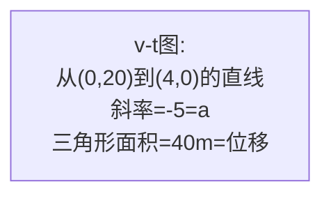

# 运动图像

> [!abstract] 概览
> 本节是运动学的"几何视角"——把物理量之间的关系用图像直观呈现。三大基本图像：==$x$-$t$ 图==（位置-时间，斜率=速度）、==$v$-$t$ 图==（速度-时间，斜率=加速度，面积=位移）、==$a$-$t$ 图==（加速度-时间，面积=速度变化量）。掌握图像的"斜率""面积""截距""交点"四种几何要素对应的物理意义，是解读一切运动图像的通用钥匙。本节还介绍==非线性图像的线性化==技巧——通过变量代换把曲线化为直线，从斜率与截距中提取物理参数。图像法在 [[05-追及与相遇]]、[[06-平抛运动]] 中是重要解题工具，也是高考高频考点。

## 核心概念

### 一、$x$-$t$ 图（位置-时间图）

**横轴**：时间 $t$；**纵轴**：位置 $x$。

**几何要素对应的物理意义**：

| 几何要素 | 物理意义 |
| --- | --- |
| 一点的坐标 $(t,x)$ | 该时刻物体的位置 |
| 曲线的==斜率== $k=\dfrac{\Delta x}{\Delta t}$ | 物体的瞬时速度 $v$ |
| 斜率为正 | 速度沿正方向 |
| 斜率为负 | 速度沿负方向（反向运动） |
| 斜率为零（水平线） | 物体静止 |
| 两条 $x$-$t$ 图的==交点== | 两物体相遇（同时刻同位置） |
| 纵截距 | 初始位置 $x_0$ |

> [!important] $x$-$t$ 图不是轨迹！
> $x$-$t$ 图描述==位置随时间的变化==，不是物体运动的轨迹。物体做直线运动时 $x$-$t$ 图才直观；曲线运动的轨迹需要用 $y$-$x$ 图表示。最常见的错误是把 $x$-$t$ 图中的曲线当成物体真实走过的弯曲路径——错！斜率才是速度。

### 二、$v$-$t$ 图（速度-时间图）

**横轴**：时间 $t$；**纵轴**：速度 $v$。

**几何要素对应的物理意义**：

| 几何要素 | 物理意义 |
| --- | --- |
| 一点的坐标 $(t,v)$ | 该时刻物体的瞬时速度 |
| 曲线的==斜率== $k=\dfrac{\Delta v}{\Delta t}$ | 物体的加速度 $a$ |
| 曲线与 $t$ 轴围成的==面积== | 物体的==位移== $x$（$t$ 轴上方为正，下方为负） |
| 曲线与 $t$ 轴围成的==面积的绝对值之和== | 路程 $s$ |
| 两条 $v$-$t$ 图的==交点== | 两物体速度相等（==追及问题的临界==，详见 [[05-追及与相遇]]） |
| 纵截距 | 初速度 $v_0$ |

> [!tip] 面积=位移的物理含义
> $v$-$t$ 图中面积 $=\int v\,dt=x$，这正是微积分"积分"的几何意义。匀变速运动的 $v$-$t$ 图是直线，与 $t$ 轴围成梯形，梯形面积 $=\dfrac{v_0+v}{2}\cdot t$ 即位移公式 $x=\bar{v}t$——这就是 [[02-匀变速直线运动]] 平均速度公式的几何来源。

### 三、$a$-$t$ 图（加速度-时间图）

**横轴**：时间 $t$；**纵轴**：加速度 $a$。

**几何要素对应的物理意义**：

| 几何要素 | 物理意义 |
| --- | --- |
| 一点的坐标 $(t,a)$ | 该时刻物体的瞬时加速度 |
| 曲线的==斜率== | 加速度的变化率 $\dfrac{da}{dt}$（"急动度"，高中不要求） |
| 曲线与 $t$ 轴围成的==面积== | 速度的变化量 $\Delta v=\int a\,dt$ |
| 水平直线（$a$ 为常数） | 匀变速运动 |

> [!note] $a$-$t$ 图面积是 $\Delta v$，不是 $v$
> 常见错误：把 $a$-$t$ 图面积当作速度 $v$。正确理解：$a$-$t$ 图面积 $=\int a\,dt=\Delta v$，是==速度的变化量==，不是速度本身。要求某时刻的瞬时速度，需用 $v_t=v_0+\Delta v$（初速度加变化量）。

### 四、非线性图像的线性化

许多物理规律本质是非线性（曲线）关系，直接画图难以读出参数。==线性化==的思路是：通过变量代换把曲线化为直线，从斜率与截距中提取物理参数。

**常见线性化技巧**：

| 原始关系 | 代换后 | 线性化关系 | 斜率 | 截距 |
| --- | --- | --- | --- | --- |
| $v^2=v_0^2+2ax$ | $y=v^2$，$x=x$ | $v^2=v_0^2+2ax$ | $2a$ | $v_0^2$ |
| $x=\frac{1}{2}at^2$（$v_0=0$） | $y=x/t^2$，或 $y=x$，$x=t^2$ | $x=\frac{1}{2}a\cdot t^2$ | $\frac{1}{2}a$（$x$-$t^2$ 图） | $0$ |
| $x=v_0t+\frac{1}{2}at^2$ | $y=x/t$，$x=t$ | $\dfrac{x}{t}=v_0+\dfrac{1}{2}at$ | $\frac{1}{2}a$ | $v_0$ |
| $T=2\pi\sqrt{L/g}$ | $y=T^2$，$x=L$ | $T^2=\dfrac{4\pi^2}{g}\,L$ | $\dfrac{4\pi^2}{g}$ | $0$ |

> [!important] 线性化的核心思想
> 线性化是为了==从图中精确读出物理参数==。直线比曲线易读，斜率与截距可通过两点线性回归精确求得。这一思想在实验数据处理中至关重要——大学物理实验中几乎所有参数测定都依赖线性化。

### 五、图像物理意义的提取方法

**通用四步法**：

1. **认轴**——先看横纵坐标分别是什么物理量（$x$、$v$、$a$、$t$、$v^2$、$x/t$ 等）；
2. **认线**——曲线类型（直线、抛物线、双曲线等）对应函数关系；
3. **看斜率**——斜率 $=\dfrac{\Delta y}{\Delta x}$ 对应什么物理量；
4. **看面积**——面积 $=\int y\,dx$ 对应什么物理量（仅当 $x$ 轴是时间 $t$ 时，面积才有"累积"意义）。

> [!tip] "斜率"与"面积"的物理意义总结
> - ==斜率==：纵轴物理量对横轴物理量的导数（变化率）。如 $v$-$t$ 图斜率 $=dv/dt=a$；$x$-$t$ 图斜率 $=dx/dt=v$。
> - ==面积==：纵轴物理量对横轴物理量的积分（累积）。如 $v$-$t$ 图面积 $=\int v\,dt=x$；$a$-$t$ 图面积 $=\int a\,dt=\Delta v$；$F$-$x$ 图面积 $=\int F\,dx=W$（功）。
> - 记忆口诀：==导数对应斜率，积分对应面积==。

## 推导与原理

### 一、$v$-$t$ 图面积 $=$ 位移的严格推导

考虑 $v$-$t$ 图上一段曲线 $v=v(t)$，从 $t_1$ 到 $t_2$。把时间区间分成 $n$ 个小区间 $\Delta t$，每个小区间内位移近似为 $\Delta x_i\approx v(t_i)\Delta t$（小矩形面积）。总位移：
$$
x \approx \sum_{i=1}^n v(t_i)\Delta t
$$
当 $n\to\infty,\Delta t\to 0$，求和变为积分：
$$
\boxed{\,x = \int_{t_1}^{t_2} v(t)\,dt\,}
$$
这正是 $v$-$t$ 曲线下方的面积——==积分的几何意义==。

**特例**：匀变速运动 $v=v_0+at$，$v$-$t$ 图是斜直线，与 $t$ 轴围成梯形：
$$
x = \dfrac{v_0+v}{2}\cdot t = v_0 t + \dfrac{1}{2}at^2
$$
与 [[02-匀变速直线运动]] 位移公式一致。

### 二、$v^2$-$x$ 图的线性化推导

由 $v^2-v_0^2=2ax$，得 $v^2=v_0^2+2ax$。若以 $v^2$ 为纵轴、$x$ 为横轴作图，得到一条斜率为 $2a$、纵截距为 $v_0^2$ 的直线。

**应用**：实验中测得各位置 $x_i$ 处的瞬时速度 $v_i$，作 $v^2$-$x$ 图，由斜率可求加速度 $a$，由截距可求初速度 $v_0$。这种方法比逐差法更精确（充分利用所有数据点）。

### 三、$x/t$-$t$ 图的线性化推导

由 $x=v_0t+\frac{1}{2}at^2$，两边除以 $t$：
$$
\dfrac{x}{t} = v_0 + \dfrac{1}{2}a t
$$
即 $x/t$ 与 $t$ 成线性关系，斜率 $=\frac{1}{2}a$，截距 $=v_0$。

> [!example] 线性化的妙用
> 直接用 $x$-$t$ 图（抛物线）求 $a$ 与 $v_0$ 很难读准；线性化为 $x/t$-$t$ 图（直线）后，斜率与截距一目了然。这就是"化曲为直"的威力。

## 典型实例与类比

### 实例 1：刹车过程的 $v$-$t$ 图

汽车以 $v_0=20\,\text{m/s}$ 行驶，$t=0$ 时开始刹车，加速度 $a=-5\,\text{m/s}^2$，$4\,\text{s}$ 后停下。

$v$-$t$ 图是一条从 $(0,20)$ 到 $(4,0)$ 的斜直线：
- 斜率 $=(0-20)/(4-0)=-5$，即加速度 $a=-5\,\text{m/s}^2$；
- 三角形面积 $=\frac{1}{2}\times 4\times 20=40\,\text{m}$，即刹车位移；
- $t>4\,\text{s}$ 后 $v=0$（已停下），$v$-$t$ 图变为水平线（与 $t$ 轴重合）。

### 类比 1：$x$-$t$ 图 ↔ 行程记录仪

$x$-$t$ 图就像汽车行程记录仪——横轴是时间，纵轴是离起点的距离。斜率正负表示前进或后退，斜率大小表示快慢，两条曲线相交表示两车相遇。

### 类比 2：$v$-$t$ 图面积 ↔ 蓄水池

$v$-$t$ 图中 $v$ 是"注入速率"，时间是"注入时长"，面积（速率×时长）就是"总注入量"——即位移。$t$ 轴上方为正位移（向前），下方为负位移（向后）。

> [!tip] 记忆口诀
> ==认轴认线看斜率，面积积分斜率导；$x$-$t$ 斜率是速度，$v$-$t$ 斜率加速度、面积是位移；$a$-$t$ 面积速度变；曲化直线斜截求。==

## 例题

### 例 1：基础——$v$-$t$ 图解读

**题目**：一质点做直线运动的 $v$-$t$ 图如下：$0\sim 2\,\text{s}$ 内速度从 $0$ 均匀增大到 $4\,\text{m/s}$；$2\sim 4\,\text{s}$ 内速度保持 $4\,\text{m/s}$ 不变；$4\sim 6\,\text{s}$ 内速度从 $4\,\text{m/s}$ 均匀减小到 $0$。求：
（1）各段加速度；
（2）$0\sim 6\,\text{s}$ 内总位移与总路程；
（3）全程平均速度与平均速率。

**分析**：$v$-$t$ 图斜率即加速度，面积即位移。三段都是直线，面积可分别用三角形、矩形、三角形计算。

**解答**：
（1）加速度（斜率）：
- $0\sim 2\,\text{s}$：$a_1=\dfrac{4-0}{2}=2\,\text{m/s}^2$；
- $2\sim 4\,\text{s}$：$a_2=0$（匀速）；
- $4\sim 6\,\text{s}$：$a_3=\dfrac{0-4}{2}=-2\,\text{m/s}^2$。

（2）位移（面积）：
- $x_1=\frac{1}{2}\times 2\times 4=4\,\text{m}$；
- $x_2=2\times 4=8\,\text{m}$；
- $x_3=\frac{1}{2}\times 2\times 4=4\,\text{m}$；
- 总位移 $x=16\,\text{m}$（速度始终为正，路程等于位移 $s=16\,\text{m}$）。

（3）平均速度 $=$ 平均速率 $=x/t=16/6\approx 2.67\,\text{m/s}$（单向直线运动二者相等）。

**点评**：$v$-$t$ 图分段解读三步——==认轴认线、算斜率（加速度）、算面积（位移）==。注意若 $v$-$t$ 图出现 $t$ 轴下方的部分，那段位移为负，路程为面积的绝对值。

### 例 2：中难——$v^2$-$x$ 图线性化

**题目**：实验测得做匀加速直线运动的物体在不同位置 $x$（从起点测量）处的速度平方 $v^2$ 数据如下：

| $x/\text{m}$ | 0 | 1 | 2 | 3 | 4 |
| --- | --- | --- | --- | --- | --- |
| $v^2/(\text{m}^2/\text{s}^2)$ | 4 | 6 | 8 | 10 | 12 |

求物体的加速度 $a$ 与初速度 $v_0$。

**分析**：由 $v^2=v_0^2+2ax$，作 $v^2$-$x$ 图应为直线，斜率 $=2a$，截距 $=v_0^2$。

**解答**：从数据看，$x$ 每增加 $1\,\text{m}$，$v^2$ 增加 $2\,\text{m}^2/\text{s}^2$，故斜率 $k=2$。所以
$$
2a=2\;\Rightarrow\;a=1\,\text{m/s}^2
$$
截距 $b=v^2|_{x=0}=4$，故 $v_0^2=4\;\Rightarrow\;v_0=2\,\text{m/s}$。

**点评**：本题展示==线性化==的威力——直接看 $v$-$x$ 关系是抛物线难以读参数；化为 $v^2$-$x$ 直线后，斜率与截距一目了然。这是"化曲为直"的典型范例，在实验题中高频出现。

### 例 3：进阶——$x$-$t$ 图与相遇

**题目**：甲、乙两物体沿同一直线运动，其 $x$-$t$ 图如下图所示。已知甲的 $x$-$t$ 图是一条过原点的直线，乙的 $x$-$t$ 图是一条抛物线（开口向下），两图在 $t=2\,\text{s}$ 和 $t=6\,\text{s}$ 时相交。请分析两物体的运动并求相遇时刻的位置。

**分析**：
- 甲：$x$-$t$ 图是过原点的直线 $\Rightarrow$ 匀速直线运动，斜率 $=v_{甲}$；
- 乙：$x$-$t$ 图是抛物线 $\Rightarrow$ 匀变速直线运动，斜率（速度）随时间变化；
- 两图交点 $\Rightarrow$ 相遇（同时刻同位置）。

**解答**：设甲 $x_{甲}=v_{甲}t$，乙 $x_{乙}=v_{乙0}t+\frac{1}{2}a_{乙}t^2$。由交点 $t=2$ 与 $t=6$ 处 $x_{甲}=x_{乙}$：
$$
2v_{甲}=2v_{乙0}+2a_{乙}\quad\text{①}
$$
$$
6v_{甲}=6v_{乙0}+18a_{乙}\quad\text{②}
$$
由 ①得 $v_{甲}=v_{乙0}+a_{乙}$，代入 ②：$6(v_{乙0}+a_{乙})=6v_{乙0}+18a_{乙}$，解得 $a_{乙}=0$... 这与"抛物线"矛盾，说明需补充信息（如顶点位置）才能定解。一般题型会给充足条件。相遇位置 $x_{相遇}=v_{甲}\times 2=2v_{甲}$（在 $t=2\,\text{s}$ 时）。

**点评**：$x$-$t$ 图==交点即相遇==是核心观念。两物体相遇条件：$x_1(t)=x_2(t)$（同一时刻同一位置）。这一观念在 [[05-追及与相遇]] 中将进一步深化，是追及问题的图像解法基础。

## 易错提醒

> [!warning] 易错点
> 1. **$x$-$t$ 图不是轨迹**：$x$-$t$ 图中曲线弯曲不代表物体走弯曲路径，斜率变化代表速度变化。
> 2. **$v$-$t$ 图中 $t$ 轴下方面积**：是==负位移==，求路程时取绝对值。如物体先正方向运动再反向，位移 $=|S_上|-|S_下|$，路程 $=|S_上|+|S_下|$。
> 3. **$a$-$t$ 图面积是 $\Delta v$ 不是 $v$**：要求瞬时速度需 $v_t=v_0+\Delta v$，加上初速度。
> 4. **交点的物理意义**：$x$-$t$ 图交点是==相遇==（同位置）；$v$-$t$ 图交点是==速度相等==（不一定是相遇，但往往是追及的临界）。
> 5. **线性化时认准变量**：$v^2$-$x$ 图斜率是 $2a$ 不是 $a$；$x/t$-$t$ 图斜率是 $\frac{1}{2}a$ 不是 $a$。
> 6. **截距的物理意义**：纵截距是 $t=0$ 时的纵轴量（如 $v_0$、$x_0$），横截距是纵轴量为零时的时刻（如匀减速到停下的时间）。

> [!note] 概念辨析
> **斜率 vs 面积**
> | 比较项 | 斜率 | 面积 |
> | --- | --- | --- |
> | 数学 | 导数（变化率） | 积分（累积） |
> | $x$-$t$ 图 | 速度 $v$ | （无常用意义） |
> | $v$-$t$ 图 | 加速度 $a$ | 位移 $x$ |
> | $a$-$t$ 图 | （急动度） | 速度变化量 $\Delta v$ |
> | $F$-$x$ 图 | （力梯度） | 功 $W$ |
>
> **交点的物理意义**
> | 图像类型 | 交点含义 |
> | --- | --- |
> | $x$-$t$ 图 | 相遇（同时刻同位置） |
> | $v$-$t$ 图 | 速度相等（追及临界） |
> | $a$-$t$ 图 | 加速度相等 |

## 与其他知识关联

- 与 [[01-描述运动的基本物理量]] 的关系：$x$-$t$ 图斜率定义了速度，$v$-$t$ 图斜率定义了加速度——图像是定义的几何呈现。
- 与 [[02-匀变速直线运动]] 的关系：四公式均可由 $v$-$t$ 图（斜直线）的几何性质直接推导。
- 与 [[03-自由落体与竖直上抛]] 的关系：自由落体 $v$-$t$ 图是过原点的直线，竖直上抛 $v$-$t$ 图是斜率为 $-g$ 的直线，与 $t$ 轴交点即最高点时刻。
- 与 [[05-追及与相遇]] 的关系：$v$-$t$ 图面积法是追及问题的图像解法，两图交点即"速度相等"的临界时刻。
- 与 [[06-平抛运动]] 的关系：平抛运动的 $v_y$-$t$ 图是过原点的直线（斜率 $g$），$v_x$-$t$ 图是水平线（匀速）。
- 与电学 [[01-静电场/05-带电粒子在电场中的运动]] 的关系：带电粒子在偏转电场中 $v_y$-$t$ 图与平抛运动完全一致——类比迁移。
- 高中—大学衔接：[[牛顿力学]] 中 $F$-$x$ 图面积是功，$F$-$t$ 图面积是冲量；[[机械振动]] 中 $x$-$t$ 图是正弦曲线，对应简谐运动。

## 作者的话

> [!quote] 个人理解
> 运动图像是高中物理最"美"的部分之一——它把抽象的公式转化为直观的几何形状，让物理规律"看得见"。学到这里，我建议读者建立"==一图胜千言=="的思维：拿到运动学题，第一反应不是列方程，而是画 $v$-$t$ 图或 $x$-$t$ 图。图形画对了，方程自然就出来了。
>
> 图像的核心是"==斜率与面积=="两件事。一句话总结：==斜率是导数，面积是积分==。这一观念一旦建立，可以推广到一切物理图像——$F$-$x$ 图面积是功、$F$-$t$ 图面积是冲量、$I$-$t$ 图面积是电量、$U$-$q$ 图面积是电场能……物理学几乎所有"累积量"都对应图像面积，所有"变化率"都对应图像斜率。这是物理学"几何语言"的核心。
>
> 线性化技巧则是实验物理的"杀手锏"。大学物理实验中几乎所有参数测定都用线性化——把 $y=ax^2+b$ 化为 $y$-$x^2$ 直线、把 $y=a\sqrt{x}+b$ 化为 $y$-$\sqrt{x}$ 直线……一旦化为直线，斜率与截距可由最小二乘法精确求得，比"凭眼读曲线"准得多。建议读者在遇到非线性关系时，主动思考"能否化为直线"——这是实验思维成熟度的标志。
>
> 最后提醒：图像是==工具==不是==目的==。解题时若图像法比代数法更直观，就用图像；若代数法更简洁，就用代数。两者灵活切换，才是物理学家的真正本领。

---
*返回 [[00-力学总览]]*
