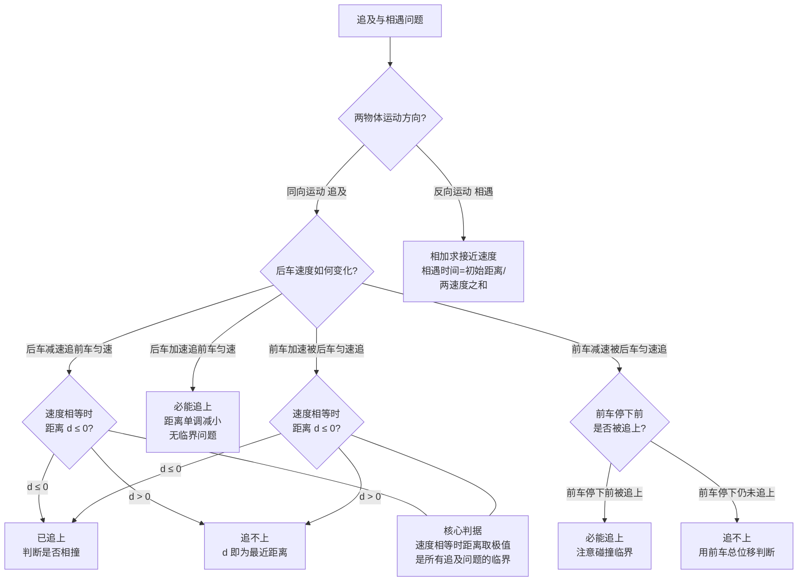

# 追及与相遇

> [!abstract] 概览
> 本节是 [[02-匀变速直线运动]] 与 [[04-运动图像]] 的综合应用。追及与相遇问题考察两个物体的相对运动，是运动学最经典也最具综合性的题型。==追及问题==的核心是"后面的物体追上前面的物体"，==相遇问题==的核心是"两物体同时到达同一位置"。两者共同的临界条件是==速度相等==——速度相等时两物体距离达到极值（最大或最小），是判别"能否追上""是否相撞"的关键状态。本节介绍三种主要方法：==代数法==（列位移方程联立）、==相对运动法==（取一物体为参考系）、==图像法==（$v$-$t$ 图面积法）。刹车安全距离模型与避碰问题是高考高频考点。

## 核心概念

### 一、追及问题

**追及**：两个物体同向运动，后面物体（速度较大）追赶前面物体（速度较小），直至两者位置相同。

**追及条件**：当后者追上前者时，二者位移满足
$$
x_{后} = x_{前} + \Delta x_0
$$
其中 $\Delta x_0$ 是初始时两者的距离（后者在前者后方 $\Delta x_0$ 处）。

### 二、相遇问题

**相遇**：两个物体在同一时刻到达同一位置。可同向也可反向。

**相遇条件**：
- 同向相遇：$x_1(t)=x_2(t)$，即两物体位置相等；
- 反向相遇：$x_1(t)+x_2(t)=L$，$L$ 为初始距离，即两物体位移之和等于初始间距。

> [!note] 追及 vs 相遇
> 追及是相遇的特例（同向）；相遇包含追及（同向）与对向相遇（反向）两种情形。汽车追汽车是追及，两车相向而行碰头是反向相遇。

### 三、临界条件——速度相等（核心）

> [!important] 速度相等是追及问题的临界
> 在追及问题中，当两物体==速度相等==时，二者距离达到==极值==（最大或最小）。这是判别"能否追上""是否相撞"的关键状态。
>
> - 若两物体同向运动，后者速度大于前者时距离减小；后者速度小于前者时距离增大。==速度相等时距离取极值==。
> - 若速度相等时恰好距离为零，则刚好追上（相切的临界）；
> - 若速度相等时距离仍为正，则追不上（最近距离就等于此时距离）；
> - 若速度相等前已经追上，则会发生碰撞（或两次相遇）。

**典型情境**：

| 情境 | 临界（速度相等）时 | 结论 |
| --- | --- | --- |
| 后者减速追前者匀速 | 距离最小 | 若此时距离 $\le 0$，已追上；若 $>0$，追不上 |
| 后者加速追前者匀速 | 距离减小直至追上 | 必能追上 |
| 前者减速被后者匀速追 | 距离减小直至追上 | 必能追上，注意前者是否停下 |
| 前者加速被后者匀速追 | 距离先减后增 | 速度相等时距离最小 |

### 四、相对运动法

**相对运动法**：取一个物体为参考系（动参考系），把两物体运动转化为一个物体相对另一个物体的运动。

**核心公式**：
$$
\vec{v}_{甲对乙} = \vec{v}_{甲} - \vec{v}_{乙}
$$
$$
\vec{a}_{甲对乙} = \vec{a}_{甲} - \vec{a}_{乙}
$$

**优势**：把"两个物体运动"转化为"一个物体运动"，问题大大简化。

> [!example] 相对运动法的妙用
> 甲车以 $v_1=10\,\text{m/s}$ 匀速，乙车在甲后方 $30\,\text{m}$ 以 $v_2=20\,\text{m/s}$ 匀速追赶。取甲为参考系，乙相对甲的速度 $v_{相对}=v_2-v_1=10\,\text{m/s}$，距离 $30\,\text{m}$，追上时间 $t=30/10=3\,\text{s}$。比分段列方程简洁。

### 五、汽车刹车安全距离模型

**安全距离**：后车刹车时不撞上前车所需的最小距离。

**模型**：前车以 $v_0$ 匀速行驶，后车以 $v_0$ 同速跟随，前车突然刹车（加速度大小 $a$）。后车司机有==反应时间== $\Delta t$（典型 $0.5\sim 1\,\text{s}$），反应时间内后车仍匀速；之后后车以同样加速度 $a$ 刹车。

**安全距离** $d$：
$$
d = v_0\cdot\Delta t + \dfrac{v_0^2}{2a} - \dfrac{v_0^2}{2a} = v_0\cdot\Delta t
$$
即==安全距离等于反应时间内后车多走的距离==。

> [!warning] 实际安全距离远大于此
> 上述模型假设前后车刹车加速度相同，且前车刹停。实际中：
> - 前车可能急刹（$a$ 大），后车刹不住（$a$ 小）；
> - 路面湿滑、轮胎磨损使 $a$ 减小；
> - 驾驶员反应时间不止 $1\,\text{s}$。
>
> 因此交规要求的安全距离远大于理论值。高速公路"车速 $100\,\text{km/h}$ 保持 $100\,\text{m}$ 以上车距"是综合各种因素的保守规定。

### 六、追及问题的图像法（$v$-$t$ 图面积法）

**方法**：在同一 $v$-$t$ 图中画出两物体的速度图线，则：
- 两图==交点==对应==速度相等==时刻（临界状态）；
- 两图与 $t$ 轴围成==面积之差==即为==两物体位移之差==。

**判别规则**：
- 若速度相等时（交点处）位移差恰好等于初始距离，则==刚好追上==；
- 若速度相等时位移差仍小于初始距离，则==追不上==，此时距离最近；
- 若速度相等前位移差已达初始距离，则==已追上==，且会发生二次分离。

## 推导与原理

### 一、临界条件的数学推导

设前车位置 $x_1(t)$，后车位置 $x_2(t)$，初始时 $x_2(0)=x_1(0)-d$（后车在后 $d$ 处）。两车距离：
$$
\Delta x(t) = x_1(t) - x_2(t)
$$
对时间求导：
$$
\dfrac{d(\Delta x)}{dt} = v_1(t) - v_2(t)
$$
当 $\dfrac{d(\Delta x)}{dt}=0$，即 $v_1=v_2$ 时，$\Delta x$ 取极值。这就是"==速度相等时距离极值=="的数学根源。

**二阶导数判别**：
- 若 $\dfrac{d^2(\Delta x)}{dt^2}=a_1-a_2>0$（前车加速更快 / 后车减速更快），则 $\Delta x$ 取极小值（距离最近，最易追上）；
- 若 $\dfrac{d^2(\Delta x)}{dt^2}=a_1-a_2<0$，则 $\Delta x$ 取极大值（距离最远，追不上）。

### 二、刹车安全距离的严格推导

设前车 $t=0$ 时位置 $x_1(0)=0$，速度 $v_0$，开始刹车（$a_1=-a$）；后车 $t=0$ 时位置 $x_2(0)=-d$，速度 $v_0$，反应时间 $\Delta t$ 内匀速，之后刹车（$a_2=-a$）。

**前车位移**（刹车到停需 $t_0=v_0/a$）：
$$
x_1(t) = v_0 t - \dfrac{1}{2}a t^2,\quad t\le t_0
$$
$t\ge t_0$ 后前车停下，$x_1=v_0^2/(2a)$。

**后车位移**：
- 反应期内（$0\le t\le\Delta t$）：$x_2(t)=-d+v_0 t$；
- 反应期后（$\Delta t\le t\le \Delta t+t_0$）：$x_2(t)=-d+v_0\Delta t + v_0(t-\Delta t)-\frac{1}{2}a(t-\Delta t)^2$。

**临界条件**：后车恰好不撞前车，即后车停下时与前车位置相同。两车最终都停在 $v_0^2/(2a)$ 处（前车）和 $-d+v_0\Delta t+v_0^2/(2a)$ 处（后车）。两位置相等：
$$
\dfrac{v_0^2}{2a} = -d + v_0\Delta t + \dfrac{v_0^2}{2a}\;\Rightarrow\; d=v_0\Delta t
$$
即安全距离 $d=v_0\Delta t$，与前车刹车加速度无关（因两车加速度相同）。

### 三、相对运动法的等价性

取前车为参考系，后车相对前车的初速度 $v_{相对}=v_2-v_1$，相对加速度 $a_{相对}=a_2-a_1$。在后车参考系中，前车从相对距离 $d$ 处以 $v_{相对},a_{相对}$ 运动。追及条件化为"前车（在动系中）从 $d$ 处回到原点"，可用匀变速公式直接求解。

数学上，这种方法与代数法完全等价，但==物理图景更清晰==——把"两体问题"化为"一体问题"。

## 典型实例与类比

### 实例 1：猎豹追羚羊

猎豹最大速度 $30\,\text{m/s}$，加速度 $6\,\text{m/s}^2$；羚羊最大速度 $25\,\text{m/s}$，加速度 $5\,\text{m/s}^2$。猎豹距羚羊 $50\,\text{m}$ 时开始追，羚羊同时逃跑。问猎豹能否追上？

**分析**：两动物都先加速到最大速度，再匀速。比较加速阶段：猎豹 $5\,\text{s}$ 加速到 $30\,\text{m/s}$，羚羊 $5\,\text{s}$ 加速到 $25\,\text{m/s}$。加速阶段猎豹位移 $75\,\text{m}$，羚羊 $62.5\,\text{m}$，差 $12.5\,\text{m}<50\,\text{m}$，未追上。之后两动物匀速，速度差 $5\,\text{m/s}$，还需 $(50-12.5)/5=7.5\,\text{s}$ 追上。总时间 $12.5\,\text{s}$（猎豹耐力极限约 $20\,\text{s}$，可追上）。

### 类比 1：追及 ↔ 跑道套圈

两人在环形跑道同时起跑，快者套圈慢者。每次套圈，快者比慢者多跑一圈（$400\,\text{m}$）。第 $n$ 次套圈时快者比慢者多跑 $400n\,\text{m}$，由位移差方程即可求解。这是追及问题的"环形版本"。

### 类比 2：刹车安全 ↔ 反应时间测试

驾驶模拟器中，前方突然出现障碍物，驾驶员从看到障碍到踩刹车的时间即反应时间。在这段时间内车辆仍以原速前进，这就是"反应距离"。安全距离 $=$ 反应距离 $+$ 刹车距离。

> [!tip] 记忆口诀
> ==追及相遇看临界，速度相等距离极；前减后匀追得上，前加后匀难追及；图像面积算位移，相对运动化一体。==

## 例题

### 例 1：基础——代数法追及

**题目**：甲车以 $v_1=10\,\text{m/s}$ 匀速行驶，乙车在甲车后方 $d=50\,\text{m}$ 处以 $v_2=5\,\text{m/s}$ 匀速行驶。某时刻乙车开始以 $a=2\,\text{m/s}^2$ 匀加速追赶甲车。求：
（1）乙车追上甲车的时间；
（2）乙车追上甲车时两车的速度差。

**分析**：乙车加速，甲车匀速。设乙车开始加速时刻为 $t=0$，两车位移：
- 甲：$x_1=v_1 t$；
- 乙：$x_2=-d+v_2 t+\frac{1}{2}at^2$。

追上时 $x_1=x_2$，即 $v_1 t=-d+v_2 t+\frac{1}{2}at^2$。

**解答**：
（1）代入数据：$10t=-50+5t+t^2$，即 $t^2-5t-50=0$，解得 $t=10\,\text{s}$（舍负）。

（2）此时乙车速度 $v_乙=v_2+at=5+2\times 10=25\,\text{m/s}$，甲车 $v_甲=10\,\text{m/s}$，速度差 $15\,\text{m/s}$。

**点评**：代数法是基础方法——==分别列两车位移方程，联立求解==。注意初始位置的处理：乙车在后方，初位置为 $-d$。

### 例 2：中难——临界条件判别

**题目**：甲车以 $v_1=20\,\text{m/s}$ 匀速行驶，乙车在甲车前方 $d=30\,\text{m}$ 处以 $v_2=5\,\text{m/s}$ 匀速行驶。某时刻乙车开始以 $a=2\,\text{m/s}^2$ 匀加速。问：甲车能否追上乙车？若能，何时追上？若不能，最近距离多少？

**分析**：乙车加速，甲车匀速。乙车初速度 $5\,\text{m/s}$ 加速到 $20\,\text{m/s}$ 需 $t=(20-5)/2=7.5\,\text{s}$。在这之前乙车速度小于甲车，距离在减小；之后乙车速度大于甲车，距离增大。故==速度相等时（乙车速度增至 $20\,\text{m/s}$ 时）距离最近==。

**解答**：速度相等时刻 $t^*=7.5\,\text{s}$。
- 甲车位移：$x_甲=20\times 7.5=150\,\text{m}$；
- 乙车位移：$x_乙=5\times 7.5+\frac{1}{2}\times 2\times 7.5^2=37.5+56.25=93.75\,\text{m}$；
- 乙车相对甲车位移：$93.75-150-30=-86.25\,\text{m}$（仍在甲前方 $86.25-(-30)=...$，需重新计算）。

正确做法：以甲车为原点，乙车初位置 $+30\,\text{m}$。$t^*$ 时：
- $x_甲=150$，$x_乙=30+93.75=123.75$；
- 距离 $\Delta x=x_乙-x_甲=123.75-150=-26.25\,\text{m}$，负号表示乙车已在甲车后方 $26.25\,\text{m}$——即甲车已超过乙车！

重新审视：实际上甲车在 $t^*$ 之前已追上乙车。设追上时刻 $t_0$：$20t_0=30+5t_0+t_0^2$，即 $t_0^2-15t_0+30=0$，解得 $t_0=\dfrac{15-\sqrt{225-120}}{2}=\dfrac{15-\sqrt{105}}{2}\approx 2.87\,\text{s}$（早解，第一次追上）；另一解 $t_0'\approx 12.13\,\text{s}$ 是第二次相遇（乙车反超后再被甲追及？需校核）。

**点评**：本题展示了"速度相等"判别的==误区==——并非所有"速度相等"都是"距离极值"，要结合加速度方向判断。本题中乙车加速到与甲同速时距离由减转增，但甲车早已在更早时刻追上乙车。==判别追及必须联立位移方程实解==，临界条件只是辅助判断趋势。

### 例 3：进阶——图像法与刹车安全

**题目**：甲车以 $v_1=20\,\text{m/s}$ 在平直公路匀速行驶，乙车以 $v_2=30\,\text{m/s}$ 在甲车后方 $d=100\,\text{m}$ 处同向行驶。司机发现甲车后立即刹车，刹车加速度大小 $a=5\,\text{m/s}^2$。问乙车是否会撞上甲车？若撞，求撞车时刻；若不撞，求最近距离。

**分析**：用 $v$-$t$ 图法。乙车刹车后 $v_乙=30-5t$，甲车 $v_甲=20$。两车速度相等时 $30-5t=20\Rightarrow t=2\,\text{s}$，此时乙车是否已追上甲车是关键。

**解答**：速度相等时刻 $t^*=2\,\text{s}$。
- 甲车位移：$x_甲=20\times 2=40\,\text{m}$；
- 乙车位移：$x_乙=30\times 2-\frac{1}{2}\times 5\times 4=60-10=50\,\text{m}$；
- 位移差：$x_乙-x_甲=50-40=10\,\text{m}<d=100\,\text{m}$。

故 $t^*=2\,\text{s}$ 时乙车仍未追上甲车，且此时速度相等，之后乙车速度小于甲车，距离开始增大。故==乙车追不上甲车==，最近距离：
$$
d_{min} = d - (x_乙-x_甲) = 100-10 = 90\,\text{m}
$$

**点评**：本题是"前匀速后减速"的典型——==速度相等时距离最小==，若此时仍未追上则永不追上。图像法（看 $v$-$t$ 图交点）与代数法（联立位移方程）等价，但图像法更直观。这种"判别是否相撞"的题型在高考中极为常见。

## 易错提醒

> [!warning] 易错点
> 1. **临界条件用错**：并非所有"速度相等"都对应距离极值——需结合加速度方向判断距离是减还是增。但==$v_1=v_2$ 时距离必取极值==（极值是极大还是极小由二阶导数决定）。
> 2. **追上 vs 撞上**：追上指位置相同，不一定是危险；撞上指发生碰撞。刹车问题中"恰好不撞"的临界是"速度相等时距离为零"。
> 3. **初始位置符号**：列位移方程时务必正确写出初位置，后者在后方时初位置为 $-d$。
> 4. **刹车停下后**：刹车后物体停下不再运动，==位移不再增加==（详见 [[02-匀变速直线运动]] 刹车陷阱）。
> 5. **二次方程两解**：联立位移方程得 $t$ 的二次方程，可能有两解——对应两次相遇（如乙车反超甲车后再被甲追上）。
> 6. **反应时间内位移**：刹车安全距离中，反应时间内后车==仍以原速匀速==，不是开始减速。

> [!note] 概念辨析
> **追及 vs 相遇 vs 避碰**
> 
> | 概念 | 含义 | 临界条件 |
> | --- | --- | --- |
> | 追及 | 同向运动后者追上前者 | 位置相同 $x_1=x_2$ |
> | 相遇 | 两物体同时到达同位置 | 位置相同 $x_1=x_2$ |
> | 避碰 | 后者不撞前者 | 速度相等时距离 $\ge 0$ |
>
> **三种方法对比**
> 
> | 方法 | 思路 | 优势 | 适用 |
> | --- | --- | --- | --- |
> | 代数法 | 列两车位移方程联立 | 通用 | 所有题型 |
> | 相对运动法 | 取一车为参考系 | 简化为一车 | 同向追及 |
> | 图像法 | $v$-$t$ 图面积 | 直观 | 临界判别 |

## 与其他知识关联

- 与 [[01-描述运动的基本物理量]] 的关系：相对运动法依赖于"参考系变换"——参考系概念在本节得到深入应用。
- 与 [[02-匀变速直线运动]] 的关系：追及问题中两车通常做匀速或匀变速运动，四公式是列方程的工具。
- 与 [[03-自由落体与竖直上抛]] 的关系：竖直上抛运动中"两物体在空中相遇"是追及问题的竖直版本。
- 与 [[04-运动图像]] 的关系：$v$-$t$ 图面积法是追及问题的图像解法，交点对应速度相等的临界状态。
- 与 [[06-牛顿第二定律]] 的关系：动力学中的连接体、板块模型本质也是"两物体相对运动"问题，运动学追及方法是基础。
- 与电学 [[01-静电场/05-带电粒子在电场中的运动]] 的关系：双粒子在电场中"相遇"问题用相同方法处理。
- 高中—大学衔接：[[牛顿力学]] 中两体问题可用质心系简化；[[动能与动量]] 中碰撞问题（弹性、非弹性碰撞）是追及相遇的动力学延伸。

## 作者的话

> [!quote] 个人理解
> 追及与相遇问题是高中运动学的"集大成者"——它综合考查了参考系、位移方程、临界分析、图像法等多种能力。我特别想强调==临界条件"速度相等"==的物理直觉：当两车速度相等时，二者距离"暂时不变"——这一瞬间是距离由减转增（或由增转减）的转折点，因此距离取极值。这种"变化率为零即取极值"的思想，在数学上是导数为零求极值，在物理上是速度差为零求距离极值——二者同源。
>
> 三种方法（代数法、相对运动法、图像法）各有所长。代数法通用但有时繁琐；相对运动法简洁但需熟练参考系变换；图像法直观但需准确画图。==建议读者三种方法都练熟==，根据题目特点灵活选用。我个人偏好图像法——画一张 $v$-$t$ 图，交点找临界，面积算位移，一目了然。
>
> 刹车安全距离模型不仅是高考题，更是==生命攸关的现实问题==。"保持车距""不超速""不疲劳驾驶"这些交规则背后是严密的物理规律。一个 $v_0=120\,\text{km/h}$、反应时间 $1\,\text{s}$ 的驾驶员，仅反应距离就 $33\,\text{m}$，加上刹车距离（$a=5\,\text{m/s}^2$ 时 $111\,\text{m}$），总安全距离 $144\,\text{m}$——这就是高速上车速 $120$ 应保持 $150\,\text{m}$ 车距的物理依据。物理不只是卷面上的题，更是理解世界的工具。
>
> 学习建议：追及问题要做够一定题量培养"临界直觉"。重点练三类：①后减速追前匀速（判别追得上 vs 追不上）；②后加速追前匀速（必追上，求时间）；③刹车避碰（判别撞 vs 不撞）。这三类覆盖了高考 90% 的追及题型。

---
*返回 [[00-力学总览]]*
