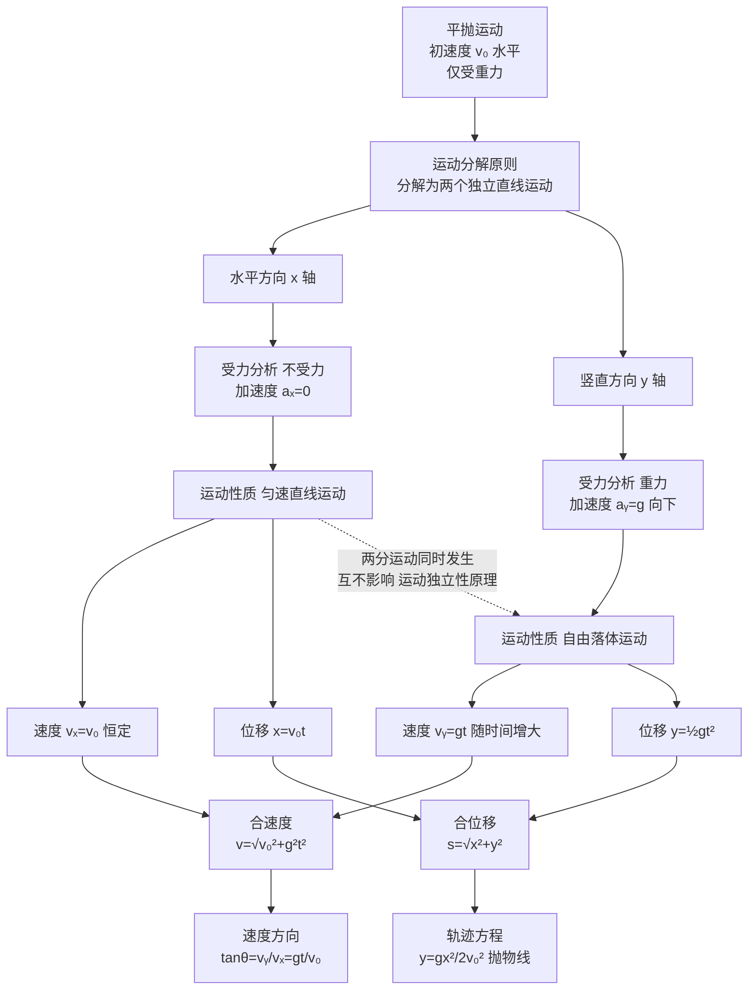

# 平抛运动

> [!abstract] 概览
> 本节是运动学从直线到曲线的==关键跨越==。==平抛运动==指物体以初速度 $v_0$ 水平抛出，仅在重力作用下的运动——它是最基本的匀变速曲线运动。处理方法的核心是==运动的分解==：把平抛运动分解为水平方向的匀速直线运动（$v_x=v_0$）与竖直方向的自由落体运动（$v_y=gt,y=\frac{1}{2}gt^2$），两个分运动独立进行，合成得合运动。本节最重要的推论是==速度方向与位移方向的关系 $\tan\theta=2\tan\alpha$==——速度方向比位移方向"更陡"，这是因为速度是位移的导数。斜面上的平抛、类平抛运动、与电场偏转的类比是延伸应用。平抛运动是 [[03-综合应用与拓展/01-运动的合成与分解]] 的特例，也是 [[01-静电场/05-带电粒子在电场中的运动]] 中"类平抛"的物理基础。

## 核心概念

### 一、平抛运动的定义

**平抛运动**：物体以初速度 $v_0$ 沿==水平方向==抛出，仅在==重力==作用下所做的曲线运动。

**三个核心特征**：
1. 初速度 $v_0$ 水平；
2. 仅受重力（无空气阻力），加速度恒为 $g$ 向下；
3. 轨迹是抛物线（开口向下）。

> [!important] 平抛运动是匀变速曲线运动
> 平抛运动的加速度恒为 $g$（大小方向均不变），故是==匀变速==运动；但加速度方向与速度方向不在同一直线，故是==曲线==运动。这是"匀变速"与"曲线"的首次结合——它揭示了加速度与速度方向不同时的运动图景。

### 二、运动分解原则

**核心思想**：把曲线运动分解为两个==相互独立的直线运动==。

对平抛运动：
- **水平方向**（$x$ 轴）：不受力 $\Rightarrow$ 匀速直线运动，$v_x=v_0$；
- **竖直方向**（$y$ 轴）：受重力 $\Rightarrow$ 自由落体运动，$v_y=gt$。

两个分运动==同时发生、互不影响==——这就是==运动的独立性原理==。

> [!note] 运动的独立性原理
> 物体的实际运动可以看作几个==独立==分运动的合成。一个分运动的进行不影响另一个分运动。这就是"运动的独立性原理"——它是处理一切曲线运动的基础。
>
> 经典演示：从同一高度同时释放一个小球 A（自由落体）和另一个小球 B（水平抛出），二者会同时落地！因为 B 的竖直分运动与 A 完全相同（都是自由落体），水平分运动不影响竖直方向。

### 三、平抛运动规律

**位置坐标**（以抛出点为原点，$x$ 水平向右，$y$ 竖直向下）：
$$
\boxed{\,x = v_0 t\,}
$$
$$
\boxed{\,y = \dfrac{1}{2}g t^2\,}
$$

**轨迹方程**（消去 $t$）：
$$
y = \dfrac{g}{2v_0^2}\,x^2
$$
即抛物线，开口向下（$y$ 轴向下时开口形状为"碗"），形状由 $v_0$ 决定——$v_0$ 越大抛物线越"扁"。

**速度分量**：
$$
v_x = v_0,\quad v_y = gt
$$

**合速度**：
$$
v = \sqrt{v_x^2 + v_y^2} = \sqrt{v_0^2 + g^2 t^2}
$$

**速度方向**（与水平方向夹角 $\theta$）：
$$
\tan\theta = \dfrac{v_y}{v_x} = \dfrac{gt}{v_0}
$$

**合位移**：
$$
s = \sqrt{x^2 + y^2} = \sqrt{(v_0 t)^2 + \left(\dfrac{1}{2}gt^2\right)^2}
$$

**位移方向**（与水平方向夹角 $\alpha$）：
$$
\tan\alpha = \dfrac{y}{x} = \dfrac{gt}{2v_0}
$$

### 四、速度方向与位移方向关系（$\tan\theta = 2\tan\alpha$）— 本节核心

> [!important] 速度方向比位移方向"更陡"
> 比较速度方向角 $\theta$ 与位移方向角 $\alpha$：
> $$
> \tan\theta = \dfrac{gt}{v_0},\quad \tan\alpha = \dfrac{gt}{2v_0}
> $$
> 故
> $$
> \boxed{\,\tan\theta = 2\tan\alpha\,}
> $$
> ==速度方向与水平方向的夹角 $\theta$，总是位移方向与水平方向夹角 $\alpha$ 的"两倍正切"==。

**物理含义**：在抛物线轨迹上任意一点，速度方向（切线方向）比位移方向（从原点到该点的连线）==更陡==。这是因为速度是位移的导数——抛物线 $y\propto x^2$ 的切线斜率 $dy/dx\propto x$，而割线斜率 $y/x\propto x$，二者比恰为 $2$。

> [!tip] 几何图景
> 把速度方向反向延长，与 $x$ 轴的交点恰为水平位移的==中点==（$x/2$ 处）。这与 [[01-静电场/05-带电粒子在电场中的运动]] 中"中点等效"性质完全一致——本质都是抛物线的切线性质。

### 五、斜面上的平抛运动

**模型**：物体从斜面顶端水平抛出，落到斜面上。

**关键条件**：落到斜面时，位移方向沿斜面，即位移方向角 $\alpha$ 等于斜面倾角。

设斜面倾角为 $\beta$，则落到斜面时：
$$
\tan\beta = \tan\alpha = \dfrac{y}{x} = \dfrac{gt}{2v_0}
$$
由此可解得落到斜面的时间 $t=\dfrac{2v_0\tan\beta}{g}$。

进一步可求：
- 落到斜面时的速度方向角 $\theta$：$\tan\theta=2\tan\beta$（由 $\tan\theta=2\tan\alpha$）；
- 落点距抛出点的距离 $L$：$L=\dfrac{x}{\cos\beta}=\dfrac{v_0 t}{\cos\beta}=\dfrac{2v_0^2\tan\beta}{g\cos\beta}$。

> [!note] "落到斜面" vs "落到地面"
> - 落到地面：$y=h$（$h$ 为高度）已知，由 $y=\frac{1}{2}gt^2$ 求 $t$；
> - 落到斜面：$\tan\alpha=\tan\beta$（位移方向沿斜面）已知，由 $\tan\alpha=gt/(2v_0)$ 求 $t$。
>
> 二者判别条件不同，是高考常考的对比点。

### 六、类平抛运动（一般恒力作用）

**类平抛运动**：物体受==恒定合外力==作用，且初速度方向与合外力方向==垂直==，所做的曲线运动。

**与平抛运动的对应**：
- 重力 $mg$ $\Rightarrow$ 一般恒力 $F$；
- 重力加速度 $g$ $\Rightarrow$ 加速度 $a=F/m$；
- 水平方向匀速 $v_0$ $\Rightarrow$ 垂直力方向匀速 $v_0$；
- 竖直方向 $\frac{1}{2}gt^2$ $\Rightarrow$ 力方向 $\frac{1}{2}at^2$。

**所有平抛公式可直接代换**：
$$
x = v_0 t,\quad y = \dfrac{1}{2}a t^2,\quad \tan\theta = \dfrac{at}{v_0},\quad \tan\theta = 2\tan\alpha
$$

> [!example] 类平抛的典型情境
> - 带电粒子垂直射入匀强电场（电场力恒定，初速垂直电场）——详见 [[01-静电场/05-带电粒子在电场中的运动]]；
> - 物体在光滑斜面上以水平初速运动（重力沿斜面分量 $g\sin\theta$ 恒定，垂直于初速）；
> - 带电液滴在正交电磁场中运动（特定条件下合力恒定）。

### 七、平抛与电场偏转类比

| 比较项 | 重力场中平抛 | 匀强电场中类平抛 |
| --- | --- | --- |
| 受力 | 重力 $mg$ | 电场力 $qE$ |
| 加速度 | $g$ | $a=qE/m$ |
| 初速方向 | 水平 | 垂直场强 |
| 力方向 | 竖直向下 | 沿场强方向 |
| 轨迹 | 抛物线 | 抛物线 |
| 速度方向角 | $\tan\theta=gt/v_0$ | $\tan\theta=at/v_0=qEt/(mv_0)$ |
| 位移方向角 | $\tan\alpha=gt/(2v_0)$ | $\tan\alpha=at/(2v_0)$ |
| 关系 | $\tan\theta=2\tan\alpha$ | $\tan\theta=2\tan\alpha$ |

> [!important] 模型迁移的力量
> ==重力场就是"特殊的匀强电场"==——对带电粒子而言，$mg$ 类比 $qE$，$g$ 类比 $qE/m$。一旦建立这个对应，平抛运动所有规律可"翻译"为类平抛规律。这是高中物理"模型迁移"的典范，也是 [[01-静电场/05-带电粒子在电场中的运动]] 的物理基础。

## 推导与原理

### 一、$\tan\theta = 2\tan\alpha$ 的严格推导

设平抛运动某时刻位置 $(x,y)$，速度 $(v_x,v_y)$。

**位移方向角 $\alpha$**（位移向量与水平方向夹角）：
$$
\tan\alpha = \dfrac{y}{x} = \dfrac{\frac{1}{2}gt^2}{v_0 t} = \dfrac{gt}{2v_0}
$$

**速度方向角 $\theta$**（速度向量与水平方向夹角）：
$$
\tan\theta = \dfrac{v_y}{v_x} = \dfrac{gt}{v_0}
$$

二者比较：
$$
\boxed{\,\tan\theta = \dfrac{gt}{v_0} = 2\cdot\dfrac{gt}{2v_0} = 2\tan\alpha\,}
$$

**几何解释**：抛物线 $y=kx^2$（$k=g/(2v_0^2)$）上一点 $(x_0,y_0)$ 的切线斜率 $dy/dx=2kx_0$，而该点与原点连线的斜率 $y_0/x_0=kx_0$，二者之比恰为 $2$。这就是"$\tan\theta=2\tan\alpha$"的几何根源。

### 二、平抛运动公式的推导

**水平方向**：不受力，由牛顿第一定律（[[05-牛顿第一定律]]）保持匀速：
$$
x=v_0 t,\quad v_x=v_0
$$

**竖直方向**：受重力 $mg$，由 [[06-牛顿第二定律]] $mg=ma\Rightarrow a=g$，做自由落体：
$$
y=\dfrac{1}{2}g t^2,\quad v_y=gt
$$

**合速度与合位移**：用矢量合成（平行四边形定则）：
$$
v=\sqrt{v_x^2+v_y^2}=\sqrt{v_0^2+g^2t^2}
$$
$$
s=\sqrt{x^2+y^2}=\sqrt{(v_0 t)^2+\left(\dfrac{1}{2}gt^2\right)^2}
$$

### 三、落到斜面时间的推导

设斜面倾角 $\beta$，物体从斜面顶端水平抛出。落到斜面时位移方向沿斜面：
$$
\tan\beta = \dfrac{y}{x} = \dfrac{\frac{1}{2}gt^2}{v_0 t} = \dfrac{gt}{2v_0}
$$
解得：
$$
\boxed{\,t = \dfrac{2v_0\tan\beta}{g}\,}
$$

进一步，落到斜面时速度方向角 $\theta$：
$$
\tan\theta = \dfrac{gt}{v_0} = \dfrac{g}{v_0}\cdot\dfrac{2v_0\tan\beta}{g} = 2\tan\beta
$$
即落到斜面时速度方向与水平方向夹角的正切 == 斜面倾角正切的 $2$ 倍。

## 典型实例与类比

### 实例 1：飞机投弹

飞机以 $v_0=200\,\text{m/s}$ 在 $h=500\,\text{m}$ 高度水平飞行投弹。求：
- 炸弹落地时间 $t=\sqrt{2h/g}=\sqrt{100}\approx 10\,\text{s}$；
- 水平射程 $x=v_0 t=200\times 10=2000\,\text{m}$；
- 落地速度 $v=\sqrt{v_0^2+g^2t^2}=\sqrt{40000+9800}\approx 223\,\text{m/s}$。

> [!tip] 飞行员视角
> 飞行员看到炸弹"竖直下落"——因为飞行员与炸弹有相同的水平速度（相对静止），只看到竖直方向的自由落体。但地面观察者看到炸弹做平抛运动——这就是参考系不同导致的运动描述差异。

### 类比 1：平抛 ↔ 正交分解

平抛运动的分解方法与力的正交分解（[[03-力的合成与分解]]）完全平行：
- 力的正交分解：把合力分解为两个垂直方向的分力，分别作用；
- 运动的正交分解：把合运动分解为两个垂直方向的分运动，分别独立进行。

二者都是"==化复杂为简单=="的思想——把不易直接处理的矢量问题分解为两个一维问题。

### 类比 2：平抛运动 ↔ 抛体运动族

平抛是抛体运动的特例（初速水平）：
- $v_0$ 水平 $\Rightarrow$ 平抛；
- $v_0$ 斜向上 $\Rightarrow$ 斜抛（详见 [[02-抛体运动综合]]）；
- $v_0$ 竖直向上 $\Rightarrow$ 竖直上抛（[[03-自由落体与竖直上抛]]）；
- $v_0$ 竖直向下 $\Rightarrow$ 竖直下抛；
- $v_0=0$ $\Rightarrow$ 自由落体。

所有抛体运动都是==加速度恒为 $g$ 的匀变速运动==，差别仅在初速度方向。

> [!tip] 记忆口诀
> ==水平匀速竖直落，两个分运动独立做；速度方向切线斜，位移方向割线连；$\tan\theta$ 是 $\tan\alpha$ 两倍整，速度方向更陡峭；落到斜面方向判，位移方向沿斜面。==

## 例题

### 例 1：基础——平抛基本计算

**题目**：从 $h=20\,\text{m}$ 高处以 $v_0=10\,\text{m/s}$ 水平抛出一物体（$g=10\,\text{m/s}^2$）。求：
（1）物体落地时间；
（2）物体落地时的水平射程；
（3）物体落地时的速度大小与方向；
（4）物体的位移大小与方向。

**分析**：平抛运动分解为水平匀速 + 竖直自由落体。落地时间由竖直方向决定（高度已知）；射程由水平方向乘时间；速度由两分量合成。

**解答**：
（1）$h=\frac{1}{2}gt^2\Rightarrow 20=5t^2\Rightarrow t=2\,\text{s}$。

（2）$x=v_0 t=10\times 2=20\,\text{m}$。

（3）$v_x=v_0=10\,\text{m/s}$，$v_y=gt=20\,\text{m/s}$。
- 速度大小 $v=\sqrt{v_x^2+v_y^2}=\sqrt{100+400}\approx 22.4\,\text{m/s}$；
- 方向角 $\tan\theta=v_y/v_x=2$，$\theta\approx 63.4^\circ$（与水平方向夹角，向下）。

（4）位移大小 $s=\sqrt{x^2+y^2}=\sqrt{400+400}\approx 28.3\,\text{m}$；位移方向角 $\tan\alpha=y/x=20/20=1$，$\alpha=45^\circ$。

**验证**：$\tan\theta=2$，$\tan\alpha=1$，确实 $\tan\theta=2\tan\alpha$。✓

**点评**：本题为平抛运动的标准计算，重点验证==速度方向与位移方向的关系 $\tan\theta=2\tan\alpha$==。这一关系在抛物线任意点都成立，是平抛运动的标志性结论。

### 例 2：中难——落到斜面

**题目**：如图，倾角 $\beta=30^\circ$ 的斜面顶端 $A$，物体以 $v_0=10\,\text{m/s}$ 水平抛出，落到斜面上 $B$ 点（$g=10\,\text{m/s}^2$）。求：
（1）物体从 $A$ 到 $B$ 的运动时间；
（2）$AB$ 间的距离；
（3）物体落到 $B$ 点时的速度方向。

**分析**：落到斜面的条件——位移方向沿斜面，即 $\tan\alpha=\tan\beta$。

**解答**：
（1）$\tan\beta=\tan\alpha=\dfrac{gt}{2v_0}\Rightarrow \tan 30^\circ=\dfrac{10t}{20}=\dfrac{t}{2}$
$$
\dfrac{\sqrt{3}}{3}=\dfrac{t}{2}\Rightarrow t=\dfrac{2\sqrt{3}}{3}\,\text{s}\approx 1.15\,\text{s}
$$

（2）水平位移 $x=v_0 t=10\times\dfrac{2\sqrt{3}}{3}=\dfrac{20\sqrt{3}}{3}\,\text{m}$。
$AB$ 距离 $L=\dfrac{x}{\cos\beta}=\dfrac{20\sqrt{3}/3}{\cos 30^\circ}=\dfrac{20\sqrt{3}/3}{\sqrt{3}/2}=\dfrac{40}{3}\,\text{m}\approx 13.3\,\text{m}$。

（3）落到 $B$ 时速度方向角 $\theta$：
$$
\tan\theta=2\tan\alpha=2\tan 30^\circ=\dfrac{2\sqrt{3}}{3}\approx 1.155
$$
$\theta\approx 49.1^\circ$（与水平方向夹角，向下）。

**点评**：落到斜面问题的核心条件是==位移方向角等于斜面倾角==，由此可求时间。再由 $\tan\theta=2\tan\alpha$ 直接得速度方向角，无需重算 $v_y/v_x$。这是 $\tan\theta=2\tan\alpha$ 关系的典型应用。

### 例 3：进阶——类平抛运动

**题目**：质量 $m=1\,\text{kg}$ 的物体静止在光滑水平面上，从 $t=0$ 时刻起受水平恒力 $F_1=3\,\text{N}$（沿 $x$ 轴正方向）和竖直恒力 $F_2=4\,\text{N}$（沿 $y$ 轴正方向）作用。求：
（1）物体 $t=2\,\text{s}$ 时的位置坐标；
（2）物体 $t=2\,\text{s}$ 时的速度大小与方向；
（3）物体的轨迹方程。

**分析**：两力都是恒力，互相垂直。物体从静止出发，沿合力方向做匀加速直线运动——这看似类平抛但==初速度为零==，不是类平抛。需修正为：物体先在某方向有初速度，再受垂直恒力才构成类平抛。本题实为匀加速直线运动。

重新解读：若题目改为"物体以初速度 $v_0=2\,\text{m/s}$ 沿 $x$ 轴运动，$t=0$ 起受 $F_2=4\,\text{N}$ 竖直力作用"，则：
- $x$ 方向：匀速 $v_0=2\,\text{m/s}$，$x=v_0 t$；
- $y$ 方向：匀加速 $a=F_2/m=4\,\text{m/s}^2$，$y=\frac{1}{2}at^2=2t^2$。

**解答**（按修正后题意）：
（1）$t=2\,\text{s}$ 时：
- $x=v_0 t=2\times 2=4\,\text{m}$；
- $y=2t^2=8\,\text{m}$；
- 位置 $(4,8)$。

（2）$v_x=v_0=2\,\text{m/s}$，$v_y=at=4\times 2=8\,\text{m/s}$。
- 速度大小 $v=\sqrt{4+64}=\sqrt{68}\approx 8.25\,\text{m/s}$；
- 方向角 $\tan\theta=v_y/v_x=4$，$\theta\approx 76^\circ$。

（3）轨迹方程：由 $x=v_0 t$ 得 $t=x/v_0$，代入 $y=\frac{1}{2}a t^2$：
$$
y = \dfrac{a}{2v_0^2}\,x^2 = \dfrac{4}{2\times 4}\,x^2 = \dfrac{x^2}{2}
$$
抛物线，与平抛运动 $y=\dfrac{g}{2v_0^2}x^2$ 形式一致。

**点评**：类平抛运动的关键是==识别"恒力垂直于初速度"==。一旦识别，所有平抛公式直接代换（$g\to a$）。本题展示"模型迁移"——重力场平抛的规律在一般恒力场中同样成立。这就是为什么 [[01-静电场/05-带电粒子在电场中的运动]] 中带电粒子在匀强电场中的偏转与平抛运动公式完全平行。

## 易错提醒

> [!warning] 易错点
> 1. **速度方向 vs 位移方向**：$\tan\theta=2\tan\alpha$，速度方向比位移方向更陡——切勿混用。
> 2. **落到斜面 vs 落到地面**：落到地面用 $y=h$ 判别；落到斜面用 $\tan\alpha=\tan\beta$ 判别——条件不同。
> 3. **平抛初速必须水平**：若初速度斜向上则不是平抛而是斜抛；初速度竖直向下则是下抛。
> 4. **类平抛的条件**：必须==恒力==且==初速垂直于恒力==，二者缺一不可。变力或初速不垂直均不能套用平抛公式。
> 5. **分运动独立性**：水平分运动不影响竖直分运动。两球同时抛出（一平抛一自由落体）会同时落地——这是分运动独立性的体现。
> 6. **角度方向**：速度方向角 $\theta$ 与位移方向角 $\alpha$ 都是与==水平方向==的夹角（不是与竖直方向）。

> [!note] 概念辨析
> **平抛 vs 斜抛 vs 自由落体**
> 
> | 运动 | 初速度 | 加速度 | 轨迹 |
> | --- | --- | --- | --- |
> | 自由落体 | $v_0=0$ | $g$ | 直线 |
> | 平抛 | $v_0$ 水平 | $g$ | 抛物线 |
> | 斜抛 | $v_0$ 斜向 | $g$ | 抛物线 |
> | 竖直上抛 | $v_0$ 竖直向上 | $-g$ | 直线 |
>
> **平抛 vs 类平抛**
> 
> | 比较 | 平抛 | 类平抛 |
> | --- | --- | --- |
> | 受力 | 重力 $mg$ | 一般恒力 $F$ |
> | 加速度 | $g$ | $a=F/m$ |
> | 公式 | $y=\frac{1}{2}gt^2$ | $y=\frac{1}{2}at^2$ |
> | 关系 | $\tan\theta=2\tan\alpha$ | $\tan\theta=2\tan\alpha$ |

## 与其他知识关联

- 与 [[01-描述运动的基本物理量]] 的关系：平抛运动是"加速度方向 ≠ 速度方向"的最佳例证，体现加速度矢量性。
- 与 [[02-匀变速直线运动]] 的关系：平抛运动的两个分运动都遵循匀变速直线运动公式——水平是 $a=0$ 的特例，竖直是 $v_0=0,a=g$ 的自由落体。
- 与 [[03-自由落体与竖直上抛]] 的关系：平抛运动的竖直分运动就是自由落体；这是运动分解的具体应用。
- 与 [[04-运动图像]] 的关系：平抛运动的 $v_y$-$t$ 图是过原点的直线（斜率 $g$），$v_x$-$t$ 图是水平线（匀速）。
- 与 [[03-综合应用与拓展/01-运动的合成与分解]] 的关系：平抛运动是运动合成分解的典型范例，建立了"曲线 $\to$ 两直线"的处理范式。
- 与电学 [[01-静电场/05-带电粒子在电场中的运动]] 的关系：带电粒子垂直射入匀强电场的偏转就是类平抛运动——所有平抛公式直接迁移，是力学方法在电学中的典型应用。
- 高中—大学衔接：[[牛顿力学]] 中平抛运动由 $m\ddot{x}=0,m\ddot{y}=mg$ 解出；[[机械振动]] 中抛物线轨迹与简谐运动分别对应恒力与变力（回复力）的情形。

## 作者的话

> [!quote] 个人理解
> 平抛运动是高中物理"==化曲为直=="思想的最佳载体。曲线运动看起来复杂，但只要分解为两个独立的直线运动，就回到熟悉的匀变速直线运动——这种"分解—独立处理—合成"的三步法，是处理一切曲线运动的通用方法。后续学 [[07-圆周运动]] 时，分解思想依然适用（虽然圆周运动需要用极坐标或自然坐标分解）；学 [[03-综合应用与拓展/01-运动的合成与分解]] 时，分解方法将推广到小船渡河、绳子末端速度等更复杂情境。
>
> 我特别想强调 $\tan\theta=2\tan\alpha$ 这一关系的物理之美。它不只是"巧合"，而是抛物线 $y=kx^2$ 的内在几何性质——切线斜率（速度方向）恰是割线斜率（位移方向）的两倍。这种"导数与原函数"的关系，在数学上源于 $d(x^2)/dx=2x$，在物理上体现为"速度是位移的导数"。学到这里，建议读者去体会"物理规律与数学结构的同构性"——这是物理学最深层的优雅。
>
> 类平抛运动的推广则展示了==模型迁移==的力量。重力场只是一个特殊的恒力场——只要把 $g$ 换成 $a=F/m$，平抛运动的所有规律都适用于一般恒力场中的类平抛。这种"从一个具体模型推广到一类模型"的思维方式，是物理学家的核心能力。学 [[01-静电场/05-带电粒子在电场中的运动]] 时，读者会发现带电粒子在匀强电场中的偏转与平抛运动公式一模一样——这不是巧合，而是"恒力场中垂直初速运动"的普适规律。
>
> 学习建议：把"==分解—独立处理—合成=="三步法练熟。第一步：识别恒力方向与初速度方向，建立坐标系；第二步：两个方向分别用匀变速公式；第三步：用矢量合成求合速度、合位移。这三步走完，平抛与类平抛问题就解决了。再记住 $\tan\theta=2\tan\alpha$ 这一"招牌关系"，许多选择题可秒解。

---
*返回 [[00-力学总览]]*
