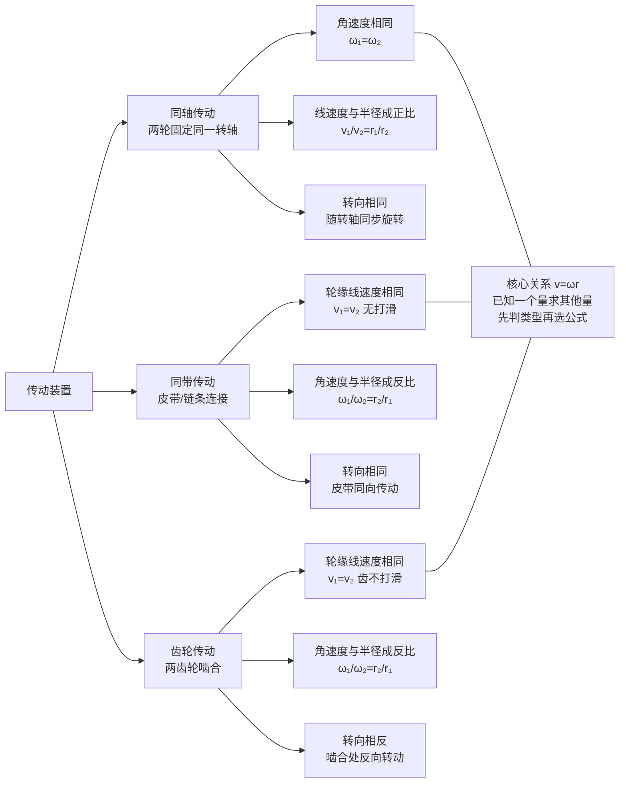

# 圆周运动

> [!abstract] 概览
> 本节是运动学版块的最后一篇，把研究范围从直线运动推广到==曲线运动==的另一种典型——圆周运动。圆周运动的特征是物体沿圆形轨道运动，需要引入一组新的物理量：==线速度 $v$==、==角速度 $\omega$==、==周期 $T$==、==频率 $f$==、==转速 $n$==。它们之间的相互关系（$v=\omega r=2\pi r/T$、$f=1/T$）是基础工具。==匀速圆周运动==指速率不变（方向时刻变）的圆周运动，其加速度始终指向圆心，称为==向心加速度== $a_n=v^2/r=\omega^2 r$。传动装置中"==同轴同 $\omega$、同带同 $v$=="是判别两轮物理量关系的关键法则。本节是 [[03-综合应用与拓展/03-圆周运动动力学]] 的运动学基础，也是电学 [[03-磁场/04-带电粒子在磁场中的运动]] 中带电粒子做圆周运动的物理基础。

## 核心概念

### 一、圆周运动基本物理量

**线速度 $v$**：质点通过的弧长 $\Delta s$ 与所用时间 $\Delta t$ 之比。
$$
v = \dfrac{\Delta s}{\Delta t}
$$
- 单位：$\text{m/s}$；
- 方向：沿圆周切线方向（时刻在变）；
- 物理意义：描述质点沿圆周运动的快慢。

**角速度 $\omega$**：质点转过的角度 $\Delta\theta$ 与所用时间 $\Delta t$ 之比。
$$
\omega = \dfrac{\Delta\theta}{\Delta t}
$$
- 单位：$\text{rad/s}$（弧度每秒）；
- 方向：高中阶段不要求，按右手定则判断（沿转轴）；
- 物理意义：描述质点绕圆心转动的快慢。

> [!note] 角度的弧度制
> 角速度计算必须用==弧度制==，不能用度数。$360^\circ=2\pi\,\text{rad}$，故 $1\,\text{rad}\approx 57.3^\circ$。一周对应 $2\pi$ 弧度，半周 $\pi$，四分之一周 $\pi/2$。

**周期 $T$**：质点运动一周所需要的时间。
- 单位：$\text{s}$；
- 关系：一周转角 $2\pi$，故 $\omega=\dfrac{2\pi}{T}$。

**频率 $f$**：单位时间内质点完成圆周运动的圈数。
$$
f = \dfrac{1}{T}
$$
- 单位：$\text{Hz}$（赫兹），$1\,\text{Hz}=1\,\text{s}^{-1}$；
- 关系：$\omega=2\pi f$。

**转速 $n$**：单位时间转过的转数（工程上常用）。
- 单位：$\text{r/s}$（转每秒）或 $\text{r/min}$（转每分钟）；
- 关系：当 $n$ 以 $\text{r/s}$ 为单位时，$f=n$，$\omega=2\pi n$。

### 二、各物理量之间的相互关系

> [!important] 圆周运动核心关系式
> 设圆周半径为 $r$：
> $$\boxed{\,v = \omega r = \dfrac{2\pi r}{T} = 2\pi r f\,}$$
> $$\boxed{\,\omega = \dfrac{2\pi}{T} = 2\pi f\,}$$
> $$\boxed{\,f = \dfrac{1}{T}\,}$$
>
> 这些关系是圆周运动一切计算的基石，必须熟记。

**推导**：质点在一周内走过弧长 $2\pi r$，转角 $2\pi$，用时 $T$。故
- $v=\dfrac{2\pi r}{T}$（线速度定义）；
- $\omega=\dfrac{2\pi}{T}$（角速度定义）；
- 二者相比 $v/\omega=r$，即 $v=\omega r$。

### 三、向心加速度

**向心加速度 $a_n$**：描述线速度==方向变化快慢==的物理量，方向始终==指向圆心==。

$$
\boxed{\,a_n = \dfrac{v^2}{r} = \omega^2 r = \dfrac{4\pi^2 r}{T^2} = 4\pi^2 f^2 r\,}
$$

- 单位：$\text{m/s}^2$；
- 方向：始终指向圆心，时刻在变（与速度方向始终垂直）；
- 物理意义：只改变速度方向，不改变速度大小。

> [!important] 向心加速度的方向
> ==向心加速度方向始终指向圆心==，与线速度方向（切线）始终垂直。这就是为什么匀速圆周运动的速率不变——加速度不做功（$W=Fx\cos 90^\circ=0$），不改变动能，只改变速度方向。
>
> 这是 [[01-描述运动的基本物理量]] 中"加速度方向 ≠ 速度方向"的典型实例——加速度与速度始终垂直，只改变方向不改变大小。

### 四、匀速圆周运动

**匀速圆周运动**：线速度大小不变的圆周运动。

**特征**：
1. ==速率不变==（"匀速"指速率恒定）；
2. 速度方向时刻变化（沿切线）；
3. 加速度大小恒定（$v^2/r$），方向时刻变化（始终指向圆心）；
4. 角速度、周期、频率均恒定。

> [!warning] "匀速"二字的误导
> "匀速圆周运动"中的"匀速"指==速率不变==（标量），不是速度不变（矢量）。速度方向时刻在变，故存在加速度（向心加速度）。这是==变速运动==（速度矢量在变），不是匀速运动。"匀速圆周运动"这一名称容易让初学者误以为"没有加速度"，务必警惕。

### 五、传动装置（关键）

**模型**：通过皮带、齿轮、链条等连接两个轮子，一个轮子的转动带动另一个轮子转动。

**两大判别法则**：

> [!important] 同轴同 $\omega$，同带同 $v$
> 1. **同轴传动**（两轮固定在同一转轴上）：两轮==角速度相同== $\omega_1=\omega_2$，故 $v_1/v_2=r_1/r_2$（线速度与半径成正比）。
> 2. **同带（同链）传动**（两轮用皮带/链条连接，无打滑）：两轮==轮缘线速度相同== $v_1=v_2$，故 $\omega_1/\omega_2=r_2/r_1$（角速度与半径成反比）。

**齿轮传动**：两齿轮啮合，轮缘线速度相同（齿不打滑）$v_1=v_2$。但两轮转向==相反==——这是齿轮与皮带传动的区别。

> [!tip] 传动装置判别三步
> 1. 识别两轮是同轴还是同带（或啮合）；
> 2. 同轴 $\Rightarrow \omega$ 相同；同带 $\Rightarrow v$ 相同；
> 3. 用 $v=\omega r$ 求其他量。

### 六、一般圆周运动（变速圆周运动）

若线速度大小也在变化（如竖直平面内的圆周运动），则加速度可分解为：
- **向心加速度 $a_n$**：指向圆心，改变速度方向，$a_n=v^2/r$；
- **切向加速度 $a_t$**：沿切线方向，改变速度大小，$a_t=dv/dt$。

合加速度 $\vec{a}=\vec{a}_n+\vec{a}_t$，方向不指向圆心。

> [!note] 匀速 vs 变速圆周运动
>
> | 比较 | 匀速圆周运动 | 变速圆周运动 |
> | --- | --- | --- |
> | 速率 | 恒定 | 变化 |
> | 向心加速度 $a_n$ | $v^2/r$（恒定） | $v^2/r$（$v$ 变则 $a_n$ 变） |
> | 切向加速度 $a_t$ | $0$ | $\ne 0$ |
> | 合加速度方向 | 指向圆心 | 不指向圆心 |
> | 典型例子 | 匀速转动的风扇 | 竖直平面内的圆周运动（最高点最慢，最低点最快） |

## 推导与原理

### 一、向心加速度的推导（极限法）

设质点做匀速圆周运动，半径 $r$，线速度 $v$。在 $\Delta t$ 时间内质点从 $A$ 点运动到 $B$ 点，转过角度 $\Delta\theta$。

**速度变化量**：$A$ 点速度 $\vec{v}_A$ 与 $B$ 点速度 $\vec{v}_B$ 大小均为 $v$，方向沿切线。把 $\vec{v}_B$ 平移使起点与 $\vec{v}_A$ 重合，二者夹角为 $\Delta\theta$（圆周角等于对应圆心角）。速度变化量 $\Delta\vec{v}=\vec{v}_B-\vec{v}_A$。

当 $\Delta\theta$ 很小时，$|\Delta\vec{v}|\approx v\Delta\theta$（弧长近似）。又 $\Delta\theta=v\Delta t/r$（弧长 $r\Delta\theta=v\Delta t$）。

故
$$
a_n = \lim_{\Delta t\to 0}\dfrac{|\Delta\vec{v}|}{\Delta t} = \lim_{\Delta t\to 0}\dfrac{v\Delta\theta}{\Delta t} = \lim_{\Delta t\to 0}\dfrac{v\cdot\dfrac{v\Delta t}{r}}{\Delta t} = \dfrac{v^2}{r}
$$

**方向**：当 $\Delta t\to 0$，$B\to A$，$\Delta\vec{v}$ 方向指向圆心。故==向心加速度方向指向圆心==。

> [!important] 极限法的威力
> 这一推导是==极限思想==在高中物理的又一次精彩应用（首次见 [[01-描述运动的基本物理量]] 瞬时速度）。把"曲线运动的加速度"这一看似困难的问题，通过"取无限小时间间隔"化为"匀速圆弧上的几何关系"，再取极限得到精确结果。这种"以直代曲、取极限"的思想是微积分的灵魂。

### 二、$v=\omega r$ 的推导

设质点在 $\Delta t$ 内转过角度 $\Delta\theta$，走过弧长 $\Delta s=r\Delta\theta$（弧度制下弧长公式）。

由线速度定义 $v=\Delta s/\Delta t=r\Delta\theta/\Delta t=r\omega$。

### 三、传动关系的推导

**同轴传动**：两轮固定在同一轴上，必然==同时转过相同角度==——故 $\omega_1=\omega_2$。由 $v=\omega r$ 得 $v_1/v_2=r_1/r_2$。

**同带传动**：皮带不打滑，==皮带与两轮轮缘接触点的线速度相同==——故 $v_1=v_2$。由 $\omega=v/r$ 得 $\omega_1/\omega_2=r_2/r_1$。

## 典型实例与类比

### 实例 1：钟表指针

- 秒针周期 $T_1=60\,\text{s}$，角速度 $\omega_1=2\pi/60\approx 0.105\,\text{rad/s}$；
- 分针周期 $T_2=3600\,\text{s}$，$\omega_2\approx 0.00175\,\text{rad/s}$；
- 时针周期 $T_3=43200\,\text{s}$，$\omega_3\approx 0.000145\,\text{rad/s}$。

三者角速度比 $\omega_1:\omega_2:\omega_3=720:12:1$。

### 实例 2：自行车链条传动

自行车后轮与飞轮同轴（$\omega_{后轮}=\omega_{飞轮}$），链条连接飞轮与牙盘（$v_{飞轮}=v_{牙盘}$）。蹬踏使牙盘转动，经链条带动飞轮，飞轮带动后轮。

设牙盘齿数 $Z_1$、飞轮齿数 $Z_2$，则 $v=\omega_1 R_1=\omega_2 R_2$（$R$ 为轮半径，正比于齿数）。故
$$
\dfrac{\omega_{飞轮}}{\omega_{牙盘}} = \dfrac{R_1}{R_2} = \dfrac{Z_1}{Z_2}
$$
==牙盘越大、飞轮越小，传动比越大==，同样蹬踏频率下后轮转得越快——这就是变速自行车的原理。

### 类比 1：圆周运动 ↔ 直线运动的"翻译"

| 直线运动 | 圆周运动 |
| --- | --- |
| 位移 $x$ | 角位移 $\theta$ |
| 速度 $v=dx/dt$ | 角速度 $\omega=d\theta/dt$ |
| 加速度 $a=dv/dt$ | 角加速度 $\alpha=d\omega/dt$ |
| $v=v_0+at$ | $\omega=\omega_0+\alpha t$ |
| $x=v_0 t+\frac{1}{2}at^2$ | $\theta=\omega_0 t+\frac{1}{2}\alpha t^2$ |

匀变速直线运动与匀变速转动公式完全平行——这是物理学"平动与转动对称性"的体现。

### 类比 2：向心力 ↔ "拉住"的绳

匀速圆周运动需要持续的向心力。用绳拴住小球做圆周运动，绳的拉力提供向心力 $F_n=mv^2/r$。一旦绳断（向心力消失），小球沿切线飞出——这就是==离心现象==（详见 [[03-综合应用与拓展/03-圆周运动动力学]]）。

> [!tip] 记忆口诀
> ==线速角速周期频，$v=\omega r$ 是核心；同轴同 $\omega$ 同带同 $v$，向心 $v^2/r$ 指圆心；匀速圆周变方向，速率不变有加速度。==

## 例题

### 例 1：基础——传动装置

**题目**：如图，$A$、$B$ 两轮同轴固定，$A$ 轮半径 $r_A=10\,\text{cm}$，$B$ 轮半径 $r_B=20\,\text{cm}$。$B$ 轮通过皮带与 $C$ 轮连接（不打滑），$C$ 轮半径 $r_C=30\,\text{cm}$。若 $A$ 轮角速度 $\omega_A=6\,\text{rad/s}$，求：
（1）$B$ 轮角速度 $\omega_B$；
（2）$C$ 轮角速度 $\omega_C$；
（3）$A$、$C$ 两轮轮缘线速度之比 $v_A:v_C$。

**分析**：
- $A$、$B$ 同轴 $\Rightarrow \omega_A=\omega_B$；
- $B$、$C$ 同带 $\Rightarrow v_B=v_C$，由 $\omega=v/r$ 求 $\omega_C$。

**解答**：
（1）$A$、$B$ 同轴：$\omega_B=\omega_A=6\,\text{rad/s}$。

（2）$v_B=\omega_B r_B=6\times 0.2=1.2\,\text{m/s}$。$B$、$C$ 同带：$v_C=v_B=1.2\,\text{m/s}$。
$$
\omega_C = \dfrac{v_C}{r_C} = \dfrac{1.2}{0.3} = 4\,\text{rad/s}
$$

（3）$v_A=\omega_A r_A=6\times 0.1=0.6\,\text{m/s}$，$v_C=1.2\,\text{m/s}$。
$$
v_A:v_C = 0.6:1.2 = 1:2
$$

**点评**：本题是传动装置的典型题——==先判同轴/同带，再用 $v=\omega r$ 求未知量==。同轴 $\omega$ 相同，同带 $v$ 相同，这两条法则是判别的"金钥匙"。

### 例 2：中难——钟表指针的圆周运动

**题目**：钟表三针（时针、分针、秒针）长度分别为 $r_1=2\,\text{cm}$、$r_2=3\,\text{cm}$、$r_3=4\,\text{cm}$。求：
（1）三针尖端的线速度之比 $v_1:v_2:v_3$；
（2）三针尖端的向心加速度之比 $a_1:a_2:a_3$。

**分析**：三针周期分别为 $T_1=12\,\text{h}=43200\,\text{s}$、$T_2=1\,\text{h}=3600\,\text{s}$、$T_3=1\,\text{min}=60\,\text{s}$。角速度 $\omega=2\pi/T$。

**解答**：
（1）$v=\omega r=\dfrac{2\pi r}{T}$，故
$$
v_1:v_2:v_3 = \dfrac{r_1}{T_1}:\dfrac{r_2}{T_2}:\dfrac{r_3}{T_3} = \dfrac{2}{43200}:\dfrac{3}{3600}:\dfrac{4}{60}
$$
通分（乘以 $43200$）：
$$
= 2 : 36 : 2880 = 1 : 18 : 1440
$$

（2）$a_n=\omega^2 r=\dfrac{4\pi^2 r}{T^2}$，故
$$
a_1:a_2:a_3 = \dfrac{r_1}{T_1^2}:\dfrac{r_2}{T_2^2}:\dfrac{r_3}{T_3^2} = \dfrac{2}{43200^2}:\dfrac{3}{3600^2}:\dfrac{4}{60^2}
$$
通分（乘以 $43200^2/2$，即 $T_1^2/2$）：
$$
= 1 : \dfrac{3\times 43200^2}{2\times 3600^2} : \dfrac{4\times 43200^2}{2\times 60^2}
$$
注意 $43200/3600=12$，$43200/60=720$：
$$
= 1 : \dfrac{3\times 144}{2} : \dfrac{4\times 720^2}{2} = 1 : 216 : 1036800
$$

**点评**：本题训练==圆周运动比例计算==。关键是用 $v=2\pi r/T$、$a_n=4\pi^2 r/T^2$ 把各量表达为 $r,T$ 的函数，再求比例。秒针虽短，但因周期最小，其线速度与向心加速度远大于时针、分针。

### 例 3：进阶——向心加速度方向辨析

**题目**：关于匀速圆周运动，下列说法正确的是（　）。
A. 加速度恒定不变
B. 速度恒定不变
C. 加速度方向与速度方向始终垂直
D. 加速度方向与速度方向始终相同

**分析**：
- A 错：加速度大小恒定（$v^2/r$），但方向时刻在变（始终指向圆心），故加速度==矢量==不恒定；
- B 错：速度大小恒定，但方向时刻在变（沿切线），故速度==矢量==不恒定；
- C 对：加速度指向圆心，速度沿切线，二者始终垂直；
- D 错：若相同则为直线运动，圆周运动加速度与速度始终垂直。

**解答**：选 **C**。

**点评**：本题考查匀速圆周运动的==矢量性==。匀速圆周运动的"匀速"指速率不变（标量），速度（矢量）方向时刻在变。加速度亦然——大小不变方向变。这种"大小恒定方向变"的矢量，在 [[机械振动]] 中简谐运动的回复力也会遇到。

## 易错提醒

> [!warning] 易错点
> 1. **"匀速"误导**：匀速圆周运动是==变速运动==（速度方向变），有加速度（向心加速度）。
> 2. **角速度单位**：必须用 $\text{rad/s}$，不能用度/秒。$1$ 圈 $=2\pi\,\text{rad}$，不是 $360$。
> 3. **转速单位**：$\text{r/min}$ 与 $\text{r/s}$ 差 $60$ 倍，工程题常见陷阱。$\omega=2\pi n$ 仅当 $n$ 用 $\text{r/s}$。
> 4. **同轴 vs 同带**：同轴 $\omega$ 相同；同带 $v$ 相同——切勿混淆。
> 5. **向心加速度方向**：始终==指向圆心==，与速度方向垂直。变速圆周运动中合加速度不指向圆心，但向心分量仍指向圆心。
> 6. **向心加速度公式选择**：$a_n=v^2/r=\omega^2 r$。同轴问题（$\omega$ 相同）用 $a_n=\omega^2 r$（$a_n\propto r$）；同带问题（$v$ 相同）用 $a_n=v^2/r$（$a_n\propto 1/r$）。

> [!note] 概念辨析
> **线速度 vs 角速度**
> 
> | 比较 | 线速度 $v$ | 角速度 $\omega$ |
> | --- | --- | --- |
> | 定义 | 弧长/时间 | 角度/时间 |
> | 单位 | $\text{m/s}$ | $\text{rad/s}$ |
> | 方向 | 沿切线 | 沿转轴（高中不要求） |
> | 与半径关系 | $v=\omega r$（正比于 $r$） | 与 $r$ 无关 |
> | 同轴 | 不同点不同 | 相同 |
> | 同带 | 相同 | 不同点不同 |
>
> **匀速圆周运动 vs 匀速直线运动**
> 
> | 比较 | 匀速直线运动 | 匀速圆周运动 |
> | --- | --- | --- |
> | 速度大小 | 恒定 | 恒定 |
> | 速度方向 | 恒定 | 时刻变化 |
> | 加速度 | $0$ | $a_n=v^2/r$ 指向圆心 |
> | 合外力 | $0$ | $F_n=mv^2/r$ 指向圆心 |

## 与其他知识关联

- 与 [[01-描述运动的基本物理量]] 的关系：圆周运动是"加速度方向 ≠ 速度方向"的典型——加速度指向圆心，速度沿切线，二者始终垂直。
- 与 [[02-匀变速直线运动]] 的关系：圆周运动不是匀变速运动（加速度方向在变），四公式不适用——需用圆周运动专用公式。
- 与 [[06-平抛运动]] 的关系：平抛是恒力下"初速垂直力方向"的运动（轨迹抛物线），圆周是变向力下"初速垂直力方向"的运动（轨迹圆）——二者加速度与速度都垂直，但平抛加速度恒定、圆周加速度方向变。
- 与 [[03-综合应用与拓展/01-运动的合成与分解]] 的关系：圆周运动可分解为两个相互垂直的简谐运动（$x=r\cos\omega t,y=r\sin\omega t$），这是 [[机械振动]] 与圆周运动的桥梁。
- 与 [[03-综合应用与拓展/03-圆周运动动力学]] 的关系：本节是运动学描述，动力学版块将讨论向心力的来源（重力、弹力、摩擦力、电磁力等）。
- 与电学 [[03-磁场/04-带电粒子在磁场中的运动]] 的关系：带电粒子垂直射入匀强磁场做匀速圆周运动，向心力由洛伦兹力提供 $qvB=mv^2/r$，本节公式直接迁移。
- 高中—大学衔接：[[牛顿力学]] 中圆周运动用极坐标描述，向心加速度严格推导需用单位矢量求导；[[机械振动]] 中简谐运动 $x=r\cos\omega t$ 是圆周运动的投影。

## 作者的话

> [!quote] 个人理解
> 圆周运动是高中物理"==变方向运动=="的入门。在此之前，所有运动（匀速、匀变速、自由落体、平抛）的加速度方向要么为零，要么恒定；圆周运动首次出现"加速度方向时刻在变"的情形——这是从"恒定向量"到"变化向量"的认知跨越。
>
> 我特别想强调==向心加速度方向指向圆心==这一性质。它揭示了"加速度与速度垂直时只改变方向不改变大小"这一深刻规律——这正是匀速圆周运动速率不变的根本原因。把这一观念推广，可以理解一切"只改方向不改大小"的运动：带电粒子在磁场中的圆周运动（洛伦兹力始终垂直速度）、人造卫星的椭圆运动（引力始终指向焦点，平均距离不变）等。
>
> 传动装置是本节的"工程应用"环节。==同轴同 $\omega$、同带同 $v$== 这两条法则看似简单，却是分析一切机械传动的基础——从自行车到汽车变速箱，从机械表到风力发电机，都遵循这两条法则。建议读者拆解一辆变速自行车，数一数牙盘和飞轮的齿数，亲手验证传动比的计算。这种"从物理到工程"的视角，是高中物理最有趣的应用之一。
>
> 圆周运动还有一层深刻的物理之美：它可以通过投影分解为两个相互垂直的简谐运动（$x=r\cos\omega t$，$y=r\sin\omega t$）。这就是为什么 [[机械振动]] 中简谐运动与圆周运动有如此紧密的对应——简谐运动是圆周运动在直径上的投影。这一对应关系在大学物理中将发展为"旋转矢量法"，是分析一切周期运动的强大工具。
>
> 学习建议：把"==同轴同 $\omega$、同带同 $v$=="这两条法则练到条件反射。看到传动装置图，先标注哪些轮同轴、哪些轮同带，再用 $v=\omega r$ 求其他量。这是高考选择题的固定题型，掌握法则即可秒解。然后向心加速度公式 $a_n=v^2/r=\omega^2 r$ 要根据情境选形式——同轴问题用 $\omega^2 r$，同带问题用 $v^2/r$——这样比例关系直接出来，避免冗长计算。

---
*返回 [[00-力学总览]]*
