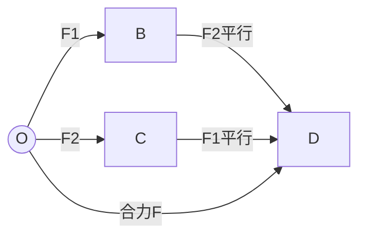

# 力的合成与分解

> [!abstract] 概览
> 本节是力学的"工具箱"——所有受力分析与动力学方程的求解都建立在力的合成与分解之上。核心是==平行四边形定则==（矢量合成的根本法则）：两个共点力的合力是以这两力为邻边的平行四边形的对角线。由此衍生出三角形定则、正交分解法、按效果分解等具体方法。本节重点掌握：合力的矢量性、合力范围公式 $|F_1-F_2|\le F\le F_1+F_2$、正交分解法的操作步骤、按效果分解的"斜面两分解"与"悬挂两分解"模型。正交分解法是后续 [[04-共点力平衡]] 与 [[06-牛顿第二定律]] 的核心工具，必须熟练掌握。

## 核心概念

### 一、力的合成与分解

- **力的合成**：求几个力的==合力==（等效代替几个力的一个力）。
- **力的分解**：求一个力的==分力==（用几个力等效代替一个力）。
- 合成与分解互为逆运算，都遵循==平行四边形定则==。

> [!note] 等效代替思想
> 合力与分力是"==等效=="关系，不是"真实"与"虚假"的关系。一个力可以被多个分力等效代替，多个力也可以被一个合力等效代替——这种等效思想贯穿整个物理学（如重心、质点、质心都是等效模型）。

### 二、平行四边形定则

**平行四边形定则**：两个互成角度的共点力的合力，是以这两个力为邻边所作平行四边形的==对角线==。

数学上，设两力 $\vec{F}_1$、$\vec{F}_2$，夹角 $\theta$，合力 $\vec{F}$ 大小：

$$
\boxed{\,F = \sqrt{F_1^2 + F_2^2 + 2F_1 F_2 \cos\theta}\,}
$$

合力方向（与 $\vec{F}_1$ 的夹角 $\alpha$）：
$$
\tan\alpha = \dfrac{F_2\sin\theta}{F_1 + F_2\cos\theta}
$$

### 三、合力范围公式

由合力公式可知，当 $\theta=0^\circ$（同向）时 $F=F_1+F_2$ 最大；当 $\theta=180^\circ$（反向）时 $F=|F_1-F_2|$ 最小。故两力合力范围：

$$
\boxed{\,|F_1 - F_2| \le F \le F_1 + F_2\,}
$$

> [!tip] 直观理解
> 合力最大不超过两力之和（同向叠加），最小不低于两力之差（反向抵消）。这与日常经验一致：两人合力推车，最大效果是力相加；一人推一人拉时合力最小。

### 四、三角形定则

**三角形定则**：将两个分力首尾相接，从第一个力的起点指向第二个力终点的有向线段即合力。

三角形定则是平行四边形定则的==简化形式==——画一半平行四边形即可。也可推广为多边形定则：多个力首尾相接，从起点指向终点的有向线段即合力。

$$
\vec{F}_1 + \vec{F}_2 + \cdots + \vec{F}_n = \vec{F}_{\text{合}}
$$

> [!example] 三力闭合三角形
> 若三个力首尾相接形成闭合三角形（终点回到起点），则三力合力==为零==，即三力平衡。这是 [[04-共点力平衡]] 中"三力平衡拉密定理"的几何基础。

### 五、力的分解

力的分解是合成的逆运算，同样遵循平行四边形定则。但分解==不唯一==——同一个力可以有无数种分解方式，需根据==效果==或==坐标系==来唯一确定。

#### 1. 按效果分解

根据力的实际效果（如使物体沿某方向运动、压紧某面）来分解。常见模型：

| 模型 | 分解方式 |
| --- | --- |
| **斜面上重力** | 沿斜面 $mg\sin\theta$（下滑力）+ 垂直斜面 $mg\cos\theta$（压紧斜面） |
| **悬挂物受斜向拉力** | 水平分量 $F\cos\theta$ + 竖直分量 $F\sin\theta$ |
| **斜向推力推物体** | 水平分量 $F\cos\theta$（推动）+ 竖直分量 $F\sin\theta$（压紧或提离） |
| **三角形支架** | 沿杆方向（拉伸/压缩）+ 沿另一杆方向 |

#### 2. 正交分解法

**正交分解法**：建立==直角坐标系==，将所有力分解到 $x$ 轴与 $y$ 轴上，再对各轴上的分量求代数和。

操作步骤：
1. **建立坐标系**：通常选取一个分力或运动方向为 $x$ 轴（如沿斜面方向、加速度方向）；
2. **分解每个力**：将不在坐标轴上的力分解为 $x$、$y$ 分量；
3. **求代数和**：$F_x = \sum F_{ix}$，$F_y = \sum F_{iy}$；
4. **求合力**：$F = \sqrt{F_x^2 + F_y^2}$，方向 $\tan\theta = F_y/F_x$。

> [!warning] 正交分解的坐标系选择
> 坐标系的选择影响计算繁简，但不影响结果。一般原则：
> - **静止或匀速直线运动**：选多数力方向为坐标轴（减少分解工作量）；
> - **加速运动**：选==加速度方向==为 $x$ 轴正方向（便于直接应用 $F_x = ma$）；
> - **斜面问题**：选沿斜面与垂直斜面方向为坐标轴。

### 六、矢量的代数运算

矢量加减法遵循平行四边形定则：
- **加法**：$\vec{F} = \vec{F}_1 + \vec{F}_2$（对角线）
- **减法**：$\vec{F} = \vec{F}_1 - \vec{F}_2 = \vec{F}_1 + (-\vec{F}_2)$（反向再加）

分量形式：
$$
\vec{F}_1 + \vec{F}_2 = (F_{1x}+F_{2x})\hat{i} + (F_{1y}+F_{2y})\hat{j}
$$

这是大学 [[牛顿力学]] 中矢量运算的基础形式。

### 七、三个共点力合力范围

三个共点力 $\vec{F}_1, \vec{F}_2, \vec{F}_3$ 的合力 $F$ 范围：

- **最大值**：三力同向时 $F_{\max} = F_1 + F_2 + F_3$；
- **最小值**：分情况讨论
  - 若任一力 $\le$ 另两力之和，则 $F_{\min} = 0$（三力可形成闭合三角形，合力为零）；
  - 若某力 $>$ 另两力之和（设 $F_3 > F_1+F_2$），则 $F_{\min} = F_3 - (F_1+F_2)$。

> [!tip] 三力合力为零的条件
> 三个共点力合力为零的充要条件是：==任一力等于另两力之差==且==方向相反==，等价于==三力可构成闭合三角形==。这是 [[04-共点力平衡]] 三力平衡的基础。

## 推导与原理

### 一、平行四边形定则的实验验证

**实验装置**：橡皮筋一端固定，另一端拴两根细线，分别挂不同数量的钩码。两细线通过滑轮施加两个互成角度的力 $F_1$、$F_2$，橡皮筋伸长至 $O$ 点。再用一根细线单独挂钩码，使橡皮筋伸长到同一 $O$ 点，记录此力 $F$。

**实验结论**：$F$ 即 $F_1$、$F_2$ 的合力，其大小与方向与按平行四边形定则作图所得对角线一致，从而验证定则。

**关键操作**：
1. 两次拉到同一 $O$ 点——保证效果相同（等效代替）；
2. 记录力的方向与大小——作图验证平行四边形；
3. 多次实验，结论一致——验证普适性。

### 二、合力公式的余弦定理推导

设 $\vec{F}_1$、$\vec{F}_2$ 夹角 $\theta$，由平行四边形对角线公式（余弦定理）：

$$
F^2 = F_1^2 + F_2^2 - 2 F_1 F_2 \cos(\pi - \theta) = F_1^2 + F_2^2 + 2 F_1 F_2 \cos\theta
$$

故
$$
F = \sqrt{F_1^2 + F_2^2 + 2F_1F_2\cos\theta}
$$

- $\theta=0$：$F = F_1 + F_2$（最大）；
- $\theta=90^\circ$：$F = \sqrt{F_1^2+F_2^2}$；
- $\theta=180^\circ$：$F = |F_1 - F_2|$（最小）；
- $\theta$ 增大 → $\cos\theta$ 减小 → $F$ 减小。

> [!note] 重要结论
> 两个分力大小一定时，夹角越大，合力越小。这是为什么"两人合力推车时方向一致效果最好"。

### 三、按效果分解的"斜面两分解"

斜面上质量为 $m$ 的物体，重力 $mg$ 竖直向下，与斜面夹角分析：

- 重力方向与斜面夹角为 $\theta$（与斜面垂线夹角为 $90^\circ - \theta$）；
- 沿斜面分量：$mg\sin\theta$（使物体沿斜面下滑）；
- 垂直斜面分量：$mg\cos\theta$（压紧斜面，等于支持力 $N$，若斜面光滑）。

这两个分量就是重力在斜面坐标系下的正交分解。$\theta$ 为斜面倾角。

### 四、合力为零的几何意义

多个共点力合力为零的充要条件是这些力的矢量首尾相接形成==闭合多边形==。对三个力而言，即形成闭合三角形。这正是 [[04-共点力平衡]] 的几何判据。

## 典型实例与类比

### 实例 1：两人推车

两人用 $50\,\text{N}$ 的力同向推一辆车，合力为 $100\,\text{N}$；若两人夹角 $60^\circ$ 推车，合力为：

$$
F = \sqrt{50^2 + 50^2 + 2\times 50\times 50 \times \cos 60^\circ} = \sqrt{2500+2500+2500} = \sqrt{7500}\approx 86.6\,\text{N}
$$

可见夹角越大合力越小——两人方向不一致会"互相抵消"一部分力。

### 实例 2：悬挂物受斜向拉力

灯重 $G=10\,\text{N}$，受斜向上 $30^\circ$ 拉力 $F=20\,\text{N}$。将 $F$ 正交分解：
- 水平分量 $F_x = F\cos 30^\circ = 20\times\dfrac{\sqrt{3}}{2}\approx 17.3\,\text{N}$（向右拉）；
- 竖直分量 $F_y = F\sin 30^\circ = 20\times\dfrac{1}{2}=10\,\text{N}$（向上提，恰好等于重力）。

故灯受力为：水平 $17.3\,\text{N}$、竖直 $0\,\text{N}$（重力和拉力竖直分量抵消），灯将被水平拉动。

### 类比：力的"几何加法"

把力想象成"行走路径"：从 $O$ 出发向东走 $3$ 米（力 $F_1$），再向北走 $4$ 米（力 $F_2$），终点距 $O$ 的直线距离是 $5$ 米（合力 $F$）——这就是力的"勾股定理"。力的合成与行走一样，是==矢量==加法，要考虑方向，不是简单的数字相加。

> [!tip] 记忆口诀
> ==合成分解对角线，平行四边形是根源；同向相加反向减，垂直勾股定大小；合力范围公式记，差到和之间跑；正交分解建坐标，多数力向为首选；加速运动建轴向，$F_x=ma$ 最方便。==

## 例题

### 例 1：基础——已知分力求合力

**题目**：两个共点力 $F_1=3\,\text{N}$、$F_2=4\,\text{N}$，夹角 $\theta=90^\circ$。求合力 $F$ 的大小与方向。

**分析**：两力垂直，可用勾股定理直接求解。合力方向与 $F_1$ 的夹角 $\alpha$ 满足 $\tan\alpha = F_2/F_1$。

**解答**：
$$
F = \sqrt{F_1^2 + F_2^2} = \sqrt{9+16} = 5\,\text{N}
$$
$$
\tan\alpha = \dfrac{F_2}{F_1} = \dfrac{4}{3},\quad \alpha = \arctan\dfrac{4}{3}\approx 53^\circ
$$
即合力大小 $5\,\text{N}$，方向与 $F_1$ 夹角 $53^\circ$（偏向 $F_2$ 方向）。

**点评**：3-4-5 是经典直角三角形组合，常作为题目设计。$F_1=3, F_2=4, F=5$ 一目了然，便于心算。

### 例 2：中难——斜面上多力正交分解

**题目**：质量 $m=2\,\text{kg}$ 的物体静止在倾角 $\theta=37^\circ$ 的粗糙斜面上，受一水平向右的推力 $F=15\,\text{N}$（$g=10\,\text{m/s}^2$，$\sin 37^\circ=0.6$，$\cos 37^\circ=0.8$，$\mu=0.5$）。求：
（1）物体所受支持力 $N$；
（2）物体所受摩擦力 $f$ 的大小与方向。

**分析**：建立坐标系——沿斜面向上为 $x$ 轴正方向，垂直斜面向上为 $y$ 轴正方向。各力分解：
- 重力 $mg=20\,\text{N}$：$x$ 分量 $-mg\sin\theta = -12\,\text{N}$（沿斜面向下），$y$ 分量 $-mg\cos\theta = -16\,\text{N}$（压紧斜面）；
- 推力 $F=15\,\text{N}$：$x$ 分量 $F\cos\theta = 12\,\text{N}$（沿斜面向上），$y$ 分量 $-F\sin\theta = -9\,\text{N}$（压紧斜面）；
- 支持力 $N$：$y$ 分量 $+N$；
- 摩擦力 $f$：方向待定（先假设沿斜面向上）。

**解答**：
（1）$y$ 方向平衡：$N - mg\cos\theta - F\sin\theta = 0$
$$
N = mg\cos\theta + F\sin\theta = 16 + 9 = 25\,\text{N}
$$

（2）$x$ 方向：$F\cos\theta - mg\sin\theta = 12 - 12 = 0\,\text{N}$。重力沿斜面分量与推力沿斜面分量恰好抵消，物体无沿斜面运动趋势，故摩擦力 $f=0$。

**点评**：本题关键在建立合适的坐标系——选沿斜面方向为坐标轴可避免分解支持力与摩擦力。$F\cos\theta = mg\sin\theta$ 是一个有趣的"恰好平衡"条件，本题正是为说明"力的分解需考虑所有力，包括推力的两个分量"。

### 例 3：进阶——三力合力范围

**题目**：三个共点力大小分别为 $F_1=3\,\text{N}$、$F_2=4\,\text{N}$、$F_3=8\,\text{N}$，方向均可任意调整。求此三力合力的最大值与最小值。

**分析**：
- 最大值：三力同向时取最大 $F_{\max} = 3+4+8 = 15\,\text{N}$；
- 最小值：先比较 $F_3$ 与 $F_1+F_2$ 的大小——$F_3 = 8 > F_1+F_2 = 7$，故三力不能形成闭合三角形（无法平衡），最小合力为 $F_{\min} = F_3 - (F_1+F_2) = 8 - 7 = 1\,\text{N}$。

**解答**：
$$
F_{\max} = 3+4+8 = 15\,\text{N},\quad F_{\min} = 8 - (3+4) = 1\,\text{N}
$$
合力范围 $1\,\text{N}\le F\le 15\,\text{N}$。

**点评**：三力合力最小值的判定关键是==看最大力是否能被另两力抵消==。若最大力 $>$ 另两力之和，则无法抵消，最小值为差；若最大力 $\le$ 另两力之和，则三力可形成闭合三角形，最小值为零。

## 易错提醒

> [!warning] 易错点
> 1. **合力不一定大于分力**：夹角大于 $90^\circ$ 时合力可能小于任一分力；夹角 $180^\circ$ 且两力相等时合力为零。
> 2. **正交分解不要漏力**：所有力（包括支持力、摩擦力、重力）都要分解或保留在坐标轴上。
> 3. **坐标系方向统一**：正方向一旦选定，所有分量都要按此方向正负取号。
> 4. **三角形定则首尾相接**：第一力的终点是第二力的起点，合力从第一力起点指向最后力终点。
> 5. **斜面分解时角度对应**：$\sin\theta$ 对应沿斜面分量，$\cos\theta$ 对应垂直斜面分量——不要混淆。
> 6. **三力合力最小值判定**：先看最大力是否超过另两力之和。

> [!note] 概念辨析
> **合力 vs 分力**：合力是分力的等效代替，不是"另一个力"——它们不能同时计入受力分析。受力分析只列==性质力==（如重力、弹力、摩擦力），不能既列合力又列分力。
>
> **正交分解 vs 按效果分解**：正交分解是建立坐标系的方法，按效果分解是按物理情境（如沿斜面方向）的方法——本质相同（都是分解到两个互相垂直的方向），只是命名角度不同。
>
> **代数和 vs 矢量和**：标量按代数和（直接加减），矢量按矢量和（平行四边形定则）。力是矢量，合成必须用矢量和。

## 与其他知识关联

- 与 [[01-重力与弹力]] 的关系：重力、弹力是合成与分解的对象；重力沿斜面分解是经典应用。
- 与 [[02-摩擦力]] 的关系：摩擦力常作为分力或合力的一部分参与正交分解。
- 与 [[04-共点力平衡]] 的关系：平衡条件 $\sum F=0$ 即各分力在坐标轴上代数和为零——正交分解是核心方法。
- 与 [[06-牛顿第二定律]] 的关系：$F=ma$ 中的 $F$ 是合力，需用正交分解法求 $F_x$、$F_y$。
- 与 [[08-牛顿定律的应用]] 的关系：所有动力学问题都需正交分解列方程。
- 与 [[02-匀变速直线运动]] 的关系：动力学方程 $F=ma$ 中 $a$ 与运动学公式衔接，正交分解是桥梁。
- 与电学联系：[[03-磁场/02-安培力]] 安培力方向用左手定则判断，常需正交分解；[[04-电磁感应/05-电磁感应综合应用]] 导轨模型中安培力与摩擦力的合成需正交分解。
- 大学层面延伸：[[牛顿力学]] 中矢量严格用分量表示，矩阵形式 $\vec{F}=m\vec{a}$；[[机械振动]] 中力的正交分解用于分析简谐运动。
- 返回 [[00-力学总览]]

## 作者的话

> [!quote] 个人理解
> 力的合成与分解是力学的"代数工具"——它本身不产生新物理，但却是后续一切计算的基石。很多同学受力分析正确，最后却因为不会分解而算错，这正是基本功不扎实的表现。
>
> 我的建议是：永远从==坐标系==出发，不要试图"心算"力的合成。即使是两力合成，也建议画一个小坐标系，标好正方向，再代公式。这样能避免符号错误、漏力错误。
>
> 平行四边形定则的深刻之处在于——它揭示了"==矢量=="的本质特征：矢量是有方向的量，加法遵循几何法则而非算术法则。这种几何思维是物理学的核心能力之一，从力的合成到速度合成、动量守恒，再到大学 [[牛顿力学]] 中的张量分析，都建立在这一基础上。
>
> 一个有趣的思考：为什么力合成遵循平行四边形定则？这不是先验的，而是==实验事实==——它反映了空间的三维欧几里得几何性质。在弯曲时空（广义相对论）中，矢量合成的法则会更复杂——这是物理学从经典迈向现代的一个入口。

---
*返回 [[00-力学总览]]*
