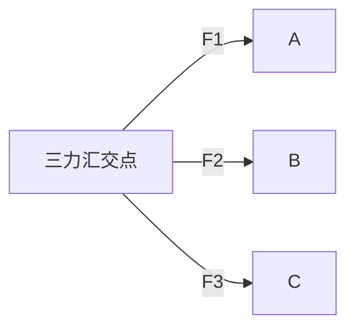

# 共点力平衡

> [!abstract] 概览
> 本节是受力分析的综合应用——共点力平衡条件 $\sum\vec{F}=0$ 是 [[05-牛顿第一定律]] 中"静止或匀速直线运动"状态的定量描述。核心要点：二力平衡（等大反向共线）、三力平衡（拉密定理与汇交原理）、多力平衡（正交分解法列 $\sum F_x=0$、$\sum F_y=0$）、动态平衡（图解法、相似三角形法）、整体法与隔离法。本节难点在==动态平衡问题==——通过画力三角形判断力随某个变量变化的方向与大小。掌握本节后，[[06-牛顿第二定律]] 中 $a=0$ 的特殊情形即为平衡，[[08-牛顿定律的应用]] 的整体隔离思路也由此引申。

## 核心概念

### 一、共点力概念

**共点力**：几个力作用于==同一点==（或作用线相交于同一点）的力。

- 严格共点：力的作用点重合；
- 等效共点：力作用线延长后交于同一点（如三根绳拉物体，绳延长线交于一点）。

> [!note] 共点力的判定
> 共点力的关键是"作用线相交"，不是"作用点重合"。即使几个力作用于物体不同位置，只要它们的==作用线相交于一点==，就可视为共点力处理。

### 二、平衡状态

**平衡状态**：物体处于==静止==或==匀速直线运动==状态。

- **静止**：速度为零，加速度为零；
- **匀速直线运动**：速度恒定，加速度为零；
- 两者共同点：==加速度 $a=0$==。

> [!warning] 静止 vs 瞬时速度为零
> "静止"指持续速度为零（含加速度为零）；"瞬时速度为零"指某一时刻速度为零，但加速度可能不为零（如竖直上抛最高点）。平衡状态要求==加速度为零==，不是速度为零。

### 三、共点力平衡条件

**共点力平衡条件**：物体所受合外力为零。

$$
\boxed{\,\sum\vec{F} = 0\,}
$$

分量形式：
$$
\sum F_x = 0,\quad \sum F_y = 0
$$

> [!tip] 平衡条件的几何意义
> $\sum\vec{F}=0$ 意味着所有力的矢量首尾相接形成==闭合多边形==。对二力平衡即两力等大反向共线；对三力平衡即三力形成闭合三角形（拉密定理）。

### 四、二力平衡

**二力平衡条件**：两力==大小相等、方向相反、作用在同一直线上==。

- 二力平衡是一对平衡力，作用在==同一物体==上；
- 与作用力反作用力的区别见 [[07-牛顿第三定律]]。

### 五、三力平衡

#### 1. 拉密定理

**拉密定理**：三个共点力平衡时，每个力与另两力夹角的正弦之比相等。

$$
\boxed{\,\dfrac{F_1}{\sin\alpha_1} = \dfrac{F_2}{\sin\alpha_2} = \dfrac{F_3}{\sin\alpha_3}\,}
$$

其中 $\alpha_1$ 为 $F_2$ 与 $F_3$ 的夹角（即 $F_1$ 对应的角），其余类推。

> [!note] 拉密定理的几何来源
> 拉密定理是==正弦定理==在力三角形中的应用——三力闭合三角形中，每个力对应一个外角，正弦定理 $F_1/\sin\alpha_1 = F_2/\sin\alpha_2 = F_3/\sin\alpha_3 = 2R$（$R$ 为力三角形外接圆半径）。

#### 2. 三力平衡汇交原理

**三力平衡汇交原理**：若一个物体受三个非平行力作用而平衡，则这三个力的作用线==必交于同一点==。

> [!example] 三力汇交的应用
> 三角形支架悬挂重物，三根杆/绳的拉力作用线必相交于一点。利用此原理可判断未知力的方向——如已知两力方向，第三力方向必过两力作用线交点。

### 六、多力平衡正交分解法

对于多个共点力平衡，常用==正交分解法==：

1. 建立直角坐标系（通常选多数力方向为轴）；
2. 将所有不在轴上的力分解到 $x$、$y$ 轴；
3. 列方程 $\sum F_x = 0$、$\sum F_y = 0$；
4. 解方程组求未知力。

> [!tip] 正交分解法要点
> 坐标系选取影响计算繁简，但不影响结果。一般选多数力方向为坐标轴以减少分解工作量；对斜面问题选沿斜面与垂直斜面方向。

### 七、动态平衡问题

**动态平衡**：物体在缓慢变化的过程中始终处于平衡状态（每时刻 $\sum\vec{F}=0$）。

动态平衡的两种典型方法：

#### 1. 图解法（力三角形法）

适用情形：三个力中有一个==恒力==（如重力），另两力方向变化但夹角关系确定。

操作步骤：
1. 画出初始状态的力三角形；
2. 保持恒力大小方向不变，让变化的力按其方向规则移动；
3. 观察各边长度（即各力大小）的变化。

#### 2. 相似三角形法

适用情形：力三角形与几何三角形相似。

操作步骤：
1. 找出力三角形与几何三角形相似的对应关系；
2. 利用相似比 $\dfrac{F_1}{a}=\dfrac{F_2}{b}=\dfrac{F_3}{c}$ 求解。

### 八、整体法与隔离法

- **整体法**：将几个相互作用的物体视为整体，分析整体所受外力（不分析内力）；
- **隔离法**：将某个物体单独隔离，分析其受力（包括其他物体对它的作用力）。

> [!warning] 整体法 vs 隔离法
> - 整体法求==外力==或==整体加速度==方便（内力自动抵消）；
> - 隔离法求==内力==（物体间相互作用力）必须；
> - 高考综合题常需==两者结合==——先整体求加速度，再隔离求内力。

## 推导与原理

### 一、拉密定理的推导

设三力 $\vec{F}_1, \vec{F}_2, \vec{F}_3$ 共点平衡，则 $\vec{F}_1+\vec{F}_2+\vec{F}_3=0$，三力首尾相接形成闭合三角形。

设 $\vec{F}_2$ 与 $\vec{F}_3$ 夹角为 $\alpha_1$（即 $\vec{F}_1$ 所对的外角），$\vec{F}_1$ 与 $\vec{F}_3$ 夹角为 $\alpha_2$，$\vec{F}_1$ 与 $\vec{F}_2$ 夹角为 $\alpha_3$。在力三角形中，由正弦定理：

$$
\dfrac{F_1}{\sin(\pi-\alpha_1)} = \dfrac{F_2}{\sin(\pi-\alpha_2)} = \dfrac{F_3}{\sin(\pi-\alpha_3)} = 2R
$$

而 $\sin(\pi-\alpha) = \sin\alpha$，故
$$
\dfrac{F_1}{\sin\alpha_1} = \dfrac{F_2}{\sin\alpha_2} = \dfrac{F_3}{\sin\alpha_3}
$$

### 二、三力汇交原理的证明

设物体受三力 $\vec{F}_1, \vec{F}_2, \vec{F}_3$ 平衡，且 $\vec{F}_1, \vec{F}_2$ 作用线相交于 $O$ 点。$\vec{F}_1+\vec{F}_2$ 的合力作用线必过 $O$。又因 $\vec{F}_1+\vec{F}_2+\vec{F}_3=0$，故 $\vec{F}_3 = -(\vec{F}_1+\vec{F}_2)$，即 $\vec{F}_3$ 与 $\vec{F}_1+\vec{F}_2$ 等大反向共线，故 $\vec{F}_3$ 作用线也过 $O$ 点。

### 三、动态平衡图解法的几何依据

动态平衡中，三力始终满足 $\vec{F}_1+\vec{F}_2+\vec{F}_3=0$，即始终形成闭合三角形。若一力（如重力）大小方向恒定，则该力对应的边长方向不变；其他两力按方向规则变化时，三角形的另两边相应变化，长度即对应力的大小。

## 典型实例与类比

### 实例 1：悬挂球受斜向挡板

半径 $R$ 的光滑球重 $G$，用挡板 $AB$ 挡住静止于倾角 $\theta$ 的光滑斜面上。挡板与斜面夹角 $\beta$ 可调。问 $\beta$ 从 $90^\circ$（垂直斜面）到 $180^\circ-\theta$（与斜面平行）过程中，球对挡板压力与对斜面压力如何变化？

**分析**：球受三力平衡——重力 $G$（恒定竖直向下）、斜面支持力 $N_1$（垂直斜面）、挡板支持力 $N_2$（垂直挡板）。重力恒定，$N_1, N_2$ 方向变化。用图解法：

- 重力对应的边长恒定（如三角形底边）；
- $N_1$ 方向与斜面垂直，$N_2$ 方向与挡板垂直；
- 当 $\beta$ 增大（挡板趋于竖直）时，$N_2$ 增大、$N_1$ 减小；
- 当 $\beta$ 减小（挡板趋于与斜面平行）时，$N_2$ 减小、$N_1$ 增大。

### 实例 2：绳挂重物水平移动

重 $G$ 的物体用绳悬挂，水平拉力 $F$ 缓慢拉动物体至绳与竖直方向成 $\theta$ 角。求 $F$ 与绳拉力 $T$ 随 $\theta$ 增大的变化。

**分析**：物体受三力平衡——重力 $G$（恒定）、水平拉力 $F$（恒水平）、绳拉力 $T$（沿绳方向）。由图解法或正交分解：

$$
F = G\tan\theta,\quad T = \dfrac{G}{\cos\theta}
$$

$\theta$ 增大时 $\tan\theta$ 增大、$\cos\theta$ 减小，故 $F$ 增大、$T$ 增大。

### 类比：力三角形是"刚体"的图像

把动态平衡中的力三角形想象成一根"刚性三角形框"——一边（恒力）固定，另两边按方向规则滑动。这样能直观看到力随变量变化的趋势，比代数法更直观。

> [!tip] 记忆口诀
> ==平衡条件合外零，二力等大反向行；三力闭合三角形，拉密定理正弦定；多力正交分解好，动态平衡画图明；整体隔离灵活用，外力内力各分明。==

## 例题

### 例 1：基础——三力平衡与拉密定理

**题目**：质量 $m=3\,\text{kg}$ 的小球用两根细绳悬挂如图，绳 $OA$ 与竖直方向夹角 $30^\circ$，绳 $OB$ 水平。求两绳拉力 $T_A$、$T_B$（$g=10\,\text{m/s}^2$）。

**分析**：球受三力平衡——重力 $mg=30\,\text{N}$（竖直向下）、$T_A$（沿 $OA$ 向上）、$T_B$（水平）。三力夹角：$T_A$ 与 $T_B$ 夹角 $90^\circ+30^\circ=120^\circ$，$mg$ 与 $T_B$ 夹角 $90^\circ$，$mg$ 与 $T_A$ 夹角 $180^\circ-30^\circ=150^\circ$。

**解答**（拉密定理）：
$$
\dfrac{T_A}{\sin 90^\circ} = \dfrac{T_B}{\sin 150^\circ} = \dfrac{mg}{\sin 120^\circ}
$$
$$
T_A = \dfrac{mg\sin 90^\circ}{\sin 120^\circ} = \dfrac{30\times 1}{\sqrt{3}/2} = \dfrac{60}{\sqrt{3}} = 20\sqrt{3}\,\text{N}\approx 34.6\,\text{N}
$$
$$
T_B = \dfrac{mg\sin 150^\circ}{\sin 120^\circ} = \dfrac{30\times 0.5}{\sqrt{3}/2} = \dfrac{30}{\sqrt{3}} = 10\sqrt{3}\,\text{N}\approx 17.3\,\text{N}
$$

**解答**（正交分解验证）：水平方向 $T_B = T_A\sin 30^\circ$，竖直方向 $mg = T_A\cos 30^\circ$，故 $T_A = mg/\cos 30^\circ = 30/(\sqrt{3}/2) = 20\sqrt{3}\,\text{N}$，$T_B = T_A\sin 30^\circ = 10\sqrt{3}\,\text{N}$。结果一致。

**点评**：拉密定理与正交分解是解决三力平衡的两把"刀"——拉密定理适合已知角度的情形，正交分解适合已知分量方向的情形。

### 例 2：中难——动态平衡图解法

**题目**：如图，用绳 $OP$ 拉悬挂重 $G$ 的小球，球靠在光滑竖直墙上。缓慢拉动绳使球沿墙上移，绳与墙夹角 $\theta$ 从 $0^\circ$ 增到 $60^\circ$。求此过程中绳拉力 $T$ 与墙支持力 $N$ 的变化情况。

**分析**：球受三力平衡——重力 $G$（竖直向下恒定）、绳拉力 $T$（沿绳方向，与墙夹角 $\theta$）、墙支持力 $N$（水平方向恒定方向）。重力对应边恒定，$T$ 与 $N$ 方向变化。

由正交分解（建立水平-竖直坐标）：
$$
T\cos\theta = G \quad\Rightarrow\quad T = \dfrac{G}{\cos\theta}
$$
$$
N = T\sin\theta = G\tan\theta
$$

$\theta$ 从 $0^\circ$ 增到 $60^\circ$ 时：
- $\cos\theta$ 减小 → $T$ 增大；
- $\tan\theta$ 增大 → $N$ 增大。

**解答**：$T = G/\cos\theta$ 与 $N = G\tan\theta$ 都随 $\theta$ 增大而增大。

**点评**：动态平衡的"恒力+两变力"模式是高考常考题型。关键技巧是==先找恒力==（对应力三角形中恒定边），再分析两变力的方向变化规律。

### 例 3：进阶——整体法与隔离法

**题目**：质量 $m_A=2\,\text{kg}$、$m_B=3\,\text{kg}$ 的两物块叠放在光滑水平地面上，水平力 $F=10\,\text{N}$ 作用于 $A$，$A$、$B$ 共同匀速运动。求：
（1）地面对 $B$ 的支持力 $N_{\text{地}}$；
（2）$A$ 对 $B$ 的摩擦力 $f$；
（3）若 $F$ 作用于 $B$，$A$、$B$ 仍共同匀速，$A$、$B$ 间摩擦力如何变化？

**分析**：整体法分析整体（$A+B$）受外力，隔离法分析内力。

**解答**：
（1）整体法（视 $A+B$ 为整体）：
- 竖直方向：$N_{\text{地}} = (m_A+m_B)g = (2+3)\times 10 = 50\,\text{N}$；
- 水平方向：因匀速运动（合力为零），地面光滑无摩擦，故无需考虑地面摩擦。

（2）隔离 $A$：$A$ 受水平推力 $F=10\,\text{N}$ 与 $B$ 对 $A$ 的静摩擦力 $f'$（方向反向，与 $A$ 相对 $B$ 的运动趋势相反）。
$$
F - f' = 0 \quad\Rightarrow\quad f' = 10\,\text{N}
$$
由作用力反作用力，$A$ 对 $B$ 的摩擦力 $f = f' = 10\,\text{N}$（方向与 $f'$ 反向）。

（3）若 $F$ 作用于 $B$：
- 整体仍匀速，整体合力为零，地面光滑，$F$ 与 $A$、$B$ 间摩擦力平衡；
- 隔离 $A$：$A$ 仅受 $B$ 对 $A$ 的静摩擦力 $f'$（无其他水平力），故 $f' = 0$（$A$ 不需要被加速，匀速运动不需摩擦力）；
- 故 $A$、$B$ 间摩擦力为 $0$。

**点评**：本题体现整体法与隔离法的灵活切换——求外力（地面支持力）用整体法，求内力（$A$、$B$ 间摩擦力）用隔离法。注意（3）中 $F$ 改作用对象后内力变化——这是连接体问题的核心考点。

## 易错提醒

> [!warning] 易错点
> 1. **静止 ≠ 速度为零**：平衡要求 $a=0$（持续静止或匀速直线运动）；瞬时速度为零不一定是平衡（如上抛最高点）。
> 2. **平衡力 vs 作用反作用力**：平衡力作用在==同一物体==上，作用反作用力作用在==两个不同物体==上（详见 [[07-牛顿第三定律]]）。
> 3. **三力平衡不一定汇交**：若三力平行则不汇交（如两绳水平拉、重力竖直拉，三力平行平衡）。
> 4. **动态平衡图解法选错恒力**：必须找出"大小方向恒定"的那个力作为基准边。
> 5. **整体法与隔离法误用**：整体法不能求内力，隔离法需考虑所有作用力（包括其他物体的作用）。
> 6. **拉密定理中角度对应**：$\alpha_1$ 是 $F_1$ ==对==的角，即 $F_2$ 与 $F_3$ 的夹角——不要混淆。

> [!note] 概念辨析
> **平衡状态 vs 瞬时平衡**：
> - 平衡状态：持续 $a=0$，包括静止与匀速直线运动；
> - 瞬时平衡：某一时刻 $v=0$ 但 $a\neq 0$（如上抛最高点）——不是平衡状态。
>
> **二力平衡 vs 作用反作用力**：
> - 二力平衡：两力作用于==同一物体==，等大反向共线，是平衡力；
> - 作用反作用力：两力作用于==两个物体==，等大反向共线，是相互作用力（同时产生消失）。
> 详见 [[07-牛顿第三定律]]。
>
> **整体法 vs 隔离法**：
> - 整体法：视多物体为整体，只分析外力，适合求整体加速度或外力；
> - 隔离法：单独分析某物体，考虑所有作用力（含内力），适合求内力。

## 与其他知识关联

- 与 [[01-重力与弹力]] 的关系：重力、弹力是平衡问题中常见的力；重心位置影响物体平衡稳定性。
- 与 [[02-摩擦力]] 的关系：静摩擦力大小常等于其他力的反向合力（平衡条件）。
- 与 [[03-力的合成与分解]] 的关系：正交分解法是平衡条件的核心计算工具。
- 与 [[05-牛顿第一定律]] 的关系：平衡状态是牛顿第一定律描述的"无外力或合外力为零"状态。
- 与 [[06-牛顿第二定律]] 的关系：平衡是 $a=0$ 的特殊情形，$\sum F = ma = 0$。
- 与 [[08-牛顿定律的应用]] 的关系：整体法与隔离法在动力学中同样适用，是连接体问题的核心方法。
- 与 [[01-运动学/02-匀变速直线运动]] 的关系：匀速直线运动是平衡状态的特例（$a=0$）。
- 与电学联系：[[03-磁场/02-安培力]] 通电导体在磁场中平衡问题；[[05-交变电流/04-远距离输电]] 中受力平衡。
- 大学层面延伸：[[牛顿力学]] 中平衡的严格定义为 $\sum\vec{F}=0$ 且 $\sum\vec{M}=0$（合力与合力矩均为零）；[[机械振动]] 中平衡位置是简谐运动的中心。
- 返回 [[00-力学总览]]

## 作者的话

> [!quote] 个人理解
> 共点力平衡是力学的"综合考场"——它把受力分析、力的合成与分解、矢量运算整合在一起考查。本节最大的难点不是公式，而是==动态平衡==——通过画力三角形判断力随变量的变化趋势。
>
> 我的建议是：永远先找==恒力==。动态平衡中，至少有一个力（通常是重力）大小方向恒定，把它作为力三角形的"基准边"，再观察另两力的方向变化规律。这种几何思维比代数法更高效——画一个力三角形，立刻就能看出哪个力增大、哪个减小。
>
> 整体法与隔离法的灵活切换是高中物理的核心能力之一。原则很简单：==求外力用整体，求内力用隔离==。但实际题目中常需两者结合——先整体求加速度，再隔离求内力。这种"先粗后细"的思路在工程分析、科学研究中同样适用。
>
> 平衡状态 $\sum\vec{F}=0$ 是牛顿第二定律 $\sum\vec{F}=ma$ 在 $a=0$ 时的特例。理解这一点，平衡问题就不再是一个独立的"题型"，而是动力学的一个特殊情形。这种"统一"思想是物理学的方法论核心——用一个统一的方程描述各种看似不同的现象。

---
*返回 [[00-力学总览]]*
