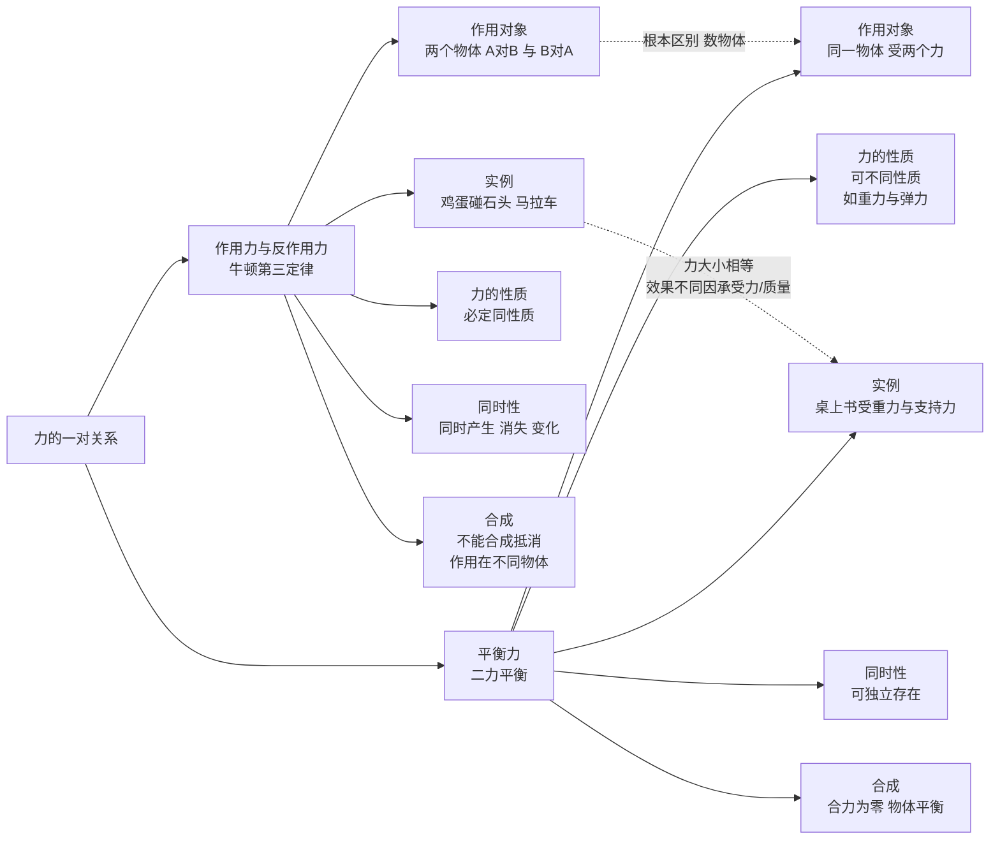

# 牛顿第三定律

> [!abstract] 概览
> 本节揭示力的==相互性==——力总是成对出现，作用力与反作用力同时产生、同时消失、等大反向、性质相同、作用在不同物体上。核心内容：牛顿第三定律的内容（$\vec{F}=-\vec{F}'$）、作用反作用力的特点（同性质、同时刻、不同物体）、与平衡力的根本区别（作用对象不同、是否同性质、是否同时消失）。本节难点在==作用反作用力 vs 平衡力的辨析==——这是受力分析的核心，也是初学者最易混淆的概念。本节与 [[06-牛顿第二定律]] 配合，前者分析"作用在不同物体的力"，后者分析"作用在同一物体的力"，二者共同构成完整的力学分析框架。

## 核心概念

### 一、作用力与反作用力

**作用力与反作用力**：两个物体之间的相互作用力，==同时产生、同时消失、等大反向、性质相同==。

- 物体 $A$ 对 $B$ 施加力 $\vec{F}$（作用力）；
- 物体 $B$ 必然同时对 $A$ 施加力 $\vec{F}'$（反作用力）；
- 二者大小相等、方向相反、共线。

> [!note] 力的相互性是普遍规律
> 不论是接触力（弹力、摩擦力）还是场力（重力、电场力、磁场力），力总是成对出现。地球吸引苹果（重力），苹果也吸引地球——只是地球质量太大，加速度可忽略。

### 二、牛顿第三定律的内容

**牛顿第三定律**：两个物体之间的作用力和反作用力，总是大小相等、方向相反、作用在同一条直线上。

$$
\boxed{\,\vec{F} = -\vec{F}'\,}
$$

或写为大小形式 $F=F'$，方向相反。

### 三、作用力反作用力的特点

#### 1. 同性质

作用力与反作用力是==同种性质==的力：
- 作用力是重力，反作用力也是重力；
- 作用力是弹力，反作用力也是弹力；
- 作用力是摩擦力，反作用力也是摩擦力；
- 作用力是电场力，反作用力也是电场力。

#### 2. 同时刻

作用力与反作用力==同时产生、同时变化、同时消失==。

- 不能说"先有作用力，后有反作用力"——二者同时存在；
- 撤去作用力，反作用力立即消失。

#### 3. 不同物体

作用力与反作用力分别作用在==两个不同==的物体上：
- 作用力作用于受力物体 $B$；
- 反作用力作用于施力物体 $A$（即原受力物体的反作用对象）。

> [!warning] 不同物体——关键差异点
> 这是与平衡力的根本区别！作用反作用力作用在==两个==物体上，平衡力作用在==一个==物体上。

#### 4. 同直线

作用力与反作用力作用线==共线==——在同一直线上，方向相反。

#### 5. 大小相等

不论两物体质量、形状、运动状态如何，作用力与反作用力大小==始终相等==。

> [!example] 大小相等与质量无关
> - 鸡蛋碰石头：鸡蛋对石头的力 = 石头对鸡蛋的力（大小相等）；
> - 但鸡蛋碎了而石头没碎——不是因为鸡蛋受力小，而是因为鸡蛋承受力的能力差（材料强度）。
> - 卡车撞小轿车：卡车对小轿车的力 = 小轿车对卡车的力（大小相等）；
> - 小轿车损伤严重是因为其质量小，加速度大（$a=F/m$），损坏程度高。

### 四、作用反作用力 vs 平衡力（核心辨析）

| 比较项 | 作用力与反作用力 | 平衡力 |
| --- | --- | --- |
| 作用对象 | ==两个不同==物体 | ==同一==物体 |
| 力的性质 | ==同性质== | 可不同性质 |
| 同时性 | ==同时产生、同时消失== | 互相独立，可分别存在 |
| 大小方向 | 等大反向共线 | 等大反向共线 |
| 受力分析中 | ==不能相加==（不同物体） | 合力为零（同物体平衡） |
| 总和 | 不能合成（不同物体） | 合力为零 |

#### 经典例子：桌面上静止的书

书放在桌面上，受重力 $G$ 与桌面支持力 $N$。
- **平衡力**：书的重力 $G$ 与桌面支持力 $N$——都作用在==书==上，等大反向，使书平衡。
- **作用反作用力**：
  - 书对桌面的压力 $N'$ 与桌面对书的支持力 $N$——分别作用在==桌面==与==书==上，等大反向，是弹力（同性质）。
  - 书受的重力 $G$ 与书对地球的引力 $G'$——分别作用在==书==与==地球==上，等大反向，是引力（同性质）。

> [!warning] 易错辨析
> - **错误**：书的重力与桌面的支持力是作用反作用力。
> - **正确**：书的重力与桌面支持力是==平衡力==（同作用在书上）；书对桌面的压力与桌面对书的支持力才是==作用反作用力==（作用在两个物体上）。
> - **错误**：作用反作用力大小相等是因为质量相同。
> - **正确**：作用反作用力大小相等==与质量无关==，是普遍规律。质量不同只导致加速度不同（$a=F/m$）。

### 五、相互作用的本质：力的物质性

力的==物质性==意味着：
1. 力不能脱离物体而存在——必有施力物体与受力物体；
2. 力是相互的——施力物体同时是受力物体；
3. 没有孤立的力——任何力都有反作用力。

> [!note] 牛顿第三定律的哲学意义
> 第三定律揭示：力是物体间的相互作用，不存在"单向施加"的力。这种"相互性"是经典力学的基本图景——宇宙中所有力都是成对的，作用与反作用构成完整的相互作用画面。

## 推导与原理

### 一、第三定律的实验基础

牛顿第三定律可通过以下实验验证：

#### 实验 1：弹簧测力计对拉

两只弹簧测力计 $A$、$B$ 互相钩住，分别向两边拉。无论用力大小如何，两测力计读数==始终相等==。这表明 $A$ 对 $B$ 的力与 $B$ 对 $A$ 的力等大反向。

#### 实验 2：磁铁与铁块相互作用

磁铁吸引铁块的同时，铁块也吸引磁铁——将磁铁与铁块分别放在两辆小车上，二者会==相互靠近==（不是铁块单向被吸引）。

#### 实验 3：水火箭

水火箭向下喷水（作用力），水对火箭反推向上（反作用力）——火箭升空正是反作用力的应用。

### 二、第三定律与第二定律的协同

分析两物体相互作用时，第三定律与第二定律配合使用：

设 $A$、$B$ 相互作用力为 $\vec{F}_{AB}$（$A$ 对 $B$）与 $\vec{F}_{BA}$（$B$ 对 $A$），由第三定律 $\vec{F}_{AB}=-\vec{F}_{BA}$。对每个物体分别应用第二定律：

$$
m_A \vec{a}_A = \vec{F}_{BA} + \vec{F}_{\text{其他}A},\quad m_B \vec{a}_B = \vec{F}_{AB} + \vec{F}_{\text{其他}B}
$$

这是连接体问题（如 [[08-牛顿定律的应用]] 中整体法与隔离法）的理论基础。

### 三、作用反作用力大小相等与质量无关的证明

考虑两物体 $A$（$m_A$）、$B$（$m_B$）只受彼此相互作用力（孤立系统）：
- $A$ 受力 $F_{BA}$，加速度 $a_A = F_{BA}/m_A$；
- $B$ 受力 $F_{AB}$，加速度 $a_B = F_{AB}/m_B$；
- 由第三定律 $F_{AB} = F_{BA}$（大小）；
- 故 $m_A a_A = m_B a_B$，即 $a_A/a_B = m_B/m_A$。

可见加速度比与质量比反比，但力大小==始终相等==。这就是"卡车撞轿车，轿车加速度大但受力相同"的解释。

## 典型实例与类比

### 实例 1：人走路

人走路时脚向后蹬地（作用力），地对脚向前推（反作用力）——人之所以能前进，正是地面的反作用力向前推人。

- 若地面绝对光滑（无摩擦），人无法前进——因为没有反作用力；
- 这就是为什么冰面上行走困难——摩擦力小，反作用力小。

### 实例 2：火箭推进

火箭向下喷出高速气体（作用力），气体对火箭反推向上（反作用力）——火箭升空。

- 火箭不需要"借助空气"反推——在真空中也能推进（喷出气体本身就提供反作用力）；
- 这是太空飞行的基础原理。

### 实例 3：马与车

马拉车，车也拉马——二者相互作用力等大反向。为什么车被马拉动而马不动？

- 马对车的拉力 = 车对马的拉力（作用反作用力，等大反向）；
- 但马还受==地面对马==的向前静摩擦力（脚蹬地的反作用力），这个力使马加速；
- 车受马向前的拉力与地面向后的摩擦力，合力向前 → 车加速；
- 关键是马与车所受==其他力==不同——马受地面摩擦向前，车受地面摩擦向后。

> [!tip] 注意"系统外力"与"系统内力"
> 马与车作为一个系统，二者间的拉力是==内力==，不影响整体运动；马与地面间的摩擦力才是==外力==，决定马+车系统的加速度。

### 类比：作用反作用力的"镜面对"

把作用力与反作用力想象成"镜中相对"的两个力——
- 大小相同（镜子里的你与真实的你同样大小）；
- 方向相反（左变右，右变左）；
- 但作用在不同对象上（镜子里的你不是真实的你）。

平衡力则像"左右手互推"——两只手都作用在你自己身上，互相抵消。

> [!tip] 记忆口诀
> ==作用反作用同生灭，等大反向性质同；作用两物不相抵，平衡同物合为零；受力分析要分清，性质相同反作用，同体平衡是不同；卡车撞蛋力相等，蛋碎只因蛋脆弱。==

## 例题

### 例 1：基础——作用反作用力辨析

**题目**：质量 $m=1\,\text{kg}$ 的小球用细绳悬挂于天花板，小球静止。指出：
（1）小球所受的各力及其反作用力；
（2）小球所受的各对平衡力。

**分析**：小球受重力 $G=mg$（向下）与绳拉力 $T$（向上）两个力，处于平衡状态。

**解答**：
（1）小球所受各力及其反作用力：
- 重力 $G=mg=10\,\text{N}$（向下）：施力物体==地球==，反作用力是小球对地球的引力 $G'=10\,\text{N}$（向上，作用在地球上），性质为引力；
- 绳拉力 $T=10\,\text{N}$（向上）：施力物体==绳==，反作用力是小球对绳的拉力 $T'=10\,\text{N}$（向下，作用在绳上），性质为弹力。

（2）小球所受的平衡力：
- 重力 $G=mg$ 与绳拉力 $T$——都作用在==小球==上，等大反向，使小球平衡。这是一对平衡力。

**点评**：本题考查作用反作用力与平衡力的区分。关键看：
- 作用在==几个物体==上：两个不同物体 → 作用反作用力；同一物体 → 平衡力；
- 是否==同性质==：同性质 → 作用反作用力；可能不同性质 → 平衡力；
- 是否==同时消失==：同时消失 → 作用反作用力；可能独立 → 平衡力。

### 例 2：中难——相互作用力大小相等

**题目**：质量 $m_A=60\,\text{kg}$ 的运动员与质量 $m_B=20\,\text{kg}$ 的小车在光滑水平冰面上静止。运动员用力推小车，小车获得 $a_B=3\,\text{m/s}^2$ 的加速度。求：
（1）运动员对小车的推力 $F$；
（2）运动员的加速度 $a_A$；
（3）推力撤去后两者如何运动？

**分析**：
- 运动员对车的推力 = 车对运动员的反推力（作用反作用力，大小相等）；
- 光滑冰面无摩擦，故运动员也加速运动；
- 推力撤去后两者以恒定速度运动（无外力，惯性运动）。

**解答**：
（1）对小车应用 $F=ma$：
$$
F = m_B a_B = 20\times 3 = 60\,\text{N}
$$

（2）对运动员（受反推力 $F'=F=60\,\text{N}$）：
$$
a_A = \dfrac{F'}{m_A} = \dfrac{60}{60} = 1\,\text{m/s}^2
$$
方向与车相反（运动员被反推）。

（3）推力撤去后：两者都不再受力（光滑冰面无摩擦），由 [[05-牛顿第一定律]] 惯性定律，二者以==恒定速度==做匀速直线运动。但二者速度方向相反，故二者将==相互远离==。

**点评**：本题体现作用反作用力==大小相等==的特点：力相同（$60\,\text{N}$），但加速度不同（$a_A=1$ vs $a_B=3\,\text{m/s}^2$）——因为质量不同。这就是为什么"大物体推小物体，小物体加速度大"。$m_A a_A = m_B a_B$ 是动量守恒的雏形（详见 [[动能与动量]]）。

## 易错提醒

> [!warning] 易错点
> 1. **作用反作用力 vs 平衡力混淆**：作用反作用力作用在==两个==物体上，平衡力作用在==一个==物体上——这是根本区别。
> 2. **作用反作用力不同时性**：错误认为"先有作用力后有反作用力"——二者==同时==产生消失。
> 3. **作用反作用力大小不等**：错误认为"质量大的物体施力大"——大小==始终相等==，与质量无关。
> 4. **作用反作用力合成**：作用反作用力作用在不同物体上，==不能==合成（不能"相加抵消"）。
> 5. **鸡蛋碰石头**：鸡蛋碎了不是因为受力小，而是因为==承受能力==差。受力大小相同。
> 6. **作用反作用力同性质**：作用力是弹力，反作用力也必是弹力；作用力是引力，反作用力也必是引力。
> 7. **"马拉车"问题**：马与车间的拉力是==内力==，不决定整体运动；地面摩擦力才是==外力==。

> [!note] 概念辨析
> **作用反作用力 vs 平衡力**：
> - 作用对象：作用反作用力在两物体；平衡力在一物体；
> - 力的性质：作用反作用力同性质；平衡力可不同性质；
> - 同时性：作用反作用力同时产生消失；平衡力可独立存在；
> - 总和：作用反作用力不能合成；平衡力合力为零。
>
> **作用反作用力大小相等与质量无关**：
> - 鸡蛋碰石头：力大小相等，鸡蛋碎是因为承受力差；
> - 卡车撞小车：力大小相等，小车损伤重是因为质量小加速度大；
> - 大力士推小孩：力大小相等，大力士看似"赢"是因为脚下的摩擦力大（外力决定整体运动）。
>
> **内力 vs 外力**：
> - 内力：系统内物体间相互作用力，不影响整体运动（如马与车间拉力）；
> - 外力：系统外对系统的作用力，决定整体加速度（如地面摩擦力）；
> - 受力分析时只能列外力（整体法）或单个物体受力（隔离法）。

## 与其他知识关联

- 与 [[05-牛顿第一定律]] 的关系：第一定律定义惯性系，第三定律在该系中成立；二者共同构成力学的概念基础。
- 与 [[06-牛顿第二定律]] 的关系：第二定律分析单个物体，第三定律分析两物体相互作用；二者结合解决连接体问题。
- 与 [[08-牛顿定律的应用]] 的关系：整体法与隔离法的切换依赖第三定律——隔离两物体间的相互作用力等大反向。
- 与 [[01-重力与弹力]] 的关系：重力与引力（反作用力是物体对地球的引力）、弹力（支持力与压力是作用反作用力）都遵循第三定律。
- 与 [[02-摩擦力]] 的关系：摩擦力也是成对的——$A$ 对 $B$ 的摩擦力与 $B$ 对 $A$ 的摩擦力等大反向。
- 与 [[动能与动量]] 的关系：第三定律是动量守恒定律的基础——内力等大反向，总动量变化为零。详见 [[碰撞详解]]。
- 与电学联系：[[01-静电场/01-电荷与库仑定律]] 中两电荷间的库仑力是作用反作用力；[[03-磁场/02-安培力]] 中两通电导线间的力也是作用反作用力。
- 大学层面延伸：[[牛顿力学]] 中第三定律是质点系动量守恒的基础；[[碰撞详解]] 中弹性碰撞、非弹性碰撞都依赖动量守恒（来自第三定律）；在相对论中，第三定律需修正（力不能瞬时传播，有"推迟势"效应）。
- 返回 [[00-力学总览]]

## 作者的话

> [!quote] 个人理解
> 牛顿第三定律看似简单——"作用力等于反作用力"——但它是物理学中最深刻的定律之一。它揭示了力的==相互性==：宇宙中不存在"单向"的力，所有力都是成对的相互作用。
>
> 学习第三定律，最大的陷阱是与==平衡力==的混淆。我的辨析口诀是：
> 1. **数物体**：作用反作用力在==两个==物体上，平衡力在==一个==物体上——这是最根本的区别。
> 2. **看性质**：作用反作用力==同性质==（同为弹力、同为引力等），平衡力可不同性质（如重力与弹力平衡）。
> 3. **试撤去**：撤去作用力，反作用力==立即消失==（同时性）；撤去一个平衡力，另一个不一定消失（独立性）。
>
> "鸡蛋碰石头"是经典辨析题。鸡蛋碎了，不是因为鸡蛋受力小——鸡蛋与石头受力==相等==！鸡蛋碎是因为鸡蛋==承受力==的能力差（材料强度低）。这是物理学"力相同，效果不同"的典型例子。
>
> "马拉车"问题也是经典易错点。马对车的拉力等于车对马的拉力——为什么车被马拉动而马不动？因为决定整体运动的是==外力==（地面摩擦力），不是内力（马车间拉力）。这种"内力不影响整体运动，外力决定加速度"的思想，是连接体问题和动量守恒的核心。
>
> 第三定律的更深层意义在于它是==动量守恒==的基础。两物体相互作用力等大反向，作用时间相同，故冲量等大反向，动量变化等大反向——总动量守恒。这种"从第三定律推出动量守恒"的逻辑链，是经典力学内部自洽的体现。详见 [[动能与动量]] 与 [[碰撞详解]]。
>
> 在相对论中，第三定律需修正——力不能瞬时传播（信息传播速度上限为光速），故严格的"同时作用反作用"需用"场"的概念重新表述。这是 [[钟慢尺缩与质增]] 中相对论力学对牛顿力学的修正之一。

---
*返回 [[00-力学总览]]*
