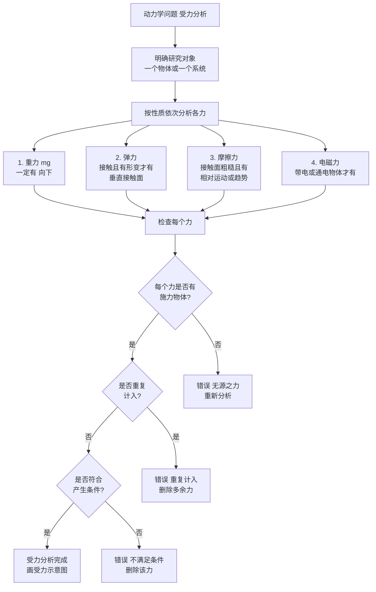
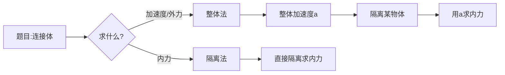

# 牛顿定律的应用

> [!abstract] 概览
> 本节是牛顿运动定律版块的==综合应用层==，将 [[05-牛顿第一定律]]、[[06-牛顿第二定律]]、[[07-牛顿第三定律]] 三大定律综合运用到具体模型。核心方法包括：受力分析的一般步骤、正交分解法列方程（沿加速度方向与垂直加速度方向）、整体法与隔离法（整体法求加速度、隔离法求内力）、瞬时问题（轻绳/轻弹簧剪断的加速度分析）、动力学两类基本问题（已知受力求运动、已知运动求力）。本节涵盖高考力学的核心题型——连接体、传送带、斜面、板块模型，是力学的"集大成"应用版块。掌握本节后，可与运动学公式结合处理一切直线运动动力学问题，并与电学的安培力、洛伦兹力综合应用打通。

## 核心概念

### 一、受力分析的一般步骤

受力分析是动力学解题的"第一步"，必须==按顺序==进行，避免漏力或重复：

1. **明确研究对象**：选定受力物体（一个物体或一个系统）；
2. **按性质依次分析**：
   - **重力** $mg$（一定有，向下）；
   - **弹力**（接触且有形变才有，垂直接触面）；
   - **摩擦力**（接触面粗糙且有相对运动或趋势才有，沿接触面）；
   - **电磁力**（带电或通电物体才有，如电场力、安培力、洛伦兹力）；
3. **检查**：每个力是否有施力物体？是否重复？是否符合产生条件？

> [!tip] 受力分析口诀
> ==重力一定有，弹力看接触，摩擦看粗糙，电磁看带电；先画重力再弹力，最后摩擦其他力；每个力必有源，无源之水不可信。==

### 二、正交分解法列方程

建立==直角坐标系==，将所有力分解到 $x$、$y$ 轴，再列牛顿第二定律方程：

$$
\sum F_x = m a_x,\quad \sum F_y = m a_y
$$

#### 坐标系选择原则

- **加速运动**：选==加速度方向==为 $x$ 轴正方向（这样 $a_y=0$，$y$ 方向平衡，简化计算）；
- **斜面问题**：选沿斜面方向为 $x$ 轴、垂直斜面为 $y$ 轴；
- **匀速或静止**：选多数力方向为坐标轴（减少分解工作量）。

#### 典型情形

| 情形        | $x$ 方程                             | $y$ 方程           |
| --------- | ---------------------------------- | ---------------- |
| 水平面加速（光滑） | $F=ma$                             | $N=mg$           |
| 水平面加速（粗糙） | $F-\mu mg=ma$                      | $N=mg$           |
| 斜面下滑（光滑）  | $mg\sin\theta=ma$                  | $N=mg\cos\theta$ |
| 斜面下滑（粗糙）  | $mg\sin\theta-\mu mg\cos\theta=ma$ | $N=mg\cos\theta$ |
| 竖直加速上升    | —                                  | $N-mg=ma$        |

### 三、整体法与隔离法

#### 1. 整体法

将几个相互作用的物体==视为整体==，分析整体所受==外力==。

- **适用**：求整体加速度、外力；
- **特点**：内力自动抵消，方程简单；
- **方程**：$F_{\text{外合}} = m_{\text{总}}\cdot a$。

#### 2. 隔离法

将某个物体==单独隔离==，分析其所有受力（含其他物体对它的作用力）。

- **适用**：求内力（物体间相互作用力）；
- **特点**：需考虑所有作用力，包括内力（对整体是内力，对隔离体是外力）；
- **方程**：$F_{\text{合}} = m_{\text{隔离}}\cdot a$。

#### 3. 整体法与隔离法的切换

> [!tip] 切换原则
> - ==求整体加速度== → 用整体法（先求 $a$）；
> - ==求内力== → 必须用隔离法（整体法内力自动抵消，无法求）；
> - ==综合题== → 先整体求 $a$，再隔离求内力，两步走。

### 四、瞬时问题

瞬时问题考查牛顿第二定律的==瞬时性==——力变化的瞬间加速度立即变化。关键区分：

| 连接物 | 力是否可突变 |
| --- | --- |
| 轻绳 | ==可瞬时突变==（绳不可伸长，张力瞬时调整） |
| 轻杆 | ==可瞬时突变==（同轻绳） |
| 接触面（支持力、压力） | ==可瞬时突变== |
| 轻弹簧 | ==不可突变==（形变需时间传播，瞬间弹力保持原值） |
| 橡皮筋 | 不可突变（同弹簧） |

> [!warning] "剪断弹簧" vs "弹簧弹力不变"
> - ==弹簧两端仍连接物体==：剪断其他绳/杆时，弹簧弹力==保持不变==（形变未变）；
> - ==直接剪断弹簧==：弹簧脱离作用，弹力==立即消失==（不是"突变"，是脱离作用）。

### 五、动力学两类基本问题

#### 第一类：已知受力求运动

**已知**：物体受力（恒力或变力）→ **求**：运动状态（位移、速度、时间等）。

**步骤**：
1. 受力分析；
2. 应用 $F=ma$ 求加速度 $a$；
3. 用运动学公式 $v=v_0+at$、$x=v_0t+\frac{1}{2}at^2$、$v^2-v_0^2=2ax$ 等求运动量。

#### 第二类：已知运动求力

**已知**：物体运动状态（$a$、$v$、$x$、$t$）→ **求**：物体所受未知力。

**步骤**：
1. 由运动学公式求加速度 $a$；
2. 受力分析（含未知力）；
3. 应用 $F=ma$ 求未知力。

> [!note] 两类问题的桥梁——加速度 $a$
> 加速度 $a$ 是连接动力学（$F=ma$）与运动学（$v=v_0+at$ 等）的==桥梁==。无论哪类问题，都需先求 $a$。

### 六、跨章节综合

牛顿定律常与以下知识综合：
- **运动学公式**：动力学两类基本问题；
- **能量定理**：动能定理、机械能守恒（[[动能与动量]]）；
- **动量定理**：动量守恒（[[碰撞详解]]）；
- **电磁学**：安培力、洛伦兹力、电场力（[[03-磁场/02-安培力]]、[[04-电磁感应/05-电磁感应综合应用]]）；
- **圆周运动**：向心力由牛顿第二定律提供（[[03-圆周运动动力学]]）；
- **万有引力**：天体运动（[[04-万有引力与航天]]）。

## 推导与原理

### 一、连接体问题的标准解法

设两物体 $A$（$m_A$）、$B$（$m_B$）用轻绳连接，水平力 $F$ 推 $A$，整体在光滑水平面上加速。

#### 整体法

$$
F = (m_A + m_B) a \;\Rightarrow\; a = \dfrac{F}{m_A + m_B}
$$

#### 隔离法（隔离 $B$）

$B$ 受绳拉力 $T$（向前）：
$$
T = m_B a = \dfrac{m_B F}{m_A + m_B}
$$

#### 隔离法（隔离 $A$）

$A$ 受推力 $F$（向前）与绳拉力 $T'$（向后，反作用力）：
$$
F - T' = m_A a \;\Rightarrow\; T' = F - m_A a = \dfrac{m_B F}{m_A + m_B} = T
$$

验证：$T = T'$，与第三定律一致。

> [!example] 内力公式
> 连接体内力 $T = \dfrac{m_{\text{后}}F}{m_{\text{总}}}$（$m_{\text{后}}$ 为受力较小的物体质量）——这是连接体问题的"标准公式"，可直接套用。

### 二、传送带模型分析

水平传送带以速度 $v_0$ 运动，将物体轻放于传送带一端：

#### 阶段 1：物体加速（相对传送带向后滑）

- 物体受向前的滑动摩擦力 $f=\mu mg$；
- 加速度 $a=\mu g$；
- 物体加速直至速度等于传送带速度 $v_0$；
- 加速时间 $t_1 = v_0/a = v_0/(\mu g)$；
- 加速距离 $x_1 = v_0^2/(2a) = v_0^2/(2\mu g)$。

#### 阶段 2：物体随传送带匀速（相对静止）

- 物体与传送带同速，无相对运动，无摩擦力；
- 物体随传送带匀速运动。

> [!warning] 传送带方向判定
> 物体所受摩擦力方向与==相对传送带==的运动方向相反：
> - 物体速度 $<$ 传送带速度 → 物体相对传送带向后滑 → 摩擦力向前（加速物体）；
> - 物体速度 $>$ 传送带速度 → 物体相对传送带向前滑 → 摩擦力向后（减速物体）；
> - 物体速度 $=$ 传送带速度 → 无相对运动 → 无摩擦力。

### 三、瞬时性问题的受力突变

考虑质量为 $m$ 的小球用弹簧 $A$（在上）与轻绳 $B$（在下）共同悬挂，静止时：
- 弹簧拉力 $F_A = mg + T_B$（向上拉小球）；
- 绳拉力 $T_B$（向下，因绳在下端连地）。

**剪断绳 $B$ 瞬间**：
- 绳张力 $T_B$ ==瞬时消失==（变为 $0$）；
- 弹簧弹力 $F_A$ ==保持不变==（弹簧形变未变）；
- 小球受合力：$F_A - mg = (mg + T_B) - mg = T_B$（向上）；
- 加速度 $a = T_B/m$（向上）。

**关键判据**：
- ==绳、杆、接触面==的弹力可瞬时突变；
- ==弹簧==的弹力（自身）不可突变，瞬间保持原值。

## 典型实例与类比

### 实例 1：斜面上加速下滑

倾角 $\theta$ 的粗糙斜面，物体加速下滑：
- 沿斜面：$mg\sin\theta - \mu mg\cos\theta = ma$；
- 加速度 $a = g(\sin\theta - \mu\cos\theta)$；
- 若 $\mu > \tan\theta$，则 $a<0$，物体不能下滑（需外力推动）。

### 实例 2：电梯中的人

电梯加速度 $a$ 向上，质量 $m$ 的人受支持力 $N$ 与重力 $mg$：
$$
N - mg = ma \;\Rightarrow\; N = m(g+a)
$$
- $a>0$（向上加速）→ $N>mg$（==超重==，详见 [[09-超重与失重]]）；
- $a<0$（向下加速）→ $N<mg$（==失重==）；
- $a=g$（自由落体）→ $N=0$（==完全失重==）。

### 实例 3：板块模型

木板 $M$ 上放物块 $m$，水平力 $F$ 推木板，物块与木板间摩擦因数 $\mu_1$，木板与地面间 $\mu_2$：

- **整体分析**：$F - \mu_2(M+m)g = (M+m)a_{\text{整}}$；
- **隔离物块**：$\mu_1 mg = ma_{\text{块}}$（最大静摩擦力提供物块加速度）；
- **临界条件**：当 $a_{\text{整}} > \mu_1 g$ 时，物块开始相对木板滑动；
- **临界力**：$F_{\text{临界}} = \mu_1 g\cdot (M+m) + \mu_2(M+m)g = (\mu_1+\mu_2)(M+m)g$。

### 类比：整体法与隔离法如同"望远镜与显微镜"

- 整体法像==望远镜==——看大系统，忽略细节，求整体规律（加速度）；
- 隔离法像==显微镜==——看单一物体，分析细节，求内力；
- 综合题需先用望远镜找方向，再用显微镜找细节——这是科学分析的通用方法。

> [!tip] 记忆口诀
> ==受力分析按序排，重力弹力摩擦电；坐标轴向加速度，正交分解列方程；整体求 $a$ 隔离力，两类问题 $a$ 桥连；瞬时绳变弹簧稳，连接传送板块全。==

## 例题

### 例 1：基础——动力学第一类基本问题

**题目**：质量 $m=2\,\text{kg}$ 的物体在水平恒力 $F=10\,\text{N}$ 作用下由静止开始运动，物体与地面动摩擦因数 $\mu=0.2$（$g=10\,\text{m/s}^2$）。求：
（1）物体加速度 $a$；
（2）$t=3\,\text{s}$ 时物体的速度与位移；
（3）撤去力 $F$ 后物体还能滑行多远。

**分析**：
- 受力：重力 $mg$、支持力 $N=mg$、拉力 $F$、摩擦力 $f=\mu mg$；
- 加速阶段：合外力 $F-f$，加速度 $a=(F-f)/m$；
- 滑行阶段：撤去 $F$ 后只有摩擦力，加速度 $a'=-\mu g$。

**解答**：
（1）摩擦力 $f=\mu mg = 0.2\times 2\times 10=4\,\text{N}$，加速度
$$
a = \dfrac{F-f}{m} = \dfrac{10-4}{2} = 3\,\text{m/s}^2
$$

（2）$t=3\,\text{s}$ 时：
$$
v = at = 3\times 3 = 9\,\text{m/s}
$$
$$
x = \dfrac{1}{2}at^2 = \dfrac{1}{2}\times 3\times 9 = 13.5\,\text{m}
$$

（3）撤力后加速度 $a'=-\mu g = -2\,\text{m/s}^2$，初速度 $v_0=9\,\text{m/s}$，停下时 $v=0$：
$$
v^2 - v_0^2 = 2a'x' \;\Rightarrow\; 0 - 81 = 2\times(-2)\times x' \;\Rightarrow\; x' = \dfrac{81}{4} = 20.25\,\text{m}
$$

**点评**：这是==动力学第一类基本问题==（已知力求运动）的典型——先用 $F=ma$ 求加速度，再用运动学公式求运动量。注意撤力后加速度变化——这是"分段处理"的标准方法。

### 例 2：中难——连接体整体隔离

**题目**：质量 $m_A=1\,\text{kg}$、$m_B=2\,\text{kg}$ 的两物块用轻绳连接，$A$ 在前、$B$ 在后，放在光滑水平地面上。水平力 $F=6\,\text{N}$ 推 $B$（向 $A$ 方向推）。求：
（1）整体加速度 $a$；
（2）绳的拉力 $T$；
（3）若地面粗糙 $\mu=0.1$，求整体加速度与绳拉力（$g=10\,\text{m/s}^2$）。

**分析**：
- 整体法求加速度：$F_{\text{外合}}=(m_A+m_B)a$；
- 隔离法求绳拉力：对 $A$ 列方程 $T=m_A a$（光滑）或 $T-f_A=m_A a$（粗糙）。

**解答**：
（1）整体加速度：
$$
a = \dfrac{F}{m_A+m_B} = \dfrac{6}{3} = 2\,\text{m/s}^2
$$

（2）绳拉力（隔离 $A$，光滑地面）：
$$
T = m_A a = 1\times 2 = 2\,\text{N}
$$

（3）粗糙地面：
- 整体摩擦力 $f=\mu(m_A+m_B)g=0.1\times 3\times 10=3\,\text{N}$；
- 整体合外力 $F_{\text{合}}=F-f=6-3=3\,\text{N}$；
- 加速度 $a=F_{\text{合}}/(m_A+m_B)=3/3=1\,\text{m/s}^2$；
- 隔离 $A$（$A$ 受绳拉力 $T$ 与摩擦力 $f_A=\mu m_A g=0.1\times 1\times 10=1\,\text{N}$）：
$$
T - f_A = m_A a \;\Rightarrow\; T = 1 + 1\times 1 = 2\,\text{N}
$$

**点评**：本题是连接体问题的==标准范式==：
- 整体法求加速度——$a=F_{\text{外合}}/m_{\text{总}}$；
- 隔离法求内力——对受力较小的物体列方程，内力 = $m_{\text{隔离}}\times a + \text{摩擦力}$；
- 注意（3）中即使整体加速，绳拉力 $T$ 仍需克服 $A$ 的摩擦力并产生 $A$ 的加速度。

### 例 3：中难——瞬时性问题

**题目**：质量 $m=1\,\text{kg}$ 的小球用轻弹簧 $A$（在上，连天花板）与轻绳 $B$（在下，连地面）共同悬挂，静止时弹簧伸长 $5\,\text{cm}$，弹簧劲度系数 $k=200\,\text{N/m}$（$g=10\,\text{m/s}^2$）。求：
（1）静止时弹簧拉力 $F_A$ 与绳拉力 $T_B$；
（2）剪断绳 $B$ 瞬间小球的加速度；
（3）若改为弹簧在下、绳在上，剪断绳瞬间小球的加速度。

**分析**：
- 静止时小球受力平衡：$F_A$（弹簧向上拉）$= T_B$（绳向下拉）$+ mg$（重力向下）；
- 弹簧弹力 $F_A=kx=200\times 0.05=10\,\text{N}$；
- $mg=10\,\text{N}$，故 $T_B = F_A - mg = 10-10=0\,\text{N}$？——重新审视。

> 重新审视：若 $F_A=10\,\text{N}=mg$，则 $T_B=0$，绳没拉力，不合理。题目改为：弹簧伸长 $10\,\text{cm}$，则 $F_A=200\times 0.1=20\,\text{N}$，$T_B = F_A - mg = 20-10 = 10\,\text{N}$。

**修正弹簧伸长为 $10\,\text{cm}$**：

**解答**：
（1）弹簧拉力 $F_A = kx = 200\times 0.1 = 20\,\text{N}$（向上）。
小球平衡：$F_A = T_B + mg$，故 $T_B = F_A - mg = 20 - 10 = 10\,\text{N}$（向下）。

（2）剪断绳 $B$ 瞬间：
- 绳张力 $T_B$ ==瞬时消失==（变为 $0$）；
- 弹簧弹力 $F_A=20\,\text{N}$ ==保持不变==（弹簧形变未变）；
- 小球受合力：$F_{\text{合}} = F_A - mg = 20 - 10 = 10\,\text{N}$（向上）；
- 加速度 $a = F_{\text{合}}/m = 10/1 = 10\,\text{m/s}^2$（向上）。

（3）改为弹簧在下、绳在上（绳在上端连天花板，弹簧在下端连地面）：
- 静止时：$T_B$（绳向上拉）$= F_A$（弹簧向下拉）$+ mg$（重力向下）；
- 若 $F_A=20\,\text{N}$，$mg=10\,\text{N}$，则 $T_B = F_A + mg = 30\,\text{N}$；
- 剪断绳瞬间：绳张力 $T_B$ 瞬时消失，弹簧 $F_A$ 保持原值 $20\,\text{N}$（向下）；
- 小球受合力：$F_{\text{合}} = -F_A - mg = -20-10 = -30\,\text{N}$（向下）；
- 加速度 $a = F_{\text{合}}/m = -30/1 = -30\,\text{m/s}^2$（向下，大小 $30\,\text{m/s}^2$）。

**点评**：本题考查==瞬时性==与==绳弹簧区别==——
- 绳张力可瞬时突变（剪断瞬间变为 $0$）；
- 弹簧弹力不可突变（瞬间保持原值）；
- 加速度突变但==速度不突变==（瞬间速度仍为 $0$）。
- 注意（2）（3）中加速度方向不同——这是因为弹簧位置不同导致剪断后合外力方向不同。

### 例 4：进阶——传送带模型综合

**题目**：水平传送带以速度 $v_0=4\,\text{m/s}$ 顺时针匀速运动，将质量 $m=1\,\text{kg}$ 的物块轻放于传送带左端，物块与传送带动摩擦因数 $\mu=0.2$，传送带长度 $L=10\,\text{m}$（$g=10\,\text{m/s}^2$）。求：
（1）物块加速到与传送带同速所需时间 $t_1$ 与加速过程中相对地面的位移 $x_1$；
（2）物块从左端到右端的总时间 $t_{\text{总}}$；
（3）物块与传送带间因摩擦产生的热量 $Q$。

**分析**：
- 阶段 1：物块初速 $0$，相对传送带向后滑，受向前滑动摩擦力 $f=\mu mg$，加速度 $a=\mu g=2\,\text{m/s}^2$；
- 阶段 2：物块速度达到 $v_0$ 后，相对传送带静止，无摩擦力，匀速运动。

**解答**：
（1）加速到 $v_0$ 所需时间：
$$
t_1 = \dfrac{v_0}{a} = \dfrac{4}{2} = 2\,\text{s}
$$
加速过程物块相对地面的位移：
$$
x_1 = \dfrac{1}{2}at_1^2 = \dfrac{1}{2}\times 2\times 4 = 4\,\text{m}
$$
（传送带在 $t_1$ 内位移 $x_{\text{带}}=v_0 t_1=4\times 2=8\,\text{m}$，物块相对传送带滑行 $8-4=4\,\text{m}$）

（2）物块达到 $v_0$ 后匀速运动，剩余距离 $L-x_1=10-4=6\,\text{m}$：
$$
t_2 = \dfrac{L-x_1}{v_0} = \dfrac{6}{4} = 1.5\,\text{s}
$$
总时间 $t_{\text{总}} = t_1+t_2 = 2+1.5 = 3.5\,\text{s}$。

（3）摩擦生热 $Q=f\cdot s_{\text{相对}}$，$s_{\text{相对}}=4\,\text{m}$（物块相对传送带滑行距离）：
$$
Q = \mu mg \cdot s_{\text{相对}} = 0.2\times 1\times 10\times 4 = 8\,\text{J}
$$
（也可用 $Q=\dfrac{1}{2}mv_0^2-\dfrac{1}{2}mv_0^2\cdot 0=\dfrac{1}{2}mv_0^2$？——验证：传送带拉力做的总功 = 物块动能 $+$ 热量 = $\dfrac{1}{2}\times 1\times 16 + 8 = 8+8=16\,\text{J}$，等于 $\mu mg\cdot x_{\text{带}}=0.2\times 1\times 10\times 8=16\,\text{J}$，验证正确）

**点评**：传送带模型是高考力学的==核心题型==，要点：
- 阶段 1：物块加速，摩擦力做正功（动力）；
- 阶段 2：物块匀速，无摩擦力；
- 摩擦生热 $Q=f\cdot s_{\text{相对}}$，$s_{\text{相对}}$ 是物块相对传送带的滑行距离（不是相对地面）。
- 注意区分物块位移（相对地面）与相对传送带位移——后者用于算热量，前者用于算动能。

## 易错提醒

> [!warning] 易错点
> 1. **受力分析漏力**：必须按"重力→弹力→摩擦力→电磁力"顺序，每个力必有施力物体。
> 2. **坐标系方向不一致**：选定正方向后，所有力按此方向正负取号，不能中途改变。
> 3. **整体法求内力**：整体法只能求整体加速度或外力，==不能求内力==——内力自动抵消。
> 4. **隔离法漏内力**：隔离某物体时，必须考虑其他物体对它的作用力（这是整体法的内力，隔离后是外力）。
> 5. **瞬时性问题绳弹簧混淆**：绳张力可突变，弹簧弹力不可突变（自身）；"剪断弹簧"是脱离作用，弹力消失。
> 6. **传送带相对位移**：摩擦生热用 $s_{\text{相对}}$（相对传送带），不是物块相对地面的位移。
> 7. **加速度方向**：加速度方向与合外力方向相同，与速度方向无关。减速时 $a$ 与 $v$ 反向。
> 8. **动力学两类问题桥梁**：加速度 $a$ 是连接力与运动的桥梁，无论哪类问题先求 $a$。

> [!note] 概念辨析
> **整体法 vs 隔离法**：
> - 整体法：求整体加速度、外力；不能求内力。
> - 隔离法：求内力、单个物体受力；需考虑所有作用力。
> - 综合题：先整体求 $a$，再隔离求内力。
>
> **瞬时问题中绳/弹簧差异**：
> - 绳张力：可瞬时突变（绳不可伸长）；
> - 弹簧弹力：不可突变（形变需时间）；
> - 剪断弹簧：弹力立即消失（脱离作用，不是"突变"）；
> - 速度不可突变：剪断瞬间速度仍为原值。
>
> **动力学两类基本问题**：
> - 第一类（已知力求运动）：$F=ma\to a$ → 运动学公式求 $v$、$x$、$t$；
> - 第二类（已知运动求力）：运动学公式求 $a$ → $F=ma$ 求未知力；
> - 桥梁：加速度 $a$。

## 与其他知识关联

- 与 [[01-重力与弹力]] 的关系：重力、弹力是受力分析的常见力，弹力方向判断是基础。
- 与 [[02-摩擦力]] 的关系：摩擦力是连接体、传送带、板块模型的核心力；静摩擦力突变是临界分析关键。
- 与 [[03-力的合成与分解]] 的关系：正交分解法是列 $F=ma$ 方程的核心工具。
- 与 [[04-共点力平衡]] 的关系：平衡是 $a=0$ 的特例，平衡条件 $\sum F=0$ 是 $F=ma$ 的特殊情形。
- 与 [[05-牛顿第一定律]] 的关系：第一定律定义惯性系，本节所有方程在惯性系中成立。
- 与 [[06-牛顿第二定律]] 的关系：本节是 $F=ma$ 的综合应用版块。
- 与 [[07-牛顿第三定律]] 的关系：整体法与隔离法的切换依赖第三定律——隔离两物体间相互作用力等大反向。
- 与 [[09-超重与失重]] 的关系：超重失重是 $F=ma$ 在竖直方向的应用。
- 与 [[01-运动学/02-匀变速直线运动]] 的关系：动力学两类基本问题——力与运动通过加速度 $a$ 桥接。
- 与电学联系：[[03-磁场/02-安培力]] 通电导体在磁场中的运动；[[04-电磁感应/05-电磁感应综合应用]] 导轨模型中 $BIl-\mu mg=ma$ 是核心方程；[[01-静电场/05-带电粒子在电场中的运动]] 中 $qE=ma$ 决定粒子加速度。
- 与圆周运动联系：[[03-圆周运动动力学]] 中向心力 $F_n=mv^2/r=m\omega^2 r$ 由牛顿第二定律提供。
- 与天体联系：[[04-万有引力与航天]] 中 $G\dfrac{Mm}{r^2}=m\dfrac{v^2}{r}$ 决定卫星轨道。
- 大学层面延伸：[[牛顿力学]] 中 $F=ma$ 推广为 $\vec{F}=d\vec{p}/dt$；[[碰撞详解]] 中动量守恒与牛顿第三定律结合；[[机械振动]] 中 $-kx=ma$ 导出简谐运动方程。
- 返回 [[00-力学总览]]

## 作者的话

> [!quote] 个人理解
> 本节是力学的"==集大成=="——把前三节的力、合成、平衡、三定律综合运用到具体模型。本节的难点不在新概念，而在==方法==——受力分析、正交分解、整体隔离、瞬时分析——这些方法是力学解题的"基本功"。
>
> 学习本节，我建议读者把握三个层次：
>
> 1. **方法层**：受力分析的标准步骤、正交分解法的坐标系选择、整体隔离的切换原则。这是"工具"，必须练到熟练。
>
> 2. **模型层**：连接体、传送带、板块、斜面等典型模型的标准解法。这是"套路"，需通过做题积累。
>
> 3. **思维层**：瞬时性的物理图像（力变加速度立即变，速度不突变）、内力外力的区分（整体法求外力、隔离法求内力）、动力学两类问题的桥梁（加速度 $a$）。这是"物理直觉"，是高考得高分的关键。
>
> 整体法与隔离法的切换是本节最核心的技巧。原则很简单——==求整体加速度用整体法，求内力用隔离法==——但实际题目中常需两者结合。我的建议是：==先整体后隔离==——先用整体法求出整体加速度（这是"已知量"），再用隔离法求内力（隔离法时整体加速度是已知量）。这种"先粗后细"的思路，是科学分析的通用方法。
>
> 瞬时性问题需要特别关注——这是最容易出错的考点。关键区分：
> - ==绳、杆、接触面==的弹力可瞬时突变；
> - ==弹簧==的弹力不可突变（瞬间保持原值）；
> - ==速度==不可突变（瞬间速度仍为原值）；
> - ==加速度==可瞬时突变（力变加速度立即变）。
>
> 传送带与板块模型是高考力学的"压轴题"常客。核心规律：
> - 摩擦力方向由==相对运动方向==决定，不由绝对运动方向决定；
> - 摩擦生热 $Q=f\cdot s_{\text{相对}}$，$s_{\text{相对}}$ 是相对滑行距离；
> - 临界状态（如物块与传送带同速、物块与木板同速）是分析转折点。
>
> 最后，动力学两类基本问题的"桥梁"——加速度 $a$——是整个力学的核心物理量。从已知力到运动（求 $a$ 再用运动学公式），从已知运动到力（用运动学公式求 $a$ 再代入 $F=ma$），加速度始终是连接力与运动的纽带。理解这一点，就理解了力学的==统一性==——$F=ma$ 与 $v=v_0+at$ 通过 $a$ 桥接，构成完整的力学体系。

---
*返回 [[00-力学总览]]*
