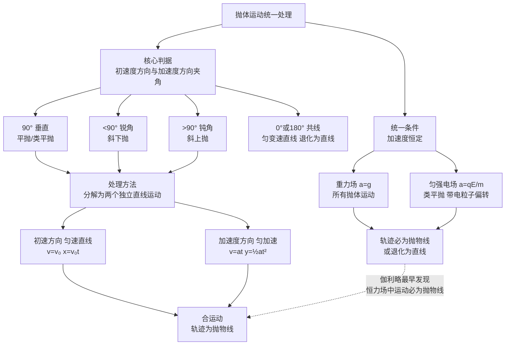

# 抛体运动综合

> [!abstract] 概览
> 本节是 [[01-运动学/06-平抛运动]] 的综合与扩展。平抛运动是抛体运动的"基本款"——初速度水平、加速度竖直向下的匀变速曲线运动。本节将抛体运动推广到一般情形：==斜抛运动==（初速度与水平方向成任意角度）、==斜面上的平抛==（落到斜面或从斜面抛出）以及==抛体运动的统一处理==（初速度与受力方向夹角决定轨迹类型）。核心思想仍是 [[01-运动的合成与分解]] 中的分解方法：将抛体运动分解为水平方向的匀速运动与竖直方向的匀变速运动（上抛或下抛）。最后通过与电场偏转的类比，建立==类平抛运动==的一般模型——只要受力恒定且与初速度垂直，运动即为类平抛。本节是力学与电学的"桥梁"章节，掌握后可无缝迁移到 [[01-静电场/05-带电粒子在电场中的运动]]。

## 核心概念

### 一、平抛运动复习

**定义**：物体只受重力作用，初速度==水平==的抛体运动。

**分解**：
- 水平方向（$x$）：匀速直线运动，$v_x=v_0$，$x=v_0 t$；
- 竖直方向（$y$）：自由落体，$v_y=gt$，$y=\dfrac{1}{2}gt^2$。

**关键公式**：
- 速度方向与水平方向夹角 $\theta$：$\tan\theta=\dfrac{v_y}{v_x}=\dfrac{gt}{v_0}$；
- 位移方向与水平方向夹角 $\alpha$：$\tan\alpha=\dfrac{y}{x}=\dfrac{gt}{2v_0}=\dfrac{1}{2}\tan\theta$；
- ==速度方向反向延长线交 $x$ 轴于 $\dfrac{x}{2}$==（中点性质）。

> [!note] 平抛的"二倍角关系"
> 速度方向与水平方向夹角的正切 $\tan\theta$ 是位移方向正切 $\tan\alpha$ 的==两倍==。这一关系源于 $v_y=gt$ 与 $y=\frac{1}{2}gt^2$ 中时间 $t$ 的幂次差异——速度是位移对时间的导数。这是平抛运动最深刻的几何性质之一。

### 二、斜抛运动

**定义**：物体只受重力作用，初速度==与水平方向成一定角度==（斜向上或斜向下）的抛体运动。

**典型情形**：初速度 $v_0$ 斜向上，与水平方向夹角 $\theta$（抛射角）。

**分解**：
- 水平方向（$x$）：匀速运动，$v_x=v_0\cos\theta$，$x=v_0\cos\theta\cdot t$；
- 竖直方向（$y$）：匀变速运动（初速上抛），$v_y=v_0\sin\theta - gt$，$y=v_0\sin\theta\cdot t - \dfrac{1}{2}gt^2$。

**轨迹方程**（消去 $t$）：
$$
\boxed{\,y = x\tan\theta - \dfrac{g x^2}{2v_0^2\cos^2\theta}\,}
$$

这是==抛物线方程==，故斜抛运动轨迹为抛物线。

### 三、抛体运动的统一处理

**核心思想**：抛体运动的轨迹类型取决于==初速度方向与受力（加速度）方向的夹角==。

| 初速与加速度夹角 | 运动类型 | 轨迹 |
| --- | --- | --- |
| $90°$（垂直） | 平抛 / 类平抛 | 抛物线 |
| $>90°$（钝角，加速度反向分量） | 斜上抛 | 抛物线 |
| $<90°$（锐角，加速度同向分量） | 斜下抛 | 抛物线 |
| $0°$ 或 $180°$（共线） | 匀变速直线 | 直线 |

> [!important] 抛体运动的本质
> 只要==加速度恒定==，无论初速度方向如何，运动轨迹都是==抛物线==（或退化为直线）。这是伽利略最早发现的运动学结论之一。在大学 [[牛顿力学]] 中，这对应于"恒力场中的运动必为抛物线"的一般定理。

### 四、斜面上的平抛

**两类典型问题**：

**类型 1：从斜面顶端平抛，落到斜面上**

设斜面倾角为 $\alpha$，物体从顶端以 $v_0$ 水平抛出，落到斜面上某点。

**关键关系**：落点位移方向与水平方向夹角等于斜面倾角 $\alpha$：
$$
\tan\alpha = \dfrac{y}{x} = \dfrac{\frac{1}{2}gt^2}{v_0 t} = \dfrac{gt}{2v_0}
$$
由此求出运动时间：
$$
\boxed{\,t = \dfrac{2v_0\tan\alpha}{g}\,}
$$

**类型 2：从斜面外平抛，垂直打到斜面上**

落点速度方向与斜面垂直。设斜面倾角 $\alpha$，速度方向与水平方向夹角 $\theta=90°-\alpha$（与斜面垂直）：
$$
\tan\theta = \dfrac{v_y}{v_0} = \dfrac{gt}{v_0} = \tan(90°-\alpha) = \cot\alpha
$$
由此：
$$
t = \dfrac{v_0\cot\alpha}{g}
$$

> [!tip] 斜面平抛的"两个夹角"
> - 落到斜面：用==位移==方向与水平方向夹角 $=$ 斜面倾角 $\alpha$；
> - 垂直打斜面：用==速度==方向与水平方向夹角 $=90°-\alpha$。
> 二者不要混淆！判断关键是看题目要求"落到斜面上"还是"垂直击中斜面"。

### 五、抛体运动与电场偏转的类比

**类比基础**：带电粒子在匀强电场中受力 $F=qE$ 恒定，加速度 $a=qE/m$ 恒定——与重力场中 $a=g$ 完全平行。

| 比较项 | 重力场中平抛 | 匀强电场中类平抛 |
| --- | --- | --- |
| 受力 | 重力 $mg$ | 电场力 $qE$ |
| 加速度 | $g$ | $a=qE/m$ |
| 初速度方向 | 水平 | 垂直场强方向 |
| 轨迹 | 抛物线 | 抛物线 |
| 处理方法 | 水平匀速 + 竖直匀加速 | 初速方向匀速 + 场强方向匀加速 |

> [!important] 类比的本质——运动学相同，受力本质不同
> 平抛与类平抛在==运动学==上完全相同（恒力 + 垂直初速 → 抛物线），但==受力本质不同==：重力是万有引力在地球表面的表现，方向始终指向地心；电场力是电荷间的相互作用，方向沿场强方向（正电荷同向，负电荷反向）。这种"运动学同构、动力学异质"的类比是物理学最强大的工具之一。

## 推导与原理

### 一、斜抛运动三大公式——射程、射高、飞行时间

设初速度 $v_0$、抛射角 $\theta$、重力加速度 $g$。

#### 1. 飞行时间 $T$

物体从抛出到落回==同一高度==（$y=0$）所用时间：
$$
y = v_0\sin\theta\cdot t - \dfrac{1}{2}gt^2 = 0
$$
解得 $t=0$（抛出时刻）或 $t=\dfrac{2v_0\sin\theta}{g}$（落地时刻），故：
$$
\boxed{\,T = \dfrac{2v_0\sin\theta}{g}\,}
$$

#### 2. 射高 $H$

最高点时竖直方向速度 $v_y=0$：
$$
v_0\sin\theta - gt_1 = 0 \;\Rightarrow\; t_1 = \dfrac{v_0\sin\theta}{g}
$$
此时刻的竖直位移即射高：
$$
\boxed{\,H = v_0\sin\theta\cdot t_1 - \dfrac{1}{2}gt_1^2 = \dfrac{v_0^2\sin^2\theta}{2g}\,}
$$

#### 3. 射程 $X$

落回同高度时的水平位移：
$$
\boxed{\,X = v_0\cos\theta\cdot T = \dfrac{v_0^2\sin 2\theta}{g}\,}
$$

#### 关键结论

- ==射高 $H$ 由 $\sin^2\theta$ 决定==，$\theta=90°$ 时最大（竖直上抛），但此时射程为零；
- ==射程 $X$ 由 $\sin 2\theta$ 决定==，$\theta=45°$ 时射程==最大==，$X_{\max}=\dfrac{v_0^2}{g}$；
- 互补角（$\theta$ 与 $90°-\theta$）射程相同：$\sin 2\theta=\sin(180°-2\theta)=\sin 2(90°-\theta)$。

> [!important] $45°$ 最大射程的物理意义
> $45°$ 是"水平速度"与"垂直速度"的最佳折中——既要飞得快（水平速度 $v_0\cos\theta$ 大），又要飞得久（飞行时间 $T$ 大，需 $v_0\sin\theta$ 大）。$45°$ 时两者乘积最大，这是数学优化的物理体现。注意此结论==仅在无空气阻力且落回同高度时成立==。

### 二、斜抛轨迹方程推导

由水平方向 $x=v_0\cos\theta\cdot t$ 解出 $t=\dfrac{x}{v_0\cos\theta}$，代入竖直方向：
$$
y = v_0\sin\theta\cdot\dfrac{x}{v_0\cos\theta} - \dfrac{1}{2}g\left(\dfrac{x}{v_0\cos\theta}\right)^2 = x\tan\theta - \dfrac{gx^2}{2v_0^2\cos^2\theta}
$$

这是 $y=ax+bx^2$ 形式的抛物线方程，开口向下（$b<0$）。

### 三、斜面上平抛的位移角关系推导

设斜面倾角 $\alpha$，物体从顶端以 $v_0$ 水平抛出。落点坐标 $(x,y)$ 满足：
$$
x = v_0 t, \quad y = \dfrac{1}{2}gt^2
$$
落到斜面上时，$\dfrac{y}{x}=\tan\alpha$：
$$
\dfrac{\frac{1}{2}gt^2}{v_0 t} = \tan\alpha \;\Rightarrow\; t = \dfrac{2v_0\tan\alpha}{g}
$$

落点到抛出点的距离：
$$
L = \dfrac{x}{\cos\alpha} = \dfrac{v_0 t}{\cos\alpha} = \dfrac{2v_0^2\tan\alpha}{g\cos\alpha}
$$

速度方向与水平方向夹角 $\varphi$：
$$
\tan\varphi = \dfrac{gt}{v_0} = 2\tan\alpha
$$

即==落到斜面时，速度方向与水平方向夹角的正切是斜面倾角正切的 2 倍==——这是平抛"二倍角关系"在斜面情境下的体现。

## 典型实例与类比

### 实例 1：篮球投篮——斜抛的"最佳角度"

篮球运动员投篮时，篮球做斜抛运动。理论上 $45°$ 射程最大，但实际投篮角度通常大于 $45°$，原因有二：（1）出手点高于篮筐（不在同一高度）；（2）需避开防守队员的封盖。出球点越高，最佳角度越小——这也是为什么高个子球员投篮角度可以更平。

### 实例 2：喷泉——抛物线轨迹的"可视化"

喷泉的水柱就是斜抛运动的集合——每个水滴做斜抛运动，整体形成抛物线形状。调节喷头角度可以改变水柱的射高与射程，$45°$ 时射程最远（无风时）。

### 实例 3：电场偏转——类平抛的"翻译"

带电粒子垂直射入匀强电场，做类平抛运动。只要把 $g$ 替换为 $a=qE/m$，所有平抛公式都适用。示波器、CRT 显示器、喷墨打印机都是这一原理的工程应用，详见 [[01-静电场/05-带电粒子在电场中的运动]]。

> [!tip] 记忆口诀
> ==平抛斜抛皆抛物，分解两向最清楚；射高 $v_0^2\sin^2\theta/(2g)$，射程 $v_0^2\sin 2\theta/g$；$45°$ 射程最大，互补角射程同；类平抛把 $g$ 换 $a$，运动学同力学异。==

## 例题

### 例 1：斜抛——射程与射高

**题目**：一物体以 $v_0=20\,\text{m/s}$、抛射角 $\theta=30°$ 做斜抛运动（$g$ 取 $10\,\text{m/s}^2$）。求：
（1）飞行时间 $T$；
（2）射高 $H$；
（3）射程 $X$；
（4）轨迹最高点的曲率半径。

**分析**：直接套用三大公式；最高点速度只有水平分量，由法向加速度 $g=v^2/\rho$ 求曲率半径。

**解答**：
（1）
$$
T = \dfrac{2v_0\sin\theta}{g} = \dfrac{2\times 20\times 0.5}{10} = 2\,\text{s}
$$

（2）
$$
H = \dfrac{v_0^2\sin^2\theta}{2g} = \dfrac{400\times 0.25}{20} = 5\,\text{m}
$$

（3）
$$
X = \dfrac{v_0^2\sin 2\theta}{g} = \dfrac{400\times\sin 60°}{10} = \dfrac{400\times 0.866}{10} \approx 34.64\,\text{m}
$$

（4）最高点速度 $v=v_0\cos\theta=20\times\dfrac{\sqrt{3}}{2}\approx 17.32\,\text{m/s}$，方向水平。重力提供向心力（法向）：$mg=\dfrac{mv^2}{\rho}$，故：
$$
\rho = \dfrac{v^2}{g} = \dfrac{(20\cos 30°)^2}{10} = \dfrac{300}{10} = 30\,\text{m}
$$

**点评**：第（4）问是难点——最高点速度沿水平方向，重力垂直速度向下即为法向，故 $g=v^2/\rho$。这一思想将在 [[03-圆周运动动力学]] 中反复用到。

### 例 2：斜面上的平抛——落到斜面

**题目**：如图，倾角 $\alpha=30°$ 的斜面顶端，物体以 $v_0=10\,\text{m/s}$ 水平抛出，落到斜面上（$g$ 取 $10\,\text{m/s}^2$）。求：
（1）物体运动时间 $t$；
（2）落点到抛出点的距离 $L$；
（3）物体落到斜面时速度方向与斜面的夹角。

**分析**：落到斜面，用位移方向与水平方向夹角 $=$ 斜面倾角 $\alpha$。

**解答**：
（1）由 $\tan\alpha=\dfrac{y}{x}=\dfrac{gt}{2v_0}$：
$$
t = \dfrac{2v_0\tan\alpha}{g} = \dfrac{2\times 10\times\tan 30°}{10} = \dfrac{2}{\sqrt{3}} \approx 1.155\,\text{s}
$$

（2）
$$
x = v_0 t = 10\times\dfrac{2}{\sqrt{3}} = \dfrac{20}{\sqrt{3}}\,\text{m}
$$
$$
L = \dfrac{x}{\cos\alpha} = \dfrac{20/\sqrt{3}}{\cos 30°} = \dfrac{20/\sqrt{3}}{\sqrt{3}/2} = \dfrac{40}{3} \approx 13.33\,\text{m}
$$

（3）速度方向与水平方向夹角 $\varphi$ 满足 $\tan\varphi=\dfrac{gt}{v_0}=\dfrac{10\times 2/\sqrt{3}}{10}=\dfrac{2}{\sqrt{3}}$。又 $\tan\alpha=\dfrac{1}{\sqrt{3}}$，故 $\tan\varphi=2\tan\alpha$（二倍角关系）。

速度方向与斜面夹角 $\beta=\varphi-\alpha$：
$$
\tan\beta = \tan(\varphi-\alpha) = \dfrac{\tan\varphi-\tan\alpha}{1+\tan\varphi\tan\alpha} = \dfrac{\frac{2}{\sqrt{3}}-\frac{1}{\sqrt{3}}}{1+\frac{2}{\sqrt{3}}\cdot\frac{1}{\sqrt{3}}} = \dfrac{\frac{1}{\sqrt{3}}}{\frac{5}{3}} = \dfrac{3}{5\sqrt{3}} = \dfrac{\sqrt{3}}{5}
$$
$\beta\approx 19.1°$。

**点评**：本题体现了"落到斜面用位移角、垂直打斜面用速度角"的区分。第（3）问结果 $\beta$ 与初速度 $v_0$ 无关——只要从斜面顶端水平抛出落到斜面，速度方向与斜面夹角恒定（仅由 $\alpha$ 决定），这是斜面平抛的一个有趣性质。

### 例 3：类平抛——电场中的偏转

**题目**：电子（质量 $m$、电量 $e$）以 $v_0=2.0\times 10^7\,\text{m/s}$ 沿水平方向射入两平行板间匀强电场，板长 $L=4\,\text{cm}$、板间距 $d=1\,\text{cm}$、板间电压 $U=200\,\text{V}$。求：
（1）电子在板间的运动时间 $t$；
（2）偏转量 $y$；
（3）出板时速度方向与初速度方向的夹角 $\theta$。

**分析**：电子在匀强电场中做类平抛运动，$a=eU/(md)$，套用平抛公式（$g\to a$）。

**解答**：
（1）水平方向匀速：
$$
t = \dfrac{L}{v_0} = \dfrac{0.04}{2.0\times 10^7} = 2.0\times 10^{-9}\,\text{s}
$$

（2）加速度：
$$
a = \dfrac{eU}{md} = \dfrac{1.6\times 10^{-19}\times 200}{9.1\times 10^{-31}\times 0.01} \approx 3.52\times 10^{15}\,\text{m/s}^2
$$
偏转量：
$$
y = \dfrac{1}{2}at^2 = \dfrac{1}{2}\times 3.52\times 10^{15}\times (2.0\times 10^{-9})^2 = 7.04\times 10^{-3}\,\text{m} = 7.04\,\text{mm}
$$

（3）
$$
\tan\theta = \dfrac{at}{v_0} = \dfrac{3.52\times 10^{15}\times 2.0\times 10^{-9}}{2.0\times 10^7} = 0.352
$$
$\theta\approx 19.4°$。

**点评**：本题与平抛运动的处理方法完全一致，只是把 $g$ 替换为 $a=qU/(md)$。这种"运动学同构"使我们可以把力学中的平抛经验无缝迁移到电场偏转——这正是 [[01-运动的合成与分解]] 中"分解方法"威力的体现。详细讨论见 [[01-静电场/05-带电粒子在电场中的运动]]。

## 易错提醒

> [!warning] 易错点
> 1. **斜抛运动落到不同高度时公式不直接适用**：射程公式 $X=\dfrac{v_0^2\sin 2\theta}{g}$ 仅在==落回同高度==时成立。若抛出点与落地点有高度差，需分别用 $x$、$y$ 方程联立求解。
> 2. **斜面平抛的"两个夹角"混淆**：落到斜面用位移角 $=$ 斜面角；垂直打斜面用速度角 $=90°-$ 斜面角。
> 3. **射高与最大高度混淆**：射高是==从抛出点到最高点==的高度差；若抛出点本身有高度，最大高度（相对地面）= 抛出点高度 + 射高。
> 4. **$45°$ 最大射程的适用条件**：仅在==无空气阻力且落回同高度==时成立。实际中有空气阻力时，最佳角度小于 $45°$（约 $35°\sim 40°$）。
> 5. **类平抛中重力是否忽略**：电子、质子等微观粒子重力可忽略；带电小球、油滴等必须考虑重力——判断标准是比较 $mg$ 与 $qE$。
> 6. **斜抛最高点速度不为零**：最高点竖直速度 $v_y=0$，但水平速度 $v_x=v_0\cos\theta\neq 0$——这是斜抛与竖直上抛的关键区别。

> [!note] 概念辨析
> **平抛 vs 斜抛**
> | 比较项 | 平抛 | 斜抛 |
> | --- | --- | --- |
> | 初速度方向 | 水平 | 斜向上/斜向下 |
> | 竖直方向运动 | 自由落体（$v_{y0}=0$） | 竖直上抛/下抛（$v_{y0}\neq 0$） |
> | 轨迹 | 抛物线（半支） | 抛物线（完整或部分） |
> | 最高点 | 抛出点 | 抛出点与落地点之间 |
>
> **平抛 vs 类平抛**
> | 比较项 | 平抛 | 类平抛 |
> | --- | --- | --- |
> | 受力 | 重力 $mg$ | 任意恒力（如电场力 $qE$） |
> | 加速度 | $g$ | $a=F/m$ |
> | 力的本质 | 万有引力 | 因力而异 |
> | 运动学 | 抛物线 | 抛物线（完全相同） |

## 与其他知识关联

- 与 [[01-运动的合成与分解]] 的关系：抛体运动是运动合成与分解的典型应用——分解为水平匀速 + 竖直匀变速。
- 与 [[02-抛体运动综合]] 的关系：本节即此主题。
- 与 [[03-圆周运动动力学]] 的关系：斜抛最高点的曲率半径 $\rho=v^2/g$ 用到了圆周运动 $a_n=v^2/r$ 的思想；最高点局部可视为瞬时圆周运动。
- 与 [[04-万有引力与航天]] 的关系：抛体运动在初速度增大到第一宇宙速度时变为卫星运动——牛顿最早设想的"牛顿炮"思想实验连接了抛体与天体运动。
- 与 [[01-运动学/06-平抛运动]] 的关系：平抛运动是本节的基础，本节是其综合与推广。
- 与 [[01-运动学/07-圆周运动]] 的关系：抛体运动最高点的曲率分析借用圆周运动概念。
- 与 [[02-牛顿运动定律/06-牛顿第二定律]] 的关系：抛体运动加速度 $a=g$（或 $a=qE/m$）由牛顿第二定律决定。
- 高中—大学衔接：[[动能与动量]]、[[碰撞详解]]、[[机械振动]]、[[拉格朗日方程]]、[[牛顿力学]]
- 与电学联系：[[01-静电场/05-带电粒子在电场中的运动]]（类平抛——核心类比）、[[03-磁场/04-带电粒子在磁场中的运动]]（圆周运动，与抛体形成对比）
- 返回 [[00-力学总览]]

## 作者的话

> [!quote] 个人理解
> 抛体运动是运动学最优雅的章节——伽利略用分解方法把看似复杂的曲线运动化归为两个简单的直线运动，这一思想至今仍是物理学的核心方法论。我个人觉得斜抛三大公式（射程、射高、飞行时间）最美的不是公式本身，而是它们揭示的对称性：$45°$ 最大射程源于 $\sin 2\theta$ 的性质，互补角射程相同源于 $\sin 2\theta=\sin 2(90°-\theta)$——数学结构直接对应物理对称。更深刻的是==抛体运动与电场偏转的类比==：一旦意识到"重力场就是一个特殊的匀强场"，力学中所有抛体经验都可以"翻译"到电场中。这种"运动学同构、动力学异质"的类比思维，是物理学最强大的统一工具——从牛顿统一天地力学，到麦克斯韦统一电与磁，再到爱因斯坦统一时空与引力，物理学的每一次飞跃都伴随着类比与统一。建议读者在学完本节后，立刻对照 [[01-静电场/05-带电粒子在电场中的运动]] 学习，体会这种类比的威力。最后，抛体运动还有一个常被忽视的深层含义：当平抛的初速度增大到第一宇宙速度 $7.9\,\text{km/s}$ 时，抛体不再落回地面，而是成为绕地卫星——这就是 [[04-万有引力与航天]] 中牛顿炮的思想实验。从地面到天空，从抛体到卫星，运动学的统一之美在这里达到顶峰，最终在大学 [[牛顿力学]] 中升华为更一般的分析力学表述。

---
*返回 [[00-力学总览]]*
