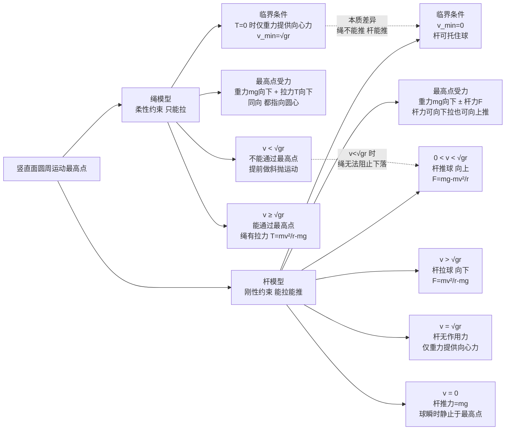

# 圆周运动动力学

> [!abstract] 概览
> 本节是 [[01-运动学/07-圆周运动]] 的"动力学篇"——回答"为什么做圆周运动"。核心概念是==向心力==：它是效果力而非真实存在的力，由重力、弹力、摩擦力、电磁力等真实力（或其合力、分力）提供，大小 $F_n=\dfrac{mv^2}{r}=m\omega^2 r$，方向始终指向圆心。本节系统分析各类圆周运动的向心力来源：水平面圆周（汽车转弯、圆锥摆、火车弯道）与竖直面圆周（绳模型与杆模型的临界条件对比）。==临界问题==是高考热点——绳模型最高点临界速度 $v_{\min}=\sqrt{gr}$，杆模型最高点临界速度 $v_{\min}=0$，二者本质差异源于杆既能拉也能推。最后讨论==离心运动与向心运动==的"供需关系"：当提供的向心力小于所需向心力时，物体做离心运动；反之做向心运动。洗衣机脱水、过山车、汽车转弯打滑都是这一原理的体现。本节是力学综合应用的核心章节，也是 [[04-万有引力与航天]] 中卫星运动的理论基础。

## 核心概念

### 一、向心力——效果力，不是真实存在的力

**定义**：做圆周运动的物体所受的==指向圆心==的合外力，称为向心力。

**公式**：
$$
\boxed{\,F_n = \dfrac{mv^2}{r} = m\omega^2 r = m\dfrac{4\pi^2}{T^2}r\,}
$$

**方向**：始终指向圆心，与速度方向==垂直==，故向心力==不做功==——只改变速度方向，不改变速度大小。

**关键认识**：
1. ==向心力是效果力==，不是一种"新的力"。它由物体实际受到的真实力（重力、弹力、摩擦力、电磁力等）的合力沿半径方向的分量提供。
2. 分析圆周运动问题时，==先找真实力==，再求其沿半径方向的合力，即得向心力。

> [!note] 向心力 vs 真实力
> 向心力是一个"角色"概念——它告诉你"这些真实力的合力起到了什么效果"。例如圆锥摆中，重力与绳拉力的合力指向圆心提供向心力；汽车水平转弯时，静摩擦力扮演向心力；卫星绕地球时，万有引力就是向心力。==不要在受力分析图中额外画一个"向心力"==——它不是真实存在的力！

### 二、向心力的来源分析

| 情境 | 向心力来源 | 公式 |
| --- | --- | --- |
| 卫星绕地球 | 万有引力 | $G\dfrac{Mm}{r^2}=\dfrac{mv^2}{r}$ |
| 汽车水平转弯 | 路面静摩擦力 | $f=\dfrac{mv^2}{r}\leq \mu mg$ |
| 圆锥摆 | 重力与拉力的合力 | $mg\tan\theta=\dfrac{mv^2}{r}$ |
| 火车弯道（外轨高） | 重力与支持力的合力 | $mg\tan\alpha=\dfrac{mv^2}{r}$ |
| 竖直面绳模型（最高点） | 重力 + 绳拉力 | $mg+T=\dfrac{mv^2}{r}$ |
| 竖直面杆模型（最高点） | 重力 ± 杆作用力 | $mg\pm F=\dfrac{mv^2}{r}$ |
| 带电粒子在磁场 | 洛伦兹力 | $qvB=\dfrac{mv^2}{r}$ |

### 三、水平面圆周运动

#### 1. 汽车转弯

汽车在水平路面上转弯，向心力由轮胎与路面间的==静摩擦力==提供：
$$
f = \dfrac{mv^2}{r} \leq f_{\max} = \mu mg
$$

临界条件（不打滑的最大速度）：
$$
\boxed{\,v_{\max} = \sqrt{\mu g r}\,}
$$

超过此速度，汽车做离心运动（打滑向外）。

#### 2. 圆锥摆

摆线长 $L$，与竖直方向夹角 $\theta$，摆球在水平面做圆周运动，圆半径 $r=L\sin\theta$。

**受力分析**：重力 $mg$ 向下，绳拉力 $T$ 沿绳。

**正交分解**：
- 竖直方向平衡：$T\cos\theta = mg$；
- 水平方向（向心）：$T\sin\theta = \dfrac{mv^2}{r}$。

两式相除：
$$
\tan\theta = \dfrac{v^2}{gr} = \dfrac{\omega^2 r}{g}
$$

代入 $r=L\sin\theta$：
$$
\boxed{\,\omega = \sqrt{\dfrac{g}{L\cos\theta}},\quad T = \dfrac{2\pi}{\omega} = 2\pi\sqrt{\dfrac{L\cos\theta}{g}}\,}
$$

> [!important] 圆锥摆的"反直觉"性质
> 圆锥摆的周期 $T$ ==只与 $L\cos\theta$（等效摆长）有关==，与摆球质量 $m$ 无关——这与单摆周期公式 $T=2\pi\sqrt{l/g}$ 形式相同。两个不同质量的摆球在同一圆锥摆上同时转动，周期相同。

#### 3. 火车弯道

弯道处外轨比内轨高（外轨超高），倾角 $\alpha$。

**理想速度**（轮缘与轨道无侧向压力）：
$$
mg\tan\alpha = \dfrac{mv^2}{r} \;\Rightarrow\; \boxed{\,v_0 = \sqrt{gr\tan\alpha}\,}
$$

- $v=v_0$：轮缘不受侧向压力；
- $v>v_0$：外轨对轮缘有向内的侧向压力；
- $v<v_0$：内轨对轮缘有向外的侧向压力。

### 四、竖直面圆周运动——绳模型与杆模型

竖直面圆周运动是高考==重点难点==，关键在于最高点与最低点的临界条件。

#### 1. 绳模型（物体被绳拉着，或仅有向外约束）

**模型**：绳长 $r$，一端系小球，在竖直面内做圆周运动。绳只能拉不能推。

**最高点受力**：重力 $mg$ 向下 + 绳拉力 $T$ 向下（都指向圆心）：
$$
mg + T = \dfrac{mv^2}{r}
$$

**临界条件**：绳恰好拉直但拉力为零（$T=0$）时，仅由重力提供向心力：
$$
\boxed{\,mg = \dfrac{mv_{\min}^2}{r} \;\Rightarrow\; v_{\min} = \sqrt{gr}\,}
$$

- $v \geq \sqrt{gr}$：能通过最高点，绳有拉力 $T=\dfrac{mv^2}{r}-mg\geq 0$；
- $v < \sqrt{gr}$：==不能通过最高点==，小球在到达最高点前做斜抛运动。

**最低点受力**：重力 $mg$ 向下 + 绳拉力 $T$ 向上（拉力指向圆心）：
$$
T - mg = \dfrac{mv^2}{r} \;\Rightarrow\; T = mg + \dfrac{mv^2}{r}
$$

最低点拉力==最大==，最容易断绳。

#### 2. 杆模型（物体被轻杆连接，杆既能拉也能推）

**模型**：轻杆长 $r$，一端连小球，在竖直面内做圆周运动。杆既能拉（向心方向）也能推（离心方向）。

**最高点受力**：重力 $mg$ 向下，杆作用力 $F$ 可向下（拉）也可向上（推）：
$$
mg \pm F = \dfrac{mv^2}{r}
$$

**临界条件**：杆模型最高点==临界速度为零==：
$$
\boxed{\,v_{\min} = 0\,}
$$

- $v > \sqrt{gr}$：杆对球==拉力==向下，$F=\dfrac{mv^2}{r}-mg$；
- $v = \sqrt{gr}$：杆作用力为零，仅重力提供向心力；
- $0 < v < \sqrt{gr}$：杆对球==推力==向上，$F=mg-\dfrac{mv^2}{r}$；
- $v = 0$：球恰好能通过最高点（杆推力 $F=mg$，球瞬时静止）。

> [!important] 绳模型 vs 杆模型——本质差异
>
> | 比较项 | 绳模型 | 杆模型 |
> | --- | --- | --- |
> | 约束类型 | 柔性（只能拉） | 刚性（能拉能推） |
> | 最高点临界速度 | $v_{\min}=\sqrt{gr}$ | $v_{\min}=0$ |
> | 最高点力 | 重力 + 拉力（同向） | 重力 ± 杆力（可反向） |
> | 物理本质 | 绳不能"推"球过最高点 | 杆可以"托"球过最高点 |
>
> ==临界速度的本质==：绳模型中，若 $v<\sqrt{gr}$，所需向心力 $\dfrac{mv^2}{r}<mg$，重力"过剩"使球加速下落，绳无法提供向上的力阻止——故不能通过。杆模型中，杆可以提供向上的推力抵消"过剩"的重力，故 $v=0$ 也能通过。

### 五、离心运动与向心运动

**供需关系分析**：物体做半径为 $r$、速度为 $v$ 的圆周运动，==所需==向心力 $F_{需}=\dfrac{mv^2}{r}$。

| 供需关系 | 运动状态 | 实例 |
| --- | --- | --- |
| $F_{供} = F_{需}$ | 匀速圆周运动 | 正常转弯 |
| $F_{供} < F_{需}$ | ==离心运动==（向外，$r$ 增大） | 汽车打滑、洗衣机脱水 |
| $F_{供} > F_{需}$ | ==向心运动==（向内，$r$ 减小） | 转弯过猛、自行车急转 |

**离心运动的两种理解**：
1. **惯性视角**：物体由于惯性想沿切线飞出（直线），但被向心力"拉回"圆周。当向心力不足时，物体偏离圆周向外——本质是惯性表现，==不存在"离心力"==（在惯性系中）。
2. **供需视角**：所需向心力大于提供的向心力，物体做离心运动，半径增大。

**洗衣机脱水原理**：衣物随转筒做圆周运动，所需向心力 $F_{需}=\dfrac{mv^2}{r}$ 随转速增大而增大。当 $F_{需}$ 大于衣物所受附着力（提供的向心力）时，衣物做离心运动，水滴穿过筒孔被甩出——==脱水==。

> [!warning] "离心力"是假想力
> 在惯性参考系中，==不存在"离心力"==这种真实力。物体"向外飞"是因为惯性（想沿切线飞出），不是被某个力推出去。只有在==旋转的非惯性参考系==中，为应用牛顿定律才引入假想的"离心力"（惯性力）。高考中务必避免使用"离心力"一词描述惯性系中的现象。

## 推导与原理

### 一、圆锥摆公式的详细推导

**模型**：摆线长 $L$ 与竖直方向夹角 $\theta$，摆球质量 $m$ 在水平面内做圆周运动。

**步骤 1：受力分析**
- 重力 $mg$ 竖直向下；
- 绳拉力 $T$ 沿绳斜向上。

**步骤 2：确定圆心与半径**
圆心在悬点正下方，与摆球同一水平面；半径 $r=L\sin\theta$。

**步骤 3：正交分解**（沿水平径向与竖直方向）
- 竖直方向：$T\cos\theta - mg = 0$（无竖直加速度）
- 水平径向（向心）：$T\sin\theta = m\omega^2 r = m\omega^2 L\sin\theta$

**步骤 4：求解**
由水平径向方程：$T = m\omega^2 L$（注意 $\sin\theta$ 约掉）
代入竖直方程：$m\omega^2 L\cos\theta = mg$，故：
$$
\boxed{\,\omega^2 = \dfrac{g}{L\cos\theta}\,}
$$

**周期**：
$$
T = 2\pi\sqrt{\dfrac{L\cos\theta}{g}}
$$

**线速度**：
$$
v = \omega r = \omega L\sin\theta = \sqrt{\dfrac{g}{L\cos\theta}}\cdot L\sin\theta = \sqrt{\dfrac{gL\sin^2\theta}{\cos\theta}}
$$

### 二、绳模型最高点临界速度的推导

**模型**：绳长 $r$，一端系质量为 $m$ 的小球，在竖直面内做圆周运动。

**最高点受力**：
- 重力 $mg$（向下，即指向圆心方向）；
- 绳拉力 $T$（向下，即指向圆心方向）。

合力提供向心力：
$$
mg + T = \dfrac{mv^2}{r}
$$

**临界条件**：绳==恰好拉直==但拉力为零（$T=0$）。此时仅重力提供向心力：
$$
mg = \dfrac{mv_{\min}^2}{r} \;\Rightarrow\; v_{\min} = \sqrt{gr}
$$

**为什么不能更小**：若 $v<\sqrt{gr}$，所需向心力 $\dfrac{mv^2}{r}<mg$，但绳不能提供向上的力（绳只能拉不能推），重力"过剩"部分使小球加速下落——小球在到达最高点前就脱离圆周做斜抛运动。

### 三、杆模型最高点临界速度的推导

**模型**：轻杆长 $r$，一端连小球，在竖直面内做圆周运动。

**最高点受力**：
- 重力 $mg$（向下，指向圆心）；
- 杆作用力 $F$：可向下（拉力）或向上（推力）。

设 $F$ 向下为正：
$$
mg + F = \dfrac{mv^2}{r} \;\Rightarrow\; F = \dfrac{mv^2}{r} - mg
$$

**讨论**：
- $v > \sqrt{gr}$：$F > 0$，杆==拉==球（向下）；
- $v = \sqrt{gr}$：$F = 0$，杆无作用力；
- $0 < v < \sqrt{gr}$：$F < 0$，杆==推==球（向上）；
- $v = 0$：$F = -mg$，杆推力恰好等于重力，球瞬时静止于最高点。

**临界条件**：$v_{\min}=0$。杆可以提供任意方向的力（拉或推），故即使 $v=0$，杆也能"托住"球使其不掉落。

## 典型实例与类比

### 实例 1：过山车——绳模型的工程应用

过山车环形轨道是==绳模型==的典型应用：轨道对车的约束相当于"绳"（只能向内压，不能向外推）。车通过最高点的临界速度 $v_{\min}=\sqrt{gr}$。设计过山车时必须保证最低点速度足够大，使车在最高点速度 $\geq\sqrt{gr}$——否则车会脱离轨道坠落。

### 实例 2：汽车转弯打滑——离心运动

汽车以速度 $v$ 转弯（半径 $r$），所需向心力 $\dfrac{mv^2}{r}$ 由静摩擦力提供（最大 $\mu mg$）。若 $\dfrac{mv^2}{r}>\mu mg$（即 $v>\sqrt{\mu gr}$），摩擦力不足，汽车做==离心运动==向外滑出。这也是为什么雨天（$\mu$ 减小）要减速——降低 $v$ 使所需向心力减小。

### 实例 3：洗衣机脱水——离心运动的工程应用

转筒高速旋转，衣物随筒做圆周运动。水滴所需向心力由衣物对水滴的附着力提供，附着力有上限。当转速足够大时，附着力不足以提供所需向心力，水滴做离心运动穿过筒孔被甩出——脱水。脱水效率取决于转速（$\omega$ 越大越容易脱水）与筒孔大小。

> [!tip] 记忆口诀
> ==向心力是效果力，真实力的合力它担当；水平转弯靠摩擦，圆锥摆用 tanθ；火车弯道外轨高，理想速度 $\sqrt{gr\tan\alpha}$；绳模型最高 $\sqrt{gr}$，杆模型最高零不假；离心供小需变大，供需相等是圆周。==

## 例题

### 例 1：圆锥摆

**题目**：一圆锥摆摆线长 $L=1\,\text{m}$，摆球质量 $m=0.5\,\text{kg}$，摆线与竖直方向夹角 $\theta=37°$（$g$ 取 $10\,\text{m/s}^2$，$\sin 37°=0.6$，$\cos 37°=0.8$）。求：
（1）摆球的角速度 $\omega$；
（2）摆球的线速度 $v$；
（3）绳的拉力 $T$；
（4）摆球的周期。

**分析**：圆锥摆标准模型，用 $\omega^2=\dfrac{g}{L\cos\theta}$ 等公式求解。

**解答**：
（1）
$$
\omega = \sqrt{\dfrac{g}{L\cos\theta}} = \sqrt{\dfrac{10}{1\times 0.8}} = \sqrt{12.5} \approx 3.54\,\text{rad/s}
$$

（2）圆半径 $r=L\sin\theta=1\times 0.6=0.6\,\text{m}$：
$$
v = \omega r = 3.54\times 0.6 \approx 2.12\,\text{m/s}
$$

（3）由 $T\cos\theta=mg$：
$$
T = \dfrac{mg}{\cos\theta} = \dfrac{0.5\times 10}{0.8} = 6.25\,\text{N}
$$

（4）
$$
T_{周期} = \dfrac{2\pi}{\omega} = \dfrac{2\pi}{3.54} \approx 1.78\,\text{s}
$$

**点评**：圆锥摆的拉力 $T=\dfrac{mg}{\cos\theta}>mg$——拉力大于重力，因为拉力既要平衡重力（竖直分量）又要提供向心力（水平分量）。注意周期与质量无关，这是圆锥摆的"反直觉"性质。

### 例 2：竖直面绳模型——最高点临界

**题目**：长 $r=0.4\,\text{m}$ 的轻绳一端系质量 $m=0.5\,\text{kg}$ 的小球，在竖直面内做圆周运动（$g$ 取 $10\,\text{m/s}^2$）。小球通过最高点时速度 $v=3\,\text{m/s}$。求：
（1）绳的拉力 $T$；
（2）小球通过最低点时绳的拉力 $T'$（设最低点速度 $v'=5\,\text{m/s}$）；
（3）小球通过最高点的最小速度 $v_{\min}$；
（4）若小球在最高点速度 $v=1\,\text{m/s}$，会发生什么？

**分析**：最高点 $mg+T=\dfrac{mv^2}{r}$；最低点 $T'-mg=\dfrac{mv'^2}{r}$；临界 $v_{\min}=\sqrt{gr}$。

**解答**：
（1）
$$
T = \dfrac{mv^2}{r} - mg = \dfrac{0.5\times 9}{0.4} - 0.5\times 10 = 11.25 - 5 = 6.25\,\text{N}
$$

（2）
$$
T' = mg + \dfrac{mv'^2}{r} = 5 + \dfrac{0.5\times 25}{0.4} = 5 + 31.25 = 36.25\,\text{N}
$$

（3）
$$
v_{\min} = \sqrt{gr} = \sqrt{10\times 0.4} = 2\,\text{m/s}
$$

（4）$v=1\,\text{m/s} < v_{\min}=2\,\text{m/s}$，绳松弛（$T<0$ 不可能），小球==不能通过最高点==，在到达最高点前某位置开始做斜抛运动，绳不再拉直。

**点评**：绳模型最高点拉力 $T=\dfrac{mv^2}{r}-mg$，最低点拉力 $T'=mg+\dfrac{mv'^2}{r}$——最低点拉力远大于最高点，故==绳最容易在最低点断==。这是过山车设计的关键约束。

### 例 3：竖直面杆模型——力方向变化

**题目**：长 $r=0.4\,\text{m}$ 的轻杆一端连质量 $m=0.5\,\text{kg}$ 的小球，在竖直面内做圆周运动（$g$ 取 $10\,\text{m/s}^2$）。小球通过最高点时速度 $v$ 分别为：（a）$v=3\,\text{m/s}$；（b）$v=2\,\text{m/s}$；（c）$v=1\,\text{m/s}$；（d）$v=0$。求各情况下杆对球的作用力大小与方向。

**分析**：杆模型 $F=\dfrac{mv^2}{r}-mg$，$F>0$ 为向下拉力，$F<0$ 为向上推力。

**解答**：临界速度 $v_0=\sqrt{gr}=\sqrt{4}=2\,\text{m/s}$。

（a）$v=3\,\text{m/s}>v_0$：杆==拉==球向下
$$
F = \dfrac{0.5\times 9}{0.4} - 5 = 11.25 - 5 = 6.25\,\text{N}\,(\text{向下})
$$

（b）$v=2\,\text{m/s}=v_0$：杆作用力为零
$$
F = 0
$$

（c）$v=1\,\text{m/s}<v_0$：杆==推==球向上
$$
F = \dfrac{0.5\times 1}{0.4} - 5 = 1.25 - 5 = -3.75\,\text{N}\,(\text{向上推，大小 }3.75\,\text{N})
$$

（d）$v=0$：杆推力恰好等于重力
$$
F = -mg = -5\,\text{N}\,(\text{向上推，大小 }5\,\text{N})
$$

**点评**：杆模型中力的方向随速度变化而变化——$v>\sqrt{gr}$ 时拉，$v<\sqrt{gr}$ 时推，$v=\sqrt{gr}$ 时无力。这一对比鲜明展示了杆与绳的本质差异：杆是刚性约束，能拉能推；绳是柔性约束，只能拉。

### 例 4：临界问题——汽车转弯

**题目**：汽车质量 $m=1.5\times 10^3\,\text{kg}$，在水平弯道上转弯，弯道半径 $r=50\,\text{m}$，汽车与路面动摩擦因数 $\mu=0.4$（$g$ 取 $10\,\text{m/s}^2$）。求：
（1）汽车不打滑的最大速度 $v_{\max}$；
（2）若汽车以 $v=20\,\text{m/s}$ 通过弯道，会发生什么？
（3）若将弯道改为外轨超高（倾角 $\alpha$），理想速度 $v_0=20\,\text{m/s}$ 时 $\alpha$ 多大？

**分析**：水平转弯临界 $v_{\max}=\sqrt{\mu gr}$；外轨超高理想速度 $v_0=\sqrt{gr\tan\alpha}$。

**解答**：
（1）
$$
v_{\max} = \sqrt{\mu gr} = \sqrt{0.4\times 10\times 50} = \sqrt{200} \approx 14.14\,\text{m/s}
$$

（2）$v=20\,\text{m/s} > v_{\max}=14.14\,\text{m/s}$，所需向心力 $\dfrac{mv^2}{r}=\dfrac{1500\times 400}{50}=12000\,\text{N}$，最大静摩擦力 $\mu mg=0.4\times 1500\times 10=6000\,\text{N}$，==供<需==，汽车做==离心运动==向外打滑。

（3）由 $v_0=\sqrt{gr\tan\alpha}$：
$$
\tan\alpha = \dfrac{v_0^2}{gr} = \dfrac{400}{10\times 50} = 0.8 \;\Rightarrow\; \alpha\approx 38.66°
$$

**点评**：外轨超高（或弯道外侧加高）是工程上避免离心打滑的有效方法——把重力沿斜面的分量"借"来做向心力，减少对摩擦力的依赖。这就是为什么高速公路弯道外侧总比内侧高。

## 易错提醒

> [!warning] 易错点
> 1. **把向心力当作真实力**：向心力是效果力，由真实力（重力、弹力、摩擦力等）的合力提供。受力分析时==不要额外画向心力==。
> 2. **绳模型与杆模型临界条件混淆**：绳模型 $v_{\min}=\sqrt{gr}$，杆模型 $v_{\min}=0$。混淆会导致临界问题全错。
> 3. **杆模型力的方向判断错**：$v>\sqrt{gr}$ 时杆拉球（向下），$v<\sqrt{gr}$ 时杆推球（向上）——方向随速度变化。
> 4. **竖直面圆周运动最低点 vs 最高点**：最高点拉力 $T=\dfrac{mv^2}{r}-mg$（绳）或 $F=\dfrac{mv^2}{r}-mg$（杆）；最低点拉力 $T'=mg+\dfrac{mv'^2}{r}$——最低点拉力更大，绳最容易断。
> 5. **离心运动误用"离心力"**：惯性系中不存在"离心力"，离心运动是惯性表现（向心力不足导致半径增大）。
> 6. **圆锥摆周期与质量无关**：$T=2\pi\sqrt{\dfrac{L\cos\theta}{g}}$ 只与 $L\cos\theta$ 和 $g$ 有关，与 $m$ 无关——类比单摆。
> 7. **汽车转弯临界速度公式记忆错**：$v_{\max}=\sqrt{\mu gr}$，不是 $\sqrt{\mu g/r}$——可通过量纲检验（$\sqrt{\mu gr}$ 量纲为速度）。

> [!note] 概念辨析
> **绳模型 vs 杆模型**
>
> | 比较项 | 绳模型 | 杆模型 |
> | --- | --- | --- |
> | 约束性质 | 柔性（只能拉） | 刚性（能拉能推） |
> | 最高点临界速度 | $\sqrt{gr}$ | $0$ |
> | 最高点最小力 | $0$（绳恰拉直） | $-mg$（杆推力等于重力） |
> | 力的方向 | 始终指向圆心（向下） | 可指向圆心或背离圆心 |
> | 应用 | 过山车、水流星 | 球在管内、轻杆球 |
>
> **向心力 vs 真实力**
> 向心力是"效果"——告诉合力起到什么作用；真实力是"原因"——重力、弹力、摩擦力等。分析时先找真实力，再求合力沿径向分量即向心力。

## 与其他知识关联

- 与 [[01-运动的合成与分解]] 的关系：圆周运动速度沿切向，向心力沿径向——运动分解思想在圆周运动中的体现。
- 与 [[02-抛体运动综合]] 的关系：斜抛最高点的曲率半径 $\rho=v^2/g$ 用到圆周运动瞬时曲率的概念。
- 与 [[03-圆周运动动力学]] 的关系：本节即此主题。
- 与 [[04-万有引力与航天]] 的关系：卫星绕地球运动的向心力由万有引力提供，是圆周运动动力学在天体运动中的直接应用——$G\dfrac{Mm}{r^2}=\dfrac{mv^2}{r}$。
- 与 [[01-运动学/07-圆周运动]] 的关系：运动学篇提供描述量（$v$、$\omega$、$T$、$a_n$），本节提供动力学解释（向心力来源）。
- 与 [[02-牛顿运动定律/06-牛顿第二定律]] 的关系：向心力公式 $F_n=\dfrac{mv^2}{r}$ 是牛顿第二定律 $F=ma$ 在圆周运动中的具体化（$a=a_n=\dfrac{v^2}{r}$）。
- 高中—大学衔接：[[动能与动量]]、[[碰撞详解]]、[[机械振动]]、[[拉格朗日方程]]、[[牛顿力学]]
- 与电学联系：[[03-磁场/04-带电粒子在磁场中的运动]]（洛伦兹力提供向心力，$r=\dfrac{mv}{qB}$）、[[01-静电场/05-带电粒子在电场中的运动]]（电场力与圆周运动复合）
- 返回 [[00-力学总览]]

## 作者的话

> [!quote] 个人理解
> 圆周运动动力学是高中物理"概念辨析"的高峰——==向心力是不是力==这个问题困扰过无数初学者。我的理解是：向心力是"角色"而非"演员"——它告诉你"哪些真实力的合力起到了改变运动方向的作用"，但它本身不是一种独立的力。这种"效果力 vs 真实力"的区分，是物理学概念清晰化的关键一步，也为后续学习电磁力、核力等"真实力"奠定基础。==绳模型与杆模型的对比==则是我个人觉得本节最精彩的部分：仅仅因为约束性质不同（柔性 vs 刚性），临界速度就从 $\sqrt{gr}$ 变为 $0$——这种"细节决定物理"的特性，正是物理学魅力的体现。学习时建议用"供需关系"理解一切圆周运动问题：先算==所需向心力== $\dfrac{mv^2}{r}$，再分析==提供的向心力==（真实力的径向合力），比较二者即可判断运动状态（圆周 / 离心 / 向心）。这一框架不仅适用于力学，也适用于 [[03-磁场/04-带电粒子在磁场中的运动]] 中的洛伦兹力圆周、[[04-万有引力与航天]] 中的卫星运动——统一的思维框架是物理学的至高智慧。最后，离心运动那个"没有离心力"的辨析，是我高中时最大的认知冲击之一：原来我们日常说的"离心力"在惯性系中根本不存在，物体"向外飞"只是惯性表现。这种"破除直觉、建立严谨概念"的过程，正是物理学教育的核心价值。最终，圆周运动动力学将在大学 [[牛顿力学]] 中以分析力学的形式重新表述，并在 [[拉格朗日方程]] 中通过约束力学深入理解——但"供需关系"这一直觉框架，永远是最强大的物理思维工具。

---
*返回 [[00-力学总览]]*
