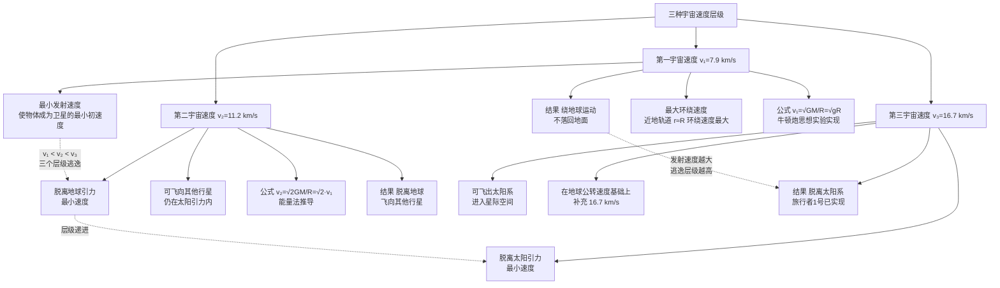

# 宇宙航行与拓展

> [!abstract] 概览
> 本节是力学综合应用版块的"收官篇"，将 [[04-万有引力与航天]] 的理论基础推广到航天工程与宇宙学的广阔图景。核心内容包括：（1）==三种宇宙速度==的物理意义与计算（第一 $7.9\,\text{km/s}$、第二 $11.2\,\text{km/s}$、第三 $16.7\,\text{km/s}$）；（2）==同步卫星==的定轨三要素（周期 $24\,\text{h}$、赤道上空、高度约 $36000\,\text{km}$）及其与近地卫星、极地卫星的对比；（3）==双星系统==的详细推导（两星绕共同圆心运动，角速度相同，半径与质量反比）；（4）==三星系统==简介；（5）现代宇宙学拓展：==黑洞==（史瓦西半径）、==引力波==（LIGO 探测）、==牛顿力学的适用范围与相对论修正==。本节是高中力学向现代物理学的"桥梁"——从卫星轨道到黑洞、从经典力学到相对论，揭示了牛顿力学的边界与超越。最终通向大学层面的 [[场方程与施瓦西解]]、[[引力波与黑洞]] 与 [[钟慢尺缩与质增]]。

## 核心概念

### 一、三种宇宙速度的物理意义

#### 第一宇宙速度 $v_1=7.9\,\text{km/s}$

**物理意义**：
- ==最小发射速度==：使物体成为地球卫星所需的最小初速度；
- ==最大环绕速度==：近地轨道（$r\approx R$）上卫星的环绕速度最大。

**公式**：
$$
v_1 = \sqrt{\dfrac{GM}{R}} = \sqrt{gR} \approx 7.9\,\text{km/s}
$$

**理解**：当物体水平速度达到 $v_1$ 时，其"下落"与地面弯曲同步，永不落地——牛顿炮思想实验的实现。

#### 第二宇宙速度 $v_2=11.2\,\text{km/s}$

**物理意义**：==脱离地球引力==的最小速度。物体达到此速度后可飞离地球引力范围（但仍在太阳引力内）。

**公式**：
$$
v_2 = \sqrt{\dfrac{2GM}{R}} = \sqrt{2}\,v_1 \approx 11.2\,\text{km/s}
$$

**理解**：$v_2=\sqrt{2}v_1$——第二宇宙速度是第一宇宙速度的 $\sqrt{2}$ 倍。推导见后（能量法）。

#### 第三宇宙速度 $v_3=16.7\,\text{km/s}$

**物理意义**：==脱离太阳引力==的最小速度。物体达到此速度后可飞出太阳系。

**数值**：$v_3\approx 16.7\,\text{km/s}$。

**理解**：$v_3$ 是在地球公转速度基础上再加速度脱离太阳引力。地球公转速度约 $29.8\,\text{km/s}$，但物体从地球发射时已"借用"了地球公转速度，故只需补充 $16.7\,\text{km/s}$。

> [!important] 三种速度的层级关系
> $v_1 < v_2 < v_3$，对应三个层级的"逃逸"：
> - $v_1$：绕地球（不落回地面）；
> - $v_2$：脱离地球（飞向其他行星）；
> - $v_3$：脱离太阳（飞出太阳系）。
>
> 旅行者 1 号（1977 年发射）速度已超过 $v_3$，是迄今飞得最远的人造物体，已飞出太阳系进入星际空间。

### 二、同步卫星

**定义**：==与地球自转同步==的人造卫星，相对地面==静止==，又称地球静止轨道卫星（GEO）。

**定轨三要素**：

| 要素 | 数值 | 原因 |
| --- | --- | --- |
| ==周期== $T$ | $24\,\text{h}$（$86400\,\text{s}$） | 与地球自转周期同步 |
| ==轨道平面== | 赤道上空 | 与自转轴共面，否则相对地面会"画 8 字" |
| ==高度== $h$ | $\approx 36000\,\text{km}$（$r\approx 4.2\times 10^4\,\text{km}$） | 由开普勒第三定律唯一确定 |

**推导高度**：由 $G\dfrac{Mm}{r^2}=m\dfrac{4\pi^2}{T^2}r$：
$$
r = \left(\dfrac{GMT^2}{4\pi^2}\right)^{1/3}
$$
代入 $GM=gR^2\approx 3.986\times 10^{14}\,\text{m}^3/\text{s}^2$，$T=86400\,\text{s}$：
$$
r \approx 4.22\times 10^7\,\text{m} = 4.22\times 10^4\,\text{km}
$$
减去地球半径 $R\approx 6400\,\text{km}$，得高度 $h\approx 3.58\times 10^4\,\text{km}\approx 36000\,\text{km}$。

**关键性质**：
1. ==所有同步卫星的轨道半径相同==（周期唯一决定半径）；
2. ==轨道平面必须在赤道上空==——若在非赤道平面，相对地面观察者会做"8 字"运动而非静止；
3. ==同步卫星速度 $v=\dfrac{2\pi r}{T}\approx 3.1\,\text{km/s}$==——比近地卫星慢（高轨低速）。

> [!important] 为什么同步卫星必须在赤道上空？
> 同步卫星周期与地球自转周期相同。若轨道在赤道上空，卫星与地面"同向同速"旋转，相对地面静止。若轨道倾斜（如极地轨道），卫星在赤道上方与地面同速，但飞越高纬度时与地面不同步，相对地面观察者会画"8 字"轨迹——==无法对地静止==。故==同步卫星轨道倾角必须为零==（在赤道平面内）。

### 三、卫星类型对比

| 卫星类型 | 轨道 | 周期 | 高度 | 速度 | 应用 |
| --- | --- | --- | --- | --- | --- |
| 近地卫星 | 任意倾角 | $\approx 84\,\text{min}$ | $\approx 0$（$r\approx R$） | $\approx 7.9\,\text{km/s}$ | 侦察、测地 |
| 同步卫星 | 赤道上空 | $24\,\text{h}$ | $\approx 36000\,\text{km}$ | $\approx 3.1\,\text{km/s}$ | 通信、广播、气象 |
| 极地卫星 | 过两极 | 由 $r$ 决定 | 较低 | 较大 | 气象、遥感、侦察 |

**极地卫星**：轨道过地球南北两极，随地球自转可覆盖全球表面——常用于气象观测、遥感测绘。

### 四、双星系统

**模型**：两颗恒星 $m_1$、$m_2$ 互相绕共同圆心 $O$ 做圆周运动，$O$ 在二者连线上。两星==角速度相同==（同步旋转），轨道半径 $r_1$、$r_2$ 与质量==成反比==。

**核心公式**：
$$
\boxed{\,m_1 r_1 = m_2 r_2\,}
$$

**特点**：
1. 两星==角速度 $\omega$ 相同==、==周期 $T$ 相同==；
2. 轨道半径与质量成反比：$r_1/r_2=m_2/m_1$（质量大的半径小）；
3. 圆心在两星连线上，距两星分别为 $r_1$、$r_2$，$r_1+r_2=L$（两星距离）。

### 五、三星系统

**模型**：三颗恒星互相引力作用下做周期性运动。常见构型：
1. ==等边三角形构型==：三星位于等边三角形顶点，绕共同中心（三角形中心）做圆周运动，三星质量相同；
2. ==直线构型==：中间一颗静止，两侧两颗绕中间旋转。

三星系统分析复杂，高考要求相对较低，主要考察受力分析与对称思想。

### 六、黑洞简介

**定义**：黑洞是时空中引力极强、连光都无法逃逸的天体。

**史瓦西半径**（事件视界半径）：质量为 $M$ 的黑洞，逃逸速度等于光速 $c$ 时的半径：
$$
\boxed{\,R_s = \dfrac{2GM}{c^2}\,}
$$

**理解**：当星体半径 $r\leq R_s$ 时，光也无法逃逸——形成黑洞。这是==广义相对论==的预言，由施瓦西在 1916 年从爱因斯坦场方程求出。

**实例**：太阳若变为黑洞，$R_s=\dfrac{2GM_太}{c^2}\approx 3\,\text{km}$（太阳半径 $7\times 10^5\,\text{km}$ 缩至 $3\,\text{km}$）。

### 七、引力波简介

**预言与探测**：
- 1916 年爱因斯坦基于广义相对论预言==引力波==存在——时空的"涟漪"；
- 2015 年 9 月，==LIGO==（激光干涉引力波天文台）首次直接探测到引力波（GW150914 事件），源于两个黑洞合并；
- 2017 年诺贝尔物理学奖授予 LIGO 三位奠基者。

**物理本质**：引力波是==时空度规的扰动==以光速传播——大质量天体加速运动时辐射。这与电磁波（电荷加速运动时辐射）形式上平行，但本质不同（引力波是时空本身的扰动）。

> [!note] LIGO 的精度
> LIGO 测量距离的精度达到 $10^{-18}\,\text{m}$——相当于质子直径的千分之一！这是人类精密测量的巅峰。两束激光在 4 km 长的干涉臂中往返，引力波通过时拉伸/压缩时空使光程差变化，产生干涉条纹。详见 [[引力波与黑洞]]。

### 八、牛顿力学的适用范围与相对论修正

**牛顿力学适用条件**：
1. ==低速==（$v\ll c$，$c$ 为光速）；
2. ==弱引力==（引力场强远小于使时空明显弯曲的阈值）；
3. ==宏观==（远大于原子尺度）。

**相对论修正**：
- 高速（$v\to c$）：需用==狭义相对论==——时间膨胀、长度收缩、质量增加 $m=\dfrac{m_0}{\sqrt{1-v^2/c^2}}$。详见 [[钟慢尺缩与质增]]。
- 强引力（如黑洞附近）：需用==广义相对论==——时空弯曲，引力不再是"力"而是时空几何。详见 [[场方程与施瓦西解]]。

**GPS 修正实例**：GPS 卫星速度约 $3.9\,\text{km/s}$（高速效应）+ 引力场比地面弱（引力效应），每天累计时间差约 $38\,\mu\text{s}$。若不修正，定位误差每天累积约 $10\,\text{km}$！GPS 是相对论工程应用的典范。

## 推导与原理

### 一、双星系统的详细推导

**模型**：两恒星 $m_1$、$m_2$，相距 $L$，绕共同圆心 $O$ 做圆周运动。$O$ 在两星连线上，$m_1$ 距 $O$ 为 $r_1$，$m_2$ 距 $O$ 为 $r_2$，$r_1+r_2=L$。

**步骤 1：受力分析**

两星之间的万有引力：
$$
F = G\dfrac{m_1 m_2}{L^2}
$$

对 $m_1$：引力指向 $m_2$（即远离 $O$，指向圆心 $O$ 的方向？）——注意：$O$ 在两星之间，对 $m_1$ 而言，圆心 $O$ 在 $m_1$ 与 $m_2$ 之间，故 $m_1$ 的向心力指向 $O$，即==指向 $m_2$ 方向==。所以万有引力（指向 $m_2$）就是 $m_1$ 的向心力。

对 $m_2$ 同理：万有引力指向 $m_1$，即指向 $O$，是 $m_2$ 的向心力。

**步骤 2：动力学方程**

对 $m_1$：
$$
G\dfrac{m_1 m_2}{L^2} = m_1 \omega^2 r_1 \;\Rightarrow\; G\dfrac{m_2}{L^2} = \omega^2 r_1 \quad (1)
$$

对 $m_2$：
$$
G\dfrac{m_1 m_2}{L^2} = m_2 \omega^2 r_2 \;\Rightarrow\; G\dfrac{m_1}{L^2} = \omega^2 r_2 \quad (2)
$$

**步骤 3：求解**

由 (1)/(2)：
$$
\dfrac{m_2}{m_1} = \dfrac{r_1}{r_2} \;\Rightarrow\; \boxed{\,m_1 r_1 = m_2 r_2\,}
$$

==轨道半径与质量成反比==——质量大的恒星半径小（更靠近圆心），质量小的半径大。

**角速度**（由 (2) 式）：
$$
\omega^2 = \dfrac{G m_1}{L^2 r_2} = \dfrac{G(m_1+m_2)}{L^3}
$$
（用 $r_2=\dfrac{m_1}{m_1+m_2}L$ 代入）

故：
$$
\boxed{\,\omega = \sqrt{\dfrac{G(m_1+m_2)}{L^3}}\,}
$$

**周期**：
$$
T = \dfrac{2\pi}{\omega} = 2\pi\sqrt{\dfrac{L^3}{G(m_1+m_2)}\,}
$$

> [!important] 双星公式的物理意义
> 1. ==两星角速度相同、周期相同==——同步旋转，永不"分离"；
> 2. ==半径与质量反比==——质量大的星"懒"（惯性大），半径小；质量小的星"勤"，半径大；
> 3. ==总质量 $m_1+m_2$ 决定周期==——这与单星周期 $T=2\pi\sqrt{r^3/(GM)}$（中心质量 $M$）不同：双星中是==两星质量之和==决定周期。这是因为两星都在运动，等效"中心质量"为 $m_1+m_2$。

### 二、第二宇宙速度的推导——能量法

**模型**：物体从地球表面以速度 $v_2$ 发射，恰好能脱离地球引力到达无穷远（速度为零）。

**机械能守恒**：
- 地表：动能 $\dfrac{1}{2}mv_2^2$ + 势能 $-\dfrac{GMm}{R}$；
- 无穷远：动能 $0$ + 势能 $0$（取无穷远为零势）。

$$
\dfrac{1}{2}mv_2^2 - \dfrac{GMm}{R} = 0
$$

$$
\boxed{\,v_2 = \sqrt{\dfrac{2GM}{R}} = \sqrt{2}\,v_1 \approx 11.2\,\text{km/s}\,}
$$

**理解**：$v_2=\sqrt{2}v_1$ 是因为脱离引力需"逃逸"势阱，能量需恰好等于势能深度 $\dfrac{GMm}{R}$。第一宇宙速度 $\sqrt{GM/R}$ 对应动能 $\dfrac{1}{2}\cdot\dfrac{GMm}{R}$（势能深度的一半），第二宇宙速度 $\sqrt{2GM/R}$ 对应动能 $\dfrac{GMm}{R}$（恰好等于势能深度）。

### 三、第三宇宙速度的推导（简介）

**模型**：物体从地球发射，脱离太阳引力。

**步骤**：
1. 地球公转速度 $v_地\approx 29.8\,\text{km/s}$；
2. 脱离太阳引力（在地球轨道处）所需速度 $v_{逃太}=\sqrt{2}\,v_地\approx 42.1\,\text{km/s}$；
3. 物体从地球发射时已"借用"地球公转速度，故需补充 $\Delta v=v_{逃太}-v_地\approx 12.3\,\text{km/s}$；
4. 但物体还需先脱离地球引力，故实际发射速度 $v_3$ 满足 $\dfrac{1}{2}v_3^2-\dfrac{GM_地}{R}=\dfrac{1}{2}\Delta v^2$；
5. 解得 $v_3\approx 16.7\,\text{km/s}$。

### 四、史瓦西半径的推导（逃逸速度法）

**思想**：黑洞的"表面"是逃逸速度等于光速 $c$ 的球面。

由逃逸速度公式 $v_{逃}=\sqrt{\dfrac{2GM}{r}}$，令 $v_{逃}=c$：
$$
c = \sqrt{\dfrac{2GM}{R_s}} \;\Rightarrow\; \boxed{\,R_s = \dfrac{2GM}{c^2}\,}
$$

这是==牛顿力学==的推导（结果巧合地与广义相对论一致）。严格的推导需用 [[场方程与施瓦西解]] 中爱因斯坦场方程的施瓦西解——但结果相同。

## 典型实例与类比

### 实例 1：通信卫星——同步卫星的工程意义

电视广播、VSAT 卫星通信、气象云图都依赖同步卫星。因相对地面静止，地面天线只需对准固定方向即可——大大简化了接收设备。中国"风云四号"气象卫星、北斗系统的 GEO 卫星都是同步卫星。3 颗等间距分布的同步卫星可覆盖全球除两极外的区域。

### 实例 2：北斗导航——多种轨道组合

北斗系统由三种轨道卫星组成：GEO（同步卫星，赤道上空）、IGSO（倾斜地球同步轨道）、MEO（中圆轨道）。这种"==混合星座=="设计兼顾了区域增强与全球覆盖，是中国北斗区别于 GPS 的特色。

### 实例 3：黑洞——引力极致

黑洞是万有引力定律的"极致"——引力强到连光都逃不出。2019 年事件视界望远镜（EHT）首次拍摄到 M87 黑洞照片，2022 年拍摄到银河系中心 Sgr A* 黑洞照片——直接验证了广义相对论的预言。详见 [[引力波与黑洞]]。

> [!tip] 记忆口诀
> ==一七九二一六七，宇宙速度三档级；同步卫星三要素，周期赤道三万六；双星半径质量反，角速度同周期同；史瓦西半径 $2GM/c^2$，引力波里时空动；牛顿低速弱引力，高速强场相对论。==

## 例题

### 例 1：同步卫星计算

**题目**：地球质量 $M=5.98\times 10^{24}\,\text{kg}$，半径 $R=6400\,\text{km}$，自转周期 $T=24\,\text{h}$，$G=6.67\times 10^{-11}\,\text{N}\cdot\text{m}^2/\text{kg}^2$。求同步卫星的：
（1）轨道半径 $r$；
（2）距地面高度 $h$；
（3）线速度 $v$；
（4）向心加速度 $a$（与地表 $g=9.8\,\text{m/s}^2$ 比较）。

**分析**：用 $G\dfrac{Mm}{r^2}=m\dfrac{4\pi^2}{T^2}r$ 求半径，再求速度与加速度。

**解答**：
（1）
$$
r = \left(\dfrac{GMT^2}{4\pi^2}\right)^{1/3} = \left(\dfrac{6.67\times 10^{-11}\times 5.98\times 10^{24}\times (86400)^2}{4\pi^2}\right)^{1/3}
$$
$$
= \left(\dfrac{3.986\times 10^{14}\times 7.46\times 10^9}{39.48}\right)^{1/3} = (7.54\times 10^{22})^{1/3} \approx 4.22\times 10^7\,\text{m}
$$

（2）
$$
h = r - R = 4.22\times 10^7 - 6.4\times 10^6 = 3.58\times 10^7\,\text{m} \approx 35800\,\text{km}\approx 36000\,\text{km}
$$

（3）
$$
v = \dfrac{2\pi r}{T} = \dfrac{2\pi\times 4.22\times 10^7}{86400} \approx 3.07\times 10^3\,\text{m/s} \approx 3.07\,\text{km/s}
$$

（4）
$$
a = \dfrac{v^2}{r} = \dfrac{(3.07\times 10^3)^2}{4.22\times 10^7} \approx 0.223\,\text{m/s}^2
$$
与地表 $g=9.8\,\text{m/s}^2$ 之比：$\dfrac{a}{g}\approx\dfrac{0.223}{9.8}\approx 0.023$——同步卫星处的引力加速度约为地表的 $2.3\%$。

也可用 $a=\dfrac{GM}{r^2}=\dfrac{gR^2}{r^2}=\dfrac{9.8\times (6.4\times 10^6)^2}{(4.22\times 10^7)^2}\approx 0.226\,\text{m/s}^2$（一致）。

**点评**：同步卫星的"三要素"（周期、赤道、高度）由物理规律唯一决定——任何国家发射同步卫星都必须满足这些条件。这也是为什么同步轨道资源有限（赤道上空 $36000\,\text{km}$ 的"轨道槽位"是国际电信联盟分配的稀缺资源）。

### 例 2：双星系统

**题目**：已知双星系统两恒星距离 $L=3\times 10^{11}\,\text{m}$，质量比 $m_1:m_2=3:1$，观测周期 $T=10\,\text{年}$（$G=6.67\times 10^{-11}$）。求：
（1）两星各自轨道半径 $r_1$、$r_2$；
（2）两星质量 $m_1$、$m_2$；
（3）两星线速度之比 $v_1:v_2$。

**分析**：用 $m_1 r_1=m_2 r_2$、$r_1+r_2=L$ 与周期公式 $T=2\pi\sqrt{\dfrac{L^3}{G(m_1+m_2)}}$。

**解答**：
（1）由 $m_1 r_1=m_2 r_2$ 与 $r_1+r_2=L$，且 $m_1:m_2=3:1$：
$$
\dfrac{r_1}{r_2} = \dfrac{m_2}{m_1} = \dfrac{1}{3}
$$
故 $r_1=\dfrac{1}{4}L=7.5\times 10^{10}\,\text{m}$，$r_2=\dfrac{3}{4}L=2.25\times 10^{11}\,\text{m}$。

（2）由 $T=2\pi\sqrt{\dfrac{L^3}{G(m_1+m_2)}}$：
$$
m_1+m_2 = \dfrac{4\pi^2 L^3}{GT^2} = \dfrac{4\pi^2\times (3\times 10^{11})^3}{6.67\times 10^{-11}\times (10\times 3.15\times 10^7)^2}
$$
$$
= \dfrac{4\pi^2\times 2.7\times 10^{34}}{6.67\times 10^{-11}\times 9.92\times 10^{16}} = \dfrac{1.067\times 10^{36}}{6.62\times 10^6} \approx 1.61\times 10^{29}\,\text{kg}
$$

由 $m_1:m_2=3:1$：$m_1=\dfrac{3}{4}(m_1+m_2)\approx 1.21\times 10^{29}\,\text{kg}$，$m_2\approx 4.03\times 10^{28}\,\text{kg}$。

（3）两星角速度相同，故 $v=\omega r$，线速度与半径成正比：
$$
v_1:v_2 = r_1:r_2 = 1:3
$$

**点评**：双星系统是万有引力定律在"两天体都运动"情形下的典型应用。关键认识：（1）两星角速度相同；（2）半径与质量反比；（3）总质量决定周期。这与单星系统中"中心质量决定周期"形成对比。

### 例 3：黑洞——史瓦西半径

**题目**：天文学家观测到某黑洞的质量 $M=10\,M_太$（$M_太=1.99\times 10^{30}\,\text{kg}$），$G=6.67\times 10^{-11}$，$c=3.0\times 10^8\,\text{m/s}$。求：
（1）该黑洞的史瓦西半径 $R_s$；
（2）该黑洞的平均密度（设为球体）；
（3）若太阳变为黑洞，其史瓦西半径与太阳实际半径之比。

**分析**：用 $R_s=\dfrac{2GM}{c^2}$。

**解答**：
（1）
$$
R_s = \dfrac{2GM}{c^2} = \dfrac{2\times 6.67\times 10^{-11}\times 10\times 1.99\times 10^{30}}{(3.0\times 10^8)^2}
$$
$$
= \dfrac{2.65\times 10^{21}}{9.0\times 10^{16}} \approx 2.95\times 10^4\,\text{m} \approx 29.5\,\text{km}
$$

（2）密度：
$$
\rho = \dfrac{M}{\frac{4}{3}\pi R_s^3} = \dfrac{10\times 1.99\times 10^{30}}{\frac{4}{3}\pi\times (2.95\times 10^4)^3}
$$
$$
= \dfrac{1.99\times 10^{31}}{1.08\times 10^{14}} \approx 1.84\times 10^{17}\,\text{kg/m}^3
$$

（约 $10^{17}\,\text{kg/m}^3$，是水密度的 $10^{14}$ 倍——黑洞密度极大！）

（3）太阳变为黑洞：$R_{s,太}=\dfrac{2GM_太}{c^2}\approx 2.95\,\text{km}$，太阳实际半径 $R_太\approx 7.0\times 10^5\,\text{km}$：
$$
\dfrac{R_{s,太}}{R_太} = \dfrac{2.95}{7.0\times 10^5} \approx 4.2\times 10^{-6}
$$

太阳若变为黑洞，半径需缩至原来的百万分之四！

**点评**：黑洞是引力的极致——质量巨大但被压缩到极小空间。本题的密度 $10^{17}\,\text{kg/m}^3$ 远超中子星（$10^{17}\,\text{kg/m}^3$ 量级），说明黑洞是宇宙中最致密的天体之一。但注意：黑洞的"密度"概念在广义相对论中并不直接对应物理意义（事件视界内的时空已无法用经典密度描述），此处仅作数量级估算。详细讨论见 [[引力波与黑洞]] 与 [[场方程与施瓦西解]]。

## 易错提醒

> [!warning] 易错点
> 1. **同步卫星"三要素"遗漏**：必须同时满足（1）周期 $24\,\text{h}$；（2）赤道上空；（3）高度约 $36000\,\text{km}$——三者缺一不可。常见错误是只记周期而忽略赤道上空。
> 2. **双星半径与质量关系混淆**：是 $m_1 r_1=m_2 r_2$（==半径与质量成反比==），不是正比。质量大的星半径小。
> 3. **双星周期公式中质量用错**：$T=2\pi\sqrt{\dfrac{L^3}{G(m_1+m_2)}}$ 中是==两星质量之和==，不是单个质量。这与单星 $T=2\pi\sqrt{\dfrac{r^3}{GM}}$ 不同。
> 4. **第二宇宙速度公式记忆错**：$v_2=\sqrt{2}v_1\approx 11.2\,\text{km/s}$，不是 $2v_1$。$\sqrt{2}$ 来源于能量法（动能 $=$ 势能深度）。
> 5. **史瓦西半径推导误解**：用牛顿力学"逃逸速度 $=c$"推导 $R_s=\dfrac{2GM}{c^2}$ 虽然结果正确，但物理本质是==广义相对论==的预言。牛顿力学无法解释为什么光会被"引力"影响（牛顿认为光不受引力）。
> 6. **牛顿力学适用范围**：在高速（$v\to c$）或强引力（黑洞附近）失效。GPS 必须考虑相对论修正——狭义相对论（卫星高速运动时间变慢）与广义相对论（引力弱处时间变快）的联合效应。
> 7. **卫星轨道倾角与同步关系**：同步卫星必须在==赤道平面==内（倾角 $0°$）。极地卫星倾角 $90°$，但==不是同步卫星==。

> [!note] 概念辨析
> **同步卫星 vs 近地卫星 vs 极地卫星**
> | 比较项 | 同步卫星 | 近地卫星 | 极地卫星 |
> | --- | --- | --- | --- |
> | 轨道平面 | 赤道 | 任意 | 过两极 |
> | 周期 | $24\,\text{h}$ | $\approx 84\,\text{min}$ | 由 $r$ 决定 |
> | 高度 | $\approx 36000\,\text{km}$ | $\approx 0$ | 较低 |
> | 速度 | $\approx 3.1\,\text{km/s}$ | $\approx 7.9\,\text{km/s}$ | 较大 |
> | 相对地面 | 静止 | 快速移动 | 覆盖全球 |
>
> **单星 vs 双星周期公式**
> - 单星（中心不动）：$T=2\pi\sqrt{\dfrac{r^3}{GM_{中}}}$，$M_{中}$ 为中心天体质量；
> - 双星（两星都动）：$T=2\pi\sqrt{\dfrac{L^3}{G(m_1+m_2)}}$，$m_1+m_2$ 为两星质量之和。
> 二者形式相似但"质量"含义不同——双星中两星都在运动，等效"中心质量"为两星之和。

## 与其他知识关联

- 与 [[01-运动的合成与分解]] 的关系：卫星变轨中速度方向变化用到运动合成思想。
- 与 [[02-抛体运动综合]] 的关系：第一宇宙速度是抛体运动"不再落地"的临界——牛顿炮思想实验连接抛体与卫星。
- 与 [[03-圆周运动动力学]] 的关系：卫星圆周运动向心力由万有引力提供；双星系统中两星互相提供向心力。
- 与 [[04-万有引力与航天]] 的关系：本节是其拓展与航天应用，三种宇宙速度、变轨、卫星轨道都基于万有引力定律。
- 与 [[01-运动学/07-圆周运动]] 的关系：卫星运动的描述量（$v$、$\omega$、$T$）由圆周运动学提供。
- 与 [[02-牛顿运动定律/06-牛顿第二定律]] 的关系：卫星动力学方程 $G\dfrac{Mm}{r^2}=ma_n$ 是牛顿第二定律的应用。
- 高中—大学衔接：[[动能与动量]]（机械能守恒分析宇宙速度）、[[碰撞详解]]、[[机械振动]]、[[拉格朗日方程]]、[[牛顿力学]]、[[钟慢尺缩与质增]]（GPS 修正、高速运动）、[[场方程与施瓦西解]]（黑洞、时空弯曲）、[[引力波与黑洞]]（LIGO 探测、引力波本质）
- 与电学联系：[[01-静电场/01-电荷与库仑定律]]（库仑定律与万有引力定律形式平行）、[[03-磁场/04-带电粒子在磁场中的运动]]（圆周运动类比，$\alpha$ 粒子散射与卫星轨道的对比）
- 返回 [[00-力学总览]]

## 作者的话

> [!quote] 个人理解
> 宇宙航行与拓展是高中力学最"宏大"的章节——从地球同步卫星到黑洞、从牛顿炮到引力波，这条认识之路展现了人类理性的伟大冒险。我个人学习这一节时最深刻的体会是==三种宇宙速度的层级结构==：$v_1$（绕地球）→ $v_2$（脱离地球）→ $v_3$（脱离太阳），每一级"逃逸"都需要更大的能量，仿佛宇宙在层层设限。但人类用化学火箭、引力弹弓、离子推进一步步突破这些限制——旅行者 1 号已飞出太阳系，新视野号已抵达柯伊伯带。这种"用智慧突破物理极限"的精神，是科学最动人的部分。==同步卫星==则让我体会到工程与物理的紧密耦合：物理规律唯一确定了同步轨道的"三要素"（周期、赤道、高度），工程师只能在这个"固定槽位"上做文章——这也是为什么同步轨道是稀缺资源，需要国际电信联盟统一分配。==双星系统==的推导则令我叹服物理之美：$m_1 r_1=m_2 r_2$ 这一简洁对称的公式，揭示了"质量大的星懒、质量小的星勤"的物理直觉——这种"简洁—对称—直觉"三位一体，是物理学方程的最高境界。==黑洞==与==引力波==则是现代物理学的巅峰：爱因斯坦在 1916 年用广义相对论预言了二者，整整 100 年后 LIGO 才直接探测到引力波（2015 年），2019 年 EHT 才拍摄到黑洞照片——这种"理论先行百年、实验终验证"的历程，展现了基础科学的前瞻性与坚韧性。最后，==牛顿力学的适用范围==这一节让我深刻理解了物理学不是"绝对真理"而是"有效近似"——牛顿力学在低速弱引力下极有效，但在高速（GPS）或强引力（黑洞）下必须让位于相对论。这种"理论的边界意识"是科学素养的核心——知道一个理论"何时有效、何时失效"，比记住它的公式更重要。建议读者学完本节后，进一步阅读 [[钟慢尺缩与质增]]、[[场方程与施瓦西解]] 与 [[引力波与黑洞]]，体会从牛顿到爱因斯坦的思想飞跃。最终，整个力学笔记体系从 [[01-描述运动的基本物理量]] 开始，到这里画上句号——从地面上小球的运动到宇宙深处的黑洞，力学贯穿了人类对自然最深刻的认识。但物理学远未终结——量子力学、弦论、暗物质、暗能量……每一个未知都是新的起点。力学教会我们的不仅是公式，更是"用理性理解世界"的思维方式——这才是物理教育最珍贵的遗产。

---
*返回 [[00-力学总览]]*
