# 高中物理热学总览

> [!abstract] 热学笔记体系总体说明
> 热学是高中物理继力学、电学之后的第三大主干，与 [[00-电学总览]]、[[00-力学总览]] 平行，覆盖人教版高中物理选择性必修第三册的核心内容。热学以"宏观—微观"双视角展开：从微观角度看，物质由大量无规则运动的分子组成，分子动理论用统计平均的方法揭示宏观热现象的本质；从宏观角度看，气体实验定律、热力学定律以可观测的状态参量（温度、体积、压强）和过程量（热量、功）建立唯象规律。整套笔记按知识逻辑分为四大版块——分子动理论（微观视角的基石）、气体（宏观实验定律与微观解释的统一）、热力学定律（能量守恒与过程方向性）、物态变化（相变与表面现象），由微观到宏观、由状态到过程、由气体到凝聚态，最终通向大学层面的 [[统计物理]]、[[热力学]] 与 [[相变与流体]]。本文件（MOC）作为热学笔记体系的总入口，统一调度各子模块、提供学习路径与速查资源。

## 热学知识脉络图

```mermaid
graph TD
    ROOT[高中物理热学] --> A[分子动理论]
    ROOT --> B[气体]
    ROOT --> C[热力学定律]
    ROOT --> D[物态变化]

    A --> A1[01-分子的大小与阿伏伽德罗常数]
    A --> A2[02-分子热运动与布朗运动]
    A --> A3[03-分子力与分子势能]
    A --> A4[04-内能与分子动能]

    B --> B1[01-气体的状态参量]
    B --> B2[02-玻意耳定律]
    B --> B3[03-查理定律与盖-吕萨克定律]
    B --> B4[04-理想气体状态方程]
    B --> B5[05-气体图像]

    C --> C1[01-热传递与功]
    C --> C2[02-热力学第一定律]
    C --> C3[03-热力学第二定律]
    C --> C4[04-熵与热力学第三定律]

    D --> D1[01-固体与晶体]
    D --> D2[02-液体与表面张力]
    D --> D3[03-物态变化与相变潜热]

    class A1 internal-link;
    class A2 internal-link;
    class A3 internal-link;
    class A4 internal-link;
    class B1 internal-link;
    class B2 internal-link;
    class B3 internal-link;
    class B4 internal-link;
    class B5 internal-link;
    class C1 internal-link;
    class C2 internal-link;
    class C3 internal-link;
    class C4 internal-link;
    class D1 internal-link;
    class D2 internal-link;
    class D3 internal-link;
```

## 一、分子动理论

分子动理论是热学的"微观基石"——从分子层面的运动与相互作用出发，建立宏观热现象的微观图景。本版块从分子的大小与阿伏伽德罗常数入手，给出"物质由大量分子组成"的定量证据；进而讨论分子热运动与布朗运动，揭示分子永不停息的无规则运动；随后引入分子力与分子势能，建立"分子力—分子势能"曲线的r 关系；最终归纳到内能与分子动能，给出温度的微观定义与内能的组成。本版块为后续气体的微观解释与热力学第一定律奠定基础。

- [[01-分子的大小与阿伏伽德罗常数]]：油膜法估测分子直径、阿伏伽德罗常数 $N_A$ 与摩尔质量、摩尔体积的换算关系。
- [[02-分子热运动与布朗运动]]：分子热运动的统计特征、布朗运动的微粒—分子碰撞解释、扩散现象的微观本质。
- [[03-分子力与分子势能]]：分子力随距离 $r$ 变化的曲线、平衡距离 $r_0$、分子势能曲线与势阱的物理意义。
- [[04-内能与分子动能]]：分子平均平动动能与温度的关系 $\bar{E}_k=\dfrac{3}{2}kT$、内能 $U$ 的组成与决定因素。

## 二、气体

气体版块是热学的"宏观—微观统一"主线，将气体实验定律与分子动理论相互印证。本版块从气体的状态参量（温度、体积、压强）出发，逐一讨论三大实验定律（玻意耳定律、查理定律、盖-吕萨克定律），并归纳为理想气体状态方程 $PV=nRT$。最后通过气体图像（$p-V$、$p-T$、$V-T$ 图）提供几何化分析工具。气体的微观解释（压强是分子碰撞器壁的统计平均效果）与宏观定律（玻意耳定律等）形成"宏观—微观"互补的完整图景。

- [[01-气体的状态参量]]：温度 $T$、体积 $V$、压强 $p$ 的定义、测量与单位换算，平衡态的概念。
- [[02-玻意耳定律]]：等温过程 $pV=\text{const}$，定律适用条件（温度不变、一定质量理想气体）与微观解释。
- [[03-查理定律与盖-吕萨克定律]]：等容过程 $\dfrac{p}{T}=\text{const}$、等压过程 $\dfrac{V}{T}=\text{const}$ 及其微观解释。
- [[04-理想气体状态方程]]：$PV=nRT=NkT$ 的推导、适用条件、气体常量 $R$ 与玻尔兹曼常量 $k$ 的关系。
- [[05-气体图像]]：$p-V$、$p-T$、$V-T$ 图像及其物理意义，等温线、等容线、等压线的几何特征与过程分析。

## 三、热力学定律

热力学定律版块是热学的"宏观规律核心"，建立能量守恒与过程方向性的统一框架。本版块从热传递与功两种能量传递方式入手，明确过程量的符号约定；进而引入热力学第一定律 $\Delta U=Q+W$，将内能变化与热量、功建立定量关系；随后讨论热力学第二定律，揭示宏观过程的方向性（开尔文表述与克劳修斯表述）；最后引入熵与热力学第三定律，给出过程方向性的定量度量与绝对零度不可达到的极限。本版块为理解热机效率、能量退化等工程问题奠定理论基础。

- [[01-热传递与功]]：热传递三种方式（传导、对流、辐射）、体积功 $W=p\Delta V$ 的计算与符号约定。
- [[02-热力学第一定律]]：$\Delta U=Q+W$ 的能量守恒表述、理想气体典型过程（等温、等压、等容、绝热）的能量分析。
- [[03-热力学第二定律]]：开尔文表述（热机不可能从单一热源吸热完全变成功）、克劳修斯表述（热量不能自发从低温传到高温）、可逆过程与不可逆过程。
- [[04-熵与热力学第三定律]]：熵的定义 $\Delta S=\dfrac{Q}{T}$、熵增原理、热力学第三定律（绝对零度不可达到）。

## 四、物态变化

物态变化版块是热学的"凝聚态延伸"，将研究对象从气体推广到固体与液体，讨论相变与表面现象。本版块从固体与晶体入手，区分晶体与非晶体、单晶体与多晶体及其各向异性特征；进而讨论液体与表面张力，揭示液体表面层分子作用力不平衡导致的表面现象（浸润、毛细、弯曲液面）；最后讨论物态变化与相变潜热，建立熔化、凝固、汽化、液化、升华、凝华六种相变与潜热的能量关系。本版块为大学层面 [[相变与流体]] 的学习铺垫。

- [[01-固体与晶体]]：晶体与非晶体的区别、单晶体与多晶体、晶体的各向异性与熔点特征。
- [[02-液体与表面张力]]：液体分子作用球、表面张力系数、浸润与不浸润、毛细现象、弯曲液面的附加压强。
- [[03-物态变化与相变潜热]]：六种物态变化、相变潜热 $L=Q/m$ 的物理意义、熔化热与汽化热、饱和蒸汽压与临界温度。

## 学习路径建议

> [!tip] 学习路径
> **基础路径（按教材顺序）**：分子动理论（分子大小→布朗运动→分子力→内能）→ 气体（状态参量→三大实验定律→理想气体状态方程→气体图像）→ 热力学定律（热传递与功→第一定律→第二定律→熵与第三定律）→ 物态变化（固体晶体→液体表面张力→物态变化相变潜热）。适合首次系统学习，遵循"先微观后宏观、先状态后过程、先气体后凝聚态"的认知顺序。
>
> **应试路径（高考重点优先）**：分子动理论（阿伏伽德罗常数估算+布朗运动辨析）→ 气体（理想气体状态方程+图像分析+液柱封闭气体）→ 热力学第一定律（ΔU=Q+W 符号判定+典型过程）。这三块是高考热学的"主战场"，题型相对固定、套路清晰，需优先突破。物态变化作为选择题常考考点也要熟练，热力学第二定律多为概念辨析题。
>
> **扩展路径（衔接大学物理）**：在掌握高中热学基础上，对照 [[统计物理]] 学习麦克斯韦速度分布律、玻尔兹曼分布与配分函数，理解温度的统计本质；参阅 [[热力学]] 学习热力学势（焓、自由能、吉布斯函数）与四大热力学方程；进一步了解 [[相变与流体]] 中一级相变与连续相变（如超流、超导、临界现象）的现代理论，并参阅 [[熵与信息论]] 理解熵在信息科学中的推广。

## 与其他知识关联

热学笔记体系并非孤立存在，与笔记库中其他物理模块有紧密联系：

- **高中电学关联**：热力学第一定律 $\Delta U=Q+W$ 中的"热量" $Q$ 在电学中有重要体现——[[99-电学例题集]] 中焦耳定律 $Q=I^2Rt$ 描述了电能定向转化为内能（焦耳热）的规律，是"电流做功—内能增加"这一能量转化链条的核心公式。电热水壶、电热毯等电热器具的设计直接依赖这一关系。参见 [[00-电学总览]] 的"恒定电流"版块。
- **高中力学关联**：气体分子运动论与力学中的动量定理紧密相连——气体压强的微观本质是分子持续碰撞器壁的动量变化率，可由 $F=\dfrac{\Delta p}{\Delta t}$ 推出 $p=\dfrac{1}{3}nm\bar{v}^2$。热力学第一定律 $\Delta U=Q+W$ 中的"功" $W$ 对应力学中的机械功，且气体绝热膨胀过程联系力学中的机械能守恒——气体对外做功等于其内能减少。参见 [[00-力学总览]] 与 [[99-力学例题集]] 的"动能定理与动量定理"部分。
- **大学层面延伸**：高中热学的概念框架直接通向 [[热力学]]（路径 `物理/物理学大类/` 下），后者以熵、焓、自由能等热力学势为核心，建立四大热力学基本方程；进一步可参阅 [[统计物理]]（同目录下）学习系综理论（微正则、正则、巨正则）、玻尔兹曼分布与配分函数，从微观统计推导宏观热力学量；[[相变与流体]]（同目录下）则讨论一级相变、临界现象、相变对称性破缺等现代凝聚态物理主题；[[熵与信息论]] 将热力学熵推广到信息熵 $S=-k\sum p_i\ln p_i$，建立物理与信息科学的桥梁。
- **数学工具**：对数运算（理想气体状态方程、熵变计算）、微积分（变质量气体问题、连续过程积分求功与热）、概率与统计（分子速率分布、布朗运动的随机性）、图像分析（$p-V$ 图面积求功）等数学工具贯穿全笔记。

## 热学常用物理量速查表

| 物理量 | 符号 | 单位 | 物理意义 |
| --- | --- | --- | --- |
| 温度 | $T$ | 开尔文 (K) | 热运动剧烈程度的量度，$T=t+273.15\,\text{K}$ |
| 体积 | $V$ | 立方米 (m³) | 气体所占空间，常用升 (L)，$1\,\text{L}=10^{-3}\,\text{m}^3$ |
| 压强 | $p$ | 帕斯卡 (Pa) | 单位面积上的压力，$1\,\text{atm}\approx 1.013\times10^5\,\text{Pa}$ |
| 内能 | $U$ | 焦耳 (J) | 所有分子动能与势能之和，理想气体仅含分子动能 |
| 热量 | $Q$ | 焦耳 (J) | 热传递过程中传递的能量，过程量 |
| 功 | $W$ | 焦耳 (J) | 体积功 $W=p\Delta V$，过程量 |
| 摩尔质量 | $M$ | 千克每摩尔 (kg/mol) | 1 摩尔物质的质量 |
| 阿伏伽德罗常数 | $N_A$ | 每摩尔 (mol⁻¹) | $N_A\approx 6.02\times10^{23}\,\text{mol}^{-1}$ |
| 玻尔兹曼常数 | $k$ | 焦耳每开 (J/K) | $k=\dfrac{R}{N_A}\approx 1.38\times10^{-23}\,\text{J/K}$ |
| 理想气体常数 | $R$ | 焦耳每摩尔开 (J/(mol·K)) | $R\approx 8.314\,\text{J/(mol·K)}$ |
| 摩尔热容 | $C$ | 焦耳每摩尔开 (J/(mol·K)) | 1 摩尔物质温度升高 1 K 吸收的热量 |
| 比热容 | $c$ | 焦耳每千克开 (J/(kg·K)) | 单位质量物质温度升高 1 K 吸收的热量 |
| 相变潜热 | $L$ | 焦耳每千克 (J/kg) | 单位物质相变时吸收或放出的热量 |
| 熵 | $S$ | 焦耳每开 (J/K) | 状态函数，量度过程方向性，$\Delta S=\dfrac{Q}{T}$ |

## 热学常用公式速查

### 理想气体状态方程

$$
pV = nRT, \quad pV = NkT, \quad n = \frac{N}{N_A}, \quad k = \frac{R}{N_A}
$$

### 气体三大实验定律

$$
\text{玻意耳定律（等温）}: \quad p_1 V_1 = p_2 V_2
$$

$$
\text{查理定律（等容）}: \quad \frac{p_1}{T_1} = \frac{p_2}{T_2}
$$

$$
\text{盖-吕萨克定律（等压）}: \quad \frac{V_1}{T_1} = \frac{V_2}{T_2}
$$

### 热力学第一定律

$$
\Delta U = Q + W, \quad W = p \Delta V \ (\text{气体对外做功取负，外界对气体做功取正})
$$

### 分子动能与温度关系

$$
\bar{E}_k = \frac{3}{2} k T, \quad p = \frac{1}{3} n m \bar{v}^2 = \frac{2}{3} n \bar{E}_k
$$

### 卡诺循环效率

$$
\eta = 1 - \frac{T_2}{T_1}, \quad \eta_{\text{卡诺}} = \frac{W}{Q_1} = 1 - \frac{Q_2}{Q_1}
$$

### 熵变

$$
\Delta S = \int \frac{dQ}{T}, \quad \Delta S_{\text{孤立}} \geq 0 \ (\text{熵增原理})
$$

---

> [!quote] 结语
> 热学之美在于"宏观与微观的统一、状态与过程的贯通"。本 MOC 仅作为入口，深入请进入各子笔记，必要时回到此处导航。学习过程中遇到难题可查阅 [[99-热学例题集]]，跨学科衔接（力学、电学、近代物理）请回到上层物理总览。热学每一个公式背后都隐藏着"大量分子无规则运动的统计平均"这一微观图景，请同学们在学习时始终将"宏观量如何由微观统计产生"作为思考的主线——理解统计思想，胜过死记零散公式。
