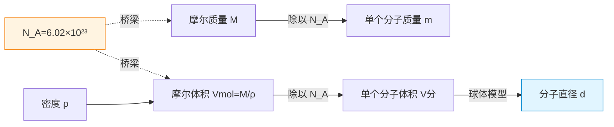

# 分子的大小与阿伏伽德罗常数

> [!abstract] 概览
> 本节是整个热学版块的起点，建立"物质由大量分子组成"这一微观图景的定量基础。核心有三：一是分子动理论的三大基本观点（物质由分子组成、分子永不停息地做热运动、分子间存在相互作用力）；二是分子线度的数量级估算（$10^{-10}\,\text{m}$），通过油膜法 $V=dS$ 这一经典实验给出直观测量；三是联系宏观与微观的"桥梁常数"——阿伏伽德罗常数 $N_A=6.02\times 10^{23}\,\text{mol}^{-1}$，由此可推算单个分子的质量 $m=M/N_A$ 与体积 $V_{\text{分}}=V_{\text{mol}}/N_A$。本节是后续 [[02-分子热运动与布朗运动]]、[[03-分子力与分子势能]]、[[04-内能与分子动能]] 的逻辑前提，也为 [[02-气体/01-气体的状态参量]] 中宏观量与微观量的换算提供工具。

## 核心概念

### 一、分子动理论的三大基本观点

**分子动理论**（Kinetic Theory of Matter）是热学的微观理论基础，其核心可概括为三句话：

1. **物质由大量分子组成**：任何宏观物体都可分割为分子，分子是保持物质化学性质的最小粒子（高中阶段"分子"泛指分子、原子、离子等微观粒子）。"大量"二字至关重要——一杯水含约 $10^{25}$ 个水分子，正是这一"大数"才使统计规律有效。
2. **分子永不停息地做无规则热运动**：无论固体、液体还是气体，分子都在持续做无规则运动；温度越高，运动越剧烈。扩散现象与布朗运动是这一观点的实验证据（详见 [[02-分子热运动与布朗运动]]）。
3. **分子间存在相互作用力**：分子间同时存在引力与斥力，二者均随距离增大而减小，但斥力变化更快。这一作用力决定了物质的聚集态与力学性质（详见 [[03-分子力与分子势能]]）。

> [!tip] 三大观点的逻辑地位
> 观点一回答"物质由什么构成"（==组成==），观点二回答"分子在做什么"（==运动==），观点三回答"分子之间如何联系"（==相互作用==）。三者共同构成"组成—运动—作用"的完整图景，缺一不可。

### 二、分子的大小：数量级估算

分子极其微小，线度数量级为：

$$
\boxed{\,\text{分子直径} \sim 10^{-10}\,\text{m}\,}
$$

不同物质的分子大小略有差异，但都在 $10^{-10}\,\text{m}$（即 $0.1\,\text{nm}$）这一数量级附近。例如水分子的直径约为 $4\times 10^{-10}\,\text{m}$，氢分子直径约为 $2.3\times 10^{-10}\,\text{m}$。

> [!note] 数量级思维
> 高中阶段对分子大小只需把握==数量级==，不要求精确值。$10^{-10}\,\text{m}$ 是判断分子尺度的"标尺"——任何分子线度估算结果若偏离这一数量级太远（如算出 $10^{-7}\,\text{m}$ 或 $10^{-13}\,\text{m}$），必是单位换算或公式出错。

### 三、阿伏伽德罗常数 $N_A$

**阿伏伽德罗常数**：$1\,\text{mol}$ 任何物质所含有的分子（或原子、离子等基本单元）数目，记作 $N_A$：

$$
\boxed{\,N_A = 6.022\,140\,76\times 10^{23}\,\text{mol}^{-1} \approx 6.02\times 10^{23}\,\text{mol}^{-1}\,}
$$

$N_A$ 是连接"宏观物质的量"与"微观粒子数"的桥梁常数。设某物质包含分子数为 $N$，物质的量为 $n$（单位 $\text{mol}$），则：

$$
N = n\,N_A
$$

> [!note] 历史背景
> 阿伏伽德罗（A. Avogadro）在 1811 年提出"同温同压下同体积气体含相同分子数"的假说，但常数 $N_A$ 的精确测定直到 20 世纪初才由密立根油滴实验（测定元电荷 $e$ 后结合法拉第常数 $F=eN_A$）等多条路径完成。2019 年 SI 国际单位制修订后，$N_A$ 已成为==精确的 defining constant==，不再有测量误差。

### 四、摩尔质量 $M$ 与摩尔体积 $V_{\text{mol}}$

**摩尔质量** $M$：$1\,\text{mol}$ 物质的质量，单位 $\text{kg/mol}$（常用 $\text{g/mol}$）。数值上等于该物质的相对分子质量（分子量）。例如水 $M_{\text{H}_2\text{O}}=18\,\text{g/mol}=1.8\times 10^{-2}\,\text{kg/mol}$。

**摩尔体积** $V_{\text{mol}}$：$1\,\text{mol}$ 物质所占体积，单位 $\text{m}^3/\text{mol}$（常用 $\text{L/mol}$）。对气体，标准状况下任何气体的摩尔体积约为 $22.4\,\text{L/mol}$；对液体和固体，摩尔体积需由密度换算 $V_{\text{mol}}=M/\rho$。

### 五、单个分子的质量与体积

由 $N_A$ 出发，可从宏观量推算微观量：

**单个分子的质量**：
$$
\boxed{\,m_{\text{分}} = \dfrac{M}{N_A}\,}
$$

**单个分子的体积**（适用于固体、液体，分子紧密排列；对气体不适用，因气体分子间空隙极大）：
$$
\boxed{\,V_{\text{分}} = \dfrac{V_{\text{mol}}}{N_A} = \dfrac{M}{\rho\,N_A}\,}
$$

> [!warning] 气体不能直接套用 $V_{\text{分}}=V_{\text{mol}}/N_A$
> 对气体，$V_{\text{mol}}/N_A$ 给出的是==每个分子平均占有的空间体积==，而非分子本身体积。气体分子本身只占其平均空间的 $10^{-3}\sim 10^{-4}$ 倍。固液分子紧密排列时二者才近似相等。

### 六、由分子体积估算分子直径

把分子视为小球（==球体模型==），则 $V_{\text{分}}=\dfrac{4}{3}\pi r^3=\dfrac{\pi}{6}d^3$，于是：

$$
d = \sqrt[3]{\dfrac{6V_{\text{分}}}{\pi}} = \sqrt[3]{\dfrac{6M}{\pi\,\rho\,N_A}}
$$

这是由宏观量（$M,\rho,N_A$）估算分子直径的核心公式。

## 推导与原理

### 一、油膜法估测分子直径

**实验思想**：将油酸（或油）滴在水面上展开，形成==单分子层油膜==。若把油酸分子视为小球，则油膜厚度即为分子直径 $d$。测出油酸体积 $V$ 与油膜面积 $S$，由 $V=dS$ 即得分子直径。

**实验步骤**：
1. 用注射器吸取油酸酒精溶液（浓度已知，如 $1\,\text{mL}$ 油酸溶于酒精配成 $200\,\text{mL}$ 溶液），逐滴滴入量筒，数出 $1\,\text{mL}$ 溶液的滴数 $N_{\text{滴}}$，从而得每滴溶液体积 $V_{\text{滴}}=1/N_{\text{滴}}\,\text{mL}$。
2. 在浅盘中盛入清水，撒上一薄层痱子粉（或细石膏粉）以标记油膜边界。
3. 滴一滴油酸酒精溶液到水面上，油酸展开形成单分子层圆形油膜，酒精溶于水并挥发。
4. 用透明坐标纸（方格纸）盖在盘上，描出油膜轮廓，==数轮廓内方格数==估算面积 $S$（不足半格舍去，超过半格计一格）。
5. 计算纯油酸体积 $V=V_{\text{滴}}\times c$（$c$ 为油酸浓度），再由 $d=V/S$ 得分子直径。

**核心公式**：
$$
\boxed{\,d = \dfrac{V}{S}\,}
$$

> [!example] 数据示例
> 取一滴溶液体积 $V_{\text{滴}}=0.05\,\text{mL}$，油酸浓度 $c=1/200$，则纯油酸体积 $V=0.05\times \dfrac{1}{200}\,\text{mL}=2.5\times 10^{-4}\,\text{mL}=2.5\times 10^{-10}\,\text{m}^3$。若测得油膜面积 $S=250\,\text{cm}^2=2.5\times 10^{-2}\,\text{m}^2$，则 $d=\dfrac{2.5\times 10^{-10}}{2.5\times 10^{-2}}=1.0\times 10^{-8}\,\text{m}$。
>
> 此结果偏大于 $10^{-10}\,\text{m}$ 数量级，是因为油酸分子在水面上并非竖直排列而是平躺，实际"油膜厚度"是分子长度而非直径——这正好说明油膜法是"估测"而非精确测量。

**误差来源**：
- 油膜并非理想单分子层（局部多层或未充分展开）；
- 面积测量中方格计数误差；
- 油酸酒精溶液浓度配制的精度；
- 痱子粉边界标记不清晰。

> [!note] 油膜法的精髓
> 油膜法体现了物理学的"化微观为宏观"思想：把无法直接测量的分子直径，通过"单分子层"的几何假设，转化为可测量的体积与面积。这是==放大与转化==思想的经典范例，与密立根油滴实验有异曲同工之妙。

### 二、阿伏伽德罗常数的测定逻辑

$N_A$ 的现代测定通过多条独立路径交叉验证：
- **电化学路径**：法拉第电解定律 $F=eN_A$，测得 $F\approx 96485\,\text{C/mol}$ 与 $e\approx 1.602\times 10^{-19}\,\text{C}$，相除得 $N_A\approx 6.022\times 10^{23}\,\text{mol}^{-1}$。
- **X 射线晶体密度法**：精确测定硅晶体晶格常数 $a$ 与密度 $\rho$，由 $N_A=\dfrac{8M}{\rho\,a^3}$（硅晶胞含 8 个原子）算出。

### 三、宏观—微观换算的逻辑链

## 典型实例与类比

### 实例 1：水分子的"小"与"多"

一滴水体积约 $0.05\,\text{mL}$，含多少水分子？若让全人类（约 $8\times 10^9$ 人）每人每秒喝一个分子，要喝多久？

- 物质的量 $n=\dfrac{V\rho}{M}=\dfrac{0.05\times 10^{-6}\,\text{m}^3\times 10^3\,\text{kg/m}^3}{1.8\times 10^{-2}\,\text{kg/mol}}\approx 2.8\times 10^{-3}\,\text{mol}$
- 分子数 $N=nN_A\approx 2.8\times 10^{-3}\times 6.02\times 10^{23}\approx 1.7\times 10^{21}$ 个
- 全人类每秒喝 $8\times 10^9$ 个分子，需 $T=\dfrac{1.7\times 10^{21}}{8\times 10^9}\approx 2.1\times 10^{11}\,\text{s}\approx 6700\,\text{年}$

> [!tip] 类比
> 把水分子放大到一粒芝麻（约 $1\,\text{mm}$），则一滴水被放大约 $10^7$ 倍，对应"放大后"的水滴体积约为 $\dfrac{4}{3}\pi(0.05\,\text{mL}\times 10^{7})$ 倍——直观感受分子之小。

### 实例 2：标准状况下气体分子间距

标准状况下 $1\,\text{mol}$ 气体体积 $22.4\,\text{L}$，每个分子平均占有空间：
$$
V_0=\dfrac{22.4\times 10^{-3}\,\text{m}^3}{6.02\times 10^{23}}\approx 3.7\times 10^{-26}\,\text{m}^3
$$
分子间距（立方模型）：
$$
l=\sqrt[3]{V_0}\approx 3.3\times 10^{-9}\,\text{m}\approx 33\,d_{\text{分子}}
$$
即气体分子间距约为分子直径的 $30$ 倍，这正是气体"易压缩、易扩散"的微观原因。

### 类比：阿伏伽德罗常数的"大"

$N_A\approx 6\times 10^{23}$ 这一数字之巨大，远超日常经验：
- 若把 $1\,\text{mol}$ 水分子排成一行，长度约 $6\times 10^{23}\times 4\times 10^{-10}\,\text{m}\approx 2.4\times 10^{14}\,\text{m}$，可绕地球赤道约 $6\times 10^6$ 圈；
- 若让 $1\,\text{mol}$ 个砂粒（每粒 $1\,\text{mm}^3$）铺满地球表面，厚度约 $\dfrac{6\times 10^{23}\times 10^{-9}\,\text{m}^3}{4\pi (6.4\times 10^6\,\text{m})^2}\approx 10^3\,\text{m}$，即覆盖地球 $1$ 千米厚。

> [!tip] 记忆口诀
> ==分子十的负十次，摩尔常数六点零二乘十的二十三次；油膜单层 V 等于 dS，固液紧密气疏空。==

## 例题

### 例 1：基础——水分子的质量与体积估算

**题目**：已知水的摩尔质量 $M=1.8\times 10^{-2}\,\text{kg/mol}$，水的密度 $\rho=1.0\times 10^{3}\,\text{kg/m}^3$，阿伏伽德罗常数 $N_A=6.0\times 10^{23}\,\text{mol}^{-1}$。估算：（1）一个水分子的质量；（2）一个水分子的体积；（3）将水分子视为小球，估算其直径数量级。

**分析**：直接套用 $m_{\text{分}}=M/N_A$、$V_{\text{分}}=M/(\rho N_A)$、$d=\sqrt[3]{6V_{\text{分}}/\pi}$。

**解答**：
（1）$m_{\text{分}}=\dfrac{M}{N_A}=\dfrac{1.8\times 10^{-2}}{6.0\times 10^{23}}=3.0\times 10^{-26}\,\text{kg}$

（2）$V_{\text{分}}=\dfrac{M}{\rho N_A}=\dfrac{1.8\times 10^{-2}}{1.0\times 10^{3}\times 6.0\times 10^{23}}=3.0\times 10^{-29}\,\text{m}^3$

（3）$d=\sqrt[3]{\dfrac{6V_{\text{分}}}{\pi}}=\sqrt[3]{\dfrac{6\times 3.0\times 10^{-29}}{3.14}}\approx \sqrt[3]{5.7\times 10^{-29}}\approx 3.9\times 10^{-10}\,\text{m}$

数量级为 $10^{-10}\,\text{m}$，与已知分子尺度吻合。

**点评**：这是高考最典型的"估算分子大小"题型。注意结果只要数量级正确即可，不必追求精确位数。$m_{\text{分}}\sim 10^{-26}\,\text{kg}$、$V_{\text{分}}\sim 10^{-29}\,\text{m}^3$、$d\sim 10^{-10}\,\text{m}$ 三大数量级应记牢。

### 例 2：中难——油膜法实验数据计算

**题目**：在"用油膜法估测分子大小"实验中，将 $1\,\text{mL}$ 纯油酸溶于酒精配制成 $500\,\text{mL}$ 油酸酒精溶液。用注射器测得 $1\,\text{mL}$ 该溶液可滴 $50$ 滴。将一滴该溶液滴入盛水浅盘，稳定后油膜面积为 $S=300\,\text{cm}^2$。求油酸分子直径的数量级。

**分析**：先算一滴溶液中纯油酸的体积 $V$，再由 $d=V/S$ 求 $d$。注意单位统一为 $\text{m}$。

**解答**：每滴溶液体积：
$$
V_{\text{滴}}=\dfrac{1\,\text{mL}}{50}=0.02\,\text{mL}=2.0\times 10^{-8}\,\text{m}^3
$$
纯油酸浓度 $c=1/500$，故一滴中纯油酸体积：
$$
V=cV_{\text{滴}}=\dfrac{1}{500}\times 2.0\times 10^{-8}=4.0\times 10^{-11}\,\text{m}^3
$$
油膜面积 $S=300\,\text{cm}^2=3.0\times 10^{-2}\,\text{m}^2$，故：
$$
d=\dfrac{V}{S}=\dfrac{4.0\times 10^{-11}}{3.0\times 10^{-2}}\approx 1.3\times 10^{-9}\,\text{m}
$$
数量级为 $10^{-9}\,\text{m}$。

**点评**：油膜法结果通常在 $10^{-10}\sim 10^{-9}\,\text{m}$ 之间，因油酸分子平躺导致结果略大。高考常考"分步体积换算"——务必区分"溶液体积"与"纯油酸体积"，乘以浓度 $c$ 是关键一步。

### 例 3：进阶——铜原子间距估算

**题目**：已知铜的摩尔质量 $M=6.4\times 10^{-2}\,\text{kg/mol}$，密度 $\rho=8.9\times 10^{3}\,\text{kg/m}^3$，$N_A=6.0\times 10^{23}\,\text{mol}^{-1}$。估算铜原子直径和 $1\,\text{cm}^3$ 铜中铜原子数。

**分析**：铜为固体，原子紧密排列，可用 $V_{\text{分}}=M/(\rho N_A)$ 估算原子体积，再由球体模型得直径。原子数由 $N=\dfrac{m}{M}N_A=\dfrac{\rho V}{M}N_A$ 计算。

**解答**：（1）铜原子体积：
$$
V_{\text{分}}=\dfrac{M}{\rho N_A}=\dfrac{6.4\times 10^{-2}}{8.9\times 10^{3}\times 6.0\times 10^{23}}\approx 1.2\times 10^{-29}\,\text{m}^3
$$
直径：
$$
d=\sqrt[3]{\dfrac{6V_{\text{分}}}{\pi}}\approx \sqrt[3]{\dfrac{6\times 1.2\times 10^{-29}}{3.14}}\approx 2.6\times 10^{-10}\,\text{m}
$$

（2）$1\,\text{cm}^3$ 铜的质量 $m=\rho V=8.9\times 10^{3}\times 10^{-6}=8.9\times 10^{-3}\,\text{kg}$，铜原子数：
$$
N=\dfrac{m}{M}N_A=\dfrac{8.9\times 10^{-3}}{6.4\times 10^{-2}}\times 6.0\times 10^{23}\approx 8.3\times 10^{22}\,\text{个}
$$

**点评**：固体估算可直接用 $V_{\text{分}}=M/(\rho N_A)$；气体则不能。本题体现了"宏观 $M,\rho$ → 微观 $V_{\text{分}},d$ → 宏观粒子数 $N$"的完整换算链条，是高考常考综合题。

## 易错提醒

> [!warning] 易错点
> 1. **单位混乱**：摩尔质量常用 $\text{g/mol}$，密度常用 $\text{g/cm}^3$，但 SI 单位是 $\text{kg/mol}$、$\text{kg/m}^3$。计算时务必统一，否则数量级会错 $10^3$ 倍。
> 2. **气体误用 $V_{\text{分}}=V_{\text{mol}}/N_A$**：对气体，此式给出的是分子平均占有空间而非分子本身体积；估算气体分子本身体积需乘以占空比（约 $10^{-3}$）。
> 3. **数量级判断失误**：分子直径 $10^{-10}\,\text{m}$，分子质量 $10^{-26}\,\text{kg}$，分子体积 $10^{-29}\,\text{m}^3$——若计算结果偏离这些数量级，必有错。
> 4. **油膜法浓度换算**：滴下的是油酸酒精溶液，纯油酸体积要乘以浓度 $c$，常被遗漏。
> 5. **球体模型 vs 立方模型**：分子体积公式 $V=\dfrac{4}{3}\pi r^3=\dfrac{\pi}{6}d^3$ 用于球体；若用立方模型 $V=d^3$，结果数量级相同但数值略异，高考一般用球体。

> [!note] 概念辨析
> **分子 vs 原子**：高中阶段"分子"是泛称，包含分子（如 $\text{H}_2\text{O}$）、原子（如 He、Cu 中的原子）、离子（如 NaCl 中的 $\text{Na}^+$、$\text{Cl}^-$）。具体题目需结合物质类型判断。
>
> **摩尔质量 vs 相对分子质量**：摩尔质量有单位（$\text{g/mol}$），相对分子质量是无量纲数（如水为 18）；二者数值相等。
>
> **单个分子体积 vs 分子平均占有空间**：固液紧密排列时二者近似相等；气体中后者远大于前者。

## 与其他知识关联

- 与 [[02-分子热运动与布朗运动]] 的关系：分子"小而多"是布朗运动现象成立的物质前提——只有微粒足够小，统计涨落才显著。
- 与 [[03-分子力与分子势能]] 的关系：分子平衡距离 $r_0\sim 10^{-10}\,\text{m}$ 与本节估算的分子直径同数量级，说明 $r_0$ 即分子"接触"时的中心距离。
- 与 [[04-内能与分子动能]] 的关系：内能是"所有分子"动能与势能之和，"所有"的数量由 $N_A$ 决定。
- 与 [[02-气体/01-气体的状态参量]] 的关系：温度、压强、体积的微观解释都依赖 $N_A$ 与分子数 $N=nN_A$。
- 与 [[03-热力学定律/02-热力学第一定律]] 的关系：内能变化的定量计算需先求分子总动能与势能，归根到底要靠 $N_A$。
- 与力学联系：[[02-牛顿运动定律/06-牛顿第二定律]]（分子力的量级估算）、[[动能与动量]]（分子动能）。
- 与电学联系：[[01-静电场/03-电势与电势能]]（势能概念的迁移）。
- 大学衔接：[[统计物理]]、[[热力学]]，以及 $N_A$ 在物理化学中的核心地位。
- 返回 [[00-热学总览]]

## 作者的话

> [!quote] 个人理解
> 学完本节，最值得反复回味的是"==宏观与微观的桥梁=="这一隐喻。$N_A$ 之所以神圣，是因为它把"可称量的摩尔"翻译成"不可数的粒子"。这种"宏观—微观换算"思想会贯穿整个热学：[[04-内能与分子动能]] 中的 $\bar{E}_k=\dfrac{3}{2}kT$，本质是用玻尔兹曼常数 $k=R/N_A$ 把"宏观温度 $T$"翻译成"微观动能"。再到 [[统计物理]]，整个系综理论就是"宏观约束 → 微观状态数 → 统计平均"的系统化方法。
>
> 一个常被忽视的细节：油膜法之所以能"估测"分子大小，依赖于"油酸分子极性头亲水、碳氢链疏水"的化学结构，使其在水面上自发形成定向单层。物理实验的成功往往暗藏化学结构的前提——学科从来不是孤立的。建议读者从本节起就建立"宏观量 = 微观量的统计平均"这一核心观念，它将在 [[02-分子热运动与布朗运动]] 中以"布朗运动 = 分子热运动的统计涨落"形式再次登场，并在 [[04-内能与分子动能]] 中达到顶峰。

---
*返回 [[00-热学总览]]*
