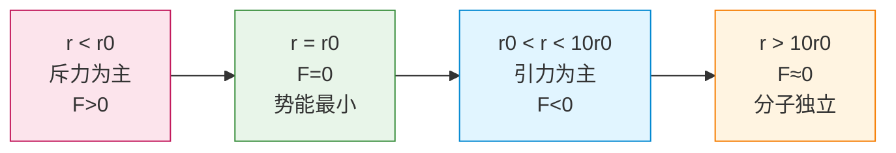
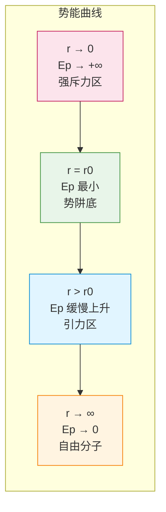

# 分子力与分子势能

> [!abstract] 概览
> 本节是分子动理论三大观点之"分子间存在相互作用力"的定量展开。核心有四：一是分子力的特征——引力与斥力==同时存在==，合力为二者之代数和；二是分子力随距离 $r$ 变化的曲线（$r<r_0$ 斥力为主、$r>r_0$ 引力为主、$r>10r_0$ 可忽略），平衡距离 $r_0\approx 10^{-10}\,\text{m}$；三是分子力做功与分子势能的关系——类比弹簧弹力，分子力是保守力，做功等于分子势能的减少；四是分子势能曲线（$r=r_0$ 时势能最低，势阱模型），这是理解分子热运动与分子力竞争、物态变化的几何工具。本节为 [[04-内能与分子动能]] 中内能 $U=E_k+E_p$ 的"势能部分"奠基，也为 [[02-气体/01-气体的状态参量]] 中"体积变化影响内能"提供微观解释。

## 核心概念

### 一、分子力的基本特征

**分子力**：分子之间同时存在的引力与斥力的统称，是分子间相互作用力的简称。

**两条铁律**：
1. **引力与斥力同时存在**：任何距离下引力 $f_{\text{引}}$ 与斥力 $f_{\text{斥}}$ 都不为零，合力 $F=f_{\text{斥}}-f_{\text{引}}$（取斥力为正方向）。
2. **斥力变化更快**：斥力与引力都随 $r$ 增大而减小，但斥力衰减更快；故 $r$ 减小时斥力增长比引力更快，$r$ 增大时斥力衰减比引力更快。

> [!note] 分子力的本质
> 分子力本质是==电磁相互作用==——分子内部的电荷分布（正电荷的核、负电荷的电子云）在邻近分子间产生库仑吸引与排斥，再加上泡利不相容原理导致的"电子云重叠排斥"。所以分子力不是"新力"，而是电磁力在分子尺度的剩余表现（与 [[01-静电场/01-电荷与库仑定律]] 中的库仑力同源）。

### 二、平衡距离 $r_0$

**平衡距离** $r_0$：分子间引力与斥力==恰好相等==时的距离，此时合力为零。

$$
r_0 \approx 10^{-10}\,\text{m}
$$

$r_0$ 与分子直径同数量级（见 [[01-分子的大小与阿伏伽德罗常数]]），即分子"恰好接触"时的中心距离。

**$r_0$ 的物理意义**：
- 分子处于 $r_0$ 时，合力为零，分子处于==力学平衡态==；
- 分子处于 $r_0$ 时，分子势能==最小==（势阱底部）；
- 固体分子在 $r_0$ 附近振动，故固体形状稳定。

### 三、分子力曲线

设 $r$ 为两分子中心距离，定义斥力为正、引力为负，则合力 $F(r)$ 随 $r$ 的变化如下：

| 区域 | 关系 | 合力性质 | 现象 |
| --- | --- | --- | --- |
| $r<r_0$ | $f_{\text{斥}}>f_{\text{引}}$ | 斥力（$F>0$） | 压缩物体难，斥力抵抗压缩 |
| $r=r_0$ | $f_{\text{斥}}=f_{\text{引}}$ | 零 | 分子平衡 |
| $r_0<r<10r_0$ | $f_{\text{斥}}<f_{\text{引}}$ | 引力（$F<0$） | 拉伸物体难，引力抵抗拉伸 |
| $r>10r_0$ | 二者均→0 | ≈0 | 分子间几乎无作用 |

> [!tip] 分子力曲线的记忆
> ==内斥外引，零点平衡；远则忽略，十倍为限。== "内斥外引"指 $r<r_0$ 斥力为主、$r>r_0$ 引力为主；"十倍为限"指 $r>10r_0$ 时分子力可忽略。

### 四、分子力与弹簧力的类比

| 比较项 | 弹簧弹力 | 分子力 |
| --- | --- | --- |
| 平衡位置 | 自然长度 $l_0$ | 平衡距离 $r_0$ |
| 偏离平衡 | 压缩（$<l_0$）斥力，拉伸（$>l_0$）引力 | 压缩（$<r_0$）斥力，拉伸（$>r_0$）引力 |
| 性质 | 保守力 | 保守力 |
| 势能 | 弹性势能 $E_p=\dfrac{1}{2}kx^2$，最低在 $x=0$ | 分子势能 $E_p(r)$，最低在 $r=r_0$ |
| 适用范围 | 胡克定律仅在小变形 | 分子力公式仅在小偏离 |

> [!example] 类比的精髓
> 把两分子想象成一根"看不见的弹簧"连着——压缩时弹开（斥力），拉伸时拉回（引力），自然长度 $r_0$ 处合力为零。这根"弹簧"的劲度系数由分子力曲线在 $r_0$ 处的斜率决定。==但分子力不是胡克弹力==——大变形时弹簧势能仍正比 $x^2$，而分子势能在 $r\to 0$ 时趋于 $+\infty$，$r\to\infty$ 时趋于 0，曲线形状远比抛物线复杂。

### 五、分子力做功与分子势能

**分子力是保守力**，做功等于分子势能的减少（与重力、电场力同理，见 [[01-静电场/03-电势与电势能]]）：

$$
W_{\text{分子力}} = -\Delta E_p = E_{p1}-E_{p2}
$$

**符号规则**：
- 分子力做正功（$r$ 变化使分子被推动方向与合力同向）→ $E_p$ 减小；
- 分子力做负功（外力克服分子力）→ $E_p$ 增大。

**典型过程**：

| 过程 | 合力方向 | 分子力做功 | $E_p$ 变化 |
| --- | --- | --- | --- |
| $r$ 从 $r_0$ 减小（压缩） | 沿 $+r$（斥力向外） | 负功（外力压缩） | 增大 |
| $r$ 从 $r_0$ 增大（拉伸） | 沿 $-r$（引力向内） | 负功（外力拉伸） | 增大 |
| $r$ 从 $r<r_0$ 增大到 $r_0$ | 沿 $+r$（斥力向外） | 正功 | 减小 |
| $r$ 从 $r>r_0$ 减小到 $r_0$ | 沿 $-r$（引力向内） | 正功 | 减小 |

### 六、分子势能曲线

**分子势能 $E_p(r)$** 随 $r$ 变化的曲线如下：

**曲线特征**：
1. $r=r_0$ 处 $E_p$ ==最小==（势阱底部），$E_p$ 对 $r$ 的导数为 0，对应合力为 0。
2. $r<r_0$ 时 $E_p$ 随 $r$ 减小而急剧上升（斥力区，曲线很陡）。
3. $r>r_0$ 时 $E_p$ 随 $r$ 增大而缓慢上升（引力区，曲线较缓），到 $r\to\infty$ 时 $E_p\to 0$。
4. $r=10r_0$ 时 $E_p$ 已趋近 0，可视为分子间无作用。

> [!note] 势阱（potential well）
> 分子势能曲线在 $r_0$ 附近呈"井"状，称"==势阱=="。势阱深度 $D$ 反映分子结合强度。固体势阱深，分子被束缚在 $r_0$ 附近振动；气体势阱浅，分子热运动足以挣脱。

## 推导与原理

### 一、分子力与分子势能的微分关系

由保守力定义：
$$
F(r) = -\dfrac{dE_p}{dr}
$$

即==分子力等于分子势能对距离的负梯度==。在 $E_p$ 极小点 $r_0$，$\dfrac{dE_p}{dr}\big|_{r_0}=0$，故 $F(r_0)=0$。

在 $r_0$ 附近将 $E_p(r)$ 泰勒展开：
$$
E_p(r) \approx E_p(r_0) + \dfrac{1}{2}E_p''(r_0)(r-r_0)^2
$$
取 $E_p(r_0)=0$ 为参考（势能零点），令 $k_{\text{eff}}=E_p''(r_0)$，则：
$$
E_p(r)\approx \dfrac{1}{2}k_{\text{eff}}(r-r_0)^2,\quad F(r)\approx -k_{\text{eff}}(r-r_0)
$$

这正是==弹簧弹力的胡克定律==形式！所以分子在 $r_0$ 附近的小振动可视为简谐振动，这一结论是固体比热容理论的微观基础（爱因斯坦模型、德拜模型）。

### 二、Lennard-Jones 势（了解）

大学物理中常用的分子势能经验公式：
$$
E_p(r)=4\varepsilon\left[\left(\dfrac{\sigma}{r}\right)^{12}-\left(\dfrac{\sigma}{r}\right)^6\right]
$$
其中 $\varepsilon$ 为势阱深度，$\sigma$ 为 $E_p=0$ 时的距离。$r^{-12}$ 项代表短程排斥（泡利排斥），$r^{-6}$ 项代表长程吸引（范德华力）。对 $E_p$ 求导得分子力：
$$
F(r)=24\varepsilon\left[2\left(\dfrac{\sigma}{r}\right)^{12}-\left(\dfrac{\sigma}{r}\right)^6\right]\dfrac{1}{r}
$$
令 $F=0$ 得 $r_0=2^{1/6}\sigma\approx 1.122\sigma$。

> [!note] 高考不要求 Lennard-Jones
> 但理解"$r^{-12}$ 斥力项 + $r^{-6}$ 引力项"的物理起源有助于解释"斥力比引力变化更快"——斥力项指数高，衰减更快。

### 三、物态与势阱的对应

| 物态 | 分子在势阱中位置 | 热运动与势阱深度比较 | 分子图景 |
| --- | --- | --- | --- |
| 固体 | 在 $r_0$ 附近振动 | $\bar{E}_k \ll D$（势阱深） | 分子被束缚在格点附近，长程有序 |
| 液体 | 在 $r_0$ 附近振动 + 缓慢迁移 | $\bar{E}_k \sim D$ | 分子可暂时挣脱迁移，短程有序 |
| 气体 | 几乎自由飞行 | $\bar{E}_k \gg D$ | 分子远离 $r_0$，势能 ≈0 |

> [!tip] 物态变化的微观本质
> 升温使 $\bar{E}_k$ 增大，分子从势阱底部"爬升"到阱口，最终"挣脱"束缚——这就是熔化、汽化的微观本质。详见 [[04-物态变化/03-物态变化与相变潜热]]。

## 典型实例与类比

### 实例 1：固体的"难压难拉"

铁块既难压缩也难拉伸——这正是分子力曲线两侧的特征：
- 压缩铁块（$r<r_0$）→ 强斥力抵抗，$E_p$ 急剧上升；
- 拉伸铁块（$r>r_0$）→ 引力抵抗，$E_p$ 缓慢上升，超过弹性极限则分子键断裂（屈服）。

> [!example] 弹性极限的微观解释
> 弹簧胡克定律 $F=kx$ 只在 $r_0$ 附近小变形成立；大变形时分子键被拉断，进入塑性形变。这与分子势能曲线"小范围抛物线、大范围非抛物线"完全对应。

### 实例 2：液体表面张力的微观根源

液体表面层分子（厚度约 $r_0$）只受到液体内部分子的引力，缺少外侧分子的作用——合力指向液体内部，分子势能高于内部。系统倾向于减少表面分子数，宏观表现为表面收缩——这就是 [[04-物态变化/02-液体与表面张力]] 中表面张力的微观本质。

### 类比：分子势阱与"碗中小球"

把分子势能曲线比作一只"碗"，碗底在 $r_0$：
- 小球（分子）静止在碗底 → 固体分子在 $r_0$ 附近；
- 给小球一点动能，它在碗底来回滚动 → 固体分子振动；
- 动能大，小球爬到碗口 → 液体分子可迁移；
- 动能更大，小球飞出碗口 → 气体分子挣脱。

> [!tip] 记忆口诀
> ==分子力同时引斥生，斥快引慢定平衡；内斥外引零点 r0，势能最低势阱成；做功正负判势能，弹簧类比理最清；十倍之外力可略，物态全凭势阱深。==

## 例题

### 例 1：基础——分子力曲线判断

**题目**：甲、乙两分子相距 $r$。当 $r=r_0$ 时分子间引力与斥力等大；当 $r<r_0$ 时分子力表现为斥力；当 $r>r_0$ 时分子力表现为引力。下列说法正确的是：

A. 当 $r$ 从 $r_0$ 减小时，分子引力和斥力都增大，但斥力增大更快
B. 当 $r$ 从 $r_0$ 增大时，分子引力和斥力都减小，但引力减小更慢
C. 当 $r=10r_0$ 时，分子力可忽略
D. 当 $r<r_0$ 时分子势能随 $r$ 减小而减小

**分析**：A、B、C 都符合分子力曲线规律。D 错误：$r<r_0$ 时为斥力区，$r$ 减小外力需克服斥力做负功，$E_p$ 增大（不是减小）。

**解答**：**A、B、C**。

**点评**：分子力曲线"斥快引慢"是关键。判断 $E_p$ 变化用"分子力做正功 $E_p$ 减、做负功 $E_p$ 增"——压缩时斥力做负功，$E_p$ 增。

### 例 2：中难——分子力做功与势能

**题目**：两分子从相距 $r=2r_0$ 缓慢靠近到 $r=r_0$。下列说法正确的是：

A. 分子力做正功，分子势能减小
B. 分子力做负功，分子势能增大
C. 分子力先做正功后做负功
D. 分子势能先增大后减小

**分析**：从 $2r_0$ 到 $r_0$，全程在 $r>r_0$ 的引力区，分子力指向 $r$ 减小方向，与位移同向，做==正功==；故 $E_p$ ==减小==（朝势阱底部运动）。

**解答**：**A**。

**点评**：判断做功正负的关键：看分子力方向与位移方向是否同向。$r>r_0$ 区域分子力为引力（指向减小 $r$），靠近运动（位移也指向减小 $r$），故做正功。这一过程 $E_p$ 从某一正值减到势阱底部最小值 0。

### 例 3：进阶——固体小振动与势阱

**题目**：已知某分子在 $r_0=3.0\times 10^{-10}\,\text{m}$ 处合力为零，势阱深度 $D=8\times 10^{-21}\,\text{J}$（即 $E_p(r_0)=-D$，取无穷远处 $E_p=0$）。设分子在 $r_0$ 附近做小振动时近似满足 $E_p(r)\approx -D+\dfrac{1}{2}k(r-r_0)^2$，$k=10\,\text{N/m}$。求：（1）分子振动的"等效劲度系数"；（2）分子振幅为 $0.3\times 10^{-10}\,\text{m}$ 时最大势能；（3）若分子平均动能 $\bar{E}_k=\dfrac{3}{2}k_BT$，求温度 $T$ 多高时分子可"挣脱"势阱（取 $\bar{E}_k=D$）。

**分析**：（1）$k=10\,\text{N/m}$（题给）；（2）由 $E_p=\dfrac{1}{2}kA^2$；（3）令 $\bar{E}_k=D$ 解 $T$。

**解答**：
（1）等效劲度系数 $k_{\text{eff}}=10\,\text{N/m}$。

（2）振幅 $A=0.3\times 10^{-10}\,\text{m}$ 时最大势能（相对势阱底）：
$$
E_{p,\max}=\dfrac{1}{2}kA^2=\dfrac{1}{2}\times 10\times (0.3\times 10^{-10})^2=4.5\times 10^{-22}\,\text{J}
$$

（3）令 $\bar{E}_k=D$：
$$
T=\dfrac{2D}{3k_B}=\dfrac{2\times 8\times 10^{-21}}{3\times 1.38\times 10^{-23}}\approx 387\,\text{K}\approx 114\,^\circ\text{C}
$$

**点评**：本题把分子势阱与简谐振动、能量均分定理联系起来，体现"微观—宏观"统一。$T\approx 387\,\text{K}$ 可视为该分子"挣脱势阱"的临界温度（实际相变需考虑集体效应，这里只是单分子估算）。$k_{\text{eff}}$ 越大、$D$ 越深，固体越难熔化——这正是熔点差异的微观根源。

## 易错提醒

> [!warning] 易错点
> 1. **引力与斥力"非此即彼"**：错误。引力与斥力==同时存在==，"表现为引力"只是引力大于斥力。
> 2. **$r=0$ 时 $E_p=0$**：错误。$r\to 0$ 时 $E_p\to +\infty$（强斥力）。$E_p=0$ 的位置在 $r=\infty$ 与某一 $r$ 值之间。
> 3. **分子力做正功 $E_p$ 增大**：错误。分子力做正功 $E_p$ ==减小==（保守力做功 = 势能减少）。
> 4. **平衡距离 $r_0$ 处 $E_p=0$**：错误。$r_0$ 处 $E_p$ ==最小==（势阱底），通常取为势能参考点（令其为 0 或 $-D$），但这是"约定零点"而非"自然零点"。
> 5. **分子力曲线斜率与力方向**：$E_p$ 曲线斜率 $\dfrac{dE_p}{dr}>0$ 处分子力 $F<0$（引力），易混淆。
> 6. **气体分子间无分子力**：错误。气体分子间仍有分子力，只是因 $r$ 大而可忽略；理想气体是"分子力可忽略"的==理想模型==。

> [!note] 概念辨析
> **分子力 vs 化学键**：分子力（范德华力）较弱（$10^{-21}\,\text{J}$ 量级），存在于分子之间；化学键（共价键、离子键、金属键）较强（$10^{-19}\,\text{J}$ 量级），存在于原子之间。高中热学讨论的是分子间力，不涉及化学键的破裂。
>
> **分子势能 vs 弹性势能**：弹性势能是宏观弹簧形变储存的能量，本质仍是大量分子势能的统计和；二者形式类似（$\dfrac{1}{2}kx^2$）但层次不同。
>
> **分子势能 vs 重力势能**：前者源于分子间作用力，后者源于万有引力；分子势能在 $r_0$ 处最小，重力势能随高度增大而增大（无"势阱"）。

## 与其他知识关联

- 与 [[01-分子的大小与阿伏伽德罗常数]] 的关系：平衡距离 $r_0$ 与分子直径同数量级（$\sim 10^{-10}\,\text{m}$），二者互为印证。
- 与 [[02-分子热运动与布朗运动]] 的关系：分子热运动（动能）"挣脱"势阱束缚，与分子力形成竞争，决定物态。
- 与 [[04-内能与分子动能]] 的关系：内能 $U=E_k+E_p$，$E_p$ 即分子势能；理想气体忽略 $E_p$。
- 与 [[02-气体/01-气体的状态参量]] 的关系：体积变化改变分子间距 $r$，从而改变 $E_p$，是非理想气体内能随体积变化的原因。
- 与 [[03-热力学定律/02-热力学第一定律]] 的关系：内能变化 $\Delta U=Q+W$ 中 $U$ 包含分子势能。
- 与 [[04-物态变化/02-液体与表面张力]] 的关系：表面张力的微观根源是表面层分子势能高于内部。
- 与力学联系：[[02-牛顿运动定律/06-牛顿第二定律]]（分子力是一种力）、力学中弹簧振子与简谐振动（[[动能与动量]]）。
- 与电学联系：[[01-静电场/03-电势与电势能]]（势能零点约定、保守力做功与势能关系，与电势能完全类比）。
- 大学衔接：[[统计物理]]（Lennard-Jones 势、配分函数）、[[热力学]]（状态方程与势能）、[[相变与流体]]（势阱深度与临界温度）。
- 返回 [[00-热学总览]]

## 作者的话

> [!quote] 个人理解
> 分子力曲线与分子势能曲线是高中热学最"几何化"的部分——一幅图胜过千言万语。我学这节时最大的领悟是：==力与势能是同一物理的两个面==。力是势能的负梯度（$F=-dE_p/dr$），势能是力对位移的积分（$E_p=-\int F\,dr$）。这一对偶关系在 [[01-静电场/03-电势与电势能]] 中已登场（$\vec{E}=-\nabla U$），在力学中也有（重力 $F=-dE_p/dh$），到大学 [[理论力学]] 的拉格朗日力学中会升华为"广义力 = 势能负梯度"的普适原理。
>
> 另一个值得深思的是==势阱的普适性==：分子势阱、原子势阱（电离能）、核势阱（结合能），乃至粒子物理的"口袋模型"，都是势阱的不同表现。物理学的统一性在这里体现得淋漓尽致：只要存在平衡点 + 回复力，就有势阱；只要有势阱，就有束缚态。这是 [[统计物理]] 与 [[量子力学]] 共同的基本图像。
>
> 一个常被忽视的细节：分子势能在 $r_0$ 处取==最小==（不是零！）。零点是人为约定的——通常取 $r\to\infty$（自由分子）时 $E_p=0$，则 $r_0$ 处 $E_p=-D<0$。这与重力势能（取地面为 0）、电势能（取无穷远为 0）的约定一脉相承，体现了"势能只有相对值才有意义"的深刻道理。建议读者把分子势阱、电势能曲线、弹簧势能曲线三者并排对照，体会"保守力—势能"这对概念的普适性——这是高中物理最值得"内化"的思想之一。

---
*返回 [[00-热学总览]]*
