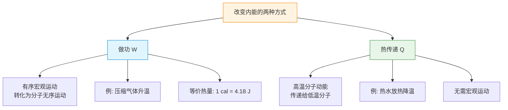

# 内能与分子动能

> [!abstract] 概览
> 本节是分子动理论版块的总结篇，把前三节的概念汇总为"内能"这一宏观量。核心有六：一是分子平均动能 $\bar{E}_k=\dfrac{3}{2}kT$，给出温度的微观本质；二是分子总动能 $E_{k,\text{总}}=N\bar{E}_k$，体现"宏观量 = 微观量 × 分子数"的统计思想；三是内能定义——所有分子动能与分子势能之总和 $U=E_k+E_p$；四是内能的决定因素——温度、体积、物质的量、种类；五是==理想气体内能仅由温度决定==（仅含分子动能，与体积无关），这是高考必考重点；六是内能变化的两种方式——做功与热传递，对应 [[03-热力学定律/02-热力学第一定律]] $\Delta U=Q+W$。本节是分子动理论到热力学定律的"过渡桥梁"，也是 [[02-气体/01-气体的状态参量]] 中温度定义的精确化。

## 核心概念

### 一、分子平均动能

**分子平均动能** $\bar{E}_k$：物体中所有分子动能的算术平均值。

**核心公式**：
$$
\boxed{\,\bar{E}_k = \dfrac{3}{2}kT\,}
$$
其中 $k=R/N_A\approx 1.38\times 10^{-23}\,\text{J/K}$ 为玻尔兹曼常数，$T$ 为热力学温度。

**物理意义**：
- 分子平均动能仅由温度决定，与分子种类、质量、压强、体积等无关；
- 温度相同，所有分子的平均平动动能相同（如 $300\,\text{K}$ 下氢气、氧气、水蒸气分子平均平动动能相等）；
- 温度是分子平均动能的==唯一标志==。

> [!note] "平均"二字的分量
> $\bar{E}_k=\dfrac{3}{2}kT$ 是==统计平均==，不是每个分子的动能都等于 $\dfrac{3}{2}kT$。实际上分子动能分布很广（麦克斯韦分布），有的快有的慢，但平均值为 $\dfrac{3}{2}kT$。这正是 [[02-分子热运动与布朗运动]] 中"统计规律"的延续。

### 二、温度的微观本质

**温度**是分子热运动平均动能的宏观标志：

$$
T \leftrightarrow \bar{E}_k = \dfrac{3}{2}kT
$$

**三层含义**：
1. **温度高 = 分子平均动能大**：温度越高，分子运动越剧烈；
2. **温度只反映平均动能**：单个分子动能可以远高于或低于平均值；
3. **温度是统计量**：对==单个分子==或==少数分子==谈温度无意义。

> [!warning] 温度与速率的辨析
> 同温下，氢气与氧气分子平均动能相等，但==速率不等==——氢分子质量小，速率大（$v_{\text{rms}}=\sqrt{3kT/m}\propto 1/\sqrt{m}$）。常见错误：认为"温度高则速率一定大"——其实"温度高则平均动能大"，速率还取决于分子质量。

### 三、分子总动能

**分子总动能** $E_{k,\text{总}}$：所有分子动能之和：

$$
\boxed{\,E_{k,\text{总}} = N\,\bar{E}_k = nN_A\cdot \dfrac{3}{2}kT = \dfrac{3}{2}nRT\,}
$$

其中 $n$ 为物质的量，$R=kN_A\approx 8.314\,\text{J/(mol\cdot K)}$ 为理想气体常数。

**物理意义**：分子总动能同时由==分子数==（$N$ 或 $n$）与==温度==（$T$）决定。同温下，$2\,\text{mol}$ 氢气的总动能是 $1\,\text{mol}$ 氢气的 2 倍。

> [!tip] 平均 vs 总
> - 平均动能 $\bar{E}_k$：仅由 $T$ 决定；
> - 总动能 $E_{k,\text{总}}$：由 $T$ 与 $n$（分子数）共同决定。
> 高考常考这一辨析：同温同压下，等质量氢气与氧气哪个总动能大？答：氢气物质的量大（$n=m/M$，$M_{\text{H}_2}$ 小），故总动能大。

### 四、内能定义

**内能** $U$：物体中所有分子的==动能与势能之总和==。

$$
\boxed{\,U = E_{k,\text{总}} + E_{p,\text{总}}\,}
$$

其中：
- $E_{k,\text{总}}$：所有分子热运动动能（平动、转动、振动动能之和）；
- $E_{p,\text{总}}$：所有分子势能（由分子间相对位置决定，见 [[03-分子力与分子势能]]）。

> [!note] 内能的统计性
> 内能是==状态函数==，由系统状态唯一确定（与过程无关）。它是宏观量，本质是大量分子能量的统计平均。对单个分子谈"内能"无意义。

### 五、内能的决定因素

| 因素 | 影响 | 机制 |
| --- | --- | --- |
| 温度 $T$ | $T$↑ → $E_{k,\text{总}}$↑ → $U$↑ | 平均动能增大 |
| 体积 $V$ | $V$ 变化 → 分子间距 $r$ 变化 → $E_{p,\text{总}}$ 变化 | 分子势能变化（仅非理想气体） |
| 物质的量 $n$ | $n$↑ → 分子数↑ → $U$↑ | 总能量基数增大 |
| 物质种类 | 不同分子结构 → 势阱深度、自由度不同 | 同温下内能不同 |

> [!warning] 内能因素的全面性
> 一般物体（固、液、非理想气体）的内能==同时==取决于 $T$、$V$、$n$、种类。常见错误：只记"温度决定内能"——这只对理想气体成立。

### 六、理想气体的内能

**理想气体**：分子无大小（视为质点）、分子间无作用力（除碰撞瞬间）的气体模型。

**理想气体内能**：
$$
\boxed{\,U_{\text{理想}} = E_{k,\text{总}} = \dfrac{3}{2}nRT\,}\quad(\text{单原子})
$$

**关键结论**：==理想气体内能仅由温度决定==，与体积、压强无关。

**原因**：
- 理想气体分子间无作用力 → $E_{p,\text{总}}=0$；
- 故 $U=E_{k,\text{总}}$，仅由 $T$ 与 $n$ 决定；
- 等温过程理想气体内能不变（$\Delta U=0$）；
- 理想气体自由膨胀（绝热、不做功）温度不变。

> [!note] 单原子 vs 多原子
> 严格地说，$\dfrac{3}{2}nRT$ 是==单原子==理想气体（如 He、Ne）的内能（仅 3 个平动自由度）。双原子（如 $\text{O}_2$、$\text{H}_2$）常温下还有 2 个转动自由度，$U=\dfrac{5}{2}nRT$。高中阶段不细分，统一用"$U$ 仅由 $T$ 决定"即可，定量公式多用 $\dfrac{3}{2}nRT$。

### 七、内能与机械能的区别

| 比较项 | 内能 $U$ | 机械能 $E$ |
| --- | --- | --- |
| 主体 | 大量分子 | 宏观物体整体 |
| 组成 | 分子动能 + 分子势能（微观） | 宏观动能 + 宏观势能（宏观） |
| 与运动关系 | 与分子热运动对应 | 与物体整体运动对应 |
| 可否为零 | 不可为零（绝对零度不可达） | 可为零（静止 + 参考点势能） |
| 是否可叠加 | 不可简单叠加 | 可矢量/标量叠加 |

> [!example] 一杯水的内能与机械能
> 静止在桌面的水杯：机械能 = 重力势能 $mgh$（取桌面为 0 则为 0）；内能 = 所有水分子的动能与势能之和 $\sim 10^5\,\text{J}$（远大于机械能）。把水杯举高，机械能增加 $mgh$，但内能不变——温度仍是室温。可见内能与机械能是==两种独立==的能量形式。

### 八、内能变化的方式

**做功** $W$ 与 **热传递** $Q$ 是改变内能的==两种且仅两种==方式：

$$
\boxed{\,\Delta U = Q + W\,}
$$

**符号约定**（高中物理）：
- $Q>0$：系统吸热；$Q<0$：系统放热；
- $W>0$：外界对系统做功（如压缩气体）；$W<0$：系统对外界做功（如气体膨胀）。

**做功的微观本质**：
- 压缩气体：活塞推动分子，分子动能增加 → $T$ 升高 → $U$ 增大；
- 气体膨胀：分子推动活塞，分子动能减少 → $T$ 降低 → $U$ 减小。

**热传递的微观本质**：
- 高温物体分子动能大，碰撞低温物体分子时传递能量；
- 高温 → 低温的净能量流即"热量"。

> [!tip] 做功与热传递的等价性
> 焦耳实验证明：$1\,\text{cal}=4.18\,\text{J}$，即做功与热传递对内能的改变==完全等价==。但二者机制不同——做功是"有序运动→无序运动"的转化（如活塞定向运动转化为分子无规则运动），热传递是"无序→无序"的传递。详见 [[03-热力学定律/01-热传递与功]]、[[03-热力学定律/02-热力学第一定律]]。

## 推导与原理

### 一、$\bar{E}_k=\dfrac{3}{2}kT$ 的推导（气体动理论）

由理想气体压强公式（[[02-气体/01-气体的状态参量]] 推导）：
$$
p=\dfrac{1}{3}nm\overline{v^2}=\dfrac{2}{3}n\bar{E}_k
$$
（$n$ 为分子数密度，$\bar{E}_k=\dfrac{1}{2}m\overline{v^2}$）

理想气体状态方程 $pV=NkT$，即 $p=\dfrac{N}{V}kT=nkT$（此处 $n$ 为分子数密度 $N/V$）。

两式相等：
$$
\dfrac{2}{3}n\bar{E}_k = nkT\;\Rightarrow\;\boxed{\,\bar{E}_k=\dfrac{3}{2}kT\,}
$$

**关键思想**：宏观温度 $T$ 由微观平均动能 $\bar{E}_k$ 唯一决定——这就是"温度的统计本质"。

### 二、理想气体内能公式的推导

单原子分子（仅 3 个平动自由度）：
$$
U = N\bar{E}_k = N\cdot \dfrac{3}{2}kT = \dfrac{3}{2}(nN_A)\cdot \dfrac{R}{N_A}T = \dfrac{3}{2}nRT
$$

**重要结论**：
- $U\propto nT$：仅由物质的量与温度决定；
- $U$ 与 $V$、$p$ 无关：因为分子间无作用力（$E_p=0$）；
- $\Delta U=\dfrac{3}{2}nR\Delta T$：内能变化仅由温度变化决定。

### 三、能量均分定理（扩展）

**能量均分定理**：每个自由度平均分配 $\dfrac{1}{2}kT$ 的能量。

- 单原子分子：3 个平动自由度 → $\bar{E}_k=\dfrac{3}{2}kT$；
- 双原子分子（常温）：3 平动 + 2 转动 = 5 自由度 → $\bar{E}_k=\dfrac{5}{2}kT$；
- 双原子分子（高温）：3 平动 + 2 转动 + 2 振动 = 7 自由度 → $\bar{E}_k=\dfrac{7}{2}kT$。

> [!note] 自由度的高考边界
> 高考不要求区分自由度，统一用 $\dfrac{3}{2}nRT$ 即可。但理解"自由度"能解释为什么同温下双原子气体内能大于单原子气体——这是 [[统计物理]] 的入门概念。

### 四、做功与热传递改变内能的对比

## 典型实例与类比

### 实例 1：等温压缩理想气体

缓慢压缩 $1\,\text{mol}$ 理想气体保持温度 $300\,\text{K}$，体积从 $22.4\,\text{L}$ 减到 $11.2\,\text{L}$。

**问**：内能变化多少？
**答**：==零==！等温过程 $\Delta T=0$，理想气体内能仅由温度决定，故 $\Delta U=0$。

**问**：外界对气体做功为正，但 $\Delta U=0$，能量去哪了？
**答**：气体必须==放热== $Q=-W$（等温压缩放热），把做功转化的能量以热量形式释放，维持温度不变。

> [!tip] 等温过程的关键
> 等温过程理想气体 $\Delta U=0$，由热力学第一定律 $Q+W=0$，即做功与热传递完全抵消。这是 [[02-气体/02-玻意耳定律]] 的能量本质。

### 实例 2：自由膨胀（绝热）

绝热容器中 $1\,\text{mol}$ 理想气体从体积 $V_1$ 自由膨胀到 $V_2=2V_1$（向真空膨胀）。

**问**：温度变化？
**答**：==不变==！理由：
- $Q=0$（绝热）
- $W=0$（向真空膨胀，无阻力，不做功）
- 故 $\Delta U=Q+W=0$，$T$ 不变

**关键**：理想气体自由膨胀温度不变，是"内能仅由温度决定"的经典验证。

### 类比：内能与"班级平均分"

| 物理量 | 班级类比 |
| --- | --- |
| 分子动能 | 学生分数 |
| 分子平均动能 $\bar{E}_k$ | 班级平均分 |
| 温度 $T$ | 平均分等级 |
| 分子总动能 $E_{k,\text{总}}$ | 班级总分 |
| 物质的量 $n$ | 学生人数 |
| 内能 $U$ | 班级总分 + 关系潜能 |

平均分（温度）相同，人数（物质的量）多的班级总分（内能）大；转学生（热传递）或老师加分（做功）可改变总分。

> [!tip] 记忆口诀
> ==平均动能温度定，总动能还要乘分子数；内能动能加势能，理想气体势能为零；理想内能只看温，等温过程内能恒；做功热传两方式，ΔU 等于 Q 加 W。==

## 例题

### 例 1：基础——理想气体内能比较

**题目**：$1\,\text{mol}$ 氢气与 $1\,\text{mol}$ 氧气在同温 $300\,\text{K}$ 下，下列说法正确的是：

A. 氢气分子平均动能大于氧气
B. 氢气分子总动能等于氧气
C. 氢气分子方均根速率大于氧气
D. 二者内能相等（按单原子估算）

**分析**：
- 同温下分子平均动能相等（$\bar{E}_k=\dfrac{3}{2}kT$）→ A 错；
- 物质的量相同，分子数相同，总动能相同 → B 对；
- $v_{\text{rms}}=\sqrt{3kT/m}$，$m_{\text{H}_2}<m_{\text{O}_2}$，故氢气速率大 → C 对；
- 同为双原子分子，物质的量相同，温度相同，内能相等 → D 对（若按单原子估算）。

**解答**：**B、C、D**。

**点评**：本题集中考查"温度相同 → 平均动能相同"与"分子质量小 → 速率大"两大辨析。注意：==平均动能相同≠速率相同==。

### 例 2：中难——内能变化的判断

**题目**：一定量理想气体经历以下过程：（a）等温膨胀；（b）等压压缩；（c）绝热压缩。分别判断 $\Delta U$、$Q$、$W$ 的正负。

**分析**：理想气体内能仅由温度决定，$\Delta U\propto \Delta T$。

**解答**：

| 过程 | $T$ 变化 | $\Delta U$ | $W$（外界对气体） | $Q$ |
| --- | --- | --- | --- | --- |
| (a) 等温膨胀 | 不变 | $=0$ | $-$（气体膨胀对外做功） | $+$（吸热以补偿做功） |
| (b) 等压压缩 | 降低 | $-$ | $+$（外界压缩做正功） | $-$（放热） |
| (c) 绝热压缩 | 升高 | $+$ | $+$（外界压缩做正功） | $0$ |

由热力学第一定律 $\Delta U=Q+W$ 验证：
- (a) $0=+Q+(-|W|)$ → $Q=|W|>0$，吸热；
- (b) $-|\Delta U|=Q+(+|W|)$ → $Q<0$，放热；
- (c) $+|\Delta U|=0+(+|W|)$ → $|\Delta U|=|W|$。

**点评**：这是高考热学综合题的"招牌"题型。关键是先由温度变化判断 $\Delta U$，再由体积变化判断 $W$，最后由 $\Delta U=Q+W$ 推 $Q$。等温→$\Delta U=0$，绝热→$Q=0$，是两大判据。

### 例 3：进阶——内能的定量计算

**题目**：$2\,\text{mol}$ 单原子理想气体初始温度 $T_1=300\,\text{K}$，经某过程后温度变为 $T_2=500\,\text{K}$。求：（1）内能变化 $\Delta U$；（2）若该过程为等容过程，求 $Q$；（3）若该过程为绝热过程，求外界对气体做功 $W$。

**分析**：单原子理想气体 $U=\dfrac{3}{2}nRT$。等容过程 $W=0$；绝热过程 $Q=0$。

**解答**：
（1）$\Delta U=\dfrac{3}{2}nR\Delta T=\dfrac{3}{2}\times 2\times 8.314\times (500-300)=4988\,\text{J}\approx 5.0\,\text{kJ}$

（2）等容过程 $W=0$，故 $Q=\Delta U\approx 5.0\,\text{kJ}$（吸热）。

（3）绝热过程 $Q=0$，故 $W=\Delta U\approx 5.0\,\text{kJ}$（外界对气体做正功）。

**点评**：本题体现了 $\Delta U$ 仅由温度变化决定（==与过程无关==）这一状态函数特性——同温变化下，无论等容、等压、绝热，$\Delta U$ 都相同；不同的是 $Q$ 与 $W$ 的分配。这是 [[03-热力学定律/02-热力学第一定律]] 的核心思想，也是 [[03-热力学定律/03-热力学第二定律]] 讨论"过程方向性"的出发点。

## 易错提醒

> [!warning] 易错点
> 1. **温度高 = 速率大**：错误。温度高 = 平均动能大；速率还取决于分子质量（$v_{\text{rms}}=\sqrt{3kT/m}$）。
> 2. **内能 = 机械能**：错误。内能是微观分子能量，机械能是宏观物体能量，二者独立。
> 3. **理想气体内能随体积变化**：错误。理想气体 $E_p=0$，$U$ 仅由 $T$ 决定，与 $V$、$p$ 无关。
> 4. **等温过程 $Q=0$**：错误。等温过程 $\Delta U=0$，但 $Q=-W$，可有吸热或放热。
> 5. **绝热过程 $\Delta U=0$**：错误。绝热 $Q=0$，但 $W\neq 0$，故 $\Delta U=W\neq 0$（温度变化）。
> 6. **$0\,\text{K}$ 时内能为零**：错误。绝对零度不可达到（热力学第三定律），且量子力学零点能不为零。高中阶段视为"温度趋于绝对零度时分子热运动停止"即可，但内能不为零（势能仍存在）。
> 7. **温度相同内能相同**：错误。还取决于物质的量与种类（理想气体同温同物质的量内能才相同）。

> [!note] 概念辨析
> **内能 vs 机械能**：内能是分子动能 + 分子势能（微观），机械能是宏观动能 + 宏观势能（宏观）。一杯热水静止于桌面，机械能为零，内能很大。
>
> **分子平均动能 vs 分子总动能**：平均动能仅由 $T$ 决定；总动能 = 平均动能 × 分子数，还与 $n$ 有关。
>
> **温度 vs 热量**：温度是状态量（分子平均动能的标志），热量是过程量（热传递中传递的能量）。"温度高的物体含热量多"是错误表述——热量只在传递中存在。
>
> **内能 vs 热量**：内能是状态函数（$U$ 由状态决定），热量是过程量（$Q$ 与过程有关）。"物体含多少内能"有意义，"物体含多少热量"无意义。

## 与其他知识关联

- 与 [[01-分子的大小与阿伏伽德罗常数]] 的关系：内能公式中的 $N_A$、$R=kN_A$ 都建立在第一节基础上；分子数 $N=nN_A$ 决定总动能。
- 与 [[02-分子热运动与布朗运动]] 的关系：温度的微观本质 $\bar{E}_k=\dfrac{3}{2}kT$ 直接来自本节；布朗运动的剧烈程度由温度（即分子平均动能）决定。
- 与 [[03-分子力与分子势能]] 的关系：内能 $U=E_k+E_p$ 中的 $E_p$ 即分子势能；理想气体忽略 $E_p$。
- 与 [[02-气体/01-气体的状态参量]] 的关系：温度的统计定义 $T=\dfrac{2}{3k}\bar{E}_k$ 是状态参量的微观基础；压强公式 $p=\dfrac{2}{3}n\bar{E}_k$ 直接联系。
- 与 [[02-气体/04-理想气体状态方程]] 的关系：$pV=nRT$ 与 $U=\dfrac{3}{2}nRT$ 共用 $nRT$，体现理想气体的统一性。
- 与 [[03-热力学定律/02-热力学第一定律]] 的关系：$\Delta U=Q+W$ 是本节"内能变化 = 做功 + 热传递"的精确表述，是热力学第一定律的核心。
- 与 [[03-热力学定律/03-热力学第二定律]] 的关系：内能虽守恒，但转化的"方向性"由熵决定；热量只能自发从高温（高平均动能）流向低温（低平均动能）。
- 与力学联系：[[02-牛顿运动定律/06-牛顿第二定律]]（活塞压缩气体的力学分析）、[[动能与动量]]（动能概念、能量守恒）。
- 与电学联系：[[01-静电场/03-电势与电势能]]（电势能与分子势能类比）、[[01-恒定电流/03-电功与电功率]]（焦耳热转化为内能）。
- 大学衔接：[[统计物理]]（能量均分定理、配分函数、麦克斯韦分布）、[[热力学]]（焓、自由能、热力学势）、[[熵与信息论]]（能量退化与熵增）。
- 返回 [[00-热学总览]]

## 作者的话

> [!quote] 个人理解
> 内能是热学最核心的概念之一，它把前三节的所有线索汇聚到一起：[[01-分子的大小与阿伏伽德罗常数]] 给出分子数 $N=nN_A$，[[02-分子热运动与布朗运动]] 给出温度的微观本质 $\bar{E}_k=\dfrac{3}{2}kT$，[[03-分子力与分子势能]] 给出势能 $E_p$。三者合一即 $U=N\bar{E}_k+E_p$——这就是分子动理论的"总结公式"。
>
> 学习本节最值得反复体会的是==理想气体内能仅与温度有关==这一结论。它体现了一个深刻的物理思想：==理想化模型 = 抓主要矛盾==。真实气体分子间有微弱作用力，$U$ 略依赖于 $V$；但高温低压下分子间作用可忽略，$U$ 仅由 $T$ 决定——这就是"理想气体"的适用范围。物理学的每个模型都有其边界，理解边界比记住结论更重要。
>
> 另一个常被忽视的视角：==做功与热传递的本质区别==。做功是"有序 → 无序"的能量转化（活塞定向运动 → 分子无规则运动），热传递是"无序 → 无序"的能量传递（高温分子动能 → 低温分子动能）。这一区别是 [[03-热力学定律/03-热力学第二定律]] 中"功可完全转化为热，热不能完全转化为功"的微观根源——有序易混乱，混乱难有序。这就是熵增的物理本质，将在 [[03-热力学定律/04-熵与热力学第三定律]] 中严格量化。
>
> 一个易被忽略的细节：内能是==状态函数==，与过程无关；而 $Q$ 与 $W$ 是==过程量==，与过程有关。这一区分在大学 [[热力学]] 中将升华为"全微分 vs 非全微分"的数学语言——$dU$ 是全微分，$\delta Q$ 与 $\delta W$ 不是。这种"状态—过程"的对立统一，是理解整个热力学框架的钥匙。建议读者从本节起就建立"内能只看初末态，Q、W 看具体过程"的思维习惯，它将在后续气体过程分析与热力学综合题中持续发挥威力。

---
*返回 [[00-热学总览]]*
