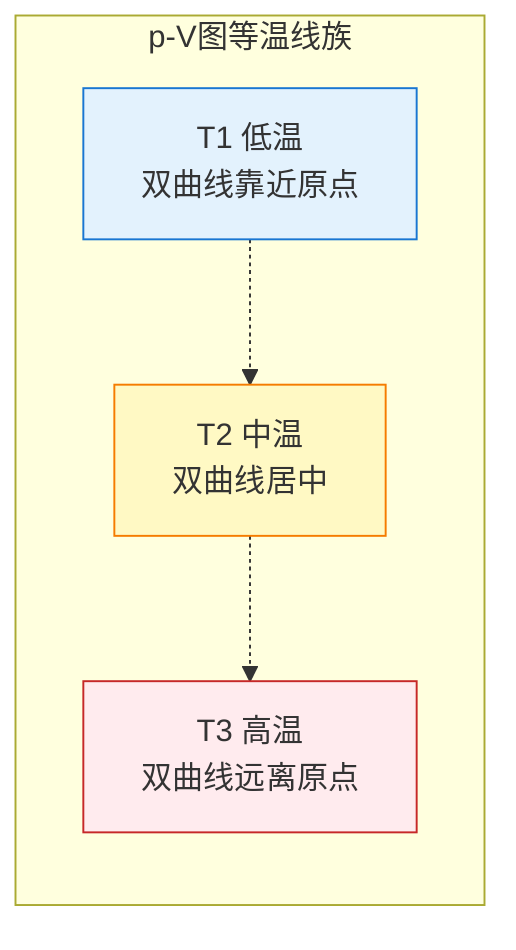

# 玻意耳定律

> [!abstract] 概览
> 本节是气体三大实验定律之首——==玻意耳定律==描述等温过程中一定质量气体的压强与体积成反比的规律，公式 $pV=C$（或 $p_1V_1=p_2V_2$）。本节系统讲解：等温过程的概念、玻意耳定律的内容与公式、适用条件（温度不变、质量不变、理想气体）、微观解释（温度不变分子平均动能不变，体积变小分子密度变大碰撞频率变大，压强变大）、$p$-$V$ 图等温线（双曲线，温度越高曲线越远离原点）、玻意耳定律的实验验证。==等温过程 $p$-$V$ 图分析是本节重点==，也是 [[05-气体图像]] 的核心内容之一。本节为 [[04-理想气体状态方程]] 在等温特例下的特殊形式，与 [[03-查理定律与盖-吕萨克定律]] 共同构成气体三大实验定律体系。

## 核心概念

### 一、等温过程

**等温过程**：气体在状态变化过程中==温度保持不变==的过程，即 $\Delta T=0$，初末状态 $T_1=T_2$。

等温过程的实现方式：
- 将气体置于恒温槽中（与恒温热源接触）；
- 过程进行得足够慢，使气体始终与外界达到热平衡（准静态过程）。

> [!note] 等温过程与内能
> 对理想气体（见 [[04-理想气体状态方程]]），内能仅由温度决定，故等温过程中==理想气体内能不变==，$\Delta U=0$。由 [[03-热力学定律/02-热力学第一定律]] $\Delta U=Q+W$，等温过程有 $Q=-W$——气体吸热全部用于对外做功，或外界做功全部放热。这是等温过程的能量特征。

### 二、玻意耳定律的内容

**玻意耳定律**：==一定质量的某种气体，在温度不变的情况下，压强 $p$ 与体积 $V$ 成反比==。

公式表达：

$$
\boxed{\,p \propto \dfrac{1}{V}\;\;\text{或}\;\;pV = C\,}
$$

或用初末状态表达：

$$
\boxed{\,p_1 V_1 = p_2 V_2\,}
$$

其中 $C$ 是常数（取决于气体的种类、质量、温度）；$p_1,V_1$ 是初态压强与体积，$p_2,V_2$ 是末态压强与体积。

> [!note] 常数 $C$ 的物理意义
> $C=pV$ 不是普适常数，而是==对一定种类、一定质量、一定温度的气体才不变==。气体质量越大、温度越高，$C$ 越大。当温度变化时 $C$ 也变化，玻意耳定律不再适用。

### 三、适用条件

玻意耳定律适用条件要求严格，==三条必须同时满足==：

1. **温度不变**：$T_1=T_2$（等温过程）；
2. **质量不变**：气体质量 $m$ 保持不变（无泄漏、无补充）；
3. **理想气体**：高温低压下实际气体接近理想气体；低温高压下偏离显著。

> [!warning] 适用条件易错点
> - 质量"不变"易被忽略：气体泄漏后剩余部分不能直接用 $p_1V_1=p_2V_2$（需用密度形式 $p_1/\rho_1=p_2/\rho_2$ 或分质量法）。
> - 温度"不变"需在题目明确说明或由情境判断（如"缓慢压缩"暗示等温）。
> - 高压下实际气体偏离玻意耳定律（如 $100\,\text{atm}$ 以上偏离明显）。

## 推导与原理

### 一、微观解释

玻意耳定律的微观本质可由 [[01-气体的状态参量]] 中的压强公式 $p=nkT$ 直接推出：

$$
p = n k T = \dfrac{N}{V} k T
$$

等温过程 $T$ 不变，气体质量不变即分子总数 $N$ 不变，故：

$$
pV = N k T = \text{const}
$$

这就直接得到了 $pV=C$。

#### 物理图景（更直观的微观解释）

- 温度不变 → 分子平均动能 $\bar{E}_k=\dfrac{3}{2}kT$ ==不变== → 单次碰撞器壁的冲量不变；
- 体积变小 → 分子数密度 $n=N/V$ ==变大== → 单位时间单位面积碰撞次数变多；
- 二者综合 → 压强 $p$ 变大，且 $p\propto n\propto 1/V$。

> [!example] 类比：弹珠碰撞器壁
> 想象容器内有 $N$ 个弹珠做完全弹性运动，每个弹珠速度大小不变（对应温度不变）。若容器体积缩小一半，弹珠密度增大一倍，单位时间内撞到器壁上的弹珠数也增大一倍，于是器壁承受的"压力"增大一倍——这就是 $p\propto 1/V$ 的直观图景。

### 二、与理想气体状态方程的关系

由 [[04-理想气体状态方程]] $PV=nRT$（$n$ 为摩尔数）：

等温过程 $T$ 不变，气体种类与质量不变即 $nR$ 不变，故：

$$
PV = nRT = \text{const}
$$

即 $p_1V_1=p_2V_2$。

可见玻意耳定律是==理想气体状态方程在等温条件下的特例==。这一关系将在 [[04-理想气体状态方程]] 中详细推导。

### 三、$p$-$V$ 图等温线

在 $p$-$V$ 图（横轴 $V$，纵轴 $p$）上，等温过程 $pV=C$ 是一条==双曲线==，称为**等温线**。

#### 1. 等温线的几何特征

- 双曲线，渐近于两坐标轴；
- $V\to 0$ 时 $p\to\infty$（实际气体在体积极小时偏离）；
- $V\to\infty$ 时 $p\to 0$；
- 双曲线上任一点 $pV$ 乘积相同。

#### 2. 不同温度下的等温线

温度越高，常数 $C=nRT$ 越大，双曲线==离原点越远==（在 $p$-$V$ 图上向右上方移动）。

#### 3. 等温线下的面积与功

等温过程中气体对外做功（或外界对气体做功）等于 $p$-$V$ 图上==过程曲线下的面积==：

$$
W = -\int_{V_1}^{V_2} p\,dV
$$

由 $p=C/V$：

$$
W = -C\int_{V_1}^{V_2}\dfrac{dV}{V} = -C\ln\dfrac{V_2}{V_1} = -nRT\ln\dfrac{V_2}{V_1}
$$

- $V_2>V_1$（膨胀）：$W<0$，气体对外做正功；
- $V_2<V_1$（压缩）：$W>0$，外界对气体做正功。

> [!tip] 高中阶段的要求
> 高中阶段不要求等温功的积分计算，但要求理解"==过程曲线下面积=功=="这一几何意义，并能比较不同过程做功大小（看面积）。这一概念在 [[05-气体图像]] 与 [[03-热力学定律/02-热力学第一定律]] 中深化。

### 四、玻意耳定律的实验验证

#### 经典实验：玻意耳-马略特实验

1662 年英国化学家玻意耳（R. Boyle）用 J 形玻璃管封闭一定量气体，通过加水银改变压强，测得 $pV$ 乘积近似不变。1676 年法国物理学家马略特（E. Mariotte）独立发表同样结论，故欧洲大陆称"玻意耳-马略特定律"。

#### 实验关键点

1. **温度不变**：实验在恒温环境中进行；
2. **质量不变**：J 形管封闭端气体质量恒定；
3. **缓慢操作**：加水银时缓慢进行，使气体始终与外界热平衡；
4. **数据采集**：测压强（水银柱高度差）与体积（封闭端气柱长度 × 截面积），计算 $pV$。

> [!example] 实验误差分析
> 实际测量中 $pV$ 不是严格不变，原因包括：①玻璃管非理想（存在吸附）；②水银蒸气压；③温度微小波动；④高压下气体偏离理想气体。这些误差在低温高压时显著，体现了"理想气体模型"的近似性。

## 典型实例与类比

### 实例 1：用吸管"吸"饮料（其实不是吸）

人嘴吸气，口腔气压减小，外界大气压通过吸管把饮料压上来。但若把吸管顶端密封后向上提，管内气体体积变大、压强变小（玻意耳定律），液柱会被大气压"顶"住——这就是经典"托里拆利管"的原理。

### 实例 2：打气筒与抽气机

- **打气筒**：活塞下压，气体体积减小，压强增大，气体被压入轮胎；
- **抽气机**：活塞上提，气体体积增大，压强减小，被抽容器中气体流入抽气腔；
- 二者都基于"等温条件下体积反比于压强"的原理（近似等温）。

### 实例 3：深海潜水员的"减压病"

潜水员在深水高压下呼吸压缩空气，体内溶解大量氮气。上浮过快时外界压强骤减，体内氮气析出形成气泡（玻意耳定律：压强减小体积增大），阻塞血管引发"减压病"。这要求潜水员分阶段减压上浮。

### 类比：$p$-$V$ 图像的"橡皮筋"模型

把 $pV=C$ 想象成一根橡皮筋：
- 把橡皮筋拉长（体积变大），张力（压强）变小；
- 把橡皮筋压缩（体积变小），张力（压强）变大；
- 二者乘积（弹性势能的某种类比）保持不变。

这与等温线"双曲线"的形态一致。

> [!tip] 记忆口诀
> ==等温过程看玻意耳，$pV$ 乘积定不变；体积小来压强大，双曲线族温越高远；微观 $nkT$ 一推导，质量温度双不变。==

## 例题

### 例 1：基础——活塞封闭气体等温压缩

**题目**：一端开口的均匀直玻璃管长 $L=100\,\text{cm}$，开口向上竖直放置时管内水银柱长 $h=20\,\text{cm}$ 封闭一定质量气体，气体柱长 $l_1=60\,\text{cm}$。外界大气压 $p_0=76\,\text{cmHg}$。现将管缓慢转至开口向下竖直放置，整个过程温度不变。求此时气体柱长 $l_2$。

**分析**：玻璃管转动过程缓慢，气体温度不变，可用玻意耳定律 $p_1V_1=p_2V_2$。设玻璃管横截面积为 $S$。

**初态**（开口向上）：气体压强 $p_1=p_0+\rho g h=76+20=96\,\text{cmHg}$，体积 $V_1=l_1 S=60S$。

**末态**（开口向下）：水银柱在上端，气体在下端封闭。气体压强 $p_2=p_0-\rho g h=76-20=56\,\text{cmHg}$，体积 $V_2=l_2 S$。

**解答**：由 $p_1V_1=p_2V_2$：
$$
96\times 60S = 56\times l_2 S
$$
$$
l_2 = \dfrac{96\times 60}{56} \approx 102.9\,\text{cm}
$$

但 $l_2\approx 102.9\,\text{cm}>L-h=80\,\text{cm}$，超出管长（气体柱 + 水银柱总长应为 $100\,\text{cm}$，气体柱最多 $80\,\text{cm}$），说明==水银会部分流出==！

修正：设末态水银柱长 $h'$，则 $l_2=L-h'=100-h'$，气体压强 $p_2=p_0-\rho g h'=76-h'$。由玻意耳定律：
$$
96\times 60 = (76-h')(100-h')
$$
展开：
$$
5760 = 7600 - 76h' - 100h' + h'^2 = 7600 - 176h' + h'^2
$$
$$
h'^2 - 176h' + 1840 = 0
$$
解得：
$$
h' = \dfrac{176\pm\sqrt{176^2-4\times 1840}}{2} = \dfrac{176\pm\sqrt{30976-7360}}{2}=\dfrac{176\pm\sqrt{23616}}{2}
$$
$\sqrt{23616}\approx 153.7$，取较小根（水银柱长合理值）：
$$
h' = \dfrac{176-153.7}{2}\approx 11.15\,\text{cm}
$$
故 $l_2=100-11.15\approx 88.85\,\text{cm}$。

**点评**：本题是"管口翻转"经典题型，==必须先判断水银是否溢出==——若按公式得 $l_2>L-h$ 则水银部分溢出，需重新设未知量。这类题考察物理判断力，纯代数运算易得荒谬答案。

### 例 2：中难——两段气柱的关联

**题目**：竖直放置的均匀玻璃管中，一段水银柱长 $h=10\,\text{cm}$ 把管内气体分成上下两段。上端封闭气体 A，下端封闭气体 B，水银柱在中间。系统温度不变。初始时大气压 $p_0=76\,\text{cmHg}$，A 段气柱长 $l_A=20\,\text{cm}$，B 段气柱长 $l_B=30\,\text{cm}$。现将管缓慢转至水平放置，求两段气柱后来的长度 $l_A'$、$l_B'$（设管足够长，水银不溢出）。

**分析**：管水平放置时水银柱两侧压强相等（水银柱水平时无压强差）：
$$
p_A' = p_B'
$$
对 A 段（上方气体），初态压强 $p_A=p_0-\rho g h=76-10=66\,\text{cmHg}$（A 在水银柱上方，水银柱压 B 不压 A？需重新判断）。

> [!warning] 受力方向再思考
> 题目描述"水银柱在中间"，但未明确 A 上 B 下还是 A 下 B 上。设 A 在上、B 在下：水银柱对 A 的压强向下（水银柱位于 A 上方？）。重新厘清：
> - 若 A 在上方（顶端封闭），水银柱在 A 下方，则 A 受水银柱支撑，$p_A$ 取决于具体几何。
> - 标准模型：A 在上端封闭，水银柱在 A 与 B 之间，B 在下端封闭。则水银柱对 A 产生向下压强，对 B 产生向上压强。

**厘清**：A 在上、水银柱在中、B 在下。则：
- A 上方封闭，下方接水银柱，水银柱下方的 B 压强为 $p_B=p_0+\rho g h$？需用平衡：水银柱底面（与 B 接触）压强 = $p_B$；水银柱顶面（与 A 接触）压强 = $p_A$；上下液面压强差 $p_B-p_A=\rho g h$。
- 由于下端 B 也封闭，B 的压强与大气压无直接联系。需另设未知数。

修正：题目应明确 B 是否与大气相通。常见题设：B 通过下端开口与大气相通，则 $p_B=p_0=76\,\text{cmHg}$，$p_A=p_B-\rho g h=76-10=66\,\text{cmHg}$。

设管水平后两段压强都为 $p'$（水银柱水平无压差），对 A、B 分别用玻意耳定律：
$$
p_A l_A S = p' l_A' S,\quad p_B l_B S = p' l_B' S
$$
另由几何约束（管总长不变）：
$$
l_A' + l_B' + h = l_A + l_B + h \;\Rightarrow\; l_A'+l_B' = l_A+l_B = 50\,\text{cm}
$$

**解答**：
$$
l_A' = \dfrac{p_A l_A}{p'}=\dfrac{66\times 20}{p'}=\dfrac{1320}{p'}
$$
$$
l_B' = \dfrac{p_B l_B}{p'}=\dfrac{76\times 30}{p'}=\dfrac{2280}{p'}
$$
求和：
$$
\dfrac{1320+2280}{p'}=50 \;\Rightarrow\; p'=\dfrac{3600}{50}=72\,\text{cmHg}
$$
故：
$$
l_A'=\dfrac{1320}{72}\approx 18.3\,\text{cm},\quad l_B'=\dfrac{2280}{72}\approx 31.7\,\text{cm}
$$

**点评**：两段气柱问题的关键是==寻找关联方程==：①玻意耳定律各列一次；②几何约束（总长不变）；③力学关联（水平时压强相等，竖直时压强差 $\rho g h$）。这三条联立即可求解。

### 例 3：进阶——气泡上浮等温膨胀

**题目**：湖底温度为 $7\,^{\circ}\text{C}$，湖面温度为 $17\,^{\circ}\text{C}$。一气泡从湖底缓慢上浮至湖面，体积变为原来的 $3.5$ 倍。已知湖底压强为 $p_{\text{底}}=p_0+\rho g h$（$p_0=1.0\times 10^5\,\text{Pa}$，水密度 $\rho=1.0\times 10^3\,\text{kg/m}^3$，$g=10\,\text{m/s}^2$），湖面压强为 $p_0$。若把过程近似视为等温（取平均温度），求湖深 $h$。

**分析**：题目要求"近似等温"，故用玻意耳定律 $p_{\text{底}}V_{\text{底}}=p_{\text{面}}V_{\text{面}}$。已知 $V_{\text{面}}=3.5V_{\text{底}}$，$p_{\text{面}}=p_0$，$p_{\text{底}}=p_0+\rho g h$。

**解答**：
$$
(p_0+\rho g h)V_{\text{底}}=p_0\times 3.5 V_{\text{底}}
$$
$$
p_0+\rho g h = 3.5 p_0 \;\Rightarrow\; \rho g h = 2.5 p_0
$$
$$
h = \dfrac{2.5 p_0}{\rho g}=\dfrac{2.5\times 1.0\times 10^5}{1.0\times 10^3\times 10}=25\,\text{m}
$$

**点评**：本题是玻意耳定律的"自然情境"应用。严格说温度变化需用理想气体状态方程（$\dfrac{pV}{T}=C$），但题目明确"近似等温"故用玻意耳定律。读者可自行尝试用完整状态方程校核（结果略有差异，但量级一致）。气泡上浮问题联系 [[03-热力学定律/02-热力学第一定律]]——气泡膨胀对外做功，能量来自气体本身内能变化（若非等温）。

## 易错提醒

> [!warning] 易错点
> 1. **温度单位**：玻意耳定律本身要求等温，温度不变，故公式中不显含 $T$。但判断"等温"时需注意温度必须用 $T$（K）描述。
> 2. **质量不变**：玻意耳定律要求气体质量不变。气体泄漏后不能直接用 $p_1V_1=p_2V_2$，需用密度形式 $p_1/\rho_1=p_2/\rho_2$（一定质量气体的 $V=m/\rho$ 代入 $pV=C$ 得 $pm/\rho=C$，即 $p/\rho=C/m$）。
> 3. **管口翻转水银溢出**：玻璃管翻转题必须先判断水银是否溢出，超出管长需重新设未知量。
> 4. **压强单位**：$p$-$V$ 乘积的单位要与 $p$、$V$ 单位匹配。如 $p$ 用 $\text{atm}$，$V$ 用 $\text{L}$，则 $pV$ 单位为 $\text{atm}\cdot\text{L}$；用 SI 制则 $p$ 为 $\text{Pa}$，$V$ 为 $\text{m}^3$，$pV$ 为 $\text{J}$。
> 5. **等温线判断**：$p$-$V$ 图上等温线为双曲线，不是直线。$p$ 与 $1/V$ 才是过原点的直线（线性化方法）。
> 6. **实际气体偏离**：高压低温下实际气体偏离玻意耳定律，$pV$ 不再是常数（见 [[04-理想气体状态方程]] 中范德瓦尔斯方程）。

> [!note] 概念辨析
> **等温过程 vs 绝热过程**：等温过程 $T$ 不变，与外界有热交换（$Q\ne 0$）；绝热过程 $Q=0$，与外界无热交换，温度变化。二者不能混淆。绝热过程满足 $pV^\gamma=C$（$\gamma$ 为绝热指数），压强随体积变化比等温过程更剧烈。这是 [[04-理想气体状态方程]] 的拓展内容。
>
> **玻意耳定律 vs 查理定律**：玻意耳定律是等温过程 $pV=C$；查理定律是等容过程 $p/T=C$。两者固定不同变量，公式形式完全不同。

## 与其他知识关联

- 与 [[01-气体的状态参量]] 的关系：玻意耳定律是状态参量 $p$、$V$、$T$ 之间关系的第一个特例（$T$ 不变），状态参量是定律的基础。
- 与 [[03-查理定律与盖-吕萨克定律]] 的关系：查理定律、盖-吕萨克定律是分别固定 $V$、$p$ 的另外两个实验定律，三者构成完整体系。
- 与 [[04-理想气体状态方程]] 的关系：玻意耳定律是 $PV=nRT$ 在 $T$ 不变时的特例，状态方程统一三定律。
- 与 [[05-气体图像]] 的关系：等温线是 $p$-$V$ 图上的双曲线，是气体图像分析的核心内容。
- 与 [[03-热力学定律/02-热力学第一定律]] 的关系：等温过程 $\Delta U=0$，故 $Q=-W$，是热力学第一定律的典型应用。
- 与 [[01-分子动理论/02-分子热运动与布朗运动]] 的关系：温度不变对应分子平均动能不变，是玻意耳定律的微观基础。
- 与 [[01-分子动理论/04-内能与分子动能]] 的关系：理想气体内能仅与温度有关，等温过程 $\Delta U=0$。
- 大学层面延伸：[[热力学]] 中等温过程是四大典型过程之一，配合等压、等容、绝热构成完整图景；[[统计物理]] 中玻意耳定律可由理想气体配分函数严格推导。
- 返回 [[00-热学总览]]

## 作者的话

> [!quote] 个人理解
> 玻意耳定律是气体实验定律中==最古老、最直观==的一条——它直接对应"用力压缩注射器，活塞越压越费劲"的日常经验。但这条简单规律背后，蕴含着深刻的统计思想：
>
> - ==宏观规律是微观统计的平均效果==：$pV=C$ 看似简单的反比关系，本质是大量分子无规则碰撞的统计平均——温度不变意味着分子平均动能不变，体积变化改变了分子数密度，进而改变了碰撞频率。这种"宏观简单，微观复杂"的对比，是热学最迷人的地方。
>
> - ==实验定律的近似性==：玻意耳定律在高温低压下严格成立，但在低温高压下偏离显著。这揭示了"理想气体"是一种抽象模型，实际气体需要用范德瓦尔斯方程修正（考虑分子体积与分子间作用力）。学习定律时既要会用，也要理解其适用范围——这种"定律 + 适用条件"的范式，是物理学方法的精髓。
>
> - ==图像思维的重要性==：$p$-$V$ 图上的等温双曲线不仅是几何对象，更是物理过程的"轨迹"。学会用图像分析气体过程，是 [[05-气体图像]] 的核心目标。建议读者在学完本节后立即学习气体图像，把"代数方程"与"几何图像"两条线索统一起来。
>
> 一个值得深思的细节：玻意耳定律 $pV=C$ 与理想气体状态方程 $PV=nRT$ 在 $T$ 不变时形式相同，但物理意义不同——前者是实验定律（从实验归纳），后者是理论方程（由模型推导）。这种"实验归纳 → 理论推导"的认识过程，正是物理学发展的典型路径。从玻意耳（1662）到克拉珀龙（1834），中间经历了 172 年的物理思想积淀。理解这一历史脉络，比记住一个公式更有意义。

---
*返回 [[00-热学总览]]*
